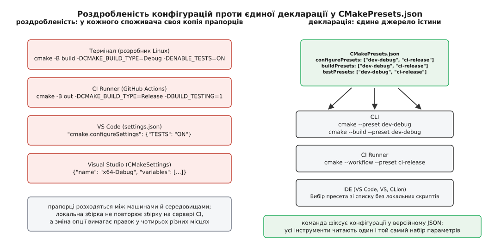
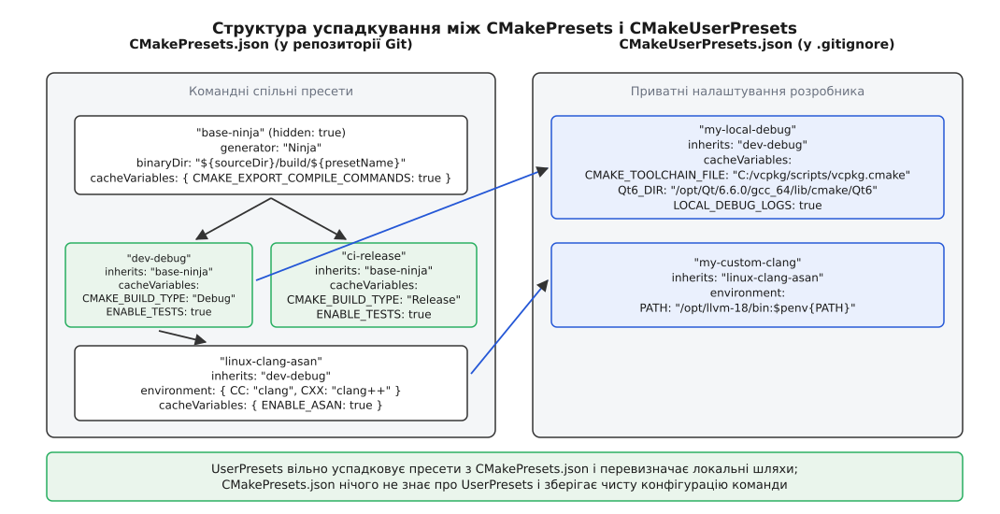
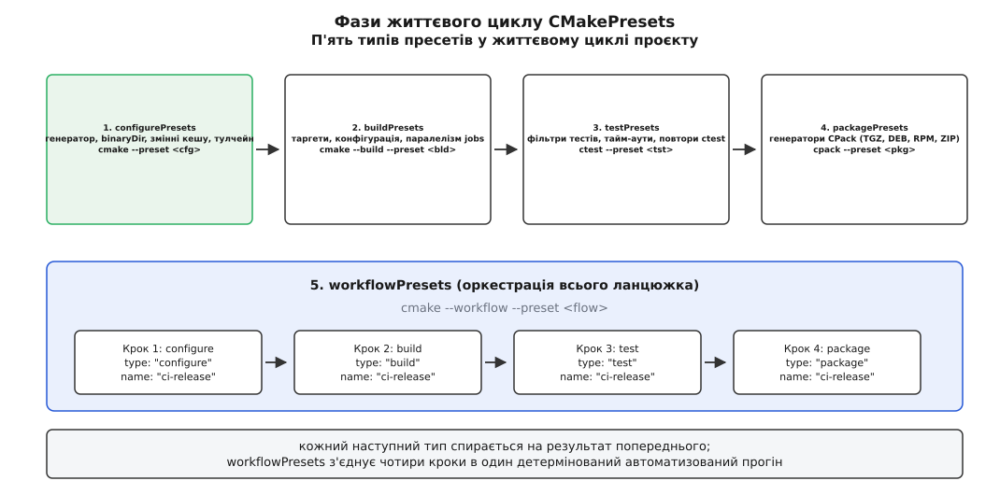
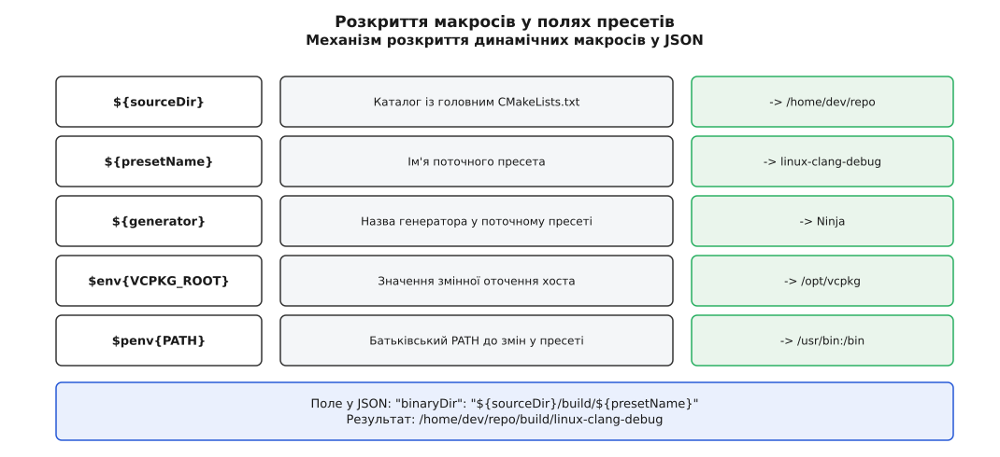

# CMakePresets: конфігурації як декларація

<preknowlist>
- [Конфігурація, генерація і збірка](root:sys-bsystem/configure-and-generate) — три окремі моменти часу: коли CMake читає файли, коли генерує код для нативного збирача і коли працює компілятор.
- [Мова CMakeLists](root:sys-bsystem/cmake-language) — як інтерпретатор CMake обробляє змінні, кеш та параметри команд.
- [Кеш CMake і опції](root:sys-bsystem/cache-and-options) — як файл CMakeCache.txt зберігає конфігурацію між прогонами і чому аргументи `-D` перезаписують кеш.
- [Цілі й властивості замість глобальних змінних](root:sys-bsystem/targets-and-properties) — чому опис артефактів інкапсулюється в цілі, а не розмазується глобальними прапорцями.
- [Файл тулчейна](root:sys-bsystem/cmake-toolchain-file) — як CMake налаштовують для крос-компіляції та підключення менеджерів пакетів.
- [CTest](root:sys-bsystem/ctest) — реєстрація тестів і передача параметрів тестовому рушію.
</preknowlist>

Команда з п'яти інженерів працює над кросплатформною бібліотекою обробки сигналів. Щоб зібрати релізну версію проєкту з увімкненими тестами, оптимізацією під AVX2 та підключеним через vcpkg пакетом OpenSSL, розробник у терміналі Linux вводить такий рядок:

```bash
cmake -B build/release -S . -G Ninja \
  -DCMAKE_BUILD_TYPE=Release \
  -DCMAKE_TOOLCHAIN_FILE=/home/dev/vcpkg/scripts/buildsystems/vcpkg.cmake \
  -DENABLE_SIMD_AVX2=ON \
  -DENABLE_TESTS=ON \
  -DENABLE_BENCHMARKS=OFF \
  -DLOG_LEVEL=INFO
```

Колега на Windows збирає той самий репозиторій у Visual Studio через генератор MSBuild, інженер на macOS запускає збірку у VS Code через розширення CMake Tools, а сервер безперервної інтеграції виконує автоматичне тестування в контейнері GitHub Actions. За місяць у проєкті змінюється назва однієї опції: `ENABLE_TESTS` перейменовують на `BUILD_TESTING`. Розробник Linux оновлює свій локальний командний рядок, але забуває попередити решту команди. У результаті сервер CI продовжує збирати проєкт зі старим прапорцем, тихо вимикає запуск тестів і пропускає критичну регресію в головну гілку, тоді як у Visual Studio збірка взагалі падає через невідому конфігурацію кешу.

Причина цієї проблеми полягає не в неуважності розробників. Вона полягає у фундаментальному розриві між внутрішньою моделлю системи збірки та способом, яким зовнішній світ передає їй параметри запуску.

## Чому командний рядок не масштабується

Будь-який виклик утиліти `cmake` у терміналі є принципово безстановою операцією. Доки рушій не розібрав аргументи й не записав перші значення у файл `CMakeCache.txt` усередині каталогу збірки, він не знає про ваші наміри нічого. Усі параметри — вибір генератора, шляхи до вихідних сирців і каталогу збірки, змінні компілятора, налаштування санітизаторів та шляхи до зовнішніх тулчейнів — мають бути передані в єдиному довгому виклику.

Коли кількість параметрів перетинає десяток, розробники неминуче намагаються автоматизувати цей процес. Проте замість усунення складності вони розмножують її:

1. **Імперативні скрипти-обгортки:** команда створює файл `build.sh` для Unix-систем та `build.bat` або `build.ps1` для Windows. Обидва файли містять однаковий за змістом виклик `cmake`, але написані різними скриптовими мовами. Вони приховують справжній інтерфейс CMake за непрозорою оболонкою, ламаються при зміні шляхів і не можуть бути автоматично прочитані жодним редактором коду.
2. **Пропрієтарні конфігураційні файли IDE:** щоб надати зручний графічний вибір конфігурацій, кожне інтегроване середовище колись винайшло власний формат. Visual Studio використовувала `CMakeSettings.json`, VS Code — `cmake-kits.json` та `.vscode/settings.json`, а CLion зберігав профілі у власних XML-файлах каталогу `.idea`. Жоден із цих файлів не розумів синтаксису іншого, і жоден не підходив для запуску на сервері автоматичної збірки без графічного інтерфейсу.
3. **Розходження конфігурацій (конфігураційний дрифт):** коли налаштування дублюються у трьох різних файлах середовищ розробки, двох скриптах запуску та конфігураційному YAML-файлі CI, їхня синхронізація стає неможливою. Будь-яка зміна прапорця вимагає одночасного редагування кількох несумісних форматів.



*Роздробленість: кожен інструмент вимагає власного опису параметрів, що спричиняє розходження конфігурацій; декларація: єдиний JSON-файл виступає джерелом істини для CLI, CI та IDE.*

Щоб подолати цей хаос, система збірки потребувала стандартного, машиночитного та незалежного від конкретної платформи формату, який описував би параметри запуску як структуровані дані. Цим механізмом став `CMakePresets.json`, детальна історія появи та стандартизації якого описана окремо: [історія появи пресетів у CMake](root:sys-bsystem/cmake-presets/hist-cmake-presets.md).

## Декларація замість імперативних сценаріїв

Ідея пресетів полягає у перенесенні всієї інформації про запуск конфігуратора з командного рядка або зовнішніх скриптів у стандартний декларативний файл формату JSON, який сам CMake розбирає нативно.

Замість введення довгого ланцюжка прапорців розробник дає кожному типовому сценарію збірки коротке унікальне ім'я — **пресет** (англ. *preset* — попередньо встановлений набір параметрів). Тепер виклик конфігуратора зводиться до єдиного аргументу:

```bash
cmake --preset release
```

Отримавши цей ключ, CMake сам знаходить у корені проєкту файл `CMakePresets.json`, вичитує блок конфігурації з іменем `release`, автоматично підставляє зазначений у ньому генератор, виставляє каталог збірки, завантажує тулчейн, прописує всі змінні кешу й оточення та запускає фазу конфігурації.

Оскільки специфікація пресетів стандартизована за допомогою суворої схеми JSON Schema, цей файл однаково розуміють усі учасники процесу:
- **Утиліта командного рядка `cmake`** читає пресет безпосередньо у терміналі чи консолі сервера.
- **Сервер безперервної інтеграції (CI)** викликає ту саму команду `cmake --preset <назва>`, усуваючи необхідність підтримувати багаторядкові сценарії збірки у YAML-файлах.
- **Редактори та IDE** (Visual Studio, VS Code, CLion, Qt Creator) автоматично знаходять пресети у файлі, заповнюють ними випадаючі списки конфігурацій і дозволяють розробникові перемикатися між режимами Debug та Release в один клік миші без створення жодних пропрієтарних налаштувань.

## Два файли: спільний канон та особистий простір

Практика командної розробки висуває до системи конфігурацій дві взаємовиключні вимоги. З одного боку, командні конфігурації (наприклад, прапорці оптимізації релізу, рівні суворості компілятора та обов'язкові санітизатори) мають бути єдиними для всіх і суворо версіонуватися в Git. З іншого боку, кожен розробник має на своїй машині унікальні шляхи: один встановив бібліотеку Qt у `/opt/Qt/6.6.0`, інший тримає тулчейн vcpkg на диску `D:\vcpkg`, а третій користується локальним кешем компілятора ccache.

Якщо зберегти локальні шляхи у спільному файлі репозиторію, збірка негайно зламається у колег. Якщо ж заборонити вказувати локальні шляхи зовсім, розробник втратить можливість налаштувати проєкт під свою робочу станцію.

CMake розв'язує це протиріччя за допомогою жорсткого розділення конфігурацій на два паралельних файли:

1. **`CMakePresets.json` — канонічні командні пресети:**
   - Зберігається у корені проєкту поруч із головним `CMakeLists.txt`.
   - Обов'язково комітиться до системи контролю версій Git.
   - Описує спільні для всієї команди та серверів CI цільові конфігурації: `dev-debug`, `ci-linux-release`, `asan-test`, `release-package`.
   - Не повинен містити абсолютних шляхів, специфічних для конкретної машини.
2. **`CMakeUserPresets.json` — приватні локальні перевизначення:**
   - Знаходиться у тому самому каталозі, але додається до списку ігнорування `.gitignore`.
   - Створюється розробником вручну або генерується менеджерами пакетів (такими як Conan чи vcpkg) на конкретній машині.
   - Містить локальні шляхи до SDK, приватні змінні оточення та персональні пресети налагодження.



*Архітектура двох файлів: спільний версійний CMakePresets.json містить базові пресети команди; локальний CMakeUserPresets.json успадковує їх і безпечно додає специфічні шляхи розробника.*

### Механізм одностороннього зв'язку

Взаємодія між цими двома файлами підпорядковується фундаментальному правилу односторонньої видимості:

- Пресети у файлі `CMakeUserPresets.json` можуть вільно успадковувати будь-які пресети з файлу `CMakePresets.json` за допомогою поля `inherits`.
- Пресети у файлі `CMakePresets.json` **ніколи не можуть бачити або успадковувати** пресети з `CMakeUserPresets.json`. Спроба послатися на користувацький пресет із головного файлу призводить до фатальної помилки валідації.

Завдяки цьому командний репозиторій залишається чистим і самодостатнім: проєкт гарантовано збирається на чистому сервері без залишків чужих локальних налаштувань.

## П'ять фаз життєвого циклу — п'ять типів пресетів

Процес створення програмного забезпечення в екосистемі CMake складається з чітких послідовних етапів. Неможливо запустити компіляцію, не згенерувавши файли збірки; неможливо запустити тести, не скомпільувавши тестові бінарні файли; неможливо зібрати інсталятор, не отримавши готові цілі.

Специфікація пресетів чітко повторює цю модель, розділяючи конфігурації на п'ять спеціалізованих категорій. Кожна категорія відповідає окремій підсистемі CMake:

```
[ configurePresets ] ──► [ buildPresets ] ──► [ testPresets ] ──► [ packagePresets ]
         ▲                        ▲                   ▲                    ▲
         └────────────────────────┴─────────┬─────────┴────────────────────┘
                                            │
                                  [ workflowPresets ]
```



*П'ять фаз життєвого циклу: кожна наступна фаза спирається на результати попередньої, а workflowPresets об'єднує їх в єдиний детермінований автоматизований конвеєр.*

### 1. Пресети конфігурації (`configurePresets`)

Пресет конфігурації є фундаментом усього дерева налаштувань. Він відповідає першому виклику `cmake -S . -B build` і формує внутрішню модель проєкту.

Головні обов'язки `configurePresets`:
- Вибір генератора (`generator`): `"Ninja"`, `"Unix Makefiles"`, `"Visual Studio 17 2022"`, `"Ninja Multi-Config"`.
- Визначення цільового каталогу збірки (`binaryDir`): наприклад, `"${sourceDir}/build/${presetName}"`.
- Ініціалізація змінних кешу (`cacheVariables`): типізовані пари ключ-значення, що лягають у `CMakeCache.txt`.
- Налаштування тулчейна (`toolchainFile`): шлях до файлу компіляторів для крос-компіляції чи менеджера пакетів.
- Керування змінними середовища (`environment`): виставляє тимчасові змінні процесу (наприклад, `CC`, `CXX`, `PATH`).
- Архітектура та набір інструментів (`architecture`, `toolset`): передача параметрів цільової платформи для генераторів Visual Studio та Xcode.

```json
{
  "name": "linux-ninja-debug",
  "displayName": "Linux Ninja Debug",
  "generator": "Ninja",
  "binaryDir": "${sourceDir}/build/${presetName}",
  "cacheVariables": {
    "CMAKE_BUILD_TYPE": "Debug",
    "CMAKE_EXPORT_COMPILE_COMMANDS": true,
    "BUILD_TESTING": true
  }
}
```

### 2. Пресети збірки (`buildPresets`)

Пресет збірки інкапсулює параметри фази компіляції та лінкування, відповідаючи виклику `cmake --build`.

Оскільки компіляція не може відбуватися у порожнечі, кожен пресет збірки зобов'язаний посилатися на відповідний пресет конфігурації через обов'язкове поле `configurePreset`. З цього поля збирач дізнається, у якому саме каталозі `binaryDir` знаходяться згенеровані файли збірки.

Ключові можливості `buildPresets`:
- Вибір конкретної конфігурації (`configuration`): критично для багатоконфігураційних генераторів (Visual Studio, Ninja Multi-Config), де один каталог містить опис як для `Debug`, так і для `Release`.
- Вибір конкретних цілей для збірки (`targets`): дозволяє скомпілювати лише окрему бібліотеку або виконуваний файл замість усього дерева проєкту.
- Керування паралелізмом (`jobs`): обмежує кількість одночасних потоків процесора під час компіляції (`--parallel`).
- Передача прапорців рідному збирачу (`nativeToolOptions`): аргументи, що йдуть після розділювача `--` безпосередньо утилітам Ninja, Make або MSBuild (наприклад, `["-k", "0"]` для продовження збірки після першої помилки).

```json
{
  "name": "build-app-debug",
  "displayName": "Build Application",
  "configurePreset": "linux-ninja-debug",
  "targets": ["app_executable"],
  "jobs": 8
}
```

### 3. Пресети тестування (`testPresets`)

Пресет тестування керує запуском модульних та інтеграційних тестів за допомогою утиліти `ctest`. Він також прив'язується до пресета конфігурації через поле `configurePreset`.

Ключові можливості `testPresets`:
- Фільтрація тестового набору (`filter`): вибір тестів за назвою (`name`), регулярним виразом або спеціальними мітками (`label`), присвоєними командами CMake `set_tests_properties(... PROPERTIES LABELS ...)`.
- Керування виконанням (`execution`): паралельний прогін тестів у кілька потоків (`jobs`), індивідуальні таймаути на кожен тест (`timeout`), зупинка після першого падіння (`stopOnFailure`) та налаштування автоматичних повторів (`repeat`) для виявлення нестабільних тестів.
- Керування виводом (`output`): автоматичний друк логів падіння у консоль (`outputOnFailure`) та експорт звіту у форматі XML JUnit (`outputJUnitFile`) для побудови графіків у панелях CI.

```json
{
  "name": "fast-unit-tests",
  "displayName": "Run Unit Tests",
  "configurePreset": "linux-ninja-debug",
  "filter": {
    "include": { "label": "unit" },
    "exclude": { "name": "slow_network_.*" }
  },
  "execution": {
    "stopOnFailure": true,
    "jobs": 4,
    "timeout": 15
  },
  "output": {
    "outputOnFailure": true
  }
}
```

### 4. Пресети пакування (`packagePresets`)

Пресет пакування відповідає виклику утиліти `cpack` і керує створенням дистрибутивів проєкту: інсталяційних пакетів Debian (`.deb`), RPM-пакетів, Windows-інсталяторів NSIS або стиснених архівів `.tar.gz` та `.zip`.

Ключові можливості `packagePresets`:
- Вибір генераторів CPack (`generators`): список цільових форматів пакетів.
- Каталог виводу (`packageDirectory`): шлях, куди складаються згенеровані інсталятори.
- Версіонування та назва (`packageName`, `packageVersion`): явне завдання імені та номера релізу без зміни файлів проєкту.
- Налаштування змінних CPack (`variables`): параметри пакетів (наприклад, контакти супровідника, ліцензія, секція дистрибутива).

```json
{
  "name": "release-tgz-package",
  "displayName": "Generate Source TGZ",
  "configurePreset": "linux-ninja-debug",
  "generators": ["TGZ"],
  "packageDirectory": "${sourceDir}/dist"
}
```

### 5. Пресети робочих процесів (`workflowPresets`)

Пресет робочого процесу є вершиною автоматизації. Він дозволяє об'єднати виконання послідовного ланцюжка кроків (конфігурація -> збірка -> тестування -> пакування) в єдину неподільну операцію, що запускається однією командою:

```bash
cmake --workflow --preset full-ci-cycle
```

В описі пресета робочого процесу задається масив `steps`. Першим кроком обов'язково є крок із типом `configure`. Кожен наступний крок має тип `build`, `test` або `package` і посилається на ім'я відповідного пресета. Якщо будь-який крок конвеєра зазнає аварії, виконання негайно припиняється, а утиліта повертає ненульовий код помилки.

```json
{
  "name": "full-ci-cycle",
  "displayName": "Full CI Validation Cycle",
  "steps": [
    { "type": "configure", "name": "linux-ninja-debug" },
    { "type": "build", "name": "build-app-debug" },
    { "type": "test", "name": "fast-unit-tests" }
  ]
}
```

Повний структурований довідник усіх допустимих полів кожного типу пресета, версій схем від 1 до 8 та блоків логічних умов зібрано окремо: [довідка схеми CMakePresets](root:sys-bsystem/cmake-presets/api-presets-schema.md).

## Успадкування пресетів та композиція

У великих проєктах комбінація параметрів стрімко зростає. Розробникам потрібні конфігурації Debug та Release, кілька різних компіляторів (GCC, Clang, MSVC), збірки з адресним санітизатором (ASan), збірки під різні цільові архітектури (x86_64, ARM64) та спеціальні режими для генерації покриття коду.

Якби кожен пресет описувався з нуля, файл `CMakePresets.json` перетворився б на тисячі рядків дубльованого коду. Щоб уникнути цього, у пресетах реалізовано механізм успадкування `inherits` із підтримкою абстрактних базових блоків.

### Приховані пресети (`"hidden": true`)

Якщо пресет містить спільні для всіх налаштування (наприклад, вибір генератора Ninja, увімкнення генерації бази компіляції `compile_commands.json` та вибір базової структури каталогів), але сам по собі не є повноцінною конфігурацією збірки, його оголошують як прихований:

```json
{
  "name": "base-ninja",
  "hidden": true,
  "generator": "Ninja",
  "binaryDir": "${sourceDir}/build/${presetName}",
  "cacheVariables": {
    "CMAKE_EXPORT_COMPILE_COMMANDS": true
  }
}
```

Поле `"hidden": true` гарантує, що пресет не з'явиться у випадаючому меню IDE та не зможе бути помилково запущений у консолі. Він існує виключно як базовий будівельний блок для інших пресетів.

### Правила злиття та множинне успадкування

Пресет може успадковувати налаштування від одного або кількох батьківських пресетів через масив `inherits`:

```json
{
  "name": "linux-clang-asan-debug",
  "displayName": "Linux Clang ASan Debug",
  "inherits": ["base-ninja", "compiler-clang", "flags-asan"],
  "cacheVariables": {
    "CMAKE_BUILD_TYPE": "Debug"
  }
}
```

Під час завантаження такого пресета рушій CMake застосовує строгі правила об'єднання властивостей:

1. **Скалярні поля (рядки, числа, булеві прапорці):** значення дочірнього пресета завжди перекриває батьківське. Якщо кілька батьківських пресетів містять одне й те саме поле, перемагає значення останнього батька у списку `inherits`.
2. **Словники змінних (`cacheVariables`, `environment`):** словники зливаються. Ключі, оголошені в різних батьківських пресетах, об'єднуються в один підсумковий набір. Якщо виникає конфлікт ключів, значення береться з дочірнього пресета, або з останнього оголошеного батька. Якщо у дочірньому пресеті значенню змінної середовища присвоїти `null`, ця змінна повністю видаляється з підсумкового оточення.
3. **Списки (`targets`, `nativeToolOptions`):** список дочірнього пресета повністю замінює список батьківського.

Ця модель дозволяє будувати лаконічні ортогональні матриці конфігурацій, комбінуючи базові платформи, набори компіляторів і типи оптимізації без жодного рядка дублювання коду.

## Макроси заміни: динамічні та переносні шляхи

Головна вимога до файлу `CMakePresets.json` — його повна переносність. Файл повинен коректно працювати на будь-якому комп'ютері незалежно від того, в яку саме папку розробник схилонував репозиторій.

Жорстко зашиті абсолютні шляхи на кшталт `/home/user/project/build` у спільному репозиторії суворо заборонені. Для формування динамічних шляхів у всіх рядкових полях JSON передбачено спеціальні макроси заміни.



*Розкриття макросів: динамічні змінні замінюються реальними абсолютними шляхами файлової системи під час завантаження JSON.*

Найважливіші макроси динамічної підстановки:

- **`${sourceDir}`** — абсолютний шлях до каталогу з кореневим файлом `CMakeLists.txt`. Це головний якір для всіх відносних шляхів проєкту.
- **`${sourceParentDir}`** — шлях до батьківського каталогу вихідного дерева, що дозволяє організовувати структури каталогів поза межами репозиторію.
- **`${sourceDirName}`** — назва каталогу репозиторію без повного шляху.
- **`${presetName}`** — назва пресета, який зараз обчислюється. Використання виразу `"${sourceDir}/build/${presetName}"` у полі `binaryDir` гарантує, що кожен пресет отримає власний ізольований каталог збірки й ніколи не затре артефакти сусіднього пресета.
- **`${generator}`** — назва генератора, зазначена для поточного пресета.
- **`${hostSystemName}`** — назва операційної системи хоста (`Linux`, `Windows`, `Darwin`). Дозволяє умовно адаптувати налаштування під поточну ОС.
- **`${fileDir}`** — каталог, у якому фізично розташований поточний JSON-файл (запроваджено у версії 4). Це критично для файлів, підключених через директиву `include`, коли шляхи мають відраховуватися від місця збереження модуля, а не від кореня головного проєкту.
- **`$env{<ЗМІННА>}`** — читає значення змінної середовища поточної сесії операційної системи. Якщо змінна не задана на машині, макрос розкривається у порожній рядок.
- **`$penv{<ЗМІННА>}`** — читає значення батьківської змінної середовища до того, як її змінить блок `environment` поточного пресета. Це незамінно під час модифікації системного `PATH`:
  ```json
  "environment": {
    "PATH": "/opt/custom-llvm/bin:$penv{PATH}"
  }
  ```
- **`${dollar}`** — літеральний символ долара `$`. Використовується для екранування, якщо у значення потрібно передати справжній знак долара без його інтерпретації як макроса.

## Модульність та умовні вирази: масштабування конфігурацій

У великих проєктах монолітний файл `CMakePresets.json` може розростатися до сотень рядків. Для підтримки чистоти архітектури CMake пропонує два потужних механізми: модульне підключення файлів та логічні умови активації.

### Модульне підключення (`include`)

Починаючи зі схеми версії 4, у пресетах з'явилася директива `include`. Вона дозволяє розбити єдиний конфігураційний файл на логічні частини:

```json
{
  "version": 8,
  "cmakeMinimumRequired": { "major": 3, "minor": 28, "patch": 0 },
  "include": [
    "cmake/presets/platforms.json",
    "cmake/presets/compilers.json",
    "cmake/presets/ci.json"
  ],
  "configurePresets": [
    {
      "name": "default",
      "inherits": "linux-ninja-debug"
    }
  ]
}
```

Кожен підключений файл може містити власні пресети конфігурації, збірки чи тестування. Завдяки макросу `${fileDir}` шляхи до допоміжних файлів (наприклад, тулчейнів чи скриптів) усередині підключених модулів залишаються локальними щодо самого модуля, не залежачи від розташування головного файлу пресетів.

### Логічні умови активації (`condition`)

Починаючи зі схеми версії 8, пресети отримали повноцінний механізм логічних умов `condition`. Це дозволяє утримувати кросплатформні конфігурації в єдиному файлі репозиторію без необхідності штучного дублювання пресетів для різних операційних систем:

```json
{
  "name": "ci-sanitizers",
  "displayName": "CI Sanitizers Build",
  "inherits": "base-ninja",
  "condition": {
    "type": "allOf",
    "conditions": [
      {
        "type": "notEquals",
        "lhs": "${hostSystemName}",
        "rhs": "Windows"
      },
      {
        "type": "equals",
        "lhs": "$env{GITHUB_ACTIONS}",
        "rhs": "true"
      }
    ]
  },
  "cacheVariables": {
    "ENABLE_ASAN": true,
    "ENABLE_UBSAN": true
  }
}
```

Якщо пресет завантажується на машині Windows або поза середовищем GitHub Actions, умова обчислюється як хибна (`false`). Такий пресет стає повністю невидимим для утиліти командного рядка та середовищ розробки, запобігаючи випадковому запуску несумісних конфігурацій.

## Взаємодія з менеджерами пакетів та тулчейнами

Одним із найпотужніших застосувань `CMakePresets.json` у сучасній інженерній практиці є інтеграція з менеджерами залежностей C++ — такими як `vcpkg` та `Conan 2.0`. До появи пресетів підключення стороннього тулчейна вимагало від кожного розробника введення абсолютного шляху до файлу інтеграції у командному рядку.

У системі vcpkg під час використання режиму маніфесту (`vcpkg.json`) спільний пресет у репозиторії фіксує відносний або стандартний шлях до файлу інтеграції:

```json
{
  "name": "vcpkg-base",
  "hidden": true,
  "cacheVariables": {
    "CMAKE_TOOLCHAIN_FILE": {
      "type": "FILEPATH",
      "value": "$env{VCPKG_ROOT}/scripts/buildsystems/vcpkg.cmake"
    }
  }
}
```

Якщо на машині розробника змінна середовища `VCPKG_ROOT` не налаштована або vcpkg встановлено у специфічний каталог (наприклад, `C:/tools/vcpkg`), розробник не змінює командний файл. Замість цього він створює локальний запис у `CMakeUserPresets.json`, який перекриває змінну кешу:

```json
{
  "version": 8,
  "configurePresets": [
    {
      "name": "my-local-debug",
      "inherits": "linux-ninja-debug",
      "cacheVariables": {
        "CMAKE_TOOLCHAIN_FILE": "C:/tools/vcpkg/scripts/buildsystems/vcpkg.cmake"
      }
    }
  ]
}
```

Менеджер `Conan 2.0` робить ще більший крок уперед: генератор `CMakeToolchain` у Conan автоматично створює готовий файл `CMakeUserPresets.json` прямо під час команди `conan install`. Цей згенерований файл автоматично імпортує канонічний `CMakePresets.json` проєкту, створює похідні конфігурації з префіксом `conan-` та прописує точні шляхи до згенерованих файлів конфігурацій залежностей `find_package`. Розробникові залишається лише виконати `cmake --preset conan-debug`.

## Змінні кешу проти змінних оточення

Початківці нерідко плутають два різних механізми передачі параметрів у пресетах: словник `cacheVariables` та словник `environment`. Розуміння різниці між ними є критичним для стабільності збірки.

| Параметр | `cacheVariables` | `environment` |
| :--- | :--- | :--- |
| **Куди потрапляє значення** | Записується безпосередньо у файл `CMakeCache.txt`. | Виставляється у таблицю змінних середовища операційної системи дочірнього процесу. |
| **Життєвий цикл** | Зберігається на диску між прогонами конфігурації. | Зникає одразу після завершення процесу збірки. |
| **Доступ у `CMakeLists.txt`** | Читається як звичайна змінна CMake: `${MY_OPTION}`. | Читається через спеціальний синтаксис: `$ENV{MY_VAR}`. |
| **Типізація** | Має строгий тип: `BOOL`, `STRING`, `PATH`, `FILEPATH`. | Завжди є нетипізованим текстовим рядком. |
| **Призначення** | Налаштування логіки збірки проєкту (опції, стандарти C++, прапорці цілей). | Налаштування системного оточення (пошук компіляторів `CC`/`CXX`, розширення `PATH`). |

Коли CMake обробляє блок `cacheVariables`, він записує зазначені пари безпосередньо до файлу `CMakeCache.txt` під час першої ініціалізації каталогу збірки. Якщо змінна оголошена як розгорнутий об'єкт із типом `"BOOL"`, CMake коректно розпізнає її булеву природу для графічних інтерфейсів на кшталт `cmake-gui`.

Усі параметри, що стосуються логіки самого проєкту (наприклад, увімкнення модульного тестування, вибір версії стандарту мови чи генерація документації), **завжди передаються через `cacheVariables`**. Словник `environment` використовується виключно для зовнішнього оточення процесу: вказівки нестандартних каталогів пошуку динамічних бібліотек `LD_LIBRARY_PATH`, передачі прапорців компілятора за замовчуванням через `CFLAGS`/`CXXFLAGS` або налаштування маски пошуку сторонніх утиліт.

## Практичний робочий процес: термінал, CI та IDE

Запровадження `CMakePresets.json` докорінно змінює повсякденну роботу всієї команди інженерів, зводячи взаємодію з системою збірки до уніфікованого стандарту.

### Робота в терміналі (CLI)

Розробникові більше не потрібно тримати в пам'яті довгі команди або шукати їх в історії командного рядка:

1. Переглянути список усіх доступних у проєкті пресетів конфігурації:
   ```bash
   cmake --list-presets
   ```
2. Виконати конфігурацію обраного пресета:
   ```bash
   cmake --preset dev-debug
   ```
3. Скомпілювати проєкт:
   ```bash
   cmake --build --preset dev-debug
   ```
4. Запустити модульні тести:
   ```bash
   ctest --preset dev-debug
   ```
5. Зібрати дистрибутивний пакет:
   ```bash
   cpack --preset release-pkg
   ```

### Робота в графічних середовищах розробки (IDE)

Сучасні середовища розробки (VS Code із розширенням CMake Tools, Microsoft Visual Studio, JetBrains CLion, Qt Creator) автоматично виявляють наявність файлів `CMakePresets.json` та `CMakeUserPresets.json` у корені відкритої теки.

IDE автоматично:
- Створює випадаючі списки вибору активного пресета конфігурації, збірки та тестування на панелі стану.
- Автоматично передає мовному серверу (clangd, IntelliSense) згенерований пресетом шлях до `compile_commands.json` для точної навігації кодом, підсвічування помилок та автодоповнення.
- Запускає графічний налагоджувач безпосередньо над виконуваним файлом, скомпільованим у каталозі обраного пресета.

Жодного ручного налаштування шляхів чи створення пропрієтарних конфігураційних файлів редактора більше не потрібно.

### Автоматизація в конвеєрах CI

Файли конфігурації безперервної інтеграції (наприклад, `.github/workflows/ci.yml`) звільняються від сотень рядків коду на bash чи PowerShell. Конвеєр стає лаконічним і самодокументованим:

```yaml
jobs:
  build-and-test:
    runs-on: ubuntu-latest
    steps:
      - uses: actions/checkout@v4
      - name: Run Full CI Workflow
        run: cmake --workflow --preset ci-linux-release
```

Головна перевага полягає у відтворюваності: якщо збірка на сервері CI впала, розробник копіює рядок `cmake --workflow --preset ci-linux-release`, запускає його локально у відповідному Docker-контейнері та отримує гарантовано ідентичну поведінку системи збірки.

## Крайові випадки та типові пастки

Під час практичного проектування пресетів варто враховувати кілька важливих архітектурних нюансів.

### Одноконфігураційні проти багатоконфігураційних генераторів

При використанні одноконфігураційних генераторів (Ninja, Unix Makefiles) тип збірки жорстко задається на фазі конфігурації через змінну кешу `"CMAKE_BUILD_TYPE": "Debug"`. Каталог збірки містить файли тільки для цієї конкретної конфігурації.

У випадку багатоконфігураційних генераторів (Visual Studio, Xcode, Ninja Multi-Config) один і той самий каталог збірки містить опис для всіх можливих конфігурацій. Змінна `CMAKE_BUILD_TYPE` цими генераторами ігнорується, а вибір потрібного режиму (`Debug`, `Release`) здійснюється вже на етапі компіляції в `buildPresets` через поле `"configuration": "Release"`.

Спроба передати `CMAKE_BUILD_TYPE` у багатоконфігураційний генератор є типовою помилкою, яка не викликає збою, але не дає жодного ефекту.

Окремої уваги заслуговує генератор `Ninja Multi-Config`. Він поєднує блискавичну швидкість збірки Ninja з можливістю тримати артефакти Debug і Release в одному каталозі `build/`. У такому разі пресет конфігурації задає `"generator": "Ninja Multi-Config"`, а окремі пресети збірки викликають `cmake --build --preset debug` або `cmake --build --preset release` із відповідними полями `"configuration"`.

### Перевизначення пресетів із командного рядка

Пресет фіксує значення за замовчуванням, але не блокує можливість локального експерименту. Якщо розробникові потрібно тимчасово увімкнути додатковий прапорець, його можна передати безпосередньо у командному рядку поруч із пресетом:

```bash
cmake --preset dev-debug -DENABLE_EXTRA_PROFILING=ON
```

Параметри, передані у командному рядку через ключ `-D`, мають найвищий пріоритет і гарантовано перекривають значення, оголошені всередині файлу пресетів.

### Циклічне успадкування та валідація схеми

Синтаксичний аналізатор CMake суворо контролює відсутність циклів у графі успадкування `inherits`. Якщо пресет `A` успадковує `B`, а пресет `B` прямо чи опосередковано успадковує `A`, процес завантаження негайно завершується з повідомленням про циклічну залежність.

Також неприпустимо створювати пресети з однаковими іменами всередині однієї категорії (наприклад, два `configurePresets` з назвою `release`). У разі виявлення дублікатів імен CMake перериває роботу, вимагаючи унікальності кожного ідентифікатора.

Щоб редактори коду (VS Code, CLion, Neovim) автоматично підсвічували помилки структури під час редагування JSON, рекомендується додавати на початку файлу службове поле `$schema`, яке вказує на офіційну схему відповідної версії:

```json
{
  "$schema": "https://cmake.org/cmake/help/latest/_downloads/3e0984852c03848b8981881b95b871c8/CMakePresets.json",
  "version": 8
}
```

У разі виникнення неочевидних проблем під час завантаження пресетів розробник може скористатися прапорцями діагностики `cmake --list-presets --debugger` або увімкнути трасування розбору через параметри пресета `trace`, що дозволяє точно побачити, які саме змінні та шляхи обчислюються на кожному кроці злиття.

## Конфігурація як єдиний контракт

Механізм `CMakePresets.json` усунув історичний розрив між описом структури проєкту всередині `CMakeLists.txt` та зовнішнім середовищем його компіляції.

Перетворивши параметри виклику системи збірки на стандартизовану декларативну структуру даних, CMake зробив процес збірки детермінованим, переносним і прозорим. Пресет перестав бути просто скороченням для довгої команди термінала — він став строгим контрактом між інженером, робочою станцією, редактором коду та сервером безперервної інтеграції.
