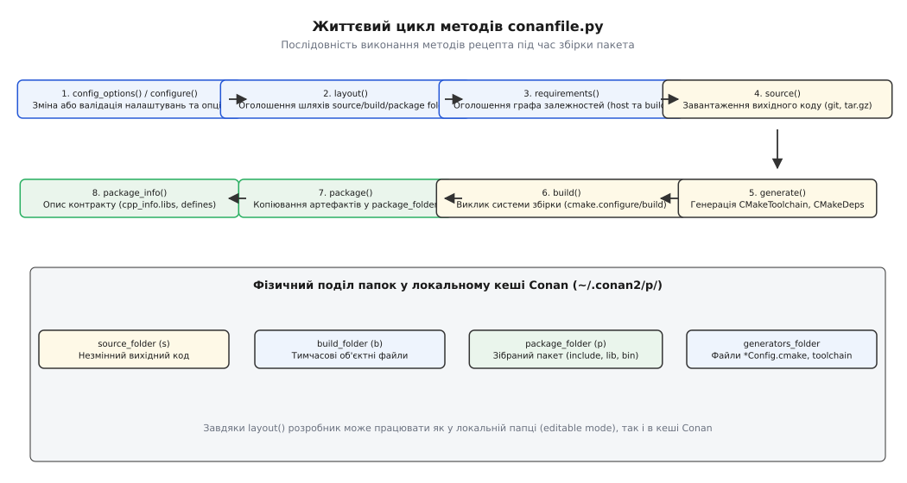
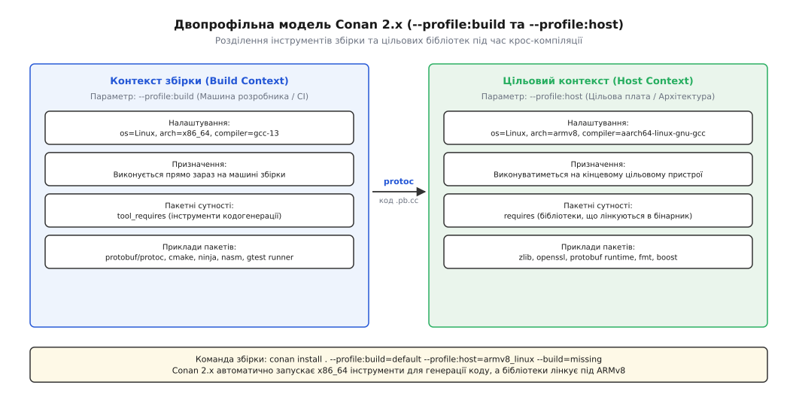
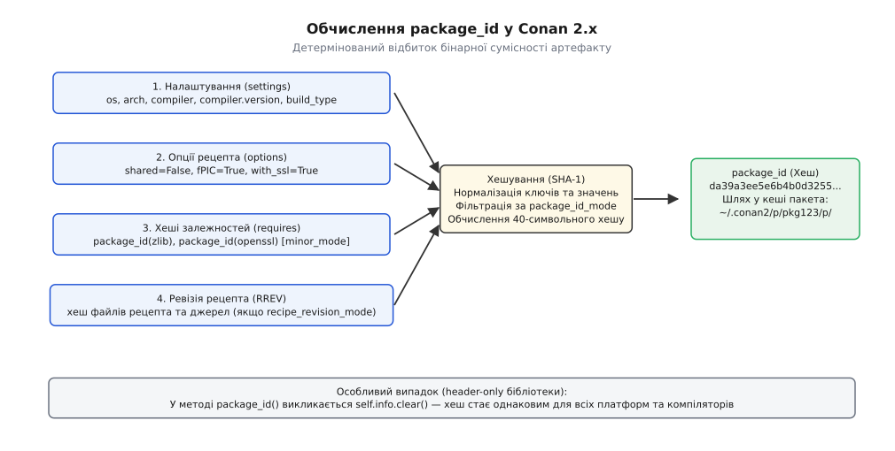
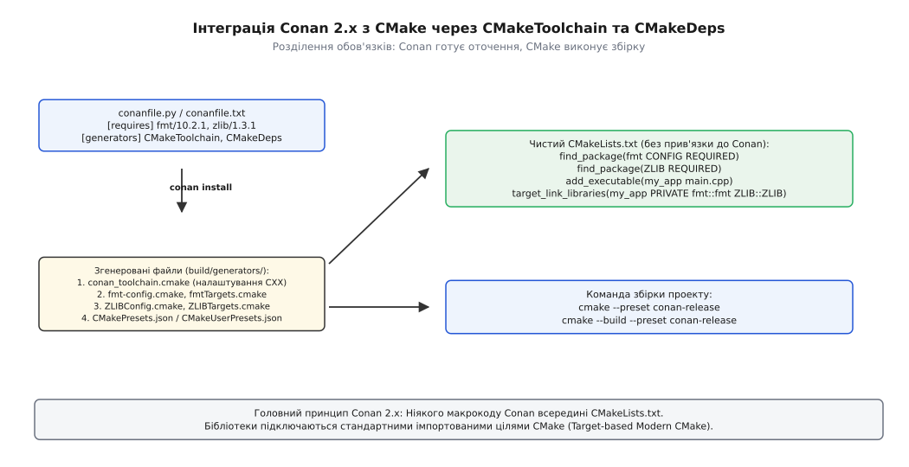
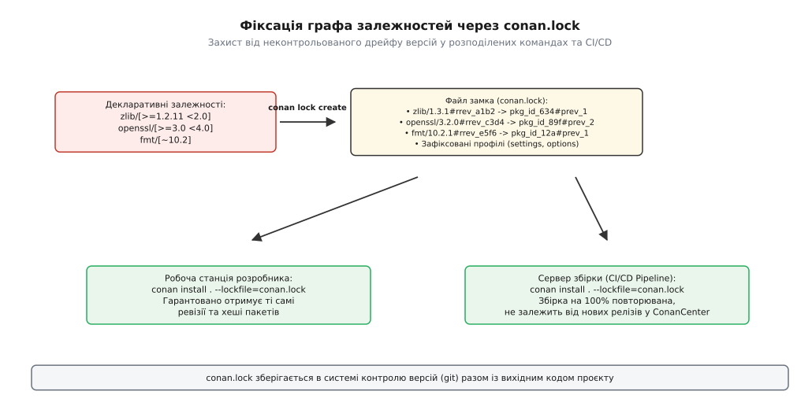

# Conan: рецепти, профілі, бінарні пакети

<preknowlist>
- [Цілі й властивості замість глобальних змінних](root:sys-bsystem/targets-and-properties) — що таке ціль CMake, її властивості та чому імпортовані псевдоніми з `::` захищають від помилок лінкування.
- [find_package: Config проти Module й імпортовані цілі](root:sys-bsystem/find-package) — як працює механізм виявлення сторонніх пакетів через конфігураційні описи `*Config.cmake`.
- [Граф залежностей і порядок робіт](root:sys-bsystem/dependency-graph) — структура спрямованого ациклічного графа (DAG) та поширення транзитивних вимог.
- [Файл тулчейна](root:sys-bsystem/cmake-toolchain-file) — як `CMAKE_TOOLCHAIN_FILE` передає системні налаштування та прапорці компілятора генераторам CMake.
- [Крос-компіляція](root:sys-bsystem/cross-compilation) — принципова різниця між середовищем виконання компілятора (build) та цільовою платформою виконання програми (host).
</preknowlist>

Кросплатформний мережевий сервіс використовує криптографічну бібліотеку OpenSSL, бібліотеку форматування тексту fmt та бібліотеку компресії zlib. На робочій станції розробника під керуванням Ubuntu 24.04 (компілятор GCC 13, 64-розрядна архітектура x86_64, стандартна бібліотека libstdc++ з новим ABI) збірка проєкту разом із усіма залежностями з вихідного коду триває вісім хвилин. 

Той самий проєкт відкривають на ноутбуці під керуванням macOS (компілятор Apple Clang 15, архітектура ARM64, стандартна бібліотека libc++), передають на сервер безперервної інтеграції під керуванням Windows Server (компілятор MSVC 19.38, динамічний рантайм `/MD`, архітектура x64) і паралельно готують релізну прошивку для промислового шлюзу на базі процесора ARM Cortex-A53 (крос-компілятор aarch64-linux-gnu-gcc).

На кожній із цих чотирьох систем спроба скомпілювати залежності з нуля забирає десятки хвилин процесорного часу, а системні пакувальники (`apt`, `brew`) або відсутні (на вбудованій платі та Windows), або постачають бінарні файли, зібрані з іншими прапорцями компілятора, які викликають фатальні збої під час компонування через несумісність двійкового інтерфейсу прикладних програм (ABI). 

Якщо ж підключати залежності як вихідний код через Git Submodules чи CMake FetchContent, час повної збірки кожного образу в CI/CD перевищує годину, а зміна одного прапорця оптимізації спричиняє неконтрольовану перекомпіляцію сотень сторонніх файлів.

Причина цієї кризи полягає в тому, що екосистема C++ не має єдиного бінарного стандарту ABI. Один і той самий сирцевий код бібліотеки версії `1.2.0`, скомпільований різними версіями компіляторів, з різними рівнями оптимізації, стандартами C++17/C++20 або режимами багатопотокового рантайму, перетворюється на десятки взаємно несумісних бінарних файлів. 

Менеджер пакетів [Conan](root:sys-bsystem/conan/hist-conan-evolution.md) вирішує цю фундаментальну проблему за допомогою дворівневої моделі: декларативного рецепта мовою Python, що керує збіркою, та детермінованого обчислення криптографічного хешу бінарної сумісності, що дозволяє централізовано кешувати, поширювати та перевіряти скомпільовані пакети.

## Дворівнева модель: рецепти та бінарні артефакти

Більшість менеджерів пакетів сучасних мов програмування — npm у JavaScript, Cargo у Rust, PyPI у Python — оперують виключно вихідним кодом або уніфікованим проміжним байткодом, оскільки ці мови мають стандартизований рантайм та єдиний механізм компонування. У C++ створення універсального двійкового репозиторію неможливе через комбінаторний вибух параметрів збірки:

1. **Компілятор та його версія:** GCC, Clang, Apple Clang та MSVC генерують різні структури викликів функцій, таблиці віртуальних методів (vtable) та декорацію імен (name mangling).
2. **Стандартна бібліотека C++:** відмінності між `libstdc++` (GNU), `libc++` (LLVM) та рантаймом MSVC унеможливлюють пряме передавання об'єктів `std::string`, `std::vector` чи `std::shared_ptr` через межі динамічних бібліотек, якщо вони зібрані різними бібліотеками C++.
3. **Стандарт мови C++:** клас, скомпільований у режимі C++14, може мати інший розмір або інше вирівнювання полів пам'яті, ніж той самий клас у режимі C++20 через використання `noexcept`, концептів чи атрибутів `[[no_unique_address]]`.
4. **Прапорці макроозначень та рантайму:** на платформі Windows змішування коду, зібраного зі статичним рантаймом (`/MT`) та динамічним рантаймом (`/MD`), гарантовано призводить до збою під час звільнення пам'яті у купі; у Linux зміна макроса `_GLIBCXX_USE_CXX11_ABI=0` на `1` змінює реалізацію рядків із копіювання при записі (COW) на структуру з малим буфером оптимізації (SSO).

Conan 2.x розділяє поняття «як зібрати бібліотеку» та «конкретний бінарний результат збірки». 

Перший рівень — це **рецепт** (`conanfile.py`). Рецепт є програмою мовою Python, яка описує джерела походження коду (URL архіву чи git-репозиторій), необхідні системні інструменти, взаємозв'язки з іншими пакетами та правила виклику базової системи збірки (CMake, Meson, Autotools чи Bazel). Рецепт нічого не знає про кінцеві бінарні файли — він визначає лише алгоритм їх отримання.

Другий рівень — це **бінарний пакет**. Коли Conan виконує збірку за рецептом під певний набір налаштувань (операційна система, архітектура процесора, компілятор, стандарт мови, режим збірки Release/Debug), він обчислює детермінований 40-символьний SHA-1 ідентифікатор — `package_id`. 

Готовий скомпільований артефакт (заголовкові файли, статичні бібліотеки `.a`/`.lib`, динамічні бібліотеки `.so`/`.dll`/`.dylib` та метадані) зберігається в локальному кеші або у віддаленому сховищі (ConanCenter, JFrog Artifactory) саме під цим `package_id`.

Якщо інший розробник у команді або агент безперервної інтеграції виконує збірку з ідентичними налаштуваннями, Conan не виконує компіляцію: він порівнює `package_id`, миттєво завантажує заздалегідь скомпільований архів із репозиторію та розпаковує його в каталог локального кешу `~/.conan2/p/`.

> 🔧 **Навіщо це.** Бінарне кешування скорочує час збірки корпоративних проєктів із десятками важких залежностей (Boost, Qt, Chromium Embedded Framework, OpenCV) з годин до секунд: компіляція бібліотеки відбувається рівно один раз на сервері CI під час випуску нової ревізії, після чого сотні інженерів використовують готовий бінарний відбиток.

## Анатомія рецепта conanfile.py та його життєвий цикл

Рецепт пакета Conan 2.x є класом, що успадковує `conan.ConanFile`. Рушій пакетного менеджера викликає методи цього класу у суворо регламентованій послідовності відповідно до життєвого циклу обчислення графа залежностей та фаз компіляції.


*Життєвий цикл conanfile.py: послідовність викликів методів конфігурації, розрахунку простору layout, завантаження джерел, генерації файлів збірки, компіляції та експорту контракту.*

Структура типового промислового рецепта для C++-бібліотеки, що використовує CMake, містить декларативні поля метаданих та реалізації ключових методів життєвого циклу:

```python
from conan import ConanFile
from conan.tools.cmake import CMake, CMakeToolchain, CMakeDeps, cmake_layout
from conan.tools.files import get, copy
from conan.errors import ConanInvalidConfiguration
import os

class NetworkEngineConan(ConanFile):
    name = "network_engine"
    version = "2.4.1"
    package_type = "library"
    license = "Apache-2.0"
    author = "Infra Team <infra@company.internal>"
    url = "https://github.com/company/network_engine"
    description = "Асинхронний мережевий рушій на базі epoll/kqueue/IOCP"
    topics = ("networking", "async", "sockets")

    # Комбінаторна матриця бінарної сумісності
    settings = "os", "arch", "compiler", "build_type"
    
    # Опції збірки конкретного пакета
    options = {
        "shared": [True, False],
        "fPIC": [True, False],
        "with_ssl": [True, False],
    }
    default_options = {
        "shared": False,
        "fPIC": True,
        "with_ssl": True,
    }

    def config_options(self):
        """Коригування опцій залежно від операційної системи до розрахунку графа."""
        if self.settings.os == "Windows":
            # На платформі Windows весь код позиційно-незалежний, прапорець fPIC відсутній
            self.options.rm_safe("fPIC")

    def configure(self):
        """Коригування взаємозв'язків між опціями."""
        if self.options.shared:
            # Для динамічних бібліотек на POSIX прапорець fPIC обов'язковий
            self.options.rm_safe("fPIC")

    def validate(self):
        """Перевірка обмежень платформи та версій інструментів."""
        if self.settings.compiler.get_safe("cppstd"):
            if int(str(self.settings.compiler.cppstd)) < 20:
                raise ConanInvalidConfiguration("network_engine вимагає підтримки стандарту C++20 або новішого")

    def layout(self):
        """Декларація стандартної структури каталогів."""
        cmake_layout(self)

    def requirements(self):
        """Оголошення бібліотечних залежностей цільової платформи."""
        self.requires("fmt/10.2.1", transitive_headers=True)
        if self.options.with_ssl:
            self.requires("openssl/3.2.0", transitive_headers=True, transitive_libs=True)

    def build_requirements(self):
        """Оголошення інструментів середовища збірки та генераторів коду."""
        self.tool_requires("cmake/[>=3.25]")
        self.tool_requires("ninja/1.11.1")

    def source(self):
        """Завантаження вихідного коду (виконується один раз для рецепта)."""
        get(self, 
            url=f"https://github.com/company/network_engine/archive/v{self.version}.tar.gz",
            sha256="7a8b9c0d1e2f3a4b5c6d7e8f9a0b1c2d3e4f5a6b7c8d9e0f1a2b3c4d5e6f7a8b",
            strip_root=True)

    def generate(self):
        """Генерація інтеграційних файлів для системи збірки (CMakeToolchain/CMakeDeps)."""
        tc = CMakeToolchain(self)
        tc.variables["ENABLE_SSL_SUPPORT"] = self.options.with_ssl
        tc.generate()

        deps = CMakeDeps(self)
        deps.generate()

    def build(self):
        """Виклик процесу конфігурації та компіляції."""
        cmake = CMake(self)
        cmake.configure()
        cmake.build()

    def package(self):
        """Копіювання зібраних бінарників та заголовків у каталог package_folder."""
        cmake = CMake(self)
        cmake.install()
        copy(self, "LICENSE*", src=self.source_folder, dst=os.path.join(self.package_folder, "licenses"))

    def package_info(self):
        """Опис контракту бібліотеки для генераторів споживачів."""
        self.cpp_info.libs = ["network_engine"]
        self.cpp_info.set_property("cmake_file_name", "network_engine")
        self.cpp_info.set_property("cmake_target_name", "network_engine::network_engine")
        
        if self.settings.os in ["Linux", "FreeBSD"]:
            self.cpp_info.system_libs = ["pthread", "dl", "m"]
        elif self.settings.os == "Windows":
            self.cpp_info.system_libs = ["ws2_32", "crypt32"]
```

Повний довідник методів, полів об'єкта `self.cpp_info` та службових утиліт маніпуляції файлами наведено у вставці [Методи та інтерфейси ConanFile](root:sys-bsystem/conan/api-conanfile-methods.md).

Розглянемо ключові стадії життєвого циклу рецепта:

1. **Фаза визначення конфігурації (`config_options`, `configure`, `validate`):** виконується на етапі аналізу графа. Тут видаляються непідтримувані опції (наприклад, `fPIC` на Windows) та перевіряються обмеження компілятора без завантаження джерел чи запуску компіляції.
2. **Фаза просторової розмітки (`layout`):** у Conan 2.x метод `layout()` є обов'язковим фундаментом. Виклик помічника `cmake_layout(self)` чітко розмежовує структуру папок на чотири незалежні області:
   - `self.folders.source` — каталог незмінного вихідного коду бібліотеки;
   - `self.folders.build` — каталог проміжних об'єктних файлів, що генеруються під час збірки;
   - `self.folders.generators` — каталог файлів конфігурації (`*Config.cmake`, `conan_toolchain.cmake`);
   - `self.folders.package` — ізольований цільовий каталог, куди метод `package()` записує фінальні артефакти (`include/`, `lib/`, `bin/`).
   
   Завдяки уніфікованому `layout()` один і той самий рецепт працює як усередині ізольованого кешу Conan, так і у режимі розробника, коли вихідний код бібліотеки лежить у сусідньому каталозі та редагується в IDE (режим `conan editable`).
3. **Фаза побудови графа залежностей (`requirements`, `build_requirements`):** метод `requirements()` додає до графа цільові бібліотеки, що будуть скомпоновані з кінцевим продуктом. Метод `build_requirements()` реєструє інструменти збірки (компілятори, генератори парсерів Bison/Flex, компілятор протобуферів `protoc`, сам CMake), які мають виконуватися на комп'ютері, де відбувається компіляція.
4. **Транзитивні ознаки залежностей (Dependency Traits):** у Conan 2.x метод `self.requires()` підтримує точне керування видимістю за допомогою прапорців `transitive_headers`, `transitive_libs`, `headers`, `libs`, `run` та `visible`. 

   Якщо бібліотека `A` використовує `fmt` лише всередині своїх `.cpp` файлів, прапорець `transitive_headers=False` (значення за замовчуванням) запобігає витоку шляхів включення `fmt` у проєкти, що залежать від `A`. Це захищає споживачів від випадкового використання прихованих внутрішніх залежностей та прискорює час компіляції.
5. **Фаза генерації (`generate`):** підготовчий етап перед запуском компіляції. Conan не виконує збірку самостійно — він створює точні конфігураційні файли для системи збірки. Клас `CMakeToolchain` формує файл `conan_toolchain.cmake`, де виставляє системні змінні CMake відповідно до налаштувань профілю, а клас `CMakeDeps` генерує набір файлів `find_package()` для кожної залежності.
6. **Фаза збірки та пакування (`build`, `package`):** метод `build()` запускає систему збірки через високорівневу обгортку `CMake(self)`, яка автоматично передає правильні прапорці паралелізму (`-jN`) та конфігурацію (`--config Release`). Метод `package()` викликає інсталяцію цілей CMake у підкаталог `package_folder` та додає файли ліцензій.
7. **Фаза публікації контракту (`package_info`):** описує, як інші проєкти мають лінкувати цей пакет. Тут перелічуються імена бінарних файлів (`self.cpp_info.libs`), шляхи до заголовків (`includedirs`), необхідні системні бібліотеки операційної системи (`system_libs`) та встановлюються канонічні імена імпортованих цілей CMake через властивість `cmake_target_name`.

## Профілі Conan та крос-компіляція: розділення host та build

Однією з найглибших проблем традиційних систем керування залежностями є змішування середовища компілятора та середовища виконання результуючого бінарного файлу. 

Під час прямої збірки на робочій станції під керуванням Linux x86_64 для запуску на тій самій машині ці середовища збігаються. Проте під час [крос-компіляції](root:sys-bsystem/cross-compilation) (наприклад, збірка на потужному сервері x86_64 прошивки для плати з процесором ARMv8 під керуванням Embedded Linux) виникає два принципово різних контексти:

- **Контекст збірки (Build Context):** комп'ютер, на якому фізично запущено процес компіляції (хост збірки). Будь-яка програма чи утиліта, що запускається під час процесу збірки (наприклад, генератор вихідного коду `protoc`, архіватор, асемблер `nasm` чи система збірки Ninja), повинна бути скомпільована для архітектури x86_64 та використовувати бібліотеки хост-машини.
- **Цільовий контекст (Host Context):** пристрій або платформа, де виконуватиметься створена програма (цільовий хост). Усі бібліотеки, які компонуються з кінцевою програмою (OpenSSL, zlib, fmt, власні статичні та динамічні бібліотеки), повинні бути скомпільовані цільовим крос-компілятором `aarch64-linux-gnu-gcc` під архітектуру ARMv8.

У Conan 2.x двопрофільна модель є обов'язковим стандартом: будь-яка команда встановлення чи збірки приймає два незалежні профілі через прапорці `--profile:build` та `--profile:host`.


*Двопрофільна модель Conan 2.x: суворе розділення інструментів генерації коду (build context) та цільових бібліотек компонування (host context).*

Файл профілю Conan є текстовим файлом у форматі INI, що складається з п'яти секцій: `[settings]`, `[options]`, `[tool_requires]`, `[buildenv]` та `[conf]`. Профілі підтримують спадкування за допомогою директиви `include(path/to/base_profile)`, що дозволяє створювати лаконічні спеціалізовані профілі (наприклад, `debug`, `asan`, `tsan`) на базі єдиного базового конфігураційного опису.

Розглянемо реальну пару профілів для крос-компіляції з Linux x86_64 на Linux ARMv8:

Файл `profiles/linux-x86_64` (білд-профіль для машини збірки):
```ini
[settings]
os=Linux
arch=x86_64
compiler=gcc
compiler.version=13
compiler.libcxx=libstdc++11
compiler.cppstd=20
build_type=Release
```

Файл `profiles/linux-armv8-gcc13` (хост-профіль для цільового шлюзу):
```ini
[settings]
os=Linux
arch=armv8
compiler=gcc
compiler.version=13
compiler.libcxx=libstdc++11
compiler.cppstd=20
build_type=Release

[options]
# Глобальне вимкнення динамічного лінкування для цільової вбудованої платформи
*:shared=False
*:fPIC=True

[buildenv]
# Змінні оточення крос-компілятора
CC=aarch64-linux-gnu-gcc
CXX=aarch64-linux-gnu-g++
AR=aarch64-linux-gnu-ar
STRIP=aarch64-linux-gnu-strip

[conf]
# Передавання системних змінних у генератор CMakeToolchain
tools.cmake.cmaketoolchain:system_name=Linux
tools.cmake.cmaketoolchain:system_processor=aarch64
tools.build:jobs=16
```

Запуск встановлення залежностей проєкту виконується єдиною командою:
```bash
conan install . --profile:build=profiles/linux-x86_64 --profile:host=profiles/linux-armv8-gcc13 --build=missing
```

Коли Conan будує граф для бібліотеки, що використовує Google Protocol Buffers, він автоматично:
1. Знаходить у рецепті `tool_requires("protobuf/3.21.12")` та завантажує або збирає бінарний пакет `protobuf` за білд-профілем (x86_64). Виконуваний файл `protoc` розміщується у змінній `PATH` процесу збірки.
2. Знаходить у рецепті `requires("protobuf/3.21.12")` та завантажує або збирає бібліотечні файли `libprotobuf.a` за хост-профілем (ARMv8).
3. Під час виконання збірки генератор CMake викликає виконуваний файл `protoc` версії x86_64 для створення файлів `.pb.h` та `.pb.cc`, а крос-компілятор `aarch64-linux-gnu-gcc` компілює їх та компонує з цільовою бібліотекою `libprotobuf.a` під архітектуру ARMv8.

Це усуває класичну проблему крос-компіляції, коли бінарники утиліт помилково збираються під цільову платформу і падають з помилкою `Exec format error` під час спроби запуску на сервері збірки.

## Обчислення package_id: детермінований відбиток бінарної сумісності

Ключовим елементом моделі кешування Conan є ідентифікатор `package_id`. Це 160-бітне шістнадцяткове число (SHA-1 хеш), яке однозначно ідентифікує конкретну двійкову збірку пакета.


*Обчислення package_id: трансформація налаштувань платформи, опцій рецепта та хешів транзитивних залежностей у кінцевий бінарний відбиток артефакту.*

Алгоритм обчислення `package_id` виконує нормалізацію вхідних даних та розраховує хеш від об'єднання чотирьох компонентів:

1. **Релевантні налаштування (`settings`):** значення параметрів `os`, `arch`, `compiler`, `compiler.version`, `compiler.libcxx`, `compiler.cppstd`, `build_type`.
2. **Опції рецепта (`options`):** значення всіх користувацьких перемикачів (`shared`, `fPIC`, `with_ssl`).
3. **Хеші залежностей (`requires`):** ідентифікатори `package_id` прямих та транзитивних бібліотек, від яких залежить цей пакет.
4. **Ревізія рецепта (Recipe Revision, RREV):** у режимі `recipe_revision_mode` зміна будь-якого рядка в коді рецепта автоматично змінює `package_id` усіх залежних бінарників.

Формула обчислення `package_id` є детермінованою функцією:

```
package_id = SHA1( CanonicalString( Settings + Options + Dependencies_Package_IDs ) )
```

Для детального аналізу та діагностики причин зміни `package_id` використовується команда `conan graph explain`. Вона порівнює два пакети та вказує точну причину розбіжності: наприклад, зміну прапорця `compiler.cppstd` з `17` на `20` або оновлення ревізії транзитивного пакета `zlib`.

### Режими сумісності залежностей (package_id_mode)

Коли оновлюється бібліотека нижнього рівня (наприклад, версія `zlib` змінюється з `1.2.13` на `1.3.1`), постає питання: чи потрібно перекомпільовувати бібліотеку вищого рівня `libpng`, яка від неї залежить?

Відповідь залежить від вибраного режиму сумісності `package_id_mode`:

- `semver_mode` (за замовчуванням для більшості бібліотек): оновлення patch- або minor-версії бібліотеки-залежності вважається двійково сумісним і **не змінює** `package_id` споживача. `package_id` споживача зміниться лише в разі мажорного оновлення (наприклад, перехід із `OpenSSL 1.1.1` на `OpenSSL 3.0.0`).
- `minor_mode`: будь-яка зміна minor-версії залежності (наприклад, з `1.2.0` на `1.3.0`) генерує новий `package_id` для споживача.
- `patch_mode`: навіть зміна найменшої patch-версії призводить до зміни хешу та повної перекомпіляції залежних пакетів.
- `full_package_mode`: `package_id` споживача безпосередньо включає точний `package_id` залежності. Якщо залежність було перекомпільовано з іншими прапорцями, споживач зобов'язаний бути перекомпільованим також.

### Плагіни користувацької сумісності (compatibility.py)

У корпоративних середовищах часто виникає потреба використовувати бінарні пакети, зібрані суміжними версіями компіляторів (наприклад, пакет, скомпільований GCC 13.2, повністю сумісний із проєктом на GCC 13.3). Для цього Conan 2.x надає механізм розширень `compatibility.py` у каталозі `~/.conan2/extensions/plugins/compatibility/`.

Плагін сумісності дозволяє визначити евристичні правила резервного пошуку: якщо бінарник під поточну версію компілятора відсутній, Conan автоматично перевіряє наявність бінарного пакета зі сумісними параметрами та завантажує його без запуску перекомпіляції.

### Виняток: бібліотеки тільки з заголовків (Header-only)

Для бібліотек, які складаються виключно з шаблонів та вбудованих функцій (наприклад, `nlohmann_json`, `Catch2`, `Eigen` або `glm`), компіляція бінарних файлів відсутня. Створювати окремі бінарні пакети для кожного компілятора та операційної системи було б марною витратою місця в репозиторії.

У таких рецептах метод `package_id()` повністю очищує метадані:

```python
def package_id(self):
    # Усі налаштування та опції видаляються з розрахунку хешу
    self.info.clear()
```

У результаті для бібліотеки генерується єдиний `package_id` (наприклад, `da39a3ee5e6b4b0d3255bfef95601890afd80709`), який використовується на всіх операційних системах, компіляторах та архітектурах процесорів.

## Генератори CMake у Conan 2.x: безшовна інтеграція

У ранніх версіях Conan інтеграція із системою збірки здійснювалася шляхом додавання нестандартних макросів безпосередньо у вихідний файл `CMakeLists.txt` (наприклад, `include(conanbuildinfo.cmake)` та `conan_basic_setup()`). Це жорстко прив'язувало вихідний код проєкту до конкретного менеджера пакетів.

Архітектура Conan 2.x побудована на принципі **чистого CMake (Clean CMakeLists)**. Файл `CMakeLists.txt` проєкту не повинен містити жодної згадки про Conan: він використовує виключно офіційні, стандартні механізми Modern CMake — команду `find_package()` та [імпортовані цілі](root:sys-bsystem/targets-and-properties).

Зв'язок між Conan та CMake забезпечують два незалежні генератори: `CMakeToolchain` та `CMakeDeps`.


*Інтеграція Conan 2.x з CMake: генерація conan_toolchain.cmake та конфігураційних модулів CMakeDeps, що забезпечують чистий CMakeLists.txt без пропрієтарного коду.*

### 1. Генератор CMakeToolchain

Клас `CMakeToolchain` створює файл `conan_toolchain.cmake` у каталозі збірки. Цей файл є стандартним файлом тулчейна CMake ([CMake Toolchain File](root:sys-bsystem/cmake-toolchain-file)) і містить точну трансляцію налаштувань профілю Conan у внутрішні змінні CMake:

```cmake
# Фрагмент згенерованого conan_toolchain.cmake
set(CMAKE_CXX_STANDARD 20)
set(CMAKE_CXX_STANDARD_REQUIRED ON)
set(CMAKE_CXX_EXTENSIONS OFF)
set(CMAKE_BUILD_TYPE "Release" CACHE STRING "" FORCE)

# Налаштування C++ ABI для GCC
set(CMAKE_CXX_FLAGS_INIT "${CMAKE_CXX_FLAGS_INIT} -D_GLIBCXX_USE_CXX11_ABI=1")

# Налаштування рантайму MSVC на Windows
set(CMAKE_MSVC_RUNTIME_LIBRARY "MultiThreaded$<$<CONFIG:Debug>:Debug>DLL")

# Додавання каталогу генераторів до шляхів пошуку find_package
list(PREPEND CMAKE_PREFIX_PATH "${CMAKE_CURRENT_LIST_DIR}")
```

### 2. Генератор CMakeDeps

Клас `CMakeDeps` сканує граф залежностей і для кожного доданого пакета створює набір файлів опису конфігурації у форматі [CMake Config-file Packages](root:sys-bsystem/find-package):
- `<PackageName>Config.cmake` (наприклад, `fmt-config.cmake`, `OpenSSLConfig.cmake`);
- `<PackageName>Targets.cmake` (оголошення цілей з відповідними властивостями `INTERFACE_INCLUDE_DIRECTORIES` та `INTERFACE_LINK_LIBRARIES`).

Завдяки цьому стандартний виклик `find_package(fmt CONFIG REQUIRED)` знаходить згенерований файл у каталозі `generators_folder` і негайно створює ціль `fmt::fmt`.

### 3. Автоматизація через CMakePresets

Разом із файлами конфігурації Conan генерує файл декларативних пресетів `CMakePresets.json` або `CMakeUserPresets.json` ([CMake Presets](root:sys-bsystem/cmake-presets)). Розробнику більше не потрібно вручну вказувати шлях до тулчейн-файла в командному рядку.

Повний цикл конфігурації та компіляції проєкту зводиться до трьох стандартних команд:

```bash
# 1. Встановлення залежностей та генерація пресетів
conan install . --build=missing

# 2. Конфігурація системи збірки через згенерований пресет
cmake --preset conan-release

# 3. Компіляція проєкту
cmake --build --preset conan-release
```

Файл `CMakeLists.txt` споживача залишається ідеально чистим:

```cmake
cmake_minimum_required(VERSION 3.20)
project(ImageProcessor LANGUAGES CXX)

# Стандартні виклики пошуку пакетів Modern CMake
find_package(OpenSSL REQUIRED)
find_package(fmt REQUIRED)
find_package(zlib REQUIRED)

add_executable(image_processor src/main.cpp)

# Лінкування через безпечні імпортовані простори імен
target_link_libraries(image_processor PRIVATE
    OpenSSL::SSL
    OpenSSL::Crypto
    fmt::fmt
    ZLIB::ZLIB
)
```

## Віддалені сховища, JFrog Artifactory та версіонування

У розподілених інженерних командах спільна робота організується через віддалені сервери пакетів (Conan Remotes). Conan підтримує одночасну роботу з декількома репозиторіями, які опитуються в порядку заданого пріоритету:

1. **ConanCenter:** офіційний відкритий публічний репозиторій відкритого коду (Open Source), що містить понад 1500 перевірених бібліотек (Boost, Qt, OpenSSL, gRPC, Protobuf, fmt, Poco).
2. **Корпоративний JFrog Artifactory / conan_server:** приватний захищений сервер організації, де зберігаються внутрішні пропрієтарні пакети компанії та кешуються проксі-копії публічних пакетів із ConanCenter.

Керування репозиторіями виконується командами CLI:

```bash
# Додавання приватного репозиторію
conan remote add corp-artifactory https://artifactory.company.internal/artifactory/api/conan/conan-local --index=0

# Аутентифікація в репозиторії
conan remote login corp-artifactory ${CI_USER} -p "${CI_TOKEN}"

# Перевірка списку активних віддалених серверів
conan remote list
```

### Незмінність артефактів: RREV та PREV

У промислових системах збірки неприпустима ситуація, коли автор пакета виправляє помилку в існуючому релізі `1.0.0` і перезаписує файли пакета на сервері, змінюючи поведінку коду в інших розробників без зміни номера версії.

Conan 2.x реалізує концепцію повної криптографічної незмінності (Immutability) через дворівневі ревізії:

1. **Ревізія рецепта (Recipe Revision, RREV):** криптографічний хеш вмісту самого файлу `conanfile.py` та експортованих ним джерел. Повна назва пакета набуває вигляду: `zlib/1.3.1#a89b7c6d5e4f3a2b1c0d9e8f7a6b5c4d`. Будь-яка зміна коду рецепта створює нову ревізію RREV.
2. **Ревізія пакета (Package Revision, PREV):** криптографічний хеш бінарних файлів, скомпільованих у каталозі `package_folder`. Повний шлях до бінарного артефакту стає однозначним:
   `zlib/1.3.1#RREV:package_id#PREV`.

Коли нова версія пакета публікується командою `conan upload my_lib/1.0.0 -r corp-artifactory`, сервер Artifactory зберігає всі створені ревізії. Якщо вихідний код змінено без підвищення номера версії, клієнтські машини завантажують найсвіжішу ревізію RREV або фіксують точну ревізію за допомогою файлу замка `conan.lock`.

## Lock-файли (conan.lock) та відтворюваність у CI/CD

У файлах `conanfile.py` версії залежностей часто оголошуються через динамічні діапазони версій (Version Ranges), наприклад `requires("zlib/[>=1.2.11 <2.0]")` або `requires("openssl/[~3.1]")`. Це дозволяє автоматично отримувати патчі безпеки під час локальної розробки.

Проте в промисловому виробництві програмного забезпечення неконтрольований дрейф версій є неприпустимим. Якщо під час нічної збірки в ConanCenter з'являється новий мінорний реліз бібліотеки, автоматична збірка релізу може пройти на новій версії без тестування та інтеграції.

Для гарантії 100% повторюваності збірок у часі та просторі використовується механізм [фіксації графа за допомогою lock-файлів](root:sys-bsystem/version-pinning).


*Детермінізм графа залежностей за допомогою conan.lock: перетворення плаваючих діапазонів версій у фіксовані хеші ревізій RREV та package_id.*

Файл `conan.lock` є документом у форматі JSON, який фіксує абсолютно всі параметри обчисленого графа:
- Точні номери версій усіх прямих та транзитивних залежностей.
- Точні хеші ревізій рецептів (RREV) для кожного пакета.
- Обчислені значення `package_id` для хост- та білд-профілів.
- Точні хеші ревізій бінарних пакетів (PREV).

### Життєвий цикл замка залежностей

1. **Створення замка розробником:**
   ```bash
   conan lock create conanfile.py --profile:build=profiles/linux-x86_64 --profile:host=profiles/linux-arm64 --lockfile-out=conan.lock
   ```
2. **Фіксація в системі контролю версій:** файл `conan.lock` комітиться у репозиторій Git поруч із `CMakeLists.txt` та вихідним кодом проєкту.
3. **Суворе встановлення в конвеєрі CI/CD:**
   ```bash
   conan install . --lockfile=conan.lock --build=missing
   ```

Якщо на сервері ConanCenter або в корпоративному сховищі з'являться нові ревізії бібліотек, клієнт Conan проігнорує їх і завантажить виключно ті артефакти, чиї RREV та `package_id` записані у `conan.lock`.

Повний приклад практичної побудови бібліотеки, налаштування профілів крос-компіляції, використання `test_package` та інтеграції в скрипт CI/CD продемонстровано у практичній вставці [Наскрізний конвеєр збірки та публікації](root:sys-bsystem/conan/proj-multi-package-workflow.md).

## Діагностика, типові пастки та граничні випадки

Практичне впровадження Conan 2.x супроводжується низкою характерних діагностичних повідомлень та архітектурних пасток.

### 1. Помилка «Missing prebuilt package»

Найпоширеніша помилка під час виконання команди `conan install`:
```text
ERROR: Missing prebuilt package for 'boost/1.83.0', 'openssl/3.2.0'.
Use '--build=missing' to build them from source, or check your profile settings.
```

Ця помилка означає, що рецепт бібліотеки знайдено, але на віддаленому сервері та в локальному кеші **відсутній бінарний пакет із таким точним `package_id`**. Це відбувається, якщо:
- Використовується нестандартна версія компілятора (наприклад, щойно випущений GCC 14).
- Увімкнено нестандартну комбінацію опцій (наприклад, `boost:without_test=True`).
- Виконується крос-компіляція для специфічного вбудованого процесора.

**Розв'язання:** передати прапорець `--build=missing`. Conan завантажить вихідний код відсутніх пакетів, скомпільує їх локально відповідно до поточного профілю, згенерує унікальний `package_id` та збереже отримані бінарники в локальний кеш для наступних запусків.

### 2. Конфлікти ромбоподібних залежностей (Diamond Dependency Conflict)

Якщо ваш застосунок залежить від бібліотеки `lib_a` (яка вимагає `fmt/9.1.0`) та від бібліотеки `lib_b` (яка вимагає `fmt/10.2.1`), виникає конфлікт версій у графі:

```text
ERROR: Version conflict: Both 'lib_a' and 'lib_b' require 'fmt', but demand different versions:
    lib_a/1.0.0 -> fmt/9.1.0
    lib_b/1.0.0 -> fmt/10.2.1
```

У C++ лінкування двох різних версій однієї бібліотеки в один виконуваний файл заборонене стандартом через порушення правила одного означення (One Definition Rule, ODR), що спричиняє невизначену поведінку (UB) або конфлікти символів лінкера.

**Розв'язання:** у файлі `conanfile.py` кінцевого застосунку необхідно явно перевизначити версію, встановивши прапорець `override=True`:

```python
def requirements(self):
    self.requires("lib_a/1.0.0")
    self.requires("lib_b/1.0.0")
    # Примусове приведення всього графа до єдиної версії
    self.requires("fmt/10.2.1", override=True)
```

### 3. Невідповідність прапорців C++ ABI у Linux

Якщо бібліотеку скомпільовано зі старішим стандартом ABI `_GLIBCXX_USE_CXX11_ABI=0`, а застосунок компілюється з `_GLIBCXX_USE_CXX11_ABI=1`, процес компіляції пройде успішно, але на етапі лінкування виникнуть помилки вигляду:
```text
undefined reference to `fmt::v10::format[abi:cxx11](...)`
```

**Розв'язання:** переконатися, що у профілі зазначено коректне налаштування `compiler.libcxx=libstdc++11` (для сучасного ABI) або `compiler.libcxx=libstdc++` (для застарілого GCC 4.x ABI), після чого виконати перезбірку застарілих пакетів із прапорцем `--build=missing`.

### 4. Багатоконфігураційні збірки (Debug проти Release)

Розробники під Visual Studio та Xcode звикли перемикати тип збірки (Debug/Release) всередині IDE без повторного запуску CMake. Для коректної підтримки мультиконфігураційних генераторів Conan 2.x вимагає послідовного запуску встановлення для обох конфігурацій:

```bash
conan install . -s build_type=Debug
conan install . -s build_type=Release
```

Завдяки структурі `cmake_layout` генератор `CMakeDeps` записує цілі конфігурацій у файли `fmt-Target-debug.cmake` та `fmt-Target-release.cmake`. Система збірки автоматично перемикає лінкування потрібних бібліотек залежно від поточної конфігурації в IDE.

### 5. Режим швидкого редагування (Conan Editable)

Під час одночасної розробки бібліотеки та програми-споживача постійний виклик `conan create` для кожної правки є неефективним, оскільки він щоразу копіює файли у внутрішній кеш.

Команда `conan editable` підключає робоче дерево джерел безпосередньо до графа Conan:

```bash
# Реєстрація локальної папки бібліотеки як активного пакета
conan editable add ../lib_network network_engine/2.4.1

# Тепер збірка застосунку бере заголовки та бінарники напряму з папки ../lib_network/build
conan install . --build=missing
```

Будь-яка зміна коду в `../lib_network` негайно стає доступною застосунку без перевстановлення чи пакування пакета. Після завершення розробки режим редагування вимикається командою `conan editable remove network_engine/2.4.1`.
