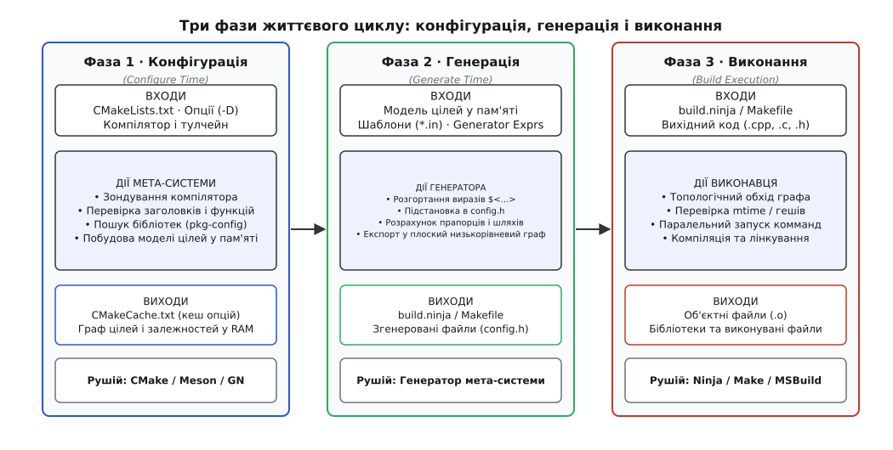
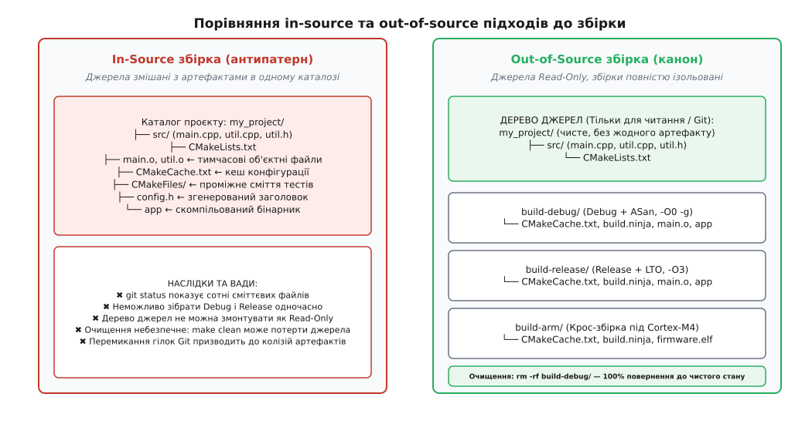
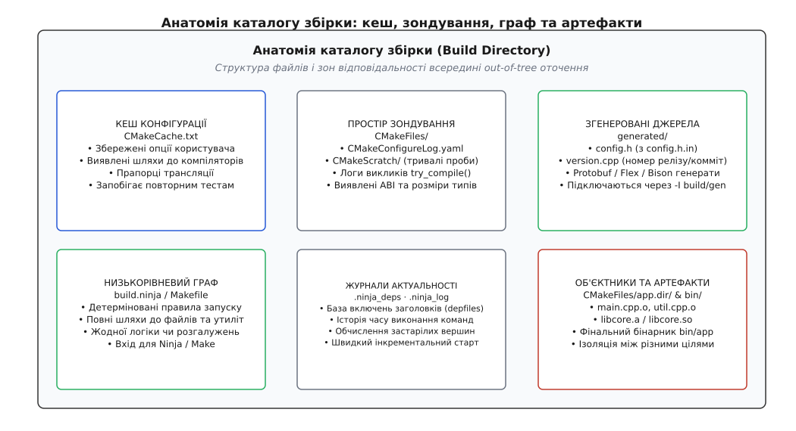
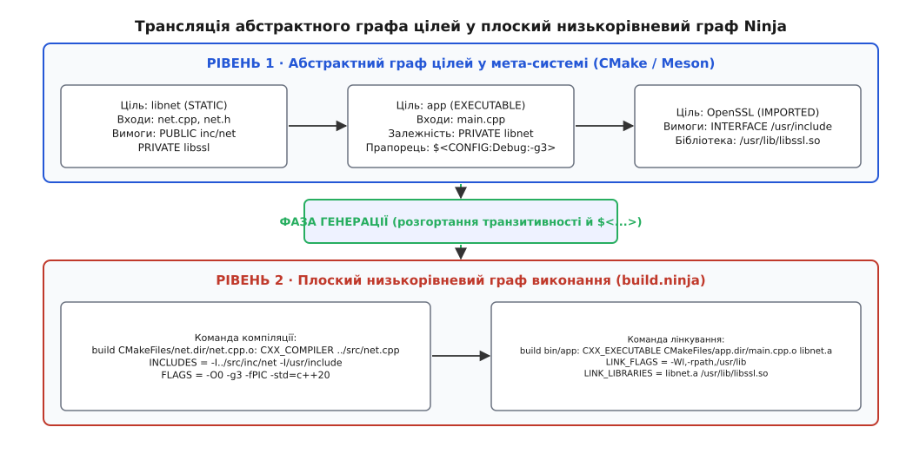

# Конфігурація, генерація і збірка поза деревом джерел

<preknowlist>
- [Роль системи збірки: від дерева файлів до артефакту](topic:sys-bsystem/build-system-role) — що таке граф дій, правила та ключ задачі.
- [Інкрементальна збірка: як вирішують, що застаріло](topic:sys-bsystem/incremental-build) — як зміни входів і прапорців викликають повторне виконання команд.
- [Компіляція](topic:sf-lang/compilation) — як вихідний код перетворюється на об'єктні файли за допомогою прапорців трансляції.
- [Лінкування](topic:sf-lang/linking) — як об'єктні модулі зв'язуються у фінальний бінарний файл.
</preknowlist>

Запустімо команду збірки безпосередньо в каталозі з вихідним кодом проєкту:

```sh
cd my_project
cmake . && make
```

За кілька секунд охайний каталог із десятком файлів `.cpp` та `.h` перетворюється на хаос. Поруч із рукописним кодом з'являються файли `CMakeCache.txt`, каталоги `CMakeFiles/`, проміжні об'єктні модулі `main.o`, згенерований заголовок `config.h`, службові журнали компіляції та скомпільований бінарний файл. Команда `git status` замість двох змінених рядків виводить простирадло з сотень невідстежуваних файлів.

Тепер спробуймо розв'язати звичайну щоденну інженерну задачу: зібрати налагоджувальний варіант програми з прапорцями `-O0 -g` та увімкненим адресним санітайзером (AddressSanitizer, ASan) і водночас отримати оптимізований варіант для вимірювання швидкодії з прапорцями `-O3 -flto`. Обидві збірки вимагають запису об'єктних файлів з однаковими іменами (`main.o`, `network.o`) у ті самі шляхи файлової системи. Збірка релізної версії затирає налагоджувальну; якщо процес перервати посередині, у каталозі залишається суміш об'єктних модулів, скомпільованих із різними несумісними прапорцями. Спроба виконати `make clean` нерідко видаляє файли не повністю або зачіпає вручну створені джерела, а єдиний надійний спосіб повернути дерево до чистого стану — виконати руйнівну команду `git clean -fdx`, яка безповоротно знищує будь-які незакомічені чернетки розробника.

Корінь цієї проблеми полягає в змішуванні двох принципово різних сутностей: **первинного джерела**, створеного людиною (яке має бути незмінним і перебувати під суворим контролем версій), та **обчисленого стану**, породженого інструментами збірки (який є тимчасовим, залежить від платформи й може бути в будь-яку мить видалений без втрати інформації).

Щоб подолати цей глухий кут, сучасна інженерія систем збірки спирається на два взаємопов'язані принципи: поділ процесу створення програми на **три чіткі часові фази** та сувору **ізоляцію збірки поза деревом джерел (out-of-source build)**.

## Три часові фази: конфігурація, генерація, виконання

Процес перетворення коду на готовий бінарний артефакт інтуїтивно сприймають як одну суцільну дію: «запустили збірку — отримали програму». Проте насправді цей шлях розпадається на три різні фази, кожна з яких має власні вхідні дані, виконує власний клас перевірок і завершується створенням строго визначеного результату.


*Три фази життєвого циклу: конфігурація досліджує оточення, генерація будує плоский граф, виконання запускає процеси.*

### Фаза конфігурації (Configure Time)

Фаза конфігурації (лат. *configurare* — надавати правильної форми) — це дослідження середовища та побудова абстрактної моделі проєкту в оперативній пам'яті. На цій стадії система збірки ще не компілює код вашої програми. Її мета — відповісти на запитання: *на якій системі ми знаходимося, якими інструментами володіємо і які функції проєкту бажає увімкнути користувач?*

Робота на фазі конфігурації складається з чотирьох послідовних кроків:

1. **Зондування компілятора та тулчейна.** Мета-система (наприклад, CMake або Meson) запускає виявлений компілятор на серії крихітних тестових програм. Вона визначає ідентифікатор компілятора (GCC, Clang, MSVC, AppleClang), точну версію, підтримувані стандарти мови (C++17, C++20, C++23), цільову архітектуру (x86_64, aarch64, armv7-m), порядок байтів у пам'яті (endianness) та розміри базових типів через `sizeof(void*)`.
2. **Перевірка системних можливостей і заголовків.** Замість того, щоб спиратися на неперевірені припущення про операційну систему, інструмент намагається скомпілювати тестові фрагменти, що перевіряють наявність конкретних системних викликів або заголовків: чи існує `<unistd.h>`, чи доступна функція `epoll_create1()`, чи підтримує компілятор інструкції AVX-512.
3. **Пошук зовнішніх бібліотек і пакетів.** Інструмент опитує системні шляхи, утиліту `pkg-config`, або зовнішні менеджери пакетів (Conan, vcpkg), щоб знайти розташування заголовків і бінарних файлів сторонніх бібліотек (наприклад, OpenSSL, zlib, SQLite).
4. **Обробка опцій користувача.** Система зчитує передані прапорці налаштування (наприклад, `-DENABLE_TESTS=OFF` або `-DCMAKE_BUILD_TYPE=Release`) і обчислює логічні розгалуження в описах збірки.

Результатом фази конфігурації є два об'єкти:
* **Кеш конфігурації** (наприклад, файл `CMakeCache.txt` або каталог `meson-info/`), куди записуються всі виявлені шляхи та обрані значення, щоб не повторювати дорогі перевірки під час наступних запусків;
* **Граф цілей у пам'яті** — високорівнева об'єктна структура, де кожна бібліотека й виконуваний файл представлені вузлами з набором властивостей (списки вихідних файлів, каталоги заголовків, прапорці компіляції та зв'язки залежностей).

### Як влаштоване зондування: try_compile, try_run та пастки крос-компіляції

Зондування системи на фазі конфігурації спирається на три рівні перевірок різної складності та вартості:

* **Перевірка синтаксису (Check Syntax / Source Compiles).** Мета-система записує у тимчасовий каталог файл `src.c` або `src.cpp`, що містить досліджувану конструкцію (наприклад, `consteval int f() { return 1; }`), і викликає компілятор із прапорцем `-c`. Якщо компілятор повертає нульовий код завершення, можливість вважається підтримуваною.
* **Перевірка лінкування (Check Symbol Exists / Function Links).** Компіляції коду недостатньо, якщо функція реалізована в окремій системній бібліотеці. Наприклад, функція `pthread_create` вимагає лінкування з бібліотекою `pthread` на старих версіях glibc, а функція `dlopen` — з `libdl`. Мета-система створює програму з викликом функції та викликає повний ланцюжок компілятора й лінкера (`try_compile`). Якщо лінкер знаходить символ без невизначених посилань (undefined reference), перевірка вважається успішною.
* **Перевірка поведінки в рантаймі (Check Execution / `try_run`).** Найглибший рівень перевірки: скомпілювати тестову програму, запустити її на виконання та проаналізувати її вивід або код повернення. Цей спосіб застосовують, коли треба перевірити точну семантику системного виклику — наприклад, чи повертає `snprintf` коректну довжину рядка при переповненні буфера згідно зі стандартом C99.

> ⚠️ **Пастка крос-компіляції при `try_run`.** Якщо ви збираєте програму на робочій станції x86_64 для мікроконтролера ARM Cortex-M4 або плати Raspberry Pi (aarch64), скомпільований бінарник тестової перевірки фізично не може бути запущений на процесорі вашого комп'ютера. Спроба виконати `try_run` під час крос-компіляції негайно зупиняє конфігурацію з помилкою. Сучасні системи збірки обходять це двома шляхами: або за допомогою емуляторів простору користувача (наприклад, через параметр CMake `CMAKE_CROSSCOMPILING_EMULATOR="qemu-arm"`), або за допомогою заздалегідь заповнених таблиць відповідей (кеш-файлів крос-компіляції), які повідомляють мета-системі готові результати тестів без запуску бінарників.

### Фаза генерації (Generate Time)

Отримавши повну модель проєкту в пам'яті, система переходить до фази генерації (лат. *generare* — породжувати). Її завдання — перетворити високорівневу абстрактну модель цілей на **конкретний, плоский низькорівневий граф збірки**, оптимізований під обраний інструмент виконання (Ninja, GNU Make, MSBuild або Xcode).

На цій фазі виконується робота, яку неможливо було зробити раніше:

* **Розгортання відкладених генераторних виразів.** У сучасних системах багато властивостей не можуть бути обчислені на фазі конфігурації, оскільки залежать від контексту використання цілі. Наприклад, вираз `$<CONFIG:Debug>` або `$<TARGET_FILE:my_lib>` набуває остаточного значення лише тоді, коли відомі всі залежності та фінальні налаштування кожної цілі.
* **Підстановка значень у файли-шаблони.** Генератор зчитує шаблонні файли (наприклад, `config.h.in` або `version.cpp.in`) і замінює в них змінні конфігурації на конкретні значення, записуючи готові `.h` та `.cpp` файли в каталог збірки.
* **Розрахунок транзитивних властивостей (Usage Requirements).** Генератор обходить граф цілей і обчислює повний набір прапорців, макроозначень та шляхів заголовків для кожного об'єктного файлу на основі модифікаторів `PRIVATE`, `PUBLIC` та `INTERFACE`.
* **Експорт команд збірки.** Генератор записує файл `build.ninja`, набір `Makefile` або проєктні файли `.vcxproj`. Кожен рядок у цих файлах містить вичерпну, розгорнуту команду виклику компілятора або лінкера з жорстко зафіксованими абсолютними чи відносними шляхами, прапорцями оптимізації та макроозначеннями.

> 🔧 **Навіщо це.** Фаза генерації повністю усуває невизначеність. Після її завершення у файлі `build.ninja` немає жодного умовного переходу `if/else`, жодної змінної оточення та жодного нерозгорнутого шаблону. Це позбавляє низькорівневий виконавець необхідності думати — йому залишається лише механічно запускати готові процеси.

### Одноконфігураційні проти мультиконфігураційних генераторів

Генератори систем збірки поділяються на дві принципово різні категорії за способом обробки типів збірки (`Debug`, `Release`):

1. **Одноконфігураційні генератори (Single-Configuration Generators).** До них належать класичний *Ninja* та *Unix Makefiles*. У таких генераторах тип збірки жорстко фіксується на фазі конфігурації через змінну `CMAKE_BUILD_TYPE=Release`. Згенерований файл `build.ninja` містить команди лише для цього одного конкретного режиму. Якщо розробник бажає перемкнутися на `Debug`, він повинен або заново переконфігурувати поточний каталог збірки, або (що набагато правильніше) мати окремий паралельний каталог `build-debug/`.
2. **Мультиконфігураційні генератори (Multi-Configuration Generators).** До них належать *Ninja Multi-Config*, *Visual Studio* (`.sln`/`.vcxproj`) та *Xcode*. У таких системах фази конфігурації та генерації виконуються один раз для **всіх можливих конфігурацій одночасно**. Усередині єдиного каталогу збірки створюються структури для `Debug`, `Release`, `RelWithDebInfo` та `MinSizeRel`. А вибір конкретного режиму відкладається на фазу виконання:

```sh
# Збірка під Visual Studio або Ninja Multi-Config
cmake -S . -B build -G "Ninja Multi-Config"
cmake --build build --config Debug
cmake --build build --config Release
```

У мультиконфігураційних генераторах вихідні бінарні артефакти автоматично розкладаються за окремими підкаталогами (наприклад, `build/Debug/app.exe` та `build/Release/app.exe`), що запобігає їхньому взаємному затиранню.

### Фаза виконання збірки (Build / Execution Time)

Фаза виконання — це безпосередня робота низькорівневого рушія збірки (Ninja, Make, MSBuild).

Виконавець відкриває згенерований файл `build.ninja` або `Makefile`, будує в пам'яті орієнтований ациклічний граф (DAG) файлових дій, звіряє часові позначки (`mtime`) або геші файлів і запускає компілятори та лінкери в максимально паралельному режимі.

Виконавець збірки нічого не знає про логіку вашого проєкту, про мову C++, про опції `-DENABLE_FEATURE` або про те, які бібліотеки встановлені в системі. Він бачить лише прості правила: *«щоб створити файл `obj/net.o`, треба виконати команду `clang++ -c src/net.cpp -o obj/net.o` за умови, що вхідні файли змінилися»*.

Історичний шлях від монолітних shell-скриптів до сучасного трифазного конвеєра детально простежено окремо: [як з'явилася двофазна збірка й мета-генератори](topic:sys-bsystem/configure-and-generate/hist-meta-build.md).

## In-source проти Out-of-source

Найважливішим архітектурним наслідком розділення фаз є можливість повністю ізолювати вихідний код від артефактів збірки.


*Зліва — хаос змішування коду й артефактів під час in-source збірки; справа — строга ізоляція out-of-source з кількома незалежними конфігураціями.*

### Чому In-Source збірка — це небезпечний антипатерн

In-source (збірка всередині дерева джерел) виникає тоді, коли каталог збірки збігається з каталогом вихідного коду:

```
my_project/                 ← КАТАЛОГ ДЖЕРЕЛ І ЗБІРКИ ОДНОЧАСНО
├── src/
│   ├── main.cpp
│   ├── main.o            ← артефакт збірки
│   ├── util.cpp
│   └── util.o            ← артефакт збірки
├── CMakeLists.txt
├── CMakeCache.txt         ← кеш конфігурації
├── CMakeFiles/            ← службове сміття перевірок
├── config.h               ← згенерований заголовок
└── app                    ← скомпільована програма
```

Така організація породжує п'ять критичних проблем:

1. **Забруднення системи контролю версій (Source Tree Pollution).** Згенеровані файли опиняються серед рукописного коду. Спроба розробника оцінити свої зміни через `git status` або `git diff` перетворюється на фільтрацію шуму. Спроба написати всеосяжний `.gitignore` ніколи не розв'язує проблему повністю, оскільки проміжні файли тестів зондування часто мають випадкові або динамічні імена.
2. **Ризик ненавмисного коміту або видалення коду.** Розробники регулярно випадково комітять локальний `CMakeCache.txt` або згенерований під їхню конкретну машину `config.h`. З іншого боку, агресивне очищення каталогу за допомогою `git clean -fdx` безповоротно стирає незакомічені нові файли коду розробника.
3. **Неможливість роботи з джерелами в режимі «лише для читання».** Якщо дерево джерел змонтовано по мережі через NFS у режимі `read-only`, знаходиться в захищеному Docker-контейнері або належить іншому системному користувачеві, in-source збірка негайно зазнає краху під час першої ж спроби створити тимчасовий файл у каталозі джерел.
4. **Взаємне блокування різних конфігурацій.** Ви не можете одночасно тримати зібраними версії `Debug` та `Release`. Щоразу під час зміни режиму збірки всі об'єктні файли мають бути повністю видалені й перекомпільовані з нуля, що знищує всю користь від інкрементальної збірки.
5. **Залишковий кеш під час перемикання гілок Git.** Якщо розробник перемикає гілку Git на давніший коміт, де частини нових файлів ще не існувало, старі об'єктні файли в каталозі джерел залишаються на диску. Лінкер може підхопити застарілий об'єктний модуль, породжуючи невловимі помилки лінкування або виконання.

### Канон Out-of-Source (Out-of-Tree) збірки

Out-of-source (збірка поза деревом джерел) запроваджує залізний інваріант: **дерево джерел є недоторканним і відкритим виключно для читання**. Жоден інструмент конфігурації, генерації чи компіляції не має права створити, змінити чи видалити бодай один байт у каталозі джерел.

Усі згенеровані файли, кеші, тимчасові файли перевірок, об'єктні файли та фінальні бінарники створюються в окремому, явно вказаному каталозі збірки:

```sh
# Синтаксис сучасного CMake: -S вказує каталог джерел, -B вказує каталог збірки
cmake -S /path/to/source -B /path/to/build-debug -DCMAKE_BUILD_TYPE=Debug
cmake -S /path/to/source -B /path/to/build-release -DCMAKE_BUILD_TYPE=Release
cmake -S /path/to/source -B /path/to/build-arm -DCMAKE_TOOLCHAIN_FILE=arm.cmake
```

Переваги цієї моделі вичерпні:

* **Паралельне існування будь-якої кількості конфігурацій.** Ви можете одночасно мати зібрані каталоги `build-debug/`, `build-release/`, `build-asan/` та `build-arm-cortex-m4/`. Перемикання між ними не потребує жодного перекомпільовування коду.
* **Гарантовано безпечне й чисте видалення.** Щоб повернути систему до абсолютно чистого стану, достатньо виконати системну команду видалення каталогу: `rm -rf build-debug/`. Немає жодного ризику пошкодити джерела, і немає потреби покладатися на сумнівні скрипти очищення на кшталт `make clean` чи `make distclean`.
* **Ідеальна чистота Git.** Команда `git status` завжди показує лише реальні зміни у файлах коду, оскільки каталог `build/` заноситься в `.gitignore` одним рядком або взагалі створюється за межами робочого дерева репозиторію (наприклад, у `/tmp/build` або на швидкому RAM-диску).

## Анатомія каталогу збірки

Щоб упевнено діагностувати помилки конфігурації та збірки, необхідно розуміти внутрішню будову каталогу збірки. Попри те, що конкретні імена файлів залежать від генератора, структура типового каталогу збірки підпорядкована суворій логіці зонування.


*Анатомія каталогу збірки: взаємне розміщення кешу конфігурації, логів зондування, згенерованого коду, графа Ninja та об'єктних файлів.*

Розгляньмо вміст каталогу `build/`, створеного викликом `cmake -S . -B build -G Ninja`:

```
build/
├── CMakeCache.txt                    ← Кеш конфігурації (параметри й шляхи)
├── build.ninja                       ← Згенерований плоский граф для Ninja
├── rules.ninja                       ← Шаблони команд запуску компіляторів
├── .ninja_deps                       ← Бінарна база динамічних залежностей (хедера)
├── .ninja_log                        ← Журнал виконаних команд і часу роботи
├── compile_commands.json             ← База прапорців компіляції для clangd/IDE
├── generated/
│   └── include/
│       └── config.h                  ← Згенерований заголовок із макросами
├── CMakeFiles/
│   ├── CMakeConfigureLog.yaml        ← Детальний журнал усіх тестів зондування
│   ├── TargetDirectories.txt
│   ├── app.dir/
│   │   ├── src/main.cpp.o            ← Об'єктний файл цілі app
│   │   └── src/main.cpp.o.d          ← Файл залежностей від заголовків (depfile)
│   └── core.dir/
│       └── src/util.cpp.o            ← Об'єктний файл бібліотеки core
└── bin/
    └── app                           ← Фінальний виконуваний файл
```

### 1. Кеш конфігурації (`CMakeCache.txt`)

Файл `CMakeCache.txt` є текстовою базою даних у форматі «ключ-тип-значення». Він фіксує результати роботи фази конфігурації:

```ini
# Шлях до компілятора мови C++
CMAKE_CXX_COMPILER:FILEPATH=/usr/bin/clang++

# Прапорці оптимізації для режиму Release
CMAKE_CXX_FLAGS_RELEASE:STRING=-O3 -DNDEBUG

# Чи збирати спільні бібліотеки
BUILD_SHARED_LIBS:BOOL=OFF

# Результат перевірки наявності системної функції
HAVE_PTHREAD_SETNAME_NP:INTERNAL=1
```

У мові CMake змінні поділяються на два принципові класи:
* **Звичайні змінні (Normal Variables).** Створюються викликом `set(VAR "value")` і існують лише під час виконання поточного файлу `CMakeLists.txt` або функції. Вони зберігаються в пам'яті процесу й зникають після завершення конфігурації.
* **Кешовані змінні (Cache Variables).** Створюються викликом `set(VAR "value" CACHE TYPE "docstring")` або передаються через командний рядок `-DVAR="value"`. Вони записуються на диск у файл `CMakeCache.txt` і зберігають свої значення між повторними запусками збірки.

Кешовані змінні мають явні типи: `BOOL` (логічні перемикачі), `FILEPATH` (шляхи до файлів на диску), `PATH` (шляхи до каталогів), `STRING` (довільні рядки) та `INTERNAL` (службові маркери, приховані від графічних утиліт налаштування на зразок `cmake-gui`).

> ⚠️ **Проблема змінних-зомбі в кеші (Zombie Cache Variables).** Якщо ви видалили опцію або змінну з файлу `CMakeLists.txt`, вона **не видаляється** автоматично з файлу `CMakeCache.txt`. Старе значення залишається в кеші й може продовжувати впливати на поведінку інших модулів чи умов `if(DEFINED VAR)`. Єдиний спосіб позбутися застарілих кешованих змінних — видалити `CMakeCache.txt` або повністю очистити каталог збірки.

### 2. Простір зондування й діагностики (`CMakeFiles/`)

Підкаталог `CMakeFiles/` містить проміжний робочий простір мета-системи.

Найціннішим файлом тут є `CMakeConfigureLog.yaml` (або `CMakeError.log` у старіших версіях). Коли під час конфігурації перевірка наявності функції чи бібліотеки завершується невдачею, детальний протокол виклику компілятора та точний текст помилки записуються саме сюди. Якщо ви бачите повідомлення `Looking for pthread_create - not found`, відкриття цього журналу покаже, чи помилка сталася через відсутність системного пакета, чи через відсутність прапорця лінкування `-pthread`.

### 3. Згенеровані заголовки та вихідний код (`generated/`)

Якщо проєкт використовує генерацію коду з шаблонів (наприклад, створення `config.h` із файлу `config.h.in`) або генератори вихідних текстів (Protocol Buffers, FlatBuffers, Flex/Bison), ці файли створюються виключно всередині дерева збірки.

Це означає, що під час компіляції каталог згенерованих файлів у дереві збірки має бути явно доданий до шляхів пошуку заголовків компілятора (`-I build/generated/include`).

### 4. Низькорівневий граф дій (`build.ninja`)

Файл `build.ninja` — це серце фази виконання. Він складається з двох типів записів:
* **Правила (`rule`)** — абстрактні шаблони виклику інструментів (як запустити компілятор або архіватор);
* **Ребра графа (`build`)** — конкретні прив'язки: який саме вихідний файл породити з яких вхідних за допомогою якого правила.

```ninja
rule CXX_COMPILER
  depfile = $DEP_FILE
  deps = gcc
  command = /usr/bin/clang++ $DEFINES $INCLUDES $FLAGS -MD -MT $out -MF $DEP_FILE -o $out -c $in
  description = Building CXX object $out

build CMakeFiles/app.dir/src/main.cpp.o: CXX_COMPILER ../src/main.cpp
  DEP_FILE = CMakeFiles/app.dir/src/main.cpp.o.d
  FLAGS = -O3 -DNDEBUG -std=c++20
  INCLUDES = -I../src/include -Igenerated/include
```

Зверніть увагу: шлях до вихідного файлу `../src/main.cpp` вказує у дерево джерел, тоді як об'єктний файл `CMakeFiles/app.dir/src/main.cpp.o` та файл залежностей `DEP_FILE` створюються строго всередині каталогу збірки.

### 5. Журнали актуальності та залежностей (`.ninja_deps`, `.ninja_log`)

Файли `.ninja_deps` та `.ninja_log` ведуться виконавцем Ninja автоматично.
* `.ninja_deps` зберігає бінарний кеш неявних залежностей від заголовків, розпарсених із файлів `.d` (depfiles), які генерує компілятор під час трансляції.
* `.ninja_log` записує точний час початку й завершення виконання кожної команди та геш її командного рядка. Завдяки цьому Ninja здатний за частки мілісекунди визначити, що збірка актуальна і жоден процес запускати не потрібно.

## Мета-системи проти монолітних виконавців

Чому сучасна розробка відмовилася від написання рукописних `Makefile` на користь двошарової моделі «мета-система (CMake / Meson) + швидкий виконавець (Ninja)»?


*Мета-генератор перетворює високорівневі цілі з транзитивними властивостями на плоский, оптимізований для виконання граф Ninja.*

Монолітний підхід класичного Make намагався поєднати все в одному інструменті. Файл `Makefile` мав одночасно описувати структуру проєкту, шукати бібліотеки через виклики утиліт командного рядка `$(shell pkg-config --cflags libpng)` та виконувати компіляцію.

Цей підхід зазнав краху з трьох причин:

1. **Відсутність високорівневої моделі.** У Make немає понять «бібліотека», «публічний заголовок», «транзитивна залежність» або «інтерфейс». Є лише сирі файли та команди. Якщо бібліотека `A` використовує бібліотеку `B`, розробник був змушений вручну прописувати шляхи до заголовків `B` у всіх таргетах, що лінкуються з `A`.
2. **Прив'язка до командної оболонки (Shell Lock-in).** Команди всередині `Makefile` виконуються через системний командний рядок Unix (`/bin/sh`). Написати нетривіальний `Makefile`, який би без змін працював і на Linux, і на macOS, і на Windows (де стандартною оболонкою є `cmd.exe` або `PowerShell`), практично неможливо.
3. **Повільна ініціалізація.** Щоб перевірити актуальність великого графа на 50 000 файлів, Make змушений щоразу повторно парсити складні текстові макроси та викликати сотні підпроцесів shell, що займає десятки секунд ще до початку компіляції першого файлу.

Двошарова парадигма розділяє відповідальність:

| Рівень | Інструмент | Що робить | Коли запускається |
| :--- | :--- | :--- | :--- |
| **Високий рівень (Мета-система)** | CMake, Meson, GN | Опитує систему, перевіряє типи, шукає пакети, керує транзитивними властивостями цілей | Рідко (під час зміни структури проєкту або опцій) |
| **Низький рівень (Виконавець DAG)** | Ninja, Make | Завантажує готовий плоский граф, перевіряє часові мітки, паралельно запускає процеси | Часто (під час кожної правки у файлі коду) |

Мета-система бере на себе всю складну, високорівневу та платформозалежну роботу. Вона транслює високорівневі правила в ідеально вичищений, плоский файл `build.ninja`. А виконавець Ninja завантажує цей файл за лічені мілісекунди, забезпечуючи миттєвий відгук на будь-яку зміну в коді.

## Дзеркалення шляхів, розв'язання заголовків та колізії

При рознесенні коду на два дерева (джерела та збірка) компілятор стикається з фундаментальною проблемою: **де шукати заголовкові файли?**

Частина заголовків проєкту (`util.h`, `network.h`) написана людиною і лежить у дереві джерел (`/project/src/`). Інша частина (`config.h`, `protocol.pb.h`) згенерована машиною і лежить у дереві збірки (`/project/build/generated/`).

### Подвійний простір пошуку (Shadow Include Paths)

Щоб код міг прозоро включати обидва типи заголовків через директиву `#include "..."`, мета-система формує командний рядок компілятора з двома обов'язковими шляхами пошуку:

```sh
clang++ -I/project/include -I/project/build/generated/include -c /project/src/main.cpp
```

Розгляньмо, як приклад коду на C та C++ використовує згенерований на фазі конфігурації заголовок `config.h` для адаптації до можливостей платформи:

:::tabs
```c
#include <stdio.h>
#include <stdlib.h>
#include "config.h"

#ifdef HAVE_UNISTD_H
#include <unistd.h>
#endif

void* allocate_page_aligned(size_t size) {
    void* ptr = NULL;
#if defined(HAVE_POSIX_MEMALIGN)
    if (posix_memalign(&ptr, 4096, size) != 0) {
        return NULL;
    }
#elif defined(HAVE_ALIGNED_ALLOC)
    ptr = aligned_alloc(4096, size);
#else
    ptr = malloc(size);
#endif
    return ptr;
}
```
```cpp
#include <iostream>
#include <memory>
#include <span>
#include <cstdlib>
#include "config.h"

#if __has_include(<unistd.h>)
#include <unistd.h>
#endif

struct AlignedDeleter {
    void operator()(void* ptr) const noexcept {
        std::free(ptr);
    }
};

template <typename T>
std::unique_ptr<T[], AlignedDeleter> make_aligned_buffer(std::size_t count) {
    std::size_t bytes = count * sizeof(T);
    void* raw_ptr = nullptr;
#if defined(HAVE_POSIX_MEMALIGN)
    if (posix_memalign(&raw_ptr, 4096, bytes) != 0) {
        return nullptr;
    }
#elif defined(HAVE_ALIGNED_ALLOC)
    raw_ptr = std::aligned_alloc(4096, bytes);
#else
    raw_ptr = std::malloc(bytes);
#endif
    return std::unique_ptr<T[], AlignedDeleter>(static_cast<T*>(raw_ptr));
}
```
:::

### Пастка затінення файлів (Shadowing Trap)

Якщо каталог джерел і каталог збірки містять файли з однаковими відносними шляхами, виникає небезпечна колізія, відома як **затінення заголовків (header shadowing)**.

Уявімо ситуацію:
1. У дереві джерел лежить файл `include/app/version.h`, де колись вручну було прописано версію `1.0.0`.
2. Пізніше проєкт перевели на автоматичну генерацію версії з Git-тегів, і генератор створює свіжий файл `build/include/app/version.h` із версією `2.4.1`.
3. Якщо в командному рядку компілятора шлях `-I/project/include` опиниться раніше за `-I/project/build/include`, препроцесор знайде старий заголовок у джерелах і проігнорує згенерований свіжий файл у каталозі збірки.

> 🔧 **Інженерне правило розв'язання колізій.** Згенеровані заголовки ніколи не повинні мати однакові відносні шляхи з рукописними файлами джерел. Надійним патерном є розміщення згенерованих файлів у спеціальному підпросторі імен — наприклад, `generated/app/version.h` або `app/config.h`, де в дереві джерел існує виключно шаблон `app/config.h.in`.

### Два типи кодогенерації: Configure-Time проти Build-Time

Важливо чітко розрізняти, коли саме має генеруватися код:

```
                  ┌─────────────────────────────────────────────────────────┐
                  │                 КОЛИ ГЕНЕРУВАТИ КОД?                    │
                  └────────────────────────────┬────────────────────────────┘
                                               │
                       ┌───────────────────────┴───────────────────────┐
                       ▼                                               ▼
        ┌─────────────────────────────┐                 ┌─────────────────────────────┐
        │  ФАЗА КОНФІГУРАЦІЇ/ГЕНЕРАЦІЇ│                 │        ФАЗА ВИКОНАННЯ       │
        │      (Configure Time)       │                 │        (Build Time)         │
        ├─────────────────────────────┤                 ├─────────────────────────────┤
        │ • configure_file()          │                 │ • add_custom_command()      │
        │ • Підстановка версій        │                 │ • Protobuf / FlatBuffers    │
        │ • Прапорці можливостей      │                 │ • Flex / Bison парсери      │
        │ • Константи платформи       │                 │ • Скомпільовані генератори  │
        └─────────────────────────────┘                 └─────────────────────────────┘
```

1. **Генерація на фазі конфігурації (`configure_file`).** Застосовується для файлів, вміст яких повністю визначається параметрами конфігурації (номер версії, виявлені можливості ОС, шляхи встановлення). Ця генерація виконується самою мета-системою один раз під час запуску CMake/Meson.
2. **Генерація на фазі виконання збірки (`add_custom_command`).** Застосовується тоді, коли для генерації коду потрібен окремий виконуваний інструмент (компілятор Protobuf `protoc`, генератор парсерів Bison або власна утиліта самого проєкту), або коли генерація залежить від важких вхідних файлів, які часто змінюються розробником. Такі команди оформлюються як звичайні вузли графа збірки й виконуються паралельно з компіляцією.

## Життєвий цикл проєкту на практиці

Простежмо повний життєвий цикл роботи з проєктом від першого виклику до оновлення коду та діагностики помилок.

### 1. Первинна конфігурація та генерація

Розробник викликає команду:

```sh
cmake -S . -B build -G Ninja -DCMAKE_BUILD_TYPE=Release
```

1. CMake зчитує кореневий файл `CMakeLists.txt`.
2. Запускається зондування: перевіряється компілятор, визначається розрядність цільової платформи, опитується `pkg-config`.
3. Усі знайдені параметри записуються у файл `build/CMakeCache.txt`.
4. Обчислюються генераторні вирази, генеруються файли `config.h` у каталозі `build/`.
5. Створюється файл `build/build.ninja`, що містить вичерпний плоский граф компіляції.

### 2. Перше виконання повної збірки

Розробник запускає:

```sh
ninja -C build
```

1. Ninja за кілька мілісекунд зчитує `build.ninja`.
2. Оскільки в каталозі `build/` ще немає жодного об'єктного файлу, Ninja завантажує всі ядра процесора й паралельно транслює всі `.cpp` файли в `.o`.
3. Після завершення компіляції запускається лінкер, створюючи фінальний бінарний файл `build/bin/app`.

### 3. Інкрементальна правка коду

Розробник змінює один рядок у файлі `src/network.cpp` і знову виконує:

```sh
ninja -C build
```

1. Ninja оглядає граф і виявляє, що часова мітка `src/network.cpp` новіша за `build/CMakeFiles/app.dir/src/network.cpp.o`.
2. Решта 500 вихідних файлів мають старі мітки, тому їхні об'єктні файли визнаються актуальними.
3. Ninja компілює **лише один** файл `network.cpp` і перезапускає лінкер. Збірка триває менше ніж секунду. Фаза конфігурації CMake взагалі не викликається.

### 4. Автоматична регенерація графа (Re-run Rule)

Тепер розробник додає новий файл `src/crypto.cpp` і дописує його назву у `CMakeLists.txt`. Після цього він знову викликає лише команду збірки:

```sh
ninja -C build
```

Як Ninja дізнається про зміну `CMakeLists.txt`?

Під час першої генерації CMake автоматично додає в початок `build.ninja` спеціальне правило:

```ninja
rule RERUN_CMAKE
  command = /usr/bin/cmake --regenerate-during-build -S../ -B.
  description = Re-running CMake...

build build.ninja: RERUN_CMAKE ../CMakeLists.txt ../CMakeCache.txt
```

Ninja бачить, що вхідний файл `CMakeLists.txt` новіший за сам файл `build.ninja`. Він автоматично призупиняє збірку коду, самостійно запускає фазу конфігурації та генерації CMake, оновлює `build.ninja` новими правилами для `crypto.cpp` і лише після цього продовжує паралельну компіляцію.

Розробнику не потрібно пам'ятати про повторний запуск `cmake` — система гарантує самоузгодженість графа.

### 5. Інструменти діагностики та трасування

Коли процес конфігурації або збірки поводиться неочікувано, сучасні інструменти надають спеціальні режими глибокого трасування:

* **Трасування виконання конфігурації (`cmake --trace-expand`).** Виводить кожен рядок `CMakeLists.txt` у момент його виконання з повністю розгорнутими значеннями всіх змінних. Це дозволяє миттєво побачити, яка саме гілка `if/else` спрацювала і чому прапорець не потрапив у ціль.
* **Діагностика пошуку пакетів (`cmake --debug-find`).** Детально роздруковує всі системні каталоги, змінні оточення та префікси, де функція `find_package` або `find_library` шукала запитувану бібліотеку, і показує причину, чому конкретний знайдений файл було відхилено (наприклад, невідповідність архітектури чи версії).
* **Пояснення рішень виконавця (`ninja -d explain`).** Показує точну причину, чому Ninja вирішив перезібрати конкретну ціль: чи змінилася часова мітка вихідного файлу, чи оновився заголовок із depfile, чи змінився сам рядок команди компіляції.

## Інженерні інваріанти чистої збірки

Надійна, безпомилкова робота системи збірки спирається на п'ять базових інваріантів:

1. **Дерево джерел — завжди Read-Only.** Жоден процес збірки не повинен створювати артефакти в каталозі вихідного коду. Якщо інструмент вимагає запису в джерела, це архітектурна вада конфігурації.
2. **Кеш ніколи не комітиться у репозиторій.** Файли `CMakeCache.txt` та каталоги збірки містять абсолютні шляхи до компіляторів і бібліотек конкретної машини. Їхнє потрапляння в Git ламає збірку на комп'ютерах інших розробників.
3. **Строга ізоляція конфігурацій за каталогами.** Налагоджувальні, релізні та кроскомпільовані збірки повинні жити в окремих каталогах збірки (`build-dbg/`, `build-rel/`, `build-arm/`).
4. **Розділення просторів імен згенерованих і рукописних заголовків.** Щоб уникнути колізій і затінення, згенерований код розміщується в ізольованих підкаталогах дерева збірки.
5. **Очищення — це операція файлової системи.** Єдиний надійний спосіб очистити стан проєкту — це видалення каталогу збірки `rm -rf build/`.
