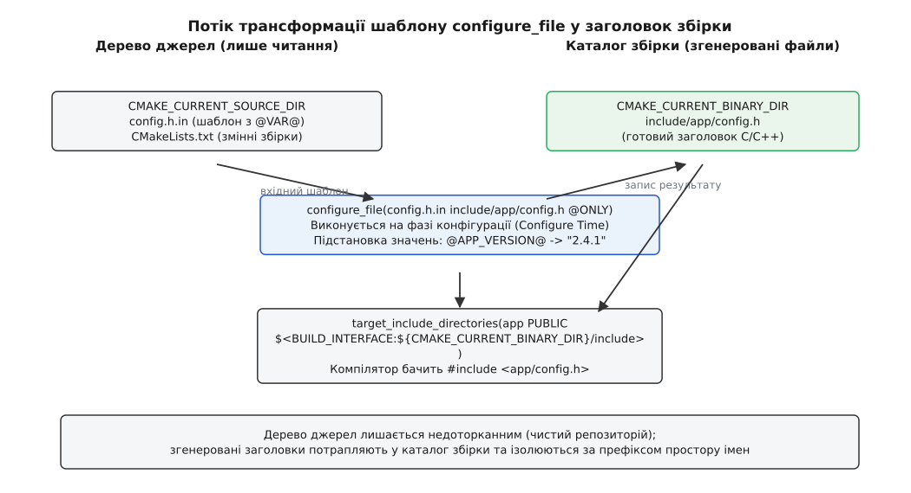
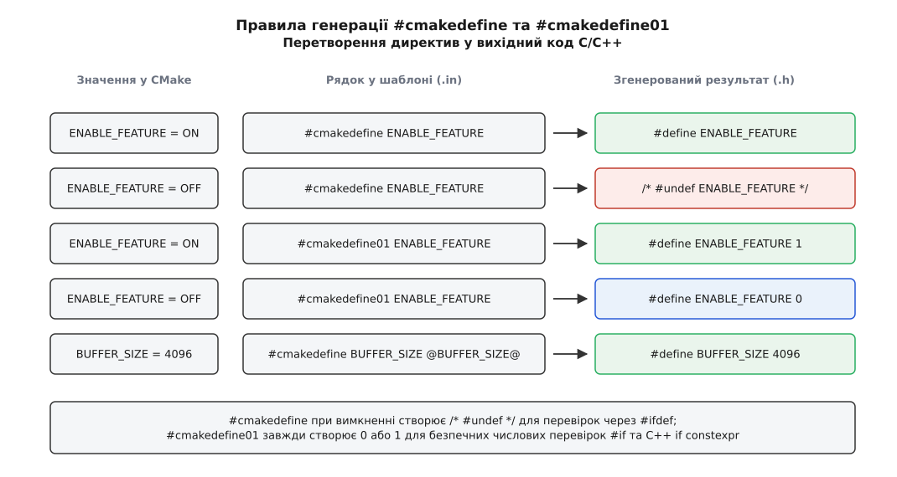
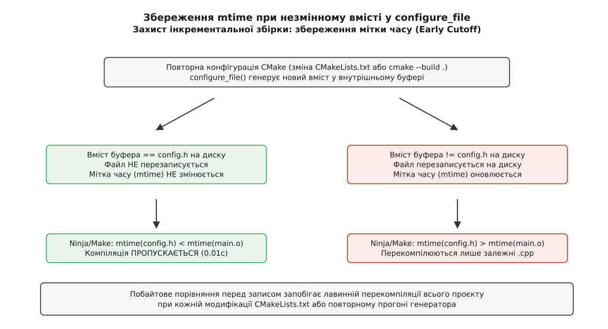

# configure_file: значення конфігурації у згенерованих файлах

<preknowlist>
- [Мова CMakeLists](topic:sys-bsystem/cmake-language) — змінні, типи значень, області видимості та логічні умови (ON/OFF).
- [Цілі й властивості](topic:sys-bsystem/targets-and-properties) — target_include_directories, ізоляція шляхів до заголовків та моделі цілей.
- [Конфігурація, генерація і збірка](topic:sys-bsystem/configure-and-generate) — різниця між фазою конфігурації CMakeLists, генерацією білд-файлів та фазою компіляції.
- [Інкрементальна збірка](topic:sys-bsystem/incremental-build) — мітки часу (mtime), граф залежностей та уникнення зайвої перекомпіляції.
</preknowlist>

Проєкт на C++ складається з тридцяти бібліотек, і кожна утиліта під час запуску з прапорцем `--version` повинна надрукувати рядок версії `v2.4.1`, короткий геш коміту Git `a9f4c3b` та стан апаратних прискорювачів (`AVX-512: enabled`). Якщо прописати ці значення безпосередньо у вихідному файлі `version.cpp`, кожне створення нового тегу або зміна гілки вимагатиме ручного редагування коду. Розробник неминуче забуде оновити номер в одному з файлів, і бінарний артефакт вийде у світ із хибним маркуванням.

Спроба розв'язати проблему через передачу параметрів у командний рядок компілятора видається простою:

```cmake
# Наївне рішення через прапорці компілятора
target_compile_definitions(app PRIVATE
    APP_VERSION="2.4.1"
    APP_GIT_HASH="a9f4c3b"
    ENABLE_AVX512=1
    ASSETS_PATH="/usr/share/app/data"
)
```

Але на першому ж реальному релізі збірка ламається. На операційній системі Windows виклик компілятора `cl.exe` через командну оболонку падає з помилкою переповнення буфера командного рядка: системний ліміт `CreateProcess` (32 767 символів) вичерпується, коли кількість конфігураційних шляхів і макросів зростає. Ще гірше поводиться інкрементальна збірка під Ninja чи Make: варто розробнику зробити новий локальний коміт у Git, як змінюється значення `APP_GIT_HASH`. Оскільки цей макрос входить до командного рядка компіляції кожного окремого файлу `.cpp`, система збірки фіксує зміну команди (`ninja: build command line changed`) і примусово запускає повну перекомпіляцію всіх тридцяти тисяч файлів проєкту з нуля.

Ця криза виникає через фундаментальну помилку: спробу передати структуровані статичні дані програми через динамічний контекст виклику процесу компілятора. Дані конфігурації повинні жити у вихідному коді як типізовані константи або заголовки, але створювати ці файли мусить сама система збірки.

## Механізм configure_file: міст між CMake та вихідним кодом

Щоб поєднати світ змінних системи збірки зі світом мов C та C++, CMake надає команду `configure_file`. Її робота полягає у зчитуванні вхідного текстового файлу-шаблона (за домовленістю з розширенням `.in`, наприклад `config.h.in`), заміні спеціальних маркерів підстановки на фактичні значення змінних CMake та збереженні згенерованого результату в каталозі збірки.

```cmake
configure_file(
    "${CMAKE_CURRENT_SOURCE_DIR}/config.h.in"
    "${CMAKE_CURRENT_BINARY_DIR}/include/app/config.h"
    @ONLY
)
```



*Згенерований заголовок створюється в каталозі збірки на фазі конфігурації, ізолюється префіксом простору імен і підключається до цілі без зміни дерева джерел.*

Головна особливість цієї операції полягає у **моменті її виконання**. Команда `configure_file` відпрацьовує безпосередньо під час фази конфігурації (англ. *configure time*), коли CMake читає `CMakeLists.txt` та будує внутрішнє дерево цілей. Вона не чекає запуску компілятора чи команди `ninja`.

Чому такий порядок є критично важливим? Компілятор C/C++ не може скомпілювати жоден файл джерела, доки препроцесор не знайде всі підключені заголовки через директиви `#include`. Якщо заголовок `config.h` генеруватиметься лише під час збірки (наприклад, через власні правила [custom commands](topic:sys-bsystem/custom-commands)), системі збірки доведеться штучно вводити жорсткі бар'єри порядку залежностей між генератором заголовка та всіма об'єктними файлами. Виконання генерації на фазі конфігурації гарантує: коли генератор Ninja або Make створює кінцевий граф компіляції, файл `config.h` уже фізично лежить на диску, має точний розмір і готовий до інспектування компілятором.

Внутрішній алгоритм парсера CMake під час виконання `configure_file` сканує вхідний потік символів, відстежуючи відкриваючі та закриваючі символи підстановки. Залежно від переданих прапорців, лексер вибирає відповідну таблицю змінних у пам'яті (`cmMakefile`), виконує текстову заміну значень і записує результат у внутрішній буфер оперативної пам'яті перед взаємодією з файловою системою.

Історично такий підхід прийшов у CMake із класичного пакету GNU Autotools, де утиліта `autoheader` та макрос `AC_CONFIG_HEADERS` формували аналогічний заголовок конфігурації для боротьби з несумісністю діалектів Unix. Про те, як виникала ця концепція та від яких болячок 1990-х років вона рятувала індустрію, можна дізнатися в історичному нарисі [від AC_CONFIG_HEADERS до #cmakedefine](topic:sys-bsystem/configure-file-templates/hist-autoconf-config-h.md).

## Синтаксис шаблонізації: @VAR@ проти ${VAR}

Шаблонізатор `configure_file` підтримує два різні стилі позначення змінних, які підлягають заміні:

1. **Класичний стиль `@VAR@`** — ім'я змінної обрамляється символами `@`.
2. **Стиль мови CMake `${VAR}`** — використовує стандартний синтаксис інтерполяції змінних `CMakeLists.txt`.

Якщо викликати команду `configure_file(input output)` без додаткових параметрів, CMake скануватиме файл на наявність **обох** варіантів синтаксису. У простому текстовому файлі це здається зручним, але у вихідному коді C, C++ або скриптах командної оболонки такий подвійний стандарт перетворюється на приховану міну.

Уявімо фрагмент шаблона C++ заголовка без суворого обмеження синтаксису:

```cpp
// template.hpp.in (ПОМИЛКОВИЙ ПІДХІД БЕЗ @ONLY)
#pragma once
#include <string_view>

namespace app {
    inline constexpr std::string_view version = "@PROJECT_VERSION@";

    // Уявімо макрос чи коментар, де зустрічається синтаксис ${...}
    // або регулярний вираз для перевірки параметрів:
    // static constexpr auto pattern = R"(${USER_ID:[0-9]+})";
}
```

Коли CMake бачить послідовність `${USER_ID:[0-9]+}`, він сприймає її як власну змінну. Оскільки змінної з таким дивним ім'ям у пам'яті CMake немає, він підставляє замість неї **порожній рядок**. Код C++ тихо спотворюється:

```cpp
// Результат у згенерованому файлі
namespace app {
    inline constexpr std::string_view version = "2.4.1";
    static constexpr auto pattern = R"()"; // ЗМІСТ ВИДАЛЕНО!
}
```

Така ж катастрофа трапляється під час генерації Bash-скриптів чи конфігурацій `systemd`, де змінні оточення `${PORT}` або `${HOME}` мовчки витираються системою збірки під час копіювання.

### Захист через прапорець @ONLY

Щоб унеможливити подібні колізії, виклик `configure_file` майже завжди повинен містити прапорець `@ONLY`:

```cmake
configure_file(config.h.in config.h @ONLY)
```

Ключове слово `@ONLY` наказує CMake: «Замінюй виключно конструкції вигляду `@ІМ'Я_ЗМІННОЇ@`. Усе, що містить `${...}`, залиш недоторканим як частину цільової мови програмування».

Це залізне правило інженерної гігієни в сучасному CMake: для будь-якого вихідного коду C, C++, Rust, Python або shell-скриптів прапорець `@ONLY` є обов'язковим. Детальний розбір усіх прапорців команди та правил екранування лапок наведено в [довіднику API configure_file](topic:sys-bsystem/configure-file-templates/api-configure-file.md).

> 🔧 **Навіщо це.**
> Додавання `@ONLY` повністю ізолює синтаксис системи збірки від синтаксису цільової мови. Ви можете вільно використовувати шаблони C++, синтаксис `${var}` у shell-скриптах або макроси препроцесора, не боячись, що CMake пошкодить ваш код при копіюванні.

## Логічні директиви: #cmakedefine проти #cmakedefine01

Передача номерів версій і рядків шляхів — лише половина задачі. Інша половина полягає в перемиканні функціональності програми (англ. *feature toggles*): чи збирається проєкт із підтримкою OpenSSL, чи увімкнено модуль стиснення Zstd, чи присутній у системі певний заголовок POSIX.

Для роботи з логічними умовами CMake надає дві спеціальні препроцесорні директиви: `#cmakedefine` та `#cmakedefine01`.



*Директива #cmakedefine генерує коментар undef для перевірок #ifdef, тоді як #cmakedefine01 завжди створює числове значення 0 або 1 для безпечних перевірок #if та C++ if constexpr.*

### 1. Директива #cmakedefine

Директива `#cmakedefine` працює за класичною моделлю мови C. У файлі-шаблоні розробник пише:

```text
/* config.h.in */
#cmakedefine ENABLE_LOGGING
#cmakedefine BUFFER_SIZE @BUFFER_SIZE@
```

Під час генерації CMake перевіряє значення відповідної змінної на «істинність» (англ. *truthiness*). У термінах CMake істинними вважаються значення `1`, `ON`, `YES`, `TRUE`, `Y`, або будь-яке ненульове число чи непустий рядок. Хибними вважаються `0`, `OFF`, `NO`, `FALSE`, `N`, `IGNORE`, `NOTFOUND`, порожній рядок або неіснуюча змінна.

- Якщо `ENABLE_LOGGING` має значення `ON`, рядок перетворюється на:
  ```text
  #define ENABLE_LOGGING
  ```
- Якщо `ENABLE_LOGGING` має значення `OFF` або не визначена, рядок перетворюється на коментар:
  ```text
  /* #undef ENABLE_LOGGING */
  ```
- Для рядка з параметром `#cmakedefine BUFFER_SIZE @BUFFER_SIZE@`, якщо змінна визначена як `4096`, утворюється `#define BUFFER_SIZE 4096`. Якщо ж вона вимкнена, утворюється `/* #undef BUFFER_SIZE */`.

Такий формат ідеально узгоджується з традиційними перевірками препроцесора через `#ifdef` або `#if defined(...)`:

:::tabs
```c
/* Використання у коді на C */
#include "app/config.h"

void init_subsystem(void) {
#ifdef ENABLE_LOGGING
    setup_debug_logger();
#endif
}
```
```cpp
// Використання у коді на C++
#include "app/config.h"

void init_subsystem() {
#ifdef ENABLE_LOGGING
    setup_debug_logger();
#endif
}
```
:::

Проте директива `#cmakedefine` несе в собі серйозний архітектурний ризик, притаманний усім конструкціям на базі `#ifdef`. Якщо розробник напише новий вихідний файл і забуде вставити на початку рядок `#include "app/config.h"`, компілятор не попередить про помилку. Макрос `ENABLE_LOGGING` просто не буде визначений, і гілка коду під `#ifdef` тихо вимкнеться, викликаючи баги, які надзвичайно важко знайти під час налагодження.

### 2. Директива #cmakedefine01

Щоб повністю ліквідувати цей клас помилок, у CMake було створено директиву `#cmakedefine01`. Її поведінка принципово відрізняється: вона **завжди** генерує макрос, присвоюючи йому явне числове значення `1` або `0`.

У шаблоні:
```text
/* config.h.in */
#cmakedefine01 HAVE_ZSTD
#cmakedefine01 USE_FAST_MATH
```

У згенерованому файлі:
```text
/* config.h — якщо HAVE_ZSTD=ON, а USE_FAST_MATH=OFF */
#define HAVE_ZSTD 1
#define USE_FAST_MATH 0
```

Ця різниця докорінно змінює спосіб написання умов у вихідному коді:

:::tabs
```c
/* C-код із директивою #if */
#include "app/config.h"

int compress_payload(const uint8_t* src, size_t len, uint8_t* dst) {
#if HAVE_ZSTD
    return zstd_compress(src, len, dst);
#else
    return raw_copy(src, len, dst);
#endif
}
```
```cpp
// C++20 код із виразом if constexpr
#include <cstdint>
#include <span>
#include "app/config.h"

auto compress_payload(std::span<const std::uint8_t> src, std::span<std::uint8_t> dst) {
    if constexpr (HAVE_ZSTD) {
        return zstd_compress(src, dst);
    } else {
        return raw_copy(src, dst);
    }
}
```
:::

Чому `#cmakedefine01` настільки перевершує звичайний `#cmakedefine`?
1. **Захист від забутого заголовка під прапорцем `-Wundef`.** Компілятори GCC та Clang мають діагностичний прапорець `-Wundef` (або `-Werror=undef`), а MSVC — попередження `/we4668`. Якщо розробник забуде підключити заголовок конфігурації у вихідному файлі, де викликається `#if HAVE_ZSTD`, компілятор негайно перерве збірку з повідомленням про використання невизначеного макроса. Зі звичайним `#ifdef` компілятор промовчить, бо `#ifdef` легально повертає хибність для неоголошених імен.
2. **Підтримка сучасних конструкцій C++.** Починаючи з C++17, константи зі значенням `0` або `1` можна використовувати безпосередньо всередині `if constexpr (...)`, зберігаючи синтаксичну перевірку обох гілок коду компілятором і уникаючи розривів коду макросами препроцесора.

## Захист інкрементальної збірки: збереження мітки часу (Early Cutoff)

Одна з найбільших небезпек кодогенерації у великих проєктах — пошкодження міток часу модифікації файлів (англ. *mtime*).

Системи збірки, такі як Ninja або Make, використовують граф файлових залежностей. Якщо файл `A.cpp` підключає заголовок `config.h`, то утиліта збірки записує правило: час останньої модифікації об'єктного файлу `A.o` повинен бути більшим, ніж час модифікації `config.h` (`mtime(A.o) > mtime(config.h)`). Якщо `config.h` змінюється, всі залежні від нього об'єктні файли вважаються застарілими й вимагають повторної компіляції.



*Побайтове порівняння перед записом захищає мітку mtime і рятує інкрементальну збірку від лавинної перекомпіляції при повторному запуску конфігурації.*

Уявімо, що відбувалося б, якби `configure_file` просто сліпо перезаписував вихідний файл під час кожного виконання `CMakeLists.txt`:

1. Розробник змінює прапорець компіляції для непов'язаної тестової утиліти в кореневому `CMakeLists.txt`.
2. Система збірки фіксує зміну списку файлів і запускає повторну конфігурацію CMake.
3. CMake доходить до виклику `configure_file(config.h.in config.h)`.
4. Наївний запис створює новий дескриптор файлу й записує поточний час операційної системи в атрибути `mtime` файлу `config.h`.
5. Коли керування повертається до Ninja, вона бачить: `config.h` «новіший», ніж усі зібрані об'єктні файли в проєкті.
6. **Результат:** весь проєкт перекомпілюється з нуля протягом 20 хвилин, хоча жодне значення всередині `config.h` не змінилося ані на байт.

### Алгоритм побайтового порівняння

CMake містить вбудований захист від цієї катастрофи, відомий як алгоритм раннього відсікання (англ. *early cutoff*):

1. Коли виконується `configure_file`, CMake формує результуючий текст у внутрішньому буфері оперативної пам'яті.
2. Перед тим як відкрити цільовий файл на диску для запису, CMake перевіряє, чи файл уже існує.
3. Якщо файл існує, CMake зчитує його поточний вміст із диска та порівнює його з новим згенерованим буфером побайтово.
4. **Якщо вміст повністю ідентичний**, CMake **не торкається** файлу на диску: він не викликає системний виклик запису, не створює новий дескриптор/inode і не оновлює поле `mtime`.
5. Тільки якщо виявлено хоча б один змінений байт (або файл взагалі відсутній), CMake виконує перезапис і оновлює дату модифікації.

Завдяки цьому розумному механізму розробник може скільки завгодно змінювати `CMakeLists.txt`, додавати нові файли чи перебудовувати граф цілей — якщо значення параметрів у `config.h` залишаються тими самими, Ninja миттєво повідомляє: `ninja: no work to do`, і збірка завершується за частки секунди.

Цей механізм також запобігає проблемам із гранулярністю таймстемпів на застарілих чи віртуальних файлових системах (наприклад, FAT32 із 2-секундною роздільною здатністю або мережевих змонтованих каталогах NFS/SMB), де помилковий перезапис файлу міг би спричинити нескінченний цикл повторних збірок.

## Дисципліна шляхів: ізоляція дерева джерел та CMAKE_CURRENT_BINARY_DIR

Одне з непорушних правил професійної роботи з CMake — повна ізоляція дерева джерел (англ. *source tree*) від каталогу збірки (англ. *binary tree / build tree*). Дерево джерел, де лежить репозиторій Git, має розглядатися як доступне **виключно для читання**.

Звідси випливає фундаментальна вимога: згенеровані файли конфігурації **ніколи не повинні створюватися всередині `CMAKE_CURRENT_SOURCE_DIR`**.

### Чому генерація у дереві джерел є шкідливою

1. **Забруднення Git.** Згенерований файл `config.h` потрапляє в робоче дерево. Якщо розробник забуде додати його до `.gitignore`, він випадково потрапить у коміт і конфліктуватиме з конфігураціями інших розробників.
2. **Злам мультиконфігураційних та паралельних збірок.** Неможливо буде одночасно тримати два каталоги збірки — наприклад, `build-debug` із прапорцем `DEBUG_LOGS=ON` та `build-release` із `DEBUG_LOGS=OFF`. Вони перезаписуватимуть один і той самий файл у каталозі джерел.
3. **Неможливість збірки на файлових системах лише для читання.** У середовищах CI/CD вихідний код часто монтується в контейнер Docker із правами `read-only` для гарантії безпеки та відтворюваності.

### Правильна організація каталогів

Згенерований файл завжди записується у підкаталог `${CMAKE_CURRENT_BINARY_DIR}`:

```cmake
# Правильне розміщення згенерованого заголовка
set(GENERATED_DIR "${CMAKE_CURRENT_BINARY_DIR}/generated")

configure_file(
    "${CMAKE_CURRENT_SOURCE_DIR}/include/my_lib/config.h.in"
    "${GENERATED_DIR}/include/my_lib/config.h"
    @ONLY
)
```

Зверніть увагу на структуру шляху: файл кладеться не просто в корінь каталогу збірки, а у підкаталог `generated/include/my_lib/config.h`.

Чому це критично?
- Якщо додати до шляхів пошуку заголовків сам каталог `${CMAKE_CURRENT_BINARY_DIR}`, компілятор шукатиме файли за коротким іменем `#include <config.h>`. Якщо в проєкті є десять бібліотек і кожна має свій `config.h`, виникне хаос: компілятор підхопить перший ліпший заголовок з першого каталогу збірки, який потрапить у прапорець `-I`.
- Крім того, у корені `CMAKE_CURRENT_BINARY_DIR` CMake створює власні службові каталоги (наприклад, `CMakeFiles`, `CMakeTmp`). Якщо відкрити корінь білд-папки для пошуку інклудів, можна випадково перекрити стандартні системні заголовки.
- Структура `generated/include/my_lib/config.h` дозволяє підключати файл за унікальним кваліфікованим іменем простору назв: `#include <my_lib/config.h>`.

### Підключення до цілі через генераторні вирази

Щоб ціль знала, де шукати згенерований заголовок під час збірки і де його шукатимуть зовнішні споживачі після встановлення (через команду `install`), використовують генераторні вирази вимог вжитку:

```cmake
add_library(my_lib STATIC src/core.cpp)

target_include_directories(my_lib PUBLIC
    # Під час власної збірки проєкту: згенеровані заголовки з каталогу збірки
    $<BUILD_INTERFACE:${GENERATED_DIR}/include>
    # Під час власної збірки: звичайні публічні заголовки з дерева джерел
    $<BUILD_INTERFACE:${CMAKE_CURRENT_SOURCE_DIR}/include>
    # Після встановлення в систему через CMake install:
    $<INSTALL_INTERFACE:include>
)
```

Завдяки цьому ціль `my_lib` експортує правильні шляхи як для локальної компіляції всередині дерева проєкту, так і для віддачі назовні через пакети [find_package](topic:sys-bsystem/find-package).

## Архітектурне розділення: приватна та публічна конфігурація

При проєктуванні бібліотек часто виникає питання: чи можна підключати згенерований `config.h` у публічні заголовки, які потім встановлюються в систему (`/usr/include/my_lib/`)?

Відповідь однозначна: **ні, приватний `config.h` ніколи не повинен потрапляти у публічний API бібліотеки**.

Якщо публічний заголовок `my_lib/api.h` містить рядок `#include <my_lib/config.h>`, у якому визначено макроси на кшталт `HAVE_ZSTD`, `VERSION` або `BUFFER_SIZE`, ці макроси витікають у глобальний препроцесорний простір кожного проєкту користувача, який підключить вашу бібліотеку. Якщо користувач лінкує дві різні бібліотеки, кожна з яких має власний `VERSION`, виникнуть непереборні конфлікти препроцесора.

Правильне інженерне рішення полягає у створенні двох окремих файлів:

1. **Приватний заголовок `my_lib_config_private.h`:** містить внутрішні макроси оптимізацій, системні перевірки POSIX та розміри буферів. Він підключається виключно всередині `.c`/`.cpp` файлів бібліотеки і ніколи не встановлюється командою `install(FILES ...)`.
2. **Публічний заголовок функцій `my_lib_features.h`:** якщо користувачеві бібліотеки необхідно знати, які модулі скомпільовано, цей заголовок генерується з префіксованими макросами (наприклад, `MYLIB_HAS_FEATURE_ZSTD`) або константами в просторі імен C++ `namespace my_lib::features { inline constexpr bool has_zstd = true; }`.

## Гранулярність заголовків конфігурації

У великих архітектурних системах монолітний заголовок конфігурації із сотнею прапорців стає вузьким місцем інкрементальної збірки. Якщо один файл об'єднує версію Git, системні прапорці POSIX, розміри буферів та шляхи до ресурсів, будь-яка зміна версії призводить до перекомпіляції кожного модуля.

Патерн розділення конфігурації (англ. *Configuration Segregation*) пропонує генерувати кілька вузькоспеціалізованих заголовків:

1. `version.hpp` — генерується з шаблону `version.hpp.in`, містить номер релізу та Git-геш. Підключається лише тими одиницями трансляції, які безпосередньо виводять інформацію про версію чи діагностику (наприклад, обробник аргументу `--version`).
2. `features.h` — генерується з `features.h.in`, містить макроси `#cmakedefine01` для перемикачів модулів (SSL, Zstd, SIMD). Підключається фабриками створення об'єктів та драйверами бекендів.
3. `paths.h` — містить шляхи до каталогів даних за замовчуванням (`/usr/share/app`). Підключається виключно модулем завантаження ресурсів.

Завдяки такій грануляції оновлення Git-коміту чи зміна шляху до ресурсів перекомпільовує рівно один вихідний файл замість усього дерева збірки.

## Порівняння: configure_file чи target_compile_definitions

Коли постає задача передати параметр конфігурації у вихідний код, інженер завжди обирає між двома основними інструментами: генерацією файлу через `configure_file` та оголошенням препроцесорних макросів через `target_compile_definitions`.

Вибір між ними — це не питання смаку, а зважений інженерний компроміс між швидкістю збірки, зручністю налагодження та структурою проєкту.

| Критерій | `configure_file()` (згенерований файл) | `target_compile_definitions()` (прапорці командного рядка) |
| :--- | :--- | :--- |
| **Місце збереження** | Фізичний файл на диску (`config.h` / `version.hpp`) | Прапорці командного рядка компілятора (`-DFOO=BAR`, `/DFOO=BAR`) |
| **Вплив зміни значення на інкрементальну збірку** | Локальний: перекомпілюються лише ті `.cpp`, де явно написано `#include "config.h"` | Глобальний: змінюється командний рядок компілятора, тому перекомпілюються **всі** `.cpp` цілі |
| **Робота з великими обсягами даних** | Ідеально: вміщує будь-яку кількість рядків, складні структури C++, масиви, багаторядкові тексти | Погано: довжина обмежена лімітами командного рядка операційної системи |
| **Підтримка статичної типізації C++** | Повна: дозволяє створювати `inline constexpr`, структури, `std::string_view`, типи `enum class` | Відсутня: передає лише нетипізовані текстові макроси препроцесора |
| **Зручність в IDE та мовних серверах (LSP/clangd)** | Відмінна: заголовок індексується, працює автодоповнення, перехід до оголошення (*Go to Definition*) | Посередня: дефайни видно лише в контексті збірки, відсутній перехід до місця створення значення |
| **Вимоги до налаштування CMake** | Потрібен шаблон `.in`, виклик команди та додавання каталогу в `target_include_directories` | Один рядок команди в `CMakeLists.txt` |

### Коли обирати target_compile_definitions

`target_compile_definitions` є правильним вибором для **системних прапорців низького рівня**, які впливають на поведінку стандартної бібліотеки або бінарний інтерфейс (ABI) абсолютно кожного файлу в бібліотеці:
- Перемикання налагоджувального режиму: `-DNDEBUG`.
- Активація стандартів POSIX / GNU: `-D_GNU_SOURCE`, `-D_POSIX_C_SOURCE=200809L`.
- Увімкнення Unicode на Windows: `-DUNICODE`, `-D_UNICODE`.
- Експорт символів динамічних бібліотек: `-DMY_LIB_EXPORTS`.

### Коли обов'язково обирати configure_file

`configure_file` є єдино правильним рішенням для:
- Семантичних версій та динамічних метаданих збірки (геш коміту, гілка, дата).
- Великої кількості перемикачів функціональності (feature flags).
- Шляхів до каталогів встановлення ресурсів за замовчуванням.
- Створення сучасних C++ заголовків із типізованими константами замість макросів препроцесора.

Повний приклад реалізації промислового пайплайну з отриманням версії з Git, перемикачами модулів та сучасною C++ структурою наведено у практичному проєкті [конфігураційного пайплайну](topic:sys-bsystem/configure-file-templates/proj-config-pipeline.md).

## Взаємодія з мовними серверами та ccache

Сучасне розробницьке середовище значною мірою спирається на інструменти статичного аналізу та мовні сервери (Language Server Protocol, зокрема `clangd`), які використовують базу даних команд компіляції `compile_commands.json` (що вмикається у CMake директивою `set(CMAKE_EXPORT_COMPILE_COMMANDS ON)`).

Коли файл конфігурації генерується за допомогою `configure_file` у каталог `${CMAKE_CURRENT_BINARY_DIR}` і підключається через `target_include_directories`, шлях до цього каталогу автоматично потрапляє у прапорець `-I` відповідного запису в `compile_commands.json`. Завдяки цьому `clangd` миттєво відкриває згенерований `config.h`, підтримує повноцінну навігацію по коду та автодоповнення для всіх згенерованих типів і макросів.

Інструмент кешування компіляції `ccache` також ідеально взаємодіє з `configure_file`. Оскільки `ccache` формує хеш вхідних даних на основі препроцесованого виводу компілятора (`-E`), збереження стабільного вмісту `config.h` гарантує 100% потрапляння в кеш (*cache hit*) навіть після перезапуску конфігурації CMakeLists.

## Генерація системних файлів та метаданих пакетів

Сфера застосування `configure_file` виходить далеко за межі коду C та C++. Ця команда є стандартним засобом створення системних конфігурацій, скриптів автоматизації та файлів метаданих пакетів.

### 1. Генерація файлів pkg-config (.pc)

Для того щоб бібліотеку можна було знаходити в системі через утиліту `pkg-config`, CMake генерує файл опису `libfoo.pc`:

```text
# libfoo.pc.in — шаблон для pkg-config
prefix=@CMAKE_INSTALL_PREFIX@
exec_prefix=${prefix}
libdir=${prefix}/@CMAKE_INSTALL_LIBDIR@
includedir=${prefix}/@CMAKE_INSTALL_INCLUDEDIR@

Name: @PROJECT_NAME@
Description: Високопродуктивна бібліотека діагностики
Version: @PROJECT_VERSION@
Libs: -L${libdir} -ldiag_core
Cflags: -I${includedir}
```

Під час генерації зверніть увагу: ми використовуємо синтаксис `@..._..._@` для змінних CMake (`@CMAKE_INSTALL_PREFIX@`, `@PROJECT_VERSION@`), тоді як змінні на зразок `${prefix}` та `${libdir}` залишаються незмінними завдяки прапорцю `@ONLY`, щоб утиліта `pkg-config` могла коректно розкривати їх під час запуску в системі.

```cmake
# Генерація файлу для pkg-config
include(GNUInstallDirs)
configure_file(
    "${CMAKE_CURRENT_SOURCE_DIR}/libdiag.pc.in"
    "${CMAKE_CURRENT_BINARY_DIR}/libdiag.pc"
    @ONLY
)

install(FILES "${CMAKE_CURRENT_BINARY_DIR}/libdiag.pc"
    DESTINATION "${CMAKE_INSTALL_LIBDIR}/pkgconfig"
)
```

### 2. Генерація юніт-файлів systemd та desktop-ярликів

Аналогічним чином `configure_file` застосовується для вшивання точних абсолютних шляхів встановлення у конфігурації сервісів `systemd` (`service.in` -> `.service`) та файли запуску стільниці Linux (`app.desktop.in` -> `.desktop`), де виконуваний бінарний файл повинен викликатися за точним шляхом `/usr/bin/app` або `/opt/app/bin/app`.

## Межа можливостей: генераторні вирази та file(GENERATE)

Поширена помилка початківців у CMake — спроба використати у файлі-шаблоні [генераторні вирази](topic:sys-bsystem/generator-expressions) на кшталт `$<CONFIG>` або `$<TARGET_PROPERTY:tgt,PROP>`:

```text
/* config.h.in — ПОМИЛКА: це НЕ спрацює у configure_file */
#define BUILD_TYPE "@$<CONFIG>@"
```

Якщо виконати `configure_file` над цим шаблоном, результуючий файл міститиме буквальний текст: `#define BUILD_TYPE "$<CONFIG>"`.

### Чому генераторні вирази не працюють у configure_file

Причина криється у фундаментальному розподілі життєвого циклу CMake на три послідовні фази:

```
[ 1. Фаза конфігурації ]  ──►  [ 2. Фаза генерації ]  ──►  [ 3. Фаза збірки ]
  (Configure Time)               (Generate Time)             (Build Time)
  - Виконується CMakeLists.txt   - Обчислюються вирази $<...>  - Працює Ninja / cl / gcc
  - Працює configure_file()      - Створюються build.ninja    - Компілюється код C/C++
  - Генераторні вирази НЕВІДОМІ  - Працює file(GENERATE)
```

Команда `configure_file` виконується на **першій фазі** (конфігурація). У цей момент CMake ще не знає, яка саме конфігурація збиратиметься в мультиконфігураційних генераторах (таких як Visual Studio, Xcode або Ninja Multi-Config), де вибір між `Debug` та `Release` робиться пізніше, безпосередньо під час запуску збірки. Генераторні вирази обчислюються лише на **другій фазі** (генерація).

### Коли потрібен file(GENERATE)

Якщо вам дійсно необхідно створити файл, зміст якого залежить від цільової конфігурації збірки (`Debug` чи `Release`) або властивостей іншої цілі, слід використовувати команду `file(GENERATE)`:

```cmake
# Генерація файлу на фазі GENERATE
file(GENERATE
    OUTPUT "${CMAKE_CURRENT_BINARY_DIR}/config_$<CONFIG>.h"
    CONTENT "inline constexpr const char* CURRENT_CONFIG = \"$<CONFIG>\";\n"
)
```

Команда `file(GENERATE)` розкриває всі вирази `$<...>` і створює окремий файл для кожної підтримуваної конфігурації проєкту. Проте вона не підтримує директиви `#cmakedefine` та призначена переважно для специфічних файлів зв'язування інструментів, скриптів запуску тестів або файлів відповідей компілятора.

## Практичні пастки та правила надійного кодогенератора

Під час роботи з шаблонами виникає кілька тонких моментів, які можуть призвести до важковловлюваних помилок або проблем із кросплатформовістю.

### 1. Формат перенесення рядків (CRLF vs LF)

За замовчуванням `configure_file` створює вихідний файл із перенесенням рядків, прийнятим в операційній системі хоста, на якій запущено CMake (CRLF на Windows, LF на Linux і macOS). Якщо розробник збирає код на Windows під WSL або кроскомпілює під вбудовані системи з Linux, різниця у форматах може викликати попередження компілятора або зламати парсери текстових файлів.

Щоб зафіксувати однаковий формат перенесення рядків на всіх платформах, використовують прапорець `NEWLINE_STYLE`:

```cmake
configure_file(
    "${CMAKE_CURRENT_SOURCE_DIR}/script.sh.in"
    "${CMAKE_CURRENT_BINARY_DIR}/script.sh"
    @ONLY
    NEWLINE_STYLE LF
)
```

Це гарантує, що згенерований shell-скрипт матиме чисті Unix-кінці рядків `\n` навіть під час запуску генерації на машині під керуванням Windows.

### 2. Екранування лапок у рядкових змінних

Якщо змінна CMake містить рядок із внутрішніми лапками, під час простої підстановки у C/C++ код ці лапки порушать синтаксис рядкового літерала:

```cmake
# Змінна містить лапки всередині
set(APP_DESCRIPTION "My \"Super\" Utility")
```

Якщо шаблон має вигляд:
:::tabs
```c
const char* desc = "@APP_DESCRIPTION@";
```
```cpp
#include <string_view>
inline constexpr std::string_view desc = "@APP_DESCRIPTION@";
```
:::

То без додаткових опцій утвориться синтаксично некоректний код:
:::tabs
```c
const char* desc = "My "Super" Utility"; /* ПОМИЛКА КОМПІЛЯЦІЇ! */
```
```cpp
#include <string_view>
inline constexpr std::string_view desc = "My "Super" Utility"; // ПОМИЛКА КОМПІЛЯЦІЇ!
```
:::

Додавання прапорця `ESCAPE_QUOTES` автоматично екранує всі внутрішні подвійні лапки символом зворотного слешу `\"`:

```cmake
configure_file(config.h.in config.h @ONLY ESCAPE_QUOTES)
```

Результат стає абсолютно коректним:
:::tabs
```c
const char* desc = "My \"Super\" Utility";
```
```cpp
#include <string_view>
inline constexpr std::string_view desc = "My \"Super\" Utility";
```
:::

### 3. Безпека прав доступу згенерованих скриптів

Якщо ви генеруєте не C/C++ заголовок, а виконуваний скрипт (Bash або Python), результуючий файл повинен мати встановлений біт виконання (`chmod +x`).

За замовчуванням CMake копіює права доступу з вхідного файлу-шаблона. Але якщо вхідний файл у репозиторії випадково втратив права виконання, або якщо ви хочете явно зафіксувати політику безпеки, у CMake 3.19+ доступний параметр `FILE_PERMISSIONS`:

```cmake
configure_file(
    "${CMAKE_CURRENT_SOURCE_DIR}/run_tests.sh.in"
    "${CMAKE_CURRENT_BINARY_DIR}/run_tests.sh"
    @ONLY
    FILE_PERMISSIONS OWNER_READ OWNER_WRITE OWNER_EXECUTE GROUP_READ GROUP_EXECUTE
)
```

## Підсумок архітектурного вибору

Генерація файлів конфігурації через `configure_file` — це стандартний, надійний та високопродуктивний спосіб зв'язку системи збірки з вихідним кодом програми. Дотримання п'яти ключових правил забезпечує чистоту та стабільність вашої збірки:

1. **Завжди вказуйте `@ONLY`** для захисту синтаксису C/C++ та скриптів від випадкового спотворення системою збірки.
2. **Використовуйте `#cmakedefine01`** для логічних перемикачів функцій замість `#cmakedefine`, щоб компілятор захищав вас від пропущених заголовків через перевірку `#if` та прапорець `-Wundef`.
3. **Генеруйте файли виключно у `${CMAKE_CURRENT_BINARY_DIR}`** всередині структурованого підкаталогу (наприклад, `generated/include/libname/`) та експортуйте його через генераторний вираз `$<BUILD_INTERFACE:...>` у команді `target_include_directories`.
4. **Покладайтеся на розумне збереження `mtime`**: завдяки автоматичному побайтовому порівнянню CMake не перезаписує незмінені файли, захищаючи інкрементальну збірку вашого проєкту від непотрібних витрат часу.
5. **Розділяйте конфігурацію за призначенням**: тримайте внутрішній `config.h` суворо приватним, надавайте зовнішнім споживачам лише ізольований `features.h`, а динамічні метадані версії виділяйте в окремий `version.hpp` для мінімізації каскадних перекомпіляцій.
