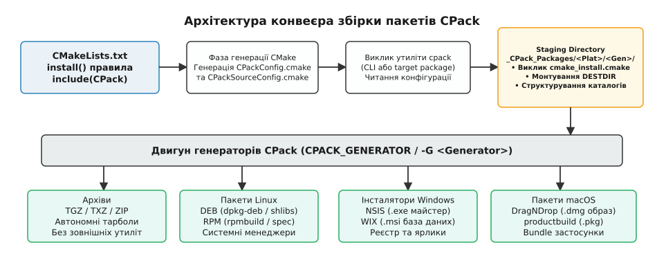
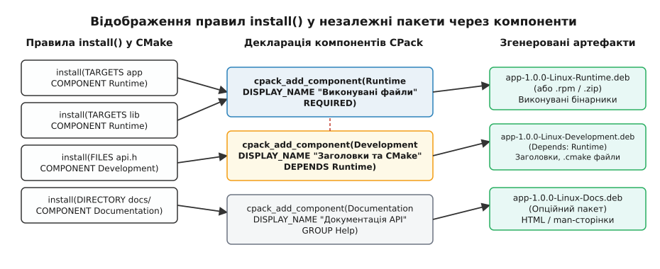
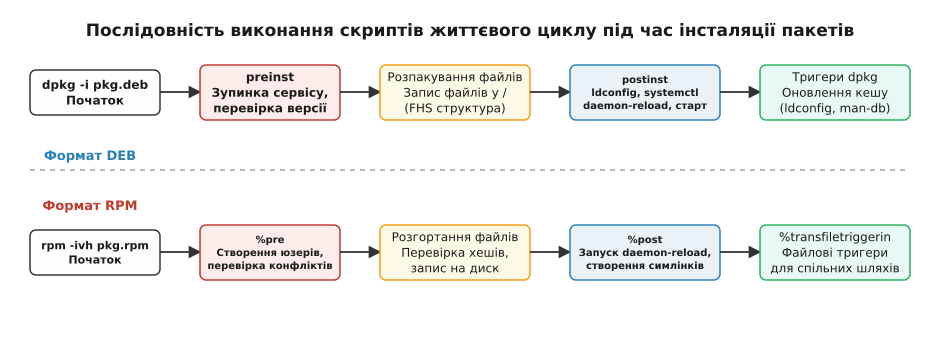

# CPack: збірка дистрибутива

<preknowlist>
- [install і export](root:sys-bsystem/install-and-export) — встановлення артефактів збірки, бібліотек та конфігураційних файлів у дерево інсталяції.
- [Конфігурація, генерація і збірка](root:sys-bsystem/configure-and-generate) — етапи генерації файлів CMake та виконання збірки.
- [Цілі й властивості](root:sys-bsystem/targets-and-properties) — цілі CMake, їхній тип та властивості цільових файлів.
</preknowlist>

Успішна компіляція та лінкування вихідного коду залишають бінарні артефакти у каталозі збірки розробника, де абсолютні шляхи прив'язані до локальної файлової системи, налагоджувальні символи вшиті в об'єктні файли, а динамічні бібліотеки шукаються за тимчасовими шляхами компілятора. Доставка готового програмного забезпечення кінцевим користувачам або розгортання на серверах вимагає перетворення цих сирих бінарників на повноцінні дистрибутивні пакети: пакунки `.deb` для екосистеми Debian та Ubuntu, пакунки `.rpm` для сімейства Red Hat, Fedora та SUSE, інсталяційні майстри `.exe` чи транзакційні пакети `.msi` для Windows, монтовані образи `.dmg` для macOS або самодостатні архіви `.tar.gz` для вбудованих систем.

Спроба писати та підтримувати окремі сценарії пакування поза системою збірки призводить до швидкої розсинхронізації проєкту. Додавання нового заголовочного файлу, перейменування динамічної бібліотеки чи зміна прав доступу до виконуваного файлу в `CMakeLists.txt` вимагає ручного дублювання тих самих змін у файлах специфікацій RPM (`spec`), контрольних каталогах Debian (`debian/`) або скриптах інсталяторів NSIS. Будь-яка неточність призводить до того, що пакунок збирається без помилок, але втрачає критичні файли під час встановлення. CPack усуває це дублювання, повторно використовуючи вже описані в CMake правила інсталяції для автоматичного синтезу дистрибутивів під будь-яку цільову платформу.

## Архітектура та модель виконання CPack

CPack — це спеціалізований генератор пакетів, який входить до стандартного постачання CMake. Він не компілює код самостійно, а бере результати роботи системи збірки та упаковує їх у відповідні архівні й пакетні формати. Конвеєр роботи CPack чітко розділений на два ізольовані етапи: декларацію та генерацію конфігурації під час виконання CMake, і подальше автономне пакування за допомогою утиліти `cpack`.

```
+------------------+         +--------------------------+
|  CMakeLists.txt  | ------> | cmake --build (компіляція)|
| install() правила|         +--------------------------+
|  include(CPack)  |                      |
+------------------+                      v
         |                   +--------------------------+
         v                   |     Утиліта cpack        |
+----------------------+     |Читає CPackConfig.cmake   |
|  CPackConfig.cmake   | --> |Виконує cmake_install.cmake|
|CPackSourceConfig.cmake|    +--------------------------+
+----------------------+                  |
                                          v
                             +--------------------------+
                             |    Staging Directory     |
                             |   _CPack_Packages/...    |
                             +--------------------------+
                                          |
                                          v
                             +--------------------------+
                             |      Генератори          |
                             |  DEB / RPM / NSIS / TGZ  |
                             +--------------------------+
```

### Фаза генерації конфігураційних файлів

Коли у кореневому `CMakeLists.txt` викликається директива `include(CPack)`, CMake виконує інтроспекцію всіх оголошених змінних із префіксом `CPACK_*`, метаданих проєкту з команди `project()` та зареєстрованих правил `install()`. За результатами цього аналізу в корені каталогу збірки генеруються два службові файли:
1. `CPackConfig.cmake` — конфігураційний файл для бінарного пакування. Він фіксує перелік обраних генераторів, версію пакета, контакти автора, опис компонентів, правила встановлення та шляхи до скриптів супроводу.
2. `CPackSourceConfig.cmake` — конфігураційний файл для пакування вихідного коду (source packages). Він містить перелік правил включення та регулярних виразів для відсікання скомпільованих файлів, об'єктних архівів і службових каталогів систем контролю версій.

Під час генерації `CPackConfig.cmake` CMake аналізує всі виклики `install()` у проєкті, включаючи підкаталоги, додані через `add_subdirectory()`. Для кожного виклику фіксується цільовий компонент (`COMPONENT`), відносний або абсолютний шлях призначення (`DESTINATION`), права доступу (`PERMISSIONS`), а також умови експорту (`EXPORT`).

### Фаза пакування та ізольоване монтування (Staging)

Створення готових пакетів відбувається після успішного завершення збірки бінарників. Розробник або CI/CD конвеєр запускає утиліту `cpack` (або ціль збірки `cmake --build . --target package`). У цей момент виконується детермінована послідовність кроків:

1. **Ініціалізація та зчитування конфігурації:** Утиліта `cpack` завантажує згенерований `CPackConfig.cmake` у власне ізольоване середовище виконання CMake-скриптів.
2. **Створення проміжного каталогу (Staging Directory):** У каталозі збірки формується тимчасова ієрархія папок виду `_CPack_Packages/<Платформа>/<Генератор>/<Ім'яПакета>/`. Цей каталог слугує віртуальним коренем файлової системи майбутнього пакета.
3. **Фактична інсталяція через механізм DESTDIR:** CPack викликає внутрішній скрипт `cmake_install.cmake`, передаючи шлях до каталогу staging як значення змінної `DESTDIR`. Усі файли, цілі, бібліотеки та конфігурації, описані правилами `install()`, копіюються у це дерево зі збереженням точної структури підкаталогів, символічних посилань та прав доступу POSIX.
4. **Формування маніфесту інсталяції:** У процесі копіювання формується службовий файл `install_manifest.txt`, де фіксується повний перелік розгорнутих файлів, їхні розміри та контрольні суми.
5. **Виклик рушія генератора:** Згенероване дерево каталогів передається на вхід бекенду генератора. CPack або формує архів самостійно за допомогою вбудованої бібліотеки `libarchive`, або генерує службові маніфести (наприклад, `.spec` для RPM, `control` для DEB чи `.nsi` для NSIS) і викликає системні утиліти пакування.
6. **Валідація та фіналізація:** Готові пакети переміщуються у корінь каталогу збірки, після чого тимчасові файли видаляються.


*Архітектура конвеєра CPack: від правил install() через staging-дерево до нативних пакетів*

## Класифікація та вибір генераторів CPack

CPack надає широкий спектр генераторів, що охоплюють більшість сучасних операційних систем. Архітектурно генератори поділяються на дві категорії: внутрішні генератори прямої архівації та зовнішні генератори-обгортки.

Внутрішні генератори використовують скомпільовану всередині CMake бібліотеку `libarchive`. Вони здатні створювати стиснені архіви на будь-якій платформі без встановлення стороннього програмного забезпечення. Зовнішні генератори синтезують метадані й викликають нативні інструменти операційної системи, що гарантує 100% сумісність із системними менеджерами пакетів.

| Група генераторів | Генератори | Формат файлів | Механізм створення | Цільове призначення |
|---|---|---|---|---|
| **Архіви** | `TGZ`, `TXZ`, `ZIP`, `7Z`, `STGZ` | `.tar.gz`, `.tar.xz`, `.zip`, `.7z`, `.sh` | Пряма архівація через `libarchive` | Портативні бінарні архіви, вбудовані системи |
| **Пакети Linux** | `DEB`, `RPM`, `FreeBSD` | `.deb`, `.rpm`, `.pkg` | Синтез маніфестів + `dpkg-deb` / `rpmbuild` | Встановлення через системні менеджери `apt`, `dnf`, `zypper` |
| **Інсталятори Windows** | `NSIS`, `WIX`, `NuGet`, `ZIP` | `.exe`, `.msi`, `.nupkg`, `.zip` | Генерація скриптів + `makensis` / WiX Toolset | Графічні майстри інсталяції та групові політики Active Directory |
| **Пакети macOS** | `DragNDrop`, `productbuild`, `Bundle` | `.dmg`, `.pkg`, `.app` | Системні виклики `hdiutil`, `productbuild` | Графічне розгортання в `/Applications` або кероване встановлення |

Окремої уваги заслуговує генератор `STGZ` (Self-Extracting Tar GZip). Він створює виконуваний shell-скрипт із бінарним gzip-хвостом. При запуску такий скрипт автоматично розпаковує свій вміст у поточний каталог, що робить його незамінним для інсталяції на вбудованих Linux-системах, де відсутні повноцінні пакетні менеджери.

Генератор `NuGet` орієнтований на розробників бібліотек C++ під платформу Windows: він пакує бінарники, імпортні бібліотеки та заголовки у формат `.nupkg` для зручного споживання іншими проєктами у середовищі Visual Studio та MSBuild.

Вибір необхідного генератора здійснюється у `CMakeLists.txt` через встановлення списку `CPACK_GENERATOR` або передачею параметра командного рядка під час запуску:

```bash
# Створення DEB-пакета та tar.gz архіву за один прогін
cpack -G "DEB;TGZ"
```

## Компонентне пакування: логічні шари продукту

У реальних проєктах монолітний дистрибутив, що об'єднує всі артефакти в один файл, часто є неприйнятним. Кінцевому користувачеві потрібні лише скомпільовані бінарники та спільні бібліотеки; розробникам сторонніх додатків потрібні C/C++ заголовки та файли імпорту CMake; адміністраторам потрібна документація та конфігурації служб.

CPack вирішує цю проблему за допомогою компонентного пакування (*Component-Based Packaging*). Кожне правило інсталяції у `CMakeLists.txt` маркується назвою відповідного логічного компонента через параметр `COMPONENT`:

```cmake
# 1. Компонент виконання: бінарники та динамічні бібліотеки
install(TARGETS myapp mylib
    EXPORT MyAppTargets
    RUNTIME DESTINATION bin COMPONENT Runtime
    LIBRARY DESTINATION lib COMPONENT Runtime
    ARCHIVE DESTINATION lib COMPONENT Development
    NAMELINK_COMPONENT Development
)

# 2. Компонент розробника: заголовки та метадані експорту цілей
install(DIRECTORY include/
    DESTINATION include
    COMPONENT Development
)
install(EXPORT MyAppTargets
    NAMESPACE MyApp::
    DESTINATION lib/cmake/MyApp
    COMPONENT Development
)

# 3. Компонент документації: man-сторінки та HTML-довідка
install(DIRECTORY doc/html/
    DESTINATION share/doc/myapp
    COMPONENT Documentation
)
```

> 🔧 **Навіщо це:** Розподіл цілей через `NAMELINK_COMPONENT Development` та призначення типів артефактів (`RUNTIME`, `LIBRARY`, `ARCHIVE`) розв'язує фундаментальну відмінність між операційними системами. У Windows динамічні бібліотеки `.dll` завантажуються за тими самими правилами, що й виконувані файли `.exe`, тому потрапляють у категорію `RUNTIME` (каталог `bin`). Натомість супровідні імпортні бібліотеки `.lib` потрапляють у `ARCHIVE` (каталог `lib`) і потрібні лише для розробки. У Linux реальна версіована бібліотека `libmylib.so.1.2.0` є `LIBRARY`, а символічне посилання без версії `libmylib.so` — це `NAMELINK`, який спрямовується у компонент `Development`.

### Декларація властивостей та залежностей компонентів

Для керування тим, як компоненти відображаються у графічних інсталяторах та упаковуються в системні пакети, використовується модуль `include(CPackComponent)`:

```cmake
include(CPack)
include(CPackComponent)

# Опис компонента Runtime
cpack_add_component(Runtime
    DISPLAY_NAME "Основні програми та бібліотеки"
    DESCRIPTION "Необхідні файли для роботи сервісу."
    REQUIRED
)

# Опис компонента Development
cpack_add_component(Development
    DISPLAY_NAME "SDK для розробників"
    DESCRIPTION "Заголовочні файли та конфігурації CMake."
    DEPENDS Runtime
    GROUP SDK
)

# Опис компонента Documentation
cpack_add_component(Documentation
    DISPLAY_NAME "Документація API"
    DESCRIPTION "Повні посібники користувача та довідка з функцій."
    DISABLED
    GROUP SDK
)

# Опис групи компонентів
cpack_add_component_group(SDK
    DISPLAY_NAME "Розширення та розробка"
    DESCRIPTION "Додаткові пакети для програмістів."
    EXPANDED
)
```

Функція `cpack_add_component` приймає параметри поведінки:
- `REQUIRED` — забороняє користувачеві вимикати компонент в інсталяторах з графічним інтерфейсом.
- `DISABLED` — компонент за замовчуванням вимкнено в дереві вибору.
- `DEPENDS` — декларує міжкомпонентну залежність: активація компонента `Development` автоматично вмикає компонент `Runtime`.
- `GROUP` — прив'язує компонент до батьківської групи `cpack_add_component_group`, формуючи ієрархічне дерево вибору.
- `DOWNLOADED` — дозволяє створювати мережеві веб-інсталятори, де базовий майстер має невеликий розмір, а великі компоненти (наприклад, документація чи налагоджувальні символи) автоматично завантажуються з вказаного HTTP-сервера під час інсталяції.


*Модель компонентного пакування CPack: зв'язування правил install() у логічні компоненти й генерація дистрибутивних архівів*

### Топології формування пакетів

Залежно від цільової платформи CPack дозволяє налаштувати один із трьох режимів вихідного компонування:
1. **Монолітне пакування:** Усі файли проєкту об'єднуються в один загальний архів `myapp-1.0.0-Linux.tar.gz`.
2. **Покомпонентне пакування (Component Install):** Кожен компонент упаковується в окремий нативний файл. Для цього встановлюються змінні `set(CPACK_DEB_COMPONENT_INSTALL ON)` або `set(CPACK_RPM_COMPONENT_INSTALL ON)`. На виході формуються файли `myapp-1.0.0-Linux-Runtime.deb`, `myapp-1.0.0-Linux-Development.deb` тощо.
3. **Групове пакування:** Файли розбиваються на пакунки відповідно до груп, оголошених через `cpack_add_component_group`.

Повний перелік параметрів функцій опису компонентів наведено у [довіднику змінних CPack](root:sys-bsystem/cpack/api-cpack-variables.md).

## Транзитивні залежності та інтеграція з `find_package`

Коли CPack генерує пакет розробника (`-devel` або `-dev`), критично важливо, щоб сторонні користувачі могли підключити встановлену бібліотеку у своїх `CMakeLists.txt` через стандартний виклик `find_package(MyApp REQUIRED)`. Для цього компонент розробника повинен містити не лише заголовки, а й згенеровані файли конфігурації CMake.

Цей процес складається з трьох пов'язаних кроків у `CMakeLists.txt`:
1. Експорт набору цілей через `install(TARGETS mylib EXPORT MyAppTargets DESTINATION lib COMPONENT Development)`.
2. Встановлення файлу експорту цілей `install(EXPORT MyAppTargets FILE MyAppTargets.cmake DESTINATION lib/cmake/MyApp COMPONENT Development)`.
3. Генерація файлів версії та головного конфігураційного файлу пакета через `CMakePackageConfigHelpers`:

```cmake
include(CMakePackageConfigHelpers)

# Створення файлу версії
write_basic_package_version_file(
    "${CMAKE_CURRENT_BINARY_DIR}/MyAppConfigVersion.cmake"
    VERSION ${PROJECT_VERSION}
    COMPATIBILITY SameMajorVersion
)

# Встановлення допоміжних файлів конфігурації у компонент Development
install(FILES
    "${CMAKE_CURRENT_SOURCE_DIR}/cmake/MyAppConfig.cmake"
    "${CMAKE_CURRENT_BINARY_DIR}/MyAppConfigVersion.cmake"
    DESTINATION lib/cmake/MyApp
    COMPONENT Development
)
```

Якщо ваша бібліотека сама залежить від інших сторонніх бібліотек (наприклад, OpenSSL або Boost), головний файл `MyAppConfig.cmake` повинен містити виклики макросу `find_dependency(OpenSSL REQUIRED)`. Одночасно з цим у конфігурації CPack для генераторів DEB та RPM необхідно оголосити відповідні пакетні залежності:

```cmake
# Пакет розробника вимагає системні заголовки OpenSSL
set(CPACK_DEBIAN_DEVELOPMENT_PACKAGE_DEPENDS "telemetry-runtime (= ${CPACK_PACKAGE_VERSION}), libssl-dev")
set(CPACK_RPM_DEVELOPMENT_PACKAGE_REQUIRES "telemetry-runtime = ${CPACK_PACKAGE_VERSION}, openssl-devel")
```

Такий підхід гарантує повну синхронізацію: системний менеджер пакетів гарантує наявність потрібних системних файлів у `/usr/include`, а CMake знаходить цільові експортовані властивості.

## Конфігураційні змінні `CPACK_*` та ієрархія налаштувань

Управління CPack базується на встановленні службових змінних CMake перед підключенням модуля `include(CPack)`. Змінні умовно поділяються на загальні метадані, параметри шляхів інсталяції та специфічні параметри окремих генераторів.

### Загальні метадані продукту

Базові змінні ідентифікації визначають паспортні дані дистрибутива — офіційну назву програми, розробника, контактну інформацію супровідника та версію. Ці відомості автоматично формують службові поля метаданих для всіх обраних генераторів пакетів (DEB, RPM, WiX, NSIS тощо) та відображаються системними менеджерами й майстрами інсталяції.

```cmake
set(CPACK_PACKAGE_NAME "telemetry-engine")
set(CPACK_PACKAGE_VENDOR "Acme Telemetry Labs")
set(CPACK_PACKAGE_DESCRIPTION_SUMMARY "High-throughput metrics aggregation engine")
set(CPACK_PACKAGE_HOMEPAGE_URL "https://telemetry.example.com")
set(CPACK_PACKAGE_CONTACT "ops@telemetry.example.com")
set(CPACK_PACKAGE_LICENSE "Apache-2.0")

# Керування версіями (якщо не задано, береться з project(VERSION))
set(CPACK_PACKAGE_VERSION_MAJOR "2")
set(CPACK_PACKAGE_VERSION_MINOR "4")
set(CPACK_PACKAGE_VERSION_PATCH "0")
```

### Префікс інсталяції: `CPACK_PACKAGING_INSTALL_PREFIX`

Змінна `CPACK_PACKAGING_INSTALL_PREFIX` задає абсолютний шлях, відносно якого розгортаються всі файли пакета у цільовій системі. Це критично важливе налаштування, яке часто плутають із `CMAKE_INSTALL_PREFIX`:

- `CMAKE_INSTALL_PREFIX` вказує, куди копіювати файли під час локальної команди `cmake --install .` (за замовчуванням `/usr/local` на Linux).
- `CPACK_PACKAGING_INSTALL_PREFIX` визначає корінь всередині пакета (за замовчуванням `/usr` для системних пакетів DEB та RPM).

Якщо програма є монолітним сервісом, який має встановлюватися в ізольований каталог, розробник явно перевизначає префікс:

```cmake
set(CPACK_PACKAGING_INSTALL_PREFIX "/opt/telemetry")
```

### Багаторівнева ієрархія перевизначення

CPack застосовує чітку ієрархію пріоритетів під час зчитування параметрів:

```
CPACK_<GENERATOR>_<COMPONENT>_<VARIABLE>  [Найвищий пріоритет: генератор + компонент]
                    │
                    ▼
CPACK_<GENERATOR>_<VARIABLE>              [Специфікація генератора]
                    │
                    ▼
CPACK_COMPONENT_<COMPONENT>_<VARIABLE>    [Специфікація компонента]
                    │
                    ▼
CPACK_<VARIABLE>                          [Глобальне базове значення]
```

Наприклад, якщо встановлено `CPACK_PACKAGE_NAME = "telemetry"`, а для генератора DEB задано `CPACK_DEBIAN_PACKAGE_NAME = "telemetry-daemon"`, то тарбол `TGZ` отримає ім'я `telemetry`, тоді як пакунок `DEB` матиме назву `telemetry-daemon`.

## Генератор пакетів DEB під мікроскопом

Генератор `DEB` створює бінарні пакунки для пакетного менеджера `dpkg`. Архітектурно файл `.deb` є контейнером формату `ar`, що містить три внутрішні компоненти:
1. `debian-binary` — текстовий маркер версії формату Debian (завжди `2.0\n`).
2. `control.tar.xz` — архів метаданих пакета, куди входять файл `control` (назва, залежності, опис), перелік контрольних сум `md5sums`, а також скрипти життєвого циклу інсталятора.
3. `data.tar.xz` — стиснений архів файлової системи, файли з якого розгортаються безпосередньо в корінь операційної системи.

```cmake
# Активація покомпонентного створення пакетів DEB
set(CPACK_DEB_COMPONENT_INSTALL ON)

# Метадані пакета
set(CPACK_DEBIAN_PACKAGE_SECTION "net")
set(CPACK_DEBIAN_PACKAGE_PRIORITY "optional")
set(CPACK_DEBIAN_PACKAGE_MAINTAINER "Infrastructure Team <infra@example.com>")

# Автоматичне виявлення бібліотечних залежностей
set(CPACK_DEBIAN_PACKAGE_SHLIBDEPS ON)

# Явні системні залежності
set(CPACK_DEBIAN_PACKAGE_DEPENDS "libssl3 (>= 3.0.0), zlib1g")

# Зв'язок компонентів у DEB: dev-пакет залежить від runtime-пакета
set(CPACK_COMPONENT_DEVELOPMENT_DEPENDS "Runtime")
```

### Автоматичний розрахунок залежностей (`CPACK_DEBIAN_PACKAGE_SHLIBDEPS`)

Коли прапорець `CPACK_DEBIAN_PACKAGE_SHLIBDEPS` увімкнено, CPack перед формуванням архіву викликає системну утиліту `dpkg-shlibdeps` над кожним скомпільованим виконуваним файлом і динамічною бібліотекою у staging-каталозі. 

Процес працює за таким алгоритмом:
1. Утиліта парсить заголовки ELF за допомогою `objdump -p` або `readelf -d`, зчитуючи всі динамічні теги `DT_NEEDED`.
2. Для кожної знайденої бібліотеки (наприклад, `libc.so.6`, `libssl.so.3`) утиліта шукає відповідний пакет у системній базі `/var/lib/dpkg/info/*.shlibs` або `/var/lib/dpkg/info/*.symbols`.
3. На основі фактично імпортованих символів розраховується мінімально необхідна версія системного пакета.
4. Згенерований рядок автоматично підставляється у поле `Depends:` файлу `control` (наприклад, `libc6 (>= 2.34), libstdc++6 (>= 12), libssl3 (>= 3.0.0)`).

Це унеможливлює ситуацію, коли користувач встановлює програму на застарілу версію операційної системи, де динамічний лінкер не зможе завантажити виконуваний файл через відсутність версій символів `GLIBC_2.34`.

### Експорт спільних бібліотек через `shlibs`

Якщо проєкт сам створює динамічну бібліотеку, якою можуть користуватися інші пакети, CPack дозволяє автоматично згенерувати для неї файл `shlibs` за допомогою прапорця:

```cmake
set(CPACK_DEBIAN_PACKAGE_GENERATE_SHLIBS ON)
set(CPACK_DEBIAN_PACKAGE_GENERATE_SHLIBS_POLICY ">=")
```

Це дозволяє іншим пакетам, що збираються у тій самій системі, коректно визначати залежність від вашої бібліотеки.

## Генератор пакетів RPM під мікроскопом

Генератор `RPM` автоматично синтезує файл специфікації `.spec` у каталозі `_CPack_Packages/...` і викликає системний компілятор пакетів `rpmbuild -bb`.

```cmake
# Активація покомпонентного режиму для RPM
set(CPACK_RPM_COMPONENT_INSTALL ON)

# Обов'язкові поля для RPM
set(CPACK_RPM_PACKAGE_LICENSE "Apache-2.0")
set(CPACK_RPM_PACKAGE_GROUP "Applications/System")
set(CPACK_RPM_PACKAGE_RELEASE "1%{?dist}")

# Автоматичне сканування Provides/Requires
set(CPACK_RPM_PACKAGE_AUTOREQ YES)
set(CPACK_RPM_PACKAGE_AUTOPROV YES)

# Ручні залежності
set(CPACK_RPM_PACKAGE_REQUIRES "openssl-libs >= 3.0.0, systemd")

# Включення релокабельності
set(CPACK_RPM_PACKAGE_RELOCATABLE ON)
```

### Анатомія згенерованого `.spec`-файлу

Під час виконання генератор RPM створює файл специфікації, який містить стандартизовані секції:
- `%define` — оголошення внутрішніх макросів CPack, префіксів каталогів та налаштувань стиснення.
- Заголовки: `Summary`, `Name`, `Version`, `Release`, `License`, `Group`, `Vendor`, `URL`, `Provides`, `Requires`.
- `%description` — розгорнутий опис пакета.
- `%prep`, `%build`, `%install` — ці секції залишаються порожніми або містять мінімальні команди переміщення, оскільки бінарні файли вже попередньо скомпільовані та встановлені CMake у staging-дерево.
- `%files` — повний перелік файлів, що входять до пакета, із директивами прав доступу `%defattr(-,root,root,-)`. Файли конфігурації автоматично маркуються директивою `%config(noreplace)`, що запобігає перезапису користувацьких налаштувань під час оновлення пакета.
- Скриптлети життєвого циклу: секції `%pre`, `%post`, `%preun`, `%postun`.

### Механізм релокабельності RPM

Встановлення прапорця `CPACK_RPM_PACKAGE_RELOCATABLE ON` додає у згенерований `spec`-файл директиву `Prefix: /usr`. Завдяки цьому адміністратор системи може встановити бінарний RPM-пакет у довільний нестандартний каталог за допомогою прапорця релокації:

```bash
rpm -ivh --prefix /opt/custom-root telemetry-1.0.0.x86_64.rpm
```

Для коректної роботи релокації критично, щоб у коді програми та правилах `install()` не було захардкоджених абсолютних шляхів до ресурсів чи конфігураційних файлів.

## Життєвий цикл інсталяції, скрипти та системні тригери

Інсталяція системних сервісів часто вимагає виконання спеціальних дій: створення системних користувачів, реєстрації служб `systemd`, оновлення кешу завантажувача бібліотек `ldconfig` або налаштування прав доступу до пристроїв.


*Життєвий цикл встановлення пакета: виконання перед- і постінсталяційних скриптів у менеджерах DEB та RPM*

### Інтеграція скриптів супроводу у DEB та RPM

У генераторі DEB додаткові сценарії підключаються через змінну `CPACK_DEBIAN_PACKAGE_CONTROL_EXTRA` (або `CPACK_DEBIAN_<COMP>_PACKAGE_CONTROL_EXTRA` для окремого компонента):

```cmake
set(CPACK_DEBIAN_RUNTIME_PACKAGE_CONTROL_EXTRA
    "${CMAKE_CURRENT_SOURCE_DIR}/packaging/postinst;${CMAKE_CURRENT_SOURCE_DIR}/packaging/prerm"
)
```

Типовий скрипт `postinst` для реєстрації системного демона та оновлення динамічних бібліотек:

```bash
#!/bin/sh
set -e

case "$1" in
    configure)
        # 1. Оновлення системного кешу динамічних бібліотек
        if [ -x "$(command -v ldconfig)" ]; then
            ldconfig
        fi

        # 2. Перезавантаження конфігурації та запуск сервісу systemd
        if [ -d /run/systemd/system ]; then
            systemctl --system daemon-reload >/dev/null 2>&1 || true
            systemctl enable --now telemetryd.service >/dev/null 2>&1 || true
        fi
        ;;
esac

exit 0
```

У генераторі RPM аналогічні дії задаються через змінні:
- `CPACK_RPM_PRE_INSTALL_SCRIPT_FILE` — виконується перед встановленням файлів (`%pre`).
- `CPACK_RPM_POST_INSTALL_SCRIPT_FILE` — виконується після встановлення файлів (`%post`).
- `CPACK_RPM_PRE_UNINSTALL_SCRIPT_FILE` — виконується перед видаленням файлів (`%preun`).
- `CPACK_RPM_POST_UNINSTALL_SCRIPT_FILE` — виконується після завершення видалення (`%postun`).

### Сценарії оновлення та запобігання збоям служб

Критична відмінність між менеджерами пакетів полягає в черговості виконання скриптів під час оновлення пакета на нову версію:

- **Debian (dpkg):** Спершу викликається `prerm upgrade` старої версії, потім розпаковуються нові файли, після чого викликається `postinst configure` нової версії, і наприкінці — `postrm upgrade` старої версії.
- **Red Hat (RPM):** Спершу викликається `%pre` нової версії, розпаковуються нові файли, викликається `%post` нової версії (з аргументом `$1 == 2`). Лише після цього викликається `%preun` старої версії (з аргументом `$1 == 1`), видаляються застарілі файли та викликається `%postun` старої версії (з аргументом `$1 == 1`).

Якщо розробник напише наївний скрипт `%postun` для RPM, який безумовно викликає `systemctl stop myapp.service`, то під час оновлення пакета стара версія зупинить службу, яку щойно оновила й запустила нова версія. Щоб уникнути цього, у скриптах RPM обов'язково перевіряють значення першого позиційного аргументу:

```bash
# У секції %postun для RPM:
if [ $1 -eq 0 ]; then
    # Повне видалення пакета: зупиняємо та вимикаємо службу
    systemctl disable --now telemetryd.service >/dev/null 2>&1 || true
fi
```

### Системні тригери (Triggers)

У сучасних дистрибутивах Linux замість прямого виклику важких команд (наприклад, `update-mime-database` або `mandb`) у кожному скрипті використовують механізм файлових тригерів. Пакет декларує зацікавленість у каталозі (наприклад, `/usr/share/man`), і пакетний менеджер виконує оновлення бази один раз наприкінці всієї транзакції інсталяції, навіть якщо встановлюються десятки пакетів одночасно.

Детальний приклад реалізації сервісу з файлами `systemd` та скриптами оновлення наведено у [практичному проєкті компонентного пакування](root:sys-bsystem/cpack/proj-component-packaging.md).

## Інсталятори Windows (NSIS та WIX)

Для операційних систем Microsoft Windows CPack надає два стандарти розгортання:

### Генератор NSIS (виконуваний майстер `.exe`)

Генератор `NSIS` генерує автономний виконуваний інсталятор за допомогою утиліти `makensis`. Він створює покроковий майстер встановлення з вибором компонентів, ліцензійною угодою та налаштуванням ярликів:

```cmake
set(CPACK_NSIS_DISPLAY_NAME "Telemetry Engine")
set(CPACK_NSIS_PACKAGE_NAME "TelemetryEngine")
set(CPACK_NSIS_MODIFY_PATH ON) # Пропозиція додати каталог bin до PATH
set(CPACK_NSIS_MUI_ICON "${CMAKE_CURRENT_SOURCE_DIR}/res/icon.ico")

# Створення ярлика у меню Пуск через внутрішні макроси NSIS
set(CPACK_NSIS_CREATE_ICONS_EXTRA "
    CreateShortCut '$SMPROGRAMS\\\\$STARTMENU_FOLDER\\\\Telemetry.lnk' '$INSTDIR\\\\bin\\\\telemetryd.exe'
")
```

NSIS виконує скрипт процедурно: копіює файли, записує параметри у гілку реєстру `HKEY_LOCAL_MACHINE\Software\Microsoft\Windows\CurrentVersion\Uninstall` та створює програму видалення `uninstall.exe`.

### Генератор WIX Toolset (транзакційний пакет `.msi`)

Генератор `WIX` формує XML-специфікації для компіляції бази даних Windows Installer через утиліти `candle.exe` та `light.exe`. Формат MSI є обов'язковим для корпоративного адміністрування та автоматичного розгортання через групові політики Active Directory (GPO).

На відміну від NSIS, Windows Installer працює на базі реляційних таблиць і забезпечує повну транзакційність: якщо посеред інсталяції стається збій або відмова користувача, система автоматично відкочує всі внесені зміни файлів і реєстру до початкового стану.

Головна вимога WIX — фіксація стійкого Upgrade GUID:

```cmake
# Унікальний GUID продукту для відстеження та оновлення версій
set(CPACK_WIX_UPGRADE_GUID "D9A12B84-47C2-4E90-B88E-981A72635B10")
set(CPACK_WIX_PRODUCT_ICON "${CMAKE_CURRENT_SOURCE_DIR}/res/icon.ico")
set(CPACK_WIX_UI "WixUI_InstallDir")
```

## Пакети для macOS (DragNDrop та productbuild)

Для macOS CPack підтримує формування образів дисків `.dmg` через генератор `DragNDrop`. CPack створює тимчасовий том за допомогою системної утиліти `hdiutil`, розміщує всередині бандл застосунку (`.app`), копіює фонове зображення та створює символічне посилання на теку `/Applications`:

```cmake
set(CPACK_GENERATOR "DragNDrop")
set(CPACK_DMG_VOLUME_NAME "Telemetry Installer")
set(CPACK_DMG_BACKGROUND_IMAGE "${CMAKE_CURRENT_SOURCE_DIR}/res/dmg_background.png")
set(CPACK_DMG_DS_STORE_SETUP_SCRIPT "${CMAKE_CURRENT_SOURCE_DIR}/res/setup_dmg.applescript")
```

Для створення серверних або консольних пакетів інсталяції використовується генератор `productbuild`, який формує нативні файли `.pkg` із підтримкою цифрових сертифікатів підпису коду Apple Developer.

## Пакування вихідного коду (`CPackSourceConfig.cmake`)

Для розповсюдження відкритих бібліотек розробники мають створювати архіви з вихідним кодом проєкту (source tarballs). Спроба створити такий архів простою архівацією кореневої теки призводить до засмічення дистрибутива службовими даними `.git/`, локальними кешами IDE, файлами налаштувань компілятора та гігабайтами об'єктних файлів із теки `build/`.

CPack генерує окремий файл конфігурації `CPackSourceConfig.cmake`, що використовує регулярні вирази для відсікання зайвих даних:

```cmake
# Формати архівів сирців
set(CPACK_SOURCE_GENERATOR "TGZ;ZIP")
set(CPACK_SOURCE_PACKAGE_FILE_NAME "${CPACK_PACKAGE_NAME}-${CPACK_PACKAGE_VERSION}-src")

# Перелік регулярних виразів файлів для виключення
set(CPACK_SOURCE_IGNORE_FILES
    "/build/"
    "/\\\\.git/"
    "/\\\\.cache/"
    "/\\\\.vscode/"
    "/\\\\.idea/"
    "\\\\.o$"
    "\\\\.a$"
    "\\\\.so$"
    "\\\\.dylib$"
    "\\\\.dll$"
    "_CPack_Packages/"
    "CPack.*\\\\.cmake$"
)
```

Створення архіву сирців здійснюється запуском команди:

```bash
cpack --config CPackSourceConfig.cmake
# Або через виклик цілі CMake:
cmake --build . --target package_source
```

Про історичну еволюцію від старовинного `make dist` до сучасного CPack детально розповідається в [історичному нарисі еволюції CPack](root:sys-bsystem/cpack/hist-cpack-evolution.md).

## Відтворювані збірки та пакування у CI/CD

У сучасному промисловому виробництві програмного забезпечення критичною вимогою є відтворюваність збірки (*Reproducible Builds*). Один і той самий вихідний комбіт повинен породжувати побайтово ідентичні пакунки незалежно від часу збірки чи імені машини, де запускався комбілятор.

CPack підтримує стандартизовану змінну оточення `SOURCE_DATE_EPOCH`. Якщо ця змінна встановлена у системі (наприклад, у значення UNIX-таймстемпу останнього Git-коміту), генератори архівів та пакетів замінюють поточний системний час у заголовках файлів на фіксовану дату:

```bash
export SOURCE_DATE_EPOCH=$(git log -1 --pretty=%ct)
cpack -G "TGZ;DEB;RPM"
```

Крім того, для забезпечення відтворюваності прав доступу CPack надає змінні:
- `CPACK_INSTALL_DEFAULT_DIRECTORY_PERMISSIONS` — примусово встановлює права на створені каталоги (зазвичай `OWNER_READ;OWNER_WRITE;OWNER_EXECUTE;GROUP_READ;GROUP_EXECUTE;WORLD_READ;WORLD_EXECUTE`, тобто `0755`).
- `CPACK_RPM_DEFAULT_FILE_PERMISSIONS` та `CPACK_DEBIAN_PACKAGE_GENERATE_SHLIBS` — стандартизують атрибути файлів всередині архівів.

## Типові пастки, крайові випадки та діагностика

Під час експлуатації CPack розробники найчастіше стикаються з декількома типовими помилками архітектури конфігурації.

### 1. Порядок виклику `include(CPack)`

Змінні `CPACK_*` повинні бути оголошені строго **до** виклику `include(CPack)`. Під час виконання `include(CPack)` модуль зчитує поточний стан змінних і записує їх у `CPackConfig.cmake`. Усі зміни змінних, зроблені після цього рядка, будуть безслідно проігноровані утилітою `cpack`.

### 2. Абсолютні шляхи в правилах `install()`

Використання абсолютних шляхів у правилах інсталяції (наприклад, `install(TARGETS app DESTINATION /usr/bin)`) блокує механізм релокації пакетів і ламає створення Windows-інсталяторів, де диск `C:` не має кореня `/usr`. Завжди слід використовувати відносні шляхи із системного модуля `GNUInstallDirs` (наприклад, `${CMAKE_INSTALL_BINDIR}`).

### 3. Крос-компіляція та цільова архітектура

Під час крос-компіляції системні генератори DEB та RPM можуть автоматично визначити архітектуру машини, на якій запущено збірку (хоста), замість архітектури цільового мікропроцесора. Для запобігання цьому архітектуру задають явно:

```cmake
if(CMAKE_CROSSCOMPILING)
    if(CMAKE_SYSTEM_PROCESSOR MATCHES "aarch64|arm64")
        set(CPACK_DEBIAN_PACKAGE_ARCHITECTURE "arm64")
        set(CPACK_RPM_PACKAGE_ARCHITECTURE "aarch64")
    endif()
endif()
```

### 4. Багатоконфігураційні генератори (Visual Studio / Ninja Multi-Config)

У багатоконфігураційних генераторах один каталог збірки містить бінарники Debug і Release версій. За замовчуванням `cpack` пакує конфігурацію, задану за замовчуванням. Щоб створити релізний пакет, генератору явно передають прапорець конфігурації:

```bash
cpack -C Release -G "ZIP;NSIS"
```

### 5. Інспекція та діагностика

Якщо процес генерації пакунка завершується з помилкою або пакет має некоректну структуру каталогів, використовують розширений режим логування:

```bash
# Детальний вивід процесу виконання
cpack -V --debug

# Перегляд проміжного дерева staging без видалення
# Каталог: <build>/_CPack_Packages/<OS>/<Generator>/
```

Для аналізу вмісту згенерованих файлів без їхнього встановлення у систему застосовують стандартні системні утиліти:

```bash
# Перевірка вмісту DEB
dpkg-deb -c package.deb
dpkg-deb -I package.deb # Перегляд полів control

# Перевірка вмісту RPM
rpm -qpl package.rpm
rpm -qp --scripts package.rpm # Перегляд скриптів %pre/%post

# Перевірка вмісту архіву
tar -ztvf package.tar.gz
```
