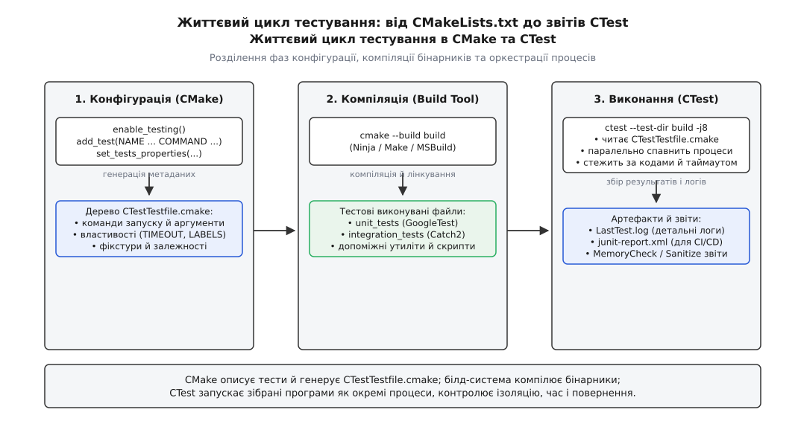
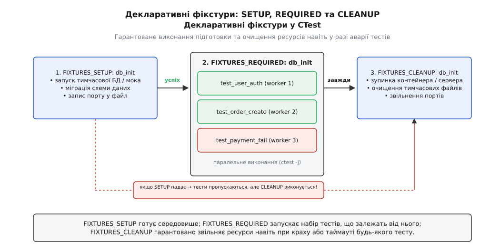
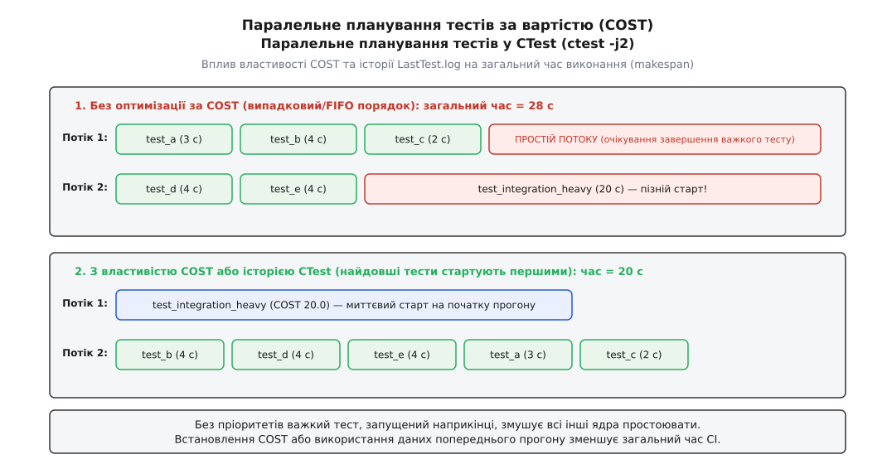
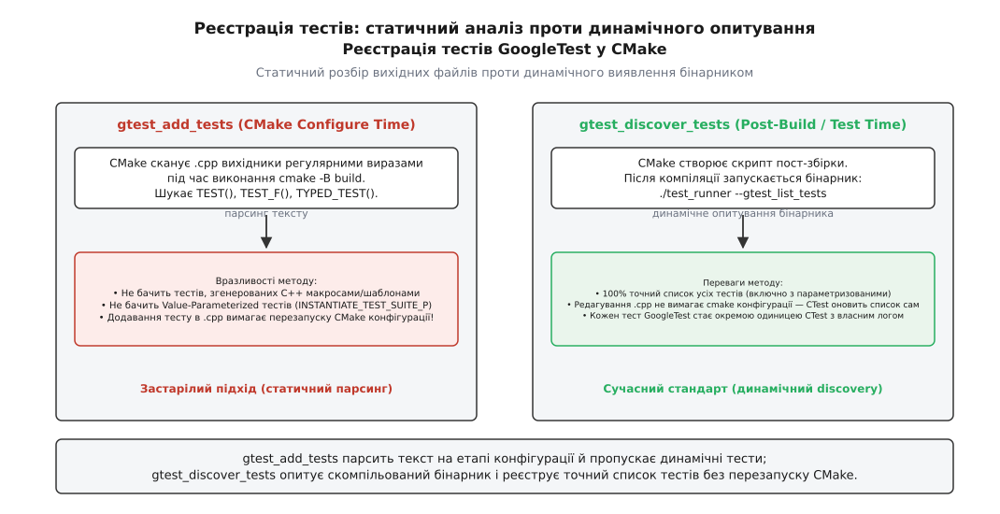

# CTest: реєстрація й запуск тестів

<preknowlist>
- [Цілі й властивості замість глобальних змінних](root:sys-bsystem/targets-and-properties) — CMake оперує цілями та їхніми властивостями як єдиними описами артефактів.
- [Конфігурація, генерація і збірка](root:sys-bsystem/configure-and-generate) — розділення фаз конфігурації проєкту у пам'яті, генерації білд-файлів та безпосереднього виконання бінарників.
- [Мова CMakeLists](root:sys-bsystem/cmake-language) — команди, синтаксис списків та область видимості змінних у CMake.
- [Системний виклик](root:hw-arch/system-call) — як операційна система породжує процеси, передає аргументи та повертає код завершення (exit status).
</preknowlist>

Проєкт зріс до сорока бібліотек, десятка допоміжних утиліт і сорока окремих бінарників із модульними та інтеграційними перевірками. Спроба запускати їх простим командним скриптом на кшталт `./test_math && ./test_network && ./test_storage` ламається на першому ж сервері безперервної інтеграції. На Windows відрізняються шляхи й синтаксис командного інтерпретатора; якщо тест мережевого з'єднання зависає у нескінченному циклі через втрату пакета, весь конвеєр зупиняється на години без жодного сигналу про таймаут; коли п'ятнадцятий за рахунком тест падає з помилкою сегментації, його вивід губиться серед мегабайтів інформаційного логу попередніх успішних запусків. Скрипт не знає, як виконати сорок тестів паралельно на 16-ядерному сервері без взаємного перезапису спільних файлів, і не здатний сформувати стандартизований звіт про помилки для інтерфейсу рецензування коду.

Усе це — завдання оркестрації процесів. Його вирішує **CTest** — спеціалізована підсистема тестування, інтегрована в екосистему CMake. Вона відокремлює опис правил запуску тестів від їхнього безпосереднього виконання, надаючи єдиний інтерфейс для контролю таймаутів, паралельного планування, ізоляції оточення, динамічного виявлення тестових випадків та формування звітів.

## Як влаштований CTest: генерація метаданих і виконання процесів

Принципова особливість CTest полягає в тому, що сам CMake під час конфігурації та генерації файлів збірки **не запускає жодного тесту**. Його завдання — сформувати декларативний опис того, що, як і з якими обмеженнями має виконуватися.

Коли генератор CMake опрацьовує проєкт, у кореневому каталозі збірки та в усіх підкаталогах, де було зареєстровано тести, створюється службовий файл із назвою `CTestTestfile.cmake`. Цей файл є звичайним сценарієм мовою CMake, який містить список команд реєстрації тестів та їхніх властивостей, а також директиви переходу в дочірні теки:

```cmake
# Фрагмент згенерованого build/CTestTestfile.cmake
# Build directory: /home/user/project/build
# Source directory: /home/user/project
subdirs("src")
subdirs("tests")
add_test("unit_math" "/home/user/project/build/bin/test_math" "--gtest_filter=*")
set_tests_properties("unit_math" PROPERTIES TIMEOUT "10" LABELS "unit")
```

Щоб CMake почав генерувати цей файл, у конфігурації необхідно активувати підсистему тестування. За це відповідає команда `enable_testing()`.

```cmake
# CMakeLists.txt (корінь проєкту)
cmake_minimum_required(VERSION 3.20)
project(Engine LANGUAGES CXX)

enable_testing()

add_subdirectory(src)
add_subdirectory(tests)
```

Правило розташування команди `enable_testing()` є жорстким: її обов'язково викликати у **кореневому `CMakeLists.txt`**. Якщо помістити `enable_testing()` лише всередині підкаталогу `tests/CMakeLists.txt`, CMake створить `CTestTestfile.cmake` лише в каталозі `build/tests/`. Коли розробник або система автоматизації запустить утиліту `ctest` у корені каталогу `build/`, програма виявить відсутність кореневого `CTestTestfile.cmake` і повідомить, що у проєкті знайдено 0 тестів. Кореневий виклик створює головний файл метаданих і забезпечує рекурсивний спуск у всі підкаталоги через директиви `subdirs()`.



*CMake описує тести й генерує CTestTestfile.cmake; білд-система компілює бінарники; CTest запускає зібрані програми як окремі процеси, контролює ізоляцію, час і повернення.*

У стандартній практиці замість прямого виклику `enable_testing()` часто підключають стандартний модуль `include(CTest)`:

```cmake
include(CTest)
```

Цей модуль автоматично викликає `enable_testing()`, створює кеш-змінну `BUILD_TESTING` зі значенням за замовчуванням `ON` (що дозволяє вимикати збірку тестів через `-DBUILD_TESTING=OFF` при підключенні бібліотеки сторонніми проєктами) і налаштовує параметри відправки звітів. Початково CTest розроблявся як клієнт відправки результатів на централізований сервер моніторингу; детальніше про цей шлях можна прочитати у [витоках CTest у проекті VTK та системі Dart](root:sys-bsystem/ctest/hist-ctest-evolution.md).

Сам процес тестування складається з двох послідовних кроків у терміналі:

```bash
# 1. Компіляція бінарників за допомогою обраного генератора
cmake --build build --config Release

# 2. Оркестрація й виконання процесів за допомогою CTest
ctest --test-dir build -C Release --output-on-failure
```

CTest не займається компіляцією коду. Він відкриває `CTestTestfile.cmake`, зчитує команди запуску, спавнить незалежні дочірні процеси операційної системи, перехоплює їхні стандартні потоки виводу (`stdout`, `stderr`), стежить за кодами завершення та контролює виділені ресурси.

### Мультиконфігураційні генератори та розділення шляхів

При роботі з одноконфігураційними генераторами (Ninja, Unix Makefiles) тип збірки (`Debug`, `Release`) фіксується під час виклику `cmake -B build -DCMAKE_BUILD_TYPE=Release`. Виконувані файли тестів потрапляють у заздалегідь відомі каталоги, і запуск `ctest --test-dir build` автоматично виконує зібрані бінарники.

Проте при використанні мультиконфігураційних генераторів (Visual Studio, Xcode, Ninja Multi-Config) у межах одного каталогу збірки одночасно співіснують артефакти різних конфігурацій, розташовані у підкаталогах `Debug/`, `Release/` чи `RelWithDebInfo/`. У такому разі утиліті `ctest` обов'язково передають прапорець `-C <конфігурація>` (наприклад, `ctest -C Release`). CTest використовує цей прапорець для правильного розкриття шляхів до бінарних файлів та вибору тестів, зареєстрованих під відповідні конфігурації.

## Реєстрація тестів: add_test та генераторні вирази

Реєстрація окремого тесту здійснюється командою `add_test`. У ранніх версіях CMake існував спрощений синтаксис `add_test(name executable arg1 arg2 ...)`, проте в сучасному коді використовується виключно сигнатура з іменованими ключовими словами:

```cmake
add_test(NAME <ім'я_тесту>
         COMMAND <виконувана_ціль_або_команда> [<аргумент>...]
         [CONFIGURATIONS <Debug|Release...>]
         [WORKING_DIRECTORY <шлях_до_теки>]
         [COMMAND_EXPAND_LISTS])
```

Ключові аргументи цієї команди визначають умови виконання процесу:

- `NAME` — унікальний ідентифікатор тесту в межах дерева збірки. Якщо зареєструвати два тести з однаковим іменем, CMake видасть фатальну помилку конфігурації.
- `COMMAND` — програма, яку слід виконати. Тут можна вказати ім'я виконуваної цілі CMake (створеної через `add_executable`), шлях до зовнішньої програми або інтерпретатор зі скриптом. Якщо як команду передати ім'я цілі CMake, система автоматично підставить абсолютний шлях до скомпільованого бінарного файлу з урахуванням конфігурації (наприклад, `build/bin/Debug/test_math.exe` або `build/bin/test_math`).
- `WORKING_DIRECTORY` — каталог, у якому операційна система запускає дочірній процес. Якщо параметр пропущено, тест запускається у відповідному підкаталозі каталогу збірки (`${CMAKE_CURRENT_BINARY_DIR}`). Це має критичне значення для тестів, які завантажують файли фікстур або конфігурацій за відносними шляхами.
- `CONFIGURATIONS` — обмежує виконання тесту лише вказаними типами збірки (наприклад, запускати важкі стрес-тести лише в `Release`).

### Генераторні вирази в аргументах

Оскільки точні шляхи до бінарних файлів і плагінів стають відомими лише на етапі генерації білд-файлів, команда `add_test` повноцінно підтримує [генераторні вирази](root:sys-bsystem/generator-expressions).

```cmake
add_executable(parser_test tests/test_parser.cpp)
target_link_libraries(parser_test PRIVATE core_engine)

add_test(NAME verify_json_parser
    COMMAND parser_test
            --input "$<TARGET_PROPERTY:core_engine,SOURCE_DIR>/testdata/valid.json"
            --schema "$<TARGET_FILE:schema_validator>"
            --log-level "$<IF:$<CONFIG:Debug>,verbose,error>"
    WORKING_DIRECTORY "${CMAKE_CURRENT_BINARY_DIR}"
)
```

Вираз `$<TARGET_FILE:schema_validator>` повертає точний шлях до готового виконуваного файлу допоміжної цілі, а `$<CONFIG:Debug>` дозволяє динамічно змінювати прапорці деталізації логування залежно від поточної конфігурації.

Якщо тестова програма приймає список аргументів через крапку з комою (стандартний роздільник списків у CMake), додавання прапорця `COMMAND_EXPAND_LISTS` дозволяє коректно розгорнути елементи списку в окремі позиційні параметри командного рядка:

```cmake
set(TEST_FLAGS "--strict;--format=json;--threads=4")
add_test(NAME linter_check
    COMMAND code_linter ${TEST_FLAGS}
    COMMAND_EXPAND_LISTS
)
```

## Керування поведінкою через властивості тестів

За замовчуванням CTest вважає тест успішним, якщо запущений процес завершився з кодом `0` за час, менший за глобальний ліміт. Будь-який інший код повернення або аварійне завершення за сигналом (наприклад, `SIGSEGV` чи `SIGABRT`) трактується як провал (*Failed*).

Проте реальні сценарії тестування значно ширші: перевірка обробки некоректних даних має викликати аварійний вихід; тест драйвера без потрібного обладнання має позначатися як пропущений, а не провалений; інтеграційний тест вимагає ізольованих змінних середовища. Усі ці аспекти налаштовуються через команду `set_tests_properties()`.

### Обмеження часу виконання: TIMEOUT

Якщо тест потрапляє у нескінченне блокування або зависає в очікуванні м'ютекса, він блокує весь процес CI. Властивість `TIMEOUT` задає жорстку верхню межу виконання у секундах:

```cmake
set_tests_properties(verify_json_parser PROPERTIES
    TIMEOUT 15.0
)
```

Якщо процес не завершився за 15 секунд, CTest примусово вбиває його. На операційних системах сімейства POSIX (Linux, macOS) CTest надсилає сигнал `SIGKILL`, а на Windows додає процес до спеціального об'єкта завдань (*Job Object*) із прапорцем `JOB_OBJECT_LIMIT_KILL_ON_JOB_CLOSE` або викликає `TerminateProcess` над дескриптором процесу, перехоплює наявний вивід і фіксує статус `Timeout`.

### Негативне тестування: WILL_FAIL

Коли перевіряється реакція програми на критичні помилки (наприклад, виклик `abort()` при виявленні пошкодження пам'яті або передача невалідного аргументу командного рядка), успіхом є саме аварійне завершення:

```cmake
add_executable(crash_test tests/test_assertion_failure.cpp)

add_test(NAME expect_out_of_bounds_crash
    COMMAND crash_test --trigger-assert
)

set_tests_properties(expect_out_of_bounds_crash PROPERTIES
    WILL_FAIL TRUE
    TIMEOUT 5.0
)
```

Якщо прапорець `WILL_FAIL` встановлено у `TRUE`, CTest інвертує логіку: якщо процес повернув код, відмінний від нуля, або впав за сигналом — тест вважається пройденим (*Passed*). Якщо ж процес штатно завершився з кодом `0`, CTest фіксує помилку.

### Ізоляція середовища: ENVIRONMENT та ENVIRONMENT_MODIFICATION

Тести не повинні залежати від випадкових змінних середовища хостової системи розробника. Властивість `ENVIRONMENT` встановлює точний список змінних оточення для дочірнього процесу тесту:

```cmake
set_tests_properties(verify_json_parser PROPERTIES
    ENVIRONMENT "LOG_LEVEL=debug;APP_PORT=8080;CONFIG_PATH=/tmp/app_test.conf"
)
```

Починаючи з CMake 3.22, доступна більш гнучка властивість `ENVIRONMENT_MODIFICATION`, яка дозволяє не перезаписувати системне оточення повністю, а безпечно модифікувати значення (наприклад, додавати каталог зі щойно зібраними спільними бібліотеками до `PATH` або `LD_LIBRARY_PATH`):

```cmake
set_tests_properties(verify_json_parser PROPERTIES
    ENVIRONMENT_MODIFICATION
        "PATH=path_list_prepend:$<TARGET_FILE_DIR:core_engine>"
        "LD_LIBRARY_PATH=path_list_prepend:$<TARGET_FILE_DIR:core_engine>"
        "CUSTOM_FEATURE=set:enabled"
)
```

Оператор `path_list_prepend` автоматично використовує коректний системний роздільник шляхів (`:` на Linux/macOS та `;` на Windows).

### Верифікація текстового виводу: регулярні вирази

Іноді перевірки лише коду повернення недостатньо: програма сторонньої бібліотеки може повертати `0`, але друкувати у потік помилок критичні попередження або повідомлення про деградацію продуктивності. CTest надає механізм перевірки виводу за регулярними виразами:

- `PASS_REGULAR_EXPRESSION` — вимагає наявності заданого фрагмента у сумарному потоці `stdout`/`stderr`. Якщо шаблон не знайдено, тест вважається проваленим, навіть якщо код повернення був `0`.
- `FAIL_REGULAR_EXPRESSION` — якщо у виводі знайдено збіг із регулярним виразом, тест вважається проваленим, навіть за нульового коду завершення.
- `SKIP_REGULAR_EXPRESSION` — позначає тест як пропущений, якщо вивід містить зазначений текст.

```cmake
add_test(NAME check_crypto_provider
    COMMAND crypto_app --self-check
)

set_tests_properties(check_crypto_provider PROPERTIES
    PASS_REGULAR_EXPRESSION "All [0-9]+ crypto algorithms verified successfully"
    FAIL_REGULAR_EXPRESSION "WARNING: Using deprecated fallback;CRITICAL ERROR;Segmentation fault"
    SKIP_REGULAR_EXPRESSION "Hardware acceleration module not detected"
)
```

### Пропуск тестів: SKIP_RETURN_CODE

Якщо тест виконується в оточенні, де немає необхідного апаратного обладнання (наприклад, відсутній графічний прискорювач або тестовий мережевий інтерфейс), він не повинен ламати збірку статусом `Failed`. За домовленістю системних утиліт GNU/Autotools для цього використовується спеціальний код виходу `77`.

Властивість `SKIP_RETURN_CODE` дозволяє задати один або кілька кодів завершення, які CTest інтерпретує як штатний пропуск (*Skipped*):

```cmake
set_tests_properties(check_crypto_provider PROPERTIES
    SKIP_RETURN_CODE 77
)
```

### Збереження діагностичних артефактів: ATTACHED_FILES

Коли інтеграційний тест зазнає аварії у розподіленому CI-середовищі, розробнику потрібен не лише вивід термінала, а й бінарні файли дампу пам'яті, системні логи бази даних або скріншоти графічного інтерфейсу на момент збою. Властивості `ATTACHED_FILES` та `ATTACHED_FILES_ON_FAIL` дозволяють прив'язати конкретні файли на диску до результатів тесту. Якщо тест завершується невдачею, CTest автоматично упаковує вказані файли у фінальний звіт для завантаження на сервер моніторингу.

Вичерпний перелік усіх доступних прапорців утиліти CTest та властивостей можна знайти у [повному довіднику властивостей тестів та прапорців CLI](root:sys-bsystem/ctest/api-ctest-properties.md).

## Декларативні фікстури: підготовка й очищення середовища

Інтеграційні тести рідко функціонують у вакуумі: їм необхідне підготовлене зовнішнє середовище — змонтована тимчасова файлова система, заповнена тестовими записами база даних або запущений локальний HTTP-сервер. Після завершення тестів ці ресурси необхідно гарантовано звільнити, щоб не залишати у системі завислих процесів і тимчасових файлів на гігабайти.

Традиційний підхід полягав у написанні монолітного скрипту, який запускав сервер, виконував тести й гасив сервер. Але якщо під час виконання тестів траплявся збій або аварійне завершення, інструкція очищення в кінці скрипту не викликалася, залишаючи ресурси заблокованими.

У CMake 3.7 з'явився механізм **декларативних фікстур**, побудований на трьох властивостях:
- `FIXTURES_SETUP` — позначає тест як крок підготовки середовища.
- `FIXTURES_REQUIRED` — вказує, що певному тесту (або групі тестів) потрібне підготовлене середовище.
- `FIXTURES_CLEANUP` — позначає тест як крок обов'язкового очищення.



*FIXTURES_SETUP готує середовище; FIXTURES_REQUIRED запускає набір тестів, що залежать від нього; FIXTURES_CLEANUP гарантовано звільняє ресурси навіть при краху або таймауті будь-якого тесту.*

Розглянемо практичну конфігурацію:

```cmake
# 1. Тест підготовки: створення БД та наповнення таблиць
add_test(NAME setup_test_database
    COMMAND test_db_manager --create-database "temp_test_db"
)
set_tests_properties(setup_test_database PROPERTIES
    FIXTURES_SETUP "DatabaseFixture"
    TIMEOUT 20.0
)

# 2. Робочі тести, які читають і модифікують базу
add_test(NAME test_user_authentication
    COMMAND auth_service_test --db "temp_test_db"
)
add_test(NAME test_order_processing
    COMMAND order_service_test --db "temp_test_db"
)
set_tests_properties(test_user_authentication test_order_processing PROPERTIES
    FIXTURES_REQUIRED "DatabaseFixture"
    TIMEOUT 10.0
)

# 3. Тест очищення: видалення файлів бази та зупинка демона
add_test(NAME cleanup_test_database
    COMMAND test_db_manager --drop-database "temp_test_db"
)
set_tests_properties(cleanup_test_database PROPERTIES
    FIXTURES_CLEANUP "DatabaseFixture"
)
```

Ця декларативна модель надає три фундаментальні гарантії:

1. **Автоматичне затягування залежностей:** Якщо розробник викликає лише один конкретний тест через фільтр `ctest -R test_user_authentication`, CTest самостійно виявляє потребу у фікстурі `DatabaseFixture`, автоматично запускає перед ним `setup_test_database`, а після завершення обов'язково виконує `cleanup_test_database`.
2. **Гарантія очищення при збоях:** Якщо `test_user_authentication` падає із сигналом `SIGSEGV` або перевищує таймаут, CTest все одно гарантовано викликає `cleanup_test_database`.
3. **Захист від каскадних помилок:** Якщо крок підготовки `setup_test_database` завершився з помилкою, CTest не витрачає час на запуск залежних тестів `test_user_authentication` та `test_order_processing` — вони автоматично позначаються як пропущені, але крок `cleanup_test_database` все одно виконується для очищення можливих частково створених ресурсів.

## Паралельний запуск тестів і планування за вартістю

Коли проєкт містить сотні або тисячі тестів, послідовний запуск займає десятки хвилин. Прапорець `-j <N>` (або `--parallel <N>`) активує вбудований пул паралельного виконання CTest:

```bash
ctest --test-dir build -j16 --output-on-failure
```

CTest запускає окремі дочірні процеси для кожного тесту. Однак при простому паралельному запуску виникає класична задача теорії розкладів (англ. *makespan minimization* у задачі пакування смуг): якщо порядок запусків випадковий або відповідає порядку реєстрації у файлах, важкий тест тривалістю 30 секунд може бути запущений останнім. У результаті 15 ядер завершать свою роботу за 2 секунди й простоюватимуть 28 секунд, очікуючи на завершення одного повільного процесу на 16-му ядрі.



*Без пріоритетів важкий тест, запущений наприкінці, змушує всі інші ядра простоювати. Встановлення COST або використання даних попереднього прогону зменшує загальний час CI.*

CTest вирішує цю проблему двома взаємодоповнюючими шляхами.

### Властивість COST

Розробник може вручну призначити кожному тесту вагу або очікуваний час роботи за допомогою властивості `COST`:

```cmake
set_tests_properties(heavy_integration_suite PROPERTIES
    COST 120.0 # Очікуваний час 120 секунд
)

set_tests_properties(quick_unit_test PROPERTIES
    COST 0.1   # Швидкий тест на 100 мс
)
```

Планувальник CTest сортує всі заплановані до виконання тести за спаданням властивості `COST` і застосовує евристику LPT (*Longest Processing Time first*). Найважчі процеси запускаються в перші мілісекунди прогону, а короткі тести заповнюють вільні процесорні слоти, що вивільняються, мінімізуючи загальний час очікування.

### Автоматичне навчання за попередніми запусками

Якщо властивість `COST` не задана вручну, CTest зберігає хронометраж виконання кожного тесту після кожного успішного прогону у службовому файлі `Testing/Temporary/CTestCostData.txt`. Під час наступного виклику `ctest -j` планувальник зчитує цей файл і автоматично оптимізує порядок черги за реальними історичними даними.

### Керування ресурсами: PROCESSORS, RESOURCE_LOCK та специфікація обладнання

Не всі тести однакові за споживанням ресурсів. Якщо тест обчислює фізичну симуляцію з використанням OpenMP на 8 потоків, одночасний запуск 16 таких тестів на 16-ядерній машині призведе до створення 128 потоків, перевантаження планувальника ОС (англ. *context switching thrashing*) та падіння продуктивності.

Властивість `PROCESSORS` повідомляє CTest, скільки слотів у паралельному пулі резервує даний процес:

```cmake
add_test(NAME openmp_sim_test COMMAND sim_engine --threads 8)
set_tests_properties(openmp_sim_test PROPERTIES
    PROCESSORS 8
)
```

Якщо CTest запущено з `-j16`, він виділить для `openmp_sim_test` половину доступного пулу і паралельно запустить не більше 8 однопотокових тестів.

Якщо ж два окремі тести працюють з одним монопольним ресурсом (наприклад, прослуховують один жорстко зафіксований мережевий порт `8080` або пишуть в один локальний файл конфігурації), властивість `RESOURCE_LOCK` гарантує, що вони ніколи не виконуватимуться одночасно:

```cmake
set_tests_properties(test_server_v1 test_server_v2 PROPERTIES
    RESOURCE_LOCK "NetworkPort8080Lock"
)
```

Тести `test_server_v1` та `test_server_v2` можуть виконуватися паралельно з іншими модульними перевірками, але ніколи — паралельно один з одним.

Для складних апаратних середовищ (наприклад, сервери з чотирма GPU) CTest підтримує параметр `--resource-spec-file`. У JSON-файлі описуються доступні слоти обладнання, а у властивості тесту `RESOURCE_GROUPS` зазначаються вимоги (наприклад, `RESOURCE_GROUPS "gpus:1"`). CTest автоматично передає номер виділеного GPU дочірньому процесу через змінні оточення `CTEST_RESOURCE_GROUP_...`.

## Інтеграція з тестовими фреймворками: GoogleTest та Catch2

Створення монолітного тестового бінарника, який містить 500 тестів GoogleTest або Catch2, і його реєстрація через один єдиний виклик `add_test(NAME all_unit_tests COMMAND unit_runner)` — це критичний антипатерн:

1. Якщо один модульний тест зависає або падає за `SIGSEGV`, аварійно завершується весь бінарник, а решта 499 перевірок навіть не починають виконуватися.
2. CTest не може розпаралелити виконання 500 тестів на кілька процесорних ядер.
3. У звітах фіксується загальний час роботи моноліту без деталізації тривалості окремих тестових функцій.

Для розв'язання цієї проблеми розроблені спеціалізовані модулі інтеграції, які автоматично реєструють кожну окрему тестову функцію фреймворку як самостійний тест CTest.

### GoogleTest: еволюція від gtest_add_tests до gtest_discover_tests

Історично першим механізмом був модуль `GoogleTest` і функція `gtest_add_tests()`. Вона працювала на етапі конфігурації CMake, скануючи вихідні `.cpp` файли регулярними виразами в пошуках макросів `TEST()`, `TEST_F()` та `TYPED_TEST()`.

Цей підхід мав фундаментальні недоліки:
- Регулярні вирази CMake не здатні розгорнути шаблони C++ та користувацькі макроси генерації тестів.
- Не підтримувалися параметризовані тести (`INSTANTIATE_TEST_SUITE_P`), імена яких формуються динамічно під час виконання.
- Будь-яке додавання або перейменування тесту у файлі `.cpp` вимагало примусового перезапуску конфігурації `cmake -B build`. Якщо розробник просто збирав проєкт і запускав `ctest`, список тестів залишався застарілим.

У CMake 3.10 з'явилася функція нового покоління — `gtest_discover_tests()`:

```cmake
find_package(GTest REQUIRED)
include(GoogleTest)

add_executable(math_tests tests/test_math.cpp)
target_link_libraries(math_tests PRIVATE GTest::gtest_main)

# Динамічне виявлення тестів
gtest_discover_tests(math_tests
    EXTRA_ARGS "--custom_flag"
    PROPERTIES
        TIMEOUT 10.0
        LABELS "unit;math"
    DISCOVERY_TIMEOUT 30
    TEST_PREFIX "MathCore."
)
```



*gtest_add_tests парсить текст на етапі конфігурації й пропускає динамічні тести; gtest_discover_tests опитує скомпільований бінарник і реєструє точний список тестів без перезапуску CMake.*

Параметр `TEST_PREFIX` дозволяє додати префікс до імен усіх зареєстрованих тестів цього бінарника. Це особливо зручно, коли один і той самий виконуваний файл реєструється двічі з різними прапорцями середовища (наприклад, для тестування з різними бекендами обчислень).

Механізм дії `gtest_discover_tests()` принципово інший:
1. Під час конфігурації CMake додає користувацьку команду пост-збірки, яка прив'язана до цілі `math_tests`.
2. Після завершення компіляції та лінкування бінарного файлу CMake запускає готовий виконуваний файл із прапорцем опитування: `./math_tests --gtest_list_tests`.
3. Отриманий список тестових наборів та функцій перетворюється на згенерований скрипт `math_tests_include.cmake`, який підключається до `CTestTestfile.cmake`.

У результаті список тестів на 100% відповідає реальному коду бінарника, включно з усіма типами динамічно параметризованих тестів, а зміна тіла тестів не потребує повторної конфігурації CMake.

### Catch2: catch_discover_tests

Аналогічний механізм реалізовано у фреймворку Catch2 через модуль `Catch`:

```cmake
find_package(Catch2 3 REQUIRED)
include(Catch)

add_executable(network_tests tests/test_network.cpp)
target_link_libraries(network_tests PRIVATE Catch2::Catch2WithMain)

catch_discover_tests(network_tests
    PROPERTIES
        TIMEOUT 15.0
        LABELS "network"
)
```

Кожен блок `TEST_CASE` реєструється як окрема одиниця CTest.

### Нюанси крос-компіляції

При крос-компіляції (наприклад, коли збірка виконується на Linux x86_64, а цільовою платформою є ARM Cortex-A або архітектура RISC-V) скомпільований бінарник не може бути запущений безпосередньо на хості для опитування списку тестів.

У такому разі застосовують одне з двох рішень:
1. Задати емулятор процесора через цільову властивість `CROSSCOMPILING_EMULATOR`:
   ```cmake
   set_target_properties(math_tests PROPERTIES
       CROSSCOMPILING_EMULATOR "/usr/bin/qemu-aarch64;-L;/usr/aarch64-linux-gnu"
   )
   ```
   CMake автоматично запускатиме двійкові файли через QEMU як для зняття списку тестів, так і під час прогону CTest.
2. Перемкнути режим виявлення на попереднє опитування перед тестом (`DISCOVERY_MODE PRE_TEST`), за якого опитування відкладається безпосередньо до моменту запуску CTest на цільовій машині.

## Автоматизація в CI/CD та звіти JUnit XML

У неінтерактивних середовищах серверів неперервної інтеграції (GitHub Actions, GitLab CI, Jenkins, TeamCity) поведінка за замовчуванням вимагає спеціального налаштування. Якщо тест падає, розробник повинен бачити причину падіння безпосередньо у веб-інтерфейсі без потреби заходити на сервер і шукати службові файли.

### Ключові прапорці командного рядка для CI

```bash
ctest --test-dir build \
    --parallel 8 \
    --output-on-failure \
    --stop-on-failure \
    --repeat until-pass:3 \
    --output-junit build/junit-reports/test-results.xml
```

Розглянемо призначення цих параметрів:

- `--output-on-failure` — якщо тест пройшов успішно, CTest друкує лише один короткий рядок статусу. Якщо тест зазнав невдачі, CTest автоматично виводить повний вміст потоків `stdout` та `stderr` цього конкретного тесту.
- `--stop-on-failure` — примусово перериває виконання всього набору після першого ж падіння тесту для економії часу обчислювальних агентів.
- `--repeat until-pass:<N>` або `--repeat until-fail:<N>` — інструмент діагностики та стабілізації *flaky-тестів* (нестабільних перевірок, що залежать від таймінгів). Режим `until-pass:3` перезапускає впалий тест до трьох разів, що дозволяє уникнути випадкових збоїв через навантаження мережі в CI.
- `--rerun-failed` — перезапускає виключно ті тести, які зазнали невдачі під час попереднього прогону (зчитуючи список із файлу `Testing/Temporary/LastTestsFailed.log`).
- `-L <regex>` та `-LE <regex>` — фільтрація за мітками. Дозволяє розділити швидкі модульні перевірки (`ctest -L unit`) для кожного коміту та повільні нічні інтеграційні тести (`ctest -L integration`).

### Трасування та журналювання у файлах Testing/Temporary

Під час кожного виконання утиліта CTest записує стан прогону у спеціальні службові файли всередині каталогу збірки:
- `Testing/Temporary/LastTest.log` — містить детальний лог із послідовністю запуску кожного процесу, переданими аргументами, часом старту, тривалістю у мілісекундах та повним виводом потоків.
- `Testing/Temporary/LastTestsFailed.log` — містить простий список числових індексів та імен тестів, які зазнали невдачі або впали за таймаутом. Саме цей файл зчитується утилітою при виклику `ctest --rerun-failed`.
- `Testing/Temporary/CTestCostData.txt` — таблиця пар «ім'я тесту — середня тривалість виконання», яка використовується евристичним планувальником паралельної черги.

### Генерація звітів JUnit XML

Починаючи з версії CMake 3.21, утиліта CTest підтримує нативну генерацію звітів за промисловим стандартом JUnit XML через прапорець `--output-junit <шлях_до_файлу.xml>`.

Цей файл містить повну структуру запусків, точний час роботи кожного тесту до мілісекунд, класифікацію статусів (passed, failed, skipped) і текстовий стек помилки. Усі сучасні CI-платформи вміють відображати такий файл у вигляді графіків та інтерактивних вкладок безпосередньо у вікні pull request:

```yaml
# Приклад конфігурації GitHub Actions (.github/workflows/test.yml)
- name: Виконання тестів через CTest
  run: |
    ctest --test-dir build --parallel 4 --output-on-failure --output-junit ctest-report.xml

- name: Публікація результатів JUnit
  if: always()
  uses: mikepenz/action-junit-report@v4
  with:
    report_paths: 'build/ctest-report.xml'
```

## Динамічний аналіз пам'яті: MemCheck, Санітайзери та Valgrind

У розробці на C та C++ проходження тестів без видимих падінь не гарантує відсутності дефектів роботи з пам'яттю: вихід за межі виділеного масиву на 4 байти, використання звільненої пам'яті (*Use-After-Free*) або читання неініціалізованої змінної можуть випадково залишатися непоміченими у стандартних умовах, але викликати аварії під навантаженням.

CTest підтримує два різні підходи до перевірки коректності роботи з пам'яттю.

### Традиційний CTest MemCheck (Valgrind)

Історичний режим `ctest -T memcheck` використовує зовнішні інструменти емуляції (переважно Valgrind Memcheck):

```bash
ctest --test-dir build -T memcheck
```

CTest запускає кожну тестову команду під керуванням `valgrind --leak-check=full`, перехоплює вивід Valgrind, підраховує кількість витоків пам'яті (*memory leaks*) та помилок доступу, зберігаючи звіт у файлі `Testing/Temporary/MemoryCheck.xml`.

Головний недолік Valgrind — величезні накладні витрати продуктивності: швидкість виконання коду падає у 20–50 разів, що робить повне тестування великих проєктів у CI занадто тривалим.

### Сучасний підхід: Компіляторні санітайзери (ASan, UBSan, TSan)

Сучасним золотим стандартом є збірка коду з прапорцями апаратних компіляторних санітайзерів (Clang або GCC), які інструментують бінарний код безпосередньо під час компіляції:
- **AddressSanitizer (ASan)** — виявляє переповнення буферів у стеку, купі та глобальній пам'яті, а також витоки пам'яті (LeakSanitizer).
- **UndefinedBehaviorSanitizer (UBSan)** — фіксує переповнення знакових цілих, зсуви на неприпустиму кількість бітів, нульові вказівники та невалідні приведення типів.
- **ThreadSanitizer (TSan)** — виявляє стан гонитви (*data races*) у багатопотоковому коді при паралельному доступі до спільних змінних без м'ютексів чи атоміків.

На рівні CMake це налаштовується додаванням відповідних прапорців до цілей або глобальних опцій:

```cmake
# Активація санітайзерів для компіляторів GCC та Clang
if(ENABLE_SANITIZERS)
    add_compile_options(-fsanitize=address,undefined -fno-omit-frame-pointer -g)
    add_link_options(-fsanitize=address,undefined)
endif()
```

У поєднанні з CTest інструментовані бінарники запускаються нативно без емуляторів із накладними витратами швидкодії лише 1.5–2x:

```bash
# Налаштування реакції санітайзера на помилки через змінні оточення
export ASAN_OPTIONS="detect_leaks=1:abort_on_error=1:halt_on_error=1"
export UBSAN_OPTIONS="print_stacktrace=1:halt_on_error=1"
export TSAN_OPTIONS="halt_on_error=1:report_atomic_races=1"

# Запуск через CTest
ctest --test-dir build -j8 --output-on-failure
```

При виявленні будь-якої помилки пам'яті санітайзер негайно перериває процес, генерує детальний стек викликів у `stderr` і повертає ненульовий код помилки, який CTest фіксує як провал із виведенням точного рядка коду, де стався дефект.

Повний працюючий приклад структури проєкту з фікстурами, санітайзерами та скриптом CI наведено у [практичному прикладі налаштування тестового конвеєра](root:sys-bsystem/ctest/proj-ctest-pipeline.md).

> 🔧 **Навіщо це.**
> Тестовий код, який неможливо виконати однією стандартною командою на будь-якій підтримуваній ОС, швидко перестають запускати регулярно. CTest робить тестування системною частиною процесу збірки: він дозволяє команді розробників перетворити десятки різнорідних тестових програм — від крихітних юніт-тестів на GoogleTest до важких системних інтеграційних сценаріїв із базами даних — на надійний, паралельний та повністю автоматизований конвеєр перевірки якості з передбачуваними таймаутами та інформативними звітами.
