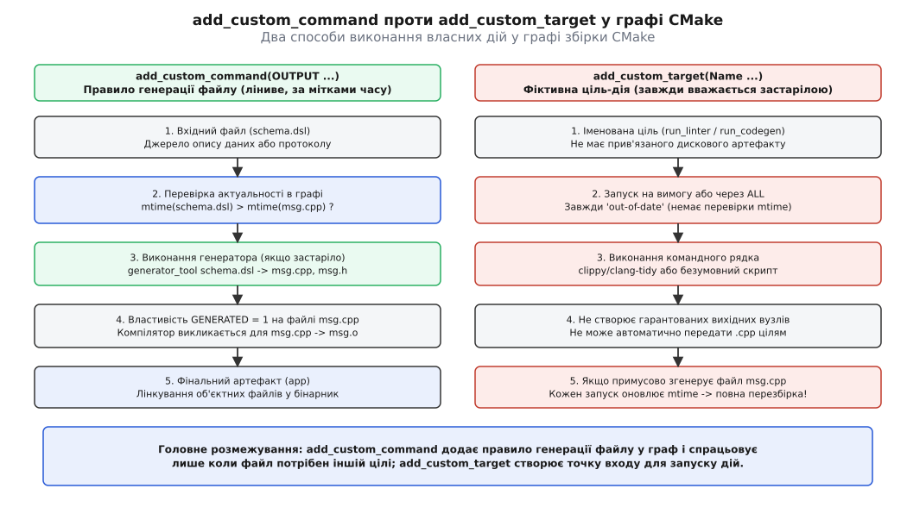
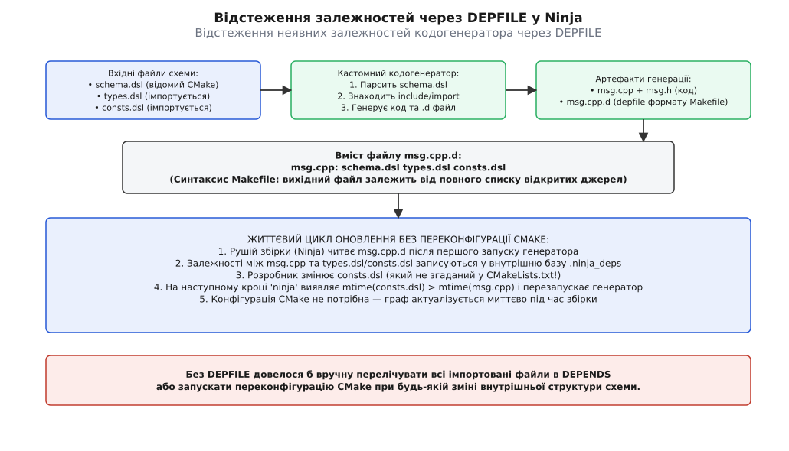
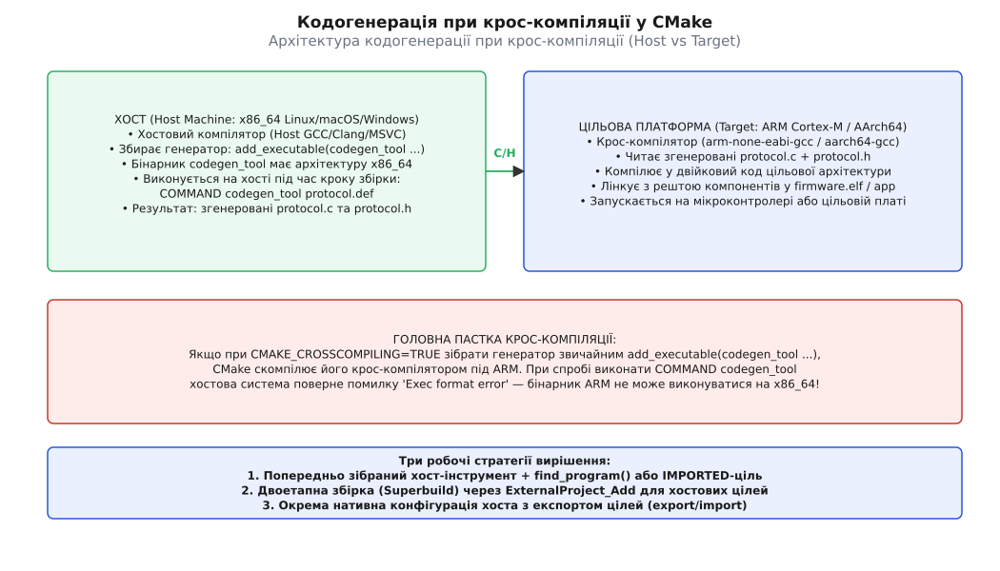
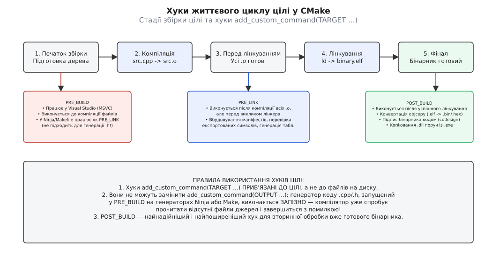

# Власні команди й цілі: кодогенерація у збірці

<preknowlist>
- [Граф залежностей і порядок робіт](topic:sys-bsystem/dependency-graph) — як вузли-файли та зв'язки між ними визначають послідовність виконання збірки.
- [Інкрементальна збірка](topic:sys-bsystem/incremental-build) — механізм порівняння міток часу `mtime` та визначення застарілих артефактів.
- [Цілі й властивості замість глобальних змінних](topic:sys-bsystem/targets-and-properties) — як CMake інкапсулює файли, залежності та прапорці компіляції всередині іменованих цілей.
- [Генераторні вирази](topic:sys-bsystem/generator-expressions) — відкладене обчислення шляхів, цільових властивостей та конфігурацій під час фази генерації.
- [Крос-компіляція: хост, ціль і що між ними](topic:sys-bsystem/cross-compilation) — різниця між архітектурою машини збірки (хостом) та цільовим процесором, де виконуватиметься код.
</preknowlist>

У проєкті бортового контролера протокол обміну описує єдиний файл `telemetry.proto`. Спеціальна утиліта зчитує цю схему й створює два файли: заголовок `telemetry.h` зі структурами даних та джерело `telemetry.c` із функціями двійкової серіалізації. Якщо запустити генератор під час фази конфігурації через `execute_process()`, перший запуск `cmake -B build` працює бездоганно. Але варто інженеру змінити структуру пакета у файлі `telemetry.proto` і запустити швидку збірку `ninja -C build` — нічого не відбувається. Рушій Ninja бачить, що файли `telemetry.c` і `telemetry.h` уже є на диску, мітки часу компілятора не змінилися, і видає повідомлення `ninja: no work to do`. Згенерований двійковий файл залишається застарілим, контролер надсилає пакети старого формату, а приймальний сервер аварійно закриває з'єднання.

Спроба виправити це викликом зовнішнього скрипту перед кожною збіркою призводить до іншої крайності: генератор перезаписує `telemetry.c` щоразу, оновлюючи мітку часу. Тепер Ninja при кожному натисканні «Build» перекомпілює весь проєкт із сотень файлів, зводячи інкрементальну збірку нанівець.

Щоб зовнішній інструмент — компілятор схем, транслятор мови специфікацій, генератор парсерів чи пакувальник ресурсів — працював надійно, він має бути вбудований безпосередньо в граф залежностей системи збірки. Він повинен викликатися **під час самої збірки**, **тільки за потреби**, **безпечно в паралельному режимі** й **точно знати, які файли він створює та від чого залежить**. У CMake для цього існують дві фундаментальні сутності: правило генерації файлу `add_custom_command()` та фіктивна ціль-дія `add_custom_target()`.

---

## Конфігурація проти збірки: чому execute_process() не підходить

CMake працює у дві послідовні та чітко розмежовані фази:
1. **Фаза конфігурації та генерації (`cmake -B build`)**: CMake читає всі файли `CMakeLists.txt`, обчислює змінні, виконує пошук компіляторів і бібліотек, будує внутрішню модель проєкту в пам'яті й записує на диск файл інструкцій для конкретного рушія (`build.ninja` або `Makefile`).
2. **Фаза збірки (`cmake --build build` або `ninja`)**: низькорівневий рушій (Ninja, GNU Make, MSVC msbuild) зчитує згенерований файл інструкцій, аналізує граф залежностей, перевіряє мітки модифікації файлів (`mtime`) і запускає процеси компіляції та лінкування в паралельних потоках.

Команда `execute_process()` виконує вказану програму **негайно**, прямо в процесі виконання `CMakeLists.txt` під час першої фази. Це корисно для службових завдань конфігурації: зчитати поточний хеш коміту через `git rev-parse HEAD`, запитати версію встановленого в системі компілятора або згенерувати фіксований заголовок конфігурації.

```cmake
# Помилковий підхід для кодогенерації:
execute_process(
    COMMAND python3 ${CMAKE_CURRENT_SOURCE_DIR}/tools/gen.py
            ${CMAKE_CURRENT_SOURCE_DIR}/schema.dsl
            ${CMAKE_CURRENT_BINARY_DIR}/generated/msg.cpp
)
```

Коли цей рядок виконується, CMake одноразово породжує підпроцес Python і записує файл `msg.cpp`. Але у вихідному файлі `build.ninja` не з'являється жодного правила, яке пов'язувало б `schema.dsl` та `msg.cpp`. Рушій збірки навіть не знає про існування `schema.dsl`. Якщо розробник змінить `schema.dsl`, Ninja не зафіксує жодних змін у графі й не перезапустить генератор. Єдиний спосіб оновити код — змусити CMake повністю переконфігурувати проєкт (`cmake --fresh` або зміна самого `CMakeLists.txt`).

Крім того, виклик кодогенераторів через `execute_process()` створює ще три важкі проблеми:
- **Уповільнення конфігурації**: якщо генерація займає кілька секунд, кожна зміна будь-якого `CMakeLists.txt` змушуватиме розробника чекати виконання всіх генераторів під час виклику CMake.
- **Відсутність паралелізму**: `execute_process()` блокує інтерпретатор CMake і виконується суворо послідовно в один потік, тоді як фаза збірки може запускати десятки генераторів паралельно на всіх ядрах процесора.
- **Неможливість використання зібраних у цьому ж проєкті інструментів**: під час конфігурації власні утиліти ще не скомпільовані, тому `execute_process()` не може запустити щойно написаний C++ генератор.

Кодогенерація — це операція фази збірки. Вона має виконуватися не тоді, коли розробник генерує проєкт, а тоді, коли компілятор збирає двійкові об'єкти. Для цього декларація кодогенерації має стати вузлом графа збірки, де входом є вихідний файл специфікації, а виходом — згенеровані файли вихідного коду.

---

## Дві сутності: Правило для файлу проти Дії над ціллю

У системі збірки є дві принципово різні задачі:
1. **Створити конкретний файл на диску**, коли вхідний файл змінився (кодогенерація, компіляція шейдерів, стиснення шрифтів, підготовка таблиць).
2. **Виконати дію або команду за запитом**, незалежно від наявності файлів (запуск лінтера `clang-tidy`, виконання тестів, прошивка мікроконтролера через програматор, оновлення документації Doxygen).

CMake розділяє ці задачі між двома різними командами: `add_custom_command(OUTPUT ...)` та `add_custom_target()`.



*add_custom_command додає у граф правило для створення конкретного дискового файлу й спрацьовує лише за потребою; add_custom_target створює іменовану точку входу для безумовного запуску команд.*

### add_custom_command(OUTPUT ...): ліниве правило генерації

Команда `add_custom_command(OUTPUT ...)` не створює ціль у термінах CMake. Вона створює **рецепт генерації файлу** (файловий вузол графа):

```cmake
add_custom_command(
    OUTPUT "${CMAKE_CURRENT_BINARY_DIR}/telemetry.c"
           "${CMAKE_CURRENT_BINARY_DIR}/telemetry.h"
    COMMAND proto_gen --input "${CMAKE_CURRENT_SOURCE_DIR}/telemetry.proto"
                      --out-dir "${CMAKE_CURRENT_BINARY_DIR}"
    DEPENDS "${CMAKE_CURRENT_SOURCE_DIR}/telemetry.proto"
    COMMENT "Генерація telemetry.c та telemetry.h зі схеми"
    VERBATIM
)
```

Головна властивість цієї команди — **ліниве виконання (lazy evaluation)**. Якщо ви оголосили `add_custom_command`, але жодна бібліотека, виконуваний файл чи кастомна ціль не мають файлів `OUTPUT` у списку своїх залежностей (прямо або через `target_sources`), CMake **взагалі не згенерує це правило** у фінальному `build.ninja`. Команда просто не запуститься.

Коли файл з `OUTPUT` підключено до цілі, рушій Ninja керується стандартною логікою графа:
- Якщо файлів `telemetry.c` або `telemetry.h` немає на диску — команда запускається.
- Якщо файли існують, але мітка часу `telemetry.proto` новіша за мітку `telemetry.c` (`mtime(proto) > mtime(c)`) — команда запускається.
- Якщо `telemetry.proto` не змінювався з моменту створення `telemetry.c` — команда пропускається.

### add_custom_target(): фіктивна ціль найвищого рівня

Команда `add_custom_target()` створює **іменовану ціль (utility target)** найвищого рівня, яку можна викликати напряму з термінала (`cmake --build build --target run_linter` або `ninja run_linter`):

```cmake
add_custom_target(run_linter
    COMMAND clang-tidy -p "${CMAKE_BINARY_DIR}" src/main.cpp
    WORKING_DIRECTORY "${CMAKE_CURRENT_SOURCE_DIR}"
    COMMENT "Аналіз коду через clang-tidy"
    VERBATIM
)
```

Кастомна ціль має критичні відмінності:
1. **Вона не має власного вихідного файлу результату**. У термінах Makefile це називається `.PHONY`-ціллю.
2. **Вона завжди вважається застарілою (always out-of-date)**. Якщо викликати збірку цієї цілі, її команди виконаються гарантовано, кожного разу.
3. **За замовчуванням вона не входить до загальної збірки**. Команда `cmake --build .` (ціль за замовчуванням `all`) проігнорує `run_linter`, якщо не вказано прапорець `ALL`: `add_custom_target(run_linter ALL ...)`.

> ⚠️ **Антипатерн: генерація файлів джерел через add_custom_target.**
> Якщо спробувати згенерувати вихідні файли `.cpp` через `add_custom_target(generate_code COMMAND my_gen ...)` і зв'язати її з бібліотекою через `add_dependencies(my_lib generate_code)`, то через фіктивну природу цілі `generate_code` генератор буде запускатися при **кожному виклику збірки**. Він постійно перезаписуватиме файли на диску, змінюючи їхній `mtime`, і рушій збірки буде змушений заново компілювати всі залежні `.cpp` файли проєкту.

Повний перелік параметрів та сигнатур обох команд наведено у довіднику [Сигнатури та параметри власних команд і цілей CMake](topic:sys-bsystem/custom-commands/api-custom-commands.md).

---

## Правильне підключення згенерованого коду до цілей

Щоб CMake вбудував згенеровані файли у процес компіляції програми чи бібліотеки, ці файли мають бути передані цілі через команду `target_sources()`.

```cmake
# 1. Оголошення файлів результату генерації
set(GEN_DIR "${CMAKE_CURRENT_BINARY_DIR}/generated")
set(GEN_SRC "${GEN_DIR}/protocol.cpp")
set(GEN_HDR "${GEN_DIR}/protocol.hpp")

# 2. Правило створення файлів
add_custom_command(
    OUTPUT "${GEN_SRC}" "${GEN_HDR}"
    COMMAND dsl_compiler --in "${CMAKE_CURRENT_SOURCE_DIR}/protocol.dsl"
                         --out-dir "${GEN_DIR}"
    DEPENDS "${CMAKE_CURRENT_SOURCE_DIR}/protocol.dsl"
    VERBATIM
)

# 3. Створення цільової бібліотеки
add_library(protocol_lib)

# 4. Приєднання згенерованих файлів до цілі
target_sources(protocol_lib
    PRIVATE
        "${GEN_SRC}"
        "${GEN_HDR}"
)

# 5. Надання доступу до згенерованих заголовків
target_include_directories(protocol_lib
    PUBLIC
        "$<BUILD_INTERFACE:${GEN_DIR}>"
)
```

### Властивість джерела GENERATED

Коли CMake обробляє звичайний файл джерела `src/main.cpp`, він перевіряє його наявність на диску під час фази конфігурації. Якщо файл відсутній, CMake зупиняється з фатальною помилкою конфігурації: `Cannot find source file`.

Але файлів `protocol.cpp` та `protocol.hpp` ще **не існує** в момент запуску `cmake -B build` — вони з'являться лише тоді, коли рушій збірки запустить `dsl_compiler`.

Щоб CMake не завершував роботу аварійно, існує спеціальна властивість файлу джерела — `GENERATED`. Коли файл перелічено у секції `OUTPUT` команди `add_custom_command()`, CMake **автоматично встановлює властивість `GENERATED = 1`** на цьому файлі.

Властивість `GENERATED` дає компілятору наступні інструкції:
- Не вимагати наявності файлу на диску під час фази конфігурації.
- Згенерувати правило компіляції (`protocol.cpp.o`) у вихідному файлі `build.ninja`, вважаючи, що файл буде створений попереднім кроком.
- Очищати цей файл під час виклику `ninja clean` або `make clean`.

> 🔧 **Область видимості властивості GENERATED (політика CMP0118).**
> В історичних версіях CMake властивість `GENERATED` діяла виключно в межах того каталогу (`CMakeLists.txt`), де було викликано `add_custom_command()`. Якщо інший підкаталог намагався використати цей файл у `target_sources()`, CMake не бачив властивості й завершувався з помилкою. Починаючи з CMake 3.20 (політика `CMP0118`), властивість `GENERATED` є видимою глобально для всіх цілей у межах одного контексту збірки.

### Проблема згенерованих заголовків у паралельній збірці

Компіляція вихідного файлу `main.cpp`, який містить рядок `#include "protocol.hpp"`, створює приховану загрозу в умовах високопаралельної збірки (`ninja -j16`).

Якщо `protocol.cpp` додано до `target_sources()`, Ninja знає, що `protocol.cpp` потребує виконання `add_custom_command`. Але про те, що `main.cpp` потребує попереднього створення `protocol.hpp`, Ninja дізнається лише тоді, коли компілятор почне розбирати `#include`. Якщо компілятор запуститься раніше, ніж завершиться робота `dsl_compiler`, збірка впаде з помилкою: `fatal error: protocol.hpp: No such file or directory`.

Щоб гарантувати правильний порядок у графі:
1. **Обов'язково додавайте згенерований заголовок `.hpp` до `target_sources()` цілі.** Це інформує генератор Ninja про залежність усіх об'єктних файлів цілі від правила створення заголовка (створюється вузол генерації заголовка order-only).
2. Якщо заголовок потрібен іншій цілі (наприклад, виконуваному файлу `app`, що лінкується з `protocol_lib`), використовуйте генераторний вираз `$<BUILD_INTERFACE:...>` у `target_include_directories()`.

---

## Анатомія add_custom_command: параметри надійного виконання

Надійність кастомних команд у продакшн-системах залежить від точного налаштування їхніх параметрів.

```cmake
add_custom_command(
    OUTPUT "${OUT_FILE}"
    COMMAND "${TOOL_EXE}" --flag "$<TARGET_PROPERTY:my_target,COMPILE_DEFINITIONS>"
    DEPENDS "${INPUT_FILE}" generator_target
    BYPRODUCTS "${LOG_FILE}"
    WORKING_DIRECTORY "${CMAKE_CURRENT_BINARY_DIR}"
    COMMENT "Створення ${OUT_FILE}"
    VERBATIM
    COMMAND_EXPAND_LISTS
)
```

### Залежності від файлів проти залежностей від цілей у DEPENDS

Секція `DEPENDS` може приймати два види сутностей:
1. **Шляхи до файлів на диску (`"${INPUT_FILE}"`)**: CMake відстежує їхні мітки часу модифікації (`mtime`). Якщо файл змінився, команда перезапускається.
2. **Імена виконуваних цілей CMake (`generator_target`)**: якщо утиліта генерації збирається в цьому ж проєкті через `add_executable(generator_target tools/gen.cpp)`, передача імені цілі в `DEPENDS` робить дві речі:
   - Гарантує, що виконуваний файл `generator_target` буде скомпільовано й злінковано **до** того, як запуститься кастомна команда.
   - Якщо ви зміните вихідний код утиліти `gen.cpp`, CMake автоматично перезбере `generator_target` і **перезапустить кастомну команду генерації**, оновивши згенерований код.

У полі `COMMAND` ціль можна підставляти прямо за іменем або через генераторний вираз `$<TARGET_FILE:generator_target>`, що автоматично підставляє повний абсолютний шлях до бінарника з урахуванням конфігураційного суфікса (Debug/Release) та операційної системи (`.exe` на Windows).

### Чому прапорець VERBATIM є обов'язковим

Коли CMake генерує файл для Make, Ninja чи Visual Studio, йому потрібно передати командний рядок операційній системі. Але командні інтерпретатори на різних платформах по-різному обробляють лапки, бекслеші, пробіли та символи екранування:
- `cmd.exe` у Windows використовує подвійні лапки й спеціальні правила для символів `%` та `^`.
- POSIX-оболонки (`/bin/sh`, `bash`) обробляють одинарні лапки, бекслеші `\` та змінні `$`.
- Ninja на Windows може викликати процеси напряму через `CreateProcessW()` без проміжного виклику командного процесора.

Якщо прапорець `VERBATIM` **відсутній**, CMake передає рядок аргументів «як є», без екранування. Шлях до каталогу з пробілами (`C:/Program Files/My Project/schema.dsl`) або аргумент із подвійними лапками розіб'ється на окремі шматки, призвівши до аварійної зупинки збірки на іншій системі.

Прапорець `VERBATIM` змушує CMake автоматично застосувати правила коректного екранування аргументів відповідно до цільового генератора та поточної операційної системи. **У сучасному коді CMake прапорець `VERBATIM` має бути присутнім у кожній команді `add_custom_command` та `add_custom_target`.**

### BYPRODUCTS та суворість Ninja

У традиційному GNU Make, якщо команда генерує додатковий допоміжний файл (наприклад, файл статистики `stats.json`), про який Make не знає, це не викликає помилок.

Рушій Ninja працює значно суворіше. Ninja будує оптимізований граф виконання і використовує внутрішній механізм перевірки виходів. Якщо команда створює або модифікує файл на диску, який не було оголошено у правилах збірки, Ninja може зафіксувати стан розсинхронізації (dirty state) або видати попередження про невідомі побічні продукти. Крім того, неоголошені файли не будуть видалені командою `ninja clean`.

Секція `BYPRODUCTS` дозволяє вказати всі другорядні файли, які створює утиліта під час роботи:

```cmake
add_custom_command(
    OUTPUT "${GEN_DIR}/table.c"
    BYPRODUCTS "${GEN_DIR}/table.log" "${GEN_DIR}/table.meta"
    COMMAND table_tool --out "${GEN_DIR}/table.c" --log "${GEN_DIR}/table.log"
    DEPENDS "${INPUT_SPEC}"
    VERBATIM
)
```

### COMMAND_EXPAND_LISTS (CMake 3.12+)

Часто аргументи для кастомної утиліти формуються через генераторні вирази, які повертають списки CMake (рядки з роздільниками-крапками з комою `;`), наприклад: `$<TARGET_PROPERTY:my_lib,INCLUDE_DIRECTORIES>`.

За замовчуванням генератор підставить такий вираз як один монолітний аргумент: `"-I/path/one;/path/two"`.
Увімкнення прапорця `COMMAND_EXPAND_LISTS` змушує CMake розгортати крапки з комою в окремі позиційні аргументи командного рядка: `"-I/path/one"` `"-I/path/two"`, а також коректно видаляти порожні елементи.

---

## Динамічні залежності та DEPFILE: коли входи невідомі заздалегідь

Класична модель `add_custom_command(DEPENDS ...)` вимагає, щоб повний перелік вхідних файлів був відомий **під час конфігурації** CMake.

Розглянемо реальну ситуацію: кодогенератор обробляє файл опису інтерфейсів `api.dsl`. Усередині цього файлу стоїть директива імпорту:

```text
// api.dsl
include "types/base.dsl"
include "network/socket.dsl"
```

Файл `socket.dsl`, у свою чергу, містить:

```text
// network/socket.dsl
include "types/ip_address.dsl"
```

Якщо в `CMakeLists.txt` вказано лише `DEPENDS api.dsl`, то зміна файлу `ip_address.dsl` **не призведе до перезапуску генератора**, оскільки CMake не знає про вкладені зв'язки.

Перелічувати всі імпортовані файли вручну в `CMakeLists.txt` нераціонально: при додаванні нового `include` у схему розробник мусив би щоразу редагувати файл збірки.



*Генератор записує файл динамічних залежностей у форматі Makefile, а рушій Ninja підхоплює його на наступних ітераціях збірки без участі CMake.*

### Як працює механізм DEPFILE

Рішення запозичене з практики C/C++ компіляторів (прапорці `-MD -MF` у GCC та Clang). Коли кодогенератор відкриває та парсить вхідні файли, він сам точно знає, які файли він щойно зчитав з диска.

Генератор записує на диск невеличкий текстовий файл формату Makefile (`.d`), наприклад `protocol.cpp.d`:

```makefile
generated/protocol.cpp: dsl/api.dsl dsl/types/base.dsl dsl/network/socket.dsl dsl/types/ip_address.dsl
```

У CMake цей файл реєструється ключовим словом `DEPFILE`:

```cmake
add_custom_command(
    OUTPUT "${CMAKE_CURRENT_BINARY_DIR}/protocol.cpp"
    COMMAND dsl_compiler --input "${CMAKE_CURRENT_SOURCE_DIR}/dsl/api.dsl"
                         --output "${CMAKE_CURRENT_BINARY_DIR}/protocol.cpp"
                         --depfile "${CMAKE_CURRENT_BINARY_DIR}/protocol.cpp.d"
    DEPENDS "${CMAKE_CURRENT_SOURCE_DIR}/dsl/api.dsl"
    DEPFILE "${CMAKE_CURRENT_BINARY_DIR}/protocol.cpp.d"
    WORKING_DIRECTORY "${CMAKE_CURRENT_BINARY_DIR}"
    COMMENT "Компіляція схеми api.dsl з відстеженням імпортів"
    VERBATIM
)
```

Послідовність роботи:
1. **Перший запуск**: Ninja запускає `dsl_compiler`. Генератор створює `protocol.cpp` і записує `protocol.cpp.d`.
2. **Збереження стану**: Ninja зчитує вміст `protocol.cpp.d` і зберігає цей список у своїй двійковій базі залежностей `.ninja_deps`.
3. **Інкрементальна збірка**: розробник змінює `ip_address.dsl`. Під час наступного виклику `ninja` зчитує мітки часу з `.ninja_deps`, бачить, що `ip_address.dsl` новіший за `protocol.cpp`, і **негайно перезапускає генератор**.

Переконфігурація CMake не потрібна. Збірка залишається швидкою, повною та інкрементальною.

Повний приклад власного компілятора DSL із генерацією `.d` файлів та інтеграцією в CMake дивіться у практичному проєкті [Повний конвеєр кодогенерації з DEPFILE та підтримкою крос-компіляції](topic:sys-bsystem/custom-commands/proj-codegen-pipeline.md).

> 🔧 **Політика CMP0116 та відносні шляхи в DEPFILE.**
> До CMake 3.20 генератори Ninja та Make по-різному інтерпретували відносні шляхи всередині `.d` файлів: Ninja вважав їх відносними до кореневого каталогу збірки `CMAKE_BINARY_DIR`, тоді як Make — відносними до робочого каталогу правила. Політика `CMP0116` стандартизувала цю поведінку: усі відносні шляхи в `DEPFILE` та `OUTPUT` інтерпретуються відносно `CMAKE_CURRENT_BINARY_DIR`, що гарантує сумісність правил між генераторами.

---

## Пакетна генерація (Batching) та керування пулами процесів

Коли проєкт розростається до сотень окремих файлів специфікацій (наприклад, сотні файлів `.proto` або векторних іконок SVG), спосіб організації кастомних команд визначає загальну продуктивність збірки.

### Виклик утиліти по одному файлу проти пакетної обробки

Якщо для кожного з 500 файлів викликати окремий `add_custom_command`:
- Рушій збірки мусить породити 500 окремих процесів операційної системи.
- На Windows створення процесу через `CreateProcessW()` є відносно важкою системною операцією, що може додати десятки секунд мертвого часу очікування.
- Інтерпретатор скриптів (наприклад, Python чи Node.js) 500 разів виконує початкову ініціалізацію рантайму та імпорт модулів.

Пакетна генерація (Batch Processing) об'єднує всі входи в одну команду:

```cmake
file(GLOB_RECURSE PROTO_FILES "proto/*.proto")

set(GEN_SOURCES "")
set(GEN_HEADERS "")
foreach(p IN LISTS PROTO_FILES)
    cmake_path(GET p STEM name)
    list(APPEND GEN_SOURCES "${CMAKE_CURRENT_BINARY_DIR}/gen/${name}.pb.cc")
    list(APPEND GEN_HEADERS "${CMAKE_CURRENT_BINARY_DIR}/gen/${name}.pb.h")
endforeach()

add_custom_command(
    OUTPUT ${GEN_SOURCES} ${GEN_HEADERS}
    COMMAND protoc --cpp_out="${CMAKE_CURRENT_BINARY_DIR}/gen"
                   -I "${CMAKE_CURRENT_SOURCE_DIR}/proto"
                   ${PROTO_FILES}
    DEPENDS ${PROTO_FILES}
    COMMENT "Пакетна генерація протоколів через protoc"
    VERBATIM
)
```

Такий підхід викликає утиліту `protoc` рівно один раз для всіх файлів, що скорочує час генерації з десятків секунд до частки секунди. Проте слід пам'ятати про компроміс: при зміні одного файлу `protoc` перегенерує всі файли списку.

### Обмеження навантаження через JOB_POOLS у Ninja

Якщо окремі команди генерації потребують гігабайт оперативної пам'яті (наприклад, важка LTO-оптимізація чи обробка великих тривимірних мешів), запуск 32 таких процесів одночасно на 32-ядерному сервері призведе до аварійного завершення процесів через вичерпання пам'яті (Out of Memory, OOM killer).

CMake дозволяє налаштувати іменовані пули обмеження паралелізму Ninja через глобальну властивість `JOB_POOLS`:

```cmake
# Встановлення максимальної кількості одночасних важких операцій
set_property(GLOBAL PROPERTY JOB_POOLS heavy_pool=2)

add_custom_command(
    OUTPUT "${CMAKE_CURRENT_BINARY_DIR}/huge_model.cpp"
    COMMAND heavy_generator "${INPUT_DATA}"
    DEPENDS "${INPUT_DATA}"
    JOB_POOL heavy_pool
    VERBATIM
)
```

Ninja запускатиме звичайні завдання компіляції C++ на всіх доступних ядрах, але для правил із пулу `heavy_pool` ніколи не запустить більше двох підпроцесів одночасно.

---

## Довгі командні рядки та файли відповідей (Response Files)

Коли кількість аргументів командного рядка досягає тисяч (наприклад, передача списку з 2000 файлів джерел або сотень шляхів заголовків), система збірки стикається з апаратними та операційними обмеженнями довжини командного рядка:
- У Windows командний процесор `cmd.exe` обмежує рядок 8191 символом, а функція Win32 API `CreateProcessW` — 32767 символами.
- У Linux системне обмеження ядра `ARG_MAX` зазвичай складає 2 мегабайти, але при екстремальних обсягах прапорців або шляхів його теж можна перевищити.

Якщо розмір командного рядка перевищує ліміт, операційна система відхиляє запуск процесу з помилкою `The command line is too long` або `Argument list too long`.

Для вирішення цієї проблеми застосовують комбінацію команди `file(GENERATE)` та файлів відповідей (Response Files):

```cmake
# 1. Формування файлу відповідей на етапі генерації CMake
set(RSP_FILE "${CMAKE_CURRENT_BINARY_DIR}/tool_args.rsp")

file(GENERATE
    OUTPUT "${RSP_FILE}"
    CONTENT "$<JOIN:$<TARGET_PROPERTY:my_lib,INCLUDE_DIRECTORIES>,\n>"
)

# 2. Передача файлу відповідей утиліті через синтаксис @file
add_custom_command(
    OUTPUT "${GEN_DIR}/bundle.cpp"
    COMMAND tool_packer "@${RSP_FILE}" --out "${GEN_DIR}/bundle.cpp"
    DEPENDS "${RSP_FILE}" "${INPUT_ASSETS}"
    COMMENT "Пакування ресурсів через файл відповідей"
    VERBATIM
)
```

Команда `file(GENERATE)` записує обчислені генераторні вирази у файл на диску під час фази генерації CMake. Утиліта `tool_packer` зчитує аргументи з файлу `@tool_args.rsp` порядково, повністю усуваючи будь-які обмеження на довжину командного рядка операційної системи.

---

## Крос-компіляція: Хост-генератори проти Цільової платформи

Одна з найтяжчих пасток у великих C++ проєктах виникає при спробі об'єднати кодогенерацію з [крос-компіляцією](topic:sys-bsystem/cross-compilation).

Уявімо вбудований проєкт для мікроконтролера ARM Cortex-M4. Розробник збирає проєкт на комп'ютері з процесором x86_64 під керуванням Linux. У файлі тулчейна встановлено `CMAKE_SYSTEM_NAME = Generic`, а компілятором призначено `arm-none-eabi-gcc`.

У проєкті є власна утиліта на C++ для розрахунку таблиць синусів та контрольних сум:

```cmake
# Помилка при крос-компіляції:
add_executable(table_gen tools/table_gen.cpp)

add_custom_command(
    OUTPUT "${CMAKE_CURRENT_BINARY_DIR}/sin_tables.c"
    COMMAND table_gen "${CMAKE_CURRENT_BINARY_DIR}/sin_tables.c"
    DEPENDS table_gen
)
```

Що відбувається під час збірки:
1. Оскільки діє крос-тулчейн, CMake викликає `arm-none-eabi-gcc` і компілює `table_gen.cpp` у двійковий файл з інструкціями процесора ARM Thumb-2.
2. Далі CMake запускає кастомну команду: `COMMAND table_gen ...`.
3. Операційна система хоста (Linux x86_64) намагається завантажити та виконати ARM-бінарник на процесорі Intel/AMD.
4. Ядро ОС повертає помилку: `Exec format error` або `cannot execute binary file`. Збірка падає.



*Генератор має збиратися нативним компілятором робочої станції (хоста), а його результат компілюється цільовим крос-компілятором.*

### Стратегії вирішення для крос-компіляції

Існує чотири архітектурні патерни вирішення цієї проблеми у професійній практиці:

#### Стратегія 1: Попередньо скомпільований хост-інструмент та IMPORTED ціль

Інструмент генерації збирається окремо під робочу станцію або встановлюється у системі як пакет. У крос-збірці він знаходиться через `find_program()` або імпортується:

```cmake
if(CMAKE_CROSSCOMPILING)
    find_program(HOST_TABLE_GEN table_gen REQUIRED)
    add_executable(table_gen IMPORTED GLOBAL)
    set_target_properties(table_gen PROPERTIES
        IMPORTED_LOCATION "${HOST_TABLE_GEN}"
    )
else()
    add_executable(table_gen tools/table_gen.cpp)
endif()

add_custom_command(
    OUTPUT "${CMAKE_CURRENT_BINARY_DIR}/sin_tables.c"
    COMMAND table_gen "${CMAKE_CURRENT_BINARY_DIR}/sin_tables.c"
    DEPENDS table_gen
    VERBATIM
)
```

#### Стратегія 2: Двоетапна збірка через ExternalProject (Superbuild)

Кореневий проєкт збірки конфігурує два незалежних дерева через модуль `ExternalProject_Add`:
1. Перше дерево збирається нативним хостовим компілятором і експортує готові бінарники утиліт (`host-tools`).
2. Друге дерево збирається цільовим крос-тулчейном, імпортуючи згенеровані на першому етапі хостові інструменти.

#### Стратегія 3: Автоматичний нативний підпроєкт через execute_process

Під час фази конфігурації цільового проєкту CMake автоматично викликає нативну збірку утиліти в ізольованому каталозі:

```cmake
if(CMAKE_CROSSCOMPILING AND NOT TARGET host_table_gen)
    set(HOST_BUILD_DIR "${CMAKE_BINARY_DIR}/host-tools")
    
    # Виклик конфігурації хостового бінарника рідним компілятором
    execute_process(
        COMMAND "${CMAKE_COMMAND}" -S "${CMAKE_CURRENT_SOURCE_DIR}/tools"
                                   -B "${HOST_BUILD_DIR}"
        RESULT_VARIABLE res
    )
    if(res)
        message(FATAL_ERROR "Помилка конфігурації хостових інструментів")
    endif()

    # Збірка інструмента під хост
    execute_process(
        COMMAND "${CMAKE_COMMAND}" --build "${HOST_BUILD_DIR}" --target table_gen
        RESULT_VARIABLE res
    )
    if(res)
        message(FATAL_ERROR "Помилка компіляції хостового table_gen")
    endif()

    add_executable(table_gen IMPORTED GLOBAL)
    set_target_properties(table_gen PROPERTIES
        IMPORTED_LOCATION "${HOST_BUILD_DIR}/table_gen${CMAKE_EXECUTABLE_SUFFIX}"
    )
endif()
```

#### Стратегія 4: Використання CMAKE_CROSSCOMPILING_EMULATOR

Якщо цільову архітектуру можна емулювати на робочій станції через емулятор користувацького простору (наприклад, `qemu-arm` або `qemu-aarch64` на Linux, чи Wine для збірки під Windows), CMake надає вбудовану змінну `CMAKE_CROSSCOMPILING_EMULATOR`.

Коли цю змінну встановлено у файлі тулчейна:

```cmake
set(CMAKE_CROSSCOMPILING_EMULATOR "/usr/bin/qemu-arm;-L;/usr/arm-linux-gnueabihf")
```

CMake автоматично підставляє емулятор перед виконуваним файлом цілі при використанні команди `add_custom_command(COMMAND target_name ...)`. Це дозволяє виконувати цільові бінарники прозоро для розробника, хоча й зі швидкістю емуляції.

---

## Багатоконфігураційні генератори та генераторні вирази

У генераторах з однією конфігурацією (`Ninja`, `Unix Makefiles`) каталог збірки жорстко прив'язаний до типу збірки (`Debug` або `Release`), який обирається змінною `CMAKE_BUILD_TYPE`.

У багатоконфігураційних генераторах (`Ninja Multi-Config`, `Visual Studio`, `Xcode`) конфігурація проєкту виконується один раз, а тип збірки обирається в момент запуску: `cmake --build . --config Release`.

Це створює специфічні вимоги до шляхів у `add_custom_command`:

```cmake
# Помилка для багатоконфігураційних генераторів:
add_custom_command(
    OUTPUT "${CMAKE_CURRENT_BINARY_DIR}/output.bin"
    COMMAND "${CMAKE_CURRENT_BINARY_DIR}/Release/my_tool"
)
```

Шлях `Release/my_tool` зламається при збірці в режимі `Debug`. Правильний підхід вимагає використання генераторних виразів:

1. **Для виконуваного файлу**: `$<TARGET_FILE:my_tool>` автоматично поверне правильний шлях до виконуваного файлу поточної активної конфігурації (наприклад, `build/Debug/my_tool.exe` або `build/Release/my_tool.exe`).
2. **Для каталогу виходу**: `$<CONFIG>` підставляє ім'я поточної конфігурації, дозволяючи ізолювати результати генерації:

```cmake
add_custom_command(
    OUTPUT "${CMAKE_CURRENT_BINARY_DIR}/$<CONFIG>/generated.cpp"
    COMMAND my_tool --out "${CMAKE_CURRENT_BINARY_DIR}/$<CONFIG>/generated.cpp"
    DEPENDS my_tool input.spec
    VERBATIM
)
```

---

## Хуки життєвого циклу цілі: add_custom_command(TARGET ...)

Друга форма команди `add_custom_command` не створює файлових вузлів у графі, а прикріплює довільні дії до життєвого циклу вже наявної цілі (`add_executable` чи `add_library`).

```cmake
add_custom_command(
    TARGET target_name
    PRE_BUILD | PRE_LINK | POST_BUILD
    COMMAND command1 [ARGS ...]
    [WORKING_DIRECTORY dir]
    [COMMENT comment]
    [VERBATIM]
)
```



*Хуки прив'язуються до фаз компіляції та лінкування конкретної цілі для пост-обробки бінарника.*

### Три точки підключення

1. **`PRE_BUILD`**: призначена для виконання дій до того, як скомпілюється будь-яке джерело цілі.
   > ⚠️ **Пастка сумісності**: фаза `PRE_BUILD` повноцінно підтримується **лише у генераторі Visual Studio (MSVC)**. У генераторах Ninja та Makefiles специфікація рушіїв не підтримує виконання кастомних кроків перед компіляцією окремих файлів цілі без створення окремих вузлів, тому CMake транслює `PRE_BUILD` у `PRE_LINK`. **Ніколи не використовуйте `PRE_BUILD` для генерації файлів `.h`/`.cpp` під Ninja чи Make.**

2. **`PRE_LINK`**: виконується після того, як усі `.cpp` джерела цілі скомпільовані в об'єктні файли `.o`, але **до** того, як викликано компонувальник (linker).
   - Типове застосування: автоматична генерація списків експорту `.def` у Windows, вбудовування маніфестів ресурсів або валідація розмірів об'єктних секцій.

3. **`POST_BUILD`**: найнадійніший і найуживаніший хук. Виконується **після** того, як компонувальник успішно створив вихідний бінарний файл на диску.

### Практичне застосування POST_BUILD

#### 1. Створення прошивки мікроконтролера (.bin / .hex)
Після складання ELF-файлу його потрібно перетворити на «чистий» двійковий образ пам'яті:

```cmake
add_executable(firmware src/main.cpp)

add_custom_command(
    TARGET firmware
    POST_BUILD
    COMMAND arm-none-eabi-objcopy -O binary
            "$<TARGET_FILE:firmware>"
            "$<TARGET_FILE_DIR:firmware>/firmware.bin"
    COMMAND arm-none-eabi-size "$<TARGET_FILE:firmware>"
    COMMENT "Створення двійкового образу firmware.bin та аналіз розміру пам'яті"
    VERBATIM
)
```

#### 2. Копіювання динамічних бібліотек (.dll) поруч із .exe у Windows
У Windows операційна система шукає `.dll` файли в каталозі запуску виконуваного файлу:

```cmake
add_executable(game_client src/main.cpp)
target_link_libraries(game_client PRIVATE SDL2::SDL2)

add_custom_command(
    TARGET game_client
    POST_BUILD
    COMMAND "${CMAKE_COMMAND}" -E copy_if_different
            "$<TARGET_FILE:SDL2::SDL2>"
            "$<TARGET_FILE_DIR:game_client>"
    COMMENT "Копіювання SDL2.dll до каталогу запуску"
    VERBATIM
)
```

Утиліта `${CMAKE_COMMAND} -E copy_if_different` — це вбудований міжплатформний помічник CMake, який копіює файл лише тоді, коли його зміст відрізняється, захищаючи мітку часу цільового каталогу.

---

## Діагностика та аналіз графа збірки

Коли граф кастомних команд стає складним, виникають проблеми з непередбачуваним перезапуском правил або пропусками оновлень. Для пошуку причин існують перевірені інструменти діагностики:

### 1. Пояснення рішень Ninja через -d explain

Якщо Ninja повторно виконує кодогенерацію там, де ви очікували пропуск кроку, прапорець `-d explain` покаже точну причину:

```console
$ ninja -C build -d explain
ninja explain: output generated/protocol.cpp older than most recent input schema.dsl (1718001000 vs 1718001050)
ninja explain: generated/protocol.cpp is dirty
[1/3] Генерація коду протоколу
```

Повідомлення `output ... older than most recent input` чітко вказує на файл, чия мітка `mtime` спричинила інвалідацію кешу.

### 2. Візуалізація графа залежностей через ninja -t graph

Рушій Ninja вміє експортувати поточний граф правил у формат Graphviz:

```console
$ ninja -C build -t graph | dot -Tpng -o build_graph.png
```

На згенерованій діаграмі можна легко знайти розриви ланцюгів залежностей, циклічні посилання та непідключені файлові вузли.

### 3. Трасування розгортання аргументів CMake через --trace-expand

Якщо команда падає через неправильне екранування аргументів або помилковий генераторний вираз, прапорець `--trace-expand` виводить кожен рядок `CMakeLists.txt` із повністю обчисленими змінними:

```console
$ cmake -B build --trace-expand | grep -A 5 add_custom_command
```

---

## Підводні камені, паралелізм та ціна помилок

Помилки в конфігурації кастомних команд проявляються не відразу, а під час паралельної збірки у CI/CD або при частковій зміні гілок у Git.

| Типова помилка | Механізм виникнення проблеми | Правильне вирішення |
| :--- | :--- | :--- |
| **Генерація у дерево вихідного коду** (`CMAKE_CURRENT_SOURCE_DIR`) | Генератор записує `.cpp` файли поруч із вихідними кодами проєкту. Git фіксує модифіковані файли у репозиторії; паралельні збірки з різними конфігураціями (Debug/Release) конфліктують за спільні файли. | **Завжди генерувати у `CMAKE_CURRENT_BINARY_DIR`**. Дерево вихідних кодів має залишатися недоторканим (read-only). |
| **Дублювання правила для одного OUTPUT** | Два незалежних виклики `add_custom_command` вказують однаковий файл у полі `OUTPUT`. У Ninja збірка негайно падає з фатальною помилкою: `multiple rules generate <file>`. | Файл `OUTPUT` повинен генеруватися рівно в одному місці проєкту. Усі інші цілі повинні просто посилатися на нього або на ціль, яка його інкапсулює. |
| **Стан гонитви (Race Condition) між цілями** | Дві цілі `app_a` та `app_b` одночасно використовують згенерований `generated.h`, але правило додано лише до джерел `app_a`. Під час збірки `app_b` може почати компілюватися раніше, ніж завершиться генерація для `app_a`. | Створити спільну інтерфейсну або статичну бібліотеку (`add_library(gen_proto INTERFACE)`), підключити згенеровані файли до неї, а `app_a` і `app_b` зв'язати через `target_link_libraries()`. |
| **Недетерміновані генератори (зміна mtime без зміни коду)** | Генератор додає поточний час збірки `__TIMESTAMP__` або сортує поля випадковим чином при кожному запуску. Як наслідок, `mtime` змінюється завжди, що ламає кешування об'єктних файлів у `ccache` та спричиняє лавинну перекомпіляцію. | Забезпечити повну детермінованість виводу генератора або записувати вихідний файл через тимчасовий буфер із порівнянням байтів (`cmake -E copy_if_different`). |
| **Відсутність лапок навколо шляхів у командах** | Шляхи на кшталт `${CMAKE_CURRENT_BINARY_DIR}` можуть містити пробіли, якщо каталог користувача називається `John Doe`. Без прапорця `VERBATIM` аргументи розділяться на декілька частин. | Завжди передавати прапорець `VERBATIM` і брати шляхи у подвійні лапки: `"${VAR}"`. |

---

## Зведена схема вибору інструменту кодогенерації

Підсумуємо правила вибору механізму в CMake для будь-якої нестандартної дії:

```text
Вам потрібно виконати власну дію в CMake:
│
├── Дія створює один або кілька нових файлів на диску?
│   ├── ТАК  ──► Використовуйте: add_custom_command(OUTPUT ...)
│   │            1. Додайте згенеровані файли до target_sources()
│   │            2. Забезпечте VERBATIM та COMMAND_EXPAND_LISTS
│   │            3. Якщо є вкладені залежності — додайте DEPFILE
│   │            4. Запишіть результат у CMAKE_CURRENT_BINARY_DIR
│   │
│   └── НІ   ──► Дія прив'язана до створення конкретного бінарника?
│                ├── ТАК (обробка ELF, копіювання DLL, підпис)
│                │    └──► Використовуйте: add_custom_command(TARGET ... POST_BUILD)
│                │
│                └── НІ (незалежна дія: лінтер, тести, документація, прошивка)
│                     └──► Використовуйте: add_custom_target(name ...)
│                          (додайте ALL лише якщо дія обов'язкова для кожної збірки)
```

Грамотна побудова графа кастомних команд гарантує, що проєкт будь-якої складності масштабується на сотні ядер паралельної збірки, підтримує швидку й надійну інкрементальність та передбачувано збирається на всіх цільових платформах.
