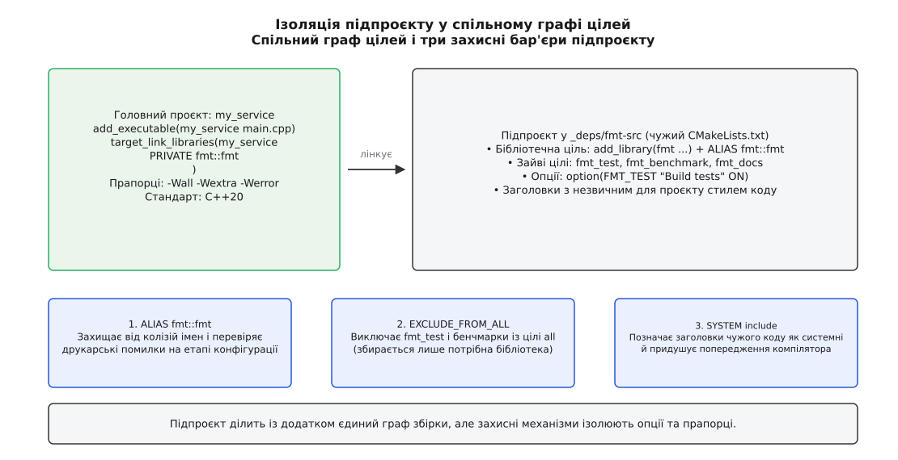
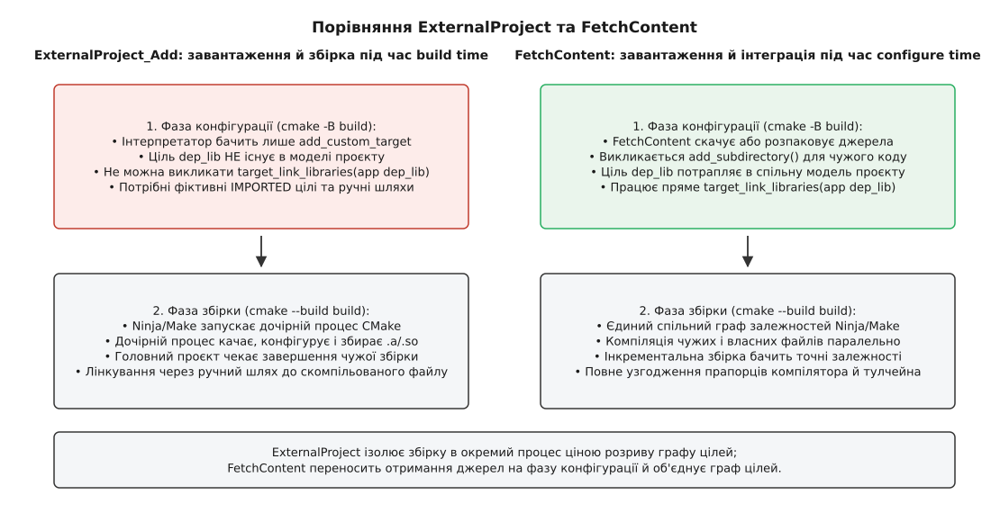
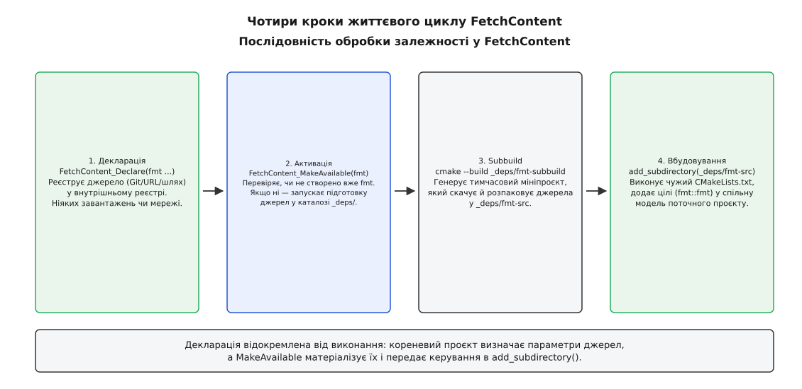
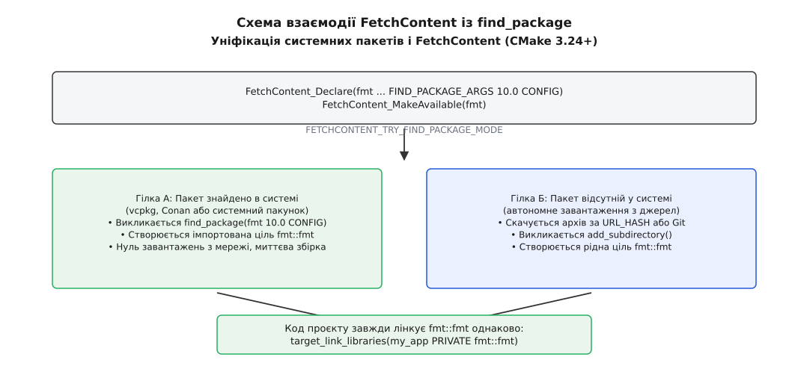

# FetchContent і підпроєкти: чужий код усередині збірки

<preknowlist>
- [Мова CMakeLists](root:sys-bsystem/cmake-language) — значення як рядки, області видимості змінних у каталогах і послідовне виконання команд зверху вниз під час конфігурації.
- [Цілі й властивості замість глобальних змінних](root:sys-bsystem/targets-and-properties) — як модель цілей CMake інкапсулює шляхи до заголовків, прапорці компіляції та залежності в єдиному глобальному просторі імен.
- [Вимоги вжитку](root:sys-bsystem/usage-requirements) — передача транзитивних вимог до збірки через ключові слова PUBLIC, PRIVATE та INTERFACE.
- [Конфігурація, генерація і збірка](root:sys-bsystem/configure-and-generate) — розмежування фази виконання скриптів CMake (configure time) та безпосередньої компіляції генератором збірки (build time).
- [Лінкування](root:sf-lang/linking) — статичні й динамічні бібліотеки, зведення символів і розв'язання зовнішніх залежностей.
- [find_package](root:sys-bsystem/find-package) — пошук встановлених у системі бібліотек через файли конфігурації та модулі пошуку.
- [Вендоринг і git-сабмодулі](root:sys-bsystem/vendoring-submodules) — пряме збереження чужого коду в дереві репозиторію або фіксація зовнішніх комітів на рівні Git.
</preknowlist>

Команда розробляє мережевий сервіс збору телеметрії `telemetry_daemon` мовою C++. Для форматування діагностичних повідомлень потрібна бібліотека `{fmt}`, а для розбору конфігурацій — `nlohmann_json`. Перше інтуїтивне рішення розробника — встановити залежності системним пакетним менеджером: на робочій станції виконують `sudo apt install libfmt-dev`, додають у `CMakeLists.txt` виклик `find_package(fmt REQUIRED)` і переходять до написання коду. Проєкт збирається без жодної помилки.

Проте на сервері неперервної інтеграції (CI), де розгорнуто старіший дистрибутив із версією `{fmt}` 8.1.1 замість локальної 10.2.0, збірка падає через відсутність нових функцій форматування. Колега, який працює на macOS через Homebrew, отримує ще новішу версію 11.0.0, у якій змінено поведінку окремих заголовків, а на машині з Windows системного каталогу `/usr/include` узагалі немає. Друга спроба врятувати ситуацію — скопіювати 40 вихідних файлів бібліотеки безпосередньо в каталог `src/vendor/` — перетворює будь-яке оновлення версії на виснажливе ручне порівняння різниць, стирає налаштування компіляції авторів бібліотеки та позбавляє збірку оптимізацій під конкретні платформи.

Виникає фундаментальна потреба: система збірки повинна сама, без зовнішніх ручних дій розробника чи налаштування операційної системи, отримати вихідний код сторонньої бібліотеки конкретної закріпленої версії, скомпілювати її тим самим компілятором із тими самими налаштуваннями ABI та надати її цілі вашому додатку. У сучасному CMake цей механізм забезпечують підпроєкти через `add_subdirectory()` та модуль автоматичного завантаження `FetchContent`.

## Анатомія підпроєкту: add_subdirectory та єдиний граф цілей

Будь-який сторонній проєкт, що містить власний файл `CMakeLists.txt`, можна вбудувати всередину вашої збірки. Базовою командою для цього є `add_subdirectory(source_dir [binary_dir])`. Коли інтерпретатор CMake доходить до цієї інструкції, він тимчасово призупиняє обробку поточного файлу, створює нову дочірню область видимості змінних і починає виконувати `CMakeLists.txt` із вказаного каталогу.

```cmake
# Головний CMakeLists.txt проєкту
cmake_minimum_required(VERSION 3.20)
project(telemetry_daemon LANGUAGES CXX)

# Включення підпроєкту, вихідний код якого лежить у підкаталозі
add_subdirectory(third_party/fmt)

add_executable(telemetry_daemon src/main.cpp)
target_link_libraries(telemetry_daemon PRIVATE fmt::fmt)
```

Головна властивість цієї операції полягає в асиметрії між змінними та цілями. Змінні підпроєкту ізолюються в дочірній області: підпроєкт отримує копію батьківських змінних, але будь-які створені ним локальні змінні автоматично знищуються після завершення виконання його `CMakeLists.txt`. Якщо підпроєкт змінює `set(MY_FLAG "ON")`, ця зміна не виходить назовні без явного модифікатора `PARENT_SCOPE`.

Натомість **простір імен цілей у CMake є абсолютно глобальним**. Коли вкладений скрипт виконує `add_library(fmt ...)`, ця ціль реєструється не в каталозі, а в єдиному загальному словнику проєкту. Кореневий файл `CMakeLists.txt` може безпосередньо звертатися до `fmt` через `target_link_libraries`, наче ця бібліотека була описана в тому самому файлі. Ба більше, всі транзитивні властивості цілі — шляхи до заголовків (`INTERFACE_INCLUDE_DIRECTORIES`), макроозначення (`INTERFACE_COMPILE_DEFINITIONS`) та стандарти мови (`INTERFACE_COMPILE_FEATURES`) — автоматично поширюються на вашу виконувану програму.

Глобальність цілей створює як зручність, так і головну небезпеку підпроєктів — **конфлікти імен цілей**. Якщо ваш проєкт створює допоміжну статичну бібліотеку `add_library(utils src/utils.cpp)`, а сторонній підпроєкт усередині свого дерева також викликає `add_library(utils ...)`, конфігурація CMake завершиться аварійною помилкою: `add_library cannot create target "utils" because another target with the same name already exists`.

Щоб уникнути подібних колізій, професійні бібліотеки створюють псевдонім із простором імен через `add_library(fmt::fmt ALIAS fmt)`. Подвійна двокрапка `::` сигналізує CMake, що ім'я є ціллю або псевдонімом. Якщо розробник припуститься друкарської помилки й напише `target_link_libraries(app PRIVATE fmt::fmtt)`, CMake зупинить генерацію на фазі конфігурації з чітким повідомленням про невідому ціль. Якби ім'я було без двокрапки (`fmt`), CMake вважав би його назвою системної динамічної бібліотеки й передав лінкеру прапорець `-lfmt`, відклавши незрозумілу помилку зведення символів на кінець компіляції.

Також слід пам'ятати про різницю між змінними каталогів:
- `CMAKE_SOURCE_DIR` та `CMAKE_BINARY_DIR` завжди вказують на корінь вашого головного проєкту.
- `CMAKE_CURRENT_SOURCE_DIR` та `CMAKE_CURRENT_BINARY_DIR` змінюють своє значення всередині кожного каталогу й вказують на поточний підпроєкт.

Якщо чужий `CMakeLists.txt` помилково використовує `CMAKE_SOURCE_DIR` замість `CMAKE_CURRENT_SOURCE_DIR` для пошуку власних внутрішніх файлів, такий підпроєкт зламається при вкладенні. Сучасні бібліотеки завжди спираються на відносні шляхи або `CMAKE_CURRENT_SOURCE_DIR`.

### Ізоляція опцій та забруднення кешу

Підпроєкт виконується тим самим інтерпретатором CMake, що й головна програма. Це породжує проблему небажаних побічних ефектів. Більшість бібліотек містять у своєму `CMakeLists.txt` інструкції для збирання власних модульних тестів, прикладів використання та документації:

```cmake
# Типовий фрагмент усередині чужого CMakeLists.txt
option(FMT_TEST "Enable tests for fmt" ON)
option(FMT_DOC "Generate documentation" ON)

if(FMT_TEST)
    add_subdirectory(test) # створює десятки тестових цілей і завантажує GoogleTest!
endif()
```

Оскільки команда `option()` записує значення безпосередньо в глобальний файл `CMakeCache.txt`, увімкнення підпроєкту за замовчуванням змусить вашу систему збірки компілювати чужі тести, завантажувати непотрібні тестові фреймворки та витрачати процесорний час.

Для захисту головного проєкту застосовують попереднє перекриття змінних кешу. Якщо перед викликом підпроєкту явно записати в кеш вимкнене значення прапорця з модифікатором `FORCE`, чужа команда `option()` не перезаписуватиме вже наявне значення:

```cmake
# Вимикаємо чужі тести до того, як підпроєкт спробує зареєструвати їх у кеші
set(FMT_TEST OFF CACHE BOOL "Disable fmt tests" FORCE)
set(FMT_DOC OFF CACHE BOOL "Disable fmt documentation" FORCE)

add_subdirectory(third_party/fmt)
```

### EXCLUDE_FROM_ALL: відсікання зайвих цілей

Навіть якщо підпроєкт містить внутрішні утиліти чи приклади, які не вимикаються окремими опціями, CMake надає вбудований фільтр на рівні каталогу:

```cmake
add_subdirectory(third_party/fmt EXCLUDE_FROM_ALL)
```

Прапорець `EXCLUDE_FROM_ALL` змінює статус усіх цілей, оголошених усередині цього каталогу та його підкаталогів. Вони виключаються зі стандартної псевдоцілі `all` (яка збирається за замовчуванням при запуску `cmake --build build` або виклику `ninja` / `make`). Компілятор збиратиме виключно ті бібліотеки з підпроєкту, від яких явно залежить ваша програма через `target_link_libraries`. Допоміжні утиліти, приклади та невикористовувані модулі стороннього коду будуть проігноровані генератором.

### SYSTEM: придушення чужих попереджень компілятора

Сучасні проєкти з високими стандартами надійності вмикають суворі прапорці компілятора: `-Wall -Wextra -Wpedantic -Werror` для GCC та Clang або `/W4 /WX` для MSVC. Будь-яке попередження трактується як фатальна помилка.

Коли ви компілюєте сторонній код, висока ймовірність зіткнутися з тим, що заголовочні файли чужої бібліотеки містять конструкції, які не проходять ваші строгі перевірки (наприклад, неявні перетворення типів або невикористані змінні). Якщо включити такі заголовки через звичайний `-I`, компілятор згенерує помилку у вашому власному коді, щойно ви напишете `#include <fmt/core.h>`.

Для ізоляції сторонніх заголовків використовують механізм системних каталогів включення:

```cmake
add_subdirectory(third_party/fmt SYSTEM)
```

Слово `SYSTEM` автоматично позначає всі відкриті каталоги заголовків (`INTERFACE_INCLUDE_DIRECTORIES`), що експортуються цілями цього підпроєкту, як системні. Компілятор викликатиметься з прапорцем `-isystem` замість `-I` (або `/external:I` у MSVC), що наказує препроцесору повністю придушувати діагностичні попередження, які походять із цих сторонніх файлів, зберігаючи найсуворіший рівень перевірки для ваших власних вихідних текстів.


*Три лінії захисту підпроєкту: псевдонім із подвійною двокрапкою запобігає колізіям імен, EXCLUDE_FROM_ALL виключає зайві тести, а SYSTEM придушує чужі попередження компілятора.*

## Еволюційний глухий кут: ExternalProject і бар'єр часу збірки

До появи сучасних засобів управління вихідним кодом у CMake існував єдиний стандартний модуль для роботи з віддаленими залежностями — `ExternalProject` (з'явився у CMake 2.8).

Команда `ExternalProject_Add` створює відокремлений конвеєр завантаження та збірки зовнішньої програми, що складається з послідовних кроків: Download → Update → Patch → Configure → Build → Install. Проте архітектура `ExternalProject` має фундаментальне обмеження: **усі ці кроки виконуються під час фази збірки (build time)**, коли працює утиліта компіляції (`ninja` або `make`), а не під час фази конфігурації CMake.

```cmake
# Історичний підхід через ExternalProject_Add
include(ExternalProject)

ExternalProject_Add(fmt_external
    GIT_REPOSITORY https://github.com/fmtlib/fmt.git
    GIT_TAG        10.2.0
    PREFIX         ${CMAKE_BINARY_DIR}/external/fmt
    CMAKE_ARGS     -DCMAKE_INSTALL_PREFIX:PATH=<INSTALL_DIR>
                   -DFMT_TEST:BOOL=OFF
)
```

Коли інтерпретатор CMake виконує цей блок у `CMakeLists.txt`, він не завантажує репозиторій і не відкриває його файли. Він лише реєструє в моделі спеціальну дію — `add_custom_target(fmt_external)`. Ціль самої бібліотеки `fmt` у пам'яті CMake **не існує**.

Це породжує каскад важких інженерних наслідків:
1. **Неможливість прямого лінкування:** Виклик `target_link_libraries(my_app PRIVATE fmt::fmt)` неможливий, оскільки CMake не знає такої цілі на момент створення `my_app`.
2. **Ручні імпортовані цілі та шляхи:** Розробник змушений вручну створювати фіктивну імпортовану бібліотеку `add_library(fmt_lib STATIC IMPORTED)`, явно прописувати шлях до майбутнього `.a` чи `.lib` файлу через властивість `IMPORTED_LOCATION` та вручну задавати каталоги пошуку заголовків.
3. **Ручне керування порядком:** Щоб компілятор не спробував зібрати `my_app` до того, як `ExternalProject` скомпілює залежність, необхідно вручну зв'язувати цілі інструкцією `add_dependencies(my_app fmt_external)`.
4. **Розрив єдиного графу та подвійна збірка:** Підпроєкт збирається повністю ізольованим дочірнім процесом CMake зі своїм незалежним кешем і прапорцями. Помилка компілятора в сторонній бібліотеці не інтегрується в діагностику головного проєкту, а середовища розробки (IDE) не можуть коректно індексувати код і надавати автодоповнення, поки бібліотека не буде зібрана на диску.

Для обходу цих обмежень створювався складний патерн **Superbuild**: кореневий проєкт нічого не збирав сам, а складався виключно з викликів `ExternalProject_Add` для кожної сторонньої бібліотеки та фінального виклику `ExternalProject_Add` для власного додатку. Це перетворювало процес налагодження на багаторівневий лабіринт вкладених запусків CMake, де інкрементальна збірка втрачала точність, а паралелізм компіляції обмежувався штучними бар'єрами між зовнішніми кроками.


*ExternalProject виконує завантаження та збірку в окремому процесі під час build time, тоді як FetchContent отримує джерела під час конфігурації й вбудовує їхні цілі в єдиний граф проєкту.*

## Модуль FetchContent: завантаження під час конфігурації

У CMake 3.11 з'явилася принципово нова концепція, яка об'єднала зручність автоматичного завантаження з архітектурною чистотою підпроєктів — модуль `FetchContent` (який отримав свій канонічний вигляд у CMake 3.14 завдяки команді `FetchContent_MakeAvailable`).

Головна ідея `FetchContent` — **перенести завантаження та розпакування вихідного коду на фазу конфігурації (configure time)**. Коли CMake обробляє скрипти проєкту, він завантажує сторонні файли в каталог збірки й негайно викликає для них `add_subdirectory()`. Завдяки цьому сторонні цілі стають повноправними елементами єдиного графу цілей у тій самій сесії генерації.

Модель `FetchContent` розділена на два чітких кроки: **декларацію** та **матеріалізацію**.

```cmake
include(FetchContent)

# 1. Декларація: де взяти код та якої версії (не виконує мережевих запитів)
FetchContent_Declare(
    fmt
    GIT_REPOSITORY https://github.com/fmtlib/fmt.git
    GIT_TAG        10.2.1
    GIT_SHALLOW    TRUE
)

FetchContent_Declare(
    nlohmann_json
    URL            https://github.com/nlohmann/json/releases/download/v3.11.3/json.tar.xz
    URL_HASH       SHA256=d6c65393116c3e981177ee7c99e917a226f74a056c703b4188b4eb14b5186b51
)

# 2. Матеріалізація: завантаження, підготовка та виклик add_subdirectory()
FetchContent_MakeAvailable(fmt nlohmann_json)

# 3. Використання: прямий зв'язок із рідними цілями бібліотек
add_executable(telemetry_daemon src/main.cpp)
target_link_libraries(telemetry_daemon PRIVATE
    fmt::fmt
    nlohmann_json::nlohmann_json
)
```

### Що відбувається під капотом FetchContent_MakeAvailable

Команда `FetchContent_MakeAvailable` виконує для кожної переданої назви послідовність дій:

1. **Перевірка наявності:** Спочатку перевіряється, чи не була ця залежність уже активована раніше або чи не існує вже ціль із такою назвою. Якщо залежність уже готова, команда негайно повертає керування.
2. **Створення допоміжного проєкту (Subbuild):** Якщо вихідні файли ще не завантажені, CMake генерує у каталозі збірки тимчасовий мініпроєкт у теці `${CMAKE_BINARY_DIR}/_deps/<name>-subbuild/CMakeLists.txt`. Цей мініпроєкт використовує всередині той самий `ExternalProject_Add`, але налаштований виключно на виконання кроків завантаження та розпакування без конфігурації та компіляції.
3. **Виконання завантаження:** CMake синхронно запускає окремий швидкий процес `cmake --build` для цього subbuild-проєкту. Цей процес виконує мережеве скачування (клонування Git або завантаження архіву) і розпаковує отриманий код у каталог `${CMAKE_BINARY_DIR}/_deps/<name>-src`. Прогрес фіксується у файлах штампів у каталозі `_deps/<name>-subbuild/<name>-populate-prefix/src/<name>-populate-stamp/`.
4. **Виклик add_subdirectory:** Після успішного розміщення файлів на диску `FetchContent_MakeAvailable` автоматично виконує еквівалент виклику:
   ```cmake
   add_subdirectory(
       ${CMAKE_BINARY_DIR}/_deps/<name>-src
       ${CMAKE_BINARY_DIR}/_deps/<name>-build
       EXCLUDE_FROM_ALL
   )
   ```
   Починаючи з CMake 3.25, `FetchContent_MakeAvailable` автоматично додає системний прапорець `SYSTEM` до включення підпроєкту (відповідно до політики `CMP0169` та налаштувань каталогів), що остаточно позбавляє головний проєкт попереджень від чужого коду.

### Header-only проти скомпільованих підпроєктів

Підпроєкти, що підключаються через `FetchContent`, природно поділяються на два класи:

1. **Бібліотеки із самих заголовків (Header-only):** Такі цілі (як `nlohmann_json`, `glm`, `Catch2::Catch2WithMain` або `doctest`) створюються командою `add_library(name INTERFACE)`. Вони не містять власних C/C++ файлів для компіляції і не створюють об'єктних файлів чи бібліотечних архівів `.a` / `.lib`. Під час додавання такого підпроєкту через `FetchContent` навантаження на систему збірки мінімальне: CMake лише зчитує `CMakeLists.txt`, реєструє інтерфейсні властивості заголовків і переходить далі.
2. **Скомпільовані підпроєкти (Compiled libraries):** Бібліотеки на кшталт `fmt`, `zlib`, `sqlite3` чи `spdlog` містять вихідні файли, що компілюються у статичні чи динамічні бібліотеки. Тут важливу роль відіграє глобальна змінна `BUILD_SHARED_LIBS`. Якщо у вашому головному проєкті встановлено `set(BUILD_SHARED_LIBS ON)`, усі підпроєкти, які створюють бібліотеки через звичайний `add_library(name source.cpp)` без явного зазначення `STATIC` або `SHARED`, автоматично зберуться як динамічні бібліотеки (`.so` / `.dll`). Це дозволяє централізовано перемикати режим лінкування всього дерева одним прапорцем.

### Низькорівневий API: GetProperties та Populate

До введення `FetchContent_MakeAvailable` у CMake 3.14 розробники використовували низькорівневий двоетапний синтаксис:

```cmake
# Застарілий низькорівневий патерн CMake 3.11-3.13
FetchContent_GetProperties(fmt)
if(NOT fmt_POPULATED)
    FetchContent_Populate(fmt)
    add_subdirectory(${fmt_SOURCE_DIR} ${fmt_BINARY_DIR} EXCLUDE_FROM_ALL)
endif()
```

Сьогодні цей синтаксис вважається застарілим і потрібен лише у рідкісних випадках, коли сторонній репозиторій не має власного `CMakeLists.txt` (наприклад, чистий набір заголовків або C-файлів), і ви хочете вручну створити інтерфейсну бібліотеку `add_library(mylib INTERFACE)` над розпакованим вмістом `${fmt_SOURCE_DIR}`, не викликаючи `add_subdirectory()`. Для всіх стандартних випадків слід використовувати виключно `FetchContent_MakeAvailable`.


*Чотири кроки FetchContent: від декларації джерела й запуску внутрішнього мініпроєкту subbuild до виклику add_subdirectory і появи цілей у спільній моделі.*

## Джерела та протоколи: Git, архіви та локальні каталоги

Команда `FetchContent_Declare(<name> <параметри...>)` підтримує різні способи отримання коду. Вибір типу джерела безпосередньо впливає на надійність, безпеку та швидкість вашої збірки.

### Джерело Git

Найпоширеніший спосіб підключення відкритих бібліотек:

```cmake
FetchContent_Declare(
    spdlog
    GIT_REPOSITORY https://github.com/gabime/spdlog.git
    GIT_TAG        v1.13.0
    GIT_SHALLOW    TRUE
    GIT_PROGRESS   TRUE
    GIT_SUBMODULES ""
)
```

Ключові параметри та їхній вплив:
- `GIT_REPOSITORY`: URL-адреса віддаленого сховища (HTTPS або SSH).
- `GIT_TAG`: ревізія коду. Може бути назвою тегу (`v1.13.0`), повним 40-символьним хешем коміту (`2f41e605ce9e0977...`) або назвою гілки (`main`).
  
> ⚠️ **Пастка плаваючих гілок:** Використання назв гілок (`GIT_TAG main` або `GIT_TAG master`) у `FetchContent_Declare` є небезпечним антипатерном. Така збірка втрачає детермінізм: сьогодні проєкт збирається успішно, а завтра новий коміт у чужій гілці ламає сумісність або змінює ABI. Крім того, на кожному повторному запуску конфігурації CMake буде виконувати мережевий запит `git fetch` для перевірки наявності нових комітів у віддаленій гілці, що суттєво сповільнює роботу. Завжди закріплюйте точний хеш коміту або офіційний релізний тег.

- `GIT_SHALLOW TRUE`: виконує неглибоке клонування (`git clone --depth 1`). Замість завантаження всієї історії розробки за десять років (яка може важити сотні мегабайтів) скачується виключно стан дерева на момент вказаного тегу. Це скорочує час виконання фази конфігурації в рази, особливо в середовищах CI.
- `GIT_PROGRESS TRUE`: виводить відсоток завантаження об'єктів Git у термінал, що запобігає враженню «зависання» процесу під час отримання великих сховищ.
- `GIT_SUBMODULES ""` або `GIT_SUBMODULES_RECURSE FALSE`: керує ініціалізацією вкладених сабмодулів Git. Якщо стороння бібліотека містить у своїх сабмодулях важкі бенчмарки або необов'язкові залежності, передача порожнього списку `""` запобігає скачуванню гігабайтів зайвих даних.

### Архіви (Tarball / ZIP) із контрольною сумою

Найбільш надійний, швидкий і відтворюваний спосіб отримання стороннього коду:

```cmake
FetchContent_Declare(
    cpr
    URL      https://github.com/libcpr/cpr/archive/refs/tags/1.10.5.tar.gz
    URL_HASH SHA256=a80e504e6ecc1a46e5fa9a066891eb0fe8980ec569c76251b5ab92446d3e34b9
)
```

Переваги використання архівів із криптографічним хешем:
1. **Мінімальний обсяг трафіку:** Архів містить лише чисті файли вихідного коду без внутрішньої службової бази даних `.git`, що зменшує розмір завантаження у 5–10 разів порівняно навіть із неглибоким клонуванням Git.
2. **Криптографічна гарантія незмінності:** Параметр `URL_HASH SHA256=...` змушує CMake обчислити геш-суму завантаженого файлу перед його розпакуванням. Якщо репозиторій було скомпрометовано, тег перезаписано або файл пошкоджено під час передачі мережею, CMake негайно зупинить конфігурацію з помилкою.
3. **Кешування та автономність:** Завантажений архів перевіряється один раз і більше ніколи не опитує мережу при повторних конфігураціях.
4. **Корпоративні джерела:** `FetchContent_Declare` підтримує роботу з приватними серверами артефактів (Nexus, Artifactory, GitLab Package Registry) за допомогою параметрів `HTTP_HEADER` або стандартної конфігурації `.netrc`.

Також за потреби швидкого виправлення помилок у чужому коді можна передати команду накладання патчу: `PATCH_COMMAND git apply ${CMAKE_CURRENT_SOURCE_DIR}/patches/fix_msvc.patch`.

### Локальні каталоги та перевизначення джерел для розробки

Під час активної розробки часто виникає ситуація, коли вам потрібно внести виправлення одночасно і в основний додаток, і в бібліотеку, яка підключається через `FetchContent`. Якщо бібліотека завантажується з віддаленого Git, кожен тест вимагав би створення коміту, відправки його на GitHub/GitLab і оновлення хешу `GIT_TAG` у проєкті.

CMake надає вбудований механізм заміни джерела без редагування файлу `CMakeLists.txt`. Якщо під час виклику CMake встановити змінну `FETCHCONTENT_SOURCE_DIR_<UPPERCASED_NAME>`, `FetchContent` повністю проігнорує мережеві декларації й використає вказану локальну папку:

```bash
# Перемикання залежності fmt на локальний робочий каталог розробника
cmake -B build -DFETCHCONTENT_SOURCE_DIR_FMT=/home/developer/projects/fmt-fork
```

Під час виконання `FetchContent_MakeAvailable(fmt)` CMake не викликатиме мережевий subbuild, а безпосередньо виконає `add_subdirectory(/home/developer/projects/fmt-fork ...)` над вашим локальним каталогом. Ви можете редагувати вихідні файли бібліотеки у своїй IDE, і вони миттєво перекомпільовуватимуться разом із проєктом.

Цей же механізм застосовують для складання проєктів в ізольованих контурах (air-gapped environments) без доступу до зовнішньої мережі Інтернет: скрипт розгортання заздалегідь викачує потрібні архіви в локальне сховище і передає шляхи до них через `FETCHCONTENT_SOURCE_DIR_<NAME>`.

## Ієрархія перевизначень і взаємодія з find_package

Коли проєкт розростається до складної модульної архітектури, неминуче виникає проблема транзитивних залежностей (так звана «проблема діамантової залежності» або diamond dependency).

Уявіть структуру:
- Ваш додаток `my_app` залежить від бібліотеки `audio_engine` та бібліотеки `network_client`.
- І `audio_engine`, і `network_client` використовують бібліотеку логування `spdlog`.
- `audio_engine` у своєму `CMakeLists.txt` оголошує `FetchContent_Declare(spdlog GIT_TAG v1.11.0)`.
- `network_client` оголошує `FetchContent_Declare(spdlog GIT_TAG v1.12.0)`.

Якби CMake намагався завантажити обидві версії, виник би нерозв'язний конфлікт: створення двох однойменних цілей `spdlog::spdlog` з різними версіями коду, що призвело б до катастрофи на етапі зведення символів лінкером (порушення ODR — One Definition Rule).

### Правило першої декларації (First Declaration Wins)

У модулі `FetchContent` закладено суворе правило: **перша зареєстрована декларація перемагає всі наступні**.

Якщо в кореневому `CMakeLists.txt` вашого головного проєкту на самому початку записано:

```cmake
# Кореневий CMakeLists.txt проєкту my_app
include(FetchContent)

# Головний проєкт явно фіксує єдину узгоджену версію spdlog для ВСІХ підпроєктів
FetchContent_Declare(
    spdlog
    GIT_REPOSITORY https://github.com/gabime/spdlog.git
    GIT_TAG        v1.13.0
)

# Оголошуємо модулі проєкту
FetchContent_Declare(audio_engine   GIT_REPOSITORY ... GIT_TAG v2.0)
FetchContent_Declare(network_client GIT_REPOSITORY ... GIT_TAG v1.5)

# Активація
FetchContent_MakeAvailable(spdlog audio_engine network_client)
```

Коли CMake почне виконувати `CMakeLists.txt` підпроєкту `audio_engine` і натрапить там на виклик `FetchContent_Declare(spdlog GIT_TAG v1.11.0)`, він побачить, що залежність із назвою `spdlog` уже зареєстрована в системі. Вторинна декларація буде мовчки проігнорована. Усе дерево проєкту використовуватиме версію `v1.13.0`, призначену кореневим файлом.

З цього випливає критично важливе правило структурування CMake-проєктів: **усі виклики `FetchContent_Declare` повинні розміщуватися на самому початку кореневого файлу до будь-яких викликів `FetchContent_MakeAvailable` або `add_subdirectory`**.

### Інтеграція з системними пакетами: перенаправлення find_package

У світі C++ існує поділ між розробниками додатків (яким зручно отримати все через `FetchContent` «з коробки») та системними інтеграторами або мейнтейнерами дистрибутивів Linux (яким суворо заборонено качати щось з інтернету під час збірки пакетів, і які вимагають використання попередньо встановлених системних бібліотек).

Починаючи з CMake 3.24, у `FetchContent` з'явився механізм гармонізації цих двох світів за допомогою параметра `FIND_PACKAGE_ARGS` та глобального режиму `FETCHCONTENT_TRY_FIND_PACKAGE_MODE`.

```cmake
FetchContent_Declare(
    fmt
    GIT_REPOSITORY https://github.com/fmtlib/fmt.git
    GIT_TAG        10.2.1
    FIND_PACKAGE_ARGS 10.0 CONFIG
)

FetchContent_MakeAvailable(fmt)
```

Коли у виклику `FetchContent_Declare` вказано секцію `FIND_PACKAGE_ARGS`:
1. Під час виконання `FetchContent_MakeAvailable(fmt)` CMake спочатку намагається знайти встановлену бібліотеку викликом `find_package(fmt 10.0 CONFIG)`.
2. Якщо бібліотека знайдена в системі (або встановлена через пакетні менеджери Conan чи vcpkg), CMake імпортує системну ціль `fmt::fmt` і **повністю пропускає мережеве завантаження та збірку вихідного коду**.
3. Якщо `find_package` не знаходить бібліотеку або версія не відповідає вимогам, CMake автоматично переходить до резервного плану: завантажує вихідний код через Git/URL і збирає його як підпроєкт.

Поведінкою можна глобально керувати через змінну `FETCHCONTENT_TRY_FIND_PACKAGE_MODE`:
- `NEVER` (за замовчуванням у версіях до 3.24) — ігнорувати системні пакети, завжди завантажувати джерела.
- `OPT_IN` (за замовчуванням починаючи з 3.24) — викликати `find_package`, лише якщо в `FetchContent_Declare` явно вказано секцію `FIND_PACKAGE_ARGS`.
- `ALWAYS` — намагатися викликати `find_package` для всіх оголошених залежностей, навіть якщо аргументи не були задані явно.

Це забезпечує повну універсальність: на комп'ютері розробника без підготовленого оточення проєкт самостійно витягне й збере вихідний код, а на сервері пакування дистрибутиву прапорець `-DFETCHCONTENT_TRY_FIND_PACKAGE_MODE=ALWAYS` змусить збірку миттєво підхопити системні динамічні бібліотеки.

### Провайдери залежностей (Dependency Providers)

У CMake 3.24 з'явився ще глибший рівень інтеграції — механізм провайдерів залежностей (`cmake_language(SET_DEPENDENCY_PROVIDER ...)`). Провайдер дозволяє зовнішнім інструментам (наприклад, пакетному менеджеру vcpkg або Conan) перехоплювати всі виклики `FetchContent_MakeAvailable` та `find_package` ще до того, як CMake почне виконувати власну логіку. Провайдер аналізує ім'я запитаної бібліотеки і може миттєво надати готову бінарну збірку замість компіляції джерел, зберігаючи синтаксис файлу `CMakeLists.txt` незмінним.


*Уніфікація джерел у CMake 3.24+: за наявності системного пакунка FetchContent використовує готову імпортовану ціль, а за його відсутності — автоматично завантажує та збирає вихідний код.*

## Продуктивність, кешування та життєвий цикл файлів

Робота з вихідним кодом сторонніх бібліотек під час конфігурації безпосередньо впливає на час виконання `cmake -B build`. Розуміння внутрішньої організації каталогів дозволяє уникнути тривалих мережевих затримок та оптимізувати процес збірки.

### Фізичне розміщення файлів

За замовчуванням усі артефакти модуля розміщуються всередині каталогу збірки у підпапці `_deps`:

```
build/
├── CMakeCache.txt
├── CMakeFiles/
└── _deps/
    ├── fmt-subbuild/    # Допоміжний мініпроєкт завантаження
    ├── fmt-src/         # Розпакований вихідний код сторонньої бібліотеки
    └── fmt-build/       # Проміжні об'єктні файли компіляції підпроєкту
```

Якщо видалити каталог `build/`, наступний запуск конфігурації повторно завантажуватиме всі залежності з мережі. Щоб уникнути багаторазового завантаження однакових бібліотек між різними конфігураціями збірки (наприклад, `build-debug`, `build-release`, `build-asan`), можна налаштувати спільний глобальний каталог зберігання джерел:

```bash
# Вказуємо спільну папку для вихідного коду всіх залежностей
cmake -B build-debug -DFETCHCONTENT_BASE_DIR=/home/developer/.cmake_deps
cmake -B build-release -DFETCHCONTENT_BASE_DIR=/home/developer/.cmake_deps
```

У цьому випадку каталог `fmt-src` завантажиться лише один раз і спільно використовуватиметься обома збірками, тоді як каталоги бінарних артефактів `fmt-build` залишаться роздільними для кожної конфігурації. На серверах неперервної інтеграції (GitHub Actions, GitLab CI) кешування каталогу `FETCHCONTENT_BASE_DIR` між прогонами пайплайнів скорочує час підготовки збірки з кількох хвилин до кількох секунд.

### Оптимізація повторної конфігурації: відключення перевірки оновлень

Коли ви змінюєте свій власний `CMakeLists.txt` і повторно запускаєте `cmake -B build`, CMake перевіряє стан усіх залежностей. Якщо для залежності вказано Git-репозиторій із назвою гілки або тегу, інтерпретатор може намагатися встановити зв'язок із сервером Git для перевірки наявності змін.

Для прискорення локальної розробки та усунення мережевих затримок використовують спеціальні прапорці:

```cmake
# Вимикає мережеві оновлення для вже завантажених залежностей
set(FETCHCONTENT_UPDATES_DISCONNECTED ON CACHE BOOL "")
```

Коли `FETCHCONTENT_UPDATES_DISCONNECTED` увімкнено, CMake перевіряє лише фізичну наявність каталогу `_deps/<name>-src`. Якщо файли вже існують на диску, він миттєво переходить до етапу `add_subdirectory`, не витрачаючи жодної мілісекунди на мережеві виклики.

Якщо ж потрібно повністю заборонити будь-яку мережеву активність на машинах без доступу до інтернету, вмикають прапорець `FETCHCONTENT_FULLY_DISCONNECTED ON`. Якщо якась залежність ще не була завантажена раніше, CMake видасть фатальну помилку конфігурації замість спроби виходу в мережу.

Для керування виводом діагностики у консоль під час завантаження слугує прапорець `FETCHCONTENT_QUIET` (увімкнено за замовчуванням): коли він дорівнює `ON`, CMake не засмічує лог повідомленнями про клонування та розпакування кожного файлу, виводячи лише фінальний статус або повідомлення про помилки.

## Практичний наскрізний приклад

Розглянемо повноцінний приклад побудови сервісу, який демонструє найкращі інженерні практики інтеграції підпроєктів: використання криптографічних хешів, ізоляцію опцій сторонніх бібліотек, придушення попереджень та організацію коду.

### Файл конфігурації збірки CMakeLists.txt

```cmake
cmake_minimum_required(VERSION 3.24)
project(telemetry_service LANGUAGES C CXX)

set(CMAKE_CXX_STANDARD 20)
set(CMAKE_CXX_STANDARD_REQUIRED ON)
set(CMAKE_CXX_EXTENSIONS OFF)

set(CMAKE_C_STANDARD 11)
set(CMAKE_C_STANDARD_REQUIRED ON)

# Глобальне вимкнення оновлень для швидкості повторних конфігурацій
set(FETCHCONTENT_UPDATES_DISCONNECTED ON CACHE BOOL "" FORCE)

include(FetchContent)

# 1. Ізоляція опцій підпроєктів: вимикаємо зайві компоненти до завантаження
set(FMT_TEST OFF CACHE BOOL "Disable fmt tests" FORCE)
set(FMT_DOC OFF CACHE BOOL "Disable fmt docs" FORCE)
set(FMT_INSTALL OFF CACHE BOOL "Disable fmt install targets" FORCE)

set(JSON_BuildTests OFF CACHE BOOL "Disable nlohmann_json tests" FORCE)
set(JSON_Install OFF CACHE BOOL "Disable nlohmann_json install" FORCE)

# 2. Декларація залежностей із фіксацією хешів SHA-256 та перенаправленням на find_package
FetchContent_Declare(
    fmt
    URL                https://github.com/fmtlib/fmt/archive/refs/tags/10.2.1.tar.gz
    URL_HASH           SHA256=312e4997a80e220502f2558fb3b3797b9aeded05dce4018204b3b47172327145
    FIND_PACKAGE_ARGS  10.2 CONFIG
)

FetchContent_Declare(
    nlohmann_json
    URL                https://github.com/nlohmann/json/archive/refs/tags/v3.11.3.tar.gz
    URL_HASH           SHA256=0d8eed583a45371694f4c9a4891158229c1598f804fc921e51381283c7ce353c
    FIND_PACKAGE_ARGS  3.11 CONFIG
)

# 3. Активація підпроєктів (автоматично викликає add_subdirectory з EXCLUDE_FROM_ALL)
FetchContent_MakeAvailable(fmt nlohmann_json)

# 4. Оголошення головного виконуваного файлу
add_executable(telemetry_service
    src/main.cpp
    src/collector.cpp
)

# 5. Налаштування найсуворіших попереджень для власного коду
if(MSVC)
    target_compile_options(telemetry_service PRIVATE /W4 /WX /permissive-)
else()
    target_compile_options(telemetry_service PRIVATE -Wall -Wextra -Wpedantic -Werror)
endif()

# 6. Лінкування з цілями підпроєктів: заголовки імпортуються як системні
target_link_libraries(telemetry_service PRIVATE
    fmt::fmt
    nlohmann_json::nlohmann_json
)
```

### Вихідний код програми

:::tabs
```cpp
// src/collector.hpp
#pragma once
#include <string>
#include <string_view>
#include <cstdint>

struct TelemetryRecord {
    std::string sensor_id;
    double temperature;
    uint32_t pressure_hpa;
    uint64_t timestamp_ms;
};

std::string format_telemetry_report(const TelemetryRecord& rec);
std::string serialize_to_json(const TelemetryRecord& rec);
```
```c
/* src/collector.h — C-інтерфейс утиліти для сумісності з низькорівневими модулями */
#ifndef COLLECTOR_H
#define COLLECTOR_H

#include <stdint.h>

struct CTelemetryRecord {
    const char* sensor_id;
    double temperature;
    uint32_t pressure_hpa;
    uint64_t timestamp_ms;
};

#endif /* COLLECTOR_H */
```
:::

:::tabs
```cpp
// src/collector.cpp
#include "collector.hpp"
#include <fmt/format.h>
#include <fmt/chrono.h>
#include <nlohmann/json.hpp>
#include <chrono>

std::string format_telemetry_report(const TelemetryRecord& rec) {
    const auto tp = std::chrono::time_point<std::chrono::system_clock, std::chrono::milliseconds>(
        std::chrono::milliseconds(rec.timestamp_ms)
    );

    // Використання форматування fmt: чисто, швидко, без ризику виходу за межі буфера
    return fmt::format("[{:%Y-%m-%d %H:%M:%S}] Sensor '{}': Temp = {:.2f} °C, Pressure = {} hPa",
                       tp, rec.sensor_id, rec.temperature, rec.pressure_hpa);
}

std::string serialize_to_json(const TelemetryRecord& rec) {
    nlohmann::json j;
    j["sensor_id"] = rec.sensor_id;
    j["metrics"] = {
        {"temperature_c", rec.temperature},
        {"pressure_hpa", rec.pressure_hpa}
    };
    j["timestamp"] = rec.timestamp_ms;
    return j.dump(2);
}
```
```c
/* src/collector_legacy.c — C-реалізація форматування для базового тестового стенду */
#include "collector.h"
#include <stdio.h>
#include <stdlib.h>

char* format_c_telemetry_report(const struct CTelemetryRecord* rec) {
    char* buffer = (char*)malloc(256);
    if (!buffer) return NULL;
    snprintf(buffer, 256, "[Timestamp: %llu] Sensor '%s': Temp = %.2f C, Pressure = %u hPa",
             (unsigned long long)rec->timestamp_ms, rec->sensor_id, rec->temperature, rec->pressure_hpa);
    return buffer;
}
```
:::

:::tabs
```cpp
// src/main.cpp
#include "collector.hpp"
#include <iostream>

int main() {
    TelemetryRecord sample{
        .sensor_id = "ENV-PROBE-04",
        .temperature = 23.85,
        .pressure_hpa = 1013,
        .timestamp_ms = 1724000000000ULL
    };

    std::cout << "--- Текстовий звіт ---\n";
    std::cout << format_telemetry_report(sample) << "\n\n";

    std::cout << "--- JSON payload ---\n";
    std::cout << serialize_to_json(sample) << "\n";

    return 0;
}
```
```c
/* src/main_c.c — точка входу для чистого C-тесту */
#include "collector.h"
#include <stdio.h>
#include <stdlib.h>

int main(void) {
    struct CTelemetryRecord sample = {
        .sensor_id = "ENV-PROBE-04",
        .temperature = 23.85,
        .pressure_hpa = 1013,
        .timestamp_ms = 1724000000000ULL
    };

    char* report = format_c_telemetry_report(&sample);
    if (report) {
        printf("--- C звіт ---\n%s\n", report);
        free(report);
    }
    return 0;
}
```
:::

### Корисні інженерні правила під час використання FetchContent

Щоб проєкт залишався надійним у довгостроковій перспективі, дотримуйтесь перевірених правил:

1. **Завжди віддавайте перевагу архівам із контрольними сумами `URL_HASH` перед викликами `GIT_REPOSITORY`:** Архіви завантажуються в рази швидше, не залежать від доступності сервісів хостингу Git і гарантують абсолютну незмінність коду.
2. **Ніколи не використовуйте плаваючі теги чи гілки:** Будь-яка залежність повинна мати жорстко зафіксований релізний тег або повний 40-значний SHA-хеш коміту.
3. **Вимикайте опції тестів та інсталяції підпроєктів перед викликом `FetchContent_MakeAvailable`:** Це економить процесорний час під час компіляції та захищає ваш дистрибутив від потрапляння чужих тестових файлів у фінальний пакет.
4. **Використовуйте `FIND_PACKAGE_ARGS` для бібліотек, які можуть постачатися операційною системою:** Це спрощує життя мейнтейнерам пакетів і дозволяє використовувати оптимізовані системні бінарні файли там, де вони вже встановлені.
5. **У власних бібліотеках завжди перевіряйте статус кореневого проєкту:**
   ```cmake
   # Правильний патерн для авторів бібліотек
   if(CMAKE_CURRENT_SOURCE_DIR STREQUAL CMAKE_SOURCE_DIR)
       # Ми збираємось як самостійний проєкт — вмикаємо тести
       option(MYLIB_BUILD_TESTS "Build test suite" ON)
   else()
       # Ми включені як підпроєкт через FetchContent — тести за замовчуванням вимкнені
       option(MYLIB_BUILD_TESTS "Build test suite" OFF)
   endif()
   ```
   Цей простий блок позбавляє всіх ваших користувачів необхідності вручну вимикати ваші внутрішні тести під час підключення бібліотеки через `FetchContent`.
