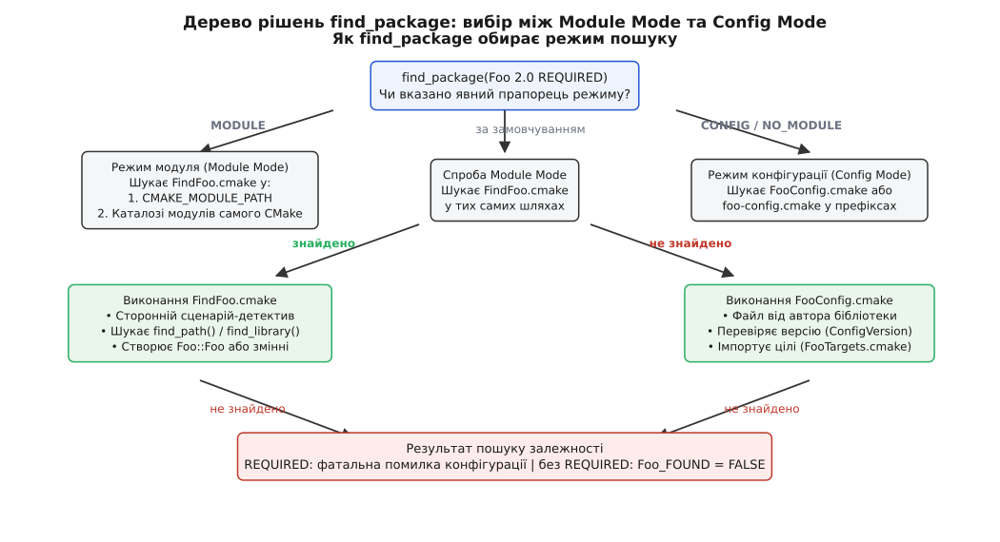
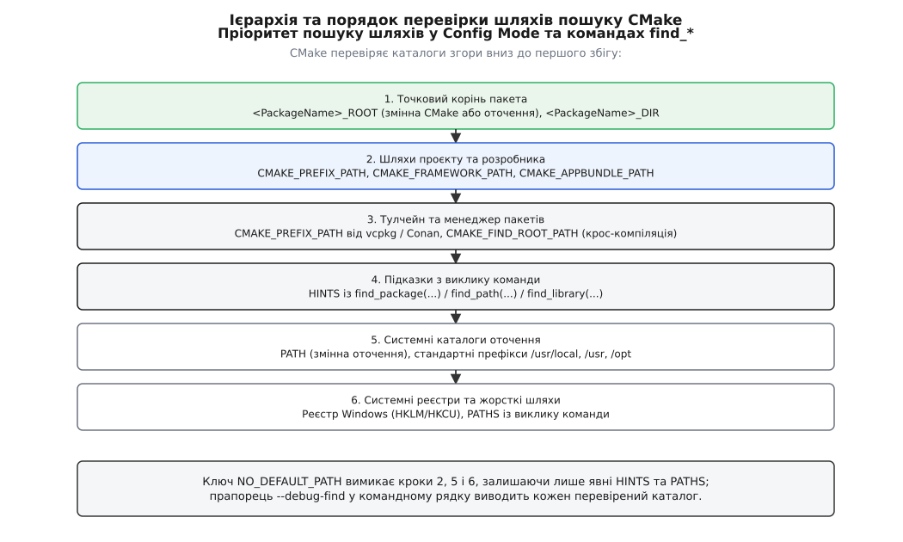
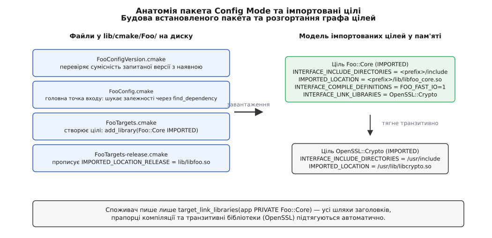

# find_package: Config проти Module й імпортовані цілі

<preknowlist>
- [Цілі й властивості замість глобальних змінних](root:sys-bsystem/targets-and-properties) — що таке ціль CMake, її властивості (`INTERFACE_...`, `IMPORTED_...`) і чому ім'я з `::` захищає від помилок лінкування.
- [Вимоги вжитку](root:sys-bsystem/usage-requirements) — як вимоги `PUBLIC`, `PRIVATE`, `INTERFACE` транслюють прапорці компілятора та шляхи включення залежним цілям.
- [Мова CMakeLists](root:sys-bsystem/cmake-language) — як працюють змінні, кеш CMake, області видимості та чому команди мови змінюють модель у пам'яті.
- [Конфігурація, генерація і збірка](root:sys-bsystem/configure-and-generate) — момент часу, коли CMake виконує пошук зовнішніх файлів у файловій системі до створення файлів генератора.
- [Лінкування](root:sf-lang/linking) — що саме потрібно лінкеру (статичні та динамічні бібліотеки, порядок залежностей, символи).
</preknowlist>

Програма для захищеного обміну даними використовує криптографічну бібліотеку OpenSSL та бібліотеку стиснення zlib. На машині розробника під керуванням Ubuntu компіляція успішно проходить із прямим зазначенням прапорців компілятора:

```cmake
# Початковий наївний опис у CMakeLists.txt
target_include_directories(my_client PRIVATE /usr/include)
target_link_libraries(my_client PRIVATE /usr/lib/x86_64-linux-gnu/libssl.so /usr/lib/x86_64-linux-gnu/libcrypto.so /usr/lib/x86_64-linux-gnu/libz.so)
```

Проєкт переносять на робочу станцію колеги з macOS — і збірка негайно зупиняється на етапі компіляції: каталогу `/usr/lib/x86_64-linux-gnu/` не існує, а встановлений через менеджер пакетів Homebrew OpenSSL лежить у `/opt/homebrew/opt/openssl@3/lib`. Проєкт передають на сервер під керуванням Windows, де збірка ведеться компілятором MSVC: там файли динамічних бібліотек мають розширення `.dll`, бібліотеки імпорту — `.lib`, а лежать вони у дереві пакувальника `vcpkg` за шляхом `C:/vcpkg/installed/x64-windows/lib`.

Спроба розв'язати проблему через розгалуження умовних операторів `if(APPLE)`, `if(WIN32)` та `if(UNIX)` перетворює файл опису збірки на заплутаний лабіринт жорстко закодованих шляхів, який ламається щоразу, коли бібліотеку оновлюють, встановлюють у нестандартний каталог або збирають для іншої архітектури процесора під час крос-компіляції.

Причина проблеми полягає в тому, що файлова система хост-машини є зовнішнім, мінливим середовищем. Система збірки не повинна вгадувати абсолютні шляхи до файлів сторонніх бібліотек — вона має оперувати механізмом декларативного виявлення залежностей. У CMake таким механізмом є команда `find_package()`.

## Дві концепції пошуку: детектив проти контракту

Коли ви пишете `find_package(OpenSSL 1.1.1 REQUIRED)`, перед CMake постає принципове питання: як саме дізнатися, де лежать файли бібліотеки, які прапорці компіляції їй потрібні та від чого вона залежить сама?

Історично в індустрії програмного забезпечення склалося два кардинально різних підходи до цієї задачі. Перший підхід — зовнішнє розслідування (детектив). Другий підхід — двостороння угода (контракт виробника). У CMake цим підходам відповідають два режими роботи: **режим модуля** (англ. *Module Mode*) та **режим конфігурації** (англ. *Config Mode*).



*Дерево рішень команди find_package: вибір між сценарієм-детективом FindFoo.cmake та конфігураційним описом виробника FooConfig.cmake.*

### Режим модуля (Module Mode): детектив-дослідник

У режимі модуля бібліотека, яку ви шукаєте, нічого не знає про CMake. Вона могла бути створена двадцять років тому, збиратися через GNU Autotools чи звичайний `Makefile` і встановлюватися в систему простим копіюванням файлів `libz.so` та `zlib.h`.

Щоб знайти таку «мовчазну» бібліотеку, CMake бере на себе роль детектива. Для цього запускається окремий сценарій пошуку, який обов'язково має назву виду `Find<PackageName>.cmake` (наприклад, `FindZLIB.cmake` або `FindOpenSSL.cmake`). Цей сценарій виконує евристичну розвідку файлової системи:
1. За допомогою низькорівневої команди `find_path()` перевіряє типові системні каталоги на наявність ключового заголовкового файла (наприклад `zlib.h`).
2. За допомогою команди `find_library()` сканує каталоги розташування бібліотек у пошуках файлів `libz.so`, `libz.a` чи `zlib.lib`.
3. Зчитує знайдений заголовок за допомогою регулярних виразів або команди `file(STRINGS ...)` і витягує макроси версії.
4. Якщо всі обов'язкові файли виявлено, сценарій конструює результат і оголошує залежність знайденою.

Сценарії `Find<PackageName>.cmake` шукаються лише у двох місцях:
- У каталогах, перелічених у змінній `CMAKE_MODULE_PATH` вашого проєкту.
- У каталозі стандартних модулів самого дистрибутива CMake (`share/cmake-<ver>/Modules/`).

Слабке місце режиму модуля очевидне: автор модуля `Find<PackageName>.cmake` змушений наперед передбачати всі можливі способи встановлення бібліотеки на всіх операційних системах світу. Якщо нова версія Linux змінить стандартний шлях до бібліотек або якщо бібліотеку зібрали з нестандартними препроцесорними прапорцями, сторонній модуль пошуку або не знайде її зовсім, або збере інформацію з помилками.

### Режим конфігурації (Config Mode): контракт від автора

Режим конфігурації є сучасним стандартом екосистеми C++. У цьому режимі автор самої бібліотеки (або інженер, який пакує її для менеджера пакетів на зразок `vcpkg` чи `Conan`) під час встановлення бібліотеки створює та кладе поруч спеціальний файл опису: `<PackageName>Config.cmake` або `<package-name>-config.cmake` (наприклад, `fmtConfig.cmake` чи `Qt6Config.cmake`).

Цей файл — це точний технічний паспорт зібраного пакета. У ньому немає жодних здогадок чи евристичних сканувань диска. Автор бібліотеки сам записав туди:
- Де саме лежать скомпільовані бінарні файли відповідної архітектури.
- З якими макроозначеннями та стандартами мови C++ мають компілюватися програми-споживачі.
- Які транзитивні сторонні бібліотеки потрібно додатково передати лінкеру.
- Як перевірити сумісність версій за допомогою сусіднього файла `<PackageName>ConfigVersion.cmake`.

Коли ви викликаєте `find_package(fmt CONFIG)`, CMake не запускає жодних розшукових модулів. Він просто знаходить і виконує файл `fmtConfig.cmake`, який виробник залишив на диску під час інсталяції.

### Як CMake обирає режим роботи

Якщо у виклику `find_package(<PackageName>)` не вказано явних прапорців режиму, CMake застосовує змішаний алгоритм:
1. Спочатку перевіряється наявність файла модуля `Find<PackageName>.cmake` у каталогах `CMAKE_MODULE_PATH`, а потім у системних модулях CMake. Якщо файл знайдено, виконується **Module Mode**.
2. Якщо модуль пошуку не знайдено, CMake автоматично перемикається в **Config Mode** і починає пошук файлів `<PackageName>Config.cmake` або `<package-name>-config.cmake` за всіма доступними префіксами файлової системи.

Якщо ви бажаєте примусово зафіксувати конкретний режим, мова надає явні прапорці:
- `find_package(Foo MODULE)` — вимагає виключно пошуку `FindFoo.cmake` і забороняє перехід у режим конфігурації.
- `find_package(Foo CONFIG)` (або еквівалент `NO_MODULE`) — повністю вимикає пошук файлів `FindFoo.cmake` і шукає виключно файл конфігурації виробника.

Повний перелік параметрів команди та допоміжних ключів наведено в окремому довіднику: [повна сигнатура й параметри команди find_package](root:sys-bsystem/find-package/api-find-package.md).

## Змінні проти імпортованих цілей: кінець епохи глобального стану

Щоб оцінити переваги сучасного підходу, варто подивитися, що саме повертав `find_package()` у старі часи CMake 2.8, і чому цей підхід породжував приховані дефекти збірки.

### Стара модель: розсип непов'язаних змінних

У застарілому стилі результат успішного пошуку записувався у глобальні змінні поточного каталогу. Модуль знаходження умовної графічної бібліотеки `PNG` створював кілька рядкових змінних:

```cmake
# Застарілий стиль CMake 2.8 (антипатерн)
find_package(PNG REQUIRED)

include_directories(${PNG_INCLUDE_DIRS})
add_definitions(${PNG_DEFINITIONS})

add_executable(viewer main.cpp)
target_link_libraries(viewer ${PNG_LIBRARIES})
```

Ця модель містить фундаментальні архітектурні вади:

1. **Відсутність єдиної угоди про іменування:** один модуль записував шлях у `PNG_INCLUDE_DIRS`, інший — в однині `PNG_INCLUDE_DIR`, третій — у `PNG_INCLUDES`, а четвертий — у нижньому регістрі `Png_include_dirs`. Помилка в одній літері призводила до того, що в `include_directories()` передавався порожній рядок, а компілятор скаржився на відсутність файлів заголовків.
2. **Засмічення чужих цілей:** виклики `include_directories()` та `add_definitions()` діють на рівні поточного каталогу `CMakeLists.txt`. Якщо в цьому ж каталозі оголошено іншу ціль (наприклад утиліту `helper_tool`, яка не має стосунку до PNG), вона все одно отримає чужі шляхи заголовків та чужі макроси препроцесора.
3. **Мовчазні збої лінкування:** якщо бібліотека не була обов'язковою, а змінна `${PNG_LIBRARIES}` містила рядок `PNG_LIBRARY-NOTFOUND`, CMake без попереджень підставляв це значення в командний рядок лінкера як `-lPNG_LIBRARY-NOTFOUND`. Помилка виявлялася не під час конфігурації, а в самому кінці тривалої збірки.
4. **Втрата транзитивності:** якщо бібліотека `PNG` усередині викликає функції бібліотеки `ZLIB`, розробник був змушений вручну писати `find_package(ZLIB)` і додавати `${ZLIB_LIBRARIES}` до кожної власної цілі.

### Сучасна модель: імпортовані цілі з простором імен

Modern CMake кардинально змінює підхід: замість набору рядкових змінних `find_package()` повертає готову **імпортовану ціль** (англ. *IMPORTED target*), ім'я якої містить подвійну двокрапку `::` (наприклад, `PNG::PNG`, `ZLIB::ZLIB`, `OpenSSL::Crypto`).

```cmake
# Сучасний стандарт Modern CMake
find_package(PNG REQUIRED)

add_executable(viewer main.cpp)
target_link_libraries(viewer PRIVATE PNG::PNG)
```

Цей єдиний виклик `target_link_libraries()` робить усе необхідне:
- Автоматично додає потрібні каталоги заголовків до виклику компілятора через інтерфейсну властивість `INTERFACE_INCLUDE_DIRECTORIES` цілі `PNG::PNG`.
- Додає необхідні макроси препроцесора через `INTERFACE_COMPILE_DEFINITIONS`.
- Передає лінкеру правильний шлях до бінарного файла бібліотеки (`.so`, `.dylib` чи `.lib`).
- Автоматично підтягує всі внутрішні транзитивні залежності (якщо `PNG::PNG` залежить від `ZLIB::ZLIB`, zlib злінкується автоматично).

### Анатомія та внутрішні типи імпортованих цілей

Імпортована ціль нічого не компілює всередині вашого дерева збірки — вона лише інкапсулює готові бінарні артефакти та вимоги вжитку. Під капотом конфігураційні файли створюють такі цілі командою `add_library()` зі спеціальними модифікаторами:

1. **`UNKNOWN IMPORTED`:** універсальний тип бінарної бібліотеки. Використовується, коли на етапі конфігурації система не знає наперед, чи є знайдений файл `.a` статичним архівом, чи спільним об'єктом. CMake аналізує формат бінарного файла під час генерації команд лінкера.
2. **`INTERFACE IMPORTED`:** інтерфейсна ціль без власного бінарного файла. Ідеально підходить для бібліотек із самих заголовків (наприклад `nlohmann_json::nlohmann_json` або `Eigen3::Eigen`). Вона несе лише шляхи до заголовків та прапорці компілятора.
3. **`STATIC IMPORTED` та `SHARED IMPORTED`:** явні типи для статичних або спільних бібліотек.

Імпортовані цілі мають область видимості каталогу, в якому їх було створено, якщо під час створення не було вказано прапорець `GLOBAL` (або якщо `find_package` не було викликано з ключем `GLOBAL`). Імпортована ціль із глобальною видимістю доступна з будь-якого підкаталогу та підпроєкту дерева збірки без повторних викликів `find_package()`.

### Узгодження конфігурацій збірки (Configuration Mapping)

Під час роботи з багатоконфігураційними генераторами (MSVC або Xcode) імпортована ціль може надавати лише бінарні файли `Release` та `Debug`. Якщо ваш власний проєкт збирається у проміжній конфігурації `RelWithDebInfo` або `MinSizeRel`, CMake застосовує механізм зіставлення конфігурацій через властивість `MAP_IMPORTED_CONFIG_<CONFIG>` або глобальну змінну `CMAKE_MAP_IMPORTED_CONFIG_<CONFIG>`:

```cmake
# Якщо ціль не має конфігурації RelWithDebInfo, брати Release
set_target_properties(PNG::PNG PROPERTIES
    MAP_IMPORTED_CONFIG_RELWITHDEBINFO "Release;Debug;"
)
```

Це гарантує, що лінкер отримає сумісний оптимізований бінарний файл замість помилки відсутності конфігурації.

> 🔧 **Навіщо двокрапка `::` в іменах цілей.** Наявність подвійної двокрапки в імені — це суворий синтаксичний запобіжник CMake. Коли CMake бачить рядок із `::` всередині `target_link_libraries(viewer PRIVATE PNG::PNG)`, він інтерпретує його виключно як ім'я цілі. Якщо ціль `PNG::PNG` не була створена (наприклад, через помилку в назві або невдалий пошук), CMake **негайно зупиняє генерацію з фатальною помилкою на етапі конфігурації**. Якби двокрапки не було (`target_link_libraries(viewer PRIVATE png)`), CMake вирішив би, що `png` — це ім'я системної бібліотеки, і передав би компілятору сирий прапорець `-lpng`, відклавши незрозумілу помилку лінкера на потім.

Погляньмо, як використання імпортованої цілі виглядає в реальному вихідному коді програми:

:::tabs
```c
/* src/main.c */
#include <png.h>
#include <stdio.h>
#include <stdlib.h>

int main(void) {
    printf("Версія libpng у системі: %s\n", PNG_LIBPNG_VER_STRING);
    png_structp png_ptr = png_create_read_struct(PNG_LIBPNG_VER_STRING, NULL, NULL, NULL);
    if (!png_ptr) {
        fprintf(stderr, "Не вдалося ініціалізувати структуру png_struct\n");
        return EXIT_FAILURE;
    }
    printf("Структуру libpng успішно створено.\n");
    png_destroy_read_struct(&png_ptr, NULL, NULL);
    return EXIT_SUCCESS;
}
```
```cpp
// src/main.cpp
#include <png.h>
#include <iostream>
#include <memory>
#include <string_view>

struct PngReadDeleter {
    void operator()(png_structp ptr) const noexcept {
        if (ptr) {
            png_destroy_read_struct(&ptr, nullptr, nullptr);
        }
    }
};

using SafePngHandle = std::unique_ptr<png_struct, PngReadDeleter>;

int main() {
    std::cout << "Версія libpng у системі: " 
              << std::string_view(PNG_LIBPNG_VER_STRING) << "\n";
              
    SafePngHandle png_ptr(png_create_read_struct(PNG_LIBPNG_VER_STRING, nullptr, nullptr, nullptr));
    if (!png_ptr) {
        std::cerr << "Не вдалося ініціалізувати структуру png_struct\n";
        return 1;
    }
    
    std::cout << "Структуру libpng успішно створено та захищено через RAII.\n";
    return 0;
}
```
:::

## Драбина пріоритетів: де і в якому порядку CMake шукає пакети

Коли `find_package()` виконується в режимі конфігурації (або коли модуль виконує низькорівневі команди `find_path()` та `find_library()`), CMake сканує дерево каталогів за суворо визначеною ієрархією пріоритетів.

Порядок перевірки каталогів організовано від найбільш специфічних користувацьких налаштувань до загальносистемних сховищ операційної системи.



*Драбина пріоритетів пошуку шляхів: CMake зупиняється на першому каталозі, де знайдено сумісний конфігураційний файл.*

### 1. Точковий префікс конкретного пакета: `<PackageName>_ROOT`

Найвищий пріоритет мають змінні `<PackageName>_ROOT` (як змінна самого CMake, так і однойменна змінна оточення операційної системи).

Цей механізм з'явився у CMake 3.12 і контролюється політикою `CMP0074`. Якщо ви збираєте проєкт і хочете підставити власну локальну версію OpenSSL замість системної, достатньо передати параметр конфігурації:

```bash
cmake -B build -S . -DOpenSSL_ROOT=/home/user/custom-openssl
```

CMake перевірить префікс `/home/user/custom-openssl` раніше за будь-які інші шляхи у системі. Також перевіряється змінна `<PackageName>_DIR` — якщо вона вказує безпосередньо на каталог із файлом `<PackageName>Config.cmake`, пошук завершується миттєво без сканування решти файлової системи.

### 2. Загальні префікси проєкту: `CMAKE_PREFIX_PATH`

Другий за пріоритетом рівень — глобальний список каталогів `CMAKE_PREFIX_PATH` (а також `CMAKE_FRAMEWORK_PATH` і `CMAKE_APPBUNDLE_PATH` на macOS).

`CMAKE_PREFIX_PATH` — це головний важіль керування залежностями у великих проєктах. Кожен елемент цього списку розглядається як кореневий префікс інсталяції (аналог `/usr` чи `/usr/local`). Усередині кожного зазначеного префікса CMake шукає конфігураційні файли у типових підкаталогах:
- `<prefix>/`
- `<prefix>/cmake/`
- `<prefix>/lib/cmake/<PackageName>/`
- `<prefix>/share/<PackageName>/cmake/`
- `<prefix>/share/cmake/<PackageName>/`

### 3. Тулчейн та інтеграція з пакетними менеджерами

Сучасні пакетні менеджери C++ підключаються до проєкту саме через цей механізм. Коли ви використовуєте `vcpkg`, ви передаєте файл тулчейна:

```bash
cmake -B build -S . -DCMAKE_TOOLCHAIN_FILE=C:/vcpkg/scripts/buildsystems/vcpkg.cmake
```

Сценарій тулчейна автоматично дописує шлях до встановлених пакетів у змінну `CMAKE_PREFIX_PATH`. У результаті виклик `find_package(Boost REQUIRED)` у вашому `CMakeLists.txt` прозоро знаходить файли конфігурації, скомпільовані менеджером пакетів для потрібного тріплета цільової платформи.

Під час крос-компіляції активується змінна `CMAKE_FIND_ROOT_PATH`, яка вказує на корінь цільової файлової системи (sysroot). Усі шляхи пошуку автоматично перенаправляються всередину цього ізольованого каталогу, що унеможливлює випадкове лінкування бінарних файлів архітектури хоста. Поведінка контролюється змінною `CMAKE_FIND_ROOT_PATH_MODE_PACKAGE`:
- `ONLY`: шукати виключно всередині sysroot цільової системи.
- `NEVER`: повністю ігнорувати sysroot і шукати лише на машині збірки.
- `BOTH`: перевіряти спочатку sysroot, а потім каталоги хоста.

### 4. Підказки виклику команди: `HINTS` та `PATHS`

У викликах команд пошуку розробник може передати власні шляхи через аргументи `HINTS` та `PATHS`. Між ними є принципова різниця в пріоритеті:
- Шляхи з секції `HINTS` обробляються з високим пріоритетом (раніше за стандартні системні каталоги). Сюди передають шляхи, обчислені за іншими знайденими артефактами (наприклад, каталог бібліотек, отриманий від виклику утиліти `pkg-config`).
- Шляхи з секції `PATHS` перевіряються з найнижчим пріоритетом (у самому кінці, після всіх системних каталогів) і слугують останнім резервним варіантом.

### 5. Каталоги системного оточення: `PATH` та `CMAKE_SYSTEM_PREFIX_PATH`

Якщо в користувацьких префіксах файл не знайдено, CMake переходить до системного рівня:
- Сканує каталоги зі змінної оточення `PATH`, замінюючи суфікс `/bin` на `/` або `/lib/cmake/`.
- Сканує стандартні платформні префікси зі змінної `CMAKE_SYSTEM_PREFIX_PATH` (`/usr`, `/usr/local`, `/opt/local`, `C:/Program Files`).
- На платформі Windows перевіряє системний реєстр (розділи `HKEY_CURRENT_USER\Software\Kitware\CMake\Packages` та `HKEY_LOCAL_MACHINE`), якщо пошук у реєстрі не було явно вимкнено.

### Повна ізоляція пошуку: NO_DEFAULT_PATH

У суворих промислових конвеєрах неперервної інтеграції (CI), де вимагається стовідсоткова герметичність збірки, підхоплення випадкових системних бібліотек неприпустиме. Для повної ізоляції використовують прапорець `NO_DEFAULT_PATH`:

```cmake
find_package(MyLib REQUIRED CONFIG
    HINTS "${CUSTOM_DEPS_DIR}"
    NO_DEFAULT_PATH
)
```

Цей прапорець вимикає всі рівні пошуку за замовчуванням: системні змінні оточення, змінні `PATH`, платформні префікси та системні реєстри. Пошук здійснюватиметься виключно за явно вказаним шляхом `CUSTOM_DEPS_DIR`.

### Реєстр пакетів CMake та чому його іноді вимикають

CMake містить механізм під назвою *Package Registry*. Коли ви збираєте якийсь проєкт локально на машині, команда `export(PACKAGE <name>)` може записати шлях до вашого каталогу збірки у спеціальний файл у каталозі `~/.cmake/packages/<name>/` (на Linux/macOS) або у реєстр Windows.

З одного боку, це зручно: інший проєкт може викликати `find_package(<name>)` і знайти бібліотеку без її встановлення через `make install`. З іншого боку, це джерело підступних дефектів: розробник перемикає гілку в Git, а CMake підтягує напівзібрані файли зі старої гілки іншого проєкту, про існування якого розробник уже забув. Тому в сучасних проєктах цей реєстр часто вимикають за допомогою прапорця `NO_CMAKE_PACKAGE_REGISTRY` або встановлюють змінну `CMAKE_FIND_USE_PACKAGE_REGISTRY = FALSE`.

### Діагностика процесу пошуку через CLI

Коли під час складної конфігурації CMake знаходить не ту версію бібліотеки або скаржиться, що пакет відсутній, гадати про причини не потрібно. Починаючи з CMake 3.17, розробник може запустити діагностичний режим:

```bash
cmake -B build -S . --debug-find-pkg=OpenSSL
```

Ця команда змушує CMake роздрукувати в консоль детальний покроковий звіт: кожен каталог, який перевірявся, повний шлях до кожного знайденого файлу-кандидата та точну причину відхилення (наприклад: невідповідність мажорної версії або конфлікт розрядності 32/64 біти).

## Узгодження версій: як перевіряється сумісність

Коли ви викликаєте `find_package(Foo 2.1 REQUIRED)`, виникає питання: чи підійде знайдена на машині версія `Foo 2.4.0`? А як щодо `Foo 3.0.0` чи `Foo 1.9.5`?

У режимі модуля перевірку версії виконує сам сценарій `FindFoo.cmake` за допомогою допоміжних макросів. У режимі конфігурації за це відповідає окремий супутній файл, який обов'язково розміщується поруч із головним конфігом: `<PackageName>ConfigVersion.cmake` або `<package-name>-config-version.cmake`.

### Діапазони версій у CMake 3.19+

Починаючи з версії CMake 3.19, команда `find_package()` підтримує запит діапазону версій. Це дозволяє гнучко зафіксувати межі сумісності:

```cmake
# Вимагає версію не менше 1.2 і суворо менше 2.0
find_package(Foo 1.2...<2.0 REQUIRED)

# Вимагає версію від 1.4 до 1.9 включно
find_package(Bar 1.4...1.9 REQUIRED)
```

Файл версії розбирає обидві межі та перевіряє, чи потрапляє версія встановленої бібліотеки в зазначений числовий інтервал.

### Правила сумісності версій (Compatibility Modes)

CMake надає стандартний модуль `CMakePackageConfigHelpers`, який дозволяє авторам бібліотек автоматично генерувати файл версії за допомогою команди `write_basic_package_version_file()`. Ця команда підтримує чотири базові моделі сумісності:

```cmake
include(CMakePackageConfigHelpers)

write_basic_package_version_file(
    "${CMAKE_CURRENT_BINARY_DIR}/FooConfigVersion.cmake"
    VERSION "${PROJECT_VERSION}"
    COMPATIBILITY SameMajorVersion
)
```

1. **`SameMajorVersion` (Семантичне версіонування — SemVer):**
   Найбільш поширений режим у сучасному програмуванні. Версія вважається сумісною, якщо її мажорний номер (`Major`) точно збігається із запитаним, а мінорний номер не менший за запитаний (`Found_Minor >= Requested_Minor`).
   - Запитано `2.1` → знайдено `2.4.0` → **Сумісно**.
   - Запитано `2.1` → знайдено `2.0.8` → **Несумісно** (застаріла).
   - Запитано `2.1` → знайдено `3.0.0` → **Несумісно** (зміна мажорного номера означає порушення зворотної сумісності ABI/API).
   - Для нульових версій (`0.X.Y`) вимагається точний збіг мінорного номера `X`.

2. **`SameMinorVersion`:**
   Більш суворий режим, типовий для мовних бібліотек або складних C-фреймворків. Вимагає точного збігу як мажорного, так і мірного номера (`Major.Minor` мають бути однаковими).
   - Запитано `1.2.0` → знайдено `1.2.5` → **Сумісно**.
   - Запитано `1.2.0` → знайдено `1.3.0` → **Несумісно**.

3. **`AnyNewerVersion`:**
   Будь-яка новіша або рівна версія вважається придатною. Використовується для повністю зворотно сумісних утиліт або бібліотек, які гарантують незмінність API протягом усієї історії розвитку.
   - Запитано `2.0` → знайдено `5.1.0` → **Сумісно**.

4. **`ExactVersion`:**
   Вимагає побайтового точного збігу рядка версії (аж до номерів patch і tweak). Використовується у вузькоспеціалізованих системах із жорсткою прив'язкою бінарного ABI компілятора.

### Архітектурна незалежність (ARCH_INDEPENDENT)

За замовчуванням згенерований файл версії перевіряє розрядність цільової платформи (змінна `CMAKE_SIZEOF_VOID_P`, 32 чи 64 біти). Якщо бібліотека була скомпільована як 64-розрядна, а проєкт збирається для 32-розрядної цілі, версія буде відхилена як непридатна.

Однак для бібліотек, що складаються виключно з заголовкових файлів (англ. *header-only libraries*), або скриптових пакетів прив'язки до розрядності немає. Для них при генерації файла версії обов'язково вказують прапорець `ARCH_INDEPENDENT`:

```cmake
write_basic_package_version_file(
    "${CMAKE_CURRENT_BINARY_DIR}/HeaderOnlyLibConfigVersion.cmake"
    VERSION 1.5.0
    COMPATIBILITY SameMajorVersion
    ARCH_INDEPENDENT
)
```

Це дозволяє встановити один примірник заголовків у загальний системний каталог `share/cmake/` і використовувати його для збірки під будь-які процесорні архітектури.

## Компоненти та модульні пакети

Багато великих програмних комплексів складаються з кількох незалежних бібліотек або плагінів. Класичні приклади — Qt (модулі `Core`, `Widgets`, `Network`, `Sql`) або Boost (`filesystem`, `system`, `date_time`).

Замість створення десятків окремих конфігураційних файлів CMake надає єдиний механізм компонентів:

```cmake
find_package(Boost 1.75 REQUIRED COMPONENTS filesystem system OPTIONAL_COMPONENTS log)
```

### Обов'язкові та необов'язкові компоненти

Аргументи команди поділяють запитані модулі на дві категорії:
- `COMPONENTS` (або просто список імен після ключових слів): обов'язкові модулі. Якщо хоча б один із них відсутній у системі, весь виклик `find_package()` вважається невдалим, і змінна `Boost_FOUND` отримає значення `FALSE`.
- `OPTIONAL_COMPONENTS`: додаткові модулі. Якщо компонент відсутній, `Boost_FOUND` все одно залишається `TRUE`, а статус конкретного модуля фіксується у змінній `Boost_<Component>_FOUND` (наприклад, `Boost_log_FOUND = FALSE`).

У споживчому коді наявність необов'язкових компонентів перевіряють за допомогою команди `if(TARGET ...)`:

```cmake
# Перевірка наявності цілі в моделі проєкту
if(TARGET Boost::log)
    target_link_libraries(my_server PRIVATE Boost::log)
    target_compile_definitions(my_server PRIVATE ENABLE_LOGGING=1)
else()
    message(STATUS "Компонент Boost::log не знайдено — збірка з базовим журналюванням")
endif()
```

### Відновлення графа взаємопов'язаних цілей

Коли ви запитуєте складовий компонент (наприклад, `Qt6::Widgets`), конфігураційний файл пакета автоматично імпортує цілий ланцюжок залежностей. Ціль `Qt6::Widgets` має властивість `INTERFACE_LINK_LIBRARIES = Qt6::Gui`, яка своєю чергою посилається на `Qt6::Core`.

Споживачу не потрібно знати внутрішню ієрархію модулів фреймворку: ви лінкуєте єдину ціль `Qt6::Widgets`, а CMake самостійно будує повний граф вимог транзитивного лінкування, додаючи потрібні шляхи пошуку заголовків та бібліотеки ядра.

## Анатомія сучасного пакета в Config Mode

Як влаштований повноцінний сучасний пакет зсередини? Коли бібліотека проектується за стандартами Modern CMake, під час її встановлення (`cmake --install`) формується тріада взаємопов'язаних файлів у каталозі `lib/cmake/<PackageName>/`.



*Взаємодія файлів пакета Config Mode: перевірка версії, завантаження конфігурації та відновлення графа імпортованих цілей.*

### 1. Файл перевірки версії: `<PackageName>ConfigVersion.cmake`

Перший файл, який зчитує CMake. Він порівнює версію, встановлює службові змінні `PACKAGE_VERSION_COMPATIBLE` та `PACKAGE_VERSION_EXACT` і завершує роботу. Якщо версія несумісна, головний конфіг навіть не завантажується, і CMake переходить до перевірки наступного каталогу зі списку шляхів.

### 2. Файл експортованих цілей: `<PackageName>Targets.cmake`

Цей файл генерується автоматично командою `install(EXPORT ...)`. Він містить серію низькорівневих команд `add_library(<name> UNKNOWN IMPORTED)` та прописує всі властивості цілей: `INTERFACE_INCLUDE_DIRECTORIES`, `INTERFACE_COMPILE_DEFINITIONS` та зв'язки `INTERFACE_LINK_LIBRARIES`.

Поруч розміщуються конфігураційні файли на зразок `<PackageName>Targets-release.cmake`, які вказують точне фізичне розташування бінарних файлів для конфігурації Release (`IMPORTED_LOCATION_RELEASE`).

### 3. Головний координатор: `<PackageName>Config.cmake`

Головний вхідний сценарій створюється автором бібліотеки за шаблоном `<PackageName>Config.cmake.in` за допомогою макросу `configure_package_config_file()`. Його обов'язки:
1. Викликати макрос `@PACKAGE_INIT@` для обчислення відносних шляхів інсталяції.
2. Знайти зовнішні транзитивні залежності через `find_dependency()`.
3. Завантажити файл цілей `include("${CMAKE_CURRENT_LIST_DIR}/FooTargets.cmake")`.
4. Перевірити наявність запитаних компонентів через `check_required_components(Foo)`.

### Чому важлива переміщуваність (Relocatability)

Якщо в конфігураційному файлі жорстко прописати абсолютний шлях встановлення (наприклад `/usr/local/include`), такий пакет не можна буде перемістити в інший каталог або запакувати в архів для перенесення на іншу машину.

Макрос `@PACKAGE_INIT@` вирішує цю проблему: він генерує динамічний код, який визначає базовий каталог `PACKAGE_PREFIX_DIR` відносно поточного розташування самого конфігураційного файла (`${CMAKE_CURRENT_LIST_DIR}/../../..`). У результаті встановлений каталог бібліотеки можна вільно переміщувати у файловій системі без втрати працездатності конфігурації CMake.

### Чому всередині конфігів використовують find_dependency

Всередині конфігураційного файла суворо заборонено викликати звичайну команду `find_package()` для пошуку своїх залежностей. Замість неї використовується макрос `find_dependency()` з модуля `CMakeFindDependencyMacro`:

```cmake
# FooConfig.cmake
include(CMakeFindDependencyMacro)

# Правильний пошук транзитивної залежності
find_dependency(OpenSSL 1.1.1)
find_dependency(ZLIB)

include("${CMAKE_CURRENT_LIST_DIR}/FooTargets.cmake")
check_required_components(Foo)
```

Макрос `find_dependency()` має дві критичні відмінності від `find_package()`:
- **Прокидання контексту:** якщо споживач викликав `find_package(Foo QUIET)`, виклик `find_dependency(OpenSSL)` автоматично виконається в режимі `QUIET`.
- **Коректне переривання:** якщо залежність `OpenSSL` не знайдено, `find_dependency` не просто завершується помилкою, а формує інформативне повідомлення `Foo_NOT_FOUND_MESSAGE` і виконує команду `return()`, дозволяючи зовнішньому CMake коректно повідомити користувачеві, яка саме проміжна ланка графа залежностей виявилася відсутньою.

Детально процес проектування, експорту та інсталяції власних цілей описано у темі [install і export: зробити проєкт придатним для find_package](root:sys-bsystem/install-and-export).

## Коли конфіга немає: написання власного Find-модуля

Що робити, якщо вам потрібно підключити застарілу C-бібліотеку, автор якої ніколи не чув про CMake і поширює лише вихідні коди з Makefile?

У такій ситуації інженер створює власний модуль `Find<PackageName>.cmake`, розміщує його в каталозі `cmake/` свого репозиторію та додає цей каталог до змінної `CMAKE_MODULE_PATH`:

```cmake
list(APPEND CMAKE_MODULE_PATH "${CMAKE_CURRENT_SOURCE_DIR}/cmake")
find_package(MyLib REQUIRED)
```

Канонічний сценарій `FindMyLib.cmake` будується за стандартизованою схемою з шести послідовних кроків:

```cmake
# cmake/FindMyLib.cmake
include(FindPackageHandleStandardArgs)

# 1. Пошук заголовків
find_path(MyLib_INCLUDE_DIR
    NAMES mylib/mylib.h
    PATH_SUFFIXES include
)

# 2. Пошук компільованої бібліотеки
find_library(MyLib_LIBRARY
    NAMES mylib libmylib
    PATH_SUFFIXES lib lib64
)

# 3. Видобування версії із заголовка (опціонально)
if(MyLib_INCLUDE_DIR AND EXISTS "${MyLib_INCLUDE_DIR}/mylib/mylib.h")
    file(STRINGS "${MyLib_INCLUDE_DIR}/mylib/mylib.h" _ver_line
         REGEX "^#define[ \t]+MYLIB_VERSION[ \t]+\"[^\"]+\"")
    string(REGEX MATCH "\"([^\"]+)\"" _ "${_ver_line}")
    set(MyLib_VERSION "${CMAKE_MATCH_1}")
    unset(_ver_line)
endif()

# 4. Стандартизована перевірка знайдених змінних
find_package_handle_standard_args(MyLib
    REQUIRED_VARS MyLib_LIBRARY MyLib_INCLUDE_DIR
    VERSION_VAR MyLib_VERSION
)

# 5. Створення імпортованої цілі
if(MyLib_FOUND AND NOT TARGET MyLib::MyLib)
    add_library(MyLib::MyLib UNKNOWN IMPORTED)
    set_target_properties(MyLib::MyLib PROPERTIES
        IMPORTED_LOCATION "${MyLib_LIBRARY}"
        INTERFACE_INCLUDE_DIRECTORIES "${MyLib_INCLUDE_DIR}"
    )
endif()

# 6. Забезпечення зворотної сумісності для старих проєктів
if(MyLib_FOUND)
    set(MyLib_INCLUDE_DIRS "${MyLib_INCLUDE_DIR}")
    set(MyLib_LIBRARIES "${MyLib_LIBRARY}")
endif()

mark_as_advanced(MyLib_INCLUDE_DIR MyLib_LIBRARY)
```

Головним елементом тут є макрос `find_package_handle_standard_args()`. Він автоматично перевіряє змінні зі списку `REQUIRED_VARS`, порівнює знайдений рядок версії `MyLib_VERSION` із запитом користувача, встановлює результуючу змінну `MyLib_FOUND` та виводить у термінал стандартне повідомлення:

```text
-- Found MyLib: /usr/lib/libmylib.so (found version "1.4.2")
```

Повний практичний посібник зі створення промислового модуля пошуку з підтримкою конфігурацій `Release`/`Debug`, розпізнаванням компонентів та тестуванням розібрано у вставці: [покрокове написання модуля FindMyLib у проєкті](root:sys-bsystem/find-package/proj-find-module.md).

## Інтеграція в сучасну екосистему C++

У сучасному професійному розробленні `find_package()` є універсальним інтерфейсом, за яким ховаються різні джерела походження коду:

1. **Пакетні менеджери (`vcpkg`, `Conan`):**
   Менеджер пакетів стягує залежність, компілює її під потрібний компілятор і генерує файли `Config.cmake`. Проєкт викликає стандартний `find_package(cpr CONFIG REQUIRED)` і нічого не знає про те, як саме було отримано бінарні файли.
2. **Вбудовування вихідного коду через `FetchContent`:**
   Якщо на цільовій машині бібліотеку не встановлено в системі, CMake 3.24+ дозволяє налаштувати безшовне перенаправлення (англ. *dependency provider*): `find_package(nlohmann_json)` може автоматично завантажити репозиторій із GitHub через [FetchContent](root:sys-bsystem/fetchcontent-subprojects), скомпілювати його як підпроєкт і надати ціль `nlohmann_json::nlohmann_json`, не змінюючи жодного рядка в коді основного `CMakeLists.txt`.
3. **Постачальники залежностей (Dependency Providers):**
   Команда `cmake_language(SET_DEPENDENCY_PROVIDER ...)` дає змогу корпоративним інструментам або стороннім менеджерам пакетів повністю перехоплювати виклики `find_package()` і маршрутизувати їх у локальні кеші артефактів без модифікації файлів опису проєкту.

Команда `find_package()` завершила еволюцію CMake від набору незв'язаних утиліт обробки тексту до суворої об'єктної моделі цілей. Розуміння різниці між евристичним розслідуванням Module Mode та точним контрактом Config Mode дає змогу будувати надійні, кросплатформні системи збірки, стійкі до змін операційних систем та конфігурацій оточення.
