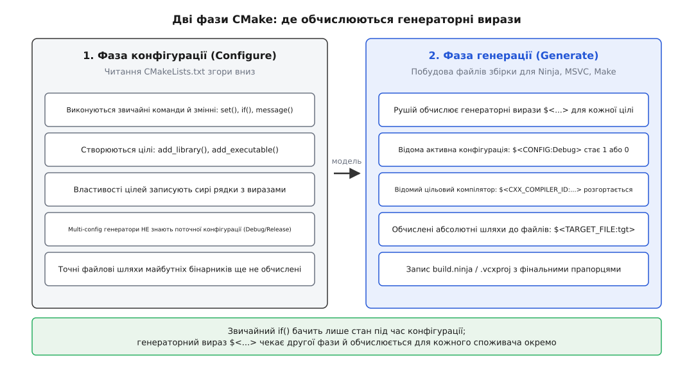
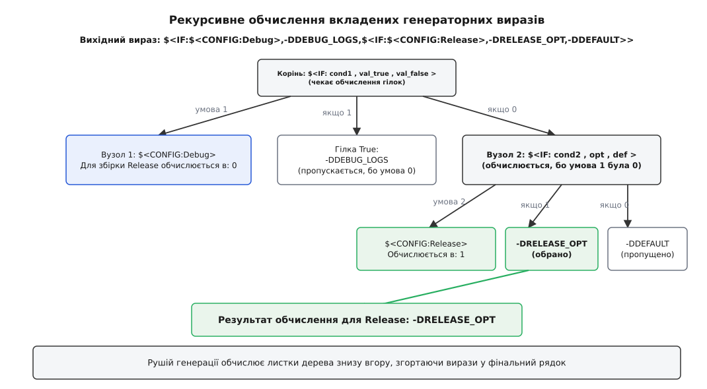
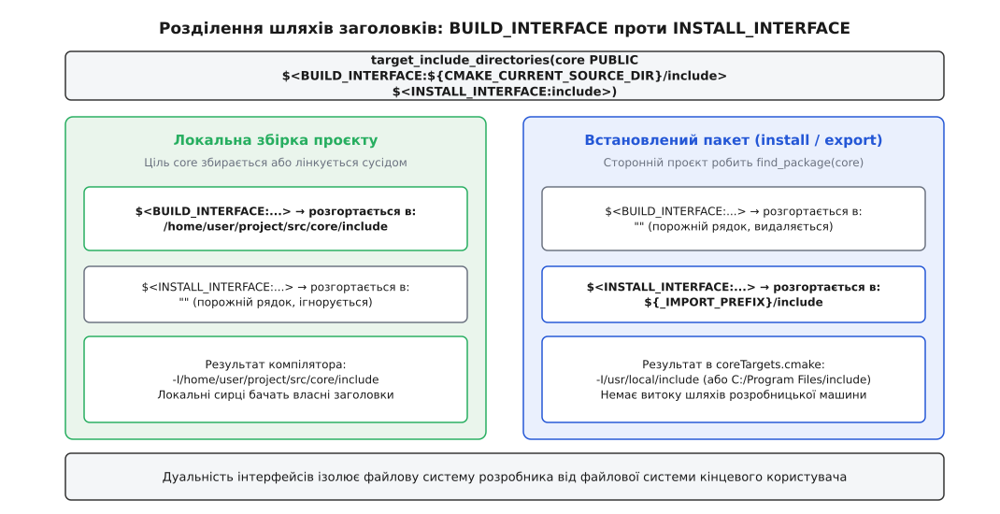
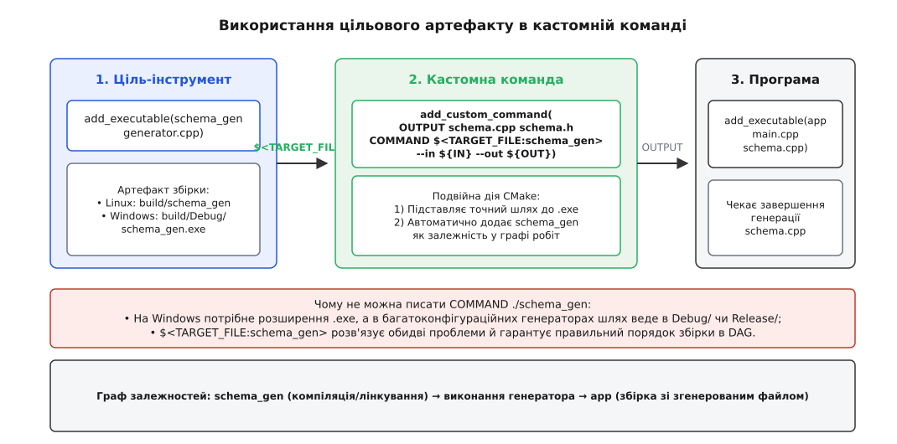

# Генераторні вирази: рішення, відкладене до генерації

<preknowlist>
- [Мова CMakeLists](root:sys-bsystem/cmake-language) — значення в CMake є рядками, команди виконуються послідовно під час конфігурації, а змінні мають блочну або каталожну область видимості.
- [Цілі й властивості замість глобальних змінних](root:sys-bsystem/targets-and-properties) — модель цілей зберігає налаштування компіляції та лінкування у властивостях і поширює їх через вимоги вжитку (`PUBLIC`, `PRIVATE`, `INTERFACE`).
- [Конфігурація, генерація і збірка](root:sys-bsystem/configure-and-generate) — CMake спершу виконує сценарії й будує абстрактну модель у пам'яті, потім генерує низькорівневі файли для Ninja чи Visual Studio, і лише після цього тулчейн компілює джерела.
- [Компіляція](root:sf-lang/compilation) — стадії перетворення сирцевого коду на об'єктні файли, розрізнення прапорців мови та рівнів оптимізації.
- [Лінкування](root:sf-lang/linking) — збирання об'єктних файлів та бібліотек у кінцевий бінарний файл, робота з таблицями символів та шляхами пошуку.
</preknowlist>

Спроба налаштувати різні прапорці компілятора для налагоджувальної та релізної збірки через звичайну перевірку у файлі `CMakeLists.txt` виглядає просто:

```cmake
if(CMAKE_BUILD_TYPE STREQUAL "Debug")
    target_compile_definitions(core PRIVATE DEBUG_LOGS=1)
    target_compile_options(core PRIVATE -O0 -g)
else()
    target_compile_definitions(core PRIVATE NDEBUG=1)
    target_compile_options(core PRIVATE -O3)
endif()
```

На Linux із генератором Ninja або Makefiles такий код створює враження робочого, якщо передати параметр `-DCMAKE_BUILD_TYPE=Debug`. Проте щойно цей проєкт відкривають у середовищі Visual Studio на Windows (`cmake -G "Visual Studio 17 2022"`) або Xcode на macOS, поведінка ламається: змінна `CMAKE_BUILD_TYPE` під час читання сценарію виявляється цілком порожньою. Увесь проєкт завжди конфігурується за гілкою `else`, а перемикач конфігурацій `Debug` / `Release` всередині IDE ніяк не впливає на прапорці компіляції.

Причина полягає у фундаментальній різниці між одноконфігураційними та багатоконфігураційними генераторами. Утиліти Make та Ninja вимагають окремого каталогу збірки на кожен тип збірки (`build-debug`, `build-release`), тому тип фіксується на самому початку. Середовища Visual Studio та Xcode, навпаки, створюють одне спільне дерево проєкту (файл `.sln` або `.xcodeproj`), у якому всі типи збірки існують одночасно. Розробник вибирає між `Debug` та `Release` у спадному списку редактора або передає параметр `--config Release` команді `cmake --build` вже **після** того, як CMake повністю завершив роботу.

Подібна прірва виникає і в інших типових ситуаціях. Якщо бібліотека створює допоміжну утиліту для генерації коду, точний шлях до скомпільованого двійкового файлу цієї утиліти неможливо знати заздалегідь: на Windows виконуваний файл має суфікс `.exe` і лежить у підкаталозі `Debug/`, на macOS — без суфікса в корені збірки, а за крос-компіляції інструмент взагалі може збиратися окремим хостовим компілятором. Так само шлях до заголовних файлів бібліотеки має бути одним (`${CMAKE_CURRENT_SOURCE_DIR}/include`) під час збірки власного дерева, але зовсім іншим (`include/` відносно каталогу встановлення), коли проєкт експортують для зовнішніх користувачів через [`find_package`](root:sys-bsystem/find-package).

Жодна класична змінна CMake і жоден блок `if()` не здатні подолати цю розбіжність, оскільки вони діють лише в момент первинного читання сценаріїв.

## Дві фази роботи CMake та потреба у відкладених рішеннях

Робота CMake чітко розділена на два послідовні моменти часу: фазу конфігурації (англ. *configure phase*) та фазу генерації (англ. *generate phase*).

Під час фази конфігурації CMake інтерпретує файли `CMakeLists.txt` згори вниз. У цей момент створюються змінні, виконуються цикли, спрацьовують функції `find_package()`, створюються об'єкти цілей за допомогою `add_library()` чи `add_executable()`, а їхні властивості наповнюються значеннями. Коли останній рядок останнього сценарію виконано, фаза конфігурації завершується. На цьому етапі вся інформація про змінні каталогу та блочні області видимості знищується — у пам'яті залишається лише побудована об'єктна модель цілей та їхніх властивостей.

Під час наступної фази — генерації — CMake бере готову модель із пам'яті й записує низькорівневі маніфести для обраної системи збірки (`build.ninja`, файли `.vcxproj` для MSVC чи `Makefile`). Саме тут обчислюються кінцеві залежності графа, визначаються точні шляхи до цільових артефактів та формуються командні рядки компілятора й лінкера для кожної цілі та кожної можливої конфігурації.



*Фаза конфігурації будує об'єктну модель у пам'яті, де властивості зберігають сирі рядки виразів; фаза генерації розгортає вирази окремо для кожної цільової конфігурації та кожного споживача.*

Оскільки звичайний `if()` обчислюється виключно на першій фазі, він не має доступу до даних, які виникають лише на другій. Для передачі рішень крізь межу фаз потрібен механізм запису відкладених правил. Такий запис зберігається у властивості цілі як звичайний текстовий рядок під час конфігурації, а на фазі генерації рушій CMake інтерпретує його та підставляє конкретні значення.

Цей механізм називається **генераторними виразами** (англ. *generator expressions*, загальноприйняте скорочення — *genex*). У синтаксисі CMake генераторний вираз завжди огортається у спеціальну конструкцію вигляду `$<...>`.

## Синтаксис і машина обчислення

Синтаксис генераторного виразу нагадує виклик функції або макросу, укладений у знак долара та кутові дужки:

```cmake
$<КЛЮЧОВЕ_СЛОВО>
$<КЛЮЧОВЕ_СЛОВО:аргумент>
$<КЛЮЧОВЕ_СЛОВО:арг1,арг2,...>
```

Розділювачем аргументів усередині виразу завжди є кома `,`. Пробіли навколо ком та двокрапки є значущими і входять до складу значень аргументів, тому їх ставлять лише тоді, коли пробіл дійсно має стати частиною результату.

Машина обчислення генераторних виразів працює як рекурсивний інтерпретатор рядків. Коли генератор формує прапорці компіляції для конкретного вихідного файлу чи команди лінкування, він бере вихідний рядок властивості (наприклад, `COMPILE_OPTIONS`) і шукає в ньому фрагменти `$<...>`. Виявлені вирази розгортаються зсередини назовні: спершу обчислюються найбільш глибоко вкладені вирази-листки, їхні результати передаються батьківським виразам, і так триває доти, доки весь вираз не перетвориться на підсумковий рядок або порожнечу.



*Дерево обчислення розгортається знизу вгору: рушій генерації спершу обчислює умови листків, відкидає неактивні гілки та підставляє обране значення у фінальний прапорець.*

Усі генераторні вирази повертають текст. За результатом обчислення вирази поділяються на два класи:

1. **Інформаційні вирази** — витягують інформацію про середовище, компілятор чи цілі й повертають конкретний непорожній рядок (наприклад, `$<CONFIG>` повертає `"Debug"`, а `$<TARGET_FILE:app>` повертає `"/path/to/build/app.exe"`).
2. **Логічні та умовні вирази** — виконують булеві перевірки (`0` або `1`) або фільтрують вміст. Якщо умова виразу є хибною, умовний вираз розгортається в **порожній рядок** `""`.

Властивості цілей у CMake (наприклад, `COMPILE_OPTIONS`, `INCLUDE_DIRECTORIES`, `COMPILE_DEFINITIONS`) зберігають списки у вигляді рядків із розділювачем «крапка з комою» `;`. Коли генераторний вираз у списку розгортається в порожній рядок `""`, рушій CMake автоматично усуває цей порожній елемент, не залишаючи зайвих пробілів чи порожніх аргументів у командному рядку компілятора.

## Логічні та умовні вирази: булева алгебра генерації

Фундаментом відкладеної логіки є умовне включення рядка за схемою «умова-значення»:

```cmake
$<умова:значення>
```

Якщо `умова` після обчислення перетворюється на символ `1`, увесь вираз замінюється на `значення`. Якщо `умова` перетворюється на `0`, вираз перетворюється на порожній рядок `""` і зникає з підсумкових налаштувань.

Пряма форма перевірки умови з'явилася в CMake 3.8 у вигляді класичного тримісного оператора:

```cmake
$<IF:умова,значення_якщо_істина,значення_якщо_хиба>
```

Якщо умова дорівнює `1`, повертається другий аргумент; якщо `0` — третій. Якщо умовна конструкція має складніший вибір між кількома варіантами, вирази `$<IF:...>` вкладають один в один, утворюючи каскадне розгалуження.

### Оцінка істинності: вираз `$<BOOL:...>`

У мові CMake поняття істинності рядків має свої правила: рядок може вважатися хибним, якщо він порожній або містить `0`, `OFF`, `NO`, `FALSE`, `N`, `IGNORE` чи закінчується на `-NOTFOUND`. Проте всередині генераторних виразів оператори очікують строго числові символи `1` або `0`.

Для узгодження звичайних змінних CMake із синтаксисом генераторних виразів існує оператор приведення до булевого типу:

```cmake
$<BOOL:${ENABLE_OPTIMIZATIONS}>
```

Якщо змінна `${ENABLE_OPTIMIZATIONS}` містить `ON`, `TRUE`, `1` або будь-який непорожній рядок, окрім списку хибних значень, `$<BOOL:...>` повертає `1`. Якщо змінна містить `OFF`, `FALSE`, `0` або не визначена взагалі, повертається `0`.

Це дає змогу безпечно прокидати користувацькі опції з конфігурації у властивості цілей:

```cmake
option(ENABLE_PROFILING "Увімкнути прапорці профілювання" OFF)

target_compile_definitions(core PRIVATE
    $<$<BOOL:${ENABLE_PROFILING}>:ENABLE_TRACING=1>
)
```

Якщо користувач викликає CMake з `-DENABLE_PROFILING=ON`, вираз розгортається у `ENABLE_TRACING=1`. Якщо опція вимкнена, вираз зникає.

### Логічні зв'язки та оператори порівняння

Генераторні вирази підтримують повний набір операторів булевої алгебри, що приймають аргументи через кому:

* `$<NOT:умова>` — інвертує результат: перетворює `1` на `0`, а `0` на `1`.
* `$<AND:умова1,умова2,...>` — логічне «І»: повертає `1` лише тоді, коли всі аргументи дорівнюють `1`.
* `$<OR:умова1,умова2,...>` — логічне «АБО»: повертає `1`, якщо хоча б один аргумент дорівнює `1`.

Для порівняння значень використовуються спеціалізовані предикати:

* `$<STREQUAL:рядок1,рядок2>` — повертає `1`, якщо рядки посимвольно збігаються (регістр значущий), інакше `0`.
* `$<EQUAL:число1,число2>` — числове порівняння цілих чисел.
* `$<IN_LIST:елемент,список>` — перевіряє входження елемента до списку, розділеного крапками з комою (доступно з версії CMake 3.12).
* `$<VERSION_LESS:v1,v2>`, `$<VERSION_GREATER:v1,v2>`, `$<VERSION_EQUAL:v1,v2>` — порівняння версій за правилами семантичного версіонування (наприклад, `3.28.1` та `3.20`).
* `$<FILTER:список,INCLUDE|EXCLUDE,регулярний_вираз>` — фільтрація елементів списку за регулярним виразом під час генерації (з версії CMake 3.15).

Комбінація цих операторів дозволяє будувати складні умови будь-якої глибини:

```cmake
# Увімкнути перевірку лише для збірок Clang на Linux у режимі Debug
target_compile_options(engine PRIVATE
    $<$<AND:$<PLATFORM_ID:Linux>,$<CXX_COMPILER_ID:Clang>,$<CONFIG:Debug>>:-fsanitize=memory>
)
```

## Конфігураційні вирази та властивості середовища

Група конфігураційних виразів відповідає за аналіз оточення, в якому фактично відбуватиметься збірка кожної цілі.

### Аналіз конфігурації збірки

* `$<CONFIG:назва>` — перевіряє, чи збігається поточна активна конфігурація із вказаною назвою. Порівняння нечутливе до регістру літер (`$<CONFIG:Debug>` та `$<CONFIG:DEBUG>` еквівалентні). Вираз приймає список назв через кому: `$<CONFIG:Debug,RelWithDebInfo>` повертає `1`, якщо активна будь-яка з цих двох конфігурацій.
* `$<CONFIG>` — інформаційний вираз без аргументів, що розгортається в точний рядок назви поточної конфігурації (`Debug`, `Release`, `MinSizeRel` тощо).

Цей вираз є головним засобом роботи з каталогами виходу для артефактів:

```cmake
# Створення окремого каталогу під плагіни для кожної конфігурації
set_target_properties(my_plugin PROPERTIES
    LIBRARY_OUTPUT_DIRECTORY "${CMAKE_BINARY_DIR}/plugins/$<CONFIG>"
)
```

У проєктах із нестандартними конфігураціями (наприклад, коли через `CMAKE_CONFIGURATION_TYPES` додано профіль `ASan` або `Profile`), вираз `$<CONFIG:ASan>` автоматично масштабується на будь-які імена конфігурацій без жодних змін у сценаріях CMakeLists.

### Аналіз компілятора та операційної системи

Під час компіляції одного проєкту різні вихідні файли можуть збиратися різними компіляторами або під різні цільові платформи. Для їх розрізнення існують відповідні вирази:

* `$<PLATFORM_ID:назва>` — повертає `1`, якщо цільова платформа збігається з назвою (`Linux`, `Windows`, `Darwin`, `Android`).
* `$<C_COMPILER_ID:назва>`, `$<CXX_COMPILER_ID:назва>` — перевіряє ідентифікатор компілятора для відповідної мови (`GNU`, `Clang`, `AppleClang`, `MSVC`, `IntelLLVM`). Підтримує перелік через кому: `$<CXX_COMPILER_ID:GNU,Clang,AppleClang>`.
* `$<C_COMPILER_VERSION:версія>`, `$<CXX_COMPILER_VERSION:версія>` — повертає точний номер версії компілятора або перевіряє відповідність.

### Розрізнення мов компіляції: вираз `$<COMPILE_LANGUAGE:...>`

У сучасних проєктах C++ одна ціль нерідко містить вихідні файли кількох різних мов: джерела C++ (`.cpp`), джерела чистого C (`.c`), асемблерні вставки (`.s`) або код ядер GPU (`.cu`).

Якщо додати прапорець стандарту C++ безпосередньо через `target_compile_options(core PRIVATE -std=c++20)`, компілятор видасть фатальну помилку під час спроби скомпілювати файл `.c`, оскільки прапорець `-std=c++20` для мови C не існує.

Для ізоляції прапорців за типами файлів використовується вираз `$<COMPILE_LANGUAGE:мова>`:

```cmake
target_compile_options(core PRIVATE
    $<$<COMPILE_LANGUAGE:CXX>:-std=c++20>
    $<$<COMPILE_LANGUAGE:C>:-std=c17>
)
```

Вираз `$<COMPILE_LANGUAGE:CXX>` розгортається в `1` тільки тоді, коли компілятор обробляє файл вихідного коду C++. Під час обробки файлу C він стає `0`, і несумісний прапорець повністю вилучається з командного рядка.

Починаючи з версії CMake 3.15, перевірку мови та сімейства компілятора об'єднано у вираз `$<COMPILE_LANG_AND_ID:мова,ідентифікатор>`:

```cmake
target_compile_options(core PRIVATE
    $<$<COMPILE_LANG_AND_ID:CXX,GNU,Clang>:-Wall -Wextra -Wpedantic>
    $<$<COMPILE_LANG_AND_ID:CXX,MSVC>:/W4 /permissive->
)
```

Такий запис є коротшим, читабельнішим та усуває необхідність громіздкого комбінування `$<AND:$<COMPILE_LANGUAGE:...>,$<CXX_COMPILER_ID:...>>`.

## Цільові та інформаційні вирази: запити до графа збірки

Цільові генераторні вирази дозволяють отримувати дані про будь-які цілі проєкту безпосередньо з графа збірки, не покладаючись на жорстко закодовані імена файлів чи припущення про структуру каталогів.

### Отримання файлових артефактів цілі

Коли CMake збирає ціль, підсумковий файл отримує специфічне для платформи ім'я (префікс `lib` у Unix, розширення `.dll` або `.exe` у Windows, версійні суфікси у спільних бібліотеках). Для отримання цих шляхів існує родина виразів `$<TARGET_FILE:...>`:

* `$<TARGET_FILE:ціль>` — абсолютний повний шлях до головного бінарного артефакту цілі (виконуваного файлу, `.so`, `.dylib` або `.dll`).
* `$<TARGET_FILE_NAME:ціль>` — лише ім'я файлу з розширенням без каталогу (наприклад, `libengine.so.1.2`).
* `$<TARGET_FILE_DIR:ціль>` — каталог, у якому лежить результуючий бінарний файл.
* `$<TARGET_FILE_BASE_NAME:ціль>` — базове ім'я файлу без префікса та суфікса (з версії CMake 3.15).
* `$<TARGET_FILE_SUFFIX:ціль>` — суфікс артефакту (наприклад, `.exe` або `.so`).
* `$<TARGET_LINKER_FILE:ціль>` — шлях до файлу, який використовується лінкером для зв'язування з цією ціллю. На Linux це сама бібліотека `.so`, а на Windows для цілі типу `SHARED_LIBRARY` це імпортна бібліотека `.lib` (тоді як `$<TARGET_FILE:...>` вказує на сам `.dll`).
* `$<TARGET_SONAME_FILE:ціль>` — для спільних бібліотек на платформах ELF повертає файл із системним іменем `soname` (наприклад, `libengine.so.1`).
* `$<TARGET_PDB_FILE:ціль>` — шлях до файлу налагоджувальних символів `.pdb` для компілятора MSVC.

### Читання властивостей цілі: `$<TARGET_PROPERTY:...>`

Вираз `$<TARGET_PROPERTY:ціль,властивість>` читає значення вказаної властивості з цілі на фазі генерації. На відміну від команди конфігурації `get_target_property()`, генераторний вираз повертає значення з **уже розгорнутими** іншими генераторними виразами та з урахуванням транзитивних вимог вжитку споживача:

```cmake
# Витягнути список каталогів включення бібліотеки graphics
$<TARGET_PROPERTY:graphics,INTERFACE_INCLUDE_DIRECTORIES>
```

Вираз має також компактну одномісну форму:

```cmake
$<TARGET_PROPERTY:властивість>
```

В одномісній формі властивість зчитується з **поточної цілі**, для якої в цей момент обчислюється генераторний вираз. Це корисно для створення універсальних інтерфейсних бібліотек, що налаштовують прапорці на основі характеристик цілі-споживача.

Додатково вираз `$<TARGET_NAME_IF_EXISTS:ціль>` повертає ім'я цілі, якщо вона зареєстрована в моделі проєкту, або порожній рядок, якщо цілі немає. Це запобігає фатальним помилкам конфігурації у випадках, коли зв'язування з певною бібліотекою є опціональним.

### Маніпуляції зі списками та подвійне обчислення

* `$<JOIN:список,розділювач>` — склеює елементи списку в один суцільний рядок за допомогою вказаного розділювача:
  ```cmake
  # Формування значення для змінної середовища PATH зі списку каталогів
  $<JOIN:$<TARGET_PROPERTY:app,INCLUDE_DIRECTORIES>,:>
  ```
* `$<LOWER_CASE:рядок>`, `$<UPPER_CASE:рядок>` — перетворення регістру символів.
* `$<GENEX_EVAL:вираз>` та `$<TARGET_GENEX_EVAL:ціль,вираз>` (з версії CMake 3.12) — виконують подвійне розгортання (англ. *evaluation*). Якщо властивість цілі сама містить генераторні вирази всередині свого значення, звичайне зчитування поверне їх як сирий текст; огортання у `$<GENEX_EVAL:...>` змушує рушій виконати другий прохід інтерпретації.

Починаючи з версії CMake 3.27, з'явилося сімейство виразів `$<LIST:...>`, яке дозволяє повноцінно трансформувати списки під час генерації:

* `$<LIST:APPEND,список,елемент...>` — додає елементи до списку;
* `$<LIST:INSERT,список,індекс,елемент...>` — вставляє елементи за вказаним індексом;
* `$<LIST:REMOVE_ITEM,список,елемент...>` — вилучає входження елементів;
* `$<LIST:SUBLIST,список,початок,довжина>` — виділяє зріз списку;
* `$<LIST:TRANSFORM,список,ДІЯ,...>` — застосовує перетворення до кожного елемента (наприклад, додає префікс або суфікс).

Раніше подібні дії можна було робити лише на фазі конфігурації командою `list()`. Вирази `$<LIST:...>` дозволяють маніпулювати списками, які стають відомими лише на фазі генерації як результат обчислення властивостей інших цілей.

## Управління транзитивністю та режимами лінкування

Модель цілей CMake поширює залежності транзитивно: якщо бібліотека `A` зв'язується з бібліотекою `B` через `PUBLIC`, будь-яка програма `app`, яка лінкується з `A`, автоматично отримує шляхи включення та прапорці компіляції бібліотеки `B`. Проте в системному програмуванні нерідко виникає потреба тонкого керування тим, які саме частини залежності передаються далі.

### Ізоляція транзитивних інтерфейсів: `$<LINK_ONLY:...>`

Припустимо, що спільна бібліотека `network_core` всередині використовує статичну бібліотеку `internal_crypto`. Бібліотека `network_core` повністю приховує реалізацію криптографії у своїх бінарних символах і не надає жодних заголовків `internal_crypto` назовні.

Якщо записати:

```cmake
target_link_libraries(network_core PUBLIC internal_crypto)
```

то всі споживачі `network_core` отримають у свої прапорці компіляції шляхи до внутрішніх заголовків `internal_crypto`. Якщо ж записати `PRIVATE`, то при побудові статичних версій бібліотеки або під час експорту статичного графа лінкер споживача не дізнається, що йому потрібно приєднати символи `internal_crypto.a`.

Для розв'язання цієї суперечності існує вираз `$<LINK_ONLY:ціль>`:

```cmake
target_link_libraries(network_core INTERFACE
    $<LINK_ONLY:internal_crypto>
)
```

Вираз `$<LINK_ONLY:...>` додає ціль до списку лінкування бінарного артефакту споживача, але **повністю блокує** транзитивне поширення її властивостей `INTERFACE_INCLUDE_DIRECTORIES`, `INTERFACE_COMPILE_DEFINITIONS` та `INTERFACE_COMPILE_OPTIONS`. Споживач успішно лінкується з бінарником, не бачачи чужих внутрішніх заголовків.

### Тонкий контроль компонування: `$<LINK_LIBRARY:...>` та `$<LINK_GROUP:...>`

Починаючи з версії CMake 3.24, з'явилися вирази для керування низькорівневою поведінкою компонувальника:

* `$<LINK_LIBRARY:ознака,бібліотека>` — застосовує спеціальний режим зв'язування. Наприклад, ознака `WHOLE_ARCHIVE` примушує лінкер включити абсолютно всі об'єктні файли зі статичного архіву (навіть якщо вони не викликаються явно з `main`), що критично для систем плагінів із самореєстрацією:
  ```cmake
  target_link_libraries(app PRIVATE
      $<LINK_LIBRARY:WHOLE_ARCHIVE,my_plugins>
  )
  ```
  CMake автоматично розгортає це у відповідні прапорці платформи: `--whole-archive ... --no-whole-archive` на Linux або `/WHOLEARCHIVE:...` на MSVC.
* `$<LINK_GROUP:ознака,бібліотека1,бібліотека2,...>` — групує кілька бібліотек для розв'язання циклічних залежностей між статичними архівами через `RESCAN` (`--start-group ... --end-group` на GNU ld) без ручного підбору прапорців.

### Умовне підключення системних залежностей

Генераторні вирази дозволяють описувати системні та платформові бібліотеки декларативно прямо в тілі цілі:

```cmake
target_link_libraries(network_core PUBLIC
    $<$<PLATFORM_ID:Windows>:ws2_32 iphlpapi>
    $<$<PLATFORM_ID:Linux>:pthread dl>
)
```

Такий підхід набагато надійніший за глобальні розгалуження `if(WIN32)`, тому що він прикріплює вимоги безпосередньо до інтерфейсу цілі `network_core`. Якщо сторонній підпроєкт підключає `network_core` на Windows, бібліотека сокетів `ws2_32` приєднається автоматично на фазі генерації.

## Вирішення фундаментальних практичних задач

Генераторні вирази перетворюють складні системні вимоги на компактні та надійні декларативні конструкції. Розглянемо три головні архітектурні задачі сучасного CMake.

### Задача 1: Розділення простору збірки та інсталяції

Коли бібліотека розробляється всередині власного репозиторію, її заголовні файли лежать у каталозі вихідного коду (наприклад, `${CMAKE_CURRENT_SOURCE_DIR}/include`). Проте після інсталяції пакета командою `install()` або під час пакування через [CPack](root:sys-bsystem/cpack) файли переміщуються у стандартну системну теку `${CMAKE_INSTALL_PREFIX}/include`.

Якщо передати у вимоги вжитку абсолютний шлях джерел:

```cmake
target_include_directories(core PUBLIC ${CMAKE_CURRENT_SOURCE_DIR}/include)
```

то експорт цілі через `install(EXPORT ...)` завершиться помилкою: CMake забороняє витік локальних абсолютних шляхів машини розробника у встановлені файли конфігурації пакетів (політика `CMP0022`), оскільки на машині кінцевого користувача каталогу `/home/developer/...` не існує.

Правильне вирішення полягає у використанні пари ізолюючих виразів:

* `$<BUILD_INTERFACE:...>` — вміст активний лише тоді, коли ціль збирається всередині поточного дерева проєкту або використовується сусідніми підпроєктами.
* `$<INSTALL_INTERFACE:...>` — вміст активний лише у згенерованих файлах експорту для зовнішніх користувачів після встановлення.

```cmake
target_include_directories(core PUBLIC
    $<BUILD_INTERFACE:${CMAKE_CURRENT_SOURCE_DIR}/include>
    $<INSTALL_INTERFACE:include>
)
```



*Під час внутрішньої збірки працює локальний шлях джерел; під час встановлення та експорту CMake підставляє відносний шлях у системний каталог.*

Під час збірки проєкту вираз `$<INSTALL_INTERFACE:include>` розгортається в порожнечу й відкидається. Коли ж CMake формує файл `coreTargets.cmake` для команди `install()`, вираз `$<BUILD_INTERFACE:...>` стирається, а `$<INSTALL_INTERFACE:include>` перетворюється на коректний шлях відносно кореня встановлення.

### Задача 2: Крос-компіляторні набори попереджень без глобальних `if(MSVC)`

Традиційний підхід із розгалуженням `if(MSVC) ... else()` на рівні каталогу забруднює глобальний стан і не враховує транзитивність налаштувань. Сучасна практика CMake передбачає створення інтерфейсної цілі для керування прапорцями компіляції.

Створимо ціль `project_warnings`, яка автоматично налаштовує суворі попередження для компіляторів GCC, Clang та MSVC, враховуючи стандарти та типи збірки:

```cmake
add_library(project_warnings INTERFACE)

target_compile_options(project_warnings INTERFACE
    # Прапорці для компіляторів сімейства Clang та GCC
    $<$<COMPILE_LANG_AND_ID:CXX,Clang,AppleClang,GNU>:
        -Wall
        -Wextra
        -Wpedantic
        -Wconversion
        -Wshadow
        -Wnon-virtual-dtor
        $<$<CONFIG:Debug>:-Og -g3>
        $<$<CONFIG:Release>:-O3>
    >
    # Прапорці для компілятора Microsoft Visual C++
    $<$<COMPILE_LANG_AND_ID:CXX,MSVC>:
        /W4
        /permissive-
        /w14242 # Попередження про неявне звуження типів
        /w14254
        $<$<CONFIG:Debug>:/Od /Zi>
        $<$<CONFIG:Release>:/O2>
    >
)
```

Тепер будь-яка ціль проєкту підключає ці налаштування одним викликом:

```cmake
target_link_libraries(my_service PRIVATE project_warnings)
```

Код самих програм на C та C++ залишається чистим від специфічних макросів компілятора:

:::tabs
```c
#include <stdio.h>
#include <stdint.h>

int main(void) {
    uint32_t counter = 100;
    printf("Сервіс запущено, лічильник: %u\n", counter);
    return 0;
}
```
```cpp
#include <iostream>
#include <cstdint>

int main() {
    uint32_t counter = 100;
    std::cout << "Сервіс запущено, лічильник: " << counter << '\n';
    return 0;
}
```
:::

Прапорці компіляції додаються адресно: C++-файли отримують специфічні для C++ діагностики, файли C залишаються без несумісних ключів, а режим збірки (`Debug` чи `Release`) вибирається автоматично незалежно від того, чи збірка запущена в Linux-терміналі, чи у Visual Studio.

### Задача 3: Кодогенерація: запуск власного інструмента у `add_custom_command`

Частим завданням є збірка власної службової утиліти (наприклад, генератора вихідного коду зі схем JSON чи Protobuf), яка повинна виконатися під час збірки для створення коду основної програми.

Якщо записати виклик інструмента через звичайний рядок:

```cmake
# Помилковий підхід:
add_custom_command(
    OUTPUT "${CMAKE_CURRENT_BINARY_DIR}/generated.cpp"
    COMMAND ./schema_compiler --in schema.json --out generated.cpp
)
```

такий код зламається на Windows (де потрібне ім'я `schema_compiler.exe`), зламається у Visual Studio (де файл потрапить у каталог `Debug/schema_compiler.exe`) і призведе до стану гонитви, оскільки система збірки не знає, що `schema_compiler` треба скомпілювати **до** виконання кастомної команди.

Вираз `$<TARGET_FILE:...>` вирішує всі три проблеми одночасно:

```cmake
# Створення цілі-інструмента
add_executable(schema_compiler tools/schema_compiler.cpp)

# Генерація файлу за допомогою скомпільованого інструмента
add_custom_command(
    OUTPUT "${CMAKE_CURRENT_BINARY_DIR}/generated_schema.cpp"
           "${CMAKE_CURRENT_BINARY_DIR}/generated_schema.h"
    COMMAND $<TARGET_FILE:schema_compiler>
            --input "${CMAKE_CURRENT_SOURCE_DIR}/schema.json"
            --out-source "${CMAKE_CURRENT_BINARY_DIR}/generated_schema.cpp"
            --out-header "${CMAKE_CURRENT_BINARY_DIR}/generated_schema.h"
    DEPENDS schema_compiler "${CMAKE_CURRENT_SOURCE_DIR}/schema.json"
    WORKING_DIRECTORY "${CMAKE_CURRENT_BINARY_DIR}"
    COMMENT "Генерація коду моделі даних через schema_compiler"
    VERBATIM
)

# Основна програма, що споживає згенерований код
add_executable(app
    src/main.cpp
    "${CMAKE_CURRENT_BINARY_DIR}/generated_schema.cpp"
)

target_include_directories(app PRIVATE
    "${CMAKE_CURRENT_BINARY_DIR}"
)
```



*Вираз TARGET_FILE повертає точний виконуваний файл для активної конфігурації та автоматично інтегрує ціль у граф залежностей.*

Коли CMake бачить вираз `$<TARGET_FILE:schema_compiler>` у блоці `COMMAND` команди `add_custom_command`, він виконує дві дії:

1. Підставляє платформозалежний повний шлях до бінарного файлу з урахуванням підкаталогів поточної конфігурації (`Debug/schema_compiler.exe` або `build/schema_compiler`).
2. Автоматично додає цільову залежність у граф виконання (DAG): генератор гарантує, що утиліта `schema_compiler` буде повністю скомпільована та злінкована до того, як розпочнеться виконання команди генерації.

Вихідні файли інструмента та програми можуть бути написані як на C, так і на C++:

:::tabs
```c
/* tools/schema_compiler.c */
#include <stdio.h>

int main(int argc, char* argv[]) {
    if (argc < 5) return 1;
    FILE* f = fopen(argv[4], "w");
    if (!f) return 1;
    fprintf(f, "/* Автоматично згенерований C-файл */\n");
    fprintf(f, "const char* get_schema_version(void) { return \"1.0.0\"; }\n");
    fclose(f);
    return 0;
}
```
```cpp
// tools/schema_compiler.cpp
#include <iostream>
#include <fstream>
#include <string_view>

int main(int argc, char* argv[]) {
    if (argc < 5) return 1;
    std::ofstream out(argv[4]);
    if (!out) return 1;
    out << "// Автоматично згенерований C++-файл\n";
    out << "#include <string_view>\n";
    out << "std::string_view getSchemaVersion() noexcept { return \"1.0.0\"; }\n";
    return 0;
}
```
:::

## Пастки, синтаксичні конфлікти та налагодження

Робота з генераторними виразами має підводні камені, пов'язані з інтерпретацією синтаксису та розділенням обов'язків між фазами.

### Пастка 1: Використання генераторного виразу у звичайному `if()`

Найпоширеніша помилка розробників, які тільки починають працювати з генераторними виразами, — спроба передати вираз у класичну команду `if()`:

```cmake
# ФАТАЛЬНА ПОМИЛКА:
if($<CONFIG:Debug>)
    message(STATUS "Це режим налагодження!")
endif()
```

Цей код завжди друкуватиме повідомлення «Це режим налагодження!», навіть якщо збірка виконується для конфігурації `Release`.

Причина полягає в тому, що команда `if()` виконується на фазі конфігурації. У цей момент вираз `$<CONFIG:Debug>` ще не обчислюється — для команди `if()` він є звичайним текстовим літералом із чотирнадцяти символів. За правилами мови CMake будь-який непорожній рядок, що не збігається з ключовими словами `0`, `OFF`, `FALSE` чи `NO`, інтерпретується як логічна істина (`TRUE`).

> 🔧 **Правило вибору:**
> * Якщо рішення впливає на саму структуру сценарію (створення цілей через `add_library()`, виклики `find_package()`, підключення підкаталогів `add_subdirectory()`) — використовується класичний `if()` зі змінними конфігурації;
> * Якщо рішення стосується налаштувань уже створеної цілі (прапорці, дефайни, шляхи включення, залежності лінкування), які залежать від конфігурації збірки чи компілятора — використовується генераторний вираз `$<...>`.

### Пастка 2: Спеціальні символи: коми, крапки з комою та кутові дужки

Оскільки кома `,` слугує розділювачем аргументів усередині `$<?>`, передача прапорця, що сам містить кому, призводить до розриву виразу:

```cmake
# Помилка: кома після -rpath сприймається як розділювач генераторного виразу
target_link_options(app PRIVATE
    $<$<PLATFORM_ID:Linux>:-Wl,-rpath,$ORIGIN/../lib>
)
```

Для передачі літеральних спеціальних символів CMake надає набір екрануючих генераторних виразів:

* `$<COMMA>` — розгортається у символ коми `,`;
* `$<SEMICOLON>` — розгортається у символ крапки з комою `;`, не розбиваючи рядок на окремі елементи списку;
* `$<ANGLE-R>` — розгортається у праву кутову дужку `>`, дозволяючи вкладати закриваючі дужки в аргументи макросів чи шаблонів.

Виправлений приклад із використанням `$<COMMA>`:

```cmake
target_link_options(app PRIVATE
    $<$<PLATFORM_ID:Linux>:-Wl$<COMMA>-rpath$<COMMA>$ORIGIN/../lib>
)
```

Починаючи з версії CMake 3.12, для прапорців лінкера з комами краще використовувати префікс `LINKER:`, який CMake розгортає самостійно: `target_link_options(app PRIVATE "LINKER:-rpath,$ORIGIN/../lib")`.

### Методи діагностики та налагодження

Оскільки генераторні вирази не існують на фазі конфігурації, стандартна команда `message(STATUS "${MY_PROP}")` не розгортає вираз, а друкує його сирий вихідний код.

Для діагностики та перевірки розгортання виразів застосовують три надійні методи.

#### 1. Генерація діагностичного файлу через `file(GENERATE ...)`

Команда `file(GENERATE ...)` — єдина файлова команда CMake, яка виконується на фазі генерації і повністю розгортає всі вказані генераторні вирази окремо для кожної цільової конфігурації:

```cmake
file(GENERATE
    OUTPUT "${CMAKE_CURRENT_BINARY_DIR}/genex_diag_$<CONFIG>.txt"
    CONTENT "Активна конфігурація: $<CONFIG>
Платформа: $<PLATFORM_ID>
Компілятор CXX: $<CXX_COMPILER_ID> версії $<CXX_COMPILER_VERSION>
Файл артефакту core: $<TARGET_FILE:core>
Прапорці компіляції: $<TARGET_PROPERTY:core,COMPILE_OPTIONS>
Каталоги включення: $<TARGET_PROPERTY:core,INCLUDE_DIRECTORIES>
"
)
```

Після генерації у каталозі збірки з'являться окремі файли `genex_diag_Debug.txt` та `genex_diag_Release.txt`, де можна побачити точний кінцевий вигляд усіх розгорнутих рядків.

#### 2. Аудит файлів системи збірки

Остаточним джерелом істини є згенеровані файли низькорівневої системи:

* У разі використання **Ninja**: файл `build.ninja` містить явні команди запуску компілятора з усіма розгорнутими прапорцями;
* У разі використання **Visual Studio**: файл проєкту `.vcxproj` містить XML-теги `<ClCompile><AdditionalOptions>`, де записані розгорнуті прапорці для кожної конфігурації;
* Файл **`compile_commands.json`**: генерація бази даних компіляції (`set(CMAKE_EXPORT_COMPILE_COMMANDS ON)`) створює JSON-список точних команд компілятора для кожного `.cpp`-файлу (працює з генераторами Ninja та Make).

#### 3. Трасування виконання: `--trace-expand`

Запуск CMake з прапорцем `cmake -B build --trace-expand` виводить у термінал повне покрокове розгортання всіх змінних та викликів функцій під час конфігурації, що допомагає виявити некоректно сформовані сирі рядки генераторних виразів до їх передачі генератору.

## Де дозволені та де заборонені генераторні вирази

Генераторні вирази не є універсальною заміною змінних — вони підтримуються лише тими командами та контекстами, які спеціально спроєктовані для відкладеного обчислення.

### Контексти, де генераторні вирази дозволені

| Контекст / Команда | Властивості та аргументи | Типове застосування |
| --- | --- | --- |
| `target_compile_definitions()` | `COMPILE_DEFINITIONS`, `INTERFACE_COMPILE_DEFINITIONS` | Умовні макроси під тип збірки чи платформу |
| `target_compile_options()` | `COMPILE_OPTIONS`, `INTERFACE_COMPILE_OPTIONS` | Прапорці оптимізації, попередження компілятора |
| `target_compile_features()` | `COMPILE_FEATURES`, `INTERFACE_COMPILE_FEATURES` | Вимоги стандартів C++ залежно від конфігурації |
| `target_include_directories()` | `INCLUDE_DIRECTORIES`, `INTERFACE_INCLUDE_DIRECTORIES` | `BUILD_INTERFACE` проти `INSTALL_INTERFACE` |
| `target_sources()` | `SOURCES`, `INTERFACE_SOURCES` | Підключення вихідних файлів під платформу чи тест |
| `target_link_libraries()` | `LINK_LIBRARIES`, `INTERFACE_LINK_LIBRARIES` | Умовне лінкування бібліотек (наприклад, ASan, Winsock) |
| `target_link_options()` | `LINK_OPTIONS`, `INTERFACE_LINK_OPTIONS` | Прапорці лінкера (`-rpath`, субсистеми Windows) |
| `target_precompile_headers()`| `PRECOMPILE_HEADERS` | Попередньо скомпільовані заголовки для C++ |
| `add_custom_command()` | `COMMAND`, `DEPENDS`, `OUTPUT`, `WORKING_DIRECTORY` | Запуск згенерованих утиліт через `$<TARGET_FILE>` |
| `add_custom_target()` | `COMMAND`, `WORKING_DIRECTORY`, `DEPENDS` | Спеціальні сценарії запуску та упаковки |
| `file(GENERATE ...)` | `OUTPUT`, `INPUT`, `CONTENT`, `CONDITION` | Створення конфігураційних файлів на фазі генерації |
| `install(TARGETS / FILES)` | `DESTINATION`, `FILES`, `RENAME` | Платформозалежні правила інсталяції |
| `add_test()` | `COMMAND`, `WORKING_DIRECTORY` | Запуск тестових бінарників із правильними шляхами |

### Контексти, де генераторні вирази суворо заборонені

Використання виразів `$<...>` у таких місцях є фатальною помилкою або ігнорується:

* **Імена цілей при створенні:** `add_executable($<...>)`, `add_library($<...>)` — імена цілей мають бути фіксованими ідентифікаторами на фазі конфігурації для побудови внутрішнього графа цілей.
* **Підключення сценаріїв:** `include($<...>)`, `find_package($<...>)`, `add_subdirectory($<...>)` — файлова структура проєкту повинна бути повністю визначена під час первинного читання.
* **Керування потоком конфігурації:** `if($<...>)`, `while($<...>)`, `foreach($<...>)` — мовні конструкції циклів та умов CMake не вміють заглядати у фазу генерації.
* **Присвоєння змінних:** `set(VAR $<...>)` не обчислює вираз у змінну `VAR`, а лише записує туди сирий текст `"$<...>"`.
* **Оголошення проєкту:** `project($<...>)`, `cmake_minimum_required($<...>)`.

Генераторні вирази забезпечують чисте розділення обов'язків: вони залишають фазі конфігурації керування високорівневою структурою репозиторію, а всі деталі компіляторів, платформ, артефактів та конфігурацій збірки передають фазі генерації, гарантуючи коректну та відтворювану роботу проєкту в будь-якому середовищі.
