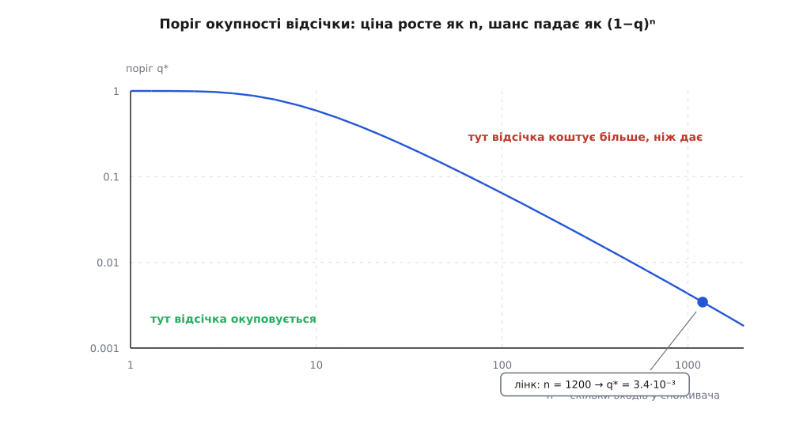
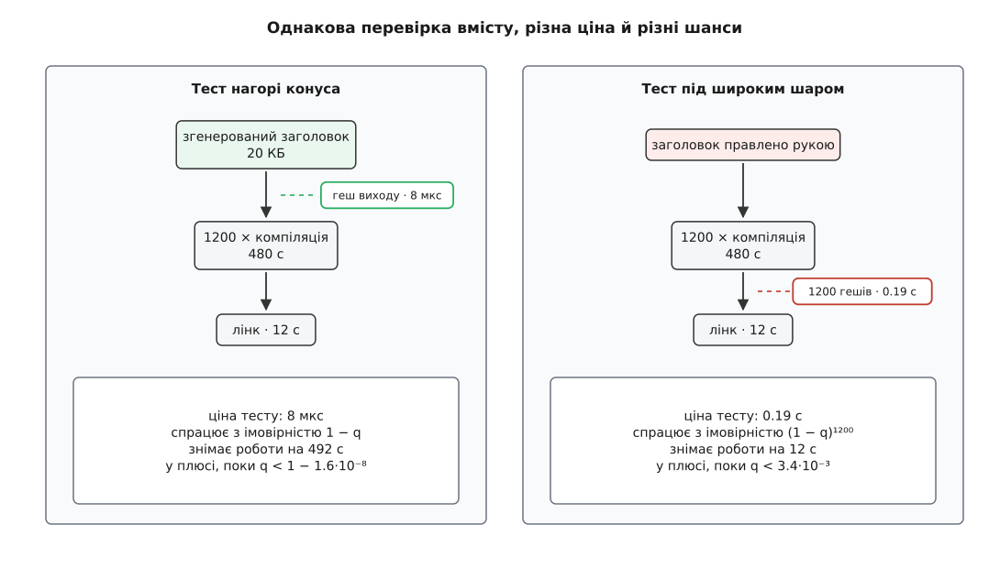

# 🧮 Коли рання відсічка окупається

Відсічка виглядає дармовою: звірили байти щойно зробленого виходу зі старими, вміст той самий — і сотні задач нижче по графу зникли з плану. Але звіряти доводиться після **кожної** виконаної задачі, а зникає робота лише інколи. Отже, це угода з двома половинами, і в неї є поріг. Порахуймо обидві половини: скільки роботи відсічка знімає і скільки коштує сама.

## Дві бухгалтерії однієї правки

Правка зачіпає множину джерел Δ. Множина робіт — нащадки Δ у графі залежностей: `A = R(Δ) \ Δ`. Її розмір визначений однозначно й не залежить від того, скільки в проєкті файлів узагалі, — це показано в сусідній вставці про [ціну однієї зміни](topic:sys-bsystem/build-system-role/math-rebuild-cost.md), звідти ж узято й усі числа моделі.

Без відсічки виконують рівно `|A|` задач. Завжди, за будь-якої правки, незалежно від того, чим вона виявиться: система не має підстав зупинитися раніше, бо єдина її ознака застарілості — «вхід новіший», а вхід перероблено, тож новіший він у всіх.

З відсічкою число виконаних задач стає **випадковою величиною**. Введімо одну ймовірність:

```
q = P(вміст виходу справді змінився | задачу виконано)
```

Тобто виконана задача з імовірністю `q` дає інші байти — і тоді її споживачі стають брудними; з імовірністю `1 − q` вихід збігся побайтово, і хвиля на ній обривається. Події на різних вершинах вважаємо незалежними — де це припущення ламається, розберемо наприкінці.

## Ланцюг: сума геометричної прогресії

Найпростіший граф — ланцюг завдовжки `D`: джерело → перша задача → друга → … Перша задача виконується завжди (її вхід правила людина). Друга — лише якщо перша дала інший вміст, тобто з імовірністю `q`. Третя — з імовірністю `q²`. Очікуване число виконаних задач — сума [геометричної прогресії](topic:math-analysis/geometric-series):

```
             D−1
E[N]  =  Σ  q^k  =  (1 − q^D) / (1 − q)  ≤  1 / (1 − q)
            k=0
```

Праворуч у межі немає `D`. Хоч би яким довгим був ланцюг, очікувана робота впирається в стелю `1/(1 − q)`: при `q = 0.5` це дві задачі, при `q = 0.2` — одна й чверть. Без відсічки в тому самому ланцюгу виконали б усі `D`.

```
                D = 10     D = 100     без відсічки
q = 0.9          6.51        10.0        D
q = 0.5          2.00         2.00       D
q = 0.2          1.25         1.25       D
q = 0.05         1.05         1.05       D
```

Прочитайте таблицю по рядках. Уже при `q = 0.5` десятикратне видовження ланцюга не додає нічого: сума збіглася. Виграш відсічки дорівнює `D·(1 − q)` разів і росте з глибиною — саме тому вона потрібна там, де стадії ланцюжком, а не там, де їх дві.

Розмір самої випадкової величини теж варто знати. Число виконаних задач у нескінченному ланцюзі має [геометричний розподіл](topic:math-probability/geometric-distribution) — той, що описує, скільки спроб триває серія до першої невдачі:

```
P(N = k) = q^{k−1}·(1 − q),   E[N] = 1/(1 − q),   Var[N] = q/(1 − q)²
σ/E[N] = √q
```

Відносний розкид дорівнює `√q` і завжди більший за сам `q`. При `q = 0.5` середнє — дві задачі, а відхилення — 1.41: типова збірка коротка, зате хвіст важкий. Досвід «зазвичай кілька файлів, а іноді пів проєкту» — це не примха системи, а форма цього розподілу.

## Шаруватий граф: коли хвиля згасає

Тепер граф, у якому кожна вершина має `b` споживачів, і всього `D` шарів. Кожна виконана задача з імовірністю `q` пускає далі всіх своїх `b` нащадків, тож середнє число «живих» нащадків однієї задачі дорівнює `m = q·b`, а очікувані розміри шарів утворюють ту саму прогресію зі знаменником `m`:

```
E[N] = Σ m^k,  k = 0…D          |R(Δ)| = Σ b^k,  k = 0…D

m < 1  (q < 1/b):  E[N] ≤ 1/(1 − m)     обмежене, глибина не входить
m = 1  (q = 1/b):  E[N] = D + 1          лінійне
m > 1  (q > 1/b):  E[N] ≈ m^D/(m − 1)    експоненційне, як і сам конус
```

Поріг `q* = 1/b` — критерій вимирання [процесу розгалуження](topic:math-probability/branching-process): популяція, у якій кожен лишає в середньому менш ніж одного нащадка, гасне за скінченне число поколінь. Числа для `b = 3`, `D = 8`, де повний конус — 9841 задача:

```
q = 1.0    9841       (це і є «без відсічки»)
q = 0.9    4485
q = 0.5      74.9
q = 1/3       9.0
q = 0.3       6.13
q = 0.2       2.47
```

Зверніть увагу, що навіть при `q = 0.9` відсічка зрізає більш ніж удвічі, хоч і не рятує від експоненти: вона міняє **основу** експоненти з `b` на `m`, і лише перехід через `1/b` міняє характер залежності. Поки `q` помітно менша за `1/b`, очікувана робота обмежена числом, у якому немає ні `D`, ні `|V|`, — тобто вона не залежить від розміру проєкту взагалі.

## Але конус C++ не глибокий, а широкий

Тепер прикладімо це до справжнього графа проєкту на C++. Заголовок → об'єктні файли → лінк: `D = 2`. Не десять шарів, не сто — два. А розгалуження `b` дорівнює числу одиниць трансляції, що включають заголовок: у моделі це 1200.

```
m = q·b = 1200·q  →  m < 1 лише при q < 8.3·10⁻⁴
```

Тобто вся асимптотика згасання тут не працює: за будь-якої мислимої `q` хвиля з першого ж шару розгортається в повний конус. Виграш відсічки в такому графі живе не в затуханні, а рівно в одному місці — на **нульовому шарі**. Або вона спрацювала на самому заголовку, і тоді знято всі 492 с, або не спрацювала, і тоді знято майже нічого. Проміжних станів плаский граф не пропонує.

## Скільки коштує сам тест

Дві сім'ї доказів дають дві різні ціни.

**Повторний `stat` виходу** (так робить ninja за позначкою `restat` на правилі: після виконання команди він знову дивиться на мітки часу виходів і викреслює зі списку тих, чиї мітки не зрушили). Один виклик — близько 2 мкс. Дешевше нікуди, але ця перевірка бачить лише те, що інструмент **утримався від запису**; компілятор пише свій `.o` завжди, тож на правилах компіляції вона дає рівно нуль виграшу за свої 2 мкс. Тому `restat` і зроблено позначкою на окремому правилі, а не режимом усієї збірки.

**Геш вмісту виходу** — [криптографічна гешфункція](topic:sf-security/cryptographic-hash) від байтів файлу. Ціна лінійна за розміром: BLAKE3 на одному ядрі дає близько 3 ГБ/с, SHA-256 з апаратним прискоренням — помітно менше. Візьмімо робочі 2.5 ГБ/с:

```
заголовок 20 КБ    h = 0.02 МБ / 2500 МБ/с   = 8 мкс
об'єктний 400 КБ   h = 0.4 МБ / 2500 МБ/с    = 0.16 мс
```

Ці числа чесні лише тоді, коли файл щойно записали й він ще в [кеші сторінок](topic:sys-unix/page-cache-durability) — тоді геш читає з пам'яті. На холодному чи мережевому сховищі платить не гешування, а читання: 150 МБ/с замість 2500 роблять ту саму перевірку в шістнадцять разів дорожчою.

## Поріг

Тепер зведімо. Ключова асиметрія в тому, що ціну тесту платять **на кожному** виході, а виграш приходить лише тоді, коли задача нижче справді не запуститься, — а вона не запуститься, тільки якщо **всі** її входи вийшли незмінними. Отже, для споживача з `n` входами, під яким висить робота на `C` секунд, треба порівнювати ціну `n` тестів із виграшем, помноженим на ймовірність того, що збіглися всі `n`:

```
(1 − q)ⁿ · C  >  n · h

q*  =  1 − (n·h / C)^(1/n)  ≈  ln( C / (n·h) ) / n     для великих n
```

Ціна росте лінійно за `n`, а шанс — падає експоненційно. Поріг спадає обернено до `n`, ще й із логарифмічною поправкою, що тягне його нижче:

```
n = 1      q* = 1 − 1.3·10⁻⁵     (майже завжди варто)
n = 10     q* = 0.59
n = 100    q* = 0.064
n = 1200   q* = 3.4·10⁻³
```



*При одному вході відсічка виправдана майже завжди; під вузлом із тисячею входів вона окуповується лише за ймовірності зміни в частки відсотка.*

Число `3.4·10⁻³` варто прочитати вголос: щоб гешування 1200 об'єктних файлів заради пропуску лінка себе виправдало, побайтово інакшим має виходити менш ніж один перезібраний `.o` із трьохсот. На холодному сховищі, де самі 480 МБ читаються 3.2 с, поріг падає ще втричі — до `1.1·10⁻³`.

## Числа на моделі

**Модель:** 3000 одиниць трансляції, компіляція `τ = 0.4 с`, лінк `λ = 12 с`, заголовок включено в 40% одиниць — конус це 1200 компіляцій плюс лінк, разом `W = 492 с`.



*Ліворуч тест коштує вісім мікросекунд і знімає вісім хвилин роботи; праворуч він коштує в двадцять із гаком тисяч разів більше й знімає дванадцять секунд.*

```
Випадок 1 — заголовок генерують щозбірки, вміст зазвичай той самий
  ціна тесту          8 мкс
  q₀ = 0.02:  E[W] = 0.02 · 492 с              = 9.8 с
  без відсічки                                 = 492 с
  виграш                                         у 50 разів

Випадок 2 — правка коментаря в рукописному заголовку
  q₀ = 1 за побудовою — байти заголовка інші, нульовий шар не рятує
  1200 компіляцій виконано                     = 480 с
  об'єктні збіглися (q₁ ≈ 0) → лінк пропущено
  виграш 12 с ціною 1200 · 0.16 мс = 0.19 с      2.4% від збірки

Випадок 3 — справжня зміна оголошення
  q₁ близька до одиниці, (1 − q₁)¹²⁰⁰ ≈ 0
  геші 1200 виходів                            = 0.19 с чистих втрат
  частка від збірки                            = 0.04%
```

Три випадки дають три різні присуди тій самій перевірці, і різниця між ними не в тому, наскільки добре її реалізовано, а в тому, **де в конусі** вона стоїть і **яка `q` на цьому шарі**. Нагорі конуса `q` мала (генератор на трохи інших входах часто видає той самий текст), а `C` величезна — виграш безумовний. Під широким шаром `q` близька до одиниці, `C` мала, а множник `n` — тисяча: збиток гарантований, хоч і мізерний.

## Де модель бреше

Незалежність подій — найслабше місце цієї арифметики, і ламається вона систематично в один бік. Правку в заголовок роблять **навмисне**: якщо додали оголошення, то хоч одна одиниця трансляції ним і скористається, інакше правки не було б. Отже, подія «жоден із 1200 виходів не змінився» має ймовірність не `(1 − q)¹²⁰⁰`, а точний нуль. Формула `(1 − q)ⁿ` описує зміни **побічні** — перегенерацію, перемикання гілок туди й назад, переформатування, — і саме там відсічка виграє. Там, де зміну зробили навмисне, вона програє завжди.

Друге спрощення — одна `q` на весь граф. Насправді це властивість шару, ще й стрибкувата: на переході «джерело → об'єктний файл» правка коду дає `q ≈ 1`, а правка коментаря, що не зрушила нумерацію рядків, — `q ≈ 0`. Останнє застереження не декоративне: з налагоджувальними символами `.o` містить номери рядків, тож доданий порожній рядок у заголовку робить інакшими всі 1200 виходів, а виправлений усередині наявного рядка коментар — жодного.

> 🔧 **Навіщо це.** Вмикайте перевірку вмісту вибірково — там, де під вершиною висить конус, а вершина одна: згенеровані заголовки, файли з прапорцями компіляції, виходи кодогенераторів. Там поріг `q* = 1 − h/C` практично недосяжний, і тест окупається завжди. Не чекайте нічого від тієї самої перевірки на широкому шарі перед лінком чи архівом: щоб вона спрацювала, мусять збігтися всі `n` виходів одночасно, а `q` свого шару легко зміряти за журналом збірки — це частка перезібраних файлів, чий геш таки змінився. Якщо вона не в районі одиниць на тисячу, тести під широким шаром просто марнують час.
