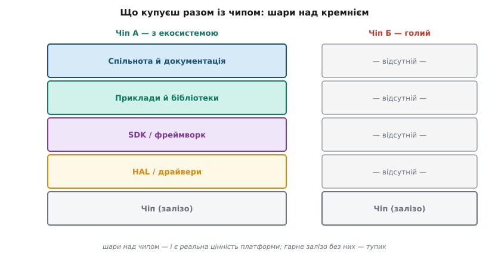
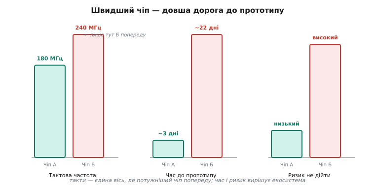

# Екосистема МК

Коли обирають мікроконтролер, спокуса велика: зіставити такти, кількість каналів периферії, мікроампери сну — і взяти того, хто виграв таблицю характеристик. Але виріб частіше виграє або гине не на залізі, а на **екосистемі** — усьому, що виробник і спільнота наклали зверху на кремній, щоб ним можна було користуватися. Саме сюди йде час інженера, а він коштує дорожче за центи різниці в ціні чипа.

Спершу варто побачити, що екосистема — це не одна річ, а **стос шарів**, кожен з яких або є, або його доводиться будувати самотужки. Знизу лежить **тулчейн** (*toolchain* — «ланцюг інструментів»): компілятор, лінкер, утиліти прошивання й налагодження для саме цієї архітектури ядра. Вище — **SDK** (*software development kit*, «набір для розробки») і **HAL** (*hardware abstraction layer*, [шар абстракції заліза](root:embedded/baremetal-vs-framework)): код, що ховає сирі регістри периферії за іменованими функціями. Ще вище — **драйвери** конкретних мікросхем, **бібліотеки** протоколів, готові **приклади**. А навколо всього — **спільнота**: люди на форумах, у репозиторіях, у питаннях-відповідях, які вже наступили на ті граблі, що чекають на тебе.



*Що насправді купуєш разом із чипом: над голим кремнієм лежить стос шарів, і кожен або вже готовий, або його доведеться писати самому.*

## Чому шари важать більше за такти

Розглянемо, що означає кожен шар у годинах роботи. Готовий I²C-драйвер потрібного датчика, який компілюється з першого разу, — це тижні зекономленого часу замість читання даташита й відлагодження таймінгів шини. Зрілий SDK означає, що ввімкнути Wi-Fi чи [файлову систему у Flash](topic:sf-data/flash-filesystems) — це виклик однієї функції, а не місяць портування чужого стеку. Активний форум означає, що на дивну помилку лінкера хтось уже відповів, і відповідь знайдеться за хвилину, а не за тиждень самотніх спроб.

Той самий компроміс [«голе залізо проти фреймворку»](root:embedded/baremetal-vs-framework) — ціна абстракції — постає тут уже як критерій вибору чипа. Потужніший чип із бідним SDK програє слабшому з відмінним, бо різницю в кілька десятків мегагерц користувач виробу ніколи не помітить, а різницю в півроку до випуску — помітить одразу. Тактова частота показує, **як швидко** чип рахує; екосистема визначає, **чи дійдеш ти** до того, щоб він узагалі щось рахував у твоєму виробі.

Є й шар, що тягнеться далеко за межі прототипу, — **довговічність** усього стосу. Виріб живе роками: знайдеться вразливість у Wi-Fi-стеку, з'явиться новіша ревізія чипа, заміниться датчик. Якщо SDK активно супроводжують, виправлення приходить оновленням, яке збирається без переписування. Якщо ж екосистема покинута, ти лишаєшся сам-на-сам зі старим кодом і вимушено мусиш або заморозити версії назавжди, або портувати все наново. Тому питання «чи житиме цей SDK через три роки» — не другорядне: воно про те, скільки коштуватиме виріб не на старті, а впродовж усього свого життя.

> 🔧 **Навіщо це.** Перш ніж захоплюватися мегагерцами нового чипа, постав п'ять питань, відповідь на кожне з яких коштує тижнів: чи є приклад, що читає саме цей датчик саме цим чипом; чи є драйвер потрібного BLE-профілю; чи хтось у форумі вже відповів, коли застрягнеш; чи можна прошити з командного рядка, чи потрібен окремий програматор; чи житиме цей SDK через три роки. Часто ці п'ять відповідей вирішують більше, ніж уся таблиця в даташиті.

## Worked-приклад: дві дороги до того самого пристрою

Уявімо задачу: читати I²C-датчик температури й слати значення по UART. Два кандидати — чип А із сильною екосистемою та чип Б, що технічно потужніший. Зведемо їх не за рекламними цифрами, а за реальною ціною шляху до робочого прототипу:

```
Критерій                  Чіп А (екосистема)        Чіп Б (потужніший)
──────────────────────────────────────────────────────────────────────────
Тактова частота           180 МГц                   240 МГц     ← Б «виграє»
Документація              повна, ~600 стор.         часткова, ~200 стор.
Драйвер I²C + датчик      готовий, компілюється     писати з нуля
Приклади у відкритих репо  сотні                     одиниці
Спільнота                 активна, відповідь <1 доба   мало питань, мало відповідей
Прошивання                USB drag-and-drop         окремий програматор
──────────────────────────────────────────────────────────────────────────
Час до прототипу (оцінка)  ~2-3 дні                  ~3-4 тижні
Ризик застрягти           низький                   середній-високий
```

Чип Б швидший за тактами. Але дорога до результату на ньому в десять разів довша, і на кожному кроці є ризик упертися в незадокументовану периферію без жодної підказки ззовні. Тому кращий вибір — чип А: різниця в 60 МГц не варта трьох тижнів роботи й ризику взагалі не довести виріб.



*Тактова частота — єдина вісь, де потужніший чип попереду; за часом до прототипу й ризиком незавершення вирішує екосистема.*

## Живий приклад: чому переміг світ ESP32 і Arduino

Це не умоглядна теза — її добре видно на тому, чому [ESP32](topic:hw-arch/esp32-architecture) і світ Arduino так перемогли, попри те що ядро тут не [Cortex-M](topic:hw-arch/cortex-m), а тактами вони нікого не вражали. Перемогли вони не мегагерцами, а екосистемою: безкоштовний і зрілий SDK ESP-IDF, бібліотека практично для будь-якого популярного датчика, гори прикладів, величезна спільнота, де відповідь на питання знаходиться за хвилину.

Тут працює ефект, що сам себе підсилює. Низький поріг входу Arduino притягнув багато людей. Більше людей — більше написаних бібліотек і викладених прикладів. Більше готового матеріалу — ще нижчий поріг для наступного, тож приходить ще більше людей. Кожен оберт цього кола робить платформу привабливішою без жодної зміни в залізі, і конкуренту з кращим чипом, але порожньою спільнотою, наздогнати цей розрив украй важко: він мусив би відтворити не одну мікросхему, а роки накопиченого чужого коду й досвіду. Саме тому, обираючи чип, варто дивитися не лише на сьогоднішню таблицю, а й на те, у який бік це коло крутиться — росте спільнота чи згасає.

Корисно бачити й конкретні цеглини сучасних екосистем, бо саме їхня зрілість і вирішує. На рівні **тулчейна й керування пакетами** є PlatformIO — надбудова, що зводить різні архітектури, плати й бібліотеки під один командний рядок; вона ж дає **менеджер бібліотек**, який тягне залежність однією командою. У ESP-IDF є свій **реєстр компонентів** (*component registry*), у Arduino — Library Manager, у [STM32](topic:hw-arch/stm32) — генератор коду STM32CubeMX, що сам розкладає тактування й периферію. Усе це — інфраструктура, якої голий чип не має, і яку інакше довелося б писати самому.

> 🔧 **Навіщо це.** Зрілий менеджер пакетів і реєстр компонентів — це не зручність, а множник швидкості: чужий, уже відлагоджений драйвер дисплея чи стек MQTT під'єднується однією залежністю замість тижня власної роботи. Обираючи чип, дивись не лише на сам чип, а й на те, чи є під нього такий реєстр і наскільки він живий.

## Зворотний бік: екосистема прив'язує

У сили екосистеми є й ціна — **прив'язка** (*vendor lock-in*, «замикання на постачальника»). Код, написаний під ESP-IDF і Arduino, не перекомпілюється без змін під STM32-HAL: кожне торкання заліза прибите до конкретного API. Навіть надбудови на кшталт PlatformIO, що обіцяють єдиний код на всі платформи, неминуче відстають від рідних тулчейнів і гублять частину можливостей у перекладі — повної переносності вони не дають. Один код на різні чипи лишається радше метою, до якої наближають, ніж даністю.

Цю прив'язку можна послабити архітектурно, і це окрема інженерна навичка: відокремити бізнес-логіку від драйверів власним тонким HAL-шаром, щоб зміна платформи чіпала лише нижній рівень, а логіка лишалася незмінною. Як саме це зробити на практиці — тонка «талія» інтерфейсу плюс умовна компіляція — розібрано окремо в ⚙️ [Один код — різні МК](topic:sys-bsystem/mcu-ecosystem/proj-portability.md).

Залізо й екосистема — дві осі того самого вибору, і важити вони мають разом. Як звести їх у послідовний [метод вибору під конкретний проєкт](root:embedded/mcu-checklist) — окрема розмова.
