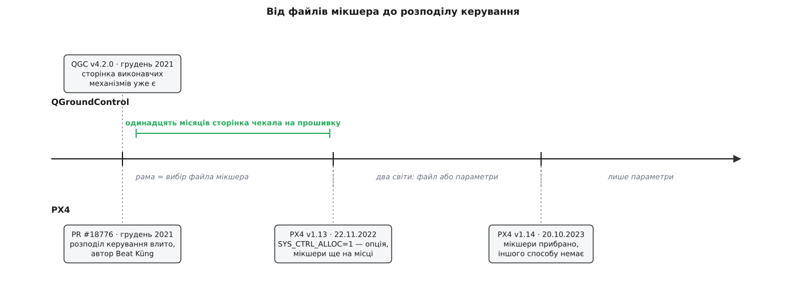

# 📜 Від файлів мікшера до розподілу керування

Десять років PX4 описував геометрію апарата текстовим файлом усередині прошивки, а вибір рами при налаштуванні означав буквально вибір одного файлу з переліку. За два випуски — v1.13 і v1.14 — цієї конструкції не стало: геометрія переїхала в звичайні параметри, файли мікшера вилучили, і разом із ними зникла можливість налаштувати апарат без наземної станції. Ось як саме це відбувалося, що змусило, і що зламалося в тих, хто оновлювався.



*Станція встигла раніше за прошивку: сторінка виконавчих механізмів вийшла в грудні 2021-го й майже рік не мала з чим працювати.*

## Рядок «R: 4x» і все, що за ним стояло

Найпростіший спосіб зрозуміти стару модель — подивитися на неї цілком. Ось повний вміст файлу `quad_x.main.mix` із прошивки версії 1.13 — того самого, який діставався звичайному квадрокоптеру в схемі «X»:

```
R: 4x

AUX1 Passthrough
M: 1
S: 3 5  10000  10000      0 -10000  10000

AUX2 Passthrough
M: 1
S: 3 6  10000  10000      0 -10000  10000

Failsafe outputs
...
Z:
Z:
```

*(Усталений факт: файл `ROMFS/px4fmu_common/mixers/quad_x.main.mix` на теґу v1.13.3, наведено дослівно з пропуском рядків коментаря.)*

Рядків, що керують моторами, тут рівно один: `R: 4x`. Літера `R` означає мультироторний мікшер, а `4x` — ключ геометрії. Усе інше в файлі стосується двох допоміжних каналів, які просто повторюють положення ручок пульта (`M:` — сумувальний мікшер, `S:` — вхід із коефіцієнтами), і двох порожніх виходів (`Z:`).

Сама геометрія лежала окремо, у файлі `quad_x.toml`, і виглядала так:

```toml
[info]
key = "4x"

[rotor_default]
direction = "CW"
axis      = [0.0, 0.0, -1.0]
Ct        = 1.0
Cm        = 0.05

[[rotors]]
name      = "front_right"
position  = [0.707107, 0.707107, 0.0]
direction = "CCW"
```

*(Усталений факт: `src/lib/mixer/MultirotorMixer/geometries/quad_x.toml`, теґ v1.13.3; наведено початок файлу.)*

Число `0.707107` — це косинус сорока п'яти градусів, тобто ротор стоїть по діагоналі на одиничному колі. Метрів тут немає й не було: документація PX4 казала про поле `position` прямо — одиниці можуть бути будь-які, бо мікшер нормалізований, важливе лише співвідношення відстаней. *(Усталений факт: цитата з посібника PX4 версії 1.13, розділ про файли геометрії.)* З цих координат генератор рахував таблицю коефіцієнтів — по одному рядку на мотор, по чотири числа на рядок (крен, тангаж, рискання, тяга), — і ця таблиця вкомпільовувалася в прошивку.

Замикався ланцюжок у файлі рами. У версії 1.12 файл `4001_quad_x` — «Generic Quadcopter» — містив рівно те, чого й очікуєш:

```sh
. ${R}etc/init.d/rc.mc_defaults

set MIXER quad_x

set PWM_OUT 1234
```

*(Усталений факт: `ROMFS/px4fmu_common/init.d/airframes/4001_quad_x`, теґ v1.12.3, наведено кінець файлу.)*

Дві змістовні команди. `set MIXER quad_x` — узяти файл `quad_x.main.mix`. `set PWM_OUT 1234` — вивести перші чотири канали на основну колодку. Ось і вся конфігурація апарата: **вибрати раму означало назвати файл**. Що робить [мікшер](root:sys-dron/motor-mixer) із бажаними моментом і тягою, було задано наперед і незмінно.

Файли жили в `ROMFS/px4fmu_common/mixers/`, тобто всередині образу прошивки, і єдиною лазівкою для сміливих була тека `/etc/mixers/` на картці пам'яті: PX4 заглядав туди першим, і покладений там файл із тим самим іменем перекривав вбудований. *(Усталений факт: задокументовано в посібнику PX4 v1.13.)*

## Чому ця модель тримала десять років

Спокуса подивитися на неї згори вниз велика, а даремно: у файловій моделі є речі, яких у параметричній немає.

Таблиця коефіцієнтів рахувалася під час збірки прошивки. На борту не було ні розбору тексту, ні перемноження матриць при старті, ні місця, де в цьому ланцюжку могло щось піти не так у польоті: мікроконтролер отримував готові числа. Файл мікшера водночас служив документацією — його можна було прочитати очима й побачити, що саме робитиме апарат, без запуску, без під'єднання, без станції.

І головне: **зіпсувати геометрію було ніяк**. Оператор не мав до неї доступу — він вибирав раму зі списку, а решта приїжджала разом із прошивкою й була такою самою, як у всіх інших власників такої самої рами. Помилка в геометрії означала помилку в репозиторії PX4, а не в чиємусь конкретному апараті. *(Реконструкція мотивів: у самих файлах і документації такої аргументації немає, це висновок із того, як модель побудована.)*

## Чотири речі, яких модель не вміла сказати

Тріщини йшли не від незручності, а від того, що клас апаратів переріс запис.

**Рама поза переліком.** Якщо гвинти зсунуті, промені різної довжини або їх п'ять замість чотирьох — потрібен новий ключ геометрії, новий `.toml`, новий `.mix` і перезбирання прошивки. Обхідний шлях через картку пам'яті існував, але вимагав писати мікшер руками у форматі, де всі коефіцієнти помножені на десять тисяч заради цілочислової арифметики.

**Роль намертво прив'язана до порядку виходу.** Вихід номер N мікшера йшов на вихід номер N колодки. Сказати «третій мотор припаяний до другого контакту допоміжної колодки» було ніде: єдиним важелем лишалося `set PWM_OUT` — груба вказівка, які канали взагалі задіяти.

**Матриця одна, а конвертоплан має їх кілька.** Це найважче. У [гібрида з нахилюваними моторами](root:ph-mechanics/vtol-transition) вісь тяги ротора під час переходу повертається — а вісь входить у розрахунок. Файл описує один незмінний стан світу; апарату ж потрібно, щоб таблиця коефіцієнтів мінялася в польоті, та ще й щоб мотори, які не нахиляються, у літаковому режимі вимикалися.

**Відмова мотора нічого не змінює.** Втратив квадрокоптер гвинт — правильна відповідь полягає в тому, щоб перерахувати розподіл на решту трьох і жертвувати рисканням. Вкомпільована таблиця такого не вміє за побудовою.

Останні дві потреби сформульовані прямо в описі роботи, з якої все й почалося.

## Грудень 2021: одна робота, що поєднала кілька ідей

Третього грудня 2021 року розробник PX4 Беат Кюнґ (Beat Küng, обліковий запис `bkueng`) відкрив зміну під назвою «Dynamic control allocation for VTOL & others» — номер 18776; влито двадцять п'ятого грудня того ж року. *(Усталений факт: дати відкриття й влиття у сховищі `PX4/PX4-Autopilot`.)*

Опис зміни називає своїми словами саме те, чого бракувало: підтримка кількох матриць у розподільнику керування; налаштування нахилу з мінімальним і максимальним кутом, яке «автоматично оновлює вісь мотора й вимикає ненахильні мотори в літаковому режимі»; опис аеродинамічних поверхонь; реверсивні мотори; окремі параметри розвороту діапазону серви; підрівнювання й обмеження швидкості ходу. І окремо — обробка відмови приводу, якої в старій схемі не було. *(Усталений факт: перелік за описом зміни 18776.)*

Зсув тут глибший за формат запису. Файл мікшера містив **наслідок** — готову таблицю коефіцієнтів. Параметри розподілу містять **причини**: де стоїть ротор, куди дивиться його вісь, скільки він дає тяги й реактивного моменту. Із причин таблицю можна перерахувати, і перерахувати не лише при ввімкненні, а й у момент, коли серва нахилу зрушила вісь або мотор перестав відповідати. Що саме з цими числами робить борт, розібрано окремо — [розподіл керування по приводах](root:sys-dron/actuator-allocation).

Плата за це прямо випливає з переїзду: причини мусить хтось назвати, і назвати числами.

## v1.13: два світи за одним параметром

PX4 v1.13 вийшов 22 листопада 2022 року, і розподіл керування був у ньому вимкнений усталено — вмикався параметром `SYS_CTRL_ALLOC=1`. *(Усталений факт: дата й опис можливості в оголошенні про випуск на px4.io; параметр — у посібнику v1.13.)*

Обидві моделі рік прожили поряд, і слід цього співжиття видно в тому самому файлі рами. У версії 1.12 «Generic Quadcopter» казав `set MIXER quad_x`; у версії 1.13 у ньому вже стоять усталені значення параметрів — `CA_ROTOR_COUNT` рівне чотирьом, `CA_ROTOR0_PX` і `CA_ROTOR0_PY` рівні 0.15, `CA_ROTOR2_KM` рівне −0.05. *(Усталений факт: вміст файлу `4001_quad_x` на теґах v1.12.3 і v1.13.3.)*

Варто зупинитися на числі 0.15. У старому `.toml` координата була 0.707107 — безрозмірна частка, з якої лишалося тільки співвідношення. Тут це п'ятнадцять сантиметрів від центра ваги, справжня довжина. Модель перестала бути схемою пропорцій і стала описом фізичного тіла — саме тому в неї згодом вміщується все те, що в пропорції не вміщувалося.

Сторінку налаштування виконавчих механізмів станція показувала лише тоді, коли параметр увімкнено. Формулювання посібника v1.13 — «вигляд *Actuators* показується, тільки якщо ввімкнено динамічний розподіл керування, який замінює файли геометрії та мікшера параметрами». *(Усталений факт: посібник PX4 v1.13, розділ про налаштування приводів.)* Тобто станція вже вміла більше, ніж прошивка усталено дозволяла.

І ще одне, чого зазвичай не роблять: у документації v1.13 стояло попередження про майбутнє — файли мікшера буде замінено параметрами розподілу керування в наступній версії. *(Усталений факт: формулювання в посібнику v1.13.)* Оголошення про зняття, що випереджає саме зняття на цілу лінію версій, — рівно те, чого вимагає [керований процес виведення з ужитку](root:sf-apps/deprecation-policy); PX4 тут зробив усе за підручником, і, як побачимо, це однаково не врятувало частину людей.

## v1.14: опція стає єдиним способом

PX4 v1.14 вийшов 20 жовтня 2023 року. Розподіл керування став усталеним, а старі мікшери прибрали. Релізні нотатки не пом'якшують формулювань: випуск містить зламні зміни для тих, хто оновлюється, і головна з них — відхід від файлів мікшера як способу задавати геометрію апарата, прив'язку моторів і приводи. *(Усталений факт: релізні нотатки PX4 v1.14.)*

Що це означало на практиці для власника апарата, який просто оновив прошивку.

**Геометрію треба підтвердити руками.** Нотатки прямо вимагають перевірити геометрію й прив'язку моторів і серв на сторінці виконавчих механізмів у QGroundControl. Не «бажано» — це пункт переліку зламних змін. Апарат після оновлення злітати не зобов'язаний.

**Рами може не бути.** Окремо застережено: якщо ви користувалися власним файлом мікшера або рама, вибрана в старій версії, у v1.14 відсутня, налаштування критично важливе. Власний мікшер не мігрує ніяк — це текст у форматі, якого більше немає; його зміст доводилося переносити в параметри руками, розуміючи, що саме там було написано.

**Усталене значення на заблокованих виходах змінилося з 900 на 1000 мікросекунд.** *(Усталений факт: перелік зламних змін v1.14.)* Дрібниця на вигляд, але це те, що подається на регулятор, доки апарат заблоковано. Хто спирався на 900 як на «гарантовано нижче за будь-який поріг запуску», отримав інше число, і перевіряти його треба на власному регуляторі. *(Реконструкція наслідку: релізні нотатки констатують зміну, не пояснюючи, кого саме вона зачепить.)*

Була й тиха втрата, яку в переліках не пишуть. Файл мікшера читався очима. Геометрія в параметрах — це кілька десятків чисел з іменами на кшталт `CA_ROTOR3_PY`, і жоден із них наодинці нічого не каже. Помилка в знаку однієї координати в старій моделі була неможлива, у новій — це один необережний символ у полі введення. Саме звідси, а не з любові до графіки, у сторінці налаштування взявся малюнок апарата згори: він існує, щоб перекласти набір чисел назад у картинку, яку людина здатна порівняти з тим, що стоїть у неї на столі.

## Чому у вимогах стоїть саме QGroundControl 4.2.0

Релізні нотатки v1.14 називають версію станції поіменно: новий інтерфейс налаштування приводів доступний у QGroundControl 4.2.0 або новішому. *(Усталений факт: релізні нотатки PX4 v1.14.)*

Теґ `v4.2.0` у сховищі станції датовано двадцятим грудня 2021 року — тим самим місяцем, коли до PX4 влили розподіл керування. *(Усталений факт із дрібним різнобоєм: дата теґа — 20 грудня, дата публікації того самого випуску на Zenodo — 21 грудня; це різниця часових поясів, а не різні події.)* Тобто сторінка з'явилася в станції за одинадцять місяців до випуску прошивки, який дозволяв її ввімкнути, і майже за два роки до випуску, який зробив її обов'язковою. Порядок тут не випадковий: можливість, яку немає чим налаштувати, ніхто не ввімкне усталено.

Наслідок цієї вимоги більший, ніж рядок у нотатках. **До v1.14 наземна станція для початкового налаштування була зручністю, після — умовою.** Раніше геометрія приїжджала разом із прошивкою, і людині лишалося вибрати раму зі списку; тепер геометрія — це порожні параметри, які хтось мусить заповнити, і засіб, який уміє заповнити їх осмислено, рівно один.

Звідси й обережність у самій побудові сторінки. Якби перелік того, що буває в апарата, жив у коді станції, стара станція з новою прошивкою була б назавжди позаду — а обов'язковість вимагає, щоб цього не траплялося. Тому опис сторінки приїжджає з борту через [підсистему відомостей про компонент](root:sys-dron/component-information): прошивка, додаючи новий тип приводу, приносить із собою і його опис.

## Що насправді переїхало

Формально змінився формат: текстовий файл замінили набором параметрів. Насправді змінилося, **коли** і **де** ухвалюють рішення про апарат.

Раніше геометрія фіксувалася під час збірки прошивки, у репозиторії PX4, силами тих, хто його веде: конкретна рама або була в переліку, або її треба було туди додати. Тепер вона фіксується під час налаштування, на столі, силами того, хто цей апарат зібрав. Прошивка перестала знати, як виглядає апарат, — вона знає лише, як із опису порахувати розподіл.

Такий обмін завжди двобічний. Пішла неможливість помилитися — прийшла можливість описати те, чого в переліку не було й не могло бути. Пішла прозорість тексту, який читаєш очима, — прийшли числа, які без інструмента нічого не означають. І саме тому сторінка налаштування виконавчих механізмів у станції не є зручним доповненням: вона є другою половиною конструкції, без якої першу не завершити. *(Реконструкція: у документації PX4 такого узагальнення немає, воно випливає зі складу зламних змін v1.14.)*
