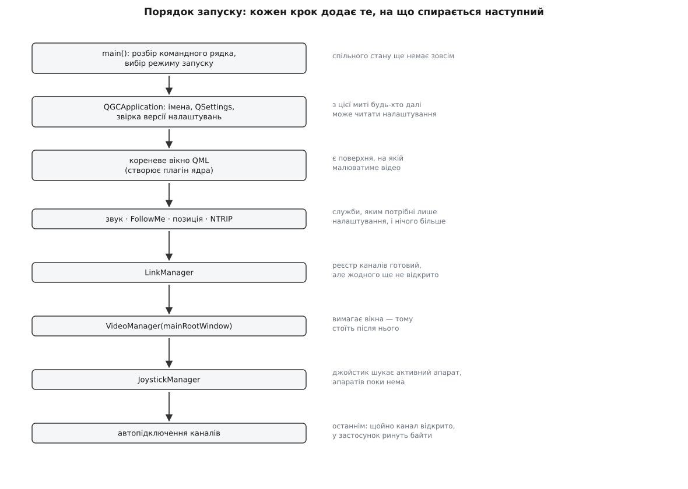
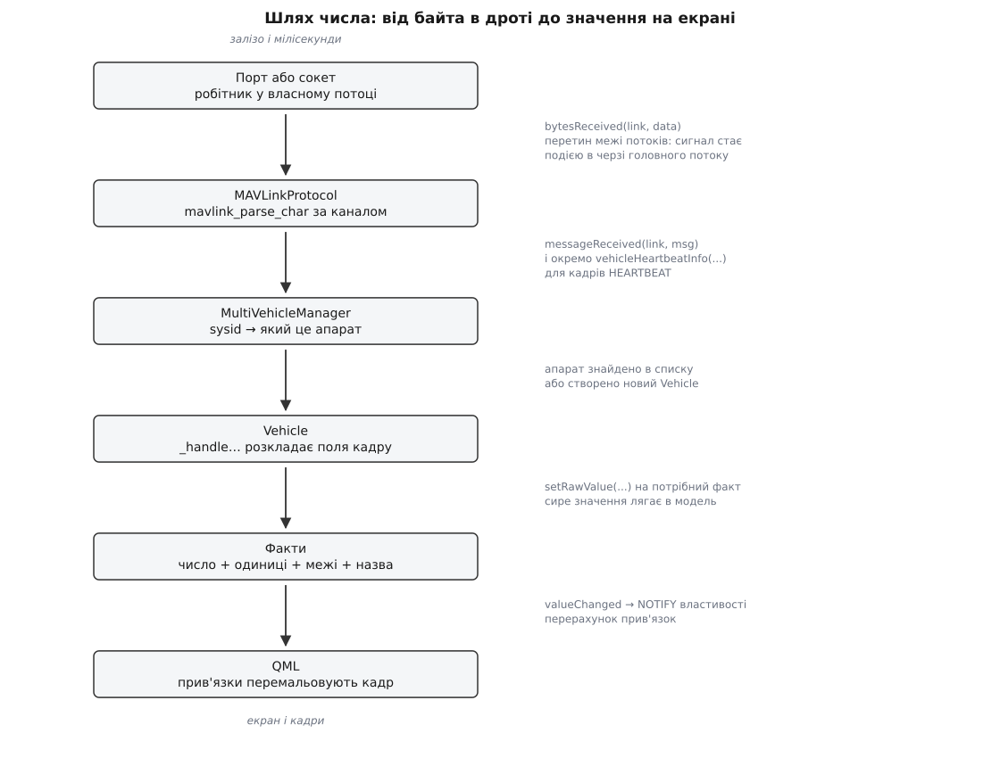
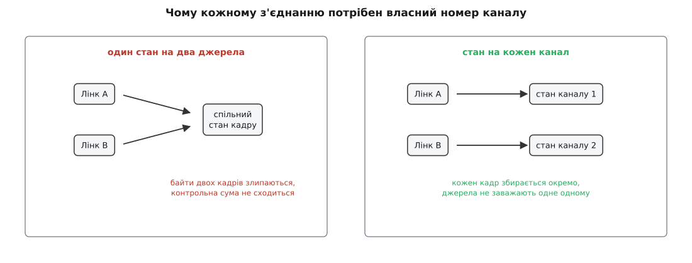

# З чого складається застосунок: шари й запуск

<preknowlist>
- [Пакет MAVLink](topic:sys-dron/mavlink-packet) — кадр із заголовком, номером повідомлення, корисним навантаженням і контрольною сумою; саме такі кадри приходять до станції.
- [Процеси й потоки](topic:sf-os/process-vs-thread) — що таке окремий потік виконання й чому довга операція в ньому не спиняє решту програми.
- [Цикл подій](topic:sf-tasks/event-loop) — черга подій і потік, який дістає їх одну за одною й викликає обробники.
- [Прив'язка даних](topic:sf-apps/data-binding) — коли вираз на екрані сам перераховується, щойно змінилося значення, від якого він залежить.
- [Шарова архітектура](topic:sf-apps/layered-architecture) — поділ програми на рівні з односпрямованими залежностями.
</preknowlist>

## Число, яке треба пояснити

На екрані наземної станції світиться висота: 42.3 м. За півсекунди до того цього числа не існувало ніде — ні в застосунку, ні в пам'яті комп'ютера. Був потік байтів, що приходив із радіомодема на послідовний порт: суцільна стрічка октетів без жодних меж і назв.

Питання «як влаштований QGroundControl» найкоротше розв'язується так: пройти шлях цього числа від байта в дроті до пікселя на екрані. Кожна зупинка на шляху — окрема підсистема застосунку, і кожна межа між зупинками — це шар. Не тому, що комусь подобається слово «шар», а тому, що на цих межах змінюється характер роботи, і код по різні боки межі змінюється з різних причин.

## Чому взагалі є межі

Уявімо станцію, написану одним суцільним шматком коду: читання порту, розбір кадрів, малювання приладів — усе перемішано. Поки апарат один і канал один, це навіть працює. Ламається воно не від складності, а від змін.

Змін є три роди, і вони незалежні одна від одної.

**Перший рід — чим ми з'єднані.** Сьогодні це USB-кабель до радіомодема, завтра — UDP через Wi-Fi до бортового комп'ютера, післязавтра — Bluetooth до пульта. Тип з'єднання [перелічений і закритий](topic:sys-dron/link-types): їх кілька, і кожен має свої налаштування й свої примхи.

**Другий рід — з ким ми говоримо.** Мультикоптер на PX4 і літак на ArduPilot присилають ті самі повідомлення MAVLink, але називають режими польоту по-різному, тримають різні параметри й вимагають різного порядку дій перед злетом.

**Третій рід — що бачить оператор.** Виробник дрона, який робить власну збірку станції, викидає половину меню, ставить свій логотип і додає сторінку для власної корисної навантаги.

Якби код був один, будь-яка зміна на будь-якій з осей чіпала б увесь застосунок. Додав новий тип каналу — поліз у код малювання приладів. Ось звідки беруться межі: **межу проводять там, де закінчується одна вісь змін**. Шар — це не «рівень абстракції» заради стрункості, а обіцянка: зміни цього роду не виходять за ці стіни.

## Запуск: хто народжується першим

Застосунок починається у `main()`. Там мало цікавого й багато потрібного: розбір командного рядка, платформні дрібниці, вибір режиму — звичайний графічний запуск, перевірка завантаження чи прогін тестів. Далі створюється головний об'єкт `QGCApplication`, і з цієї миті все відбувається всередині нього.

Конструктор `QGCApplication` робить одну річ, яка визначає все подальше: **вирішує, звідки братимуться налаштування**. Він встановлює ім'я застосунку та організації — а з них операційна система виводить шлях до файлу налаштувань; вибирає формат INI; читає збережений номер версії налаштувань і, якщо той не збігається з поточним, стирає їх усі. Останнє виглядає грубо, але альтернатива гірша: [збережений стан](topic:sys-dron/settings-persistence) від старої версії, витлумачений новим кодом, дає збої, які неможливо відтворити.

Порядок важливий саме тому, що налаштування читають усі. Служба, створена до того, як стало відомо, де лежить файл налаштувань, не змогла б прочитати ані шлях до карт, ані список збережених каналів.

Далі керування переходить до методу з довгою назвою `_initForNormalAppBoot()`, і от він — власне план застосунку, розгорнутий у лінію.



*Порядок кроків запуску — це граф залежностей, витягнутий у лінію: праворуч від кожного кроку сказано, що після нього стає можливим.*

Кроки читаються як ланцюжок причин.

Спершу створюється **кореневе вікно** з інтерфейсом. Не тому, що інтерфейс найважливіший, а тому, що відеопідсистемі потрібна поверхня, на якій малювати кадри, і цю поверхню треба мати раніше, ніж її просити.

Потім — служби, яким досить самих налаштувань: звук, режим «слідуй за мною», визначення власного місцеположення, приймання поправок RTK.

Потім — **менеджер каналів**. Він створює реєстр з'єднань, але жодного з'єднання ще не відкриває.

Потім — **відеопідсистема**, якій передають те саме кореневе вікно, і менеджер джойстиків, якому потрібен готовий список апаратів, щоб було кому слати команди.

І аж наостанок — **автопідключення каналів**. Це навмисно останній крок. Щойно перший канал відкрито, у застосунок ринуть байти, і кожен, хто мав би їх обробити, зобов'язаний уже стояти на місці. Відкрити канал раніше — означає впустити дані в напівзібраний застосунок.

> 🔧 **Навіщо це.** Коли QGroundControl падає під час старту, стек виклику майже завжди вказує на один із цих кроків. Знаючи порядок, ви одразу знаєте, що на момент падіння вже існувало, а чого ще не було, — і половина здогадок відпадає без жодного зневаджувача.

### Хто володіє цими об'єктами

Менеджер каналів у застосунку рівно один. Це не стиль, а вимога: два реєстри з'єднань, які не знають один про одного, спокійно роздадуть той самий COM-порт двічі. Те саме з реєстром налаштувань, розбирачем протоколу, списком апаратів.

Тому такі об'єкти доступні через статичний метод `X::instance()`: `LinkManager::instance()`, `SettingsManager::instance()`, `MAVLinkProtocol::instance()`. Об'єкт створюється при першому зверненні й далі живе до кінця роботи. Це [сінглтон](topic:sf-apps/singleton) — шаблон із поганою репутацією, бо він ховає залежності: дивлячись на метод, не скажеш, до чого він дотягнеться. Але створення при першому зверненні розв'язує реальну проблему — [порядок ініціалізації статичних об'єктів у C++](topic:sf-lang/cpp-static-init-order) між різними одиницями трансляції не визначений, і глобальні змінні дали б збій, який залежить від порядку файлів у команді складання.

Ця конструкція в QGroundControl не завжди була такою: [власність над глобальними об'єктами тут уже двічі змінювала форму](topic:sys-dron/app-composition/hist-toolbox.md) — від сінглтонів до спільного «ящика інструментів» і назад до сінглтонів, з інтервалом у дев'ять років.

## Станція перша: канал і межа потоків

Зібраний і запущений застосунок стоїть порожній: підсистеми є, даних немає. Наповнює його перший відкритий канал.



*Кожна стрілка — це передача між підсистемами; підпис праворуч називає те, що саме переходить межу.*

З'єднання представлене об'єктом-каналом (`LinkInterface` і його нащадки — серійний, UDP, TCP, Bluetooth). Важлива подробиця: сам об'єкт каналу **не є потоком виконання**. Він звичайний об'єкт, який живе в головному потоці разом з інтерфейсом.

А от робота з портом винесена окремо. Серійний канал тримає об'єкт-робітник і власний потік; робітник переїжджає в цей потік і саме там відкриває порт, чекає на дані й пише. Причина проста: читання й запис у порт можуть заблокуватися на невизначений час — модем не відповів, драйвер завис, кабель висмикнули. Блокований головний потік означає завмерлий інтерфейс: карта не рухається, кнопки не натискаються, система пропонує «завершити програму». Тому все, що вміє чекати, [винесене з потоку інтерфейсу](topic:sf-apps/ui-thread-offloading).

Робітник прочитав порцію байтів і повідомив про це сигналом. Оскільки відправник і отримувач у різних потоках, це повідомлення не викликає обробник напряму: воно кладеться подією в чергу головного потоку й виконається тоді, коли до нього дійде черга. Ця межа потоків — перший і найважливіший перехід у застосунку. Він дає безкоштовний буфер: якщо головний потік зайнятий важким перемальовуванням, дані не губляться, а чекають у черзі.

Далі байти отримує **менеджер каналів**. Його робота ширша, ніж здається з назви: він створює канал за збереженою конфігурацією, видає йому номер каналу розбирача, з'єднує його сигнал даних із розбирачем протоколу й веде облік живих з'єднань. [Менеджер каналів](topic:sys-dron/link-manager) також щосекунди перевіряє, чи не з'явився в системі знайомий пристрій, і сам відкриває з'єднання; невдала спроба відсуває наступну на дедалі більший інтервал, щоб застосунок не молотив портом безперервно.

## Станція друга: із стрічки байтів у кадри

Байти приходять порціями довільного розміру. Одна порція може містити півтора кадри, наступна — решту першого й ще три. Отже, потрібен [автомат, що збирає кадри зі стрічки](topic:com-protocol/stream-parser): він тримає стан «скільки байтів поточного кадру вже зібрано» і видає готовий кадр лише тоді, коли зійшлася довжина й [контрольна сума](topic:com-modulation/crc).

Розбір виглядає так — байт за байтом, без жодних припущень про межі порцій:

```c
const uint8_t chan = link->mavlinkChannel();

for (int i = 0; i < data.size(); i++) {
    mavlink_message_t message;
    mavlink_status_t  status;
    const uint8_t framing = mavlink_parse_char(chan, data[i], &message, &status);

    if (framing == MAVLINK_FRAMING_OK) {
        emit messageReceived(link, message);
    }
}
```

Ключове тут — перший рядок. Стан автомата зберігається не в об'єкті, а в таблиці, проіндексованій **номером каналу**, і номер цей належить конкретному з'єднанню.



*Ліворуч: два джерела в один стан — байти двох кадрів злипаються. Праворуч: власний стан на кожне з'єднання — кадри збираються незалежно.*

Чому інакше не можна, видно одразу. Хай станція одночасно слухає радіомодем і симулятор по UDP. Якщо обидва потоки байтів годують один автомат, то посеред напівзібраного кадру з модема прийде початок кадру із симулятора — і автомат допише чужі байти в чужий кадр. Контрольна сума не зійдеться, кадр викинуть, і зіпсуються **обидва** потоки одразу.

Тому менеджер каналів роздає номери з бітової маски вільних: береться перший вільний біт, ставиться в одиницю, номер віддається каналові; при закритті біт звільняється. Нульовий канал зарезервований, тому маска починається з одиниці. Кількість каналів у бібліотеці MAVLink скінченна — звідси природна стеля на число одночасних з'єднань станції.

Зібраний кадр не одразу вважається добрим. Розбирач розрізняє «кадр цілий» і «кадр цілий, але підпис не збігся» — [підписані кадри MAVLink v2](topic:sys-dron/mavlink-handling) проходять окрему перевірку ключем, і поведінка залежить від того, чи станція вже знає ключ. Вцілілий кадр іде далі двома сигналами: загальним «прийшло повідомлення» і окремим — для кадрів `HEARTBEAT`, бо саме вони відповідають на наступне питання.

## Станція третя: кому це адресовано

Кадр несе два ідентифікатори: номер системи (`sysid`) і номер компонента (`compid`). Перший каже, який це апарат, другий — яка саме частина апарата: автопілот, камера, підвіс, бортовий комп'ютер.

Менеджер апаратів слухає лише серцебиття й вирішує, чи бачить він новий апарат:

- компонент не автопілот — не апарат, серцебиття від камери апарата не створює;
- номер системи нульовий — службове значення, ігнорується;
- апарат із таким номером уже в списку — нічого не створюємо;
- інакше — створюється об'єкт `Vehicle`, він додається до списку, і якщо він перший, то стає активним.

Тут же трапляється перша зустріч із точкою розширення. Перед створенням другого апарата менеджер питає **плагін ядра**, чи дозволено взагалі кілька апаратів — і у вендорській збірці, зробленій під один конкретний дрон, відповідь буде «ні», а другий апарат просто не з'явиться. Тобто на питання «скільки апаратів бачить станція» відповідає не код обліку апаратів, а [налаштовуваний шар](topic:sys-dron/multi-vehicle) над ним.

Решта повідомлень від цієї миті [розкладається за номерами системи й компонента](topic:sys-dron/message-routing) по вже наявних об'єктах.

## Станція четверта: із кадру в модель

`Vehicle` — це модель апарата всередині застосунку: усе, що станція знає про конкретний борт. Він отримує кожне повідомлення від свого апарата й розбирає його за номером типу — окремий обробник на висоту й координати, окремий на батарею, окремий на статус системи, окремий на приймач GPS.

Обробник не кладе число у просте поле. Він кладе його у **факт**.

Факт — це значення разом із метаданими про нього: одиниці виміру, межі допустимого, назва для людини, кількість знаків після коми, перелік іменованих значень, якщо значення перелічуване. Факти зібрані в групи — окрема група на апарат загалом, на приймач GPS, на вітер, на вібрацію, на температуру; батареї живуть списком, бо їх буває кілька.

Найважливіше у факті — розрізнення двох форм значення. **Сира** форма — те, що прийшло з борту, у тих одиницях, у яких воно там живе. **Зварена** — те, що показують людині, у тих одиницях, які людина обрала. Переведення між формами описане в метаданих факта, а не в коді екрана.

**Умова: борт прислав відносну висоту `relative_alt = 42300`, користувач обрав фути.**

```
сире значення з кадру              = 42300           мм
сирі одиниці з метаданих           = мм
у базові одиниці: 42300 / 1000     = 42.3            м
одиниці показу — фути, 1 фут       = 0.3048          м
зварене значення: 42.3 / 0.3048    = 138.78          фт
округлення за точністю факта       = 138.8           фт
```

На екран іде 138.8 — і жоден рядок коду екрана не знав ні про міліметри, ні про фути.

> 🔧 **Навіщо це.** Саме тому редактор параметрів у станції працює з прошивками, яких її автори ніколи не бачили. Апарат сам присилає опис своїх параметрів; станція будує з нього факти й малює для кожного відповідний елемент керування — повзунок для числа з межами, список для перелічуваного, галочку для булевого — не знаючи наперед жодної назви. [Менеджер параметрів](topic:sys-dron/parameter-manager) саме цим і зайнятий: перетворює чужий словник параметрів на факти.

Модель фактів пронизує весь застосунок: [нею описані](topic:sys-dron/fact-system) і параметри апарата, і налаштування самої станції, і телеметрія в реальному часі. Одна модель значення — один набір елементів керування для всього.

## Станція п'ята: на екран

`Vehicle` виставляє свій стан назовні як властивості з повідомленням про зміну: координата, курс, швидкість, чи озброєний, чи летить, групи фактів, менеджери. Інтерфейс не питає апарат — він **прив'язується**: вираз на екрані оголошує, що дорівнює такій-то властивості, і сам перераховується, коли надійшло повідомлення про її зміну. Це [спостерігач](topic:sf-apps/observer) у чистому вигляді, тільки записаний одним рядком замість підписки вручну.

Щоб інтерфейс дотягнувся до менеджерів, застосунок публікує один об'єкт-вітрину — `QGroundControlQmlGlobal`. Крізь нього видно менеджер каналів, менеджер апаратів, менеджер налаштувань, відеопідсистему, плагін ядра, дерево команд місії, перетворювач одиниць. Це єдина точка, де інтерфейс входить у логіку; усе інше він бере вже через неї.

Звідси випливає межа, на якій тримається вся вендорська кастомізація: **сторона логіки нічого не малює**. Вона публікує стан. Що з цього стану показати, як і де — вирішує сторона інтерфейсу, і її можна замінити цілком, не торкнувшись жодного обробника повідомлень.

## Що станеться, якщо не гальмувати

Тепер потік у зворотний бік — не даних, а навантаження.

Дані про орієнтацію можуть надходити десятки разів на секунду. Кожне повідомлення міняє факти, кожен факт повідомляє про зміну, кожне повідомлення тягне перерахунок прив'язок. Поки прив'язка — це «намалюй число», все гаразд. Але деякі перерахунки важкі: зміна однієї точки місії тягне перерахунок усієї траєкторії, довжини маршруту, часу польоту й профілю рельєфу під ним.

Якщо посунути точку мишею, повідомлень про зміну прилетить сотня — по одному на кожен піксель руху. Сто повних перерахунків траєкторії застосунок не переживе.

Розв'язок вбудований у сам головний об'єкт застосунку. `QGCApplication` перевизначає стискання подій: сигнали, оголошені стисними, **не накопичуються в черзі** — коли в черзі вже лежить така сама подія від того самого відправника, нова заміщає стару. Лишається остання. Менеджер місії реєструє так три свої сигнали перерахунку — маршруту, траєкторії й профілю рельєфу.

Це та сама ідея, на якій тримається будь-який [локальний протитиск](topic:sf-tasks/backpressure-local): коли ти показуєш стан, а не історію, останнє значення робить усі попередні непотрібними, і чесно їх викинути краще, ніж чесно обробити.

## Зворотний хід: від пальця до борту

Дорога від екрана до апарата коротша, але має власну особливість.

Натиснута кнопка викликає метод об'єкта `Vehicle`. Той пакує [команду MAVLink](topic:sys-dron/mavlink-commands) і віддає її каналові окремим методом, безпечним для потоків, — бо викликає його головний потік, а портом володіє робітник у чужому потоці; метод не пише в порт, а ставить дані в чергу до робітника.

Особливість у тому, що команда — не постріл наосліп. Апарат мусить підтвердити її окремим повідомленням; поки підтвердження немає, станція повторює команду з паузою, а після кількох невдач каже оператору, що команда не пройшла. Телеметрія втрачає окремий кадр без наслідків — наступний прийде за 20 мілісекунд. Команда «злітай» втрачається один раз і назавжди, тому саме на цьому напрямку живуть повтори й підтвердження.

## Межі, які видно в теках

Якщо межі проведено правильно, вони мають бути видні в дереві початкових текстів — тека на вісь змін. У QGroundControl так і є:

- `Comms` — з'єднання й протокол: типи каналів, менеджер, розбирач, підпис, запис телеметрії. Змінюється, коли з'являється новий спосіб з'єднатися.
- `Vehicle`, `FactSystem` — модель апарата й модель значення. Змінюється, коли з'являється нове повідомлення чи нова величина.
- `AutoPilotPlugins`, `FirmwarePlugin` — шар, що ховає різницю між сімействами прошивок: назви режимів польоту, набір сторінок налаштування, порядок дій перед злетом. [Плагін прошивки](topic:sys-dron/firmware-plugin) — це відповідь на другий рід змін.
- `MissionManager` — [модель плану](topic:sys-dron/plan-model): місія, геозона, точки збору й обмін ними з бортом.
- `FlightMap`, `QtLocationPlugin`, `VideoManager` — [карта](topic:sys-dron/map-engine) і [відео](topic:sys-dron/video-manager), дві найважчі підсистеми, кожна зі своїм кешем, своїми потоками й своїми зовнішніми залежностями.
- `QmlControls`, `FlyView`, `PlanView`, `AnalyzeView`, `Toolbar` — інтерфейс: те, що замінюють у вендорській збірці.
- `API` — точки розширення.
- `Settings`, `Utilities` — налаштування й дрібний інструментарій, яким користуються всі.

Тека `API` — найменша й найважливіша. У ній лежить **плагін ядра**: клас, який створює рушій інтерфейсу й кореневе вікно, повертає набір увімкнених можливостей і відповідає на питання «чи показувати це». Вендорська збірка — це підклас цього плагіна в окремій теці `custom`, яка перекриває апстрим під час складання.

Форма тут неочевидна й варта уваги. Зазвичай точку розширення роблять **під** інтерфейсом: плагін дає дані, оболонка їх показує. Тут навпаки — [плагін ядра](topic:sys-dron/core-plugin) стоїть **над** інтерфейсом і сам його породжує. Тому [власна збірка](topic:sys-dron/custom-build) може змінити не окремий екран, а те, який застосунок узагалі збереться, — і при цьому не чіпає жодного файлу апстриму, а отже, безболісно приймає оновлення. Це [плагінна архітектура](topic:sf-apps/plugin-architecture), доведена до логічної межі: найзовнішній шар — не код інтерфейсу, а рішення про те, який інтерфейс будувати.

## Чим це стає на практиці

Увесь ланцюг — від робітника біля порту до прив'язки на екрані — можна зібрати в кількох десятках рядків і побачити на власні очі, [як байти стають значенням із одиницями](topic:sys-dron/app-composition/proj-byte-to-fact.md), включно з пастками, на які цей шлях багатий.

А головна користь від пройденого шляху ось яка. Коли треба щось у станції змінити, перше питання — не «де лежить цей код», а **на якій осі лежить моя зміна**. Новий тип з'єднання — це `Comms`, і нічого більше. Нове поле телеметрії — це нове повідомлення, новий обробник у `Vehicle`, новий факт, і прив'язка на екрані. Інша поведінка під іншу прошивку — це плагін прошивки. Інший вигляд і склад застосунку — це плагін ядра й тека `custom`.

Якщо ваша зміна не лягає на жодну вісь, а розповзається на три, — це майже завжди означає, що вона зачіпає саму межу. Тоді її і треба обговорювати першою, а не той код, який хотілося написати.
