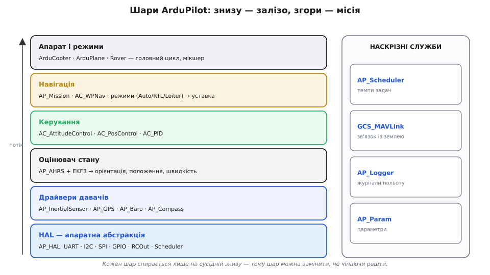
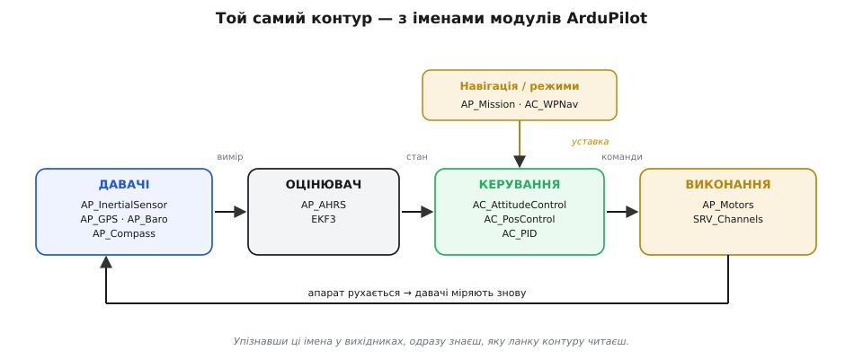
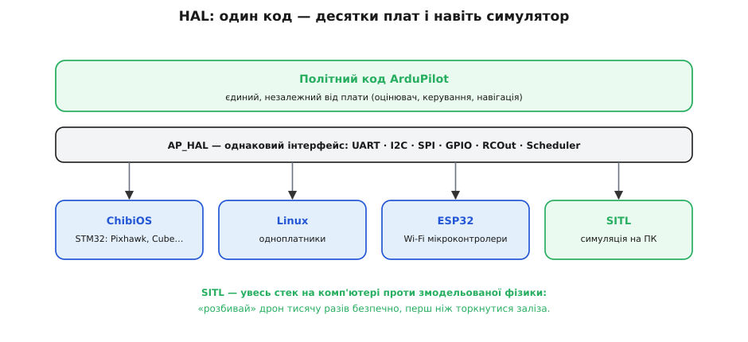
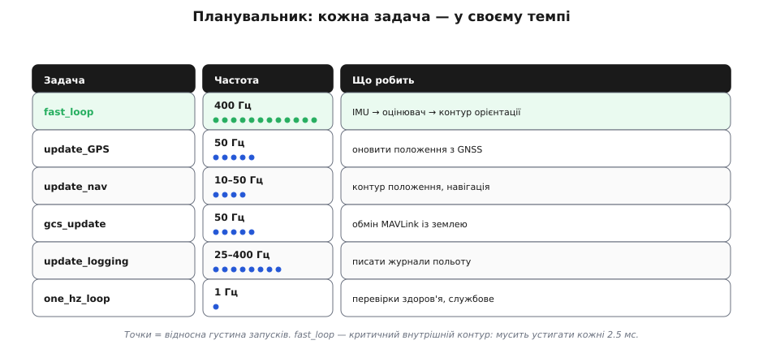
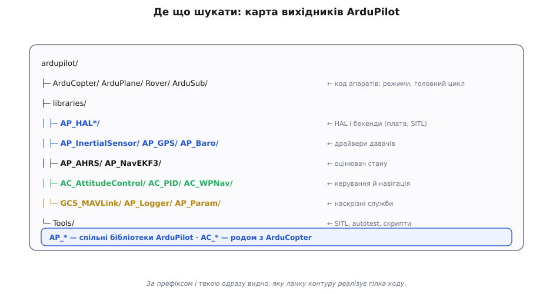

# Шари ArduPilot

[Автономний апарат](root:embedded/autonomous-system) можна накреслити як абстрактний контур із чотирьох ланок, і цей контур зазвичай віддають [окремій платі — політному контролеру](root:sys-dron/flight-controller). Та схема на папері й **реальна** зріла прошивка — різні речі: цікаво, на що цей контур перетворюється в коді. ArduPilot тут зручний за приклад не тому, що єдиний, а тому, що **відкритий** (ліцензія GPLv3), тож його будову можна не уявляти, а **прочитати** рядок за рядком. І чотири абстрактні ланки в ньому стають **стосом шарів**, де кожен спирається лише на сусідній знизу. Ця пошарова будова — не примха, а джерело трьох суперсил прошивки: **переносність** (той самий код на десятках плат), **спільний код** (коптер, літак, ровер, субмарина — з однієї бази) і **тестовність** (повний політ можна прогнати на ПК).

За цим стоїть одна з найважливіших інженерних ідей — **розділення відповідальності** (англ. *separation of concerns*, «розведення турбот»). Кожен шар відповідає за щось одне й спілкується із сусідами через вузький, чітко окреслений **інтерфейс**, а не лізе всередину їхньої роботи. Вигода подвійна. По-перше, складність дробиться на шматки, які можна осягнути поодинці: щоб поправити драйвер давача, не треба розуміти навігацію. По-друге — і це закономірно для проєкту, що виріс зі спільноти, — різні люди можуть **володіти різними шарами** й працювати паралельно, не наступаючи одне одному на ноги. Пошарова будова — це не лише про код, а й про те, як над ним працює велика команда.

### Шар за шаром: від заліза до місії


*Прошивка автопілота — це шари. Унизу HAL ховає конкретну плату; над ним драйвери перетворюють давачі на калібровані виміри; вище оцінювач складає стан; ще вище керування рахує команди; над ним навігація вирішує, куди летіти; на вершині — код конкретного апарата з режимами. Збоку — наскрізні служби (планувальник, MAVLink, журнали, параметри), якими користуються всі шари.*

Стос знизу вгору — це той самий [чотириланковий контур автономного апарата](root:embedded/autonomous-system), лише розкладений на полиці:

- **HAL** (англ. *Hardware Abstraction Layer*, «шар абстрагування заліза»; `AP_HAL`) — фундамент. Він дає всім верхнім шарам **однакові** інтерфейси до заліза: послідовні порти, I2C, SPI, ніжки, виходи на мотори (`RCOut`), планувальник. Завдяки йому решта коду **не знає**, на якій саме платі біжить.
- **Драйвери давачів** (`AP_InertialSensor`, `AP_GPS`, `AP_Baro`, `AP_Compass`…) — сидять на шинах HAL і перетворюють сирі реєстри мікросхем на калібровані виміри. Це ланка «давачі»; тут же живе обробка кількох екземплярів того самого давача — [резервування заради надійності](root:sys-dron/flight-controller).
- **Оцінювач стану** (`AP_AHRS` поверх фільтра `EKF3`) — поєднує виміри в єдиний стан: орієнтацію, положення, швидкість. Це ланка «оцінювач».
- **Керування** (`AC_AttitudeControl`, `AC_PosControl`, `AC_PID`) — бере стан і уставку, рахує команди. Ланка «керування»; усередині — каскад вкладених контурів.
- **Навігація й режими** (`AP_Mission`, `AC_WPNav`, режими `Stabilize`/`Loiter`/`Auto`/`RTL`) — вирішують, **куди** летіти, і задають уставку керуванню. Це джерело уставки, що приходить у контур згори.
- **Код апарата** (англ. *vehicle code*, від лат. *vehiculum* «засіб пересування»; `ArduCopter`, `ArduPlane`, `Rover`…) — вершина: головний цикл, мікшер виходів, специфіка саме цього типу апарата.

Збоку — **наскрізні служби**, якими користуються всі шари одразу: планувальник (`AP_Scheduler`, темпи задач), [зв'язок із землею](root:sys-dron/control-telemetry) (`GCS_MAVLink`), журнали (`AP_Logger`) і [параметри](root:sys-dron/params-gcs) (`AP_Param`). Ключове правило стосу: **кожен шар спирається лише на той, що під ним**. Тому будь-який шар можна **замінити**, не чіпаючи решти: інша плата — міняється HAL; інший давач — міняється драйвер; а оцінювач, керування й навігація лишаються ті самі.

Через цей стос дані течуть у **два** боки. **Вгору** піднімаються виміри, перетворюючись по дорозі на знання: драйвери віддають калібровані числа, оцінювач зводить їх у стан. **Вниз** спускаються наміри, перетворюючись на дію: навігація задає уставку, керування — команди, мікшер — напругу на моторах. А межа між будь-якими двома шарами — це **контракт**: верхній обіцяє звертатися лише через домовлений інтерфейс, нижній обіцяє цей інтерфейс чесно виконувати. Саме контракт, а не добра воля, робить заміну шару безпечною: поки новий драйвер тримає той самий інтерфейс, оцінювачу байдуже, який давач під ним.

### Той самий контур — з іменами модулів

Чотири ланки [абстрактного контуру](root:embedded/autonomous-system) лягають прямо на модулі ArduPilot — кожен модуль тут є окремою **бібліотекою** (англ. *library*, від лат. *liber* «книга»: набір готового коду, що його підключають інші частини):


*Той самий замкнений контур автономного апарата, підписаний реальними бібліотеками. «Давачі» — це `AP_InertialSensor`/`AP_GPS`/…; «оцінювач» — `AP_AHRS`+`EKF3`; «керування» — `AC_AttitudeControl`/`AC_PosControl`; «виконання» — `AP_Motors`/`SRV_Channels`. Уставку згори дає навігація (`AP_Mission`, `AC_WPNav`).*

Це той самий абстрактний контур, у якому кожен блок нарешті має ім'я. Натрапивши в чужому коді на `AP_AHRS::get_roll()` чи `AC_AttitudeControl::input_euler_angle_roll_pitch_yaw()`, читач уже знає, **яку ланку контуру** бачить, навіть не знаючи деталей.

У ArduPilot принцип «інтерфейс окремо, реалізація окремо» доведено до конкретного, упізнаваного взірця — поділу на **фронтенд і бекенд** (англ. *frontend / backend*, «передній / задній край»). Фронтенд — це стабільне «обличчя» модуля, з яким говорить решта коду (наприклад, `AP_GPS` чи `AP_InertialSensor`); бекенди — змінні реалізації під ним (драйвер під конкретний чіп GNSS; драйвер під конкретну модель IMU). Решта стека звертається лише до фронтенду й не знає, який бекенд працює всередині. Цей поділ — заразом і відповідь на потребу [резервування заради надійності](root:sys-dron/flight-controller): фронтенд може тримати **кілька** бекендів одночасно (три IMU, два компаси) і перемикатися між ними при відмові. Пара «`AP_Щось`» та «`AP_Щось_Backend`» у коді — це і є той самий контракт-інтерфейс плюс його взаємозамінні втілення.

> 🔧 **Навіщо це.** Це і є вміння «читати чужі системи». Назва модуля = його місце в контурі. Префікс `AP_` — спільна бібліотека ArduPilot; `AC_` — родом з ArduCopter; `EKF` — оцінювач; `Nav`/`WP` — навігація. Знаючи цей словник, ти орієнтуєшся в півмільйоні рядків коду, не читаючи їх усі.

### HAL: один код — десятки плат і навіть симулятор

Найнижчий шар вартий окремої розмови, бо саме він пояснює, як **одна** прошивка живе на стількох різних платах. HAL — це **контракт**: набір однакових інтерфейсів (порт, шина, ніжка, вихід на мотор, планувальник), які весь верхній код викликає, не питаючи, що під ними. У C++ цей контракт — клас із суто віртуальними методами, а кожна плата дає йому своє тіло; як це виглядає в реальному коді й чому саме воно робить підміну заліза безпечною, показано в окремій вставці [контракт HAL у коді](root:sys-dron/ardupilot-layers/proj-hal-backend.md). А під інтерфейсом — змінні **бекенди**:


*Увесь політний код звертається до `AP_HAL`, а той уже говорить із конкретним залізом через бекенд: ChibiOS на платах STM32 (Pixhawk, Cube), Linux на одноплатниках, ESP32 — або **SITL**, бекенд-симулятор, що замість заліза підставляє змодельовану фізику. Той самий код, інший «низ».*

Найцікавіший бекенд — SITL. **SITL** (англ. *Software In The Loop*, «програма в контурі») дає змогу запустити **весь справжній політний код** звичайною програмою на комп'ютері: замість реальних давачів і моторів він під'єднує модель фізики апарата, а назовні говорить тим самим MAVLink, що й справжня плата. Навіщо? Бо тестувати зміну в автопілоті колись означало **ризикувати реальним апаратом** — помилка коштувала розбитого літака. SITL це перевернув: «розбити» дрон можна тисячу разів за вечір, нічим не ризикуючи, а проєкт ще й ганяє автоматичний набір тестів (англ. *autotest*), який на кожну зміну коду **пролітає змодельовані місії** й перевіряє, що нічого не зламалося. Тримає це саме HAL: симулятор — то лише ще один «низ» під незмінним верхом.

Звісно, абстракція не безплатна: HAL — це тонкий шар перенаправлення, який коштує крихту швидкодії й зусиль на підтримку кількох бекендів. Але ціна мізерна проти виграшу, а поява HAL має чітку історичну причину: коли 8-бітні плати вперлися в стелю й код довелося переносити на 32-бітні ARM, стало ясно, що прив'язувати логіку до конкретного заліза — глухий кут. HAL і народився як стіна між «що робити» та «на чому це бігає».

> 🔧 **Навіщо це.** Якщо колись писатимеш чи правитимеш прошивку — спершу жени її в SITL, а не на живому апараті. А читаючи чужий стек, шукай шар HAL: він підкаже, на яких платах код працює й чи можна його запустити в симуляції. Переносність — ознака зрілої архітектури.

### Планувальник: хто й коли біжить

Вкладені контури керування біжать із різними темпами, а політний контролер працює під [жорсткою вимогою реального часу](root:sys-dron/flight-controller). У коді ця ієрархія темпів стає **таблицею планувальника**: список задач, кожна зі своєю частотою, які `AP_Scheduler` запускає за пріоритетом.


*Планувальник дає кожній задачі слот за її темпом. Критичний `fast_loop` (читання IMU, оцінювач, контур орієнтації) біжить найчастіше; навігація й обмін із землею — повільніше; службові перевірки — раз на секунду. Точки в колонці частоти показують відносну густину запусків.*

Таблиця планувальника в коді — це справді масив: кожен рядок задає функцію, її бажану частоту й стелю часу в мікросекундах. Частоту задають у герцах, а планувальник усередині переводить її в число тактів головного циклу — і саме це перетворення пояснює, чому задача на 50 Гц виконується не «через раз», а рівно щовосьмий такт.

**Умова.** Головний цикл коптера — 400 Гц. Скільки тактів циклу припадає на одну задачу `update_GPS`, оголошену на 50 Гц?

:::tabs
```cpp
// рядок таблиці планувальника (libraries/AP_Scheduler стиль):
// { функція, бажана частота (Гц), стеля часу (мкс) }
SCHED_TASK(update_GPS, 50, 200, ...),

const uint16_t loop_rate_hz = 400;          // головний цикл коптера
const uint16_t task_rate_hz = 50;           // бажана частота задачі

// планувальник рахує період задачі в тактах головного циклу:
uint16_t interval_ticks = loop_rate_hz / task_rate_hz;   // 400 / 50 = 8
float    dt_loop_ms      = 1000.0f / loop_rate_hz;        // 1000 / 400 = 2.5 мс

// задача запускається, коли від її попереднього запуску минуло interval_ticks:
//   400 / 400 = 1   → fast_loop:    щотакту
//   400 / 50  = 8   → update_GPS:   кожен 8-й такт
//   400 / 10  = 40  → update_nav:   кожен 40-й такт
//   400 / 1   = 400 → one_hz_loop:  кожен 400-й такт
```
```python
# рядок таблиці планувальника (libraries/AP_Scheduler стиль):
# { функція, бажана частота (Гц), стеля часу (мкс) }
sched_task(update_gps, 50, 200, ...)

loop_rate_hz = 400          # головний цикл коптера
task_rate_hz = 50           # бажана частота задачі

# планувальник рахує період задачі в тактах головного циклу:
interval_ticks = loop_rate_hz // task_rate_hz   # 400 / 50 = 8
dt_loop_ms     = 1000.0 / loop_rate_hz          # 1000 / 400 = 2.5 мс

# задача запускається, коли від її попереднього запуску минуло interval_ticks:
#   400 / 400 = 1   → fast_loop:    щотакту
#   400 / 50  = 8   → update_GPS:   кожен 8-й такт
#   400 / 10  = 40  → update_nav:   кожен 40-й такт
#   400 / 1   = 400 → one_hz_loop:  кожен 400-й такт
```
:::

Тобто період задачі в тактах — це просто `loop_rate / task_rate`: `update_GPS` спрацьовує щовосьмий такт по 2.5 мс, тобто кожні 20 мс — рівно 50 Гц. Швидке біжить щотакту, повільне — раз на багато тактів. Планувальник ще й стежить, щоб задачі **вкладалися** у свій час: якщо в циклі лишається замало, він відкладе менш термінову задачу, щоб насамперед устиг `fast_loop`. (Та сам планувальник процесорного часу не «домальовує»: він радше **розподіляє** наявний і **вимірює**, чи його вистачає, — а за справжнього перевантаження CPU і `fast_loop` може спізнитися. Тобто це інструмент, а не залізна гарантія реального часу сама по собі.) Так абстрактна «ієрархія темпів» перетворюється на конкретний, перевірений за часом розклад.

А що, коли процесора на все не вистачає — задач забагато, цикл не встигає? Тут і виявляється цінність планувальника: він знає **пріоритети**. Найкритичніше — `fast_loop` зі стабілізацією — він проганяє **першочергово**, а менш термінові задачі (журнали, рідкісні перевірки) за потреби трохи відкладе чи розмаже на кілька циклів. Це і є той самий принцип, що стоїть за виділенням [окремого політного контролера](root:sys-dron/flight-controller): коли ресурсу бракує, система жертвує не виживанням, а зручністю. Тому, до речі, перевантажений автопілот спершу «глухне» до телеметрії й журналів, а вже потім, якщо зовсім зле, торкається важливішого — і саме **порядок цих жертв** підказує, де шукати проблему.

> 🔧 **Навіщо це.** Натрапивши в чужій прошивці на «scheduler table» чи «loop rate», ти тепер бачиш у ній не магію, а розклад вкладених контурів. А якщо апарат «гальмує» чи перевантажений — дивись саме сюди: яка задача не вкладається у свій слот.

### Де що шукати у вихідниках

Усі імена з фігур вище — це **реальні теки** в дереві ArduPilot, і знання цієї карти робить чужий код передбачуваним:


*Куди дивитися. Теки апаратів (`ArduCopter`, `ArduPlane`…) — це верхній шар; уся решта живе в `libraries/`, згрупована за роллю в контурі: `AP_HAL*` — залізо, `AP_InertialSensor`/`AP_GPS` — драйвери, `AP_AHRS`/`AP_NavEKF3` — оцінювач, `AC_AttitudeControl`/`AC_WPNav` — керування й навігація, `GCS_MAVLink`/`AP_Logger`/`AP_Param` — наскрізні служби. У `Tools/` — SITL і автотести.*

Тут видно й чому стільки бібліотек з префіксами: `AP_*` — спільне ядро, яким користуються всі апарати; `AC_*` — те, що народилося в ArduCopter. Відкривши незнайому гілку коду, за префіксом і текою одразу скажеш, яку ланку контуру вона реалізує, — і це найшвидший спосіб зорієнтуватися у великому чужому проєкті.

Варто наголосити: ця конкретна розкладка — ArduPilot'ова, але сам **принцип** універсальний. Відкрий PX4, політний стек дрона іншого виробника чи будь-яку зрілу embedded-систему — і знайдеш ту саму трійцю: тонкий шар над залізом, посередині логіку, що нічого не знає про конкретні мікросхеми, і збоку служби зв'язку та журналювання. Назви тек будуть інші, а форма — та сама. Тому, навчившись читати один такий стек пошарово, ти, по суті, навчився читати їх усі.

> 🔧 **Навіщо це.** Ця карта — твій компас у будь-якому великому embedded-проєкті, не лише в ArduPilot. Зрілі системи майже завжди розкладені пошарово: шукай «де HAL/драйвери», «де логіка», «де зв'язок» — і незнайомий код складеться в знайому картину.

Сила цієї будови — у тому, що вона перетворює архітектуру на **карту для читання** коду: імена шарів є реальними теками, тож замість суцільної стіни тексту інженер бачить знайомі полиці й одразу знає, з якої знімати потрібне. А найцінніше тут — переносність: межа між «що робити» і «на чому це бігає» дає змогу налаштовувати поведінку апарата ззовні, не торкаючись логіки. Як саме автопілот відкриває цю поведінку назовні — через [параметри й наземну станцію](root:sys-dron/params-gcs).
