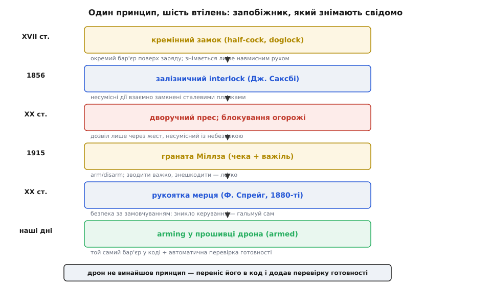

# 📜 Запобіжник, який людина мусить зняти сама

Замкніть на хвилину дрон у голові й гляньте на найпростішу деталь усієї конструкції — не на процесор, не на регулятори, а на думку, що двигуни за замовчуванням **не мають права крутитися**, доки людина свідомо не дасть дозвіл. Ця думка виглядає такою очевидною, що легко проґавити її вік. Насправді за нею — щонайменше чотири століття інженерної практики, і жодне з тих століть не знало ні дронів, ні прошивки. Люди раз за разом натикалися на ту саму біду з різних боків — зброя, що стріляла в момент заряджання; преси, що відрубували руки; потяги, що йшли на зустрічний шлях; вагони, які летіли без водія, — і щоразу вигадували, по суті, **той самий пристрій**: навмисний бар'єр між наміром і небезпечною дією, який неможливо перейти випадково й який за замовчуванням зачинений.

Варто пройти цим шляхом не заради дат, а щоб побачити одну річ: **arming — не винахід робототехніки**. Це старий інженерний принцип, який дрони лише переклали з металу в код. І як тільки ви впізнаєте його в кремнієвому запалі мушкета, у сталевій планці залізничного важеля, у чеці гранати — логіка `try_arm()` перестане здаватися довільним набором правил і стане тим, чим вона є: черговим втіленням дуже старої, дуже дорого оплаченої ідеї.

## Чому взагалі знадобився окремий стан «безпечно»

Почнімо з питання, яке рідко ставлять уголос: **навіщо небезпечному пристрою окремий стан, у якому він гарантовано нешкідливий?** Хіба не досить просто «не робити небезпечного»?

Відповідь у природі небезпечних механізмів. Річ, здатна вбити, зазвичай накопичує в собі енергію — стиснуту пружину, підняту вагу, заряд пороху, розкручений маховик, заряджену батарею. Ця енергія **вже там** і чекає лише спускового гачка. Між «спокоєм» і «пострілом» стоїть не робота, яку треба зробити, а бар'єр, який треба **прибрати**. І от що бентежить: прибрати бар'єр можна і навмисно, і випадково — механізм не відрізняє наміру від струсу, іскри чи чужої руки, що зачепила важіль.

Звідси народжується ідея, до якої людство доходило болісно й багато разів: якщо небезпека — це прибраний бар'єр, то безпека — це **навмисно поставлений другий бар'єр**, який сама конструкція тримає на місці, доки людина свідомо його не зніме. Не «не роби небезпечного», а «зроби небезпечне фізично неможливим, поки не виконана окрема, свідома дія». Ось цей другий бар'єр і мандрує крізь усю історію техніки під різними іменами — запобіжна чека, half-cock, планка блокування, дві кнопки, safety switch — і врешті осідає в дроні як змінна `armed`.

## «Cock» і «arm»: звідки взялися слова

Спершу про самі слова, бо вони чесно розповідають, звідки принцип прийшов.

Дієслово **to arm** («озброїти», «звести до бойового стану») старе: в англійській воно з'являється близько 1200 року, зі старофранцузького *armer* і напряму з латинського *armāre* — «спорядити зброєю», від *arma*, що буквально означало «знаряддя, приладдя» війни. *(Етимологія усталена; джерело — Online Etymology Dictionary.)* Тобто «arm» від початку — не про сам постріл, а про **приведення в стан готовності діяти**. Коли через сотні років інженери шукали слово для «привести підривник у стан, де він може спрацювати», старе *arm* лягло ідеально: боєприпас *armed* — це боєприпас, уже готовий вбити.

Цікаво, що для **ручної зброї** прижилося інше слово — **cock** (звести курок). Кремінний чи колісцевий замок мав курок (*cock*), який відводили назад, натягуючи пружину; звідси «to cock» — звести до пострілу, а стан напівготовності назвали **half-cock** (напівзвід). Ці два слова — «cock» для стрілецької зброї й «arm» для боєприпасів та підривників — розійшлися історично, але позначають одне: перехід у стан, з якого до пострілу лишається один-єдиний рух. Дрон успадкував гілку **arm/disarm**, бо його небезпека ближча до підривника (окремий керований дозвіл спрацювати), ніж до курка.

Навіть слово **граната** тягне свій корінь із тих часів: воно зі старофранцузького *pome grenate* — «зернистий плід», тобто **гранат** (фрукт), бо ранні чавунні гранати, начинені порохом і повні уламків, скидалися на плід із зернятами; іспанське *granada* дало сучасну форму, і в англійську слово ввійшло в XVI столітті. *(Усталено; етимологія добре задокументована.)* Дрібниця, але вона показує, який давній цей світ понять — «звести», «розрядити», «запобіжник» жили в мові за століття до першого транзистора.

## Кремінний замок: перший механічний «запобіжник»

Тепер до заліза. Найраніший предок нашого safety switch — це **механічний запобіжник на ручній вогнепальній зброї**, і він старший, ніж більшість здогадується.

Проблема, яку він розв'язував, була кривава й буденна. Мушкет із кремінним замком носили зарядженим і з порохом на полиці — інакше він марний у бою, бо заряджати його довго. Але заряджений мушкет з відведеним курком — це бомба в руках: досить курку зірватися (зачепив гілку, впав, штовхнули), і кремінь креше іскру, порох спалахує, лунає постріл — часто в того, хто поруч. Треба було носити зброю **готовою, але не здатною вистрілити від випадковості**.

Перше вдале рішення — **напівзвід (half-cock)**. Курок відводили не до кінця, а на проміжну зарубку, де його ловив спусковий важіль (*sear*); у цьому положенні натиснення на гачок **не звільняло курок** — зарубка була зроблена так, що гачок за неї не чіпляв. Виходив справжній блокувальник: зброя заряджена, але спуск фізично не працює, доки курок не відведений на повний звід. Half-cock з'явився в XVII столітті разом із кремінними замками; згодом, близько 1750 року, до механізму додали спеціальний зачіп (*detent*), щоб гачок гарантовано не ловив напівзвідну зарубку. *(Усталено; історія кремінного замка добре задокументована.)* Звідси, до речі, англійський вислів «to go off half-cocked» — «вистрілити з напівзводу», тобто діяти зопалу, не звівши як слід; сам вислів засвідчує, що напівзвід і був той стан «ще не готовий стріляти».

Ще виразніший приклад — **doglock** (замок із «собачкою»). Це англійський замок середини XVII століття (поширений з 1630-х до 1720-х), у якого за курком стояв окремий гачок-«собачка» (*dog*): на напівзводі він **зачіплявся за курок і механічно тримав його**, а щоб вистрілити, курок треба було відвести на повний звід, і тоді «собачка» сама зіскакувала. Це вже майже наш safety switch: **окремий фізичний елемент, єдина функція якого — не дати механізмові спрацювати, доки його свідомо не зняли**. Doglock називають одним із перших замків із власне запобіжником; вершник міг везти заряджену зброю, не боячись пострілу на вибоїні. *(Усталено; типологія замків добре вивчена.)*

Зверніть увагу, що вже тут проступають **обидві** риси майбутнього arming. По-перше, стан «безпечно» — не відсутність заряду (зброя заряджена!), а **окремий фізичний бар'єр** поверх готовності. По-друге, зняти цей бар'єр можна лише навмисним рухом (відвести курок на повний звід), який не робиться сам собою від струсу. Триста років по тому дрон зробить те саме: двигуни «заряджені» (живлення є, регулятори готові), але окремий бар'єр — `armed == false` — тримає їх мертвими, доки людина не дасть свідому команду.

> 🔧 **Навіщо це.** Головний урок кремінного замка перекочував у прошивку буквально: **безпечний стан — це не «нічого не роблю», а активно утримуваний бар'єр поверх повної готовності діяти**. Дрон у disarmed так само «заряджений» — батарея під'єднана, ESC живі, керування рахує газ; безпеку дає не знеструмлення, а окремий заслон, який навмисно тримають зачиненим. Саме тому в коді `armed` за замовчуванням `false`, а вихід на двигуни читає його **першим**, до будь-якої іншої логіки: це прямий нащадок зарубки напівзводу, що не пускала спусковий важіль.

## Граната: чека, важіль і «стало безпечно знову»

Наступний предок додає до картини рису, якої в замку ще не було: **можливість повернути пристрій у безпечний стан і після того, як його вже зняли з запобіжника** — тобто *disarm*.

Рання граната була, м'яко кажучи, симетрично небезпечна: пороховий чи запальний заряд із ґнотом, який підпалювали перед кидком. Скільки горітиме ґніт — вгадай; кинеш зарано — ворог відкине назад, кинеш запізно — рвоне в руці. Це не мало окремого «безпечного» стану взагалі: щойно ти підпалив ґніт, зворотного шляху нема.

Переломним став дизайн, який зробив стан «зведено» **керованим і зворотним аж до останньої миті**. Канонічний приклад — **граната Міллза** (Grenade, Hand, No. 5), яку англійський інженер Вільям Міллз (William Mills, родом із Сандерленда) запатентував на початку 1915 року, у розпал Першої світової. *(Усталено; конструкцію й дату добре задокументовано.)* Міллз спеціально вивчав, чому попередні гранати вбивали своїх, і побудував механізм із двох рівнів запобіжника:

- **Запобіжна чека (safety pin)** — шпилька, що наскрізь проходить крізь корпус і **механічно блокує підпружинений важіль**. Доки чека на місці, важіль притиснутий, ударник не може впасти, запал не спрацює. Це стан «повністю безпечно»: гранату можна носити, впустити, покласти в кишеню.
- **Ударний важіль (striker lever)** — підпружинена скоба збоку. Коли чеку витягли, важіль усе ще **притиснутий долонею** того, хто тримає гранату. Поки долоня тисне — нічого не відбувається. Це проміжний стан: чека знята, але спрацювання ще утримується рукою.
- Аж коли гранату **кинули**, важіль відскакує, ударник б'є капсуль, і запалюється сповільнювач — близько чотирьох секунд, щоб кинутий устиг сховатися.

Ланцюг виходить триступеневий: `чека на місці → важіль притиснутий рукою → кинуто`. І критична деталь: **витягти чеку — ще не означає активувати**. Доки ти тримаєш важіль, ти можеш — за потреби — вставити чеку назад і повернути гранату в безпечний стан. Тобто конструкція має і arm (витяг чеки — зняв перший бар'єр), і **фактичний disarm** (важіль під долонею, спрацювання утримується; чеку можна повернути). Гранат Міллза виготовили колосально багато — близько 75 мільйонів за війну, — і саме ця схема «чека + важіль» стала світовим стандартом ручної гранати. *(Усталено.)*

Ось де корінь **асиметрії переходів**, яку дрон успадкував як головну рису arming. Щоб *озброїти*, треба **послідовність навмисних дій**: витягти чеку **і** відпустити важіль (кинути) — саме два різні наміри поспіль, не один. А щоб *знову стало безпечно*, поки ще можна, — достатньо **не відпускати важіль** (і за потреби повернути чеку). Перейти в небезпеку важко й багатоступенево; лишитися чи повернутися в безпеку — легко. Порівняйте з `try_arm()`: увійти в armed можна лише за одночасного «свідома команда **І** всі перевірки зелені» (багато умов «І», як чека плюс кидок), а вийти в disarmed — одна команда, миттєво й безумовно (як не відпустити важіль). Це не випадковий збіг стилю — це той самий інженерний висновок, оплачений життями саперів.

## Підривник артилерії: «безпечно в стволі, зведено в польоті»

Гілка боєприпасів дала ще одну ідею, напрочуд близьку до **pre-arm checks**: думку, що пристрій має **сам переконатися, що вже безпечно ставати небезпечним**, і не раніше.

Проблема артилерійського підривника (*fuze*) тонша за гранатну. Снаряд не можна робити «готовим вибухнути» одразу після заряджання: якщо детонатор з'єднаний із зарядом уже в стволі, будь-який поштовх при пострілі чи навіть дефект пороху рвоне снаряд просто в гарматі, разом із розрахунком. Але й не можна лишати його безпечним назавжди — він мусить вибухнути біля цілі. Потрібен пристрій, який тримає підривник **знешкодженим, доки снаряд у стволі й одразу по вильоті, а потім сам зводить його вже в польоті**.

Класичне рішення — **розімкнений детонаційний ланцюг (out-of-line)** у пристрої, який так і назвали — **safe-and-arm (S&A)**, «безпечно-та-зведення». У безпечному стані детонатор **фізично зсунутий убік** зі шляху від капсуля до основного заряду: навіть якщо капсуль спрацює, іскрі нема куди йти — ланцюг розірваний. Зброя стає бойовою лише тоді, коли детонатор **стає на лінію** з рештою ланцюга. І найголовніше: зсуває його на місце не людина, а **сама фізика пострілу** — різке прискорення на вильоті (*setback*) і обертання від нарізів ствола розблоковують механізм і виводять детонатор на лінію вже за дульним зрізом, на безпечній відстані. Снаряд, який чомусь не вистрілив як слід, лишається знешкодженим. *(Усталено; принцип bore-safe і out-of-line — стандарт сучасних підривників.)*

Придивіться, що тут відбулося. Пристрій **не довіряє тому, що його зарядили**, а вимагає **фізичного доказу**, що вже безпечно зводитися — доказу у вигляді сили пострілу, якої не буває в мирних умовах. Це рівно та сама логіка, що й у дроновому pre-arm: не «оператор наказав — отже, зводимось», а «наказ **плюс** незалежне підтвердження, що всі умови для безпечного руху справді виконані». Підривник вимірює перевантаження й обертання; дрон вимірює фіксацію GPS, збіжність оцінювача, заряд, калібрування. Механізм інший — думка тотожна: **між командою і зведенням стоїть перевірка реальності, яку не обдуриш добрим наміром**.

## Залізниця: interlock, де одне унеможливлює інше

Поки зброярі мучилися з запобіжниками, зовсім інша галузь — залізниця — винайшла слово й механізм, що дали назву цілому класу пристроїв безпеки: **interlock** (взаємне блокування). І саме звідси в наш світ прийшла ідея, що безпеку можна вбудувати **в саму механіку так, щоб небезпечна комбінація дій була фізично неможлива**, а не лише заборонена інструкцією.

Біда була така. На вузлі, де сходяться колії, стрілочник керує і **стрілками** (куди піде потяг), і **семафорами** (чи можна їхати). Досить дати зелений семафор на маршрут, стрілки якого переведені на зустрічний шлях, — і два потяги йдуть у лоб. Людина за важелями плутається, особливо вночі й у поспіху; інструкція «спершу перевір стрілку, тоді відкривай сигнал» не рятує, бо помилка — це мить неуважності.

Розв'язок знайшов англійський інженер **Джон Саксбі (John Saxby)**, тесля на залізниці Лондон — Брайтон, який у червні **1856 року** дістав перший патент на **взаємне блокування стрілок і сигналів** — «спосіб одночасно керувати стрілками й сигналами на розгалуженнях, щоб запобігти аваріям». *(Усталено; Саксбі загальновизнаний як «батько сучасної сигналізації».)* Механізм — **важільна рама (lever frame)** з геніально простою серцевиною. Під рядом важелів лежить сталева **плита блокування (locking bed)**, а на ній — по одній **планці-тапету (tappet bar)** на кожен важіль. Планки вирізані так, що **зачіпляються одна за одну**: щойно потягнули важіль A, його тапет **фізично засуває** тапет важеля B, і B **неможливо зрушити**, хоч як тисни. Отже, «відкрити семафор» стає механічно неможливим, доки стрілки не поставлені під цей маршрут; несумісні дії взаємно **замкнені**.

Це працювало так добре, що поширилося блискавично: першу interlock-систему поставили на вузлі Bricklayers Arms у південному Лондоні, а вже до 1873 року лише на одній залізниці (London and North Western) працювало близько **13 000 блокувальних важелів**. *(Усталено.)*

Тут з'явилася риса, якої в зброї ще не було, а в дроні вона центральна: **безпека як логічне обмеження між кількома діями, вбудоване в конструкцію**. Interlock не просто блокує одну дію — він робить **певні комбінації** дій неможливими. Погляньте знову на `try_arm()`: зводитися дозволено лише за **збігу** умов (команда, калібрування, оцінка, зв'язок, заряд, знятий safety switch), а несумісний стан — «armed при просілій батареї» чи «armed при повному газі на стику» — просто **не має шляху статися**, як у Саксбі не мав шляху зелений семафор на неправильно поставлену стрілку. Слово ж «interlock» прямо живе в лексиконі дронів: pre-arm-логіку так і звуть **arming interlocks** — взаємні блокування, кожне з яких мусить зняти свою заборону, перш ніж ворота відчиняться.


*Кожен рядок — інша галузь і століття, але спільна риса одна: між наміром і небезпечною дією стоїть навмисний бар'єр, який неможливо зняти випадково. Дрон не винайшов цей принцип, а переніс його з металу в код і додав автоматичну перевірку готовності.*

## Промислові преси: обидві руки зайняті — руки не в зоні удару

Найближчий родич дронового arming за духом — не зброя, а **промисловий верстат**, надто механічний прес. Тут з'явилася ще одна риса arming у чистому вигляді: **вимога свідомої дії саме такої, яка фізично несумісна з небезпекою**.

Механічний прес — це важкий повзун, що йде вниз із силою в тонни, штампуючи метал. Робітник кладе заготовку в зону штампа й натискає педаль. Проблема очевидна й страшна: якщо рука ще в зоні, коли повзун пішов, — руки більше нема. Століттями преси калічили людей масово; історія охорони праці значною мірою почалася саме з них.

Одне з рішень — **дворучне керування (two-hand control)**: прес запускається **лише коли обидві руки оператора одночасно тиснуть дві рознесені кнопки**, і забрати руку з будь-якої кнопки — значить негайно зупинити хід. Логіка бездоганно проста: **якщо обидві руки на кнопках, вони фізично не можуть бути в зоні удару**. Безпеку дає не заборона й не датчик, що «стежить за руками», а сама геометрія: небезпечну дію дозволено лише через жест, який **вимагає прибрати руки з небезпеки**. Кнопки навмисно рознесено так, щоб не можна було втопити обидві однією долонею чи ліктем; додають вимогу **одночасності** (обидві в межах частки секунди, інакше не рахується) і **антиповтор** (відпустив — для наступного ходу тисни заново). Ці вимоги пізніше закріпили нормативно: у США їх кодифікує стандарт OSHA щодо механічних пресів (29 CFR 1910.217), де дворучний пристрій мусить конструкцією й рознесенням змушувати до участі **обох рук** і зупиняти повзун, щойно прибрано одну руку. *(Усталено; вимоги стандарту чинні.)*

Ось де дрон і прес — рідні брати. Обидва вимагають **свідомої, спеціальної дії**, щоб дозволити небезпеку: у пресі — дві руки на рознесених кнопках; у дроні — утримати стик у кутовому положенні кілька секунд (жест, якого не буває у звичайному керуванні) або клацнути окремий перемикач і дати команду arm. І там, і там дію навмисно зробили **незручною для випадковості**: як кнопки рознесені, щоб їх не втопив лікоть, так команда arm вимагає утримання, щоб її не подав випадковий смик стика. Це прямий інженерний нащадок дворучного преса: **бар'єр знімається лише жестом, який важко зробити ненавмисно**.

І другий родич із того самого цеху — **блокування огорож (guarded interlock)**. Небезпечний верстат закривають кожухом чи дверцятами, а на них ставлять **блокувальний вимикач**: доки дверцята зачинені — верстат може працювати; відчинив дверцята — **живлення небезпечного руху негайно знято**, і зачинити назад мало, поки рух не спинився безпечно. Тут проступає та сама асиметрія, що й у дроні: **увімкнути небезпеку можна лише за виконаної умови (кожух закритий), а вимкнути — щойно умову порушено (кожух відкрито), негайно й безумовно**. Це буквально дронове правило «в armed увійти важко (усі умови «І»), а в disarmed вийти — миттєво від однієї команди», тільки виражене в металі дверцят, а не в змінній.

Промислові блокування принесли й **гірку науку**, яку дрон успадкував разом із механізмом: люди **обходять** запобіжники, коли ті заважають. Оператори підв'язували дворучні кнопки, щоб звільнити руку, приклинювали блокувальні вимикачі огорож, аби не чекати зупинки, — і гинули. Саме цей досвід стоїть за дроновим поняттям **обов'язкових перевірок (mandatory)**, яких не можна вимкнути бітмаскою: інженери знають, що людина під тиском вимкне будь-який захист, який стоїть на дорозі, тож найкритичніші заслони роблять такими, що їх **не обійти налаштуванням** — так само, як найнебезпечніші преси вимагають блокувань, які не знімаються простим рухом руки.

## Вагон без водія: dead man's switch і безпека за замовчуванням

Остання гілка додає рису, яку легко проґавити, але без якої arming не мало б сенсу: **що має статися, коли керування зникає само**. Досі йшлося про те, як **не пустити** в небезпеку. А що коли людина, яка тримала бар'єр, раптом зникла — знепритомніла, впала, померла за пультом?

Із приходом електрики на транспорт постала нова біда. У паровозі поряд із машиністом завжди був кочегар — якщо машиністові стане зле, потяг устигне зупинити напарник. А трамвай і електропоїзд водила **одна людина**; знепритомнів водій — і важкий вагон летить далі сам, некерований, у натовп. Треба було зробити так, щоб **зникнення керування само по собі зупиняло машину**.

Рішення назвали моторошно точно — **«рукоятка мерця» (dead man's handle / switch)**. Один із перших таких пристроїв побудував американський інженер **Френк Спрейг (Frank J. Sprague)** у 1880-х для електричних вуличних залізниць. *(Усталено.)* Ідея вивертає звичну логіку навиворіт: керування вимагає **постійного активного зусилля** — водій мусить весь час утримувати рукоятку натиснутою (пізніше додали ще й реакцію на періодичний сигнал пильності). Щойно зусилля зникає — рука зісковзнула, тіло обм'якло — пружина сама розмикає ланцюг і **вмикає гальма**. Безпечний стан настає **за відсутності дії**, а не завдяки їй.

Це і є принцип **безпеки за замовчуванням (fail-safe)**, і дрон стоїть на ньому цілком. Згадайте, як влаштована змінна `armed`: вона `false` **із самого початку**, ще до першого рядка перевірок, — система **прокидається знешкодженою сама собою**, і щоб стати небезпечною, потрібна активна робота (команда плюс пройдені перевірки). Ніхто не мусить її знеструмлювати — вона безпечна, поки її навмисно не звели. Це точний відповідник рукоятки мерця: **прибери зусилля — і повернешся в безпеку автоматично**. Дронова логіка йде далі того самого шляху вже в польоті: зник радіозв'язок — апарат не «летить як летів», а переходить у наперед заданий безпечний стан; це вже [failsafe](root:sys-dron/failsafe), рідний брат рукоятки мерця, тільки для повітря. Спільний корінь один: **небезпечна система мусить сповзати в безпеку, коли керування зникає, а не завмирати в останній небезпечній команді**.

## Що дрон додав свого

Отже, до появи дронів уже існували всі окремі риси arming, кожна виношена своєю галуззю:

```
кремінний замок     → окремий фізичний бар'єр поверх готовності (safety switch)
граната Міллза       → arm/disarm і асиметрія: зводити важко, знешкодити легко
підривник (S&A)      → зводитися лише за фізичним доказом, що вже безпечно
залізничний interlock→ несумісні дії взаємно замкнені механікою
дворучний прес       → дозвіл лише через свідомий жест, несумісний із небезпекою
блокування огорожі   → умова тримає дозвіл; порушив умову — миттєве зняття
рукоятка мерця       → безпека за замовчуванням; зникло керування — гальмуй сам
```

Що ж тоді нового приніс дрон, якщо принцип старий? Дві речі, і обидві — від того, що бар'єр переїхав **у програму**.

**Перше — бар'єр став логікою, а не деталлю.** Раніше кожен запобіжник був окремою фізичною річчю: зарубка, чека, планка, кнопка, рукоятка. У дроні центральний бар'єр — це **змінна `armed` й гілка коду, що читає її першою**. Виграш величезний: один заслон стереже вихід на **всі** двигуни одразу, його стан можна показати оператору, залогувати, звести з іншими умовами в довільно складне «І». Але й розплата нова: **код може мати баг**, якого не буває в сталевій планці. Саме тому дрон **не відмовився** від фізичного предка, а лишив його **найнижчим шаром** — апаратний [safety switch](root:sys-dron/arming-checks/comp-safety-switch.md), що глушить виходи **повз** усю програмну логіку, точно як «собачка» doglock глушила постріл повз спусковий механізм. Кремінний замок не витіснено — його поставлено під код як останній рубіж на випадок, коли код помилиться.

**Друге — і головне — дрон додав автоматичну перевірку готовності.** Усі старі запобіжники покладалися на **людину**: стрілочник сам мав поставити стрілку перед сигналом, артилерист — правильно зарядити, робітник — сам стежити за руками. Interlock лише не давав зробити явно суперечливу комбінацію, але **не перевіряв, чи все справді готове до безпечної дії**. Ось цей крок і зробив дрон: перед тим як відчинити ворота, прошивка **сама проганяє десятки випробувань** — чи скалібровані датчики, чи збігся оцінювач стану, чи є фіксація GPS, чи досить заряду, чи живий зв'язок — і показує людині **першу причину**, якщо щось не так. Жоден кремінний замок не вмів сказати «не пущу, бо компас бачить залізо поруч». Дрон уміє, бо його бар'єр — програма, а програма може **дивитися всередину** на числа, недоступні оку оператора.

У цьому й уся суть переходу. Дрон **не винайшов** ідею навмисного бар'єра між наміром і небезпечною дією — цю ідею людство оплатило руками пресувальників, життями саперів і жертвами перших некерованих вагонів. Дрон зробив дві речі: **переклав старий фізичний бар'єр у код** (лишивши металевий предок під ним як страховку) і **додав до нього те, чого метал не вмів, — автоматичну, кожного разу однакову перевірку, що ставати небезпечним уже справді безпечно**. Коли наступного разу дивитиметеся на `if (!armed) return THROTTLE_MIN;`, впізнайте в цьому рядку зарубку напівзводу, чеку гранати, планку Саксбі й дві рознесені кнопки преса — усе те, до чого інженери йшли чотири століття, стиснуте в одну змінну, яку за замовчуванням тримають безпечною.
