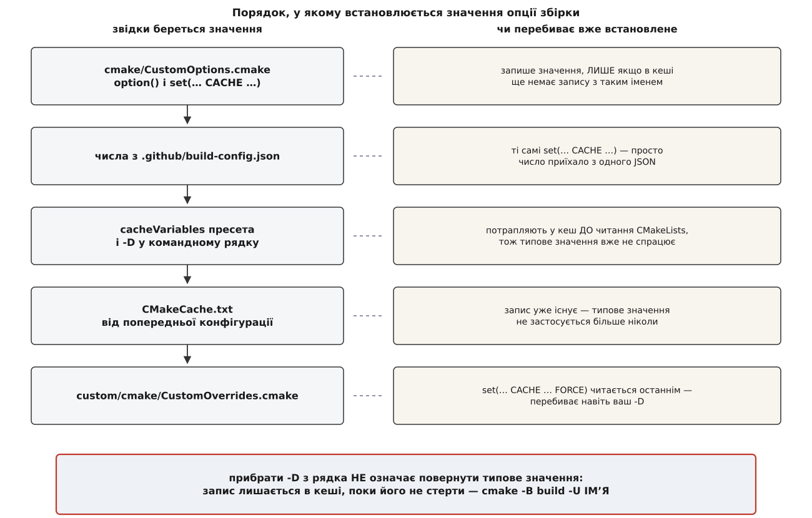

# ⚙️ Опції збірки QGroundControl: імена, типи, типові значення

Тут зібрано змінні, якими керується вигляд і вміст зібраного застосунку: ім'я й ідентифікатори, версія протоколу, увімкнені підсистеми, спосіб пакування, режим компілятора. Для кожної — тип, типове значення й те, на що вона насправді впливає. Довідник потрібен для двох різних речей: скласти потрібний рядок конфігурації з першого разу — і зрозуміти, чому опція, яку ви передали, не подіяла.

Звірено з файлом `cmake/CustomOptions.cmake` гілки `master` репозиторію `mavlink/qgroundcontrol` 2 серпня 2026 року. Числа версій (Qt, GStreamer, рівні API Android, коміт MAVLink) походять із `.github/build-config.json` тієї самої гілки. **Усе це версійне**: опції додають, перейменовують і прибирають між випусками, а значення за замовчуванням у стабільній лінії 5.0.x відрізняються від `master`. Наприкінці показано, як за хвилину прочитати справжній перелік зі свого клону — і це надійніше за будь-яку таблицю.

---

## Дві форми запису й що з них випливає

У файлі опцій трапляються рівно дві конструкції:

```cmake
option(QGC_ENABLE_WERROR "Treat compiler warnings as errors" ON)
set(QGC_MAVLINK_DIALECT "all" CACHE STRING "MAVLink dialect")
```

Обидві роблять те саме — заводять **запис у кеші**, тобто рядок у файлі `CMakeCache.txt` усередині теки збірки. Різниця лише в типі запису: `option()` завжди дає `BOOL` зі значеннями `ON`/`OFF`, а `set(… CACHE STRING …)` — довільний текст. Трапляються ще `CACHE PATH` і `CACHE FILEPATH`: те саме, але графічний конфігуратор покаже для них вибір теки чи файла. У таблицях нижче я пишу `OPTION` там, де в коді `option()`, і `STRING`/`PATH`/`FILEPATH` — там, де `set(… CACHE …)`.

Важлива не сама різниця форм, а спільна властивість обох команд: **вони записують значення, лише якщо запису з таким іменем у кеші ще немає**. Це не примха, а сенс [кешованих змінних](root:sys-bsystem/cache-and-options): кеш існує саме для того, щоб ваш вибір пережив переконфігурацію, а не був щоразу затертий типовим значенням з коду. Наслідок незручний і саме на ньому спотикаються найчастіше.



*Типове значення з коду діє тільки на порожній теці збірки; далі перемагає те, що вже записано в кеші, а вендорська накладка з `FORCE` б'є навіть командний рядок.*

Розберімо ланцюг знизу вгору, бо кожна ланка пояснює конкретну поламку.

**`-D` у командному рядку й `cacheVariables` у [пресеті](root:sys-bsystem/cmake-presets)** — це одне й те саме: обидва кладуть запис у кеш ще до того, як CMake почне читати `CMakeLists.txt`. Тому `option()` бачить готовий запис і мовчки нічого не робить. Пресет тут не «сильніший» за командний рядок і не «слабший» — вони пишуть в одне місце, і виграє той, хто пише пізніше.

**Кеш від попереднього прогону.** Ви один раз сконфігурували з `-DQGC_UNITY_BUILD=ON`, потім прибрали прапорець із рядка — і збірка досі склеює одиниці трансляції. Це не помилка: запис лишився в `CMakeCache.txt`, а типове значення `OFF` більше ніколи не застосується до цієї теки. Щоб повернути типове, запис треба **стерти**:

```bash
cmake -B build -U QGC_UNITY_BUILD
```

**Накладка `custom/`.** Порядок у кореневому `CMakeLists.txt` дослівно такий:

```cmake
include(CustomOptions)

if(IS_DIRECTORY "${CMAKE_SOURCE_DIR}/${QGC_CUSTOM_DIR}")
    set(QGC_CUSTOM_BUILD ON)
    list(APPEND CMAKE_MODULE_PATH "${CMAKE_SOURCE_DIR}/${QGC_CUSTOM_DIR}/cmake")
    include(CustomOverrides)
endif()
```

Тобто файл опцій читається першим, а накладка — після нього; сама наявність теки з іменем із `QGC_CUSTOM_DIR` і є вмикачем вендорської збірки. В апстримному зразку `custom-example` усі перевизначення записані з `FORCE`:

```cmake
set(QGC_APP_NAME "Custom-QGroundControl" CACHE STRING "App Name" FORCE)
```

`FORCE` знімає єдиний запобіжник — «не чіпай, якщо запис уже є», — і переписує значення беззастережно. Тому ваш `-DQGC_APP_NAME=…` у вендорській збірці не спрацює: його переб'ють на кілька рядків пізніше. Лікується це не сильнішим прапорцем, а правкою самої накладки — власне, [вендорська збірка](root:sys-dron/custom-build) для того й влаштована так, щоб перевизначення жили в одному файлі, а не розповзалися по командних рядках.

### Опції, яких у вашому кеші немає

Чотири записи в цьому проєкті заведено через `cmake_dependent_option` — це `option()` з умовою:

```cmake
cmake_dependent_option(QGC_BUILD_TESTING "Build unit tests" ON "_QGC_DEBUG_BUILD" OFF)
```

Читається так: якщо `_QGC_DEBUG_BUILD` істинна, поводься як звичайна опція з типовим `ON`; якщо ні — **примусово постав `OFF` і прибери запис із кеша**. Друге і є пасткою: за хибної умови рядок `-DQGC_BUILD_TESTING=ON` не дасть нічого й навіть не поскаржиться, бо опції просто не існує. Ви шукаєте друкарську помилку в імені, а насправді не виконано умову.

Так заведено `QGC_BUILD_TESTING`, `QGC_DEBUG_QML`, `QGC_ENABLE_COVERAGE` і `QT_QML_NO_CACHEGEN` — усі з тією самою умовою:

```cmake
if(CMAKE_CONFIGURATION_TYPES OR CMAKE_BUILD_TYPE STREQUAL "Debug")
    set(_QGC_DEBUG_BUILD TRUE)
else()
    set(_QGC_DEBUG_BUILD FALSE)
endif()
```

Перша половина умови пояснює, чому одна й та сама команда поводиться по-різному на різних машинах. `CMAKE_CONFIGURATION_TYPES` не порожня в **багатоконфігураційних** генераторах — Visual Studio, Xcode, `Ninja Multi-Config`, — де тип збірки обирається не під час конфігурації, а під час самої збірки (`cmake --build build --config Release`). Такий генератор ще не знає, Debug буде чи Release, тож умова істинна завжди, і всі чотири опції існують. У одноконфігураційного `Ninja` чи `Unix Makefiles` тип відомий одразу — і в Release ці опції зникають. Тобто «у мене на Windows тести збираються, а на Linux тієї опції взагалі немає» — не розбіжність версій, а різниця генераторів.

Звідси й порядок дій на одноконфігураційному генераторі: спершу `-DCMAKE_BUILD_TYPE=Debug`, і лише потім усе інше. Інакше решта прапорців пишеться в порожнечу.

---

## Метадані застосунку

| Опція | Тип | Типове | На що впливає |
|---|---|---|---|
| `QGC_APP_NAME` | STRING | `QGroundControl` | ім'я проєкту у виклику `project()`, а отже ім'я цілі, виконуваного файла й заголовка вікна |
| `QGC_APP_DESCRIPTION` | STRING | `Open Source Ground Control App` | опис у метаданих пакунків і в інсталяторах |
| `QGC_APP_COPYRIGHT` | STRING | рядок із поточним роком | копірайт у ресурсах платформ |
| `QGC_ORG_NAME` | STRING | `QGroundControl` | організація для сховища налаштувань |
| `QGC_ORG_DOMAIN` | STRING | `qgroundcontrol.com` | доменна частина того самого сховища |
| `QGC_PACKAGE_NAME` | STRING | `org.mavlink.qgroundcontrol` | ідентифікатор пакунка; від нього походять типові `QGC_ANDROID_PACKAGE_NAME` і `QGC_MACOS_BUNDLE_ID` |
| `QGC_SETTINGS_VERSION` | STRING | `9` | версія схеми збережених налаштувань |
| `QGC_CUSTOM_DIR` | STRING | `custom` | ім'я теки накладки; наявність такої теки в корені вмикає `QGC_CUSTOM_BUILD` |

Перші три впливають на те, що бачить користувач. Наступні три — на те, куди застосунок кладе стан, і тут ховається наслідок, який дивує при першій вендорській збірці. Пара «організація + застосунок» визначає адресу сховища: гілку реєстру на Windows, файл у `~/.config` на Linux, `plist` у бібліотеці на macOS. Змінили `QGC_ORG_NAME` — і застосунок шукає налаштування за новою адресою, а отже стартує так, ніби його щойно поставили: без збережених з'єднань, планів і параметрів. Не втратив нічого, просто дивиться не туди.

`QGC_SETTINGS_VERSION` розв'язує сусідню задачу. Це число зашивається в застосунок і порівнюється зі збереженим; розбіжність означає, що [збережені налаштування](root:sys-dron/settings-persistence) стирають повністю. Тобто рішення «скинути налаштування всім користувачам при оновленні» ухвалюється не в коді, а параметром збірки — і піднімати його треба тоді, коли стара схема стала несумісною, а не «про всяк випадок».

---

## Режим збірки

| Опція | Тип | Типове | На що впливає |
|---|---|---|---|
| `QGC_STABLE_BUILD` | OPTION | `OFF` | стабільний випуск: вимикає те, що властиве денним збіркам |
| `BUILD_SHARED_LIBS` | OPTION | `OFF` | внутрішні бібліотеки — спільні чи статичні |
| `QGC_ENABLE_WERROR` | OPTION | `ON` | будь-яке попередження компілятора стає помилкою |
| `QGC_BUILD_INSTALLER` | OPTION | `ON` | чи готувати інсталятор або пакунок на кроці встановлення |
| `QGC_BUILD_TESTING` | dependent | `ON` у Debug, інакше `OFF` | цілі юніт-тестів і їхня реєстрація в CTest |
| `QGC_DEBUG_QML` | dependent | `ON` у Debug | порт зневадження й профілювання оболонки |
| `QGC_ENABLE_COVERAGE` | dependent | `OFF` | інструментація для збору покриття |
| `QT_QML_NO_CACHEGEN` | dependent | `ON` у Debug | не компілювати QML наперед |
| `QGC_ENABLE_CLANG_TIDY` | OPTION | `OFF` | ганяти статичний аналізатор під час компіляції |
| `QGC_TIME_TRACE` | OPTION | `OFF` | `-ftime-trace`: компілятор пише, на що витратив час |
| `QGC_SPLIT_DWARF` | OPTION | `OFF` | `-gsplit-dwarf` на Linux і Android |
| `GIT_SUBMODULE` | OPTION | `OFF` | оновлювати підмодулі під час конфігурації |

Дві з них варті окремого слова.

`QGC_ENABLE_WERROR` увімкнена — і це найчастіша причина, коли бездоганний код раптом не збирається. Новіший компілятор, ніж той, під який писали, вміє попереджати про більше; кожне нове попередження стає помилкою. В апстримі це виправляють кодом, у чужій збірці вимикають одним прапорцем. Загальна механіка того, як прапорці [долітають до компілятора](root:sys-bsystem/build-flags), тут звичайна.

`GIT_SUBMODULE` — спадок. У поточному `master` файла `.gitmodules` немає, усі зовнішні залежності перейшли на завантаження під час конфігурації, тож [підмодулі](root:sys-ide/git-submodules) — механізм, що вкладає чужий репозиторій прямо у ваше робоче дерево, — застосунку більше не потрібні. Опція лишилася про запас і за замовчуванням вимкнена.

`QGC_ENABLE_CLANG_TIDY` вмикає [статичний аналіз](root:sf-release/static-analysis) — розбір коду без запуску, який ловить хиби за формою запису. Ціна — помітно довша компіляція, тож у щоденній роботі його тримають вимкненим. `QGC_TIME_TRACE` натомість не сповільнює нічого істотно: компілятор просто веде журнал власного часу, який потім розглядають як [профіль](root:sf-release/profiling).

`BUILD_SHARED_LIBS` — штатна змінна CMake, а не вигадка проєкту: вона керує тим, чи внутрішні бібліотеки стануть спільними об'єктами, які [підвантажуються під час запуску](root:sf-lang/dynamic-linking), чи вклеяться в бінарник статично. Типове `OFF` тут не випадкове: розповсюджувати один самодостатній файл простіше, ніж стежити за розкладкою десятка бібліотек на чужій машині.

### Числові пороги якості

| Опція | Тип | Типове | На що впливає |
|---|---|---|---|
| `QGC_COVERAGE_LINE_THRESHOLD` | STRING | `30` | мінімальний відсоток покриття рядків |
| `QGC_COVERAGE_BRANCH_THRESHOLD` | STRING | `20` | мінімальний відсоток покриття гілок |
| `QGC_VALGRIND_TIMEOUT_MULTIPLIER` | STRING | `20` | у скільки разів подовжити ліміти тестів під Valgrind |

Два перші — пороги [покриття тестами](root:sf-release/code-coverage): частка рядків і частка гілок, які тести справді виконали. Числа скромні й чесні: 30 % рядків — не мета, а підлога, нижче якої звіт вважають провальним. Множник для Valgrind існує тому, що код під ним виконується в десятки разів повільніше, і без поправки посипалися б усі тести з таймаутом — не через помилку, а через прилад вимірювання.

---

## Швидкість збірки

| Опція | Тип | Типове | На що впливає |
|---|---|---|---|
| `QGC_USE_CACHE` | OPTION | `ON` | підключити `ccache` або `sccache`, якщо знайдено |
| `QGC_USE_MOCCACHE` | OPTION | `ON` | кешувати вивід метаоб'єктного компілятора |
| `QGC_UNITY_BUILD` | OPTION | `OFF` | склеювати одиниці трансляції групами |
| `QGC_LINK_PARALLEL_LEVEL` | STRING | `2` | стеля одночасних завдань лінкування |

Перші три — звичні важелі [швидкості збірки](root:sys-bsystem/build-speed): не компілювати те, що вже компілювалося з тим самим входом, і менше разів розбирати ті самі заголовки. Останній стоїть окремо, бо обмежує не час, а пам'ять: лінкувальник тримає в пам'яті всі об'єктні файли одразу, тож шістнадцять паралельних лінків на машині з шістнадцятьма гігабайтами закінчуються тим, що систему вбиває власний диспетчер пам'яті. Піднімати це число варто лише разом із пам'яттю.

---

## Добування залежностей

| Опція | Тип | Типове | На що впливає |
|---|---|---|---|
| `QGC_USE_SYSTEM_LIBS` | OPTION | `OFF` | спершу шукати бібліотеку в системі, і лише потім завантажувати |
| `QGC_SYSTEM_LIBS_ONLY` | OPTION | `OFF` | дозволити **лише** системні; чого немає — то помилка конфігурації |
| `GStreamer_ROOT_DIR` | PATH | визначається пошуком | корінь готового SDK GStreamer; заданий — завантаження не буде |
| `GStreamer_REQUIRE_CHECKSUM` | OPTION | `ON` | нез'ясована сума архіву SDK — помилка, а не попередження |
| `GStreamer_Debug` | OPTION | `OFF` | докладний вивід пошуку GStreamer |
| `QGC_GST_DOWNLOAD_TIMEOUT` | STRING | порожньо (1200 с) | загальний ліміт часу на завантаження SDK |
| `QGC_GST_DOWNLOAD_INACTIVITY_TIMEOUT` | STRING | порожньо (60 с) | ліміт мовчання каналу під час завантаження |
| `QGC_ENABLE_BZIP2` | OPTION | `OFF` | підтримка розпакування BZip2 |
| `QGC_ENABLE_LZ4` | OPTION | `OFF` | підтримка розпакування LZ4 |

Перші дві існують не для розробника, а для того, хто пакує застосунок у дистрибутив. Правила Debian чи Fedora забороняють збірці ходити в мережу: пакет мусить складатися з того, що вже є в системі, інакше [відтворюваність](root:sys-bsystem/reproducible-builds) — можливість зібрати той самий результат із того самого джерела — перетворюється на обіцянку без доказу. Тому важливо, що опцій дві, а не одна. Перша каже «спробуй систему, а як нема — завантаж», і цього пакувальникові замало: тихе завантаження вночі на складальному агенті виглядає як успіх. Друга не пробує нічого: немає в системі — конфігурація падає з іменем пакета у виводі.

`GStreamer_ROOT_DIR` — точка виходу з усього цього для того, хто вже має SDK на диску. Змінна заповнюється пошуком по типових місцях платформи, але задана ззовні вона пошук вимикає: збірка бере ваш каталог і в мережу не йде взагалі. Це найпростіший спосіб зібрати з відео на машині без інтернету.

`GStreamer_REQUIRE_CHECKSUM` захищає інше. SDK завантажується готовим архівом на сотні мегабайтів (для Android — близько гігабайта; звідси й щедрі ліміти часу), і єдине, що відрізняє справжній архів від підміненого на шляху, — [криптографічна сума](root:sf-security/cryptographic-hash), яку неможливо підігнати під чужий вміст. Вимкнення цієї опції перетворює невідповідність суми на попередження — і саме тому вимикати її не варто ніколи, крім хвилини налагодження власного дзеркала.

Два ліміти часу відрізняються тим, що вимірюють. Загальний — скільки триває завантаження від початку до кінця; ліміт мовчання — скільки каналом не приходить жодного байта. Порожнє значення означає «бери вбудоване», а вбудоване саме таке:

```cmake
if(NOT ARG_TIMEOUT)
    set(ARG_TIMEOUT 1200)
endif()
if(NOT ARG_INACTIVITY_TIMEOUT)
    set(ARG_INACTIVITY_TIMEOUT 60)
endif()
```

Піднімати варто перший, а не другий: на повільному каналі гігабайт не влазить у двадцять хвилин, хоча байти йдуть безперервно. Другий чіпають лише тоді, коли між байтами справді трапляються хвилинні паузи — а це вже ознака зламаного дзеркала, а не повільного каналу.

---

## MAVLink

| Опція | Тип | Типове | На що впливає |
|---|---|---|---|
| `QGC_MAVLINK_GIT_REPO` | STRING | `https://github.com/mavlink/mavlink.git` | звідки брати опис протоколу |
| `QGC_MAVLINK_GIT_TAG` | STRING | `c409cf690454db6d3e004bd14173bc6c7ff1e0ff` | яку саме ревізію опису брати |
| `QGC_MAVLINK_DIALECT` | STRING | `all` | який набір XML-описів генерувати |
| `QGC_MAVLINK_VERSION` | STRING | `2.0` | версія кадру протоколу |

У `GIT_TAG` стоїть не тег і не гілка, а сорокасимвольний хеш коміту — найсуворіша форма [закріплення версії](root:sys-bsystem/version-pinning): тег можна пересунути, гілка рухається щодня, коміт незмінний назавжди. Дві збірки з проміжком у рік візьмуть буквально ті самі байти опису протоколу.

Ці ж чотири рядки — офіційні двері для власних повідомлень. Підміняєте `GIT_REPO` на свій форк репозиторію протоколу, ставите `DIALECT` у назву свого діалекту — і генератор зробить заголовки вашого діалекту разом з усіма іншими; код станції при цьому не змінюється жодним рядком. Уся [процедура введення власних повідомлень](root:sys-dron/custom-mavlink-messages) тримається на цій підміні, а те, що станція далі робить із кадрами, [не залежить від діалекту](root:sys-dron/mavlink-handling) взагалі.

`DIALECT=all` означає «згенерувати все, що є в репозиторії опису». Звужувати його заманливо заради швидкості, але слід пам'ятати: діалект — це не лише зайві повідомлення, це ще й перелічення, якими користується оболонка.

---

## Вимикачі підсистем

| Опція | Тип | Типове | На що впливає |
|---|---|---|---|
| `QGC_DISABLE_APM_MAVLINK` | OPTION | `OFF` | не генерувати діалект ArduPilot |
| `QGC_DISABLE_APM_PLUGIN` | OPTION | `OFF` | не збирати розширення прошивки ArduPilot |
| `QGC_DISABLE_APM_PLUGIN_FACTORY` | OPTION | `OFF` | не реєструвати ArduPilot у фабриці розширень |
| `QGC_DISABLE_PX4_PLUGIN` | OPTION | `OFF` | не збирати розширення прошивки PX4 |
| `QGC_DISABLE_PX4_PLUGIN_FACTORY` | OPTION | `OFF` | не реєструвати PX4 у фабриці розширень |
| `QGC_NO_SERIAL_LINK` | OPTION | `OFF` | зібрати без послідовного порту |
| `QGC_ENABLE_GST_VIDEOSTREAMING` | OPTION | `ON` | відеотракт на GStreamer |

Чому на кожну прошивку два прапорці, а не один? Бо це дві різні речі. Розширення прошивки — код, який описує, чим саме ця прошивка відрізняється: назви режимів польоту, перелік команд, особливості завантаження параметрів. Фабрика — місце, де станція за впізнаним автопілотом добирає потрібне розширення. Можна прибрати реєстрацію, лишивши код зібраним, і саме це потрібно вендорові, який хоче підставити своє [розширення прошивки](root:sys-dron/firmware-plugin) замість штатного, а не втратити підтримку взагалі.

`QGC_ENABLE_GST_VIDEOSTREAMING=OFF` — найдієвіший спосіб скоротити час першої конфігурації, бо разом із ним відпадає завантаження сотень мегабайтів SDK. Ціна відома наперед: карта, план, телеметрія й параметри працюють, а [відеотракт](root:sys-dron/video-pipeline) зникає цілком. `QGC_NO_SERIAL_LINK` вимикає один із [видів з'єднання](root:sys-dron/link-types) — має сенс там, де станція говорить з апаратом лише через мережу, наприклад у контейнері.

---

## Платформні опції

Ці існують тільки під своєю платформою: під Linux записи з `QGC_MACOS_*` у кеші просто не з'являться.

### Android

| Опція | Тип | Типове | На що впливає |
|---|---|---|---|
| `QGC_QT_ANDROID_COMPILE_SDK_VERSION` | STRING | `36` з `build-config.json` | рівень API, проти якого компілюють |
| `QGC_QT_ANDROID_TARGET_SDK_VERSION` | STRING | те саме | рівень API, під який заявлено застосунок |
| `QGC_QT_ANDROID_MIN_SDK_VERSION` | STRING | `28` з `build-config.json` | найстаріша система, що зможе поставити APK |
| `QGC_ANDROID_PACKAGE_NAME` | STRING | з `QGC_PACKAGE_NAME` | ідентифікатор застосунку в системі |
| `QGC_ANDROID_PACKAGE_SOURCE_DIR` | PATH | `<джерела>/android` | тека з маніфестом і ресурсами пакунка |
| `QT_ANDROID_DEPLOYMENT_TYPE` | STRING | порожньо | порожньо або `Release` |
| `QT_ANDROID_SIGN_APK` | OPTION | `OFF` | підписувати APK |
| `QT_ANDROID_SIGN_AAB` | OPTION | `OFF` | підписувати AAB |
| `QT_USE_TARGET_ANDROID_BUILD_DIR` | OPTION | `OFF` | окрема тека збірки під кожну архітектуру |

Android — єдина ціль, яка вимагає справжньої [крос-компіляції](root:sys-bsystem/cross-compilation): збирає одна машина, а код виходить під зовсім інший процесор і зовсім іншу систему. Тому до Qt тут додаються NDK (r27c) і JDK (Java 21), а числа рівнів API — не косметика: мінімальний рівень визначає, скільки пристроїв зможуть поставити застосунок, а цільовий — які правила системи до нього застосують. Чому ці числа не можна ставити навмання, добре видно на [особливостях NDK](root:sys-bsystem/android-ndk-nuances).

### macOS та iOS

| Опція | Тип | Типове | На що впливає |
|---|---|---|---|
| `QGC_MACOS_PLIST_PATH` | FILEPATH | `deploy/macos/MacOSXBundleInfo.plist.in` | шаблон опису бандла |
| `QGC_MACOS_BUNDLE_ID` | STRING | з `QGC_PACKAGE_NAME` | ідентифікатор бандла |
| `QGC_MACOS_ICON_PATH` | FILEPATH | `deploy/macos/qgroundcontrol.icns` | значок застосунку |
| `QGC_MACOS_ENTITLEMENTS_PATH` | FILEPATH | `deploy/macos/qgroundcontrol.entitlements` | перелік дозволів для підпису |
| `QGC_MACOS_UNIVERSAL_BUILD` | OPTION | `ON` | універсальний бінарник під x86-64 і arm64 |
| `QGC_IOS_DEPLOYMENT_TARGET` | STRING | `17.0` з `build-config.json` | найстаріша підтримувана iOS |
| `QGC_IOS_TARGETED_DEVICE_FAMILY` | STRING | `1,2` | 1 — iPhone, 2 — iPad |

Файл дозволів варто виділити окремо: на macOS доступ до послідовного порту, мережі й камери дає не код, а підписаний перелік. Забули дозвіл — застосунок запуститься й мовчки не побачить пристрою.

### Linux, AppImage і пакування

| Опція | Тип | Типове | На що впливає |
|---|---|---|---|
| `QGC_CREATE_APPIMAGE` | OPTION | `ON` | зібрати AppImage після встановлення |
| `QGC_RUN_APPIMAGELINT` | OPTION | `ON`, окрім RHEL та Arch | перевірити сумісність AppImage з дистрибутивами |
| `QGC_APPIMAGE_ICON_256_PATH` | FILEPATH | `deploy/linux/QGroundControl_256.png` | растровий значок |
| `QGC_APPIMAGE_ICON_SCALABLE_PATH` | FILEPATH | `deploy/linux/QGroundControl.svg` | масштабований значок |
| `QGC_APPIMAGE_APPRUN_PATH` | FILEPATH | `deploy/linux/AppRun` | скрипт запуску всередині образу |
| `QGC_APPIMAGE_DESKTOP_ENTRY_PATH` | FILEPATH | `deploy/linux/…desktop.in` | запис для меню робочого столу |
| `QGC_APPIMAGE_METADATA_PATH` | FILEPATH | `deploy/linux/…appdata.xml.in` | метадані для крамниць застосунків |
| `QGC_APPIMAGE_APPDATA_DEVELOPER` | STRING | `qgroundcontrol` | ім'я розробника в метаданих |
| `QGC_CPACK_GENERATOR` | STRING | `DEB` на Debian, `RPM` на RHEL, порожньо на Arch | яку форму пакунка робити |
| `QGC_WINDOWS_INSTALL_HEADER_PATH` | FILEPATH | `deploy/windows/installheader.bmp` | шапка вікна інсталятора |
| `QGC_WINDOWS_ICON_PATH` | FILEPATH | `deploy/windows/WindowsQGC.ico` | значок застосунку |
| `QGC_WINDOWS_RESOURCE_FILE_PATH` | FILEPATH | `deploy/windows/QGroundControl.rc` | файл ресурсів Windows |

`QGC_CPACK_GENERATOR` — та єдина змінна, якою відрізняються пресети `Linux`, `Linux-deb` і `Linux-rpm`. Допустимі значення залежать від платформи: на Linux — порожньо, `DEB`, `RPM`, `TXZ`; на Windows — порожньо, `NSIS`, `IFW`, `TXZ`; на macOS — порожньо, `DragNDrop`, `Bundle`, `productbuild`, `IFW`, `TXZ`. За кожним іменем стоїть штатний генератор [CPack](root:sys-bsystem/cpack) — частини CMake, яка з опису встановлення робить готовий дистрибутив. Чим форми відрізняються по суті — питання [платформних цілей](root:sys-dron/platform-targets), а не збірки.

Перелік дозволених значень записано не в перевірці, а властивістю запису кешу:

```cmake
set_property(CACHE QGC_CPACK_GENERATOR PROPERTY STRINGS ${_qgc_cpack_strings})
```

Наслідок варто знати: `STRINGS` — підказка для графічних конфігураторів, які показують випадний список замість поля вводу. Помилку в написанні вона не ловить. `-DQGC_CPACK_GENERATOR=deb` малими літерами пройде конфігурацію мовчки, а обірветься аж на кроці пакування.

---

## Qt

| Опція | Тип | Типове | На що впливає |
|---|---|---|---|
| `QGC_QT_MINIMUM_VERSION` | STRING | `6.11.0` з `build-config.json` | нижня межа підтримуваних версій |
| `QGC_QT_MAXIMUM_VERSION` | STRING | `6.11.1` з `build-config.json` | верхня межа |
| `QGC_QT_DISABLE_DEPRECATED_UP_TO` | STRING | `0x060B00` | приховати API, застарілі до цієї версії |
| `QGC_QT_ENABLE_STRICT_MODE_UP_TO` | STRING | `0x060B00` | суворий режим API до цієї версії |
| `QT_QML_OUTPUT_DIRECTORY` | PATH | `<тека збірки>/qml` | куди складати згенеровані модулі оболонки |
| `QML_IMPORT_PATH` | STRING | `= QT_QML_OUTPUT_DIRECTORY` | де редактори й аналізатори шукають ці модулі |
| `QT_QML_GENERATE_QMLLS_INI` | OPTION | `OFF` під CI, інакше `ON` | створити `qmlls.ini` для мовного сервера |
| `QT_QML_GENERATE_QMLLINT` | OPTION | `OFF` | ганяти `qmllint` під час збірки |
| `QT_QMLLINT_CONTEXT_PROPERTY_DUMP` | OPTION | `ON` | дані про контекстні властивості для `qmllint` |
| `QT_DEBUG_FIND_PACKAGE` | OPTION | `ON` | друкувати шляхи пошуку, коли пакет не знайдено |
| `QT_ENABLE_VERBOSE_DEPLOYMENT` | OPTION | `OFF` | докладний вивід розгортання |
| `QT_SILENCE_MISSING_DEPENDENCY_TARGET_WARNING` | OPTION | `OFF` | приглушити попередження про відсутню ціль-залежність |

Обидві межі версій підставляються з одного файла конфігурації — того самого, з якого їх читають скрипт установлення Qt і робочі процеси CI. Тому підняти версію «тільки в себе» тут навмисно неможливо: правити треба `.github/build-config.json`, і та сама правка автоматично зачепить CI.

Числа на кшталт `0x060B00` — не магія, а звичайна упаковка версії в ціле: старший байт — мажор, середній — мінор, молодший — патч.

```
0x06 0B 00
  │   │  └── патч   0x00 = 0
  │   └───── мінор  0x0B = 11
  └───────── мажор  0x06 = 6

              → Qt 6.11.0
```

Сенс запису такий: усе, що Qt оголосила застарілою до 6.11.0 включно, у цій збірці навіть не видно компіляторові. Це дешевий спосіб не накопичувати борг непомітно — код, який ще міг би зібратися на старому API, ламається одразу.

> 🔧 **Навіщо це.** Дві межі версій замість однієї — свідоме рішення, а не перестрахування. Нижня захищає від «зібралося, але половина карти чорна»: старіша Qt не має потрібних можливостей. Верхня захищає від протилежного — від новішої Qt, яку ще ніхто не перевіряв на цьому коді. Проєкт із двома десятками модулів Qt не може дозволити собі «здається, працює»: кожен випуск фреймворку міняє поведінку в десятку місць одразу.

Чотири рядки — `QML_IMPORT_PATH`, `QT_QML_GENERATE_QMLLS_INI`, `QT_QML_GENERATE_QMLLINT` і `QT_QMLLINT_CONTEXT_PROPERTY_DUMP` — на зібраний застосунок не впливають узагалі: вони обслуговують редактор і перевірник коду оболонки. Одна з них має єдине в усьому файлі типове значення, що залежить не від платформи й не від типу збірки, а від довкілля:

```cmake
if(DEFINED ENV{CI})
    set(_qmlls_ini_default OFF)
else()
    set(_qmlls_ini_default ON)
endif()
```

Змінна `CI` виставлена майже в кожному складальному сервісі, тож перевірка «чи є вона взагалі» відрізняє машину людини від машини робота. Людині файл підказок для редактора потрібен, роботові — ні. Наслідок: та сама команда на ноутбуці й на складальному агенті лишає в теці збірки трохи різний набір файлів, і це не помилка.

---

## Як подивитися справжній перелік у себе

Найкоротший робочий виклик — узагалі без опцій, на всьому типовому:

```bash
~/Qt/6.11.1/gcc_64/bin/qt-cmake -B build -G Ninja -DCMAKE_BUILD_TYPE=Debug
```

Далі — три команди, якими перевіряють, що з цього вийшло:

```bash
# усі записи кешу з описами, БЕЗ переконфігурації (-N читає готовий кеш)
cmake -B build -N -LAH

# лише імена й значення, коротко
cmake -B build -N -L

# стерти один запис, щоб повернулося типове значення
cmake -B build -U QGC_UNITY_BUILD
```

Прапорці читаються так: `-L` — вивести кеш, `-A` — разом із «просунутими» записами, які зазвичай приховані, `-H` — з текстами довідки, `-N` — нічого не конфігурувати, тільки прочитати. Останнє важливе: без `-N` кожен такий перегляд запускав би повну конфігурацію.

Джерело істини при сумніві — не таблиця й навіть не кеш, а самі оголошення. Прапорців без префікса `QGC_` тут теж вистачає (`GStreamer_*`, `QT_*`, `BUILD_SHARED_LIBS`), тож шукати варто за формою запису, а не за іменем:

```bash
grep -nE '^\s*(option|cmake_dependent_option)\(' cmake/CustomOptions.cmake
grep -nE 'CACHE (STRING|PATH|FILEPATH|BOOL)' cmake/CustomOptions.cmake
```

---

## Три готові рядки

**Умова: станція під один-єдиний PX4, відео не потрібне, машина має 16 ГБ пам'яті.**

```bash
qt-cmake -B build -G Ninja \
  -DCMAKE_BUILD_TYPE=Release \
  -DQGC_DISABLE_APM_PLUGIN=ON \
  -DQGC_DISABLE_APM_PLUGIN_FACTORY=ON \
  -DQGC_DISABLE_APM_MAVLINK=ON \
  -DQGC_ENABLE_GST_VIDEOSTREAMING=OFF \
  -DQGC_LINK_PARALLEL_LEVEL=1
```

Відпадає завантаження SDK, не генерується діалект ArduPilot, не збирається його розширення, лінкування йде по одному завданню. Разом це найкоротший шлях від чистого клону до працездатної станції.

**Умова: пакунок для дистрибутива, збірці заборонено ходити в мережу.**

```bash
cmake -B build -G Ninja \
  -DCMAKE_BUILD_TYPE=Release \
  -DQGC_USE_SYSTEM_LIBS=ON \
  -DQGC_SYSTEM_LIBS_ONLY=ON \
  -DQGC_ENABLE_WERROR=OFF \
  -DQGC_CREATE_APPIMAGE=OFF \
  -DQGC_CPACK_GENERATOR=DEB
```

`WERROR` вимкнено навмисно: складальний агент дистрибутива має свій компілятор, часто новіший за той, під який писали код, і його свіжі попередження — не привід зривати збірку пакета.

**Умова: вендорська збірка з власним діалектом протоколу.**

```bash
qt-cmake -B build -G Ninja \
  -DQGC_CUSTOM_DIR=my-vendor \
  -DQGC_MAVLINK_GIT_REPO=https://github.com/my-org/mavlink.git \
  -DQGC_MAVLINK_GIT_TAG=8f3c1d2e4a5b6c7d8e9f0a1b2c3d4e5f60718293 \
  -DQGC_MAVLINK_DIALECT=my_dialect
```

І одразу — пастка, заради якої варто пам'ятати порядок з початку довідника: якщо у `my-vendor/cmake/CustomOverrides.cmake` є `set(QGC_APP_NAME … FORCE)`, дописувати `-DQGC_APP_NAME` сюди марно. Ім'я треба міняти в накладці.

---

## Що з цього застаріє першим

Найшвидше рухаються три речі. **`QGC_MAVLINK_GIT_TAG`** — коміт опису протоколу оновлюють регулярно, і той, що стоїть тут, майже напевно вже інший. **Числа версій** Qt, GStreamer і рівнів API Android живуть у `.github/build-config.json` і піднімаються разом із випусками. **Самі імена опцій** — найповільніше, але й вони міняються: у стабільній лінії 5.0.x частина вимикачів має інші назви, а частини теперішніх ще немає взагалі.

Що не застаріє — форма запису й порядок перебивання значень. Саме тому варто пам'ятати не таблицю, а три речі: значення з коду діє лише на порожній теці збірки, `cmake_dependent_option` мовчки ігнорує ваш прапорець за хибної умови, а накладка з `FORCE` читається останньою.
