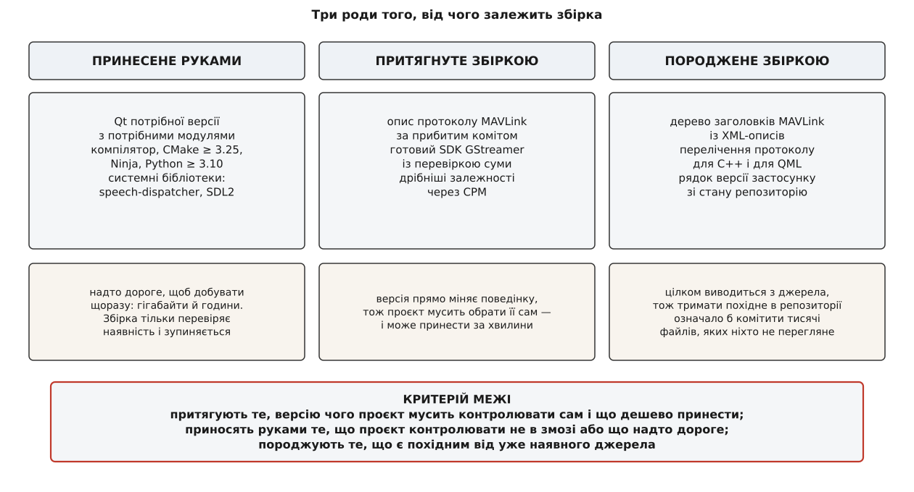
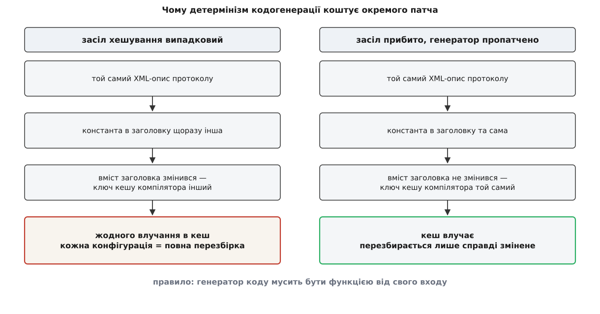
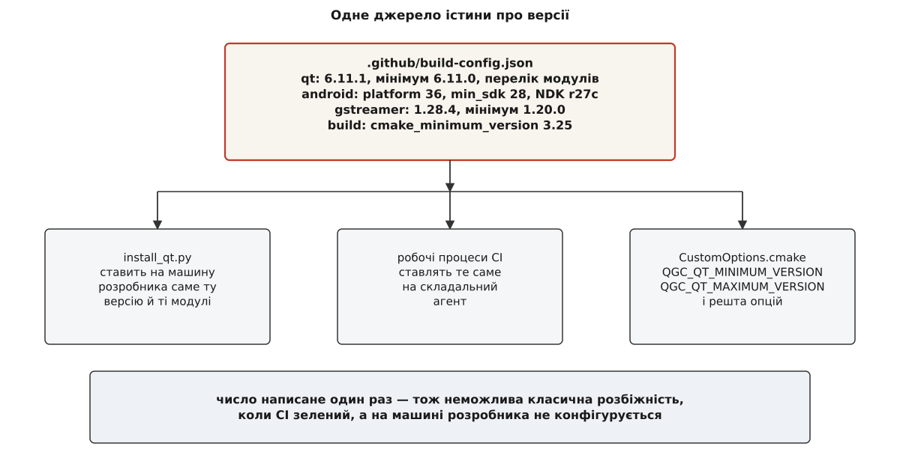
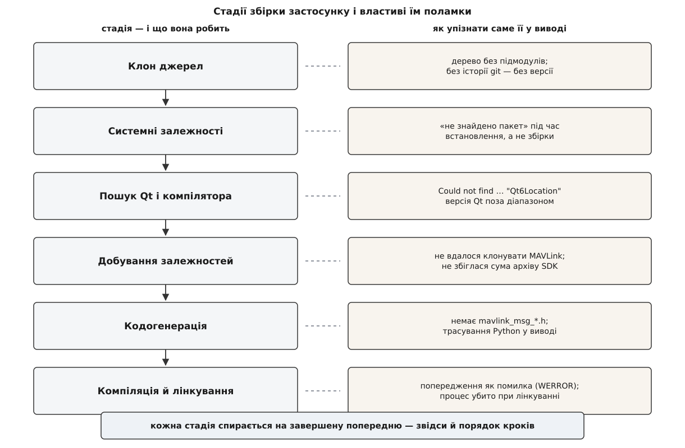

# Збірка QGroundControl: залежності й кроки

<preknowlist>
- [Компіляція](topic:sf-lang/compilation) — компілятор перетворює один текстовий файл на об'єктний, і кожен заголовок, який той файл включає, мусить існувати на диску до початку компіляції.
- [Лінкування](topic:sf-lang/linking) — окремі об'єктні файли й бібліотеки зводяться в один виконуваний файл; це найдовший і найненажерливіший крок збірки.
- [Роль системи збірки](topic:sys-bsystem/build-system-role) — система збірки будує граф робіт із файлів і команд і виконує лише те, що застаріло.
- [Конфігурація й генерація](topic:sys-bsystem/configure-and-generate) — CMake спершу вивчає машину й записує рішення в кеш, потім породжує файли для справжньої системи збірки, і аж потім щось компілюється; усе це — в окремій теці, поза деревом джерел.
- [Мова CMakeLists](topic:sys-bsystem/cmake-language) — змінні, кешовані змінні, `option()`, `set(… CACHE …)` і те, чим кешована змінна відрізняється від звичайної.
- [Система контролю версій](topic:sf-release/version-control) — коміт як незмінна точка історії, на яку можна послатися назавжди.
</preknowlist>

## Файл, якого немає

Візьмімо будь-який файл із теки `src/Vehicle` у початкових текстах QGroundControl і подивімось, що він включає. Серед іншого там буде щось на кшталт `mavlink_msg_heartbeat.h` — заголовок з описом того самого повідомлення, за яким станція впізнає апарат.

Тепер спробуймо знайти цей заголовок у репозиторії. Його там немає. І не тільки його: у клонованому дереві немає жодного заголовка MAVLink, хоча на них спирається добра третина коду застосунку.

Це не недогляд і не поламаний клон. Це головна властивість збірки цього проєкту, і вона пояснює майже все інше: **частина коду, який компілюється, у момент клонування ще не існує**. Її ще треба принести або породити. Тому «зібрати QGroundControl» — не те саме, що «скомпілювати QGroundControl»: компіляція тут лише останній акт довшої вистави.

Звідси й питання, на яке варто відповісти раніше за будь-яку команду в терміналі: **що має бути на машині заздалегідь, що збірка притягне сама, а що вона зробить із нічого — і чому межі між цими трьома проведено саме так, а не інакше.** Знаючи межі, ви читаєте будь-яку помилку збірки як адресу: вона завжди належить одному з трьох родів, і в кожного роду свої причини й свої ліки.

## Три роди залежностей і критерій межі

Розкладімо все, від чого залежить збірка, на три купи.

**Принесене руками.** Компілятор, CMake, Ninja, Python, сам Qt, кілька системних бібліотек. Цього збірка не добуває — вона перевіряє наявність і зупиняється, якщо не знайшла.

**Притягнуте збіркою.** Опис протоколу MAVLink, набір готових бібліотек GStreamer, кілька дрібніших залежностей. Це завантажується з мережі під час конфігурації, у точно вказаній версії.

**Породжене збіркою.** Заголовки MAVLink, перелічення протоколу у вигляді C++ і QML, рядок версії застосунку. Цього немає ніде — ні на машині, ні в мережі; воно постає з інших файлів за допомогою генераторів.

Межа між першою й другою купою виглядає довільною, поки не спитати, **що саме проєкт мусить контролювати сам**.

Версія MAVLink — це частина поведінки застосунку. Візьміть опис протоколу на півроку старший — і зникнуть поля, які станція показує; візьміть новіший — і зміняться числові значення перелічень. Тому версію протоколу проєкт зобов'язаний прибити цвяхом і принести саме ту, яку сам обрав. Ніяка машина розробника не має права підсунути тут свою.

Версія Qt — теж частина поведінки застосунку, і не менша. Але Qt важить кілька гігабайтів, збирається годинами й ставиться інсталятором, який хоче ваш обліковий запис. Притягувати таке під час кожної конфігурації неможливо. Отже:

> **Притягують те, версію чого проєкт мусить контролювати, і що можна принести за хвилини. Приносять руками те, що проєкт контролювати не в змозі або що надто дороге, щоб добувати щоразу.**

А третя купа існує через ще одну причину. Заголовки MAVLink можна було б покласти в репозиторій готовими — вони ж просто текст. Але їх тисячі файлів, вони цілком виводяться з кількох XML-описів, і будь-яка зміна опису вимагала б перегенерувати й закомітити все дерево. Такий комміт неможливо переглянути на рев'ю, і його неможливо перевірити на відповідність джерелу. Тому в репозиторії тримають **джерело**, а похідне роблять щоразу заново.



*Ліворуч — те, що ставиться раз і надовго; посередині — те, що збірка добуває сама у прибитій версії; праворуч — те, чого не існує ніде, поки збірка його не зробить.*

Далі — кожен рід окремо, бо в кожного своя логіка поламок.

## Рід перший: те, що ви ставите руками

### Qt як половина застосунку

QGroundControl вимагає **дуже вузького діапазону версій Qt**. У гілці `master` станом на цей текст мінімум і максимум — 6.11.0 і 6.11.1; стабільна лінія 5.0 прибита рівно до 6.8.3, і документація там просить не пробувати нічого іншого.

Це виглядає як надмірна суворість, поки не подивитися, скільки Qt у цьому застосунку. Кореневий `CMakeLists.txt` просить понад два десятки модулів: `Core`, `Gui`, `Network`, `Qml`, `Quick`, `QuickControls2`, `Location`, `Positioning`, `Multimedia`, `Sensors`, `TextToSpeech`, `Sql`, `Svg`, `Xml`, `HttpServer`, `Quick3D`, `StateMachine`, `Graphs` — і додатково, як необов'язкові, `SerialPort`, `Bluetooth`, `OpenGL`, `Test`.

Це не список бібліотек, якими проєкт користується подекуди. Це фактично каркас: карта — з `Location`, прилади й уся оболонка — з `Quick`, відео — з `Multimedia`, з'єднання — з `SerialPort` і `Bluetooth`, голосові попередження — з `TextToSpeech`. Коли фреймворк тримає стільки поверхонь, кожен його випуск міняє поведінку в десятку місць одразу — і «майже та сама версія» означає «майже той самий застосунок».

Практичний наслідок стосується встановлення. Qt ставиться **модулями**, і онлайн-інсталятор за замовчуванням не ставить ані `Location`, ані `TextToSpeech`, ані `SerialPort`. Тому найчастіша поламка конфігурації тут виглядає так:

```
CMake Error at CMakeLists.txt:
  Could not find a package configuration file provided by "Qt6Location"
```

Це не «зламаний CMake» і не «не та версія Qt» — це буквально відсутній модуль, і лікується він галочкою в інсталяторі Qt. Список потрібних модулів проєкт тримає в себе — в одному файлі конфігурації, звідки його читають і скрипти встановлення, і сам CMake.

### Чому команда називається `qt-cmake`

В інструкціях збірки стоїть не `cmake`, а `qt-cmake`:

```bash
~/Qt/6.11.1/gcc_64/bin/qt-cmake -B build -G Ninja -DCMAKE_BUILD_TYPE=Debug
```

`qt-cmake` — не окрема система збірки й не форк CMake. Це коротка обгортка, яка запускає звичайний CMake, дописавши до нього один аргумент: шлях до **файлу тулчейну** свого встановлення Qt. [Файл тулчейну](topic:sys-bsystem/cmake-toolchain-file) — це набір готових відповідей на питання «яким компілятором, під яку платформу й де шукати пакети», прочитаний CMake ще до першого рядка `CMakeLists.txt`. Qt кладе туди шляхи до власних пакетів і до власних інструментів кодогенерації.

Без цього файлу `find_package(Qt6 …)` шукатиме Qt у системних теках і або не знайде нічого, або знайде чужу версію з дистрибутива. Тому те саме можна написати й звичайним CMake:

```bash
cmake -B build -G Ninja \
      -DCMAKE_TOOLCHAIN_FILE=~/Qt/6.11.1/gcc_64/lib/cmake/Qt6/qt.toolchain.cmake
```

Різниця нульова. Знати це варто тому, що при крос-компіляції файл тулчейну доводиться писати вручну, і тоді `qt-cmake` уже не рятує.

### Решта принесеного

**CMake — не нижче 3.25**, і це число стоїть у першому рядку кореневого `CMakeLists.txt`. **Ninja** — генератор, який усі пресети проєкту вибирають за замовчуванням; він швидший за `make` на графах такого розміру й краще розпаралелює. **Компілятор**: MSVC 2022 на Windows, GCC або Clang на Linux, Xcode на macOS. Де ці три [сімейства компіляторів](topic:sys-bsystem/compiler-families) розходяться в поведінці — окрема довга розмова, але саме розходження й змушують проєкт тримати окремі гілки прапорців для кожного.

**Python — не нижче 3.10.** Він потрібен не застосунку, а збірці: генератори коду написані на Python, і без інтерпретатора конфігурація не дійде до кінця.

**Системні бібліотеки** ставляться одним скриптом:

```bash
python3 tools/setup/install_dependencies --platform debian
```

Усередині — те, чого Qt не дає: `speech-dispatcher` для озвучення попереджень на Linux, SDL2 для читання джойстиків, кілька дрібниць для пакування. У скрипта є гілки для Debian, Fedora, Arch, macOS і Windows, тож він же ставить NSIS чи MSVC там, де цього просять прапорцями.

## Рід другий: те, що збірка притягує

### CPM і прибитий коміт

Добування чужого коду в цьому проєкті йде через **CPM** — тонку обгортку над штатним механізмом CMake для завантаження й підключення сторонніх проєктів. [FetchContent](topic:sys-bsystem/fetchcontent-subprojects) уміє клонувати чужий репозиторій під час конфігурації й додати його як підпроєкт; CPM додає до цього кеш між прогонами та зручніший запис. Виглядає він так:

```cmake
CPMAddPackage(
    NAME mavlink
    GIT_REPOSITORY ${QGC_MAVLINK_GIT_REPO}
    GIT_TAG        ${QGC_MAVLINK_GIT_TAG}
    OPTIONS
        "MAVLINK_DIALECT ${QGC_MAVLINK_DIALECT}"
        "MAVLINK_VERSION ${QGC_MAVLINK_VERSION}"
    PATCHES mavlink-deterministic-mavgen.patch
)
```

Значення цих чотирьох змінних задані в `cmake/CustomOptions.cmake`:

```cmake
set(QGC_MAVLINK_GIT_REPO "https://github.com/mavlink/mavlink.git" CACHE STRING "")
set(QGC_MAVLINK_GIT_TAG  "c409cf690454db6d3e004bd14173bc6c7ff1e0ff" CACHE STRING "")
set(QGC_MAVLINK_DIALECT  "all" CACHE STRING "")
set(QGC_MAVLINK_VERSION  "2.0" CACHE STRING "")
```

Зверніть увагу на `GIT_TAG`: там не тег і не назва гілки, а **сорокасимвольний хеш коміту**. Тег можна пересунути, гілка рухається щодня — а коміт незмінний назавжди. Це найсуворіша форма [закріплення версії](topic:sys-bsystem/version-pinning): збірка, зроблена сьогодні й через рік, візьме буквально ті самі байти протоколу.

Той самий запис показує, як у цьому проєкті **додають власні MAVLink-повідомлення**. Не правкою коду станції — а підміною `QGC_MAVLINK_GIT_REPO` на власний форк репозиторію протоколу, де лежить ваш діалект. Станція про ваше повідомлення нічого не знатиме, поки не перегенерує з нього заголовки, — і в цьому вся [процедура введення власних повідомлень](topic:sys-dron/custom-mavlink-messages) у застосунок.

### Дві опції для пакувальників

У списку опцій є пара, сенс якої не видно з машини розробника:

```cmake
option(QGC_USE_SYSTEM_LIBS  "Віддавати перевагу системним бібліотекам замість завантаження" OFF)
option(QGC_SYSTEM_LIBS_ONLY "Дозволити ЛИШЕ системні бібліотеки"                            OFF)
```

Вони існують заради тих, хто пакує застосунок у дистрибутив. Правила Debian чи Fedora забороняють збірці ходити в мережу: пакет мусить збиратися з того, що вже є в системі, інакше [відтворюваність](topic:sys-bsystem/reproducible-builds) втрачається, а разом із нею — можливість аудиту. Отже, механізм добування має вимикатися повністю, з відмовою замість тихого завантаження. Друга опція саме це й робить: не «спробуй систему, а як нема — качай», а «нема в системі — падай».

### Підмодулів більше немає

Старі інструкції — і чимало сторонніх статей — починаються з `git clone --recursive`. У поточному `master` **у репозиторії немає жодного підмодуля**: файл `.gitmodules` відсутній, і всі зовнішні залежності перейшли на CPM.

Різниця не косметична. [Підмодуль](topic:sys-ide/git-submodules) прив'язує чужий репозиторій до вашого дерева на рівні git: він клонується разом з проєктом, живе в робочій теці й ламається щоразу, коли хтось забув `git submodule update`. CPM натомість тягне залежність у теку збірки, а не в дерево джерел, і робить це на етапі конфігурації, де про це можна сказати зрозумілою помилкою. Ціна — потрібна мережа під час першої конфігурації; виграш — чисте робоче дерево й одне місце, де записані версії.

### GStreamer: не збірка, а завантажений SDK

Відеотракт станції стоїть на GStreamer, і його з джерел ніхто не збирає. Збірка завантажує **готовий SDK** потрібної версії (за замовчуванням 1.28.4, мінімум 1.20.0) і перевіряє контрольну суму архіву; опція `GStreamer_REQUIRE_CHECKSUM` увімкнена, тож нез'ясована сума — це помилка, а не попередження. Причина проста: GStreamer із плагінами — це сотні мегабайтів і години компіляції, а перевірена сума — єдиний захист від підміни на шляху до вас.

Якщо відео вам не потрібне, найшвидший спосіб скоротити збірку — вимкнути весь цей рід:

```bash
qt-cmake -B build -G Ninja -DQGC_ENABLE_GST_VIDEOSTREAMING=OFF
```

Застосунок зібереться без [відеотракту](topic:sys-dron/video-pipeline) — карта, план, телеметрія й параметри працюватимуть, а сторінка відео покаже порожнечу. Для розробки будь-чого, крім відео, це чесний обмін.

## Рід третій: те, що збірка робить із нічого

### Власний Python усередині збірки

Перше, що робить конфігурація перед кодогенерацією, — забезпечує собі **інтерпретатор Python із потрібними пакетами**. Модуль `cmake/modules/PythonVenv.cmake` шукає системний `python3`, перевіряє, що версія не нижча за 3.10, і створює віртуальне середовище `.venv`, куди ставить пакети, потрібні генераторам. Після цього він **примусово** прописує шлях до цього інтерпретатора:

```cmake
set(Python3_EXECUTABLE "${_py}" CACHE FILEPATH "Python interpreter (workspace .venv)" FORCE)
```

Примусовість тут не педантизм. Якби `find_package(Python3)` шукав сам, він міг би взяти системний інтерпретатор — той, у якому немає ані `jinja2`, ані `defusedxml`, потрібних генераторові MAVLink. Помилка вилізла б не тут, а глибоко всередині чужого підпроєкту, у вигляді трасування Python посеред виводу CMake. Прибити інтерпретатор один раз — означає перетворити цілий клас незрозумілих поламок на одну зрозумілу.

### Чому детермінізм генератора коштує окремого патча

Генератор `mavgen` перетворює XML-описи повідомлень на дерево C-заголовків. Разом із повідомленнями він кладе в заголовки константу з хешем вихідного XML — щоб код міг перевірити, що збирався проти того самого опису.

І от у цьому місці ховається пастка, заради якої проєкт возить із собою окремий патч. Хеш обчислювався через вбудовану функцію `hash()` мови Python, а вона **засолена випадковим числом при кожному запуску інтерпретатора**. Це зроблено навмисно й правильно — так захищаються від атак на словники, — але наслідок для збірки руйнівний: два прогони генератора на **тому самому** XML дають заголовки з **різними** константами.

Порахуймо, у що це обходиться.

**Умова: чиста конфігурація проєкту, у якому 1200 файлів включають заголовки MAVLink, кожен компілюється в середньому 1.4 с, кеш компілятора ввімкнено.**

```
перший прогін: генерація заголовків             → константа A
компіляція 1200 файлів × 1.4 с                  = 1680 с процесорного часу
                                                  (записано в кеш під ключем A)

друга конфігурація, той самий XML:
генерація заголовків                            → константа B ≠ A
вміст заголовка змінився → ключ кешу інший
влучань у кеш                                   = 0
компіляція 1200 файлів × 1.4 с                  = 1680 с знову
```

Кеш компілятора порівнює **вміст** входів, а не їхні дати. Один змінений байт у заголовку, який включає весь проєкт, знецінює кеш цілком — і кожна нова конфігурація стає повною перезбіркою. Патч прибирає джерело недетермінізму, а фіксований `PYTHONHASHSEED` довершує справу: однаковий вхід дає однаковий вихід, і кеш нарешті починає влучати.



*Ліворуч: різна константа в заголовку — інший ключ кешу — повна перезбірка. Праворуч: прибитий засіл хешування — той самий заголовок — кеш влучає.*

> 🔧 **Навіщо це.** Правило переносне на будь-який проєкт із кодогенерацією: **генератор мусить бути функцією від входу**. Дата, випадкове число, шлях до теки збірки чи ім'я користувача, що потрапили у згенерований файл, не ламають збірку одразу — вони тихо вимикають усі кеші й роблять кожну збірку повною. Помітити це важко саме тому, що результат правильний, лише дуже повільний.

### Три генератори й навіщо кожен

Крім самих заголовків протоколу, збірка породжує ще кілька файлів, і кожен закриває конкретну дірку.

`mavlink_enums.py` бере перелічення протоколу — режими польоту, типи апаратів, коди результату команд — і виписує їх у вигляді C++-заголовка **і** реєстрації для QML. Без цього кроку оболонка не мала б імен констант протоколу й мусила б дублювати числа руками; а числа в MAVLink змінюються разом із діалектом.

`mavlink_instance_fields.py` будує відповідність між повідомленнями та їхніми полями — те, що дозволяє показувати довільне поле телеметрії, не пишучи під кожне окремого коду.

Модуль `cmake/modules/Git.cmake` дістає з репозиторію опис поточної ревізії й подає його всередину застосунку. Тому число, яке станція показує у «Про програму», — це не константа в коді, а слід стану git на момент збірки; звідси й [модель релізів](topic:sys-dron/release-model), де денна збірка позначає себе інакше, ніж стабільна. Практичний наслідок неочевидний: зібраний із zip-архіву GitHub застосунок про свою версію не знає нічого, бо в архіві немає історії git.

Механіку кодогенерації варто побачити зблизька — [як із XML-опису повідомлення постає C-заголовок і що саме в ньому з'являється](topic:sys-dron/building-qgc/proj-mavlink-codegen.md), включно з тим, як прогнати генератор руками й подивитися на результат.

## Один файл, з якого все дізнається про версії

Тепер незручне питання. Версія Qt потрібна щонайменше трьом сторонам: скриптові, який ставить Qt на машину розробника; робочому процесові CI, який ставить Qt на складальний агент; і самому CMake, який мусить відмовитися конфігуруватися під чужою версією. Якщо число написане в трьох місцях, рано чи пізно воно розійдеться — і найтиповіший вияв цього відомий кожному: **CI зелений, а локально не збирається**.

Проєкт розв'язує це одним джерелом істини. Файл `.github/build-config.json` тримає всі числа:

```json
{
  "qt":      { "version": "6.11.1", "minimum_version": "6.11.0",
               "modules": ["qtlocation", "qtpositioning", "qtspeech",
                           "qtmultimedia", "qtserialport", "qtconnectivity", "…"] },
  "android": { "platform": 36, "min_sdk": 28,
               "ndk": "r27c", "java": 21 },
  "gstreamer": { "version": { "default": "1.28.4", "minimum": "1.20.0" } },
  "build":   { "cmake_minimum_version": "3.25" }
}
```

Скрипт `tools/setup/read_config.py` читає цей файл і викладає значення назовні, а `CustomOptions.cmake` бере їх уже готовими:

```cmake
set(QGC_QT_MINIMUM_VERSION "${QGC_CONFIG_QT_MINIMUM_VERSION}" CACHE STRING "…")
set(QGC_QT_MAXIMUM_VERSION "${QGC_CONFIG_QT_VERSION}"         CACHE STRING "…")
```

Тими самими значеннями користуються `install_qt.py` і робочі процеси GitHub Actions. Одне число — три споживачі.



*Версії живуть в одному файлі; скрипт установлення, CI та CMake читають їх звідти, а не з власних копій.*

> 🔧 **Навіщо це.** Коли конфігурація каже «Qt 6.10.0 не входить у підтримуваний діапазон», ви одразу знаєте, де правити й чого це коштуватиме. Правити треба не `CMakeLists.txt`, а `.github/build-config.json` — і та сама правка автоматично зачепить CI. Це водночас і зручність, і запобіжник: підняти версію Qt «тільки в себе», не зачепивши всіх, тут навмисно неможливо.

Разом із версіями в опціях живе ще одна цікава дрібниця — `QGC_SETTINGS_VERSION`, зараз рівна `"9"`. Це число зашивається в застосунок і порівнюється зі збереженим; розбіжність означає, що [збережені налаштування](topic:sys-dron/settings-persistence) стирають повністю. Тобто рішення «стерти всім користувачам налаштування при оновленні» ухвалюється не в коді застосунку, а в параметрі збірки.

Повний перелік опцій — імена, типи, значення за замовчуванням і те, на що кожна впливає — зібрано окремо: [довідник опцій збірки](topic:sys-dron/building-qgc/api-build-options.md).

## Кроки, і чому саме в такому порядку

Тепер сама процедура. Вона коротка — уся змістовність у тому, що на кожному кроці вже мусить бути зроблено.

```bash
# 1. джерела — без --recursive, підмодулів немає
git clone -j8 https://github.com/mavlink/qgroundcontrol.git
cd qgroundcontrol

# 2. системні залежності (потрібні root на Linux)
python3 tools/setup/install_dependencies --platform debian

# 3. Qt потрібної версії з потрібними модулями — окремо, інсталятором Qt

# 4. конфігурація: перевірка машини, добування, підготовка генераторів
~/Qt/6.11.1/gcc_64/bin/qt-cmake -B build -G Ninja -DCMAKE_BUILD_TYPE=Debug

# 5. збірка: кодогенерація, компіляція, лінкування
cmake --build build

# 6. запуск
./build/QGroundControl
```

Порядок диктується залежностями, а не звичкою. Крок 4 не може передувати кроку 3, бо конфігурація перше, що робить, — шукає Qt. Кодогенерація не може передувати конфігурації, бо саме конфігурація здобуває XML-описи й будує віртуальне середовище Python. А компіляція не може передувати кодогенерації з найпростішої причини: половини заголовків, які включає код, на диску ще немає.

Найдовший тут — крок 4, і саме він найчастіше падає. Це нормально й навіть добре: [конфігурація](topic:sys-bsystem/configure-and-generate) для того й існує, щоб усі неприємні відкриття сталися до того, як ви витратили годину процесорного часу.



*Стадії йдуть згори вниз; праворуч — типова поламка кожної, за якою стадію впізнають у виводі.*

### Пресети замість довгого рядка

Тримати в голові набір прапорців для кожної конфігурації нікому не хочеться, тож проєкт користується [пресетами CMake](topic:sys-bsystem/cmake-presets) — іменованими наборами налаштувань у JSON. Влаштовано це двоповерхово. У корені лежить не готовий файл, а **шаблон** `CMakePresets.json.template`:

```json
{
  "version": 5,
  "cmakeMinimumRequired": { "major": 3, "minor": 25, "patch": 0 },
  "include": [
    "cmake/presets/common.json",
    "cmake/presets/Android.json", "cmake/presets/iOS.json",
    "cmake/presets/Linux.json",   "cmake/presets/macOS.json",
    "cmake/presets/Windows.json"
  ]
}
```

Ви копіюєте його в `CMakePresets.json` — і далі цей файл ваш: можна дописати власні пресети, не воюючи з апстримом за той самий файл при кожному оновленні.

У `common.json` лежать приховані заготовки — `debug` (тип збірки Debug, тести й зневадження QML увімкнені), `release` (навпаки), `ccache`, `coverage`. Платформні файли їх успадковують і додають своє: `Linux-debug` — це `debug` плюс генератор Ninja плюс тулчейн Qt плюс тека збірки поруч із деревом джерел. Тоді вся конфігурація вміщається в рядок:

```bash
cmake --preset Linux-debug
cmake --build --preset Linux-debug
```

Окремі пресети є й для пакування: `Linux-deb` і `Linux-rpm` відрізняються від звичайного `Linux` єдиним значенням — `QGC_CPACK_GENERATOR`.

## Чому це так довго і як заважає пам'ять

Повна збірка QGroundControl займає десятки хвилин навіть на добрій машині, і проєкт має для цього кілька важелів.

`QGC_USE_CACHE` (увімкнена) підключає `ccache` — кеш компілятора, який віддає готовий об'єктний файл, якщо такий самий вхід уже компілювався. `QGC_USE_MOCCACHE` робить те саме для метаоб'єктного компілятора Qt, який породжує додатковий C++ із заголовків. `QGC_UNITY_BUILD` (вимкнена) склеює файли групами, щоб компілятор менше разів розбирав ті самі заголовки. `QT_QML_NO_CACHEGEN` у Debug вимикає попередню компіляцію QML — інтерфейс завантажується повільніше, зате перезбірка після правки одного файла QML миттєва. Загальна механіка цих важелів — тема [швидкості збірки](topic:sys-bsystem/build-speed); тут важливий сам факт, що всі вони вже підключені й керуються опціями.

Окремо стоїть опція, сенсу якої не видно, поки не наступиш:

```cmake
set(QGC_LINK_PARALLEL_LEVEL "2" CACHE STRING "Максимум паралельних завдань лінкування")
```

Чому саме лінкування обмежують окремо від компіляції? Бо компіляція й лінкування витрачають пам'ять по-різному. Компілятор тримає в пам'яті одну одиницю трансляції; лінкувальник — **усі** об'єктні файли й таблиці символів застосунку одразу.

**Умова: 16 логічних ядер, Ninja без обмежень, пік лінкувальника на цьому проєкті — близько 2.5 ГБ.**

```
компіляція:  16 процесів × ~0.4 ГБ   = 6.4  ГБ    — терпимо
лінкування:  16 процесів × ~2.5 ГБ   = 40   ГБ    — на машині з 16 ГБ це OOM
з обмеженням: 2 процеси × ~2.5 ГБ    = 5    ГБ    — вміщається
```

Ninja не розрізняє роди робіт сам — для нього і компіляція, і лінк просто вершини [графа](topic:sys-bsystem/dependency-graph). Тому проєкт заводить окремий пул завдань саме для лінкування. Симптом, який це лікує, впізнаваний: збірка доходить майже до кінця й гине з `Killed` без жодного пояснення, бо процес убила система, а не компілятор.

## Що виходить наприкінці

Скомпільований бінарник — ще не те, що віддають користувачеві: йому бракує бібліотек Qt, плагінів, ресурсів і форми, у якій операційна система вміє це ставити. Тому за збіркою йде пакування:

```bash
cmake --install build --config Release
```

На Linux із цього виходить AppImage (або пакет DEB чи RPM, якщо обрано відповідний пресет), на Windows — інсталятор NSIS, на macOS — підписаний бандл, на Android — APK. Кожна з цих форм має власні вимоги — підписи, маніфести, розкладку тек, — і саме тут [цілі трьох платформ](topic:sys-dron/platform-targets) розходяться найсильніше. Механіка самого пакування — це [CPack](topic:sys-bsystem/cpack), штатна частина CMake, яка з опису встановлення робить дистрибутив.

Android варто згадати окремо, бо він єдиний вимагає справжньої [крос-компіляції](topic:sys-bsystem/cross-compilation): збірка йде на одній машині, а код виходить під зовсім інший процесор і зовсім іншу систему. До Qt тут додається набір інструментів NDK, JDK і рівні API Android — у поточному конфігурі це NDK r27c, Java 21, компіляція під рівень 36 із мінімальним 28. Ці числа не довільні: [рівень API](topic:sys-bsystem/android-ndk-nuances) визначає, які пристрої зможуть поставити застосунок, а версія NDK — які системні виклики доступні коду.

## Три двері, крізь які додають своє

Модель трьох родів дає готову відповідь і на друге питання — куди вставляти власне.

**Вимкнути зайве — опціями.** `QGC_DISABLE_APM_PLUGIN`, `QGC_DISABLE_PX4_PLUGIN`, `QGC_DISABLE_APM_MAVLINK`, `QGC_NO_SERIAL_LINK`, `QGC_ENABLE_GST_VIDEOSTREAMING=OFF`. Це найдешевший спосіб отримати меншу станцію: якщо ваш апарат — тільки PX4, підтримку ArduPilot можна не тягнути ані кодом, ані діалектом протоколу.

**Додати своє повідомлення — через рід другий.** Власний форк репозиторію MAVLink у `QGC_MAVLINK_GIT_REPO` — і генератор зробить заголовки вашого діалекту разом з усіма іншими. Код станції при цьому не змінюється жодним рядком.

**Змінити сам застосунок — накладкою `custom/`.** Якщо в корені є тека з іменем із `QGC_CUSTOM_DIR` (за замовчуванням `custom`), кореневий `CMakeLists.txt` підхоплює звідти файл перевизначень і додає теку як підпроєкт, а в код йде означення `QGC_CUSTOM_BUILD`. Так замінюють ім'я застосунку, значки, набір екранів і поведінку — не торкаючись жодного файлу апстриму, а отже, без болю приймаючи оновлення. Механізм підміни цілком тримається на [ядровому розширенні](topic:sys-dron/core-plugin), а те, як із цього складають готовий вендорський продукт, — предмет [власної збірки](topic:sys-dron/custom-build). Зразок такої теки лежить в апстримі як `custom-example`, і починати найпростіше копіюванням саме його.

Якщо ж зміна призначена не вам одному, її кінцева адреса — апстрим, а там свої вимоги до оформлення й [процес рев'ю](topic:sys-dron/contributing).

## Як читати поламку

Збірка цього проєкту переходила з qmake на CMake, і перехід був не косметичним: [він змінив і спосіб опису проєкту, і те, як підключаються залежності](topic:sys-dron/building-qgc/hist-qmake-to-cmake.md). Сліди старого світу досі трапляються в чужих інструкціях — звідси й поради на кшталт `--recursive`, які тепер лише збивають з пантелику.

Тому корисніше за будь-який перелік команд — звичка ставити перед кожною помилкою збірки одне питання: **до якого з трьох родів вона належить?**

Не знайдено `Qt6Location`, не знайдено компілятора, не той стандарт C++ — це рід перший, і правити треба середовище, а не проєкт. Не вдалося клонувати репозиторій MAVLink, не збіглася контрольна сума архіву GStreamer, «system libs only», а бібліотеки в системі немає — це рід другий, і йдеться про мережу, дзеркала й опції добування. Немає заголовка `mavlink_msg_*`, генератор упав із трасуванням Python, перелічення не з'явилися в QML — це рід третій, і шукати треба зламаний генератор або не той інтерпретатор, а не відсутній файл.

Окремо стоїть один клас помилок, який не належить жодному роду й тому регулярно збиває з пантелику. `QGC_ENABLE_WERROR` увімкнена за замовчуванням: будь-яке попередження компілятора стає помилкою. Новіший компілятор, ніж той, під який писали код, вміє попереджати про більше — і бездоганний код перестає збиратися на свіжому дистрибутиві. Це не поламка проєкту й не ваша помилка; це свідомо обраний режим, який у чужій збірці вимикають одним прапорцем, а в апстримі виправляють кодом.
