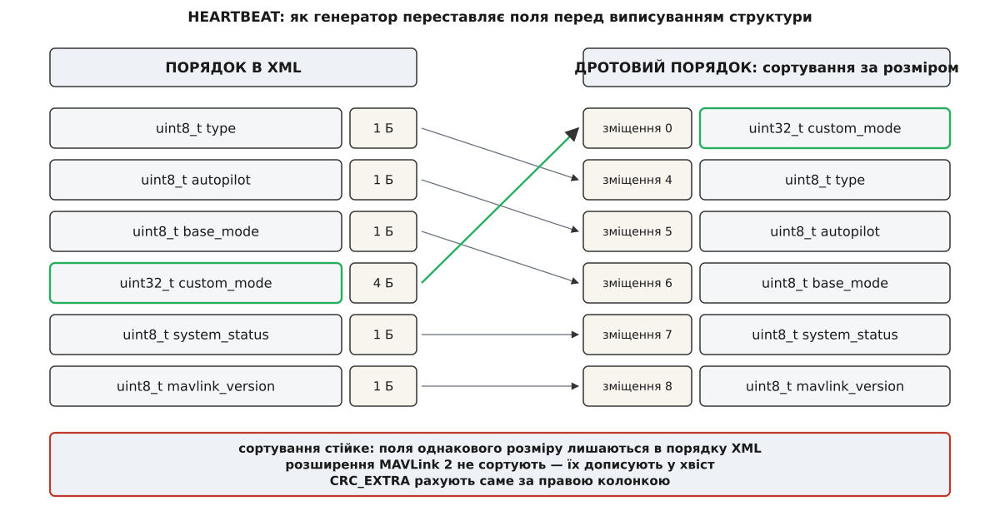
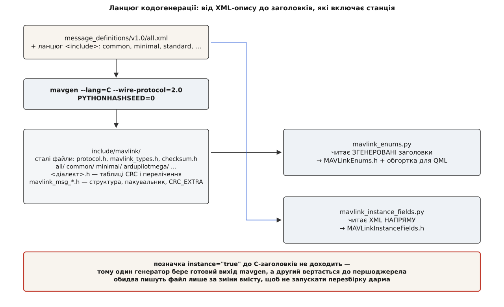

# ⚙️ Проганяємо mavgen руками: як із восьми рядків XML постає C-заголовок

Заголовка `mavlink_msg_heartbeat.h` немає ні в репозиторії станції, ні в репозиторії самого MAVLink — його щоразу виготовляє генератор, і зробити це можна руками, поза CMake, однією командою. Тоді видно обидва кінці: вісім рядків XML на вході й кількасот рядків C на виході, де кожне число виводиться й перевіряється самотужки.

Далі — саме такий прогін, а потім два власні генератори станції, які добудовують те, чого генератор протоколу не вміє. Загальний погляд на кодогенерацію з боку протоколу — [генерація коду з XML-опису MAVLink](topic:sys-dron/mavlink-xml-codegen): один опис, з якого роблять бібліотеки десятком мов; тут же нас цікавить рівно та гілка, якою користується збірка QGroundControl, — мова C, версія протоколу 2.0.

## Вхід: опис повідомлення

Ось `HEARTBEAT` із `message_definitions/v1.0/minimal.xml`, з вирізаними описами полів:

```xml
<message id="0" name="HEARTBEAT">
  <field type="uint8_t"  name="type"           enum="MAV_TYPE">…</field>
  <field type="uint8_t"  name="autopilot"      enum="MAV_AUTOPILOT">…</field>
  <field type="uint8_t"  name="base_mode"      enum="MAV_MODE_FLAG">…</field>
  <field type="uint32_t" name="custom_mode">…</field>
  <field type="uint8_t"  name="system_status"  enum="MAV_STATE">…</field>
  <field type="uint8_t_mavlink_version" name="mavlink_version">…</field>
</message>
```

Тут уже видно все, що генераторові потрібно: номер повідомлення, імена й типи полів, посилання на перелічення й один магічний тип. `uint8_t_mavlink_version` — не тип даних, а вказівка: це поле не аргумент, його заповнює сам протокол. Що станція робить із цим повідомленням далі — предмет окремої розмови про [HEARTBEAT](topic:sys-dron/mavlink-heartbeat), бо саме за ним вона впізнає апарат і рахує, чи той ще живий.

## Прогін

Збірка QGroundControl не викликає генератор сама: вона додає репозиторій MAVLink як підпроєкт, а той у власному `CMakeLists.txt` робить ось що (це справжній код апстриму, скорочений):

```cmake
add_custom_command(OUTPUT ${EXAMPLE_HEADER}
    COMMAND ${Python_EXECUTABLE}
        -m pip install -r pymavlink/requirements.txt --upgrade
           -t ${CMAKE_CURRENT_BINARY_DIR}/pip-dependencies/
    COMMAND ${CMAKE_COMMAND} -E env
        "PYTHONPATH=${CMAKE_CURRENT_BINARY_DIR}/pip-dependencies/" ${Python_EXECUTABLE}
        -m pymavlink.tools.mavgen
        --lang=C
        --wire-protocol=${MAVLINK_VERSION}
        --output ${CMAKE_CURRENT_BINARY_DIR}/include/mavlink/
        message_definitions/v1.0/${MAVLINK_DIALECT}.xml
    DEPENDS message_definitions/v1.0/${MAVLINK_DIALECT}.xml
    COMMENT "Generating C and C++11 headers")
```

Прибравши обгортку CMake, дістаємо голу команду. Її можна виконати в порожній теці:

```bash
python3 -m venv .venv-mavgen
. .venv-mavgen/bin/activate
pip install pymavlink

git clone https://github.com/mavlink/mavlink.git
cd mavlink

PYTHONHASHSEED=0 python -m pymavlink.tools.mavgen \
    --lang=C --wire-protocol=2.0 \
    --output=/tmp/mavlink-headers \
    message_definitions/v1.0/all.xml
```

`all.xml` — той діалект, який станція бере за замовчуванням (`QGC_MAVLINK_DIALECT` дорівнює `all`): він через ланцюг `<include>` тягне за собою `common`, `minimal`, `standard`, `development`, `ardupilotmega` й решту, тож на виході буде дерево для кожного з них.

Одна відмінність від збірки все ж лишається, і про неї варто знати. Генератор ставиться тут із PyPI, а збірка бере `pymavlink`, прибитий підмодулем усередині репозиторію MAVLink на конкретному коміті. Версії можуть розійтися — тож руками ми дивимося на механіку, а не звіряємо байти зі складальним агентом.

## Що вийшло

```
/tmp/mavlink-headers/
├── protocol.h            mavlink_types.h      checksum.h
├── mavlink_helpers.h     mavlink_conversions.h  mavlink_sha256.h
├── mavlink_get_info.h
├── all/
│   ├── mavlink.h         all.h                version.h
│   ├── mavlink_msg_heartbeat.h
│   ├── mavlink_msg_sys_status.h
│   └── …                 (по файлу на кожне повідомлення діалекту)
├── common/               minimal/             standard/
└── ardupilotmega/        development/         …
```

Верхній рівень — сталі файли: їх генератор не складає, а копіює зі свого дерева незмінними. Уся кодогенерація живе в підтеках діалектів: `<діалект>.h` із таблицями й переліченнями, `mavlink.h` як єдина законна точка входу, `version.h` і по одному заголовку на повідомлення.

## Перше, що впадає в око: поля переставлені

```c
typedef struct __mavlink_heartbeat_t {
 uint32_t custom_mode;
 uint8_t type;
 uint8_t autopilot;
 uint8_t base_mode;
 uint8_t system_status;
 uint8_t mavlink_version;
} mavlink_heartbeat_t;
```

В XML `custom_mode` стояло четвертим, а в структурі воно перше. Це не примха генератора, а правило протоколу, і в коді воно займає чотири рядки:

```python
sort_end = m.base_fields()
m.ordered_fields = sorted(m.fields[:sort_end],
                          key=operator.attrgetter('type_length'),
                          reverse=True)
m.ordered_fields.extend(m.fields[sort_end:])
```

Поля впорядковують за розміром типу — від більших до менших. Сортування стійке, тож поля однакового розміру зберігають порядок з XML. Розширення MAVLink 2 (усе після позначки `<extensions/>`) не сортують взагалі: вони дописуються в хвіст у порядку оголошення, бо старий приймач мусить читати початок пакета так само, як і новий.

Причина сортування — [вирівнювання](topic:sf-apps/memory-alignment): процесор читає чотирибайтове число швидко (а деякі архітектури — узагалі лише тоді), коли його адреса кратна чотирьом. Якби `custom_mode` лишилося на четвертій позиції за XML, воно почалося б зі зміщення 3, і структуру довелося б або читати побайтово, або дозволити компіляторові вставити доповнення — а доповнення в дротовому форматі неприпустиме. Сортування за спаданням розміру розв'язує обидві задачі одразу: більші поля лягають на кратні адреси природно, а щільність пакування лишається стовідсотковою.



*Ліворуч — як записано в XML; праворуч — дротовий порядок зі зміщеннями, за яким генератор виписує і структуру, і пакувальник, і контрольну суму розкладки.*

## Пакувальник — це розкладка байтів за зміщеннями

Поруч зі структурою генератор кладе чотири числа:

```c
#define MAVLINK_MSG_ID_HEARTBEAT 0
#define MAVLINK_MSG_ID_HEARTBEAT_LEN 9
#define MAVLINK_MSG_ID_HEARTBEAT_MIN_LEN 9
#define MAVLINK_MSG_ID_HEARTBEAT_CRC 50
```

І функцію, яка з окремих аргументів робить корисне навантаження:

```c
static inline uint16_t mavlink_msg_heartbeat_pack(
        uint8_t system_id, uint8_t component_id, mavlink_message_t* msg,
        uint8_t type, uint8_t autopilot, uint8_t base_mode,
        uint32_t custom_mode, uint8_t system_status)
{
#if MAVLINK_NEED_BYTE_SWAP || !MAVLINK_ALIGNED_FIELDS
    char buf[MAVLINK_MSG_ID_HEARTBEAT_LEN];
    _mav_put_uint32_t(buf, 0, custom_mode);
    _mav_put_uint8_t(buf, 4, type);
    _mav_put_uint8_t(buf, 5, autopilot);
    _mav_put_uint8_t(buf, 6, base_mode);
    _mav_put_uint8_t(buf, 7, system_status);
    _mav_put_uint8_t(buf, 8, 3);
    memcpy(_MAV_PAYLOAD_NON_CONST(msg), buf, MAVLINK_MSG_ID_HEARTBEAT_LEN);
#else
    mavlink_heartbeat_t packet;
    packet.custom_mode = custom_mode;
    /* … решта полів … */
    packet.mavlink_version = 3;
    memcpy(_MAV_PAYLOAD_NON_CONST(msg), &packet, MAVLINK_MSG_ID_HEARTBEAT_LEN);
#endif
    msg->msgid = MAVLINK_MSG_ID_HEARTBEAT;
    return mavlink_finalize_message(msg, system_id, component_id,
                                    MAVLINK_MSG_ID_HEARTBEAT_MIN_LEN,
                                    MAVLINK_MSG_ID_HEARTBEAT_LEN,
                                    MAVLINK_MSG_ID_HEARTBEAT_CRC);
}
```

Дві гілки роблять те саме різною ціною. На машині з потрібним порядком байтів і дозволеним невирівняним доступом структуру просто копіюють у буфер одним `memcpy`. В усіх інших випадках кожне поле кладуть окремо за явним зміщенням, а `_mav_put_uint32_t` дорогою переставляє байти. Зміщення 0, 4, 5, 6, 7, 8 — це та сама відсортована розкладка, тільки виписана числами.

Двох речей у сигнатурі немає. `mavlink_version` не аргумент, а константа `3`: магічний тип із XML перетворився в `omit_arg` і зашите значення версії. І `msgid` теж не аргумент — його підставляє генератор, бо номер належить повідомленню, а не викликові.

Розпакувальна функція дзеркальна, з однією особливістю:

```c
static inline void mavlink_msg_heartbeat_decode(const mavlink_message_t* msg,
                                                mavlink_heartbeat_t* heartbeat)
{
    uint8_t len = msg->len < MAVLINK_MSG_ID_HEARTBEAT_LEN
                  ? msg->len : MAVLINK_MSG_ID_HEARTBEAT_LEN;
    memset(heartbeat, 0, MAVLINK_MSG_ID_HEARTBEAT_LEN);
    memcpy(heartbeat, _MAV_PAYLOAD(msg), len);
}
```

Прийнятий пакет може бути **коротшим** за структуру. MAVLink 2 відрізає нульові байти з хвоста корисного навантаження перед відправкою — рівно тому в заголовку два числа довжини, `LEN` і `MIN_LEN`. Тому розпакувальник спершу занулює структуру, а потім копіює стільки, скільки реально прийшло: обрізане знову стає нулями. Механіка самого пакета — заголовок, обрізання, підпис — розібрана в темі [пакет MAVLink](topic:sys-dron/mavlink-packet).

## CRC_EXTRA: підпис розкладки, а не даних

Звідки взялася п'ятдесятка в `MAVLINK_MSG_ID_HEARTBEAT_CRC`? Це не контрольна сума даних — дані ще не існують у момент генерації. Це контрольна сума **опису** повідомлення:

```python
def message_checksum(msg):
    crc = x25crc()
    crc.accumulate_str(msg.name + ' ')
    crc_end = msg.base_fields()
    for i in range(crc_end):
        f = msg.ordered_fields[i]
        crc.accumulate_str(f.type + ' ')
        crc.accumulate_str(f.name + ' ')
        if f.array_length:
            crc.accumulate([f.array_length])
    return (crc.crc & 0xFF) ^ (crc.crc >> 8)
```

Порахуймо самі.

**Умова: повідомлення HEARTBEAT, шість базових полів у дротовому порядку, розширень немає.**

```
рядок, що подається в суму:
"HEARTBEAT uint32_t custom_mode uint8_t type uint8_t autopilot
 uint8_t base_mode uint8_t system_status uint8_t mavlink_version "

CRC-16/MCRF4XX над цим рядком   = 0x2C1E
згортання в один байт:
crc_extra = (0x2C1E & 0xFF) ⊕ (0x2C1E >> 8)
          = 0x1E ⊕ 0x2C
          = 0x32 = 50
```

Збіглося з `#define MAVLINK_MSG_ID_HEARTBEAT_CRC 50` — саме це число генератор і виписав.

Три деталі в цьому обчисленні варті уваги. Ім'я типу й ім'я поля входять у суму, а опис і одиниці — ні: змінити коментар безпечно, змінити тип поля — ні. Поля беруться у **дротовому** порядку, тобто в тому, що вплине на розкладку байтів. І розширення виключено навмисно: дописати поле в хвіст можна без розриву сумісності, а вставити в середину — ні.

Далі це число працює як запобіжник. Відправник дописує його в кінець даних перед обчисленням контрольної суми пакета, приймач робить те саме зі своїм значенням:

```c
static inline void crc_accumulate(uint8_t data, uint16_t *crcAccum)
{
        uint8_t tmp;
        tmp = data ^ (uint8_t)(*crcAccum & 0xff);
        tmp ^= (tmp << 4);
        *crcAccum = (*crcAccum >> 8) ^ (tmp << 8) ^ (tmp << 3) ^ (tmp >> 4);
}
```

Якщо сторони зібрані з різних XML і поле десь поміняло тип, суми не збігаються — і пакет відкидається як пошкоджений, замість того щоб бути прочитаним неправильно. Це головна причина, чому версію опису протоколу проєкт прибиває комітом, а не тегом. Чому саме [CRC](topic:com-modulation/crc) годиться на роль такого підпису — окрема тема: важливо, що одного байта досить, аби зловити типову зміну опису, і що коштує він нуль додаткових байтів в ефірі.

## Дві таблиці, які бачить парсер

У заголовку діалекту `all/all.h` генератор виписує всі ці числа однією таблицею:

```c
#define MAVLINK_MESSAGE_CRCS {{0, 50, 9, 9, 0, 0, 0}, {1, 124, 31, 31, 0, 0, 0}, …}
```

Кожен запис — це `mavlink_msg_entry_t`: номер повідомлення, `crc_extra`, мінімальна довжина, максимальна довжина, прапорці й два зміщення — де в навантаженні лежать `target_system` і `target_component`. Останні два поля — це те, чим станція користується для маршрутизації: щоб зрозуміти, кому адресовано пакет, не розпаковуючи його цілком.

Шукає в цій таблиці ось що:

```c
MAVLINK_HELPER const mavlink_msg_entry_t *mavlink_get_msg_entry(uint32_t msgid)
{
	static const mavlink_msg_entry_t mavlink_message_crcs[] = MAVLINK_MESSAGE_CRCS;
        /* двійковий пошук; таблиця вважається впорядкованою за msgid */
```

Звідси випливає вимога, яку легко проґавити: таблиця мусить бути відсортована за номером повідомлення, і за це відповідає генератор. Пакет із номером, якого в таблиці немає, парсер відкидає ще до перевірки суми — бо не знає, яким байтом її засівати.

Друга таблиця, `MAVLINK_MESSAGE_INFO`, описує поля кожного повідомлення для друку й розбору за іменами. Її генератор виписує **не завжди**:

```c
#if MAVLINK_ALL_XML_HASH == MAVLINK_PRIMARY_XML_HASH
# define MAVLINK_MESSAGE_INFO {…}
# define MAVLINK_MESSAGE_NAMES {{ "HEARTBEAT", 0 }, …}
#endif
```

Діалектів у дереві багато, а таблиця має бути одна — та, що належить головному діалекту збірки. Ось для цього порівняння й існує константа, з якою пов'язана найдорожча пастка цієї збірки.

## Константа, яка тихо вбивала кеш

У `mavlink.h` генератор пише `#define MAVLINK_PRIMARY_XML_HASH …`, а в кожному заголовку діалекту — `#define MAVLINK_<ДІАЛЕКТ>_XML_HASH …`. Обчислюється це значення так:

```python
xml.xml_hash = hash(xml.basename)
```

Тобто це хеш **імені файлу**, а не його вмісту. Як контрольна сума опису воно не означає нічого; його єдина робота — дати заголовкам спосіб спитати «а я головний?». Для цього достатньо будь-якої функції, що розрізняє імена.

Але `hash()` для рядків у Python засолюється випадковим числом при кожному запуску інтерпретатора — це захист від атак на словники. Наслідок видно з двох команд:

```
$ python -c "print(hash('all'))"
1573364726182299773
$ python -c "print(hash('all'))"
6099502452787417362

$ PYTHONHASHSEED=0 python -c "print(hash('all'))"
-8881249315247590295
$ PYTHONHASHSEED=0 python -c "print(hash('all'))"
-8881249315247590295
```

Тепер найцікавіше: **логіка від цього не ламалася жодного разу**. Усі діалекти генеруються одним процесом, а отже з одним засолом — порівняння `MAVLINK_ALL_XML_HASH == MAVLINK_PRIMARY_XML_HASH` завжди давало правильну відповідь. Різнилися лише прогони між собою. Тому помилка не виявлялася як поламка: заголовки щоразу були правильні, просто інші — і кеш компілятора, який порівнює вміст входів, не влучав у жоден із них. Збірка лишалася коректною й ставала повною.

Патч, який станція возить із собою, виправляє це однією зміною рядка:

```diff
-        COMMAND ${CMAKE_COMMAND} -E env "PYTHONPATH=…/pip-dependencies/" ${Python_EXECUTABLE}
+        COMMAND ${CMAKE_COMMAND} -E env "PYTHONPATH=…/pip-dependencies/" "PYTHONHASHSEED=0" ${Python_EXECUTABLE}
```

> 🔧 **Навіщо це.** Найдорожчі помилки кодогенерації — ті, що не міняють поведінку. Поламаний генератор помічають за годину; генератор, який видає щоразу інший, але однаково правильний текст, живе роками й мовчки коштує повну перезбірку щоразу. Шукати такі місця треба не в поведінці програми, а в різниці двох прогонів: згенеруйте двічі й порівняйте побайтово.

Одна щілина лишається й після патча. `PYTHONHASHSEED=0` вимикає випадковість, але не робить значення сталим назавжди: алгоритм хешування рядків залежить від версії інтерпретатора, і після оновлення Python константа зміниться раз. Це вже терпимо — один промах кешу на оновлення замість промаху на кожну конфігурацію.

## Два генератори, які станція додає від себе

Заголовків протоколу станції замало, і `src/MAVLink/CMakeLists.txt` доганяє двома власними кроками. Обидва — [власні команди CMake](topic:sys-bsystem/custom-commands) з явними виходами й залежностями, тож повторно запускаються лише тоді, коли змінився вхід.



*Перелічення беруть із уже згенерованих заголовків, а позначку instance — просто з XML, бо в заголовки вона не потрапляє.*

### `mavlink_enums.py`: перелічення для C++ і для QML

```cmake
add_custom_command(
    OUTPUT "${MAVLINK_ENUMS_H}" "${MAVLINK_ENUMS_QML_H}" "${MAVLINK_ENUMS_QML_CC}"
    COMMAND Python3::Interpreter "${MAVLINK_ENUMS_GENERATOR}"
            "${mavlink_BINARY_DIR}/include/mavlink"
            "${MAVLINK_ENUMS_H}" "${MAVLINK_ENUMS_QML_H}" "${MAVLINK_ENUMS_QML_CC}"
    DEPENDS mavlink "${MAVLINK_ENUMS_GENERATOR}"
    VERBATIM
)
```

Вхід — тека **згенерованих** заголовків, не XML. Вибір неочевидний, поки не згадати, що робить mavgen дорогою: він розкриває ланцюг `<include>`, зливає однойменні перелічення з різних діалектів і роздає остаточні числові значення. Читати XML заново означало б повторити всю цю роботу й ризикувати розійтися в результаті. Тому скрипт бере готове — вирізає з кожного заголовка діалекту шматок між мітками `// ENUM DEFINITIONS` і `// MESSAGE DEFINITIONS`:

```python
for line in lines:
    if '// ENUM DEFINITIONS' in line:
        in_enums = True
        continue
    if '// MESSAGE DEFINITIONS' in line:
        break
    if in_enums:
        out.append(line)
```

Далі він викидає повтори (одне й те саме перелічення трапляється в кількох діалектах — лишається перше входження, решта йде попередженням у `stderr`) і пише три файли: `MAVLinkEnums.h` із самими типами перелічень, без жодного коду пакування; обгортку, яка робить ці перелічення видимими з QML; і порожню одиницю трансляції, що лише включає обгортку — щоб метаоб'єктний компілятор Qt мав що обробляти. Останнє й пояснює зайвий на вигляд рядок у CMake:

```cmake
set_property(TARGET ${CMAKE_PROJECT_NAME} APPEND
             PROPERTY AUTOGEN_TARGET_DEPENDS mavlink_enums)
```

Метаоб'єктний компілятор запускається автоматично й рано; без цього рядка він міг би дійти до файлу, якого генератор ще не написав.

Навіщо взагалі окремий `MAVLinkEnums.h`, якщо перелічення вже є в заголовках діалекту? Бо ті заголовки тягнуть за собою тисячі вбудованих функцій пакування, а більшості коду станції потрібні лише імена констант. Легкий заголовок відрізає з графа включень усе інше.

### `mavlink_instance_fields.py`: відповідність повідомлення → поле

Другий генератор іде в протилежний бік — до XML:

```cmake
COMMAND Python3::Interpreter "${MAVLINK_INSTANCE_FIELDS_GENERATOR}"
        "${MAVLINK_XML_DIR}" "${QGC_MAVLINK_DIALECT}" "${MAVLINK_INSTANCE_FIELDS_H}"
```

Причина проста: те, що йому потрібно, до заголовків не доходить. В XML деякі поля мають позначку `instance`:

```xml
<field type="uint8_t" name="id" instance="true">Battery ID</field>
```

Вона означає «це поле розрізняє однакові пристрої»: кілька акумуляторів, кілька далекомірів, кілька IMU шлють те саме повідомлення, і відрізняються лише цим номером. Для генератора C ця позначка не значить нічого — типи й розкладка від неї не залежать, тож у заголовок вона не потрапляє. А станції вона потрібна конче: без неї другий акумулятор затирав би показники першого. Скрипт розкриває ланцюг `<include>` сам, збирає всі такі поля (у самому `common.xml` їх близько тридцяти) й виписує таблицю:

```cpp
inline const QMap<quint32, QString> &mavlinkInstanceFields()
{
    static const QMap<quint32, QString> fields = {
        {147, QStringLiteral("id")},  // BATTERY_STATUS
        …
    };
    return fields;
}
```

Далі за цією таблицею станція заводить окремий набір показників на кожен екземпляр — усе, що з них виростає, живе в [системі фактів](topic:sys-dron/fact-system), де кожне значення телеметрії має ім'я, одиниці й підписників.

### Дрібниця, без якої обидва були б шкідливі

Обидва скрипти пишуть файл лише тоді, коли вміст справді змінився:

```python
def write_if_changed(path, content):
    if path.is_file() and path.read_text() == content:
        return False
    path.write_text(content)
    return True
```

Без цих трьох рядків кожна переконфігурація оновлювала б час зміни `MAVLinkEnums.h`, а його включають сотні файлів — і система збірки чесно перекомпілювала б їх усі. [Інкрементальна збірка](topic:sys-bsystem/incremental-build) тримається на тому, що вихід кроку не змінюється без зміни входу; генератор, який завжди переписує файл, ламає це так само надійно, як генератор, що пише щоразу інший вміст.

## Пастки

**Чужий інтерпретатор.** Залежностей тут дві різні множини. Генераторові протоколу потрібні пакети з `pymavlink/requirements.txt` (серед них `lxml`), і підпроєкт ставить їх у власну теку, підключаючи через `PYTHONPATH`. Власним генераторам станції потрібні `defusedxml` і `jinja2` з `.venv` самого проєкту. Тому конфігурація прибиває інтерпретатор примусово — і `Python3_EXECUTABLE`, і `Python_EXECUTABLE`, бо `find_package(Python …)` викликає ще й підпроєкт, а той без примусу знайшов би системний Python. Модуль `PythonVenv.cmake` прямо називає причину в коментарі: на Windows-агенті системний Python 3.14 валить mavgen. Симптом цього класу впізнаваний — трасування Python посеред виводу CMake, а не помилка компілятора.

**Зміна діалекту без чистого перегенерування.** Дерево заголовків ніхто не прибирає. Перемкнувши `QGC_MAVLINK_DIALECT` з `all` на `common`, ви отримаєте свіжу теку `common/` — і всі старі теки поруч. Генератор перелічень обходить **кожну** підтеку, яку знайде, тож перелічення діалекту, який ви щойно вимкнули, спокійно доїдуть до `MAVLinkEnums.h`. Заголовки старих повідомлень теж лишаться на диску й навіть скомпілюються. А `MAVLINK_MESSAGE_CRCS` уже буде від нового діалекту — і повідомлення, для якого код збирається, парсер відкине як невідоме. Розбіжність між «компілюється» і «приймається» — найгірший різновид: він не падає, він мовчить. Ліки грубі й надійні: після зміни діалекту стерти теку збірки підпроєкту MAVLink цілком. Те саме стосується підміни репозиторію протоколу на власний форк — власне [процедури введення власних повідомлень](topic:sys-dron/custom-mavlink-messages) — і взагалі будь-якого руху по осі [діалектів](topic:sys-dron/mavlink-dialect).

**Генерація, що запускається частіше, ніж здається.** В апстримі MAVLink ціль генерації підвішена до `ALL`, і поруч у коментарі автори самі зазначають, що через обмеження інтерфейсних бібліотек CMake залежність працює не так, як хотілося б, і генерація відбувається щоразу. Саме тому фіксація засолу важить більше, ніж виглядає з опису: якби генератор запускався справді раз на зміну XML, недетермінізм коштував би один промах кешу на правку протоколу. Коли ж він запускається на кожну збірку, кожен прогін без `PYTHONHASHSEED=0` віддає компіляторові інший текст — і кеш перетворюється на теку, куди тільки пишуть.
