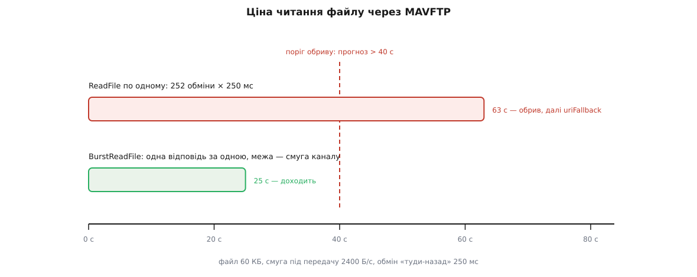
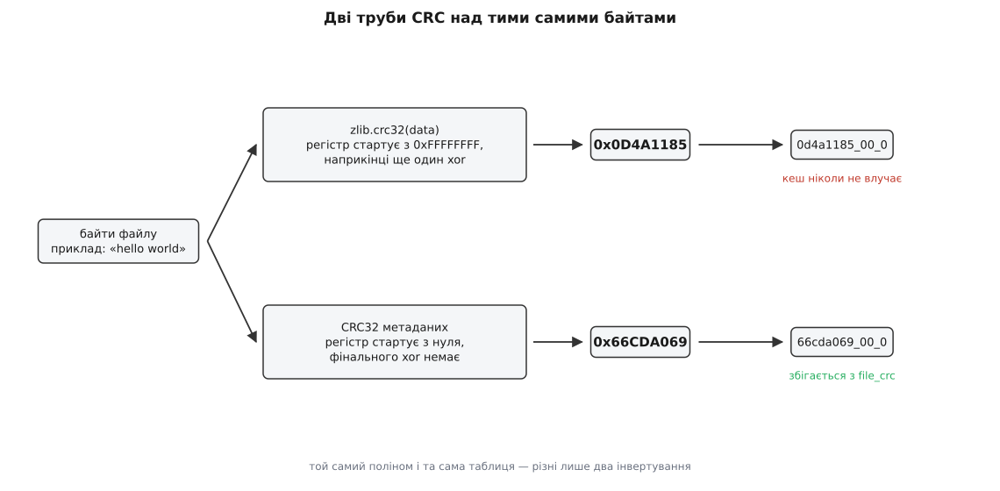

# ⚙️ Клієнт метаданих компонента: сто рядків замість станції

Ця програма під'єднується до апарата й друкує в консоль повний опис одного параметра — підпис, одиниці, межі, усталене значення, назви варіантів, — витягнувши його з борту самим протоколом, без застосунку й без Qt. Писати її варто не заради заміни станції, а тому, що протокол метаданих стає зрозумілим рівно тоді, коли ти сам збираєш ім'я кеш-запису й сам вирішуєш, коли обірвати завантаження: у готовій станції ці два рішення сховані за менеджером, а тут вони твої — і одразу видно, чому кожне з них саме таке.

### Задача

Нехай апарат уже говорить: плата з USB-кабелем, радіомодем або симулятор на UDP-порті 14550. Треба назвати програмі ім'я `MPC_XY_P` і побачити у відповідь не число, а опис.

Дорога від з'єднання до відповіді складається з дев'яти кроків, і жоден не можна пропустити.

Дочекатися серцебиття — доти невідомий номер апарата, а без адресата команду нікуди слати. Попросити повідомлення `COMPONENT_METADATA` і дочекатися його. Витягти з нього адресу файлу-покажчика й CRC цього файлу. Зібрати з CRC ім'я запису в кеші й зазирнути туди. Якщо в кеші порожньо — завантажити файл: із борту через MAVFTP, якщо адреса починається з `mftp://`, або з мережі, якщо з `https://`. Розпакувати, якщо файл стиснений. Розібрати JSON і знайти в масиві `metadataTypes` запис із `type` рівним одиниці — це описи параметрів. Повторити для нього ті самі кроки «кеш → завантаження → розпакування», але вже з двома адресами: головною й запасною. І, нарешті, знайти в отриманому описі потрібне ім'я.

Кроки четвертий і п'ятий виглядають технічними дрібницями. Насправді саме вони роблять програму робочою чи неробочою: перший визначає, чи буде наступний запуск миттєвим, а другий — чи дочекається програма відповіді взагалі.

### Задум: п'ять речей, які легко зробити неправильно

**Одна команда — дві можливі відповіді, і порядок між ними не визначений.** Метадані не транслюються потоком: `COMPONENT_METADATA` просять поштучно [командою](topic:sys-dron/mavlink-commands) `MAV_CMD_REQUEST_MESSAGE` (номер 512), поклавши номер бажаного повідомлення в перший параметр. У відповідь прилітає двоє: `COMMAND_ACK` із результатом і саме повідомлення. Прилітають вони в будь-якому порядку — борт може надіслати повідомлення раніше за підтвердження, — тож чекати треба на обидва одночасно. І окремо: `COMMAND_ACK` з результатом, відмінним від `MAV_RESULT_ACCEPTED`, означає «не вмію» — це не тимчасова невдача, і повторювати запит нема сенсу, треба виходити одразу, а не досиджувати таймаут.

**Адреса приїжджає в полі фіксованої довжини.** [Пакет MAVLink](topic:sys-dron/mavlink-packet) не має полів змінного розміру, тому під адресу відведено рівно `char[100]`, добитих нулями. Отриманий рядок треба обрізати по першому нулю — інакше в дорогу піде адреса з хвостом невидимого сміття, а помилка вилізе аж на етапі відкриття файлу, у вигляді «немає такого файлу» з нормальним на вигляд шляхом у повідомленні.

**CRC тут не перевіряють — ним називають.** Число з поля `file_crc` потрібне не для звірки завантаженого, а для того, щоб скласти ім'я запису в кеші **до** завантаження: `%08x_%02i_%i` — CRC, номер виду опису, ознака перекладу. Ані апарата, ані адреси в цьому імені немає, тому два різні борти з однаковою прошивкою користуються одним записом, а оновлення прошивки саме собою робить старий запис недосяжним — [ключ є відбитком вмісту](topic:sf-distributed/cache-key-design), і окремої інвалідації не потрібно.

Пастка чекає того, хто вирішить це число все-таки порахувати — щоб звірити завантажене або щоб згенерувати власні метадані. [CRC-32](topic:com-modulation/crc) у метаданих береться з тим самим поліномом, що в zip і PNG, але **без початкового й кінцевого інвертування**: регістр стартує з нуля й віддається як є. Бібліотечна функція робить обидва інвертування, тому на тих самих байтах видасть інше число.

**Ключ `fileCrc` необов'язковий, і його відсутність означає конкретну річ.** «Цей опис твориться на льоту, сталого вмісту в нього немає». Без CRC ім'я запису не збирається — отже, кеш просто вимикається для цього виду: файл качають, читають і видаляють. Програма при цьому не має ані падати, ані вигадувати ім'я з адреси.

**Читання файлу з борту — це сотні обмінів, і за їхнім темпом треба стежити самому.** У [MAVFTP](topic:sys-dron/mavlink-ftp) на корисні дані одного повідомлення лишається 239 байтів: із 251 байта поля `payload` дванадцять з'їдає заголовок. Опис параметрів — десятки кілобайтів, тож обмінів виходить кількасот.

**Умова: файл 60 000 байтів, обмін «туди-назад» 250 мс, під передачу файлу лишається 2400 Б/с смуги.**

```
шматків по 239 байтів     = 60000 / 239 ≈ 251.05 → 252
читання по одному, з очікуванням відповіді на кожне:
  252 · 0.25 с            = 63 с
потоковим читанням, межа — сама смуга каналу:
  60000 / 2400            = 25 с
```

Різниця не в тонкощах, а в тому, дочекається програма чи ні. Тому читати треба потоково: `BurstReadFile` (код операції 15) змушує борт слати шматки один за одним, не питаючи дозволу на кожен. І навіть тоді потрібен свій сторож: якщо через десять секунд пройдено менше половини, а за поточним темпом виходить понад сорок секунд на все, завантаження варто обірвати й піти на запасну адресу — там той самий файл, тільки з мережі, і взяти його швидше.



*Той самий канал і той самий файл — різниця лише в тому, чи чекає програма підтвердження на кожен шматок. Правило обриву дивиться при цьому не на абсолютний час, а на прогноз: важить не «довго», а «за таким темпом не встигне».*

### Код

Головна мова тут — Python із `pymavlink`. Наземний інструмент, який раз на запуск качає десятки кілобайтів і розбирає JSON, нічого не виграв би від переписування на C: час його роботи цілком визначає канал. А виграє він від того, що вміщується на екран.

Спершу з'єднання й запит одного повідомлення.

```python
#!/usr/bin/env python3
"""paramdoc.py — опис одного параметра, витягнутий з борту протоколом метаданих."""
import json, lzma, os, struct, sys, time, zlib
from urllib.request import urlopen
from pymavlink import mavutil

mav       = mavutil.mavlink
AUTOPILOT = mav.MAV_COMP_ID_AUTOPILOT1          # метадані віддає лише автопілот
CACHE_DIR = os.path.join(os.path.expanduser('~'), '.cache', 'compinfo')


def request_message(link, msg_id, msg_name, timeout=5.0):
    """Попросити одне повідомлення. Повертає повідомлення або None."""
    link.mav.command_long_send(
        link.target_system, AUTOPILOT,
        mav.MAV_CMD_REQUEST_MESSAGE, 0,          # confirmation
        msg_id, 0, 0, 0, 0, 0, 0)                # param1 — номер повідомлення

    deadline = time.monotonic() + timeout
    while time.monotonic() < deadline:
        # Чекаємо на обидві відповіді разом: порядок між ними не визначений.
        m = link.recv_match(type=[msg_name, 'COMMAND_ACK'],
                            blocking=True, timeout=0.3)
        if m is None:
            continue
        if m.get_type() == msg_name:
            return m
        if m.command == mav.MAV_CMD_REQUEST_MESSAGE and \
           m.result != mav.MAV_RESULT_ACCEPTED:
            return None                          # «не вмію» — досиджувати нема чого
    return None


def cstr(field):
    """char[100] на дроті: хвіст добитий нулями, рядок обривається на першому."""
    if isinstance(field, (bytes, bytearray)):
        field = field.decode('utf-8', 'replace')
    return field.split('\x00', 1)[0].strip()
```

Далі — CRC і ім'я запису в кеші. Це та частина, яку найчастіше переносять в інші програми, тож ось вона двома мовами: на Python — щоб бачити, як скасувати обидва інвертування бібліотечної функції одним рядком, і на C++ — щоб бачити, звідки ці інвертування взагалі беруться.

:::tabs
```python
def metadata_crc32(data):
    """CRC32 метаданих: поліном як у zip, але регістр стартує з нуля
    й наприкінці не інвертується. zlib робить обидва інвертування —
    обидва тут і скасовуються, звідси два 0xFFFFFFFF."""
    return zlib.crc32(data, 0xFFFFFFFF) ^ 0xFFFFFFFF


def cache_tag(meta_type, crc, translation=False):
    """Ім'я запису в кеші: CRC, вид опису, ознака перекладу — і більше нічого."""
    return '%08x_%02i_%i' % (crc, meta_type, int(translation))
```
```cpp
#include <cstdint>
#include <cstdio>
#include <cstddef>
#include <string>

// Таблиця відображеного полінома CRC-32 — та сама, що в zip і PNG.
static const uint32_t *crcTable()
{
    static uint32_t table[256];
    static bool built = false;
    if (!built) {
        for (uint32_t i = 0; i < 256; ++i) {
            uint32_t k = i;
            for (int j = 0; j < 8; ++j)
                k = (k & 1u) ? ((k >> 1) ^ 0xEDB88320u) : (k >> 1);
            table[i] = k;
        }
        built = true;
    }
    return table;
}

uint32_t metadataCrc32(const uint8_t *data, size_t len)
{
    const uint32_t *table = crcTable();
    uint32_t crc = 0;                    // zip почав би з 0xFFFFFFFF
    for (size_t i = 0; i < len; ++i)
        crc = (crc >> 8) ^ table[(crc & 0xFFu) ^ data[i]];
    return crc;                          // zip завершив би ^ 0xFFFFFFFF
}

std::string cacheTag(int metaType, uint32_t crc, bool translation)
{
    char buf[32];
    std::snprintf(buf, sizeof buf, "%08x_%02i_%i",
                  static_cast<unsigned>(crc), metaType, translation ? 1 : 0);
    return buf;
}
```
:::

Два коментарі в C++-версії позначають усю різницю. На однакових байтах вона виглядає так:

```
байти «hello world»
CRC-32 як у zip     (регістр 0xFFFFFFFF, фінальний xor)  = 0x0D4A1185
CRC-32 метаданих    (регістр 0, без фінального xor)      = 0x66CDA069
```



*Поліном той самий, таблиця та сама, цикл той самий — розходяться лише два інвертування на краях. Помилка не викликає ані збою, ані повідомлення: файл завантажиться й ляже в кеш, просто під іменем, за яким його потім ніхто не шукатиме.*

Кеш — тека з файлами, названими за тегом. Відсутній тег означає «CRC не приїхав», і тоді кеш просто вимикається:

```python
def cache_load(tag):
    if tag is None:                                  # немає CRC — немає імені
        return None
    path = os.path.join(CACHE_DIR, tag)
    if os.path.exists(path):
        with open(path, 'rb') as fh:
            return fh.read()
    return None


def cache_store(tag, data):
    if tag is None:                                  # свідомо не кешуємо
        return
    os.makedirs(CACHE_DIR, exist_ok=True)
    with open(os.path.join(CACHE_DIR, tag), 'wb') as fh:
        fh.write(data)
```

Тепер читання з борту. Заголовок MAVFTP — дванадцять байтів у полі `payload` завдовжки 251; решта 239 і є корисні дані.

```python
FTP_HDR = struct.Struct('<HBBBBBBI')   # seq, session, opcode, size,
                                       # req_opcode, burst_complete, pad, offset
FTP_MAX = 239                          # 251 − 12

OP_TERMINATE, OP_OPEN_RO, OP_BURST = 1, 4, 15
OP_ACK, OP_NAK = 128, 129
ERR_EOF = 6


def ftp_send(link, seq, session, opcode, offset=0, size=0, data=b''):
    payload = FTP_HDR.pack(seq & 0xFFFF, session, opcode, size,
                           0, 0, 0, offset) + data
    payload += b'\x00' * (251 - len(payload))        # поле фіксованої довжини
    link.mav.file_transfer_protocol_send(0, link.target_system, AUTOPILOT,
                                         bytearray(payload))


def ftp_recv(link, want_op, timeout=2.0):
    """Відповідь саме на операцію want_op. Чуже й застаріле — у смітник."""
    deadline = time.monotonic() + timeout
    while time.monotonic() < deadline:
        m = link.recv_match(type='FILE_TRANSFER_PROTOCOL',
                            blocking=True, timeout=0.3)
        if m is None:
            continue
        raw = bytes(m.payload)
        seq, session, opcode, size, req_op, burst_done, _pad, offset = \
            FTP_HDR.unpack_from(raw)
        if req_op != want_op:                        # відгомін давнішого запиту
            continue
        return opcode, size, offset, raw[12:12 + size], burst_done
    return None
```

Поле `req_opcode` у відповіді повторює код операції, на яку вона відповідає, і без цієї перевірки програма розвалюється не одразу: перше завантаження минеться добре, а на другому в чергу приїде запізніла відповідь на закриття сесії з першого — з нульовим розміром замість розміру файлу.

Саме завантаження — цикл із трьома виходами: файл зібрано, борт мовчить надто довго, темп надто повільний. Останній вихід і є той сторож, без якого програма чекатиме хвилину замість того, щоб за секунду взяти той самий файл із мережі.

```python
def too_slow(elapsed, progress, budget=40.0):
    """Прогноз повного часу за поточним темпом перевищує бюджет?"""
    if progress <= 0.0:
        return False
    return elapsed > 10.0 and progress < 0.5 and elapsed / progress > budget


def ftp_download(link, path, seq=0):
    """Прочитати файл із борту потоковим читанням. Повертає байти або None."""
    name = path.encode('utf-8')
    ftp_send(link, seq, 0, OP_OPEN_RO, size=len(name), data=name)
    reply = ftp_recv(link, OP_OPEN_RO, timeout=3.0)
    if reply is None or reply[0] != OP_ACK:
        return None
    total = struct.unpack('<I', reply[3])[0] if reply[1] == 4 else 0
    if total == 0:
        return None

    buf, seen, have = bytearray(total), {}, 0
    started = time.monotonic()
    seq += 2
    ftp_send(link, seq, 0, OP_BURST, offset=have, size=FTP_MAX)
    last_packet = time.monotonic()

    try:
        while have < total:
            reply = ftp_recv(link, OP_BURST, timeout=0.5)
            now = time.monotonic()

            if reply is not None and reply[0] == OP_ACK:
                _, size, offset, data, burst_done = reply
                buf[offset:offset + size] = data
                seen[offset] = size
                while have in seen:                  # зсунути позначку суцільного
                    have += seen[have]
                last_packet = now
                if burst_done and have < total:      # борт завершив пачку раніше
                    seq += 2
                    ftp_send(link, seq, 0, OP_BURST, offset=have, size=FTP_MAX)
                continue

            if reply is not None and reply[0] == OP_NAK:
                if reply[3][:1] == bytes([ERR_EOF]):
                    break                            # кінець файлу
                return None

            if too_slow(now - started, have / total):
                return None                          # хай спрацює запасна адреса
            if now - last_packet > 2.0:              # пачка загубилася — просити ще
                seq += 2
                ftp_send(link, seq, 0, OP_BURST, offset=have, size=FTP_MAX)
                last_packet = now
    finally:
        ftp_send(link, seq + 2, 0, OP_TERMINATE)     # сесій на борту лічені штуки

    return bytes(buf[:have]) if have >= total else None
```

Лишилося звести докупи вибір джерела, розпакування й розбір. Схему беремо з адреси, а не з налаштувань, і розпаковуємо за магічними байтами, а не за розширенням:

```python
XZ_MAGIC = b'\xfd7zXZ\x00'


def fetch(link, uri):
    """Завантажити файл за адресою — з борту або з мережі."""
    if uri.startswith('mftp://'):
        return ftp_download(link, '/' + uri[len('mftp://'):].lstrip('/'))
    if uri.startswith(('http://', 'https://')):
        try:
            return urlopen(uri, timeout=30).read()
        except Exception as exc:
            print('мережа:', exc, file=sys.stderr)
            return None
    return None


def fetch_cached(link, meta_type, sources):
    """Джерела по черзі, для кожного: кеш → завантаження.
    CRC у кожного джерела свій, тож і тег кешу свій."""
    for uri, crc in sources:
        if not uri:
            continue
        tag = None if crc is None else cache_tag(meta_type, crc)
        hit = cache_load(tag)
        if hit is not None:
            return maybe_decompress(hit)
        raw = fetch(link, uri)
        if raw:
            cache_store(tag, raw)                    # кешуємо СТИСНЕНИЙ оригінал
            return maybe_decompress(raw)
    return None


def maybe_decompress(data):
    """Стиснення пізнається за вмістом: у самій адресі його може бути не видно."""
    return lzma.decompress(data) if data.startswith(XZ_MAGIC) else data


def sources_for(general, meta_type):
    """Пари «адреса, CRC» одного виду опису: спершу головна, потім запасна."""
    for entry in general.get('metadataTypes', []):
        if entry.get('type') == meta_type:
            return [(entry.get('uri', ''),         entry.get('fileCrc')),
                    (entry.get('uriFallback', ''), entry.get('fileCrcFallback'))]
    return None
```

Запасна адреса має власний ключ `fileCrcFallback`, і в PX4 його зазвичай немає: там за обома адресами лежить той самий файл тієї самої збірки. Але покладатися на це не варто — джерела різні, тому й тег кешу в кожного свій, а відсутність ключа просто вимикає кеш для цього джерела.

І головна частина — дев'ять кроків задачі, вишикувані в рядок:

```python
def describe(p):
    out = ['%s  (%s)' % (p['name'], p.get('type', '?')),
           '  підпис   : %s' % p.get('shortDesc', '—')]
    if p.get('units'):
        out.append('  одиниці  : %s' % p['units'])
    if 'min' in p or 'max' in p:
        out.append('  межі     : %s … %s' % (p.get('min', '−∞'), p.get('max', '+∞')))
    if 'default' in p:
        out.append('  усталене : %s' % p['default'])
    if p.get('group'):
        out.append('  група    : %s' % p['group'])
    if p.get('rebootRequired'):
        out.append('  ! потрібне перезавантаження')
    for v in p.get('values', []):
        out.append('    %s = %s' % (v['value'], v['description']))
    return '\n'.join(out)


def main(device, wanted):
    link = mavutil.mavlink_connection(device, source_system=255)
    link.wait_heartbeat()                            # звідси відомий target_system

    meta = request_message(link, 397, 'COMPONENT_METADATA')
    if meta is None:
        sys.exit('апарат не віддав COMPONENT_METADATA')

    # 0 — COMP_METADATA_TYPE_GENERAL; запасної адреси в покажчика немає за задумом
    general_raw = fetch_cached(link, 0, [(cstr(meta.uri), meta.file_crc)])
    if general_raw is None:
        sys.exit('не вдалося взяти файл-покажчик')
    general = json.loads(general_raw)

    sources = sources_for(general, 1)                # 1 — COMP_METADATA_TYPE_PARAMETER
    if sources is None:
        sys.exit('апарат не описує своїх параметрів')

    params_raw = fetch_cached(link, 1, sources)
    if params_raw is None:
        sys.exit('не вдалося взяти описи параметрів')

    for p in json.loads(params_raw).get('parameters', []):
        if p.get('name') == wanted:
            print(describe(p))
            return
    print('немає такого параметра:', wanted)


if __name__ == '__main__':
    main(sys.argv[1] if len(sys.argv) > 1 else 'udpin:0.0.0.0:14550',
         sys.argv[2] if len(sys.argv) > 2 else 'MPC_XY_P')
```

На апараті з PX4 це друкує приблизно таке:

```
MPC_XY_P  (Float)
  підпис   : Proportional gain for horizontal position error
  межі     : 0.0 … 2.0
  усталене : 0.95
  група    : Multicopter Position Control
```

Перший запуск займає стільки, скільки триває завантаження; другий — частки секунди, бо обидва файли вже лежать у кеші під іменами зі своїх CRC.

> 🔧 **Навіщо це.** Скрипт вартий місця в теці з інструментами поруч зі станцією. Коли параметр видно голим числом без підпису, він за пів хвилини каже, чия це біда: якщо опис друкується — метадані на борту цілі, і винна станція; якщо не друкується — видно, на якому саме кроці обірвалося. Тим самим прийомом перевіряють і свою прошивку: змінив опис, перезібрав, запустив — і одразу ясно, чи перерахувався CRC.

### Складність і пастки

Обчислень тут нема: два файли, десятки кілобайтів, розпакування й розбір JSON. Пам'яті потрібно на розмір найбільшого файлу в розпакованому вигляді — кілька сотень кілобайтів; читати описи параметрів потоково немає сенсу, бо їх усе одно тримають у пам'яті цілком. Уся вартість — у двох завантаженнях, і саме тому кеш важить більше за будь-яку оптимізацію коду.

А ось перелік того, на чому ця програма ламається — кожен пункт трапляється в житті.

**CRC порахований бібліотечною функцією.** Найпідступніша з усіх, бо не дає ані збою, ані попередження. Файл завантажиться, розбереться й ляже в кеш — під іменем, за яким його ніхто не шукатиме, бо борт назве інше число. Кеш тихо перестане працювати: кожне під'єднання коштуватиме повного завантаження. Помилка виявляється не в програмі, а в тому, що тека кешу росте, а швидше не стає. Той самий прорахунок з боку прошивки дає дзеркальний і гірший наслідок: старий CRC при новому вмісті означає, що станція вічно братиме з кешу застарілий опис.

**Кешовано розпакований файл замість стисненого.** Тег рахується з CRC того файлу, який лежить на борту, — тобто зі стисненого. Якщо покласти в кеш розпакований вміст під тим самим тегом, наступного разу з кешу приїде готовий JSON, і `maybe_decompress` його просто пропустить. Працюватиме — доти, доки хтось не вирішить звірити кешоване з `file_crc`.

**Немає `fileCrc` — а програма все одно збирає ім'я.** Формат `%08x` на `None` впаде з `TypeError`, і це ще щаслива розв'язка. Гірша — «полагодити» падіння, підставивши нуль або кусень адреси: тоді всі описи без CRC зіллються в один запис кешу незалежно від вмісту, і другий апарат отримає опис першого. Правильна поведінка — не кешувати взагалі: відсутність ключа означає, що опис твориться на льоту й сталого вмісту не має.

**Немає сторожа темпу.** Без `too_slow` програма на телеметричному радіо чесно чекає хвилину, потім ще одну на переклади, і виглядає це як зависання. Прогноз рахують від поступу, а не від годинника: «двадцять секунд» саме собою не помилка, помилка — «за таким темпом усе триватиме понад сорок». І перші десять секунд не питають нічого, бо на початку темп ще нічого не означає. Загальний бік цієї механіки — [таймаути й дедлайни](topic:sf-distributed/timeouts-deadlines).

**Сесію MAVFTP не закрито.** Сесій на борту лічені штуки, і кинута незакритою не звільниться сама доти, доки не спрацює її власний таймаут. Три обірваних запуски скрипта поспіль — і борт відповідає `MAV_FTP_ERR_NOSESSIONSAVAILABLE` на кожне відкриття. Тому `TerminateSession` стоїть у `finally`, а не після успішного завершення.

**Розпакування за розширенням в адресі.** У `mftp://etc/extras/parameters.json.xz` розширення видно, у мережевій адресі з параметрами запиту — може й не бути, а деякі борти віддають описи взагалі нестисненими. Магічні байти `FD 37 7A 58 5A 00` на початку файлу кажуть правду завжди; це той самий [LZMA у форматі `.xz`](topic:math-information/lossless-huffman-lz), що й у звичайних архівах.

**Обірваний рядок адреси.** `char[100]` без обрізання по нулю дає адресу, яка на вигляд нормальна, а на дроті — з хвостом. Пов'язана дрібниця: у шаблонах мережевих адрес PX4 тримає `{version}`, але підставляє туди назву гілки чи тега **під час збирання прошивки**. Якщо `{version}` дожив до клієнта — метадані згенеровано без файлу версії, і підставляти щось самому не варто: адреса все одно вкаже не на ту збірку. Хай спрацює запасна.

**За відповідь беруть чуже.** Двома способами. Перший: метадані віддає лише автопілот, а камера чи підвіс на той самий запит або не відповість, або відповість своїм — і `recv_match` без фільтра за номером компонента візьме перше-ліпше; тут захист тримається на тому, що ми самі шлемо на `MAV_COMP_ID_AUTOPILOT1`, але довгоживучому інструментові варто перевіряти ще й `get_srcComponent()`. Другий підступніший: у каналі лежать запізнілі відповіді на **власні** попередні запити, і без звірки за `req_opcode` перше ж завантаження після закриття сесії прочитає розмір файлу з чужої відповіді.

**Читання по одному шматку замість потокового.** Найчастіша причина того, що «скрипт працює на USB і не працює на радіо». Різницю між `ReadFile` і `BurstReadFile` на кабелі не видно взагалі, а на телеметрії вона — між двадцятьма п'ятьма секундами й хвилиною з гаком. Решта гострих кутів самого протоколу — [граблі MAVLink](topic:sys-dron/mavlink-pitfalls).

Чого ця програма свідомо не робить — теж варто назвати, бо саме тут проходить межа між інструментом і станцією. Вона не бере перекладів: у файлі опису лежить мапа перекладних місць, за `translationUri` — зведення локалей, і повний шлях додає ще одне завантаження й прохід по дереву JSON. Вона не має ані стелі на розмір кешу, ані витіснення давніх записів. Вона не вміє запасних дверей поза протоколом — вшитої в застосунок бази описів, з якої станція бере опис, коли не приїхало нічого. І вона питає рівно один параметр, тоді як станція чіпляє метадані до [тисячі фактів](topic:sys-dron/parameter-manager) тієї ж миті, коли для кожного прилітає перше значення.

Але головне вона робить те саме: перетворює сто байтів повідомлення на осмислений опис — і робить це, нічого не знаючи про `MPC_XY_P` наперед.
