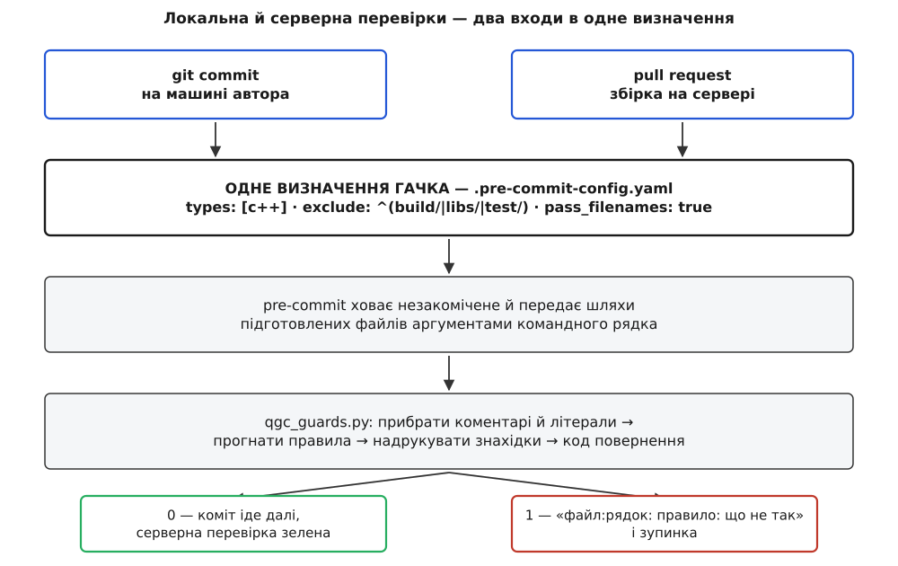

# ⚙️ Зауваження рев'ю, переписане на Python: гачок, що читає підготовлені до коміту файли

Коли те саме зауваження написане вдесяте, воно перестає бути зауваженням і стає дефектом процесу: людина витрачає найдорожчий ресурс проєкту на роботу, яку вміє робити машина. Далі — робочий гачок, який знімає з рецензента два повторювані зауваження QGroundControl («жодного `Q_ASSERT` у продакшн-коді» і «результат `activeVehicle()` треба перевірити на нуль»), а разом із ним — те, що з'ясовується, лише коли таку перевірку справді пишеш: як не спрацювати на слово в коментарі, як не збрехати з номером рядка й чому вона мусить укладатися в частки секунди.

Мова тут не довільна. Власні аналізатори QGroundControl лежать у `tools/analyzers/` і написані на Python; поруч у тому самому наборі перевірок стоять `ruff` і `pyright`, які тримають ці скрипти в тонусі, а сам `pre-commit` — теж програма на Python. Писати нову перевірку іншою мовою означало б завести другий набір інструментів заради сорока рядків коду.

## Контракт, який робить гачок звичайною програмою

[Гачок git](root:sys-ide/git-hooks) сам собою — просто виконуваний файл, який запускається в потрібний момент. Надбудова `pre-commit` додає до цього дві речі, і саме вони роблять написання перевірки простим.

Перша: **перед запуском гачків вона ховає незакомічене**. Правки, які є в робочій теці, але не додані до індексу, тимчасово відкладаються, і на диску лишається рівно той стан, що піде в коміт. Наслідок для нас практичний: усередині гачка можна просто відкрити файл і читати — це вже вміст майбутнього коміту, ніяких `git show :file` не треба.

Друга: **шляхи файлів приходять аргументами командного рядка**. Надбудова бере список підготовлених файлів, відсіює за типом і шаблоном шляху й передає те, що лишилося, вашій програмі. Це ключ до швидкості — гачок ніколи не обходить дерево, він бачить лише те, що змінилося.

Далі — усе. Програма друкує знахідки й повертає код: нуль — тихо пропустити, будь-що інше — зупинити коміт. Тобто перевірка не мусить нічого знати ні про git, ні про `pre-commit`; вона мусить уміти прочитати перелічені файли й повернути правильне число.



*Одне визначення, два входи; правило фізично не може розійтися між машиною автора й сервером, бо воно існує в одному екземплярі.*

## Чому одного grep не досить

Перше правило — заборона `Q_ASSERT` — справді закривається одним рядком, і сам проєкт закриває його саме так: у `.pre-commit-config.yaml` стоїть гачок, який запускає `grep` по переданих файлах і, якщо той щось знайшов, друкує пояснення й падає.

Друге правило одним рядком не закривається, і причина цікава. Небезпечний тут не виклик `activeVehicle()`, а **його результат без перевірки**. Станція вміє тримати [кілька апаратів одночасно](root:sys-dron/multi-vehicle), а щойно запущена — жодного, тож нуль тут законне значення. Небезпечними є два різні написання:

```cpp
// пряме: результат ніде не перевірити — метод викликано просто на ньому
_multiVehicleManager->activeVehicle()->setArmed(true);

// відкладене: вказівник збережено, а перевірку забуто
Vehicle* vehicle = _multiVehicleManager->activeVehicle();
vehicle->setArmed(true);
```

Перше — це шаблон у межах одного рядка. Друге — ні: щоб його впіймати, треба **запам'ятати ім'я змінної** й дивитися, що з нею стається далі. Регулярний вираз працює всередині рядка й нічого не пам'ятає між рядками, а `grep` не має пам'яті поготів. Ось точний момент, коли перевірка перестає бути однорядковим шаблоном і стає програмою: щойно правило потребує стану.

Саме тому в QGroundControl `Q_ASSERT` ловить `grep`, а нульовий вказівник апарата — окремий скрипт `tools/analyzers/vehicle_null_check.py`. Ми напишемо одну програму на обидва правила: другому вона потрібна, першому вона обійдеться дешево, а користувач отримає один вивід замість двох.

## Крок перший: викинути текст, який не є кодом

Найпростіша реалізація ламається на першому ж файлі. Ось цілком мирний фрагмент, у якому наївний пошук `Q_ASSERT` дасть три хибні спрацювання підряд:

```cpp
// Тут колись стояв Q_ASSERT(vehicle) — прибрано, лишився лише текст.
static const char* kHint = "не пишіть Q_ASSERT(x) у продакшн-коді";
static const char* kRe   = R"(Q_ASSERT\((.*)\))";
```

Коментар, звичайний рядковий літерал і сирий літерал. Жодне з цих місць не є кодом, який виконається, а перевірка зупинить коміт тричі — і після другого такого дня її вимкнуть.

Отже, перед пошуком текст треба **знешкодити**: вміст коментарів і літералів має перестати бути видимим для правил. Тут є одна вимога, яку легко проґавити й потім довго не розуміти, чому все поїхало: **прибирати не можна, можна лише заміняти**. Якщо викинути коментарі геть, кожен наступний номер рядка зсунеться, і повідомлення показуватиме читачеві не те місце. Тому ми міняємо кожен символ усередині коментаря чи літерала на пробіл, а переводи рядка лишаємо недоторканими. Довжина тексту та сама, розкладка по рядках та сама, номери й стовпці лишаються правдою.

Це, по суті, перша фаза [лексичного аналізу](root:sf-lang/lexer-design) — розпізнати, де в тексті коментар, а де літерал, — тільки замість токенів на виході в нас той самий текст із дірками:

```python
_NOISE = re.compile(
    r"//[^\n]*"                                   # рядковий коментар
    r"|/\*.*?\*/"                                 # блоковий коментар
    r"|R\"(?P<d>[^()\\\s]{0,16})\(.*?\)(?P=d)\""  # сирий літерал R"d(...)d"
    r"|\"(?:[^\"\\\n]|\\.)*\""                    # звичайний рядок
    r"|(?<![\w'])(?:u8|[LuU])?'(?:[^'\\\n]|\\.)*'",  # символьний літерал
    re.DOTALL)


def scrub(src: str) -> str:
    """Вміст коментарів і літералів -> пробіли. Довжина й переводи рядка цілі."""
    return _NOISE.sub(lambda m: re.sub(r"[^\n]", " ", m.group()), src)
```

Три деталі цього виразу варті окремого слова, бо кожна з них — помилка, яку роблять із першого разу.

**Порядок альтернатив вирішує суперечку сам.** Що робити, якщо всередині коментаря стоїть лапка, а всередині рядка — послідовність `//`? Нічого: пошук іде зліва направо й зупиняється на найранішій позиції, де підходить хоч одна альтернатива. Дійшовши до `//`, він з'їдає весь рядок разом із лапками; дійшовши спершу до `"`, він з'їдає літерал разом із `//` усередині. Правильна поведінка виходить із самої механіки пошуку, а не з додаткових умов.

**Апостроф — це не завжди символьний літерал.** У C++14 його вживають як роздільник розрядів: `constexpr int kMax = 1'000'000;`. Наївне правило «від апострофа до апострофа» проковтне `000` і поїде далі зі зсунутим станом, після чого решта файлу розбирається навмання. Рятує погляд назад: `(?<![\w'])` вимагає, щоб перед відкривним апострофом не стояла літера, цифра чи інший апостроф. Префікси `L`, `u`, `U`, `u8` при цьому дозволені явно.

**Альтернативи всередині зірочки не сміють перекриватися.** У `(?:[^"\\\n]|\\.)*` перший варіант навмисно виключає зворотну косу риску — інакше той самий символ підходив би під обидві гілки, кількість способів розібрати рядок росла б удвічі з кожним символом, і на першому ж незакритому літералі гачок би не впав, а завис. Це загальна властивість [рушіїв регулярних виразів із поверненням](root:sf-algorithms/regex-engine), і в скануванні коду вона стріляє часто, бо незакритий літерал у чернетці — звичайна річ.

## Крок другий: правила

Тепер, коли в тексті лишився самий код, правила пишуться прямо.

`Q_ASSERT` — шаблон у межах рядка, разом із варіантом `Q_ASSERT_X`. Пряме розіменування `activeVehicle()` — теж. А відкладений випадок веде себе як маленький автомат, який іде по файлу згори вниз і тримає три речі: які змінні народилися з `activeVehicle()`, де кожну востаннє перевіряли й де її вживають.

Дві умови автомата варто пояснити, бо вони — компроміс, а не істина.

**Вікно в десять рядків.** Перевірка, зроблена сорок рядків тому, формально захищає й теперішній рядок, але щоб це знати, треба розуміти потоки керування, а їх у нас немає. Тому чинною вважається перевірка не далі як за десять рядків. Власний аналізатор проєкту робить те саме — дивиться на десяток рядків назад від місця вживання; його документація прямо радить не боротися з інструментом, а перенести перевірку ближче до вживання. Це не поступка інструментові: захисна умова, від якої до небезпечного виклику сорок рядків чужої логіки, і людині гарантує небагато.

**Закривна дужка на нульовому стовпці стирає пам'ять.** У стилі проєкту тіло функції закривається саме так, тож цей рядок — дешевий і надійний знак, що почалася нова функція й старі змінні більше не існують. Без нього змінна `vehicle`, перевірена у функції вище, «захищала» б однойменну змінну у функції нижче.

Порядок обробки всередині рядка теж не випадковий: спершу шукаємо перевірку, потім вживання. Завдяки цьому найпоширеніша безпечна форма `if (vehicle && vehicle->armed())` проходить — умова й вживання стоять в одному рядку, і перевірка встигає зарахуватися першою.

## Увесь гачок

```python
#!/usr/bin/env python3
"""Дві проєктні перевірки QGroundControl для pre-commit:
   no-qassert   — Q_ASSERT у продакшн-коді;
   vehicle-null — результат activeVehicle() вжито без перевірки на нуль.
Читає лише ті файли, що передані аргументами (їх дає pre-commit)."""
from __future__ import annotations

import argparse
import re
import subprocess
import sys
from dataclasses import dataclass

WINDOW = 10          # скільки рядків тому ми ще вважаємо перевірку чинною
SUFFIXES = (".cpp", ".cc", ".h", ".hpp")

ALLOW = re.compile(r"//\s*qgc-lint:\s*allow\((?P<rule>[\w-]+)\)\s*(?P<why>\S.*)?")

_NOISE = re.compile(
    r"//[^\n]*"
    r"|/\*.*?\*/"
    r"|R\"(?P<d>[^()\\\s]{0,16})\(.*?\)(?P=d)\""
    r"|\"(?:[^\"\\\n]|\\.)*\""
    r"|(?<![\w'])(?:u8|[LuU])?'(?:[^'\\\n]|\\.)*'",
    re.DOTALL)


def scrub(src: str) -> str:
    """Вміст коментарів і літералів -> пробіли. Довжина й переводи рядка цілі."""
    return _NOISE.sub(lambda m: re.sub(r"[^\n]", " ", m.group()), src)


QASSERT = re.compile(r"\bQ_ASSERT(?:_X)?\s*\(")
DIRECT = re.compile(r"\bactiveVehicle\s*\(\s*\)\s*->")
ASSIGN = re.compile(r"\b(?P<var>[A-Za-z_]\w*)\s*=\s*[^;]*\bactiveVehicle\s*\(\s*\)")
BLOCK_END = re.compile(r"^\}")

_use_cache: dict[str, re.Pattern] = {}
_guard_cache: dict[str, re.Pattern] = {}


def use_re(var: str) -> re.Pattern:
    if var not in _use_cache:
        _use_cache[var] = re.compile(r"\b" + re.escape(var) + r"\s*(?:->|\.\w)")
    return _use_cache[var]


def guard_re(var: str) -> re.Pattern:
    if var not in _guard_cache:
        v = re.escape(var)
        _guard_cache[var] = re.compile(
            r"\bif\s*\([^)]*\b" + v + r"\b"                    # if (!v), if (v == nullptr)
            r"|\b" + v + r"\b\s*\?"                            # v ? a : b
            r"|\b" + v + r"\b\s*(?:==|!=)\s*(?:nullptr|NULL)"  # v != nullptr
            r"|&&\s*!?\s*" + v + r"\b")                        # ... && v->...
    return _guard_cache[var]


@dataclass
class Hit:
    path: str
    line: int
    rule: str
    message: str


def analyze(path: str, src: str) -> list[Hit]:
    raw = src.splitlines()
    code = scrub(src).splitlines()
    origin: dict[str, int] = {}     # змінна -> рядок, де вона взялася з activeVehicle()
    guarded: dict[str, int] = {}    # змінна -> рядок останньої перевірки
    hits: list[Hit] = []

    for n, line in enumerate(code, 1):
        if BLOCK_END.match(line):          # закривна дужка на нульовому стовпці
            origin.clear()
            guarded.clear()
            continue

        if QASSERT.search(line):
            hits.append(Hit(path, n, "no-qassert",
                            "Q_ASSERT зникає в релізі — зробіть захисну перевірку "
                            "з раннім поверненням"))

        if DIRECT.search(line):
            hits.append(Hit(path, n, "vehicle-null",
                            "activeVehicle() може повернути нуль — не викликайте "
                            "метод одразу на результаті"))

        m = ASSIGN.search(line)
        if m:
            origin[m.group("var")] = n
            guarded.pop(m.group("var"), None)

        for var in origin:                 # спершу перевірки…
            if guard_re(var).search(line):
                guarded[var] = n

        for var in origin:                 # …і лише потім вживання
            if use_re(var).search(line):
                seen = guarded.get(var)
                if seen is None or n - seen > WINDOW:
                    hits.append(Hit(path, n, "vehicle-null",
                                    "«%s» узято з activeVehicle() і вжито без "
                                    "перевірки на нуль" % var))

    return [h for h in hits if not allowed(raw, h)]


def allowed(raw: list[str], hit: Hit) -> bool:
    """Позначку шукаємо в СИРИХ рядках: scrub() вигриз би її разом із коментарем."""
    for idx in (hit.line - 1, hit.line - 2):
        if 0 <= idx < len(raw):
            m = ALLOW.search(raw[idx])
            if m and m.group("rule") == hit.rule and m.group("why"):
                return True
    return False


def staged_files() -> list[str]:
    out = subprocess.run(["git", "diff", "--cached", "--name-only", "--diff-filter=ACM"],
                         capture_output=True, text=True, check=True).stdout.split()
    return [p for p in out if p.endswith(SUFFIXES)]


def main(argv: list[str] | None = None) -> int:
    ap = argparse.ArgumentParser(description=__doc__)
    ap.add_argument("files", nargs="*", help="шляхи; порожньо — узяти індекс git")
    ap.add_argument("--ci", action="store_true", help="вивід анотаціями GitHub Actions")
    args = ap.parse_args(argv)

    hits: list[Hit] = []
    for path in (args.files or staged_files()):
        try:
            with open(path, encoding="utf-8", errors="replace") as fh:
                hits += analyze(path, fh.read())
        except OSError as err:
            print("не прочитав %s: %s" % (path, err), file=sys.stderr)
            return 2

    for h in hits:
        if args.ci:
            print("::error file=%s,line=%d::%s: %s" % (h.path, h.line, h.rule, h.message))
        else:
            print("%s:%d: %s: %s" % (h.path, h.line, h.rule, h.message))

    return 1 if hits else 0


if __name__ == "__main__":
    sys.exit(main())
```

Це весь файл: скопіювати, покласти в `tools/analyzers/qgc_guards.py` і запустити.

Дві дрібниці у виводі зроблено навмисно. Формат `файл:рядок: правило: пояснення` — той самий, яким говорять компілятори, тому редактор перетворює рядок на клікабельне посилання без жодного налаштування. А прапорець `--ci` перемикає вивід на робочі команди GitHub Actions виду `::error file=…,line=…::…` — тоді те саме зауваження з'являється анотацією просто на потрібному рядку в дифі запиту; власні гачки QGroundControl друкують саме такий префікс.

**Прогін по підготовленому зразку.**

```
$ python3 tools/analyzers/qgc_guards.py Sample.cc
Sample.cc:14: vehicle-null: «vehicle» узято з activeVehicle() і вжито без перевірки на нуль
Sample.cc:19: vehicle-null: activeVehicle() може повернути нуль — не викликайте метод одразу на результаті
Sample.cc:24: no-qassert: Q_ASSERT зникає в релізі — зробіть захисну перевірку з раннім поверненням
Sample.cc:25: no-qassert: Q_ASSERT зникає в релізі — зробіть захисну перевірку з раннім поверненням
$ echo $?
1
```

Обидва небезпечні написання спіймано, `Q_ASSERT_X` теж; форми `if (!vehicle) return;`, `if (vehicle && vehicle->armed())` і `v != nullptr ? v->id() : -1` пройшли мовчки; згадки `Q_ASSERT` у коментарі, у рядку й у сирому літералі не спрацювали.

## Куди його підключити

Локальна сторона — окремий гачок у `.pre-commit-config.yaml`, у секції `repo: local` поруч із рештою власних перевірок проєкту:

```yaml
  - repo: local
    hooks:
      - id: qgc-guards
        name: Q_ASSERT і перевірка activeVehicle() на нуль
        entry: python3 tools/analyzers/qgc_guards.py
        language: python
        types: [c++]
        exclude: ^(build/|libs/|test/)
        pass_filenames: true
```

Кожен рядок тут щось вирішує.

`types: [c++]` відбирає файли за розпізнаним типом, а не за розширенням у регулярному виразі. Різниця стає видною на `.h`: за розширенням його не відрізнити від заголовка чистого C, і фільтр за типом розв'язує це надійніше, ніж перелік суфіксів у шаблоні. Шлях же відсіює `exclude` — це звичайний регулярний вираз по шляху від кореня репозиторію.

`language: python` каже надбудові підняти для гачка окреме віртуальне середовище й запускати його в ньому. Для перевірок із залежностями це єдиний правильний вибір: версія пакета фіксується в `additional_dependencies` і однакова в усіх. Наш скрипт залежностей не має, тож тут годиться й `language: system` — тоді береться інтерпретатор із `PATH` без жодного встановлення; власні аналізатори QGroundControl оголошені саме так.

`pass_filenames: true` — це той рядок, який тримає час виконання. Він означає «передай шляхи аргументами». Протилежне значення, `pass_filenames: false`, каже «запусти один раз без списку», і тоді програма мусить сама вирішувати, що дивитися, — зазвичай усе дерево. Саме тому важкі гачки того ж проєкту (`clang-tidy`, `clazy`, `qmllint`) оголошені з `false`: їм потрібен цілий контекст збірки, і платять вони за це хвилинами.

Серверна сторона не повторює правило, а входить у те саме визначення:

```yaml
      - name: Перевірки на зміненому в запиті
        run: |
          pre-commit run --show-diff-on-failure --color=always \
            --from-ref origin/${{ github.base_ref }} --to-ref HEAD
```

Тут важлива не команда, а принцип. Якби на сервері стояв власний крок із власним `grep`, з'явилося б **два джерела правди**, і вони б розійшлися першою ж правкою — після чого локально зелено, у запиті червоно, і люди перестають вірити обом. Той самий файл конфігурації, викликаний з іншого боку, розійтися не може. Решта подробиць — предмет окремої розмови про [неперервну інтеграцію](root:sf-release/ci-cd); QGroundControl обгортає цей виклик у власний скрипт `tools/pre_commit.py --ci`, який ще й зводить результати всіх перевірок в один коментар до запиту, щоб автор бачив список замість двох десятків окремих червоних позначок.

Один вибір тут не очевидний: `--from-ref/--to-ref` перевіряє лише файли запиту, а `--all-files` — увесь репозиторій. У дереві, де правило вводять не з першого дня, `--all-files` червоне назавжди, і запускати його на кожен запит означає покарати автора за чужий борг. Робочий компроміс — храповик: на запити `--from-ref` (нове мусить бути чистим), а `--all-files` окремим нічним прогоном, який показує решту боргу й не блокує нікого.

## Чого ця перевірка не вміє

Скажімо прямо: **регулярним виразом C++ розібрати неможливо**, і це не питання старанності. Мова коду має вкладеність без обмеження глибини — дужки в дужках, шаблони в шаблонах, — а [регулярна мова](root:computability/regular-languages) саме такого й не вміє: пам'яті на «скільки дужок я вже відкрив» у неї немає за побудовою. Наш автомат обходить це не розбором, а здогадом.

Тому чесний перелік того, що він проґавить, короткий і конкретний: виклик, схований за макросом; повернення `activeVehicle()` із чужої функції-обгортки; гілка під `#if`, яку препроцесор викине. І окремо, у зворотний бік: вживання, віднесене від перевірки далі як на десять рядків, дасть зауваження на цілком правильному коді.

І все ж це прийнятно, бо **гачок — не верифікатор, а пам'ять рецензента**. Порівняймо, чим ми платимо за кожну помилку. Хибне спрацювання коштує двадцять секунд: автор дивиться на рядок і або переносить перевірку ближче, або ставить позначку винятку. Проґавлений випадок коштує рівно стільки, скільки коштував до появи гачка, — тобто нічого нового не втрачено: правило й далі тримає [рев'ю](root:sf-release/code-review), як тримало завжди. Асиметрія тут повна, і вона виправдовує здогад.

Межа, за якою здогаду перестає вистачати, теж видна. Коли правило починає вимагати знання типів чи справжніх областей видимості — «цей вказівник узятий з ось того плагіна прошивки», — регулярні вирази треба кидати й переходити до [статичного аналізу](root:sf-release/static-analysis) поверх [синтаксичного дерева](root:sf-lang/abstract-syntax-tree), яке будує сам компілятор. Проєкт так і робить: `clang-tidy` і `clazy` у тому самому наборі перевірок працюють саме з деревом. Ціна переходу — хвилини замість часток секунди й потреба в базі команд компіляції, тож дешевий гачок нікуди не дівається: він ловить масове, а важка артилерія — рідкісне.

## Пастки

**Тести — не продакшн-код, і правило там хибне.** `Q_ASSERT` у тесті нікому не шкодить: тест не потрапляє до користувача, а падіння на невиконаній умові — це рівно те, чого від нього хочуть. Якщо не виключити `^test/`, перевірка почне вимагати абсурдного, і її або вимкнуть, або обвішають позначками винятків — що те саме. Так само виключають `libs/` — чужий код, який ви не редагуєте й не маєте права переписувати під свій стиль.

**Частку хибних спрацювань міряють до ввімкнення, а не після.** Перш ніж додавати гачок у конфігурацію, проженіть його по всьому дереву й прочитайте кожне зауваження очима. Якщо серед сотні знахідок хибних більше жмені — правило ще не готове, і вмикати його означає навчити команду прокручувати вивід не читаючи. Це найдорожча помилка з усіх: перевірка, якій не вірять, гірша за відсутність перевірки, бо створює видимість гарантії.

**Свідомий виняток мусить лишати слід.** Позначка `// qgc-lint: allow(no-qassert) причина` зроблена так, щоб пояснення було обов'язковим: без тексту після дужки вона не діє. Три властивості цього рішення важать більше за його простоту. Вона іменна — глушить одне правило, а не всі. Вона живе в коментарі, тому потрапляє в діф, і рецензент бачить кожен новий виняток разом зі змінами. І вона однакова текстово, тому весь борг витягається однією командою:

```bash
git grep -n "qgc-lint: allow" -- '*.cpp' '*.h'
```

Тут же — пастка, яку помічають лише після написання: **позначку не можна шукати в очищеному тексті**. Ми ж самі щойно замінили всі коментарі пробілами, тобто вирізали власний механізм винятків. Тому `allowed()` дивиться в `raw` — сирі рядки, збережені до очищення. Дрібниця, яка коштує пів години здивування, якщо про неї не подумати заздалегідь.

**Бюджет часу — секунди, і рахувати треба весь шлях.** Гачок спрацьовує на кожен коміт, а коміти роблять десятками на день; перевірку, що думає п'ять секунд, до кінця тижня почнуть обходити прапорцем `--no-verify`. Ось із чого складається час:

```
запуск інтерпретатора Python з імпортами  ≈ 40…85 мс (раз на прогін)
розбір коду                                ≈ 4.4 мс на 1000 рядків
типовий коміт: 20 файлів × 500 рядків      ≈ 10 000 рядків ≈ 44 мс
разом                                       ≈ 0.1 с
```

Виміряно на цьому ж скрипті; порядок величини важливіший за точні числа. З нього видно головне: **запуск процесу дорожчий за роботу**. Звідси три правила, які випливають самі — один процес на весь список файлів, а не процес на файл; регулярні вирази скомпільовані один раз на рівні модуля, а не в циклі; жодного обходу дерева, бо список уже дали. Порушення будь-якого з трьох — і сто мілісекунд перетворюються на десять секунд, після чого гачок помирає не від помилки, а від роздратування.
