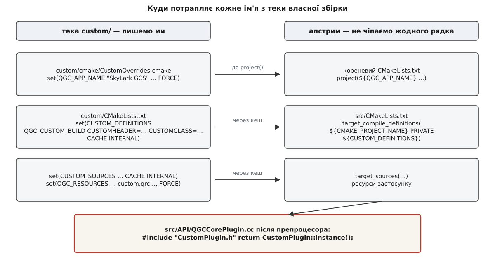
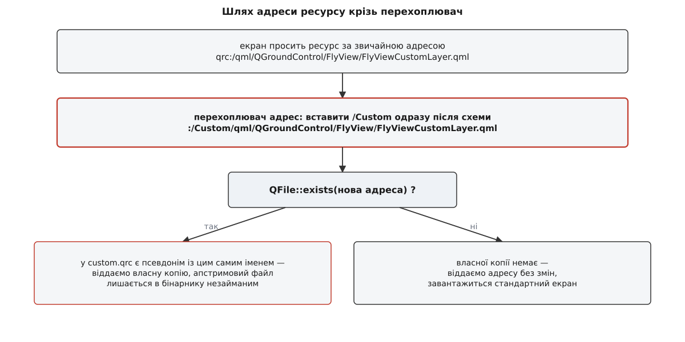

# ⚙️ Найменша власна збірка: тека, три імені й один клас

Тут зібрано весь код, потрібний, щоб із чистого дерева QGroundControl вийшла фірмова наземна станція під власний апарат — з іншим ім'ям, іншими кольорами й закритим оновленням прошивки, — і при цьому в файлах апстриму не змінився жоден символ. Виходить близько ста п'ятдесяти рядків у семи файлах, причому більша частина з них — не C++, а CMake: головна робота тут не в написанні класу, а в тому, щоб чужа збірка дізналася про його існування.

## Умова

Фірма продає квадрокоптер «SkyLark» разом із наземною станцією. Що саме має відрізнятися від апстриму:

- застосунок зветься «SkyLark GCS» — це видно в заголовку вікна, у теці налаштувань і в імені встановлювача;
- кольори інтерфейсу фірмові, а не типові;
- сторінка оновлення прошивки в звичайному режимі недоступна: покупець не має заливати в апарат сторонній бінарник, а сервісний інженер вмикає розширений режим і отримує її назад;
- значок апарата на карті — свій;
- майстри калібрування компаса й горизонту сховані: апарат приїжджає відкаліброваним.

І залізна умова, заради якої все й затівається: `git status` у теці апстриму мусить лишатися порожнім. Тоді перехід на нову версію — це `git pull`, а не розбір конфліктів у чужих файлах.

## Ідея

Уся різниця живе в одній теці `custom/`, покладеній поруч із `src/`. Кореневий `CMakeLists.txt` апстриму перевіряє, чи ця тека є, і якщо є — вмикає режим власної збірки й додає теку як підпроєкт. Далі тека передає апстримові кілька значень через кеш CMake, і серед них три імені, які й роблять усю підміну: `QGC_CUSTOM_BUILD`, `CUSTOMHEADER` і `CUSTOMCLASS`. Перше вмикає в коді гілку `#ifdef`, друге підставляється в `#include`, третє — в місце, де застосунок бере єдиний примірник ядрового розширення.

Тобто зв'язок між апстримом і нами тримається на препроцесорі: до компіляції в тексті стоять макроси, яких ніде в апстримі не визначено, а після [підстановки макросів](root:embedded/c-preprocessor-headers) — цілком звичайний код із нашими іменами.

## Розкладка файлів

```text
qgroundcontrol/            ← клон апстриму, ЖОДНОЇ правки
├── CMakeLists.txt
├── cmake/
├── src/
└── custom/                ← усе наше, окремий репозиторій або підмодуль
    ├── CMakeLists.txt
    ├── custom.qrc
    ├── cmake/
    │   └── CustomOverrides.cmake
    ├── res/
    │   └── Images/SkyLarkIcon.svg
    └── src/
        ├── CustomPlugin.h
        ├── CustomPlugin.cc
        └── FlyViewCustomLayer.qml
```

Ім'я `custom` не випадкове й не зашите намертво: апстрим має змінну `QGC_CUSTOM_DIR` з типовим значенням `"custom"`, і саме її він шукає:

```cmake
# кореневий CMakeLists.txt апстриму, до виклику project()
if(IS_DIRECTORY "${CMAKE_SOURCE_DIR}/${QGC_CUSTOM_DIR}")
    message(STATUS "QGC: Custom build directory detected: ${QGC_CUSTOM_DIR}")
    set(QGC_CUSTOM_BUILD ON)
    list(APPEND CMAKE_MODULE_PATH "${CMAKE_SOURCE_DIR}/${QGC_CUSTOM_DIR}/cmake")
    include(CustomOverrides)
endif()
```

Дві дрібниці в цих п'яти рядках визначають решту конструкції.

Перша: блок стоїть **до** `project()`. Виклик проєкту в апстримі виглядає як `project(${QGC_APP_NAME} …)`, тож ім'я, покладене в цю змінну нашим `CustomOverrides.cmake`, стає іменем проєкту, а через нього — іменем виконуваного файлу, встановлювача й теки налаштувань. Якби файл підключався пізніше, перейменувати продукт було б уже нічим.

Друга: `list(APPEND CMAKE_MODULE_PATH …)` перед `include`. `include(CustomOverrides)` шукає файл `CustomOverrides.cmake` у списку модульних тек — і саме тому наш файл лежить у `custom/cmake/`, а не деінде. Тека додається в цей список за мить до пошуку.

## Крок 1. Ім'я продукту

```cmake
# custom/cmake/CustomOverrides.cmake — читається ДО project()
set(QGC_APP_NAME   "SkyLark GCS"      CACHE STRING "App Name"   FORCE)
set(QGC_ORG_NAME   "SkyLark Robotics" CACHE STRING "Org Name"   FORCE)
set(QGC_ORG_DOMAIN "skylark.example"  CACHE STRING "Org Domain" FORCE)
```

Чому `CACHE … FORCE`, а не звичайний `set`? Бо ці змінні апстрим уже завів у своєму `cmake/CustomOptions.cmake` як кешовані, з типовими значеннями. Кеш CMake переживає окремі прогони конфігурації: значення записується у `build/CMakeCache.txt` і наступного разу читається звідти. Звичайний `set(VAR …)` кешу не бачить і створює лише локальну змінну поточної області, а `set(… CACHE …)` без `FORCE` **не чіпає** вже наявний запис. Разом це означає: без `FORCE` наше ім'я тихо програло б типовому. Механіка кешу й того, чому `FORCE` тут не забаганка, розібрана в [кеші й опціях CMake](topic:sys-bsystem/cache-and-options).

## Крок 2. Що тека каже збірці про себе

```cmake
# custom/CMakeLists.txt — усе, що апстримова збірка про нас дізнається

# 1. Три імені, на яких тримається підміна класу.
set(CUSTOM_DEFINITIONS
    QGC_CUSTOM_BUILD
    CUSTOMHEADER="CustomPlugin.h"
    CUSTOMCLASS=CustomPlugin
    CACHE INTERNAL "" FORCE
)

# 2. Наші файли — їх компілюють разом із застосунком, одним модулем.
set(CUSTOM_SOURCES
    ${CMAKE_CURRENT_SOURCE_DIR}/src/CustomPlugin.cc
    ${CMAKE_CURRENT_SOURCE_DIR}/src/CustomPlugin.h
    CACHE INTERNAL "" FORCE
)

# 3. Де препроцесор шукатиме CustomPlugin.h, дійшовши до #include CUSTOMHEADER.
set(CUSTOM_INCLUDE_DIRECTORIES
    ${CMAKE_CURRENT_SOURCE_DIR}/src
    CACHE INTERNAL "" FORCE
)

# 4. Модулі Qt, потрібні саме нашому кодові понад ті, що апстрим шукає й так.
set(CUSTOM_QT_COMPONENTS Core Qml CACHE INTERNAL "" FORCE)

# 5. Наш ресурсний файл — у хвіст списку ресурсів застосунку.
set(QGC_RESOURCES ${QGC_RESOURCES} ${CMAKE_CURRENT_SOURCE_DIR}/custom.qrc
    CACHE STRING "Paths to .qrc Resources" FORCE)
```

Жоден із цих п'яти блоків нічого не робить сам. Вони лише кладуть значення в кеш, а забирає їх апстримовий `src/CMakeLists.txt`:

```cmake
target_compile_definitions(${CMAKE_PROJECT_NAME} PRIVATE ${CUSTOM_DEFINITIONS})
target_include_directories(${CMAKE_PROJECT_NAME} PRIVATE ${CUSTOM_INCLUDE_DIRECTORIES})
target_sources(${CMAKE_PROJECT_NAME}             PRIVATE ${CUSTOM_SOURCES})
```

Чому саме кеш, а не звичайні змінні? Бо `custom/` і `src/` — сусідні підкаталоги. Значення, покладене звичайним `set` у першому, у другому просто не існує: змінні CMake бачать лише свою область і області нижче, а вгору й убік не піднімаються. Кеш — єдиний простір імен, спільний для всього дерева конфігурації, тож саме через нього сусіди й розмовляють. `INTERNAL` при цьому означає «не показувати в графічному конфігураторі» і вмикає `FORCE` за замовчуванням, але писати `FORCE` явно все одно варто: без нього другий прогін `cmake` узяв би торішнє значення з `CMakeCache.txt`.

Одне місце тут виглядає дивно й помиляються в ньому часто:

```cmake
CUSTOMHEADER="CustomPlugin.h"
```

Лапки — **частина значення**, а не синтаксис CMake. Компілятор дістане `-DCUSTOMHEADER="CustomPlugin.h"`, і після підстановки рядок

```cpp
#include CUSTOMHEADER
```

перетвориться на `#include "CustomPlugin.h"`. Прибрати лапки — і препроцесор побачить `#include CustomPlugin.h`, що не є ані рядком у лапках, ані іменем у кутових дужках, і збірка впаде з повідомленням, у якому імені `CUSTOMHEADER` уже не буде видно. А `CUSTOMCLASS=CustomPlugin` лапок не має саме тому, що там потрібне не ім'я файлу, а ім'я типу.



*Тека власної збірки не викликає в апстримі нічого — вона лише кладе значення в кеш CMake, а апстрим сам їх забирає у своїх звичних рядках.*

> 🔧 **Навіщо це.** Порядок робіт тут зворотний до інтуїтивного: спершу пишеться `custom/CMakeLists.txt` із порожнім класом-заглушкою, і збірка проганяється до кінця. Якщо в рядках конфігурації з'явилося `QGC: Custom build directory detected: custom`, а бінарник дістав нове ім'я — шов працює, і далі лишається тільки писати C++. Якщо ж почати з класу, перша ж помилка збірки буде неоднозначною: чи то клас не той, чи то тека взагалі не підхопилася.

## Крок 3. Заголовок

```cpp
// custom/src/CustomPlugin.h
#pragma once

#include <QtQml/QQmlAbstractUrlInterceptor>

#include "QGCCorePlugin.h"
#include "QGCOptions.h"
#include "QGCPalette.h"

class CustomPlugin;

/// Прапорці: що показувати й що дозволяти саме в нашому продукті.
class CustomOptions : public QGCOptions
{
    Q_OBJECT
public:
    explicit CustomOptions(CustomPlugin *plugin, QObject *parent = nullptr);

    // Прошивку оновлює лише той, хто свідомо ввімкнув розширений режим.
    bool showFirmwareUpgrade() const final;

    // Апарат приїжджає відкаліброваним — майстри покупцеві ні до чого.
    bool showSensorCalibrationCompass() const final { return false; }
    bool showSensorCalibrationLevel()   const final { return false; }

private:
    CustomPlugin *_plugin = nullptr;
};

/// Перехоплювач адрес: підмінює файл ресурсу, не чіпаючи місць виклику.
class CustomOverrideInterceptor : public QQmlAbstractUrlInterceptor
{
public:
    QUrl intercept(const QUrl &url,
                   QQmlAbstractUrlInterceptor::DataType type) final;
};

class CustomPlugin : public QGCCorePlugin
{
    Q_OBJECT
public:
    explicit CustomPlugin(QObject *parent = nullptr);
    ~CustomPlugin() override;

    /// ⚠️ Обов'язковий: саме сюди веде CUSTOMCLASS::instance() в апстримі.
    static CustomPlugin *instance();

    void init() final;

    QGCOptions *options() final;
    void paletteOverride(const QString &colorName,
                         QGCPalette::PaletteColorInfo_t &colorInfo) final;
    QQmlApplicationEngine *createQmlApplicationEngine(QObject *parent) final;

private:
    CustomOptions *_options = nullptr;
    CustomOverrideInterceptor *_interceptor = nullptr;
};
```

Три речі варті окремого погляду.

`showFirmwareUpgrade()` не повертає сталої — він питає своє розширення, чи ввімкнено розширений режим. Прапорець `showAdvancedUI` живе в базовому `QGCCorePlugin`, вмикається навмисним жестом у самому інтерфейсі й сповіщає про зміну. Тому один бінарник поводиться як два продукти: замкнена станція для покупця й повний інструмент для сервісу, а перемикач між ними — значення одного методу.

`CustomOverrideInterceptor` навмисно **не** нащадок `QObject`: `QQmlAbstractUrlInterceptor` — легкий інтерфейс без сигналів, і батьківського об'єкта в нього немає. Отже, і власника в нього немає теж — звільняти доведеться руками.

`init()` перевизначено попри те, що ми поки нічого в ньому не робимо. Причина — у наступному кроці.

## Крок 4. Реалізація

```cpp
// custom/src/CustomPlugin.cc
#include "CustomPlugin.h"

#include <QtCore/QApplicationStatic>
#include <QtCore/QFile>
#include <QtQml/QQmlApplicationEngine>

// ── Прапорці ─────────────────────────────────────────────────────────────

CustomOptions::CustomOptions(CustomPlugin *plugin, QObject *parent)
    : QGCOptions(parent)
    , _plugin(plugin)
{
}

bool CustomOptions::showFirmwareUpgrade() const
{
    return _plugin->showAdvancedUI();
}

// ── Перехоплювач адрес ───────────────────────────────────────────────────

QUrl CustomOverrideInterceptor::intercept(const QUrl &url,
                                          QQmlAbstractUrlInterceptor::DataType type)
{
    Q_UNUSED(type)

    if (url.scheme() != QStringLiteral("qrc")) {
        return url;                       // файли з диска нас не обходять
    }

    const QString overridePath = QStringLiteral("/Custom") + url.path();
    if (!QFile::exists(QStringLiteral(":") + overridePath)) {
        return url;                       // копії немає — хай іде стандартний
    }

    QUrl overridden(url);
    overridden.setPath(overridePath);
    return overridden;
}

// ── Саме розширення ──────────────────────────────────────────────────────

Q_APPLICATION_STATIC(CustomPlugin, _customPluginInstance);

CustomPlugin *CustomPlugin::instance()
{
    return _customPluginInstance();
}

CustomPlugin::CustomPlugin(QObject *parent)
    : QGCCorePlugin(parent)
{
    // Порожньо навмисно: див. нижче про момент виклику.
}

CustomPlugin::~CustomPlugin()
{
    delete _interceptor;                  // власника в нього немає
}

void CustomPlugin::init()
{
    QGCCorePlugin::init();
    // Тут — усе, що потребує піднятих підсистем застосунку.
}

QGCOptions *CustomPlugin::options()
{
    if (!_options) {
        _options = new CustomOptions(this, this);
    }
    return _options;
}

void CustomPlugin::paletteOverride(const QString &colorName,
                                   QGCPalette::PaletteColorInfo_t &colorInfo)
{
    if (colorName == QStringLiteral("window")) {
        colorInfo[QGCPalette::Dark][QGCPalette::ColorGroupEnabled]   = QColor("#12161f");
        colorInfo[QGCPalette::Dark][QGCPalette::ColorGroupDisabled]  = QColor("#12161f");
        colorInfo[QGCPalette::Light][QGCPalette::ColorGroupEnabled]  = QColor("#f4f6fa");
        colorInfo[QGCPalette::Light][QGCPalette::ColorGroupDisabled] = QColor("#f4f6fa");
    } else if (colorName == QStringLiteral("primaryButton")) {
        colorInfo[QGCPalette::Dark][QGCPalette::ColorGroupEnabled]   = QColor("#2f7d5b");
        colorInfo[QGCPalette::Dark][QGCPalette::ColorGroupDisabled]  = QColor("#41514a");
        colorInfo[QGCPalette::Light][QGCPalette::ColorGroupEnabled]  = QColor("#2f7d5b");
        colorInfo[QGCPalette::Light][QGCPalette::ColorGroupDisabled] = QColor("#9fb3aa");
    }
    // Решта кольорів лишається типовою — метод просто нічого не пише.
}

QQmlApplicationEngine *CustomPlugin::createQmlApplicationEngine(QObject *parent)
{
    QQmlApplicationEngine *const engine =
        QGCCorePlugin::createQmlApplicationEngine(parent);

    _interceptor = new CustomOverrideInterceptor();
    engine->addUrlInterceptor(_interceptor);   // до завантаження першого екрана
    return engine;
}
```

`Q_APPLICATION_STATIC` — макрос Qt, що заводить функцію, яка створює об'єкт при першому виклику й знищує його разом із об'єктом застосунку. Так виходить [єдиний примірник із відкладеним створенням](topic:sf-apps/singleton), без гонитви на старті й без порядку знищення глобальних об'єктів, який у C++ не визначений.

`paletteOverride()` показує стиль усіх точкових гачків станції: метод викликається на **кожну** назву кольору по черзі, і наш код відповідає лише на ті назви, які справді хоче змінити. Нічого не написати — цілком законна відповідь, вона означає «лиши типове». `PaletteColorInfo_t` — двовимірний масив `QColor`, індексований темою (світла — денна, темна — нічна) і станом (звичайний елемент чи вимкнений); писати треба всі чотири комірки, бо забута комірка лишиться типового кольору й фірмовий вигляд розповзеться саме там, де елемент недоступний.

Особливе значення має рядок про `createQmlApplicationEngine()`. Перехоплювач мусить стояти на рушії **до** того, як завантажиться перший QML-файл, — інакше частина адрес пройде повз нього й підміна спрацює через раз. Це єдина причина, чому створення рушія віддане розширенню: нам потрібен момент «рушій уже є, але ще нічого не завантажив».

## Крок 5. Підміна ресурсу за іменем

Значків, екранів і QML-файлів у станції сотні, і віртуального методу на кожен ніхто не писатиме. Тому підміна робиться не викликом, а збігом імені.

```xml
<!-- custom/custom.qrc -->
<RCC>
    <!-- Значок апарата на карті: те саме ім'я, інший файл -->
    <qresource prefix="/Custom/qmlimages">
        <file alias="PaperPlane.svg">res/Images/SkyLarkIcon.svg</file>
    </qresource>

    <!-- Власний шар польотного вигляду -->
    <qresource prefix="/Custom/qml">
        <file alias="QGroundControl/FlyView/FlyViewCustomLayer.qml">
            src/FlyViewCustomLayer.qml
        </file>
    </qresource>
</RCC>
```

Ресурси Qt — це файли, вшиті в бінарник і адресовані рядком: `prefix` плюс `alias` дають повний шлях усередині програми. Тут вони складаються так, щоб адреса нашої копії відрізнялася від апстримової рівно на префікс `/Custom` на початку:

```text
апстрим:  :/qml/QGroundControl/FlyView/FlyViewCustomLayer.qml
наше:     :/Custom/qml/QGroundControl/FlyView/FlyViewCustomLayer.qml
```

Далі працює перехоплювач із четвертого кроку: він бере кожну адресу, що йде до рушія, вставляє `/Custom` одразу після схеми й дивиться, чи існує така адреса. Існує — віддає її замість оригіналу; не існує — віддає оригінал без змін.



*Гілка «немає» не помилка, а норма: під перехоплювачем проходять усі адреси станції, а підмінених серед них — одиниці.*

Ціна цієї конструкції в тому, що ніде немає перевірки на нашу користь: якщо адреса не збіглася, все працює й далі, просто без нашого файлу. До цього повернемося в граблях.

## Крок 6. Збірка

Окремих прапорців не треба взагалі — усе вирішує наявність теки:

```bash
git clone --recursive https://github.com/mavlink/qgroundcontrol.git
cd qgroundcontrol
git clone https://git.skylark.example/gcs-custom.git custom

cmake -S . -B build -G Ninja -DCMAKE_BUILD_TYPE=Release
cmake --build build
```

Ознака, що шов зачепився, — рядок у виводі конфігурації:

```text
-- QGC: Custom build directory detected: custom
```

Якщо його немає, далі можна не дивитися: скільки б не було написано в `CustomPlugin.cc`, цей файл просто не потрапив у збірку. Решта кроків збірки, залежності й особливості платформ — у [збірці QGroundControl](topic:sys-dron/building-qgc); тут важливий лише той факт, що власна збірка не додає до них жодної окремої команди.

## Скільки коду вийшло

| файл | рядків | що робить |
|---|---|---|
| `custom/CMakeLists.txt` | ~30 | п'ять значень у кеш |
| `custom/cmake/CustomOverrides.cmake` | 3 | ім'я продукту |
| `custom/custom.qrc` | ~12 | дві підміни за іменем |
| `custom/src/CustomPlugin.h` | ~50 | оголошення трьох класів |
| `custom/src/CustomPlugin.cc` | ~90 | реалізація |

Півтори сотні рядків на всю різницю — і жодного рядка в апстримі. Порівняння з форком, у якому ті самі зміни розсипані по десятках чужих файлів, робити не треба: різниця не в обсязі коду, а в тому, що при оновленні тут нема де виникнути конфліктові. Ширший погляд на те, що взагалі можна винести у [власну збірку](topic:sys-dron/custom-build), і на її межі — окремо.

## Граблі

Механізм добрий, але майже всі його помилки — тихі: збірка проходить, застосунок запускається, а поводиться не так. Ось ті, на які наступають регулярно.

### Забутий `instance()` — нескінченна рекурсія

Найкоротший шлях до гарної поламки: не оголосити в `CustomPlugin` власний статичний `instance()`. Здається, що компілятор одразу поскаржиться, — не поскаржиться. `CUSTOMCLASS::instance()` в апстримі перетвориться на `CustomPlugin::instance()`, пошук імені в області нащадка не знайде свого й підніметься до базового класу, а базовий `QGCCorePlugin::instance()` за ввімкненого `QGC_CUSTOM_BUILD` викликає `CUSTOMCLASS::instance()`. Тобто функція викликає саму себе, і застосунок падає від переповнення стека при першому ж зверненні до розширення — тобто дуже рано, ще до появи вікна. У трасі стека буде тисяча однакових кадрів і жодної підказки про причину.

Тому оголошення `static CustomPlugin *instance();` у заголовку — не стиль, а вимога, і саме її варто перевірити першою, коли власна збірка падає на старті.

### Важкий конструктор замість `init()`

Примірник розширення створюється при першому зверненні, а перше звернення трапляється рано: застосунок навмисно смикає його ще до підняття відеопідсистеми. Конструктор, який лізе до налаштувань, каналів чи QML, отримає застосунок у наполовину зібраному стані — і поведеться по-різному залежно від того, хто зачепив розширення першим. Ловити таке важко: у налагоджувальній збірці порядок може виявитися щасливим, а у випусковій — ні.

Розділення просте й механічне: у конструкторі — лише присвоєння полів, усе інше — в `init()`, який застосунок викликає в чітко визначений момент, коли підсистеми вже стоять. Дзеркально: звільнення того, що потребує живого застосунку, кладеться в `cleanup()`, а не в деструктор.

### Список і фабрика розійшлися

Власні складені елементи місії заводяться двома методами: один віддає список назв, другий збирає елемент за назвою. Компілятор не звіряє їх між собою ніяк — це два незалежні шматки коду, зв'язані лише рядком. Розбіжність в один символ означає, що пункт у меню плану є, а натискання на нього не створює нічого.

```cpp
// Одне джерело правди для обох методів — і назва живе в одному місці
static constexpr char kPerimeterScan[] = "PerimeterScan";

QVariantList CustomPlugin::complexMissionItemNames(Vehicle *vehicle)
{
    QVariantList names = QGCCorePlugin::complexMissionItemNames(vehicle);
    names.append(QString::fromLatin1(kPerimeterScan));
    return names;
}

ComplexMissionItem *CustomPlugin::createComplexMissionItem(
        const QString &complexItemType, PlanMasterController *masterController,
        bool flyView, const QString &kmlOrShpFile)
{
    if (complexItemType == QLatin1String(kPerimeterScan)) {
        return new PerimeterScanItem(masterController, flyView, kmlOrShpFile);
    }
    // ⚠️ Без цього рядка зникнуть ВСІ штатні патерни зйомки
    return QGCCorePlugin::createComplexMissionItem(
        complexItemType, masterController, flyView, kmlOrShpFile);
}
```

Другі граблі тут — остання строчка. Обидва методи спершу питають базовий клас і лише потім додають своє; хто про це забув, той разом зі своїм елементом викинув із застосунку полігон, коридор і решту штатних [елементів місії](topic:sys-dron/mission-items), причому нічого не зламавши формально.

### `createVideoSink` без пари

Приймальник відео створюється й звільняється двома різними методами, а тип між ними стерто до `void *`: конкретний тип належить відеорушію, і загальний інтерфейс його не бачить. Плата за це прямо пропорційна — компілятор не перевіряє нічого. Правило одне: **або перевизначено обидва методи, або жодного**. Перевизначити тільки створення означає, що наш об'єкт піде на звільнення в чужий код, який знає інший тип, — і це не падіння з гарною трасою, а зіпсована пам'ять, яка вилізе пізніше й деінде. Подробиці про самі джерела й приймальники — у [відеопідсистемі](topic:sys-dron/video-manager).

### Мовчазне `false` з `mavlinkMessage`

Гачок на потоці повідомлень дає право спинити повідомлення: повернене `false` означає, що штатні обробники його не побачать. Метод викликається на **кожне** прийняте повідомлення, тож помилка в умові б'є по всьому застосунку.

```cpp
bool CustomPlugin::mavlinkMessage(Vehicle *vehicle, LinkInterface *link,
                                  const mavlink_message_t &message)
{
    if (message.msgid == MAVLINK_MSG_ID_SKYLARK_STATUS) {
        _handleSkylarkStatus(message);
        return false;      // це наше, далі не пускаємо
    }
    return true;           // ВСЕ решта мусить піти далі
}
```

Дві типові поламки. Перша — забутий останній `return true`: усе, що не наше, тихо зникає, і в застосунку не завантажуються параметри, не читається місія, порожніє телеметрія — без єдиного повідомлення про помилку. Друга — фільтр за відправником замість фільтра за типом: `if (message.sysid == kOurSysId) return false;` виглядає розумно, поки не згадати, що [номер відправника в пакеті MAVLink](topic:sys-dron/mavlink-packet) той самий у всіх повідомленнях апарата, а не тільки у власних.

Обережне правило: у цьому методі має бути рівно один шлях до `false`, і він має вести від явного порівняння з ідентифікатором власного повідомлення.

### Перейменування в апстримі вимикає підміну

Найтихіші граблі з усіх. Підміна ресурсу тримається на збігу рядків, а `intercept()` за відсутності копії просто повертає оригінал. Тож коли апстрим у новій версії перейменував файл або переніс його в інший модуль, наша копія перестає знаходитися — і користувач бачить стандартний екран. Ніде нічого не падає, у журналі порожньо, збірка чиста.

Симетричний випадок ще неприємніший: файл лишився на місці, але апстрим переписав його зсередини. Наша копія й далі підставляється — тільки вона тепер зі старою логікою й розходиться з рештою застосунку.

Дешева сторожа проти першого випадку — перевірити на старті, що апстримові оригінали наших підмін ще існують:

```cpp
void CustomPlugin::init()
{
    QGCCorePlugin::init();

    // Ті самі шляхи, під які підроблені псевдоніми в custom.qrc
    static constexpr const char *kOverridden[] = {
        "/qmlimages/PaperPlane.svg",
        "/qml/QGroundControl/FlyView/FlyViewCustomLayer.qml",
    };

    for (const char *path : kOverridden) {
        if (!QFile::exists(QStringLiteral(":") + QLatin1String(path))) {
            qWarning() << "Підміна мертва: апстрим більше не має" << path;
        }
    }
}
```

Це кілька рядків, які перетворюють мовчазну втрату поведінки на видиме попередження в журналі при першому ж запуску після оновлення. Проти другого випадку — переписаного змісту — коду не існує: єдиний захист тут у тому, щоб підміняти якнайменше файлів і читати зміни апстриму саме в них.

### Гачок є, а виклику вже немає

Останнє, до чого варто бути готовим. Прибрати метод із загального інтерфейсу апстрим не може — це поламало б усі власні збірки світу, — а от переписати місце, звідки його викликають, цілком може. Метод лишається, компілюється, ми його справно перевизначаємо, і ніхто його більше не смикає.

Захисту в мові від цього немає, тому єдиний робочий спосіб — не давати різниці версій накопичуватися: звіряти власну збірку з новою версією апстриму регулярно, а не раз на два роки. Тоді список підозрюваних змін короткий, і поведінка, що зникла, знаходиться за півгодини, а не за тиждень.
