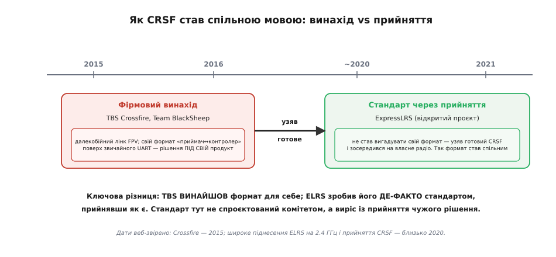
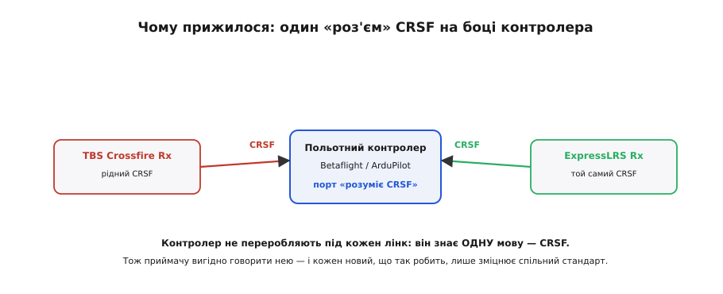

# 📜 Історія CRSF: як фірмовий формат став спільною мовою

Є речі, що стають стандартом за наказом комітету — метр, вольт, розетка на стіні. І є речі, що стають стандартом інакше: хтось робить власне рішення для власного продукту, воно виявляється настільки вдалим, що незалежний, часто конкурентний проєкт вирішує не винаходити свого, а взяти готове. Так стандарт **виростає з прийняття**, а не з декрету. Саме така історія в CRSF — двійкового формату, яким сьогодні майже кожен далекобійний лінк керування розмовляє з польотним контролером усередині моделі.

Ця історія варта уваги, бо в ній видно рідкісну річ у чистому вигляді: **межу між винаходом однієї компанії й галузевою стандартизацією**. CRSF придумали в TBS для однієї конкретної системи. А спільною мовою цілої галузі його зробив зовсім інший проєкт — відкритий, який просто відмовився вигадувати своє. Розплутати, хто що зробив і **чому** формат прижився, — корисний урок про те, як узагалі народжуються стандарти в техніці.

*Дві епохи однієї мови. Ліворуч — фірмовий винахід: Team BlackSheep робить далекобійний лінк TBS Crossfire (2015) і разом із ним — власний формат «приймач↔контролер» поверх звичайного UART, рішення суто під свій продукт. Праворуч — стандартизація через прийняття: відкритий проєкт ExpressLRS (широке піднесення близько 2020) не став вигадувати свій формат, а взяв готовий CRSF і зосередився на власне радіо. Так формат однієї компанії став спільним для всіх. Дати веб-звірено.*

---

## Що бентежило: керувати моделлю за обрієм

Щоб зрозуміти, навіщо TBS узагалі взялися винаходити формат, треба відчути задачу, яку вони собі поставили. У середині 2010-х аматорські системи керування радіокерованими моделями працювали переважно на 2.4 ГГц. Це зручна смуга — компактні антени, дешеві мікросхеми, — але має неприємну рису: на 2.4 ГГц сигнал кепсько огинає перешкоди й швидко тане з відстанню. Пілоти FPV (англ. *First Person View* — «вид від першої особи», політ за картинкою з бортової камери) раз по раз натикалися на ту саму стіну: відео ще якось долітало, а керування зникало на першому-другому кілометрі, і модель ставала некерованою.

TBS Crossfire народився як відповідь саме на цей біль: далекобійний лінк, що тримає керування там, де звичні системи вже здалися. Технічно виграш дали два ходи. Перший — піти в нижчу смугу: Crossfire працює на 868/915 МГц (залежно від регіону), а нижча частота огинає перешкоди й летить далі за ту саму потужність. Другий — застосувати модуляцію, стійку до слабкого сигналу, з розширенням спектра, щоб чути передавач глибоко в шумі. Разом це дало дальність, яку в рекламі TBS без скромності назвали «beyond comprehension» — «поза межами розуміння».

Але нас тут цікавить не радіо, а те, що всередині. Бо коли ти будуєш новий лінк керування з нуля, перед тобою постає питання, повз яке не пройти: **якою мовою приймач на борту говоритиме з польотним контролером по дроту?**

> 🔧 **Навіщо це.** Історія тут не прикраса. Зрозумівши, що CRSF **проєктували під конкретний продукт**, а не як універсальний стандарт, ти перестаєш дивуватися його дивинам — чому саме такі адреси пристроїв, чому власна шкала каналів замість звичних мікросекунд, чому напівдуплекс. Це не примхи «стандарту»: це сліди рішень, ухвалених під одну систему TBS, які потім усі успадкували разом із форматом.

## Хто: Team BlackSheep і людина за нею

**Team BlackSheep** (TBS) — компанія, що виросла з FPV-спільноти, а не з корпоративного світу. Її обличчя й засновник — **Рафаель Піркер** (*Raphael Pirker*), більше знаний під псевдонімом **Trappy**; за походженням австрієць, він став однією з чільних постатей раннього далекобійного FPV. TBS робили те, чого самі хотіли як пілоти: камери, передавачі відео, антени, — а логічним кроком став і власний лінк керування.

Тут варто зупинитися на різниці, яку легко змазати. Коли кажуть «TBS винайшли CRSF», за цим стоїть **компанія й команда інженерів**, а не самотній геній із осяянням. Формат — робочий інструмент, вирощений під конкретну систему й відшліфований роками експлуатації на реальних моделях. Це типовий шлях інженерного винаходу: не спалах ідеї, а **накопичення рішень** під тиском справжніх обмежень — залізо, дроти, затримка, завади. Кожна дивина CRSF — це закам'янілий слід одного з таких рішень.

**Статус доказовості.** Що TBS Crossfire з'явився **2015 року**, а сам формат оформився й дозрів у 2015–2016 роках, підтверджують і сторінки продукту TBS, і незалежні джерела FPV-спільноти — це **усталений факт**. Що CRSF — розробка Team BlackSheep саме для Crossfire, прямо стверджують і документація Betaflight (де константи CRSF підписані як надані TBS), і оглядові матеріали спільноти. Тут **сумніву немає**: авторство формату належить TBS однозначно.

## Чому саме UART: не вигадувати того, що вже є всюди

Найцікавіше інженерне рішення CRSF — те, чого TBS **не** стали робити. Вони не вигадали власної хитрої шини між приймачем і контролером. Вони взяли найбуденнішу річ, яка вже є на кожному мікроконтролері й на кожному польотному контролері, — [асинхронний послідовний порт UART](topic:com-devices/async-serial).

Чому це розумно, видно з простого міркування «а що, якби інакше». Придумай TBS свою фізичну лінію — і кожен виробник польотних контролерів мусив би додавати під неї окреме залізо, драйвери, піни. Ніхто б не додав. А UART уже стоїть **скрізь**: це той самий обмін, яким мікроконтролери спілкуються зі світом десятиліттями. Поставивши CRSF поверх звичайного UART на [кадрі 8N1](topic:com-devices/uart-frame) — вісім бітів даних, без парності, один стоповий, — TBS зробили формат таким, що його підхопить **будь-який** контролер без нового заліза. Ціна входу — нульова, і саме це згодом дало формату шанс стати спільним.

Швидкість вибрали помітно вищу за буденні 115 200 бод — близько **416 666 бод** (у прошивці Betaflight історично округлено до 420 000). Вища швидкість означає коротший кадр у часі, а отже — меншу затримку керування, що для лінка «стік → модель» критично.

> 🔧 **Навіщо це.** Ось урок, який переживе будь-який конкретний протокол: **найкраще фізичне рішення — часто те, яке ти не винаходиш**. Стати на всюдисущий UART замість власної шини — це не лінощі, а стратегія: чим нижчий поріг входу, тим більше шансів, що твоє рішення підхоплять. CRSF переміг не тому, що був хитромудрий, а почасти тому, що був **простий у прийнятті** — стояв на тому, що вже є в кожного.

## Напівдуплекс: одна лінія родом із однієї системи

Друге фірмове рішення — **напівдуплекс** (англ. *half-duplex* — «половинний обмін»): по одному дроту говорять обидві сторони, але по черзі. У рідній екосистемі TBS приймач Crossfire з'єднувався з контролером фактично однією сигнальною лінією, на якій керування тече вниз, а телеметрія протискається у проміжки вгору — як рація, де в кожну мить хтось один тримає кнопку.

Чому TBS обрали саме так? Бо це заощаджує дефіцитний ресурс — [апаратний UART на платі контролера](topic:com-devices/async-serial). Кожен UART наперечо: до них чіпляють GPS, передавач відео, датчики. Обійтися однією лінією замість двох — це звільнити другий UART під щось інше. Рішення народилося з обмеження конкретного заліза, і в цьому вся суть: **напівдуплекс CRSF — не абстрактна елегантність, а відповідь на брак портів у реальній системі TBS.**

Тут потрібна чесна деталь, яка часто плутає новачків, і історія її пояснює. Коли CRSF-приймач (особливо сучасний [ExpressLRS](topic:com-modulation/lora)) підключають до контролера на Betaflight чи [ArduPilot](topic:sys-dron/mavlink-packet), його типово заводять **двома дротами** — окремі TX і RX, повний дуплекс, — а не однією лінією. Тобто «на дроті» той самий формат CRSF може їхати і напівдуплексом (рідний стиль TBS), і повним дуплексом (звична схема на польотному контролері). Це **не суперечність**, а слід того, що формат ширший за одну схему підключення: TBS заклали ощадливий напівдуплекс під свою систему, а коли CRSF розійшовся по чужих контролерах, там прижилася простіша двопровідна схема. Один формат — різні способи його возити.

**Статус доказовості.** Що CRSF допускає й напівдуплексне (одна лінія), і повнодуплексне (дві лінії) підключення, прямо видно з коду й документації Betaflight та ExpressLRS, де обидва режими налаштовуються, — це **технічно підтверджений факт**, а не спрощення. Плутанина в мережевих обговореннях («CRSF — це напівдуплекс» проти «CRSF вимагає повний дуплекс») саме звідси й береться: обидві сторони мають рацію для свого способу підключення.

## Поворот: чужий проєкт бере готове

А тепер — головний поворот історії, заради якого її й варто розповісти. Кілька років CRSF лишався тим, чим народився: **фірмовим форматом однієї компанії** для однієї лінійки продуктів. Хочеш CRSF — купуєш Crossfire. І тут на сцену виходить зовсім інший гравець.

**ExpressLRS** (скорочено ELRS) — відкритий проєкт далекобійного лінка керування, що постав із хакерського експерименту на GitHub. Перший коміт у репозиторій зробив **Алессандро Карчоне** (*Alessandro Carcione*, у мережі **AlessandroAU**) **1 жовтня 2018 року**; поряд із ним проєкт піднімали **Джай Сміт** (*Jye Smith*), **Везлі Варті** (*Wezley Varty*) та ціла спільнота дописувачів. Спершу ELRS будували на дешевому LoRa-залізі Semtech (SX127x) у смузі 900 МГц, часто на готових модулях від чужих систем; згодом додали 2.4 ГГц на SX1280 — і саме на цій хвилі, **близько 2020 року**, проєкт вибухово розійшовся по FPV-спільноті, приваблюючи низькою ціною й малою затримкою проти фірмових систем.

І ось ключове рішення ELRS, у якому вся мораль історії. Створюючи новий лінк, вони мусили вирішити те саме питання, що колись TBS: якою мовою приймач говоритиме з контролером? Вони могли винайти свій формат. Але **не стали**. Вони взяли готовий, перевірений роками CRSF — і зосередили сили на тому, що справді хотіли зробити краще: на **самому радіолінку** (модуляція, дальність, оновлення, ціна). Розробка формату «приймач↔контролер» — робота велика й невдячна, і навіщо її повторювати, коли вже є робочий формат, який до того ж **уже розуміють** усі поширені польотні контролери?

*Механізм прийняття наочно. Польотний контролер (Betaflight чи ArduPilot) уже вміє одну мову — CRSF, — і має під неї готовий «роз'єм» на своєму порту. Тож і рідний приймач TBS Crossfire, і приймач ExpressLRS, обидва говорячи CRSF, вставляються в ту саму розетку без жодної переробки прошивки контролера. Приймачу вигідно говорити CRSF, бо тоді він працює всюди; а кожен новий пристрій, що так робить, лише зміцнює спільний стандарт. Так прийняття однією стороною закріпило формат для цілої галузі.*

Це рішення й перетворило CRSF із фірмового формату на **де-факто стандарт**. Механізм тут точний і вартий того, щоб його розібрати. Польотні контролери — Betaflight, ArduPilot — уже вміли CRSF, бо його додали заради популярного Crossfire. Отже, будь-який **новий** приймач, що говорить CRSF, вставляється в уже наявний «роз'єм» на боці контролера — без жодних змін у його прошивці. Для ELRS це означало: досить говорити CRSF — і твій приймач одразу працює з мільйонами вже наявних контролерів. Для контролера це означало: не треба вчити ще одну мову. Виграли обидві сторони, і формат закріпився не декретом, а **власною вигодою** кожного, хто його прийняв.

## Винахід проти стандартизації: у чому власне різниця

Складімо докупи те, що легко змішати, — бо саме на цій межі й побудована вся історія.

**TBS винайшли CRSF.** Це акт творення однієї компанії: формат спроєктували під конкретний продукт, під конкретне залізо, з конкретними компромісами (напівдуплекс під брак портів, власна шкала каналів, свій набір адрес пристроїв). Авторство однозначне, дата — 2015-й і навколо.

**ELRS стандартизували CRSF.** Це вже не творення, а **вибір**: узяти чуже готове рішення й зробити його спільним для галузі, прийнявши як є. ELRS не додали формату майже нічого — вони додали йому **поширеність**. Стандарт тут не спроєктований наперед комітетом, а виріс постфактум із того, що незалежний вагомий гравець вирішив не плодити ще одну мову.

Плутати ці дві речі — означає не бачити, як насправді працює техніка. Дуже часто **стандартом стає не найкраще спроєктоване, а найширше прийняте**. CRSF не був задуманий як універсальний — його задумали під один продукт. Універсальним його зробило чуже рішення не винаходити свого. Це не применшує TBS (їхній винахід виявився достатньо добрим, щоб його захотіли взяти) і не применшує ELRS (їхній вибір відкрив формат для всіх) — це просто **чесна картина** того, звідки беруться спільні мови в інженерії.

> 🔧 **Навіщо це.** Розрізняти «хто винайшов» і «хто зробив стандартом» — не педантизм, а робочий інструмент інженера. Коли читаєш, що якийсь формат чи інтерфейс «став стандартом», спитай: його **спроєктували** таким чи він **прижився** таким? Бо це різні речі з різними наслідками. Спроєктований стандарт зазвичай чистіший, але часто мертвіший; прижитий — з дивинами й спадком, але живий і всюдисущий. CRSF — з других: у ньому повно слідів походження від одного продукту, і саме тому, читаючи його дамп, корисно пам'ятати, звідки ці дивини ростуть. Та сама логіка стоїть і за іншими «народними» стандартами зв'язку — від [MAVLink](topic:sys-dron/control-telemetry/hist-mavlink.md), що виріс із аспірантського проєкту й розійшовся, бо був відкритий, до безлічі інтерфейсів, які перемогли не досконалістю, а прийняттям.

## Що з цього лишилось

Підіб'ємо підсумок на двох рівнях — технічному й ширшому.

**Про техніку.** Сьогодні CRSF — спільна мова між приймачем і польотним контролером у всій далекобійній RC-екосистемі: нею говорять і рідні системи TBS (Crossfire, Tracer), і відкритий ExpressLRS, а розуміють її всі поширені польотні контролери. Формат не змінив свого коріння: він і далі стоїть на звичайному UART, возить [пакет каналів керування](topic:sys-dron/rc-link) щільним потоком униз і [телеметрію](topic:sys-dron/telemetry-stream) — угору в проміжки, і захищає кожен кадр однобайтовим [CRC](topic:com-modulation/crc). Усі ці рішення — з тієї самої фірмової епохи 2015 року; ELRS не переписав їх, а успадкував.

**Про спосіб думати.** Перед нами жива ілюстрація того, як народжується стандарт у реальному світі. Не з чистого аркуша й не за постановою, а двома окремими вчинками різних людей у різний час: спершу **хтось винаходить** робоче рішення під свою потребу, потім **хтось інший приймає** його як спільне, бо переробляти нема сенсу. Team BlackSheep дали формат; ExpressLRS дали йому світ. І коли наступного разу натрапиш на «стандарт», що виглядає дивнувато й нелогічно, — згадай CRSF: дивини зазвичай означають, що річ **народилася** живою під конкретну задачу, а не була спроєктована стерильною в кабінеті. Живе рішення з історією майже завжди перемагає бездоганне рішення без неї.
