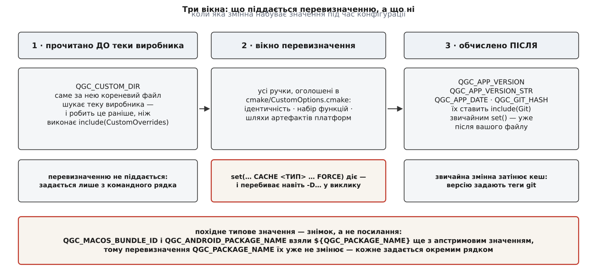

# 🎛️ Каталог перевизначень: усі ручки `CustomOverrides.cmake`

Тут зібрано кожну змінну, яку файл `custom/cmake/CustomOverrides.cmake` має право перезаписати: тип кешу, типове значення апстриму, куди значення доїжджає в готовому артефакті й що саме лишиться чужим, якщо цей рядок не написати. Довідник потрібен, щоб зібрати повний перелік того, за чим доведеться стежити при кожному оновленні апстриму, і щоб наперед відрізнити ручку, яку `FORCE` перевизначить, від тієї, на яку він не подіє взагалі.

Звірено з гілкою `master` репозиторію `mavlink/qgroundcontrol` 2 серпня 2026 року. Джерела: `cmake/CustomOptions.cmake` (де оголошено ручки), `custom-example/cmake/CustomOverrides.cmake` (взірцевий файл виробника), `CMakeLists.txt`, `cmake/modules/Git.cmake`, `cmake/platform/{Apple,Windows,Android}.cmake`, `cmake/install/{Install,CreateWinInstaller,CreateAppImage}.cmake`, `src/qgc_version.h.in`.

---

## Форма запису й що означають стовпчики

Апстрим оголошує ручки двома способами, і від цього залежить, як їх перезаписувати.

```cmake
# option(<ім'я> "<опис>" <ON|OFF>)  — це кешована змінна типу BOOL
option(QGC_NO_SERIAL_LINK "Disable serial port communication" OFF)

# set(<ім'я> <значення> CACHE <ТИП> "<опис>")  — тип задано явно
set(QGC_APP_NAME "QGroundControl" CACHE STRING "Application name")
```

Перевизначення завжди має форму `set(… CACHE <ТИП> "<опис>" FORCE)`, і `<ТИП>` мусить збігатися з оголошеним: `BOOL` для всього, що прийшло через `option()`, `STRING` для рядків, `FILEPATH` для окремого файлу, `PATH` для теки. Чому без `FORCE` присвоєння тихо нічого не робить — у [кеші CMake та опціях](root:sys-bsystem/cache-and-options): кешована змінна створюється лише тоді, коли її ще немає, а типові значення апстриму лягли в кеш раніше за ваш файл.

Стовпчик **«не перевизначили»** відповідає на єдине питання, заради якого цей перелік і потрібен: що конкретно поїде до покупця чужим, якщо рядка у вашому файлі не буде.



*Перевизначенню піддається лише середня група; крайні дві мовчки лишаються апстримовими, скільки `FORCE` до них не додавай.*

---

## Ідентичність

| Змінна | Тип | Типове значення | Куди доїжджає | Не перевизначили — і що |
|---|---|---|---|---|
| `QGC_APP_NAME` | `STRING` | `QGroundControl` | ім'я проєкту → ім'я цілі, виконуваного файлу й пакета; макрос у `qgc_version.h`; `QT_TARGET_PRODUCT_NAME` у ресурсі Windows; `QT_ANDROID_APP_NAME` | продукт зветься чужим іменем і ділить із чужим застосунком простір налаштувань |
| `QGC_ORG_NAME` | `STRING` | `QGroundControl` | макрос; `QT_TARGET_COMPANY_NAME` у ресурсі Windows | у властивостях `.exe` стоїть чужа компанія; друга половина шляху до налаштувань лишається чужою |
| `QGC_ORG_DOMAIN` | `STRING` | `qgroundcontrol.com` | макрос; `HOMEPAGE_URL` проєкту | те саме, плюс домашня адреса продукту веде на сайт апстриму |
| `QGC_PACKAGE_NAME` | `STRING` | `org.mavlink.qgroundcontrol` | макрос; імена файлів `<pkg>.desktop` і `<pkg>.appdata.xml`; аргумент `--desktop-file` при складанні AppImage | два застосунки з однаковим ідентифікатором не стають на пристрій поруч, магазин відмовляє в завантаженні |
| `QGC_APP_DESCRIPTION` | `STRING` | `Open Source Ground Control App` | опис проєкту → `QT_TARGET_DESCRIPTION` (Windows), `MACOSX_BUNDLE_INFO_STRING`; макрос | у списку програм і в описі пакунка стоїть чужий рядок |
| `QGC_APP_COPYRIGHT` | `STRING` | `Copyright (c) <поточний рік> QGroundControl. All rights reserved.` | `QT_TARGET_COPYRIGHT` (Windows), `MACOSX_BUNDLE_COPYRIGHT` | у властивостях файлу — чужий копірайт, і це вже юридичне твердження, а не косметика |
| `QGC_SETTINGS_VERSION` | `STRING` | `9` | макрос у `qgc_version.h`, **без лапок** | апстрим підіймає число, коли міняє свою схему ключів, — і ваші користувачі втрачають налаштування в момент, який ви не обирали |
| `QGC_CUSTOM_DIR` | `STRING` | `custom` | ім'я теки, яку кореневий файл шукає в дереві джерел | перевизначенню зсередини не піддається — див. пастки нижче |

Сім із восьми полів доїжджають у C++ не через параметри компілятора, а через згенерований заголовок: `src/qgc_version.h.in` — шаблон, у якому `@VAR@` замінюються на значення змінних CMake під час конфігурації.

```cpp
// src/qgc_version.h.in — цілком
#pragma once

#define QGC_APP_NAME "@QGC_APP_NAME@"
#define QGC_ORG_NAME "@QGC_ORG_NAME@"
#define QGC_ORG_DOMAIN "@QGC_ORG_DOMAIN@"
#define QGC_APP_VERSION_STR "@QGC_APP_VERSION_STR@"
#define QGC_APP_DATE "@QGC_APP_DATE@"
#define QGC_APP_DESCRIPTION "@QGC_APP_DESCRIPTION@"
#define QGC_PACKAGE_NAME "@QGC_PACKAGE_NAME@"
#define QGC_SETTINGS_VERSION @QGC_SETTINGS_VERSION@
```

Механізм такої підстановки — у [шаблонах `configure_file`](root:sys-bsystem/configure-file-templates): CMake читає файл-шаблон, замінює позначки на значення змінних і кладе результат у теку збірки; далі це звичайний заголовок. Звідси два практичні наслідки. Перший: рядкові поля обгорнуті лапками **в шаблоні**, тож у самому значенні лапок бути не повинно. Другий: `QGC_SETTINGS_VERSION` підставляється голим — покладете туди `"9"` або `9.1`, і зламається компіляція, а не конфігурація, тобто помилка спливе далеко від місця, де ви її зробили. Що це число робить із файлом налаштувань під час запуску — у [збереженні налаштувань](root:sys-dron/settings-persistence): станція звіряє його зі збереженим і при незбігу чистить файл повністю.

### Версія: єдине поле ідентичності, якого у файлі виробника немає

`QGC_APP_VERSION` виглядає як ручка — воно ж стоїть у оголошенні проєкту, — але в `cmake/CustomOptions.cmake` його немає. Його обчислює модуль `cmake/modules/Git.cmake`, і робить це **після** файлу виробника, звичайним `set()` без `CACHE`:

```cmake
execute_process(
    COMMAND ${GIT_EXECUTABLE} describe --always --tags --abbrev=0
    WORKING_DIRECTORY "${CMAKE_SOURCE_DIR}"
    OUTPUT_VARIABLE QGC_APP_VERSION
    OUTPUT_STRIP_TRAILING_WHITESPACE
    ERROR_QUIET
)
string(REGEX REPLACE "^v" "" QGC_APP_VERSION_CLEAN "${QGC_APP_VERSION}")
if(QGC_APP_VERSION_CLEAN MATCHES "^([0-9]+)\\.([0-9]+)\\.([0-9]+)")
    set(QGC_APP_VERSION "${QGC_APP_VERSION_CLEAN}")
    …
else()
    message(WARNING "QGC: Could not parse semantic version from Git tag: …")
    set(QGC_APP_VERSION "0.0.0")
endif()
```

| Величина | Звідки береться | Куди доїжджає |
|---|---|---|
| `QGC_APP_VERSION` | `git describe --always --tags --abbrev=0`, з відрізаним `v` | версія проєкту → `MACOSX_BUNDLE_BUNDLE_VERSION`, `QT_TARGET_VERSION`, `QT_ANDROID_VERSION_NAME` |
| `QGC_APP_VERSION_STR` | `git describe --always --tags` (з суфіксом `-<N>-g<sha>`) | макрос у `qgc_version.h` — саме цей рядок бачить користувач |
| `QGC_APP_VERSION_DEV` | число комітів після найближчого тега | `versionCode` пакета Android, щоб щоденні збірки не збігалися номером |
| `QGC_APP_DATE` | дата останнього коміта; при `QGC_STABLE_BUILD` — дата тегу | макрос у `qgc_version.h` |
| `QGC_GIT_HASH` | `git log -1 --format=%h` | те саме |

Три наслідки, які варто знати до першого релізу. Версію продукту задають **теги того checkout'а, що лежить у `CMAKE_SOURCE_DIR`** — тобто ваші, якщо ви форкнули QGC, і апстримові, якщо QGC входить до вас підмодулем. Тег, що не розбирається як `<число>.<число>.<число>`, дає попередження й версію `0.0.0`: правила, за якими ці три числа мають рухатися, — у [семантичному версіонуванні](root:sf-release/semantic-versioning). І збірка з дерева без `.git` — розпакованого архіву, шару контейнера, куди тека `.git` не скопійована — теж дає `0.0.0`, попередження в журналі конфігурації й нічого більше; докладний розбір цього кроку — у [версії з git-опису](root:sys-dron/release-model/proj-version-from-git.md).

---

## Набір функцій

| Змінна | Тип | Типово | Що робить `ON` | Побічний наслідок |
|---|---|---|---|---|
| `QGC_DISABLE_APM_MAVLINK` | `BOOL` | `OFF` | додає визначення `QGC_NO_ARDUPILOT_DIALECT` до головної цілі | код розбору повідомлень ArduPilot вирізається препроцесором |
| `QGC_DISABLE_APM_PLUGIN` | `BOOL` | `OFF` | прибирає зі збірки `APMFirmwarePlugin` і всі чотири `Ardu*FirmwarePlugin` | ресурси APM у бінарнику лишаються — див. нижче |
| `QGC_DISABLE_APM_PLUGIN_FACTORY` | `BOOL` | `OFF` | прибирає `APMFirmwarePluginFactory` | без нього попередній рядок не збереться |
| `QGC_DISABLE_PX4_PLUGIN` | `BOOL` | `OFF` | прибирає `PX4FirmwarePlugin` і `PX4ParameterMetaData` | так само вимагає вимкненої фабрики |
| `QGC_DISABLE_PX4_PLUGIN_FACTORY` | `BOOL` | `OFF` | прибирає `PX4FirmwarePluginFactory` | плагін лишається; вибирати його має ваша фабрика |
| `QGC_NO_SERIAL_LINK` | `BOOL` | `OFF` | не компілює `SerialLink` і `QGCSerialPortInfo`, не лінкує `Qt6::SerialPort`, додає однойменне визначення | зникає весь послідовний канал, разом із виявленням пристроїв на портах |
| `QGC_ENABLE_GST_VIDEOSTREAMING` | `BOOL` | **`ON`** | лишає відеотракт на GStreamer | вимикання забирає найважчу зовнішню залежність — і разом з нею питання про ліцензії тієї залежності |
| `QGC_ENABLE_BZIP2` | `BOOL` | `OFF` | вмикає bzip2 у libarchive і додає `QGC_ENABLE_BZIP2` до цілі `QGCCompression` | без нього архіви цього формату застосунок не розпакує |
| `QGC_ENABLE_LZ4` | `BOOL` | `OFF` | те саме для LZ4 | те саме |
| `QGC_STABLE_BUILD` | `BOOL` | `OFF` | прибирає визначення `QGC_DAILY_BUILD`; дата збірки береться від тегу, а не від останнього коміта | доки `OFF`, ім'я застосунку отримує суфікс ` Daily`, а з ним — окремий файл налаштувань |
| `QGC_ENABLE_WERROR` | `BOOL` | **`ON`** | попередження компілятора рахуються помилками | ваш код збирається з цим самим прапорцем |
| `QGC_BUILD_TESTING` | `BOOL` | `ON` у налагоджувальній збірці, інакше `OFF` | вмикає модульні тести | залежна опція — див. пастки |
| `QGC_BUILD_INSTALLER` | `BOOL` | **`ON`** | збирає інсталятори й пакунки платформи | вимикання лишає лише зібраний застосунок |

Прапорець щоденної збірки доїжджає в код генераторним виразом — рішення ухвалюється не при конфігурації, а при генерації файлів збірки:

```cmake
target_compile_definitions(${CMAKE_PROJECT_NAME}
    PRIVATE
        $<$<NOT:$<BOOL:${QGC_STABLE_BUILD}>>:QGC_DAILY_BUILD>
        $<$<BOOL:${QGC_DISABLE_APM_MAVLINK}>:QGC_NO_ARDUPILOT_DIALECT>
)
```

Форма `$<$<BOOL:…>:…>` розкривається в порожнечу, коли умова хибна, тож жодного `if` навколо не потрібно; чому це не те саме, що звичайна перевірка, — у [генераторних виразах](root:sys-bsystem/generator-expressions). Що саме означає позначка щоденної збірки для продукту — у [моделі релізів](root:sys-dron/release-model).

### Дві речі, які перемикачі польотного стеку роблять не так, як очікують

**Плагін без фабрики не збереться.** Фабрика створює саме ті класи, які прибирає перший перемикач:

```cpp
// src/FirmwarePlugin/APM/APMFirmwarePluginFactory.cc
#include "ArduCopterFirmwarePlugin.h"
#include "ArduPlaneFirmwarePlugin.h"
#include "ArduRoverFirmwarePlugin.h"
#include "ArduSubFirmwarePlugin.h"
```

Обидва перемикачі — це просто дві умови навколо `target_sources()` в одному файлі. Вимкнули плагін, лишили фабрику — її `.cc` компілюється, а тіл класів у збірці немає, і ви дізнаєтеся про це на етапі компонування. Тому взірцевий файл і вимикає три ручки APM разом. Зворотний бік дозволений і навмисний: фабрику без плагіна вимкнути **можна**, і саме це означає «своя фабрика для чужого плагіна». Що таке плагін прошивки й чим він відрізняється від фабрики — у [плагіні прошивки](root:sys-dron/firmware-plugin).

**Вимкнення плагіна не забирає ресурсів.** Умова стоїть тільки навколо джерел. Усе інше в тому самому `src/FirmwarePlugin/APM/CMakeLists.txt` виконується безумовно:

| Що лишається при `QGC_DISABLE_APM_PLUGIN=ON` | Скільки це коштує |
|---|---|
| завантаження `ArduPilot/ParameterRepository` через CPM під час конфігурації | мережа й місце на диску при кожній чистій конфігурації |
| десятки файлів `apm.pdef.json`, вбудованих у бінарник як ресурси | найбільший внесок у розмір |
| файли `*.OfflineEditing.params` | дрібниця |
| модуль QML `APMFirmwareModule` з індикаторами APM, злінкований із головною ціллю | дрібниця, але код усе ще в артефакті |

Фільтр `QGC_APM_PARAMS_EXCLUDE` (кешований `STRING`, типово відкидає `AP_Periph-*`, `Blimp-*` і гілки `3.x`) — єдина ручка, якою на цей обсяг узагалі можна вплинути: це перелік регулярних виразів, що звіряються з іменами тек на кшталт `Copter-4.7`. Хочете справді порожній бінарник без ArduPilot — доведеться або розширювати цей фільтр, або вносити відповідну умову в апстрим.

### MAVLink

| Змінна | Тип | Типове значення | Що вирішує |
|---|---|---|---|
| `QGC_MAVLINK_GIT_REPO` | `STRING` | `https://github.com/mavlink/mavlink.git` | з якого сховища брати XML-описи повідомлень |
| `QGC_MAVLINK_GIT_TAG` | `STRING` | `c409cf690454db6d3e004bd14173bc6c7ff1e0ff` | закріплений коміт: збірка відтворювана, оновлення — свідома правка одного рядка |
| `QGC_MAVLINK_DIALECT` | `STRING` | `all` | який діалект генерувати |
| `QGC_MAVLINK_VERSION` | `STRING` | `2.0` | версія протоколу для генератора |

Пара «сховище + коміт» і є всім механізмом переходу на власні повідомлення: ви вказуєте свій форк опису й свій коміт, генератор робить решту — розбір цього шляху у [власних повідомленнях MAVLink](root:sys-dron/custom-mavlink-messages), а що таке діалект як окремий набір повідомлень — у [діалектах MAVLink](root:sys-dron/mavlink-dialect). Двом сусіднім ручкам легко приписати зайве: `QGC_MAVLINK_DIALECT` обирає діалект для **генератора**, а `QGC_DISABLE_APM_MAVLINK` вирізає код станції, що працює з повідомленнями ArduPilot. Це різні шари, і вимкнення одного не робить другого.

---

## Артефакти платформ

Усі шляхи в апстримі — абсолютні, зібрані від `${CMAKE_SOURCE_DIR}`. Ваші мусять бути такими самими: ці значення читаються з інших каталогів збірки, де відносний шлях розв'яжеться від іншої бази. Що кожна платформа робить із цими файлами далі — у [цілях платформ](root:sys-dron/platform-targets).

### macOS

| Змінна | Тип | Типове значення (від кореня джерел) | Куди доїжджає |
|---|---|---|---|
| `QGC_MACOS_ICON_PATH` | `FILEPATH` | `deploy/macos/qgroundcontrol.icns` | лягає в `Resources` пакунка; ім'я файлу стає `MACOSX_BUNDLE_ICON_FILE` |
| `QGC_MACOS_PLIST_PATH` | `FILEPATH` | `deploy/macos/MacOSXBundleInfo.plist.in` | `MACOSX_BUNDLE_INFO_PLIST` — шаблон опису пакунка |
| `QGC_MACOS_ENTITLEMENTS_PATH` | `FILEPATH` | `deploy/macos/qgroundcontrol.entitlements` | перелік дозволів, що йде в `Resources` і далі в підпис |
| `QGC_MACOS_BUNDLE_ID` | `STRING` | значення `QGC_PACKAGE_NAME` на момент читання | `MACOSX_BUNDLE_GUI_IDENTIFIER` |
| `QGC_MACOS_UNIVERSAL_BUILD` | `BOOL` | `ON` | архітектури `x86_64h;arm64` |

### Linux і AppImage

| Змінна | Тип | Типове значення | Куди доїжджає |
|---|---|---|---|
| `QGC_APPIMAGE_ICON_256_PATH` | `FILEPATH` | `deploy/linux/QGroundControl_256.png` | встановлюється як `<ім'я цілі>.png` у растрову теку значків |
| `QGC_APPIMAGE_ICON_SCALABLE_PATH` | `FILEPATH` | `deploy/linux/QGroundControl.svg` | те саме для масштабованого значка |
| `QGC_APPIMAGE_DESKTOP_ENTRY_PATH` | `FILEPATH` | `deploy/linux/org.mavlink.qgroundcontrol.desktop.in` | шаблон запису меню → `<QGC_PACKAGE_NAME>.desktop` |
| `QGC_APPIMAGE_METADATA_PATH` | `FILEPATH` | `deploy/linux/org.mavlink.qgroundcontrol.appdata.xml.in` | шаблон опису для крамниць пакунків |
| `QGC_APPIMAGE_APPRUN_PATH` | `FILEPATH` | `deploy/linux/AppRun` | сценарій запуску всередині образу, копіюється як є |
| `QGC_APPIMAGE_APPDATA_DEVELOPER` | `STRING` | `qgroundcontrol` | ім'я розробника в описі |
| `QGC_CREATE_APPIMAGE` | `BOOL` | `ON` | чи запускати складання образу після встановлення |

Два шаблони з розширенням `.in` проходять ту саму підстановку, що й заголовок версії, а імена вихідних файлів беруться з `QGC_PACKAGE_NAME`. Тобто перевизначили ідентифікатор пакета — і запис меню з описом уже названі по-вашому, навіть якщо самих шаблонів ви не чіпали.

### Windows

| Змінна | Тип | Типове значення | Куди доїжджає |
|---|---|---|---|
| `QGC_WINDOWS_ICON_PATH` | `FILEPATH` | `deploy/windows/WindowsQGC.ico` | `QT_TARGET_RC_ICONS` цілі й значок інсталятора NSIS |
| `QGC_WINDOWS_INSTALL_HEADER_PATH` | `FILEPATH` | `deploy/windows/installheader.bmp` | картинка-шапка інсталятора (передається як `HEADER_BITMAP`) |
| `QGC_WINDOWS_RESOURCE_FILE_PATH` | `FILEPATH` | `deploy/windows/QGroundControl.rc` | **запасний шлях**, який зазвичай не спрацьовує |

Останній рядок варто прочитати уважно. Ресурс Windows добувається послідовністю з трьох гілок, і перша з них перекриває решту:

```cmake
if(COMMAND _qt_internal_generate_win32_rc_file)
    set_target_properties(${CMAKE_PROJECT_NAME} PROPERTIES
        QT_TARGET_COMPANY_NAME "${QGC_ORG_NAME}"
        QT_TARGET_COPYRIGHT    "${QGC_APP_COPYRIGHT}"
        QT_TARGET_PRODUCT_NAME "${CMAKE_PROJECT_NAME}"
        QT_TARGET_RC_ICONS     "${QGC_WINDOWS_ICON_PATH}")
    _qt_internal_generate_win32_rc_file(${CMAKE_PROJECT_NAME})
elseif(EXISTS "${QGC_WINDOWS_RESOURCE_FILE_PATH}")
    …
```

Із сучасним Qt6 команда з першої умови є завжди, тож ресурсний файл генерується з властивостей цілі, а `QGC_WINDOWS_RESOURCE_FILE_PATH` не читається взагалі. Практичний висновок: щоб змінити те, що показує Windows у властивостях `.exe`, перевизначайте `QGC_ORG_NAME`, `QGC_APP_COPYRIGHT`, `QGC_APP_NAME` і `QGC_WINDOWS_ICON_PATH` — підміна власного `.rc` мовчки не подіє.

У `cmake/install/CreateWinInstaller.cmake` читається ще одна змінна, `QGC_WINDOWS_INSTALLER_SCRIPT` — шлях до сценарію NSIS. У `cmake/CustomOptions.cmake` її немає, тож типове значення перевіряйте у своїй версії, перш ніж на неї спиратися.

### Android і пакування

| Змінна | Тип | Типове значення | Куди доїжджає |
|---|---|---|---|
| `QGC_ANDROID_PACKAGE_NAME` | `STRING` | значення `QGC_PACKAGE_NAME` на момент читання | `QT_ANDROID_PACKAGE_NAME` |
| `QGC_ANDROID_PACKAGE_SOURCE_DIR` | `PATH` | `android` від кореня джерел | `QT_ANDROID_PACKAGE_SOURCE_DIR` — дерево шаблону пакета |
| `QGC_CPACK_GENERATOR` | `STRING` | порожньо | генератор для цілі `qgc-package` понад типовий інсталятор |

Допустимі значення генератора залежать від платформи: під Windows — `NSIS`, `IFW`, `TXZ`; під macOS — `DragNDrop`, `Bundle`, `productbuild`, `IFW`, `TXZ`; під Linux — `DEB`, `RPM`, `TXZ`. Порожнє значення означає «додаткового пакунка не робимо». Що взагалі робить із цілей і файлів дистрибутив — у [CPack](root:sys-bsystem/cpack).

`QGC_ANDROID_PACKAGE_SOURCE_DIR` — єдиний шлях у цьому переліку, який зазвичай не перевизначають напряму у файлі перевизначень: взірцевий `custom-example/CMakeLists.txt` спершу складає дерево шаблону в теці збірки й лише потім вказує на результат. Причина проста — так правки апстриму в решті дерева приїжджають самі.

---

## Пастки

| Що робите | Що станеться | Чому мовчки |
|---|---|---|
| `set(QGC_CUSTOM_DIR "vendor" … FORCE)` у файлі виробника | нічого; тека далі шукається як `custom` | змінну прочитали, щоб знайти вашу теку, ще до того, як почали виконувати ваш файл |
| `set(QGC_APP_VERSION "3.2.0" … FORCE)` | версія все одно з тегів git | `include(Git)` виконується пізніше й ставить звичайну змінну, яка затінює кеш |
| перевизначили `QGC_PACKAGE_NAME`, розраховуючи, що зміняться пакунок macOS і пакет Android | ідентифікатори лишаються апстримовими | похідні типові значення — знімок: `${QGC_PACKAGE_NAME}` розкрилося ще з апстримовим значенням |
| перевизначили `QGC_BUILD_TESTING` чи `QGC_DEBUG_QML` | значення тримається, доки збігається з типом збірки | це `cmake_dependent_option`: за невиконаної умови макрос щоразу ставить примусове значення звичайною змінною |
| поклали свій `.rc` у `QGC_WINDOWS_RESOURCE_FILE_PATH` | властивості `.exe` лишаються апстримовими | гілку з цією змінною перекриває генерація ресурсу засобами Qt |
| `if(EXISTS "res/icons/my.icns")` з відносним шляхом | умова поводиться непередбачувано | CMake визначає `if(EXISTS)` лише для повних шляхів |
| `set(QML_IMPORT_PATH ${QML_IMPORT_PATH} "…/res" CACHE STRING "" FORCE)` | при кожній переконфігурації список довшає на той самий елемент | без `FORCE` кеш зберігає попереднє значення, а `FORCE` дописує до вже дописаного |
| задали `QGC_APP_NAME` з командного рядка | ваш `-D…` мовчки програє файлу виробника | `FORCE` перебиває не лише типове значення, а й задане людиною |

Останній рядок таблиці — не помилка конструкції, а її ціна: збірка продукту однозначна, зате менш налаштовувана, ніж апстримова. Апстрим пом'якшує це там, де може, умовою наявності файлу — `if(EXISTS …)` навколо шляхів до значків: «моє, якщо я його поклав». Для приросту списків безпечна форма інша:

```cmake
set(_paths ${QML_IMPORT_PATH} "${CMAKE_SOURCE_DIR}/${QGC_CUSTOM_DIR}/res")
list(REMOVE_DUPLICATES _paths)
set(QML_IMPORT_PATH ${_paths} CACHE STRING "Additional QML import paths" FORCE)
```

---

## Мінімальний робочий файл

Найкоротший `custom/cmake/CustomOverrides.cmake`, який дає окремий продукт із власною ідентичністю, власним простором налаштувань і одним польотним стеком:

```cmake
# --- ідентичність ---
set(QGC_APP_NAME         "Acme GCS"        CACHE STRING "Application name" FORCE)
set(QGC_ORG_NAME         "Acme Robotics"   CACHE STRING "Organization name" FORCE)
set(QGC_ORG_DOMAIN       "acme.example"    CACHE STRING "Organization domain" FORCE)
set(QGC_PACKAGE_NAME     "com.acme.gcs"    CACHE STRING "Package identifier" FORCE)
set(QGC_APP_DESCRIPTION  "Acme ground control station" CACHE STRING "Application description" FORCE)
set(QGC_APP_COPYRIGHT    "Copyright (c) 2026 Acme Robotics" CACHE STRING "Copyright notice" FORCE)
set(QGC_SETTINGS_VERSION "1"               CACHE STRING "Settings schema version" FORCE)

# похідні ідентифікатори — окремими рядками, бо їхні типові значення вже обчислені
set(QGC_MACOS_BUNDLE_ID       "com.acme.gcs" CACHE STRING "macOS bundle identifier" FORCE)
set(QGC_ANDROID_PACKAGE_NAME  "com.acme.gcs" CACHE STRING "Android package identifier" FORCE)

# --- набір функцій ---
set(QGC_DISABLE_APM_MAVLINK        ON CACHE BOOL "Disable ArduPilot MAVLink dialect" FORCE)
set(QGC_DISABLE_APM_PLUGIN         ON CACHE BOOL "Disable ArduPilot plugin" FORCE)
set(QGC_DISABLE_APM_PLUGIN_FACTORY ON CACHE BOOL "Disable ArduPilot plugin factory" FORCE)
set(QGC_DISABLE_PX4_PLUGIN_FACTORY ON CACHE BOOL "Disable PX4 plugin factory" FORCE)
set(QGC_STABLE_BUILD               ON CACHE BOOL "Stable release build" FORCE)

# --- значки: тільки те, що справді поклали ---
foreach(_pair
        "QGC_MACOS_ICON_PATH|res/icons/acme.icns"
        "QGC_APPIMAGE_ICON_SCALABLE_PATH|res/icons/acme.svg"
        "QGC_WINDOWS_ICON_PATH|deploy/windows/acme.ico")
    string(REPLACE "|" ";" _pair "${_pair}")
    list(GET _pair 0 _var)
    list(GET _pair 1 _rel)
    set(_abs "${CMAKE_SOURCE_DIR}/${QGC_CUSTOM_DIR}/${_rel}")
    if(EXISTS "${_abs}")
        set(${_var} "${_abs}" CACHE FILEPATH "custom ${_var}" FORCE)
    endif()
endforeach()
```

Вісім рядків ідентичності, чотири рядки набору функцій, цикл на значки — і повний перелік того, за чим доведеться стежити при кожному оновленні апстриму, уміщається в один екран. Це й є одиниця виміру вартості власної збірки.
