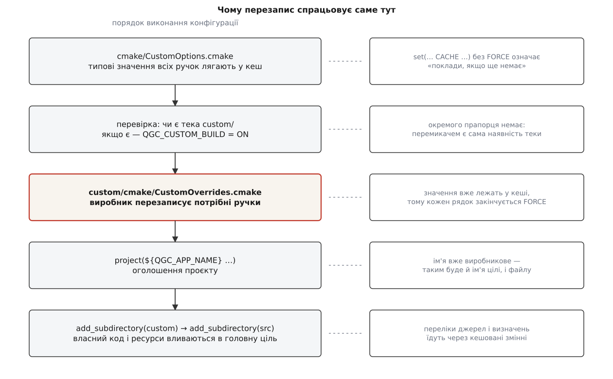
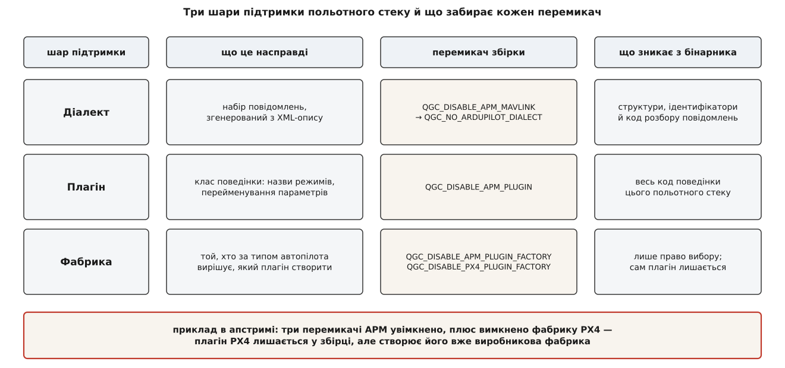
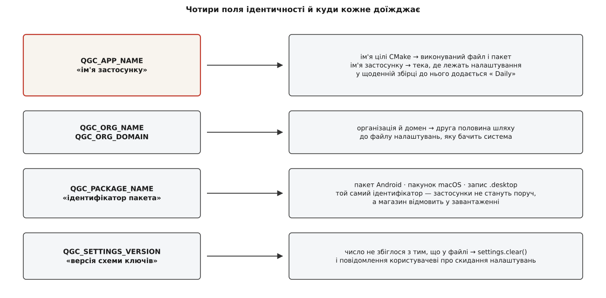

# Власна збірка: набір функцій і бренд

<preknowlist>
- [Кеш CMake, опції та їхнє життя між прогонами](root:sys-bsystem/cache-and-options) — що таке кешована змінна, чим `set(… CACHE …)` відрізняється від звичайного присвоєння і навіщо `FORCE`.
- [Мова CMakeLists: змінні, області, потік керування](root:sys-bsystem/cmake-language) — `if`, `include`, `add_subdirectory` і порядок виконання файлу конфігурації.
- [Препроцесор і заголовки](root:embedded/c-preprocessor-headers) — умовна компіляція: `#ifdef` вирізає код ще до компілятора.
- [Ядрове розширення: головна точка кастомізації](root:sys-dron/core-plugin) — як виробник підміняє поведінку застосунку, не чіпаючи файлів апстриму.
- [Діалекти MAVLink](root:sys-dron/mavlink-dialect) — діалект як окремий набір повідомлень, згенерований з XML-опису.
- [Збірка QGroundControl: залежності й кроки](root:sys-dron/building-qgc) — з чого взагалі складається складання застосунку з джерел.
</preknowlist>

Виробник дрона вже розв'язав питання поведінки: ядрове розширення дає йому підмінити методи, сховати екрани, підставити свої об'єкти. Але продає він не поведінку. Продає файл — інсталятор, який покупець завантажить, запустить і побачить у списку програм назву фірми, а не чужу. І цей файл має ще кілька властивостей, до яких жоден гачок не дотягується.

## Три речі, яких гачок зробити не може

Перша: гачок ховає кнопку, але код за кнопкою лишається всередині. Станція, у якій сторінку ArduPilot приховано прапорцем, — це станція з повним кодом ArduPilot усередині. Вона такого самого розміру, збирається стільки ж часу, і в ній живий шлях виконання, який у цьому продукті ніхто не випробовував. Досить одного повідомлення, що прийшло від апарата з несподіваним типом автопілота, — і цей шлях увімкнеться сам.

Друга: гачок працює всередині застосунку, який уже запустився. А ім'я в списку програм, значок на панелі задач, ідентифікатор пакета в магазині застосунків — це властивості файлу, які операційна система читає **до** того, як виконається бодай один рядок коду. Змінити їх зсередини неможливо за визначенням.

Третя: частина рішень узагалі не про код. З якого сховища брати опис повідомлень MAVLink. Чи класти всередину дистрибутива відеорушій вагою в сотні мегабайтів. Який файл значка покласти в інсталятор під Windows і який — у пакет під Linux. Тут немає методу, який можна перевизначити, бо немає об'єкта.

Спільне в усіх трьох — момент. Кожне з цих рішень ухвалюється **до компіляції**, а отже, потрібен другий шов: не в коді, а в конфігурації збірки. І він мусить лежати там само, де перший, — інакше зникає вся вигода, заради якої конструкцію будували: щоб у файлах апстриму не було жодного рядка різниці.

## Одна тека і є перемикачем

Розвилка вирішується наявністю каталогу. Кореневий файл конфігурації дивиться, чи є в дереві джерел тека з ім'ям, записаним у змінній `QGC_CUSTOM_DIR` (типово — `custom`):

```cmake
if(IS_DIRECTORY "${CMAKE_SOURCE_DIR}/${QGC_CUSTOM_DIR}")
    message(STATUS "QGC: Custom build directory detected: ${QGC_CUSTOM_DIR}")
    set(QGC_CUSTOM_BUILD ON)
    list(APPEND CMAKE_MODULE_PATH "${CMAKE_SOURCE_DIR}/${QGC_CUSTOM_DIR}/cmake")
    include(CustomOverrides)
endif()
```

Прапорця «збери мені виробникову версію» немає — тека і є прапорцем. Приклад, що лежить в апстримі, зветься `custom-example`, і весь ритуал вмикання власної збірки — перейменувати його на `custom`. Прибрали теку — та сама копія джерел зібралася в звичайний QGroundControl.

Три рядки всередині роблять три різні речі. `QGC_CUSTOM_BUILD` вмикає режим для решти конфігурації. Додавання до `CMAKE_MODULE_PATH` дозволяє шукати модулі в теці виробника. А `include(CustomOverrides)` виконує єдиний файл, у якому виробник **оголошує свої значення** — саме він і є декларацією продукту. Власний код і ресурси під'єднаються пізніше, окремим кроком, і про них далі.

## Чому перезапис працює лише в цьому порядку

Тут ховається механіка, без якої решта не читається.

Апстрим тримає всі свої ручки в одному файлі, `cmake/CustomOptions.cmake`: кілька десятків `option()` і `set(… CACHE …)` з типовими значеннями — від імені застосунку до порогів покриття тестами. Цей файл виконується **першим**, ще до перевірки на теку. Отже, коли `CustomOverrides` виробника нарешті доходить до виконання, усі ці змінні в кеші вже є.

І тут спрацьовує властивість кешу, яку легко пропустити: звичайне `set(X … CACHE …)` означає не «поклади», а «поклади, якщо ще немає». Значення вже лежить — присвоєння тихо не робить нічого. Тому кожен рядок у файлі виробника закінчується `FORCE`:

```cmake
set(QGC_APP_NAME "Custom-QGroundControl" CACHE STRING "App Name" FORCE)
set(QGC_ANDROID_PACKAGE_NAME "org.mavlink.customqgroundcontrol" CACHE STRING "Android package identifier" FORCE)
```

`FORCE` — не оздоба й не забобон, а точна відповідь на те, що виробник приходить другим.

Далі йде третій крок, і він пояснює, чому перевизначення імені має такі широкі наслідки. Оголошення проєкту виконується **після** обох файлів:

```cmake
project(${QGC_APP_NAME}
    VERSION ${QGC_APP_VERSION}
    DESCRIPTION "${QGC_APP_DESCRIPTION}"
    HOMEPAGE_URL "https://${QGC_ORG_DOMAIN}"
    LANGUAGES C CXX
)
```

Тобто на момент, коли CMake дізнається, як зветься проєкт, ім'я вже виробникове. А оскільки далі весь застосунок збирається як ціль з іменем `${CMAKE_PROJECT_NAME}`, під цим іменем виходить і виконуваний файл, і пакет.



*Перезапис можливий рівно тому, що файл виробника читається після типових значень і перед усіма, хто ці значення вживає; змінна, прочитана раніше за детекцію теки, перевизначенню не піддається.*

> 🔧 **Навіщо це.** Коли ваше перевизначення «не діє», перевірок рівно три, і всі дешеві. Чи це справді кешована змінна апстриму, а не звичайна. Чи стоїть `FORCE`. І чи не вживає її апстрим раніше, ніж дійде до вашої теки — бо тоді перезапис відбудеться, але спізниться, і в бінарник поїде типове значення. Три питання за хвилину замість вечора з `message(STATUS …)`.

У `FORCE` є й зворотний бік, і про нього краще знати заздалегідь: він перебиває не лише типове значення, а й те, що людина задала в командному рядку. Виклик `cmake -DQGC_APP_NAME=…` мовчки програє файлу виробника. Для продукту це радше добре — збірка однозначна, — але власна збірка стає менш налаштовуваною, ніж апстримова. Приклад апстриму пом'якшує це прийомом, який варто перейняти: шляхи до значків перевизначаються не беззастережно, а під умовою наявності файлу.

```cmake
if(EXISTS "${CMAKE_SOURCE_DIR}/${QGC_CUSTOM_DIR}/res/icons/custom_qgroundcontrol.icns")
    set(QGC_MACOS_ICON_PATH "${CMAKE_SOURCE_DIR}/${QGC_CUSTOM_DIR}/res/icons/custom_qgroundcontrol.icns"
        CACHE FILEPATH "MacOS Icon Path" FORCE)
endif()
```

Замість «завжди моє» виходить «моє, якщо я його поклав». Тека без значка під macOS збереться зі стандартним, а не впаде на неіснуючому шляху.

## Набір функцій — це не «сховати», а «не зібрати»

Тепер до першої половини заголовка. Показовий приклад в апстримі виглядає так:

```cmake
# Зібрати один польотний стек: підтримку APM вимкнено
set(QGC_DISABLE_APM_MAVLINK ON CACHE BOOL "Disable APM Dialect" FORCE)
set(QGC_DISABLE_APM_PLUGIN ON CACHE BOOL "Disable APM Plugin" FORCE)
set(QGC_DISABLE_APM_PLUGIN_FACTORY ON CACHE BOOL "Disable APM Plugin Factory" FORCE)

# Своя фабрика плагінів для PX4
set(QGC_DISABLE_PX4_PLUGIN_FACTORY ON CACHE BOOL "Disable PX4 Plugin Factory" FORCE)
```

Чотири рядки, і в них видно всю логіку відсікання. Підтримка одного польотного стеку — не одна річ, а три шари, і кожен вимикається окремо, бо потрібні вони бувають у різних поєднаннях.

**Діалект** — це набір повідомлень, згенерований з XML-опису: структури, ідентифікатори, функції розбору. Вимикання перетворюється на макрос `QGC_NO_ARDUPILOT_DIALECT`, який видно прямо в конфігурації джерел:

```cmake
target_compile_definitions(${CMAKE_PROJECT_NAME}
    PRIVATE
        $<$<NOT:$<BOOL:${QGC_STABLE_BUILD}>>:QGC_DAILY_BUILD>
        $<$<BOOL:${QGC_DISABLE_APM_MAVLINK}>:QGC_NO_ARDUPILOT_DIALECT>
)
```

Далі спрацьовує звичайна умовна компіляція: код, що розбирає ці повідомлення, у бінарник не потрапляє взагалі. Не ховається — не існує.

**Плагін** — це клас поведінки: назви режимів польоту, перейменування параметрів між версіями прошивки, особливості команд. Він може бути потрібен навіть тоді, коли діалект уже не потрібен, і навпаки; тому це окремий перемикач. Що саме такий плагін описує — тема [плагіна прошивки](root:sys-dron/firmware-plugin).

**Фабрика** — це той, хто під час під'єднання дивиться на тип автопілота й вирішує, який плагін створити. Її вимикають окремо з несподіваної на перший погляд причини: буває, що плагін потрібен, а вибирати його виробник хоче сам. Саме це й робить приклад в останньому рядку — лишає плагін PX4 у збірці, але забирає в апстриму право вирішувати, коли той плагін створюється, бо реєструє власну фабрику. «Свій польотний стек» тут означає не іншу поведінку, а інший розподіл рішень.



*Вимкнення діалекту забирає код розбору повідомлень, вимкнення плагіна — код поведінки, вимкнення самої фабрики лишає плагін у збірці, але передає рішення про його створення виробникові.*

Ручок набору функцій більше, і вони цікаві саме тим, що кожна забирає щось велике. `QGC_NO_SERIAL_LINK` викидає весь послідовний канал — це осмислено для станції, яка спілкується з апаратом лише радіомостом і не має ані роз'єму, ані права відкривати порти; що при цьому втрачається, видно в темі про [типи каналів](root:sys-dron/link-types). `QGC_ENABLE_GST_VIDEOSTREAMING` вимикає найважчу зовнішню залежність застосунку — [відеотракт на GStreamer](root:sys-dron/video-manager); вимкнення економить не лише розмір, а й цілу гілку питань про ліцензії залежностей. Пара `QGC_MAVLINK_GIT_REPO` і `QGC_MAVLINK_GIT_TAG` вказує, з якого сховища й з якого саме коміта брати опис повідомлень: заміна цих двох рядків — увесь механізм переходу на [власні повідомлення](root:sys-dron/custom-mavlink-messages), а закріплений коміт замість гілки — звичайне [закріплення версії залежності](root:sys-bsystem/version-pinning). `QGC_STABLE_BUILD` вирішує, чи буде збірка позначена як щоденна, і тим самим прив'язує продукт виробника до [моделі релізів](root:sys-dron/release-model).

Різниця між цими перемикачами й прапорцями ядрового розширення не косметична, і плутати їх дорого. Прапорець `QGCOptions` — рішення часу роботи: його можна перемкнути, і саме на цьому тримається розширений режим, у якому сервісний інженер бачить те, чого не бачить покупець. Опція збірки — рішення, після якого перемикати нема чого: коду немає. Тому питання, за яким проходить межа, звучить так: чи хочу я, щоб це колись могло ввімкнутися в цьому продукті? Якщо колись — прапорець; якщо ніколи — опція. Ця ж межа відома ширше під назвою різниці між [прапорцями функцій](root:sf-release/feature-flags) і збірковою конфігурацією, і плата за помилку в обидва боки однакова: зайвий код у продукті або неможливість увімкнути потрібне без перезбирання.

Повний перелік ручок — що саме можна перевизначити, з якими типовими значеннями й у яких одиницях — зібрано в [каталозі перевизначень власної збірки](root:sys-dron/custom-build/api-custom-overrides.md).

## Бренд — це ім'я, за яким система впізнає застосунок

Друга половина заголовка обманює очікування. Бренд тут — не кольори й не логотип: палітру підмінює гачок, значки — підміна ресурсів. Бренд на рівні збірки означає **ідентичність артефакту**: під яким іменем застосунок існує для операційної системи, магазину й самого себе.

Ім'я застосунку доїжджає в код окремою макро-константою, і застосунок під час запуску робить із ним ось що:

```cpp
QString applicationName;
if (_runningUnitTests || _simpleBootTest) {
    // …ім'я з міткою тесту, щоб прогони не заважали один одному
} else {
#ifdef QGC_DAILY_BUILD
    applicationName = QStringLiteral("%1 Daily").arg(QGC_APP_NAME);
#else
    applicationName = QGC_APP_NAME;
#endif
}

setApplicationName(applicationName);
setDesktopFileName(QGC_PACKAGE_NAME);
setOrganizationName(QGC_ORG_NAME);
setOrganizationDomain(QGC_ORG_DOMAIN);
setApplicationVersion(QString(QGC_APP_VERSION_STR));
```

Придивімося до гілки з «Daily». Навіщо щоденній збірці інше ім'я, якщо вона й так позначена версією? Бо ім'я застосунку разом з іменем організації визначає, **де лежить файл налаштувань**. Щоденна збірка, названа інакше, дістає власний файл і не псує налаштувань стабільної, установленої поруч. Тобто ім'я тут — не напис, а простір імен.

Звідси прямий наслідок для виробника, і він приємний: змінивши `QGC_APP_NAME`, ви автоматично отримали власний простір налаштувань і не успадкували чужого. Виробник, який «просто поміняв напис на заставці» гачком, лишив собі чужий простір — і його станція ділить [файл налаштувань](root:sys-dron/settings-persistence) з апстримовою, установленою на тій самій машині. Дві програми пишуть в один файл ключі, які розуміють по-різному.

`QGC_PACKAGE_NAME` працює на іншому рівні — це ідентифікатор пакета, за яким застосунок знає система, а не людина. Він же типово стає ідентифікатором пакета Android і ідентифікатором пакунка macOS. Не змінили — і два застосунки з однаковим ідентифікатором не стануть на пристрій поруч, а магазин просто не прийме завантаження, бо цей ідентифікатор уже зайнятий чужим обліковим записом.

Окремо стоїть `QGC_SETTINGS_VERSION` — число, а не ім'я, і поводиться воно жорстко:

```cpp
if (settings.contains(_settingsVersionKey)) {
    if (settings.value(_settingsVersionKey).toInt() != QGC_SETTINGS_VERSION) {
        settings.clear();
        _settingsUpgraded = true;
    }
}
```

Незбіг числа означає повне очищення налаштувань і повідомлення користувачеві, що все скинуто до типового. Апстрим підіймає це число, коли схема ключів змінилася так, що старий файл читати небезпечно. Виробник, який залишив число апстримовим, тим самим прийняв чуже рішення чистити налаштування **своїх** користувачів у момент, який він не контролює. Свій набір ключів — привід вести свій лічильник.



*Чотири поля ідентичності розходяться в різні шари системи, тому «поміняти назву» — не косметична правка: разом з іменем змінюється й місце, де застосунок тримає налаштування.*

## Значки й пакування: підмінюємо шлях, а не файл

Далі — те, що людина зазвичай і має на увазі під брендом. Значків і супровідних файлів у застосунку багато, і в кожної платформи вони свої: під macOS — файл `.icns`, опис пакунка й перелік дозволів; під Linux — масштабований значок, запис для меню й опис для крамниць пакунків; під Windows — файл `.ico`, ресурсний файл і картинка-шапка для інсталятора.

Апстрим не тримає жоден із цих шляхів жорстко. Кожен — кешована змінна з типовим значенням, а виробник підміняє **шлях**, лишаючи всю машинерію пакування недоторканою. Це і є причина, чому власна збірка не форкає жодного пакувального скрипта: скрипт читає змінну, змінна вже вказує на файл виробника. Що саме потім робить із цими файлами кожна платформа — тема [цілей платформ](root:sys-dron/platform-targets), а загальний механізм складання дистрибутива — [CPack](root:sys-bsystem/cpack).

З Android так не вийде, і причина показова. Пакет Android описується не одним файлом, а деревом: маніфест, файли складання, ресурси, рядки. Виробникові треба змінити в ньому дві-три речі, а не все дерево, — тож підміна теки цілком була б помилкою: наступного разу, коли апстрим правитиме маніфест, правка не приїде. Тому робиться накладання:

```cmake
file(COPY "${DEFAULT_ANDROID_DIR}/." DESTINATION "${FINAL_ANDROID_DIR}")
execute_process(COMMAND ${CMAKE_COMMAND} -E copy_directory
                "${CUSTOM_ANDROID_DIR}" "${FINAL_ANDROID_DIR}")

set_property(DIRECTORY APPEND PROPERTY CMAKE_CONFIGURE_DEPENDS
    "${DEFAULT_ANDROID_DIR}/" "${CUSTOM_ANDROID_DIR}/")

set(QGC_ANDROID_PACKAGE_SOURCE_DIR "${FINAL_ANDROID_DIR}"
    CACHE PATH "Path to a custom Android package template" FORCE)
```

Спочатку в теку збірки лягає повна копія апстримового дерева, потім поверх неї — файли виробника, і лише результат оголошується джерелом пакета. Виробник кладе рівно ті файли, які справді змінює; решта щоразу приїжджає свіжою з апстриму. Запис у `CMAKE_CONFIGURE_DEPENDS` дописує обидві теки до сторожів: змінили файл — конфігурація перезапуститься сама, і накладання зробиться заново. Без цього рядка правка значка мовчки не потрапила б у наступну збірку. Специфіка самої платформи — у [нюансах Android](root:sys-bsystem/android-ndk-nuances).

## Куди підключається власний код

Ресурси й код виробника під'єднуються не в файлі перевизначень, а в `CMakeLists.txt` самої теки, який виконується пізніше — як звичайний підпроєкт. Там виробник дописує свій файл ресурсів до списку ресурсів застосунку, розширює шляхи пошуку модулів QML, оголошує власні модулі QML і збирає перелік своїх джерел, бібліотек, каталогів заголовків і визначень препроцесора. Ці переліки апстрим забирає й вливає в головну ціль; повний опис цього шва — у [контракті ядрового розширення](root:sys-dron/core-plugin/api-core-plugin.md).

Одна властивість цього шва варта того, щоб її назвати прямо, бо вона суперечить слову «плагін». Джерела виробника не збираються окремою бібліотекою — вони додаються до **тієї самої цілі**, що й увесь застосунок. Звідси сила: власний клас бачить приватні заголовки застосунку, і жодної межі перетинати не треба. Звідси й ціна: межі немає взагалі. Помилка у власному коді валить увесь застосунок, а не підсистему; збирається цей код із тими самими прапорцями, що й апстрим, — а серед них типово ввімкнено `QGC_ENABLE_WERROR`, тобто попередження компілятора вважаються помилками. Код, який спокійно збирався у власному проєкті виробника, тут може не зібратися жодного разу, і це не збій, а умова входу.

Підміна готових ресурсів — значків, екранів, цілих сторінок QML — робиться за іменем: виробник кладе свою копію під префіксом `/Custom` із псевдонімом, що точно збігається з апстримовим, а перехоплювач адрес у рушії QML переадресовує запити на неї, якщо копія існує. Механізм і його ціна розібрані в темі [ядрового розширення](root:sys-dron/core-plugin); тут важить лише те, що зв'язок тримається на збігу рядків, тож кожна така копія — це шматок апстримового коду, який виробник узяв на утримання.

## Що з цим робиться далі, роками

Тека вирішує задачу збірки, але не задачу часу. Апстрим виходить далі, і власна збірка мусить за ним ходити.

Форма репозиторію тут дає більше, ніж здається. Можна форкнути весь QGroundControl і покласти теку всередину форку — тоді своя історія й чужа лежать разом, і кожне оновлення виглядає як злиття тисяч чужих комітів у власну гілку. Можна навпаки: тримати власний репозиторій, у якому лежить лише тека виробника, а QGroundControl входить у нього [підмодулем](root:sys-bsystem/vendoring-submodules). Тоді оновлення — це зміна одного вказівника, історія виробника лишається читабельною, а розмір власного внеску видно неозброєним оком. Загальні правила життя похідного репозиторію — у темі [форку й апстриму](root:sf-release/fork-and-upstream); як улаштувати такий репозиторій і чим оновлювати його на практиці — у [розборі накладкового репозиторію](root:sys-dron/custom-build/proj-custom-overlay-repo.md).

Звірка з новою версією апстриму ділиться на дві дуже нерівні частини.

Гучні поломки — ті, після яких збірка не проходить: змінилася сигнатура гачка, зникла змінна, перейменувалася ціль. Вони неприємні, але чесні: ви дізнаєтеся про них за півхвилини й полагодите за годину.

Тихі поломки не проявляються ніяк. Апстрим перейменував файл ресурсу — ваша підміна перестала діяти, і користувач бачить стандартний екран замість вашого. Апстрим додав нову опцію з типовим значенням «увімкнено» — у вашому продукті з'явилася функція, якої ви не замовляли й не випробовували. Апстрим підняв `QGC_SETTINGS_VERSION` — у ваших користувачів при оновленні злетять усі налаштування, і ви дізнаєтеся про це зі скарг. Змінився типовий шлях значка — і ваша умова `if(EXISTS …)` мовчки не спрацювала.

Різниця між цими двома родами й задає єдино правильний спосіб оновлюватися: не «зібралося — значить, добре», а прохід по списку того, що ви перевизначили, з питанням до кожного пункту, чи він ще на місці. Розмір цього списку і є справжньою вартістю вашої збірки; його, до речі, можна [виміряти так само, як міряють розходження форку](root:sys-dron/project-and-forks/proj-fork-divergence.md).

## Де межа

Не все, що відрізняє продукт, належить сюди, і межі тут дві.

Перша відділяє збірку від апарата. Усе, що вирішується збіркою, однакове для всієї програми й на весь час її роботи. Поведінка, що залежить від того, який апарат під'єднано просто зараз, збіркою вирішитися не може — до однієї станції під'єднуються різні апарати одночасно, і для них потрібні різні відповіді. Це живе в плагіні прошивки, а не в конфігурації.

Друга відділяє власну збірку від правки апстриму. Якщо потрібної ручки немає, спокуса додати її собі — правкою в чужому файлі — коштує рівно стільки, скільки разів ви оновлюватиметеся. Чесний шлях — [внести цю ручку в апстрим](root:sys-dron/contributing) і дочекатися, поки вона приїде до вас офіційно. Одна прийнята опція дешевша за щорічний ремонт власної правки, і це не альтруїзм, а арифметика.

І окремо — юридичний бік, який до конфігурації не належить, але вирішується одночасно з нею: обрана [ліцензійна гілка](root:sys-dron/project-and-forks) визначає, що саме ви зобов'язані віддати тому, кому дали збірку. Тека `custom/` не рятує від цих обов'язків і не створює їх — вона лише робить видимим, що саме є вашим.

Через це власна збірка й читається інакше, ніж «наша версія QGroundControl зі змінами». Це декларація: перелік значень, перелік вимкненого й купка своїх файлів, з яких чужа система збірки складає ваш продукт. Виробникові належить рівно одна тека, усе інше — позичене й повертається з кожним оновленням. Тому при кожній новій вимозі перше питання не «як це зробити», а «чи можна це зробити, не виходячи з теки»: рядок усередині коштує один раз, рядок назовні — щороку.
