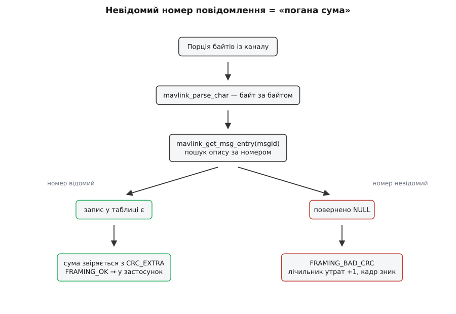
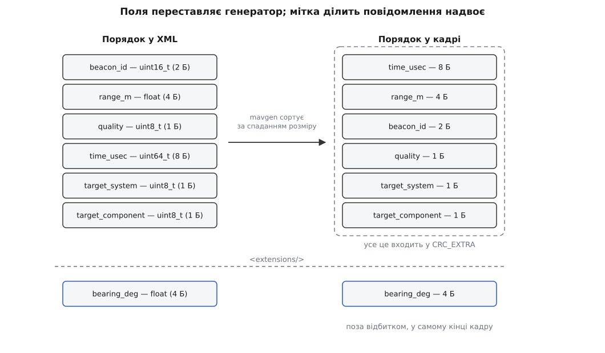
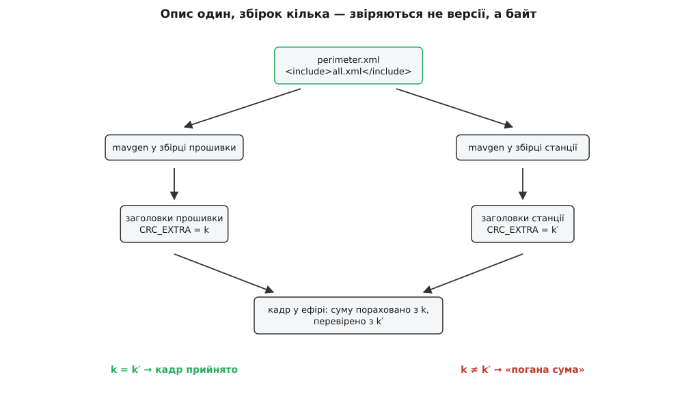
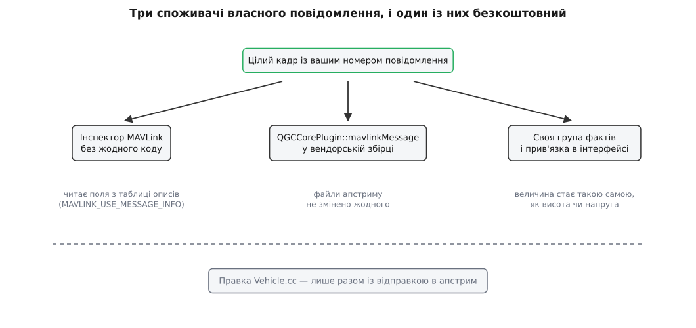

# Власні MAVLink-повідомлення в застосунку

<preknowlist>
- [Пакет MAVLink](topic:sys-dron/mavlink-packet) — будова кадру: стартовий байт, довжина навантаження, номер повідомлення, ідентифікатори системи й компонента, контрольна сума в кінці.
- [Діалекти MAVLink](topic:sys-dron/mavlink-dialect) — що таке діалект, як один діалект включає інший і чому їх узагалі кілька.
- [Генерація коду з XML-опису MAVLink](topic:sys-dron/mavlink-xml-codegen) — генератор `mavgen` перетворює XML-опис повідомлень на заголовки цільовою мовою.
- [CRC](topic:com-modulation/crc) — циклічна надлишкова сума: що саме вона ловить і як залежить від початкового значення.
- [Обробка MAVLink: розбір, версії, канали](topic:sys-dron/mavlink-handling) — як станція перетворює порції байтів із каналу на цілі кадри й що робить із пошкодженими.
- [Ядрове розширення](topic:sys-dron/core-plugin) — місце, де вендорська збірка підставляє свій код замість апстримового, не правлячи файлів апстриму.
- [FetchContent і підпроєкти](topic:sys-bsystem/fetchcontent-subprojects) — система збірки сама тягне чужий репозиторій і будує його всередині свого дерева.
- [Пакування бінарного протоколу](topic:com-protocol/wire-format-packing) — вирівнювання, розмір типів і порядок полів у бінарному кадрі.
</preknowlist>

Ви дописали до прошивки апарата своє повідомлення — скажімо, стан вашого підвісу з чотирма власними числами. Прошивка зібралася, апарат його шле, у записі телеметрії воно видно. Станція не показує нічого. Не «невідоме повідомлення», не попередження, не рядок у журналі — просто нічого, наче кадру в ефірі не було.

Природний висновок із цієї картини хибний. Здається, що станція повідомлення отримала, не розпізнала й тихо відкинула, а виправити це можна, дописавши десь у застосунку обробник. Насправді до обробника справа не доходить: кадр гине двома шарами нижче, ще в розбирачі, і гине не як «незрозумілий», а як **зіпсований**.

## Чому мовчання, а не помилка

Контрольна сума MAVLink рахується не лише по байтах кадру. У неї домішується ще один байт — `CRC_EXTRA`, обчислений із **самого опису повідомлення**: з його назви, типів та імен полів. Ідея в тому, щоб два боки, зібрані з різних описів того самого повідомлення, не змогли обмінятися правдоподібними, але хибно розкладеними числами: сума просто не зійдеться, і кадр буде відкинуто.

Ціна цієї ідеї — розбирач мусить **знати опис**, щоб узагалі перевірити суму. Знання лежить у таблиці, згенерованій зі словника повідомлень під час збірки; пошук у ній іде за номером повідомлення, а для невідомого номера запису немає:

```c
const mavlink_msg_entry_t *e = mavlink_get_msg_entry(rxmsg->msgid);
if (e == NULL) {
    // Message not found in CRC_EXTRA table.
    status->parse_state = MAVLINK_PARSE_STATE_GOT_BAD_CRC1;
```

Автомат іде найкоротшим шляхом: немає запису — немає з чим звіряти суму — кадр оголошено пошкодженим. Назовні це вердикт `MAVLINK_FRAMING_BAD_CRC`, той самий, що й на справжнє радіосміття. Станція підвищує лічильник поганих сум і читає наступний байт.

Звідси головне твердження всієї теми, і воно не про код застосунку: **словник повідомлень у станції — не дані, які вона читає під час роботи, а таблиця, вкомпільована в неї під час збірки**. Тож «додати повідомлення в QGroundControl» означає не «написати обробник», а «перезібрати застосунок з іншим словником». Обробник — дрібниця, яка йде потім.



*Той самий вердикт, що й на пошкоджений ефір, — тому в журналі станції не з'являється нічого, крім приросту лічильника.*

> 🔧 **Навіщо це.** Перше, що варто зробити, коли ваше повідомлення «не доходить», — відкрити індикатор якости зв'язку. Якщо відсоток утрат росте рівно тоді, коли апарат шле ваш кадр, діагноз готовий: словники різні. Якщо втрати нульові, а кадру немає, — проблема не в діалекті, а десь у маршруті чи в самій прошивці.

## Чи справді потрібне нове повідомлення

Перезбирати доводиться не одну програму. Опис повідомлення — це домовленість, і кожен, хто хоче її розуміти, мусить бути зібраний із того самого опису: прошивка апарата, наземна станція, ваш бортовий комп'ютер, скрипт на `pymavlink`, який розбирає записану телеметрію, чужий аналізатор логів, куди ви колись віддасте політ. Нове повідомлення — це **розподілена зміна схеми**, і платите ви за неї не один раз, а щоразу, коли в системі з'являється новий учасник.

Тому чесний перший крок — переконатися, що потрібного повідомлення ще немає. У [словнику MAVLink](topic:sys-dron/mavlink-message-dictionary) їх понад двісті, і більшість «очевидно нових» задач там уже закрито: стан батареї, положення підвісу, дистанція далекоміра, стан навантаження, довільна пара «ім'я — число» для налагодження. Друга розвилка — чи це взагалі потік телеметрії: значення, яке змінюється раз на політ і задається наперед, — це [параметр](topic:sys-dron/mavlink-param-protocol-model), а не повідомлення. Третя — чи не годиться готовий контейнер: у стандарті є `TUNNEL` рівно для вендорських даних, які нікого, крім двох ваших вузлів, не стосуються; він несе до 128 байтів довільного навантаження з полем типу, і жодного перезбирання станції не потребує.

Своє повідомлення виправдане тоді, коли дані **структуровані, постійні й адресовані не лише вам**: коли ви хочете бачити їх у графіку станції, писати в лог із іменами полів, читати чужими інструментами через рік. Тобто коли ціна розподіленої зміни схеми оплачується тим, що схема стає спільною.

## Повідомлення до збірки — це рядок XML

Опис живе у файлі діалекту — звичайному XML. Одне повідомлення виглядає так:

```xml
<message id="42501" name="PERIMETER_BEACON_STATUS">
  <description>Стан маячка периметра, встановленого на апараті.</description>
  <field type="uint16_t" name="beacon_id">Номер маячка, від якого прийшов відгук.</field>
  <field type="float"    name="range_m" units="m">Відстань до найближчого маячка.</field>
  <field type="uint8_t"  name="quality" units="%">Якість відгуку.</field>
  <field type="uint64_t" name="time_usec" units="us">Час бортового годинника.</field>
  <field type="uint8_t"  name="target_system">Система, якої це стосується.</field>
  <field type="uint8_t"  name="target_component">Компонент, якого це стосується.</field>
  <extensions/>
  <field type="float" name="bearing_deg" units="deg">Курс на маячок.</field>
</message>
```

З цього рядка генератор `mavgen` робить заголовок мовою C: структуру `mavlink_perimeter_beacon_status_t`, функції `..._pack`, `..._pack_chan`, `..._encode`, `..._decode` та окремий геттер на кожне поле. Повний перелік того, що можна написати в описі, і того, що з нього виходить у заголовку, зібрано в [довідці з XML-опису діалекту](topic:sys-dron/custom-mavlink-messages/api-dialect-xml.md).

Три речі в цьому описі не є оформленням і вирішують подальшу долю повідомлення.

**Порядок полів у кадрі не той, що в XML.** Генератор сортує поля за спаданням розміру типу — вісім байтів, чотири, два, один — і лише потім кладе їх у навантаження:

```python
sort_end = m.base_fields()
m.ordered_fields = sorted(m.fields[:sort_end],
                          key=operator.attrgetter('type_length'),
                          reverse=True)
m.ordered_fields.extend(m.fields[sort_end:])
```

У наведеному описі першим у кадр піде `time_usec`, хоч в XML він четвертий, а `beacon_id` опиниться аж третім. Сортування стійке: поля однакового розміру лишаються в порядку опису — `quality`, `target_system`, `target_component` ідуть саме так. Причина суто механічна — так кожне поле лягає на адресу, кратну своєму розміру, і приймач може читати структуру безпосередньо, без вирівнювальних дірок і без побайтового складання. Для вас це означає, що **читати чи писати навантаження вручну не можна**: порядок байтів у ньому визначає генератор, а не ваші очі.

**Імена полів `target_system` і `target_component` мають силу.** Генератор помічає їх і записує їхні зсуви в ту саму таблицю описів:

```c
typedef struct __mavlink_msg_entry {
    uint32_t msgid;
    uint8_t crc_extra;
    uint8_t min_msg_len;
    uint8_t max_msg_len;
    uint8_t flags;
    uint8_t target_system_ofs;
    uint8_t target_component_ofs;
} mavlink_msg_entry_t;
```

Завдяки цим двом байтам будь-який вузол, який ретранслює трафік, уміє **адресувати ваше повідомлення**, нічого про нього не знаючи: він бачить із таблиці, де в навантаженні лежить адресат, і не шле кадр туди, куди не треба. Назвавши ті самі поля `dest_sys` чи `sysid`, ви цю здатність втрачаєте — і [маршрутизація за ідентифікаторами](topic:sys-dron/message-routing) вважатиме кадр широкомовним.

**Мітка `<extensions/>` ділить повідомлення надвоє**, і саме ця межа визначає, що можна буде змінити потім.

## Відбиток опису

`CRC_EXTRA` — це байт, у якому згорнуто весь опис повідомлення. Рахують його так:

```python
def message_checksum(msg):
    crc = x25crc()
    crc.accumulate_str(msg.name + ' ')
    crc_end = msg.base_fields()
    for i in range(crc_end):
        f = msg.ordered_fields[i]
        crc.accumulate_str(f.type + ' ')
        crc.accumulate_str(f.name + ' ')
        if f.array_length:
            crc.accumulate([f.array_length])
    return (crc.crc & 0xFF) ^ (crc.crc >> 8)
```

Читається це просто: у суму йдуть **назва повідомлення**, а далі — **тип та ім'я кожного поля** в тому самому порядку, у якому поля лежать у кадрі, плюс довжина, якщо поле масив. Опис і коментарі не йдуть — на них можна правити скільки завгодно. Шістнадцять біт згортаються в один байт складанням половин за модулем два, тож у відбитка є природна межа: різні описи збігаються приблизно в одному випадку з двохсот п'ятдесяти шести. Докладне обчислення відбитка для наведеного повідомлення, разом із цією ймовірністю збігу й тим, що з неї випливає, — у [математиці CRC_EXTRA](topic:sys-dron/custom-mavlink-messages/math-crc-extra.md).

Ключове ж у цих десяти рядках — межа циклу. Він іде до `base_fields()`, тобто **до мітки `<extensions/>`**. Усе, що після мітки, у відбиток не входить і в сортуванні не бере участі.

З цієї межі випливають два різні правила, і плутати їх дорого.

**До мітки нічого не міняють.** Перейменувати поле, змінити тип, додати чи прибрати — усе це змінює `CRC_EXTRA`, тобто робить нову збірку несумісною зі старою. Причому несумісною **мовчки**: старий бік не скаже «інша версія повідомлення», він скаже «погана сума», як на радіосміття. Це не вада, а мета конструкції — краще втратити кадр, ніж показати пілотові число з чужого поля.

**Після мітки можна тільки дописувати в кінець.** Нове поле-розширення бачать лише нові збірки; старі його не отримають, але й не поламаються — відбиток той самий, сума зійдеться, а поля, якого вони не знають, вони просто не прочитають.

Тут же працює й друга особливість другої версії протоколу: **нульові байти в кінці навантаження не передаються**. Відправник обрізає хвіст нулів, приймач дописує їх назад. Наслідок практичний: якщо ваше поле-розширення дорівнює нулю, у ефірі його взагалі не буде, і приймач отримає нуль — той самий нуль, який він отримав би від старої збірки, що про це поле не знає. Відрізнити «прислали нуль» від «не прислали нічого» неможливо, тож нуль у полі-розширенні має означати те саме, що й його відсутність. Інакше кажучи, нуль мусить бути безпечним значенням за замовчуванням — а ознаку «даних немає» кодують окремим значенням поза робочим діапазоном.



*Сортування за спаданням розміру дає вирівняне навантаження; усе після мітки лишається в порядку опису й не впливає на CRC_EXTRA.*

## Номер, який не можна взяти навмання

Номер повідомлення — єдине, що з'єднує кадр у ефірі з описом у таблиці. Тому вибір номера — це вибір місця в чужому просторі імен, і в ньому три обмеження.

Діапазон **0–255** не займають узагалі: це номери, які поміщаються в заголовок першої версії протоколу, і вони зарезервовані під сумісність. Ваше повідомлення з номером у цьому діапазоні технічно існуватиме, але претендуватиме на місце, яке вам не належить.

Далі, кожен офіційний діалект має **виділений діапазон**: спільний набір `common.xml` — 300–10000, `uAvionix.xml` — 10001–10999, `ArduPilotMega.xml` — 11000–11999, `icarous.xml` — 42000–42999. Ці межі й існують для того, щоб два діалекти, зведені в одному застосунку, не претендували на один номер.

Для власного, ніде не опублікованого діалекту формально можна брати будь-що поза цими діапазонами. Практично ж варто вибрати номер **далеко** від зайнятих ділянок і подалі від початку: зіткнення виявиться не помилкою збірки, а тим самим мовчазним відкиданням кадрів — тільки тепер уже вибірковим і залежним від того, з ким саме ви говорите. Якщо ж повідомлення колись піде в апстрим, номер вам однаково призначать заново, тож прив'язуватися до нього в логіці не варто.

## Ваш діалект мусить включати `all.xml`

Другий крок після опису — вирішити, **де** він лежить. Діалект у MAVLink не додається до інших: генератор бере **один** кореневий XML і будує з нього повний набір заголовків, включаючи в нього тільки те, що цей корінь притягнув через `<include>`.

QGroundControl збирають із діалекту `all` — того, що включає всі діалекти репозиторію MAVLink і дозволяє станції говорити і з PX4, і з ArduPilot, і з рештою. Якщо ви підставите замість нього свій діалект, який включає лише `common.xml`, станція втратить усе, чого в спільному наборі немає: діалектні повідомлення ArduPilot, розширення виробників камер, повідомлення в розробці. Втратить, знову ж таки, мовчки — просто частина трафіку почне рахуватися як пошкоджена.

Тому власний діалект пишуть **поверх усього**, а не замість:

```xml
<?xml version="1.0"?>
<mavlink>
  <include>all.xml</include>
  <messages>
    <message id="42501" name="PERIMETER_BEACON_STATUS">
      ...
    </message>
  </messages>
</mavlink>
```

Файл кладуть поруч із рештою описів, у `message_definitions/v1.0/`, і далі все питання в тому, як цей каталог потрапляє у збірку станції.

## Як опис доходить до збірки станції

До п'ятої версії QGroundControl тримав MAVLink підмодулем git, а вибір діалекту робився змінними середовища. Тепер бібліотеки MAVLink у дереві застосунку немає взагалі: CMake **тягне репозиторій MAVLink під час конфігурації** й запускає генератор просто у збірці.

Робить це `src/MAVLink/CMakeLists.txt`:

```cmake
CPMAddPackage(
    NAME mavlink
    GIT_REPOSITORY ${QGC_MAVLINK_GIT_REPO}
    GIT_TAG ${QGC_MAVLINK_GIT_TAG}
    OPTIONS
        "MAVLINK_DIALECT ${QGC_MAVLINK_DIALECT}"
        "MAVLINK_VERSION ${QGC_MAVLINK_VERSION}"
    PATCHES mavlink-deterministic-mavgen.patch
)
```

Усі чотири значення — звичайні кешовані змінні з `cmake/CustomOptions.cmake`:

```cmake
set(QGC_MAVLINK_GIT_REPO "https://github.com/mavlink/mavlink.git" CACHE STRING "MAVLink repository URL")
set(QGC_MAVLINK_GIT_TAG  "c409cf690454db6d3e004bd14173bc6c7ff1e0ff" CACHE STRING "MAVLink repository commit/tag")
set(QGC_MAVLINK_DIALECT  "all" CACHE STRING "MAVLink dialect")
set(QGC_MAVLINK_VERSION  "2.0" CACHE STRING "MAVLink protocol version")
```

Далі працює вже збірка самого репозиторію MAVLink: його `CMakeLists.txt` викликає генератор мовою Python і складає заголовки в каталог збірки —

```
python -m pymavlink.tools.mavgen --lang=C --wire-protocol=2.0 \
       --output <build>/include/mavlink/ message_definitions/v1.0/<dialect>.xml
```

— після чого станція підключає їх одним заголовком `src/MAVLink/MAVLinkLib.h`, який перед `#include <mavlink.h>` вмикає ще одну річ:

```c
#define MAVLINK_USE_MESSAGE_INFO
```

Ця директива додає до збірки другу таблицю — **описи полів**: імена, типи, одиниці, зсуви. Перша таблиця (та, з `CRC_EXTRA`) потрібна, щоб кадр розібрати; друга — щоб про розібраний кадр можна було щось сказати, не знаючи його наперед. Вона й дає станції єдину здатність працювати з вашим повідомленням без жодного рядка коду.

Три наслідки цієї конструкції варто побачити одразу.

**Комміт закріплено хешем.** Це не педантизм: словник повідомлень визначає `CRC_EXTRA`, а той визначає, з ким станція взагалі здатна говорити. Закріплений хеш плюс латка, що робить вивід генератора незалежним від порядку файлів і часу запуску, дають властивість, без якої відлагодити протокольну розбіжність неможливо: дві збірки з того самого джерела дають байт у байт однакові заголовки. Загальний розбір того, навіщо це потрібно, — у [закріпленні версій залежностей](topic:sys-bsystem/version-pinning).

**Генерація відбувається у вашій збірці.** Заголовків MAVLink у репозиторії застосунку немає; шукати їх у дереві джерел і правити руками нічого. Це звичайна [кодогенерація як крок збірки](topic:sys-bsystem/custom-commands), тільки виконана в підпроєкті.

**Змінні кешовані.** Перезаписати їх треба **до першої конфігурації** або з новим каталогом збірки: кешоване значення переживає повторний запуск CMake і мовчки переможе ваш новий `set()`. Це найчастіша причина «я поміняв діалект, а нічого не змінилося» — механіка кешу описана в [кеші й опціях CMake](topic:sys-bsystem/cache-and-options).

### Три способи підставити свій опис

**Локальний каталог — для циклу правки.** Поки опис ще змінюється щогодини, ніякого репозиторію не треба: досить показати збірці каталог на диску.

```cmake
set(CPM_mavlink_SOURCE "/home/dev/mavlink" CACHE PATH "" FORCE)
set(QGC_MAVLINK_DIALECT "perimeter" CACHE STRING "" FORCE)
```

Тепер `mavgen` бере ваш `message_definitions/v1.0/perimeter.xml` просто з робочої копії. Змінили XML — перезібрали — заголовки перегенерувалися.

**Власний репозиторій — для команди.** Форк репозиторію MAVLink зі своїм діалектом і перевизначені `QGC_MAVLINK_GIT_REPO` та `QGC_MAVLINK_GIT_TAG`. Тут з'являється те, чого немає в локальному варіанті: **одне джерело для всіх**. Прошивка апарата, станція й ваші скрипти беруть той самий хеш комміту, і питання «а хто з чим зібраний» перестає бути здогадкою.

У вендорській збірці перевизначення живуть не в апстримовому файлі, а у власному каталозі кастомізації — тому самому, що містить ядрове розширення. Каталог указує `QGC_CUSTOM_DIR` (типово `custom/`), а перевизначення читаються з `<custom>/cmake/CustomOverrides.cmake`; апстримові файли лишаються недоторканими, і злиття з новою версією не має де конфліктувати.

**Апстрим — для того, що стосується не лише вас.** Повідомлення, корисне всім, місце має в `common.xml` або в `development.xml`, і тоді жодних перевизначень не треба взагалі: воно приїде зі звичайним оновленням закріпленого комміту.



*Ані прошивка, ані станція не звіряють версій опису — вони звіряють байт CRC_EXTRA, і розбіжність виглядає як пошкоджений ефір.*

## Кадр розібрано — і тепер його ніхто не слухає

Після перезбирання станція ваше повідомлення **приймає**: сума сходиться, кадр цілий, лічильник утрат більше не росте. Але на екрані так само нічого немає, бо в застосунку немає нікого, хто б цим кадром цікавився.

Точніше — майже немає. Один споживач з'являється сам, без жодного рядка коду: **інспектор MAVLink**. Він перебирає поля кадру не за іменами, які знав автор, а за тією другою таблицею описів, увімкненою `MAVLINK_USE_MESSAGE_INFO`, — тобто вміє показати будь-яке повідомлення, яке є в збірці, з назвами полів, значеннями й частотою надходження. Це найдешевший спосіб перевірити, що словники нарешті збіглися: [інспектор](topic:sys-dron/mavlink-inspector) покаже ваше `PERIMETER_BEACON_STATUS` рівно тоді, коли станція навчилася його розбирати, і не покаже раніше.

Далі починається код, і місць для нього три — за зростанням втручання в апстрим.

**Гак ядрового розширення.** Вендорська збірка має метод, що бачить увесь трафік апарата ще до того, як його розбере решта застосунку:

```cpp
virtual bool mavlinkMessage(Vehicle *vehicle, LinkInterface *link,
                            const mavlink_message_t &message);
```

Повернене значення — дозвіл рухатися далі: `false` зупиняє звичайну обробку цього кадру, `true` пропускає. Своє повідомлення тут обробляють так:

```cpp
bool CustomPlugin::mavlinkMessage(Vehicle *vehicle, LinkInterface *link,
                                  const mavlink_message_t &message)
{
    if (message.msgid == MAVLINK_MSG_ID_PERIMETER_BEACON_STATUS) {
        mavlink_perimeter_beacon_status_t beacon{};
        mavlink_msg_perimeter_beacon_status_decode(&message, &beacon);
        _beaconGroup->update(beacon);
        return false;
    }
    return QGCCorePlugin::mavlinkMessage(vehicle, link, message);
}
```

Файлів апстриму тут не змінено жодного — саме тому це основний спосіб для вендорської збірки.

**Своя група фактів.** Розібрана структура — ще не те, що показує екран. Щоб значення потрапило в інтерфейс і в графіки як звичайна величина з ім'ям, одиницями й точністю, його кладуть у [систему фактів](topic:sys-dron/fact-system): своя група фактів на [об'єкті апарата](topic:sys-dron/vehicle-object) описує поля метаданими, а прив'язка в інтерфейсі бере їх за іменем. Із цього моменту ваша величина нічим не відрізняється від висоти чи напруги — включно з можливістю покласти її на індикатор і побудувати графік.

**Правка `Vehicle.cc`.** Дописати розбір просто в загальний обробник апарата має сенс тільки тоді, коли повідомлення йде в апстрим разом із цією правкою. Інакше кожне оновлення станції коштуватиме злиття рівно в тому файлі, який апстрим змінює найчастіше.



*Інспектор дістає поля з таблиці описів, тому не потребує знання про конкретне повідомлення; усе інше — код.*

## Зворотний бік: відправити своє

Відправка коротша, бо в ній немає невизначености. Кадр треба скласти **в слоті того каналу**, яким він піде: звідти кодувальник візьме номер послідовності вихідного потоку й прапорець версії.

```cpp
void CustomPlugin::sendBeaconMode(Vehicle *vehicle, uint8_t mode, float radius_m)
{
    WeakLinkInterfacePtr weakLink = vehicle->vehicleLinkManager()->primaryLink();
    if (weakLink.expired()) {
        return;
    }
    SharedLinkInterfacePtr sharedLink = weakLink.lock();

    mavlink_message_t message{};
    mavlink_msg_perimeter_beacon_cmd_pack_chan(
        MAVLinkProtocol::instance()->getSystemId(),   // хто шле: станція
        MAVLinkProtocol::getComponentId(),
        sharedLink->mavlinkChannel(),                 // слот стану кодувальника
        &message,
        vehicle->id(), vehicle->compId(),             // кому: target_system, target_component
        mode, radius_m);

    vehicle->sendMessageOnLinkThreadSafe(sharedLink.get(), message);
}
```

Два місця тут не косметичні. По-перше, `primaryLink()` віддає **слабке** посилання: основний канал апарата може зникнути між двома рядками, і перевірка на це — не перестраховка. По-друге, назва методу відправки закінчується на `ThreadSafe` тому, що виклик приходить із нитки інтерфейсу, а запис у канал живе в іншій нитці; метод сам переносить кадр туди, куди треба. Обходити його прямим записом у канал не можна — [модель потоків станції](topic:sys-dron/threading-model) цього не пробачає.

Якщо ж ваше повідомлення має не команду нести, а прилітати з борту з певною частотою, просити її треба стандартним способом — командою `MAV_CMD_SET_MESSAGE_INTERVAL` із номером вашого повідомлення. Ніякого окремого механізму підписки для власних повідомлень немає й не потрібно: із погляду [команд MAVLink](topic:sys-dron/mavlink-commands) номер 42501 нічим не відрізняється від будь-якого іншого.

Складання докупи — від рядка XML до величини на екрані та кнопки, що шле команду, з перевірками на кожному кроці — розписано в [проєкті власного повідомлення](topic:sys-dron/custom-mavlink-messages/proj-custom-message.md).

## Де воно ще може загубитися

Коли словники з обох боків збіглися, а кадру все одно немає, лишається кілька місць, і всі вони — про той самий розрив між описами.

**Посередник.** Між апаратом і станцією часто стоїть щось третє: ретранслятор, бортовий комп'ютер, міст із радіо в мережу. Вузол, який просто **пересилає кадри**, читаючи із заголовка довжину, ваше повідомлення пропустить, бо йому байдуже до вмісту. Вузол, який кадри **розбирає** — скрипт на `pymavlink`, зібраний зі старого діалекту, — відкине його з тієї самої причини, що й станція до перезбирання. Тому старий скрипт у ланцюжку означає, що перезібрати треба і його.

**Версія протоколу.** Номер понад 255 у першу версію протоколу не поміщається взагалі: там під номер відведено один байт. Практично це вже не проблема — QGroundControl від п'ятої версії підтримки MAVLink 1 не має і вимагає другої версії, — але старий міст у ланцюжку, який ще переводить трафік у першу версію, ваше повідомлення знищить, і теж без пояснень.

**Нулі в хвості.** Якщо всі поля-розширення нульові, у ефірі їх не буде, і кадр буде коротшим за очікуваний. Це нормальна робота протоколу, а не помилка; помилкою буде код, який робить висновки з довжини навантаження замість того, щоб читати поля через згенеровані геттери.

Спільне в усіх цих випадках одне, і це головне, що варто винести з теми. **Опис повідомлення — розподілена домовленість, яку кожен учасник зашиває в себе під час збірки, а єдиний інструмент виявлення розбіжности, що дає протокол, — контрольна сума.** Вона перетворює будь-яку неузгодженість на мовчання: не на діагностику, не на попередження, а на зростання лічильника втрат. Тому робота з власними повідомленнями — це передусім дисципліна одного джерела: один XML, один закріплений комміт, одна перегенерація для всіх, хто цей кадр читає.
