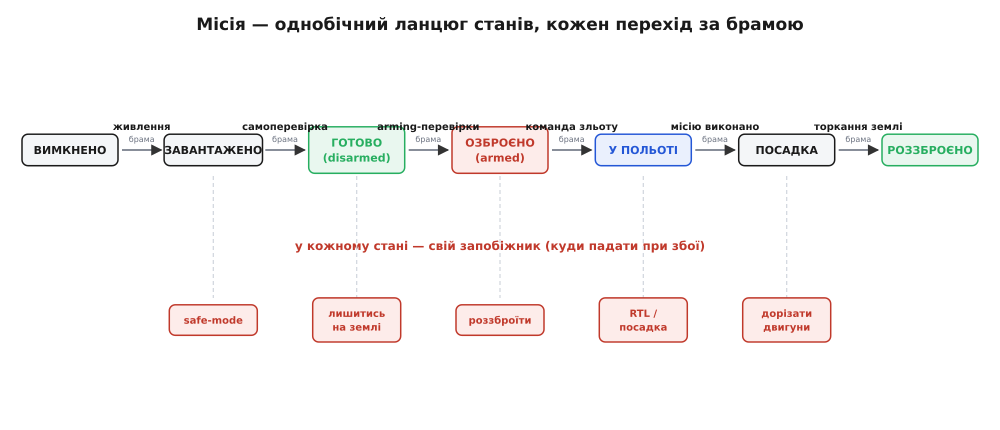
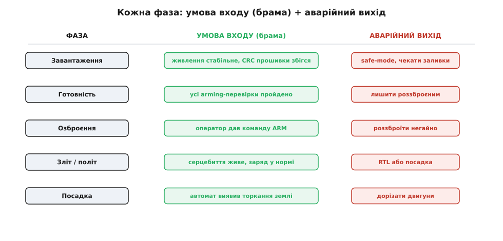
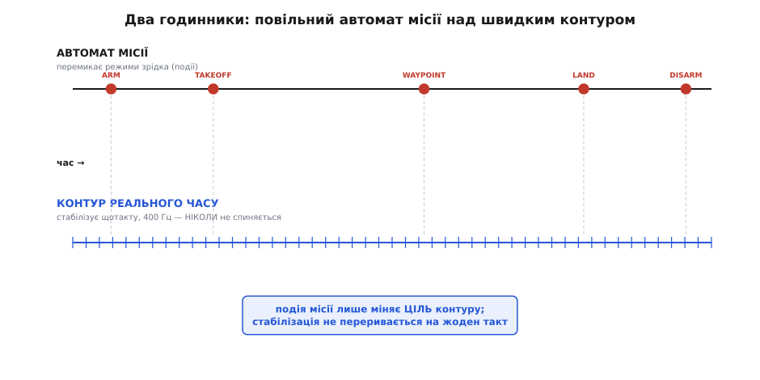

# Місія від початку до кінця

Слово «місія» звучить так, ніби це одна дія: злетів, зробив справу, сів. Але для прошивки місія — не подія, а **довгий ланцюг станів**, який апарат проходить від миті, коли на нього подали живлення, до миті, коли двигуни зупинилися й він знову лежить безпечним куском заліза. Між цими краями — озброєння, зліт, політ маршрутом, посадка, роззброєння. І головна думка, від якої залежить, чи буде місія керованою: **апарат ніколи не «просто летить». У кожну секунду він перебуває в одному цілком визначеному стані, а перейти в наступний може лише крізь браму — умову, яку треба спершу виконати.** Прошивка, що керує місією, — це насамперед автомат таких станів і брам; усе решта нанизане на нього.

Чому так, а не «увімкнув моторчики й полетів»? Бо кожен стан має **різні правила безпеки**. На землі з роззброєними двигунами найгірше, що може статися від збою, — апарат просто лишиться лежати. Той самий збій за секунду до зльоту вже небезпечний, а в польоті на висоті — смертельний. Якби всі ці ситуації трактувати однаково, довелося б або дозволяти небезпечне на землі, або забороняти потрібне в повітрі. Тому прошивка розрізняє, **де саме** апарат зараз, і в кожному місці поводиться інакше: пускає далі лише коли безпечно, а при біді тікає туди, куди безпечно тікати **саме з цього стану**.

### Ланцюг станів: чому лише в один бік

Розгляньмо весь шлях однієї місії й побачимо, що він **однобічний** — станами не можна ходити як заманеться, вони йдуть строгою чергою.

Апарат **вимкнено**. Подали живлення — він **завантажується**: піднімається прошивка, перевіряє сама себе, оживляє давачі. Пройшла самоперевірка — апарат **готовий**, але двигуни ще **роззброєні** (disarmed): команди на оберти ігноруються, гвинт не крутиться, хоч ти що подавай на регулятор. Це навмисна стіна між «увімкнено» і «здатне різати повітря». Далі оператор (чи автопілот) дає команду **озброїти** (arm) — і лише тепер, якщо всі перевірки досі в нормі, апарат переходить у стан **озброєно** (armed): двигуни слухаються керма. Зі стану armed — команда зльоту, апарат **у польоті**, тримає маршрут. Місію виконано — **посадка**. Автомат виявив, що апарат торкнувся землі й стоїть, — **роззброєно**, двигуни знову мертві. Коло замкнулося.


*Місія — це рух станами лише вперед: вимкнено → завантажено → готово → озброєно → політ → посадка → роззброєно. Кожна стрілка проходить крізь **браму** (умову переходу), а з кожного стану веде окремий **аварійний вихід** (куди падати при збої). Стани «готово» й «роззброєно» зелені — у них двигуни мертві й апарат безпечний; «озброєно» червоне — двигуни ожили.*

Чому саме **один бік**? Бо кожен перехід уперед платить за право на дедалі небезпечніше. Дозволити стрибок через браму — все одно що озброїтися, не перевіривши апарат, чи злетіти, не озброївшись. Назад — інша логіка: **роззброїтися** (повернутися з armed у безпечне «готово») можна майже завжди й майже миттєво, бо це рух у **безпечніший** бік. Асиметрія тут не примха, а суть: у небезпечніший стан пускаємо через сувору перевірку, у безпечніший випускаємо легко. Це той самий принцип, що робить [failsafe](topic:sys-dron/failsafe) failsafe'ом — при сумніві падай туди, де наслідки менші.

> 🔧 **Навіщо це.** Коли пишеш прошивку апарата, перше, що варто накреслити, — саме цей ланцюг: які в системі стани й **які умови** пускають з одного в наступний. Помилка новачка — тримати «летимо / не летимо» одним прапорцем `bool armed` і навколо нього ліпити `if`-и. Щойно станів стає більше двох, такий код перетворюється на плутанину суперечливих перевірок. Явний перелік станів і таблиця дозволених переходів — це не академізм, а те, що не дає апарату озброїтися посеред падіння чи спробувати злетіти двічі.

Кому цікава внутрішня механіка таких автоматів — як їх кодують без плутанини `if`-ів, як забороняють нелегальні переходи й обробляють події, — це окрема тема [автомата станів](topic:sys-dron/mode-state-machine). Тут же нам важливий не апарат автомата, а **що саме** охороняє кожну браму.

### Брама: умова, без якої не пускають далі

Брама (англ. *gate* — застава, ворота) — це перевірка, яку треба пройти, щоб перейти в наступний стан. Найважливіша й найвідоміша з них стоїть перед озброєнням.

Уявіть, що апарат озброюється **завжди**, тільки-но натиснули кнопку. Тоді гвинт розкрутиться, навіть якщо GPS ще не зловив супутники, компас показує сміття через магніт поруч, а один із давачів кута мовчить. Оператор тицьнув «arm», не помітивши, — і апарат, який нічого не знає про світ, готовий різати повітря коло чиїхось пальців. Тому перед переходом у armed прошивка проганяє **arming-перевірки**: пакет умов, кожна з яких мусить бути істинною, інакше озброєння **відхиляють** із поясненням, що саме не так. Живлення в межах? Давачі калібровані й узгоджені між собою? Оцінка положення вже збіглася? Немає активного failsafe? Тільки коли **все** «так» — брама відчиняється.

Логіка перевірки — це логічне «І» купи умов, і найважливіше в ній не сам список, а те, що **відмова блокує перехід повністю**: одна провалена перевірка тримає апарат роззброєним, хай решта ідеальні.

**Брама озброєння: пустити в armed лише коли ВСІ умови істинні.**

```c
// Кожна перевірка повертає true = «моя умова в нормі».
// Озброєння дозволене, лише якщо всі до єдиної повернули true.
bool arming_allowed(char *reason, size_t n) {
    if (!power_ok())        { snprintf(reason, n, "напруга поза межами");   return false; }
    if (!sensors_ok())      { snprintf(reason, n, "давач не калібрований");  return false; }
    if (!attitude_valid())  { snprintf(reason, n, "оцінка кута ще не збіглась"); return false; }
    if (failsafe_active())  { snprintf(reason, n, "активний failsafe");      return false; }
    return true;            // усі брами пройдено — озброєння дозволене
}

// Перехід у armed можливий ЛИШЕ через цю функцію — іншого шляху немає.
bool try_arm(void) {
    char why[48];
    if (!arming_allowed(why, sizeof why)) {
        gcs_send_text("ARM REJECTED: %s", why);  // скажи операторові, ЧОМУ
        return false;                            // лишаємось роззброєними
    }
    set_state(ST_ARMED);
    return true;
}
```

Придивіться, **чому код саме такий**. Перевірки з'єднані так, що перша ж провалена одразу повертає `false` разом із причиною — оператор бачить не глухе «не озброюється», а «напруга поза межами» й знає, що робити. І перехід у `ST_ARMED` схований **усередині** `try_arm`: немає жодного іншого місця, звідки в цей стан потрапляють, тож обійти браму неможливо. Це прямий наслідок однобічності ланцюга — в небезпечніший стан ведуть **єдині** двері, і на них стоїть варта.

Такі ж брами, лише простіші, стоять на кожному переході. Перед виходом із завантаження — самоперевірка: чи збіглася [контрольна сума](topic:sf-devices/watchdog) прошивки, чи стабільне живлення. Перед зльотом — команда зльоту (сам по собі armed ще не летить). Перед роззброєнням наприкінці — упевненість, що апарат **справді** на землі, а не завис у сантиметрі над нею. Повний набір передпольотних умов — окрема тема [безпеки до польоту](topic:sys-dron/preflight-safety); тут досить бачити спільну форму: **перехід уперед = умова входу**.


*Уся місія вкладається в таблицю з двох стовпців. Зелений — **умова входу**: що мусить справдитися, щоб фаза почалася. Червоний — **аварійний вихід**: куди тікати, якщо в цій фазі стався збій. Автомат станів — це, по суті, ця таблиця, ожила в коді: він пускає вперед лише крізь зелене й тікає лише в червоне.*

### Два годинники: місія зверху, стабілізація знизу

Тут криється те, що плутає майже всіх на початку. Здається, ніби прошивка місії — це «зробити крок, зачекати, зробити наступний»: озброїв, злетів, полетів до точки, сів. Ніби це послідовна історія, яку апарат розповідає по черзі. Але **під** цією повільною історією безперервно, сотні разів на секунду, крутиться зовсім інший, швидкий процес — **контур стабілізації**, який щомиті утримує апарат у повітрі. І він **не спиняється ніколи**, поки апарат озброєний, — байдуже, у якій фазі місії ви зараз.

Це два різні годинники, що цокають з різною частотою. Повільний — **автомат місії**: він перемикається зрідка, від події до події. Озброїлись — одна подія. Дали зліт — друга. Дійшли до дороговказу (waypoint) — третя. Між ними можуть минати секунди й хвилини, і весь цей час автомат просто **стоїть** в одному стані. Швидкий — **контур керування**: він виконує повний оберт (зчитав давачі кута → порахував похибку → підправив тягу двигунів) кожні кілька мілісекунд, скажімо 400 разів на секунду, і так **весь політ без винятку**.


*Верхня доріжка — автомат місії: рідкі події (ARM, TAKEOFF, WAYPOINT, LAND, DISARM), між якими він просто стоїть. Нижня — контур реального часу: щільні такти 400 Гц, що не переривається ні на мить. Кожна подія місії лише **міняє ціль** контуру (нову висоту, новий курс), а сам контур крутиться незалежно від того, яка фаза місії надворі.*

Як же вони пов'язані? Дуже просто й дуже важливо: **подія місії не «робить» рух — вона лише міняє ЦІЛЬ, яку відпрацьовує контур.** Команда «летіти до точки» не крутить двигуни напряму; вона каже контуру: «тепер твоя ціль — отам». Далі контур сам, такт за тактом, зводить апарат до цієї цілі, а автомат місії тим часом спокійно чекає, поки апарат долетить. Дійшли — автомат ставить нову ціль. Виходить поділ праці: **повільний автомат вирішує, ЩО робити; швидкий контур вирішує, ЯК це втримати щомиті.**

Чому їх узагалі розділяють, а не пишуть одним циклом? Бо в них несумісні вимоги за часом. Контуру стабілізації байдуже до маршруту, зате критично **не запізнитися ні на такт**: проґавив — і апарат за цю мілісекунду вже нахилився не туди. Автомату місії, навпаки, байдуже до мілісекунд — зайва десята секунди перед зміною цілі нічого не важить, — зате йому треба тримати складну логіку станів і брам. Змішати їх — означає або засмітити критичний за часом контур повільною логікою місії, або підпорядкувати місію жорсткому ритму, який їй не потрібен. Тому їх розводять: контур живе в задачі [реального часу](topic:sys-dron/flight-controller) з гарантованим строком, а автомат місії — окремо, подіями. Саме на цьому поділі стоїть уся [автономна система](root:embedded/autonomous-system).

> 🔧 **Навіщо це.** Це найчастіша пастка в прошивці апарата: спроба «зробити крок місії й зачекати» **всередині** швидкого контуру. Варто десь у логіці місії поставити довгу паузу чи блокуюче очікування — і контур стабілізації пропускає такти, апарат хитає. Правило залізне: **логіка місії ніколи не блокує; вона лише міняє цілі, а стабілізацію лишає окремому контуру, що крутиться сам.** Побачиш у чужому коді `delay()` десь поряд із керуванням — це майже напевно баг.

### Автомат місії в коді

Складімо тепер повільний годинник — сам автомат — у робочий C. Ідея пряма: є змінна поточного стану; є функція, яку викликають регулярно (але не в критичному контурі, а поряд, повільніше); вона дивиться на **події** (команди, ознаки завершення фаз) і, якщо брама відповідного переходу відчинена, пересуває стан уперед. Кожен стан при вході **ставить контуру нову ціль** — і на цьому його активна робота закінчується, далі він просто чекає.

**Автомат місії: один крок повільного годинника.**

```c
typedef enum {
    ST_BOOT, ST_READY, ST_ARMED, ST_FLYING, ST_LANDING, ST_DISARMED
} mission_state_t;

static mission_state_t state = ST_BOOT;

// Викликається зрідка (напр. 50 Гц) — це ПОВІЛЬНИЙ годинник, не контур.
void mission_tick(void) {
    switch (state) {
    case ST_BOOT:
        if (selftest_passed())          // брама: самоперевірка пройдена
            set_state(ST_READY);        //   вхід у READY: двигуни лишаються мертві
        break;

    case ST_READY:
        // Озброєння йде лише через try_arm() — вона й перевіряє браму.
        // Тут автомат просто чекає команди оператора.
        break;

    case ST_ARMED:
        if (cmd_takeoff() && arming_allowed(NULL, 0)) {
            set_target_altitude(TAKEOFF_ALT);   // СТАВИМО ЦІЛЬ контуру
            set_state(ST_FLYING);               // а тримати її — його робота
        }
        break;

    case ST_FLYING:
        run_mission_legs();                 // ведемо цілі по маршруту (не блокуючи!)
        if (mission_complete())
            set_state(ST_LANDING);          // остання ціль — на посадку
        break;

    case ST_LANDING:
        if (land_detected())                // брама: апарат СПРАВДІ торкнувся землі
            set_state(ST_DISARMED);         //   і лише тоді ріжемо двигуни
        break;

    case ST_DISARMED:
        motors_cut();                       // двигуни мертві — місію завершено
        break;
    }
}
```

Розберімо, **чому він саме такий**. Автомат ніде не «робить рух»: у `ST_ARMED` він викликає `set_target_altitude` — тобто **ставить ціль**, — а піднімати апарат до цієї висоти буде окремий контур, який ми тут навіть не бачимо. У `ST_FLYING` рядок `run_mission_legs()` веде цілі вздовж маршруту, і принципово, що ця функція **не блокує**: вона щоразу лише посуває поточну ціль, а не «летить і чекає». Кожен `case` — це один стан із його брамою: перехід стається, тільки коли відповідна умова (`selftest_passed`, `mission_complete`, `land_detected`) істинна. І `switch` за явним `enum` робить неможливе за побудовою неможливим: із `ST_LANDING` не потрапиш у `ST_FLYING`, бо такого переходу просто немає в коді.

Найтонше місце тут — `land_detected()` перед роззброєнням, і воно варте зупинки. Наївно було б роззброїтися, щойно апарат опустився до нульової висоти. Але висота від барометра «дихає» від поривів вітру й тиску, а від зіткнення з землею апарат може на мить **підскочити**. Роззброїшся зарано, у повітрі — впаде рештою метрів каменем; пізно — зайві секунди крутить гвинти на землі. Тому виявлення посадки — не одна перевірка, а **стійке спостереження**: апарат мусить кілька десятих секунди поспіль тримати ознаки «я стою» — мала тяга, майже нульова вертикальна швидкість, нерухомість, — і лише тоді ознака визнається справжньою. Це прибирає хибне спрацювання від одиничного стрибка. Повний автомат місії разом із таким стійким виявленням посадки й таблицею дозволених переходів розібрано в окремому [проєкті-реалізації](topic:sys-dron/end-to-end-mission/proj-mission-fsm.md).

> 🔧 **Навіщо це.** Зверніть увагу, що автомат тримається на **подіях і брамах**, а не на паузах. Ніде немає «зачекати 3 секунди» — є «дочекатися, поки умова стане істинною». Це і є неблокуюче мислення: замість «зроби й спи» — «постав ціль і питай щокроку, чи вже час рушати далі». Так автомат місії уживається з контуром реального часу під ним, не крадучи в нього жодного такту.

### У кожному стані — свій запобіжник

Досі ми йшли ланцюгом уперед, коли все гаразд. Але суть end-to-end мислення — не в щасливому шляху, а в тому, що **з кожного стану має бути продуманий вихід на випадок біди**, і виходи ці **різні**, бо різна ціна помилки.

Погляньте ще раз на нижній ряд першої фігури — під кожним станом висить свій аварійний вихід, і логіка їх пряма. У **завантаженні** збій (не зійшлася контрольна сума, збоїть давач) означає: не пускати далі, лишитися в [безпечному стані](topic:sys-dron/failsafe) й чекати нової прошивки — злітати з несправним апаратом гірше, ніж не злітати взагалі. У **готовності** будь-який сумнів — просто **не озброюватися**: апарат на землі, найбезпечніше — там і лишитися. В **озброєнні на землі** (двигуни крутяться, але апарат ще не злетів) біда розв'язується найрадикальніше й найбезпечніше — **роззброїти**, знеструмити гвинти, бо на землі зупинити оберти безпечно.

А от у **польоті** правило «вимкнути двигуни» стає смертельним — знеструмиш гвинт у повітрі, апарат впаде. Тут безпечний вихід — **не зупинка, а керована дія**: повернутися додому (RTL) або сісти на місці, залежно від того, що ще працює. Це та сама асиметрія, що й у наземного failsafe навпаки: на землі безпечно вимкнути, у повітрі безпечно **керовано опуститися**. І нарешті в **посадці**, коли апарат уже майже торкнувся землі, правильний аварійний хід — **дорізати двигуни** (щоб не підскочив і не перекинувся), щойно виявлення посадки впевнене.

Спільна форма всіх п'яти виходів — та сама, що й у переходах уперед, лише дзеркальна: **умова входу** пускає в наступний стан, коли безпечно рухатися вперед; **аварійний вихід** висмикує в безпечний стан, коли рухатися вперед стало небезпечно. Автомат місії тому й потрібен: він тримає обидві половини разом. Знаючи, в якому апарат стані, прошивка знає і **як його пустити далі**, і **куди його врятувати** — а без явного стану жодне з цих рішень не буде певним.

> 🔧 **Навіщо це.** Проєктуючи місію, складіть для кожного стану дві колонки: «умова входу» і «аварійний вихід». Якщо в котромусь стані ви не можете назвати аварійний вихід — це діра: настане біда саме в цій фазі, і апарат зробить щось довільне. End-to-end означає рівно це: не лише «як пройти місію», а «що робити, якщо зламалося на будь-якому її кроці».

### Кінець місії — теж робота

Місія має не лише початок, а й **чистий кінець**, і його легко проґавити, бо здається, що після посадки все саме собою скінчилося. Але роззброєння наприкінці — не «нічого не робити», а окрема дія: **дорізати двигуни, зафіксувати роззброєний стан, дописати журнал польоту**. Прошивка, що просто «перестала керувати», лишає апарат у невизначеності — двигуни в останньому стані, лог обірваний на півслові. Тому останній стан ланцюга **активний**: він доводить апарат до того самого безпечного «мертвого» вигляду, з якого місія й починалася.

Це роззброєння здебільшого **автоматичне**. Оператор не мусить згадувати натиснути «disarm» — апарат сам, виявивши стійку посадку, знеструмлює гвинти за кілька секунд стояння. У ArduPilot, наприклад, мультикоптер за замовчуванням роззброюється, простоявши на землі з мінімальним газом близько 15 секунд; літак після автопосадки — приблизно через 20 секунд нерухомості (параметр `LAND_DISARMDELAY`). *(Значення й самі механізми залежать від апарата й версії — це не жорсткий стандарт, а типова, налаштовувана поведінка; статус — усталена практика конкретної платформи.)* Затримка тут навмисна: вона дає впевнитися, що апарат **справді** сів і стоїть, а не завис чи підстрибнув, — той самий компроміс між «зарано» й «запізно», що й у виявленні посадки.

І весь цей час — від озброєння до роззброєння — під місією тихо працює ще одна страховка, незалежна від усіх станів: [сторожовий таймер](topic:sf-devices/watchdog). Автомат місії, брами, контур стабілізації — усе це код, а код може [зависнути](topic:sf-devices/watchdog). Тому апаратний таймер, який прошивка мусить регулярно «годувати», сторожить сам факт, що вона **жива**: перестала годувати — таймер перезапустить чип, і той підніметься в заздалегідь безпечному стані. Це нижній, апаратний поверх end-to-end безпеки: він діє навіть тоді, коли завис сам автомат, який мав би тікати в аварійний вихід.

Один рівень над апаратом місію бачить **земля**. Наземна станція ([GCS](root:embedded/mavlink-from-ground)) весь політ отримує від апарата серцебиття (heartbeat) — коротке «я живий», що на радіоканалі йде зазвичай раз на секунду, і відсутність чотирьох-п'яти поспіль вважають утратою зв'язку. Це серцебиття несе і поточний стан місії: земля бачить, озброєний апарат чи ні, летить чи сідає. А маршрут, яким апарат іде в стані `ST_FLYING`, здебільшого не вигадується на борту, а **готується заздалегідь** — послідовність дороговказів, яку оператор склав у [проєктуванні місії](root:embedded/mission-planning) й залив в апарат ще до зльоту. Тобто end-to-end місія простягається за межі самого апарата: від плану на землі — через однобічний ланцюг станів на борту — назад до землі, що весь час бачить, у якій апарат фазі.

### Підсумок

Місія від початку до кінця — це не одна дія, а **однобічний ланцюг станів** від вимкненого апарата до роззброєного після посадки. Кожен перехід уперед проходить крізь **браму** — умову, без якої не пускають (найсуворіша з них, arming-перевірки, стоїть перед озброєнням двигунів); у небезпечніший стан ведуть єдині перевірені двері, а в безпечніший випускають легко. Під повільним автоматом станів безперервно крутиться **швидкий контур стабілізації**: подія місії ніколи не рухає апарат напряму, вона лише міняє **ціль**, яку контур відпрацьовує щотакту, не спиняючись. У кожному стані є не лише вхід уперед, а й **аварійний вихід** — і виходи різні, бо на землі безпечно вимкнути двигуни, а в повітрі безпечно лише керовано опуститися. Кінець місії — активна робота: дорізати двигуни, зафіксувати стан, дописати лог, — а під усім цим апаратний сторожовий таймер сторожить, що прошивка взагалі жива. Хто тримає в голові весь цей ланцюг — і щасливий шлях, і вихід із кожної біди — той пише прошивку, у якій апарат завжди знає, **де він, куди йому можна далі й куди рятуватися**.
