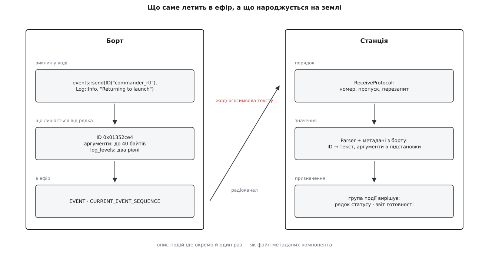
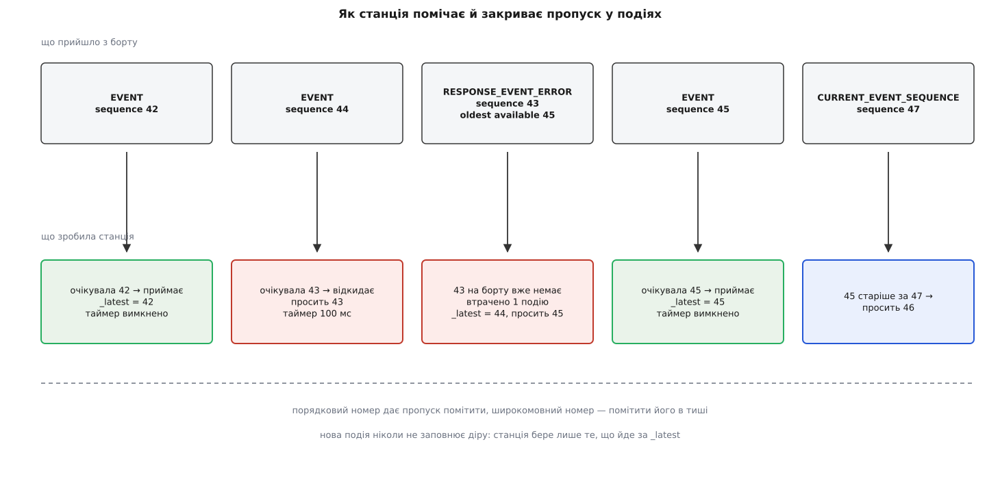
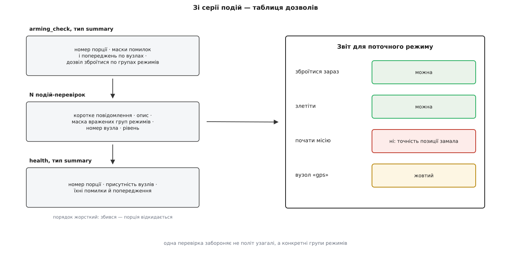

# Інтерфейс подій: коди з борту як людські повідомлення

<preknowlist>
- [Пакет MAVLink](root:sys-dron/mavlink-packet) — кадр із фіксованим набором полів наперед відомого розміру; рядок у полі має жорстко задану довжину.
- [Нумерація послідовності пакетів](root:com-transport/sequence-numbering) — порядковий номер, за яким приймач бачить пропуск, і що з ним стається при переповненні лічильника.
- [Надійний обмін](root:com-transport/reliable-link) — доставка попри втрати: підтвердження, повтор, перезапит утраченого.
- [Відомості про компонент](root:sys-dron/component-information) — опис, який їде з борту окремим файлом, бо лише прошивка знає, що в ній усередині.
- [Vehicle](root:sys-dron/vehicle-object) — об'єкт застосунку, що відповідає одному апаратові й володіє менеджерами протоколів.
- [Маршрутизація за sysid і compid](root:sys-dron/message-routing) — під одним апаратом живуть кілька компонентів, і кожен має власний номер.
- [Arming-перевірки](root:sys-dron/arming-checks) — набір умов, без яких апарат відмовляється зброїтися.
</preknowlist>

Пілот тисне «Зброїти», і в кутку екрана спалахує червоне: «Arming denied: calibrating». Рядок короткий і зрозумілий. Питання, з якого починається вся ця підсистема, звучить так: **де саме цей рядок склеївся в рядок** — на борту чи вже на землі?

У QGroundControl відповідь залежить від того, яким із двох шляхів прийшло повідомлення. Старий шлях везе готовий текст: автопілот форматує його в себе й кладе символи в поле пакета. Новий шлях не везе жодного символу — він везе число, і текст народжується вже в застосунку. Різниця виглядає дрібною, поки не подивитися, чого коштує перший варіант.

## Чому текст у пакеті — поганий носій

Старий спосіб — повідомлення `STATUSTEXT` (номер 253). Воно має рівно два змістовні поля:

```
severity   uint8      важливість за MAV_SEVERITY (0 — аварія … 7 — зневадження)
text       char[50]   текст без завершального нуля, UTF-8
```

Плюс двоє полів-розширень, доданих пізніше: `id` і `chunk_seq`. Вони вже самі по собі — зізнання в поразці. П'ятдесяти байтів на осмислену фразу не вистачає, тож довший текст ріжуть на шматки з однаковим `id` і зростаючим `chunk_seq`, а приймач їх зшиває. Одне «повідомлення» перетворилося на невеликий протокол складання.

Але тіснота — навіть не головна біда. Порахуймо, чого текст у полі не вміє в принципі.

**Він не має тотожності.** «Arming denied: calibrating» — це послідовність символів. Щоб застосунок міг спитати «а це та сама подія, що прилетіла хвилину тому, чи вже інша», йому доводиться порівнювати рядки. Хтось у прошивці міняє формулювання на «Arming denied: calibration in progress» — і будь-яка логіка, побудована на тексті, тихо ламається. Так уже було: станція шукала префікс `PreArm` і `preflight`, щоб відрізнити передпольотну відмову від решти повідомлень, і кожна така перевірка — це домовленість, яку ніде не записано.

**Він не має структури.** Питання «які саме перевірки апарат не пройшов і які режими вони блокують» не має відповіді в потоці рядків. Є лише рядки, які можна показати в списку. Пілот бачить п'ять червоних фраз і сам вирішує, чи означають вони, що злітати не можна, чи лише що місію не почати.

**Він не має опису.** П'ятдесят байтів — це заголовок. Того, що людині насправді потрібно («чому так сталося й що з цим робити»), у пакеті немає й бути не може: воно не влізе, а якби й влізло, з'їло б смугу, яка потрібна телеметрії.

**Він не має мови.** Текст англійською склеєний у прошивці, і жоден переклад на землі вже неможливий — перекладати нема з чого, є лише готовий результат.

**Його доставку ніхто не гарантує.** MAVLink поверх телеметричного радіо — потік без підтверджень; кадри губляться. Загублений `STATUSTEXT` просто не з'явиться на екрані, і — це найгірше — станція про це **не дізнається**. Тиша на екрані означає або «нічого не сталося», або «сталося, але не долетіло», і розрізнити ці два стани неможливо.

Усі п'ять вад мають один корінь. Рядок — це вже **відрендерене** повідомлення: прошивка виконала роботу подання (вибрала мову, формат, довжину) у місці, де для цієї роботи немає ні контексту, ні пам'яті, ні смуги. Отже, подання треба перенести на землю. А в ефір пустити те, з чого подання породжується: **яка саме подія сталася і з якими числами**.

Саме це й робить інтерфейс подій. Ідея — не нова й не унікальна для авіоніки; те, як вона визріла в PX4 з накопиченої втоми від `STATUSTEXT`, розказано окремо в [історії заміни](root:sys-dron/events-interface/hist-statustext-to-events.md). Сам обмін — набір повідомлень, правила нумерації й перезапиту — описаний як [протокол подій MAVLink](root:sys-dron/mavlink-events-protocol) незалежно від застосунку; тут же йдеться про те, що з ним робить станція.

## Подія — це число

На борту виклик виглядає так (це справжній рядок із `Commander.cpp` PX4):

```cpp
events::send(events::ID("commander_rtl"), events::Log::Info,
             "Returning to launch");
```

Текст `"Returning to launch"` тут є — але він **не потрапляє в ефір**. Він потрібен компіляторові лише як документація на місці й, головне, скриптові збирання: перед компіляцією PX4 проходить власним розбирачем по всіх вихідних файлах, збирає з кожного виклику `events::send` ім'я, текст, опис із коментаря й типи аргументів, і складає з них JSON. У прошивку йде рівно те, що лишилося від виклику після цього: ідентифікатор, аргументи й рівні важливості.

Ідентифікатор рахується з **імені** події. Не з лічильника, не з номера в реєстрі — з рядка `"commander_rtl"`, хешем FNV-1a.

**Умова: подія `commander_rtl`, компонент автопілота.**

```
FNV-1a (32 біти): h = 0x811c9dc5
для кожного байта імені:  h = (h XOR байт) · 0x01000193  (за модулем 2³²)

h("commander_rtl")      = 0x7a352ce4
нижні 24 біти           = 0x352ce4
компонент 1 у старших   = 0x01 << 24 = 0x01000000
ID                      = 0x01352ce4
```

Чому хеш, а не лічильник? Лічильник потребує централізованого реєстру: хтось мусить видавати номери й стежити, щоб дві гілки розробки не взяли один. Хеш видає номер із самого імені — детерміновано й однаково у двох місцях, які мусять збігтися: у прошивці (там це `constexpr`-функція, тобто число обчислюється при компіляції) і в скрипті, що робить метадані. Розробникові не треба знати про номери взагалі; він мусить лише дати події унікальне ім'я.

Плата за це — колізії. Двадцять чотири біти дають 16.7 мільйона значень, а подій у прошивці — тисячі; за парадоксом днів народження ймовірність збігу вже не мізерна. Тому генератор метаданих кладе події в словник за ідентифікатором і на дублікаті **зупиняє збирання**:

```python
assert sub_id not in current_events, \
    "Duplicate event ID for {0} (message: '{1}'), other event message: '{2}'".format(...)
```

Збіг ловиться при збиранні прошивки, а не в польоті, і лікується перейменуванням події.

Старші вісім бітів ідентифікатора — номер компонента в метаданих; у PX4 це `1u << 24`, тобто автопілот. Завдяки їм подія підвісу й подія автопілота не сплутаються навіть тоді, коли їх зводять докупи — наприклад, при розборі бортового журналу.

Далі — аргументи. У повідомленні під них відведено сорок байтів, і в них лягають самі числа, без імен і без розділювачів: подія з `float` і `uint8_t` займе п'ять байтів, а те, як їх прочитати назад, знають метадані. Кожен виклик перевіряється на місці:

```cpp
static_assert(util::sizeofArguments(args...) <= sizeof(e.arguments),
              "Too many arguments");
```

І нарешті рівні важливості. Їх **два**, і обидва пакуються в один байт:

```
log_levels = (внутрішній << 4) | зовнішній
```

Навіщо два. Спрацювання повернення додому — це попередження для пілота: він мусить його побачити. Але в бортовому журналі те саме спрацювання — рядова інформація, бо журнал читають після польоту й там цікавить інше. Один рівень довелося б вибрати компромісний, і одна зі сторін отримала б неправильну картину. Тому виклик задає обидва:

```cpp
events::send(events::ID("commander_arm_denied_calibrating"),
             {events::Log::Critical, events::LogInternal::Info},
             "Arming denied: calibrating");
```

```
зовнішній Critical = 2, внутрішній Info = 6
log_levels = (6 << 4) | 2 = 0x62
```

Станція бере лише нижній піврядок. Окремо варто знати два значення поза звичною шкалою: рівень 8 («Protocol») означає «людині не показувати, це службова подія», а 9 — «вимкнено».



*Ліворуч — усе, що лишається від виклику в коді прошивки; праворуч — три роботи станції: порядок, значення, призначення.*

## Німе число оживляє словник

Число саме по собі мовчить. Щоб із `0x01352ce4` вийшов рядок, станції потрібен опис — той самий JSON, який зібрав скрипт при збиранні прошивки. Він містить простір імен компонента, перелічувані типи, групи подій і в кожній групі — події за нижніми 24 бітами ідентифікатора: ім'я, коротке повідомлення, розлогий опис, список аргументів із типами.

Цей файл їде з борту як один із видів [відомостей про компонент](root:sys-dron/component-information) — під кодом `COMP_METADATA_TYPE_EVENTS`. У застосунку його приймає крихітний клас, чия єдина робота — передати ім'я завантаженого файлу далі:

```cpp
void CompInfoEvents::setJson(const QString& metadataJsonFileName)
{
    vehicle->setEventsMetadata(compId, metadataJsonFileName);
}
```

І тут виникає перегони, які видно в коді неозброєним оком. Події починають надходити з першої секунди після з'єднання — апарат не чекає, поки станція розбереться, хто він. Метадані ж їдуть файлом через вузький канал і приїжджають за секунди, а то й за десятки секунд. Отже, перші події неминуче застають розбирач порожнім.

Рішення просте й чесне: тримати їх у черзі.

```cpp
void EventHandler::Impl::gotEvent(const mavlink_event_t &event)
{
    if (!parser.hasDefinitions()) {
        if (pendingEvents.size() > 50) {   // стеля, до якої в нормі не доходить
            pendingEvents.clear();
        }
        pendingEvents.push_back(event);
        return;
    }

    std::unique_ptr<events::parser::ParsedEvent> parsed_event =
        parser.parse(events::EventType(event));
    if (parsed_event == nullptr) {
        qCWarning(EventHandlerLog) << "Got Event w/o known metadata: ID:" << event.id;
        return;
    }
    ...
}
```

Коли файл нарешті завантажено, `setMetadata` заливає його в розбирач і прокручує чергу з початку — так, ніби події щойно прийшли. А якщо метадані так і не доїхали, черга росте до п'ятдесяти й скидається: показати ці події все одно нічим, а пам'ять тримати нема сенсу.

Друга гілка того самого коду — подія, для якої в метаданих немає запису. Це не збій каналу, а розбіжність версій: подія з прошивки, опис якої станція взяла зі старого кешу. Тут єдина можлива поведінка — мовчки викинути й записати попередження в журнал зневадження, бо показати число користувачеві гірше, ніж не показати нічого.

> 🔧 **Навіщо це.** Коли на з'єднаному апараті раптом «немає жодних повідомлень» — перше, що варто перевірити, це не канал, а те, чи доїхав файл метаданих подій. Симптом однаковий, місце поломки геть інше.

## Текст народжується на землі

Опис події — не готовий рядок, а шаблон. Аргументи підставляються за позицією в синтаксисі, близькому до пітонівського, але з нумерацією від одиниці: `{1}` — перший аргумент, `{2:.1}` — другий із одним знаком після коми. За номером може стояти позначка одиниці — `m` (горизонтальна відстань), `m_v` (вертикальна), `m^2`, `m/s`, `C`. Вона потрібна не для друку суфікса, а щоб станція могла **перерахувати** величину в ту систему, яку вибрав користувач: те саме число в метричному й імперському відображенні дасть різні рядки з одних і тих самих байтів.

Крім підстановок, в описі живуть теги. `<a href="…">` — посилання на документацію. `<param>PARAM_NAME</param>` — згадка параметра. `<profile name="dev">…</profile>` — шматок тексту, видимий лише в певному профілі; так у той самий опис кладуть і фразу для пілота, і подробицю для розробника.

Що з цими тегами робити — вирішує вже застосунок, і QGroundControl підставляє власні перетворювачі при створенні обробника:

```cpp
parser.formatters().url = [](const std::string &content, const std::string &link) {
    return "<a href=\"" + link + "\">" + content + "</a>";
};
parser.formatters().param = [](const std::string &content) {
    return "<a href=\"param://" + content + "\">" + content + "</a>";
};
parser.formatters().escape = [](const std::string &str) {
    return QString::fromStdString(str).toHtmlEscaped().toStdString();
};
```

Найцікавіший тут середній. Згадка параметра перетворюється не на текст, а на посилання зі схемою `param://` — натиснувши його, користувач потрапляє одразу в [редактор цього параметра](root:sys-dron/parameter-manager). Повідомлення про помилку стає дією, і це можливо саме тому, що на землю приїхала структура, а не готовий рядок.

Перетворювач `escape` варто помітити окремо: усе, що прийшло з борту, проходить екранування HTML, перш ніж стати частиною розмітки. Метадані — дані з зовнішнього джерела, і поводитися з ними треба відповідно.

Профіль поки що задається в коді одним рядком — `QStringLiteral("dev")`, з поміткою, що це має стати налаштуванням. Тобто нині всі користувачі станції бачать і той текст, який задумувався як розробницький.

## Втрачена подія — це не тиша, а неправда

Якщо подія «критично низький заряд» не долетіла, пілот не побачить нічого — і зробить із порожнього екрана висновок, що все гаразд. Отже, від інтерфейсу мало возити події: він мусить дати станції змогу **знати про кожну**, зокрема й про ту, якої вона не отримала.

Для цього кожна подія від кожного компонента несе `sequence` — 16-бітовий порядковий номер. Навколо нього побудовано три допоміжні повідомлення, і кожне закриває свою діру.

`CURRENT_EVENT_SEQUENCE` — широкомовне «мій останній номер такий-то», яке компонент шле регулярно. Без нього загублена **остання** подія лишилася б непоміченою назавжди: наступної може не бути годинами, а виявити пропуск можна лише тоді, коли прийде щось із більшим номером.

`REQUEST_EVENT` із полями `first_sequence` і `last_sequence` — прохання надіслати подію (чи діапазон) ще раз.

`RESPONSE_EVENT_ERROR` — відповідь «цієї події вже немає», з полем `sequence_oldest_available`: найстаріший номер, який борт іще тримає в буфері. Буфер на автопілоті маленький, і подія з нього рано чи пізно витісняється.

Точні поля всіх чотирьох повідомлень, розкладка `log_levels`, перелічувані типи та форма JSON із метаданими зібрані окремо — у [довідці інтерфейсу подій](root:sys-dron/events-interface/api-events-messages.md).

Сама ж логіка живе не в QGroundControl, а в бібліотеці `libevents`, спільній для борту й землі; станція підключає її як підмодуль і дає їй чотири зворотні виклики (надіслати запит, віддати розібрану подію, увімкнути таймер, повідомити про втрату). Серце цієї логіки — порівняння двох номерів:

```cpp
SequenceComparison compareSequence(uint16_t expected_sequence,
                                   uint16_t incoming_sequence)
{
    if (expected_sequence == incoming_sequence) {
        return SequenceComparison::equal;
    }
    const uint16_t diff = incoming_sequence - expected_sequence;
    if (diff > UINT16_MAX / 2) {
        return SequenceComparison::older;
    }
    return SequenceComparison::newer;
}
```

Тут працює властивість беззнакової арифметики: різниця двох 16-бітових чисел сама по собі циклічна. Якщо вона менша за півкола (32767) — прийшло новіше; більша — старіше. Тому перехід 65534 → 65535 → 0 → 1 обробляється тими самими двома рядками, що й 41 → 42.

Ця дрібниця варта окремої уваги, бо помилки в ній сумно знамениті: код, який працює місяцями й ламається рівно тоді, коли лічильник обернувся. PX4 закриває цю пастку зухвало й ефективно — стартовим значенням:

```cpp
static constexpr uint16_t initial_event_sequence = 65535 - 10;
```

Нумерація починається за десять кроків до переповнення. Тобто **кожен** політ, кожне ввімкнення апарата проходить через обертання лічильника в перші секунди роботи. Помилка в порівнянні перестає бути рідкісною й стає такою, що не помітити її неможливо.

Що станція робить із результатом порівняння:

- **старіше** — дублікат (борт надіслав повторно те, що вже дійшло) — мовчки відкинути;
- **рівно** — прийняти, посунути `_latest_sequence`, вимкнути таймер;
- **новіше** — між тим, що є, і тим, що прийшло, зяє діра.

Остання гілка зроблена свідомо просто: подію, що прийшла «наперед», станція **не зберігає**, а викидає й просить ту, якої бракує. Коли пропущена приїде, за нею приїде й ця — вдруге. Ціна — зайвий пробіг кількох пакетів; виграш — відсутність буфера переупорядкування з його межами й станами. Для потоку, де подій одиниці на секунду, обмін очевидно вигідний.

Кожен запит зводить таймер на 100 мілісекунд. Не прийшло — запит повторюється. Таймер вимикається лише тоді, коли очікувана подія стала на місце.



*Верхній ряд — що прилетіло, нижній — що з цього вийшло у станції. Пропущений номер закривається запитом, а не чеканням.*

Окремої обробки потребує перезавантаження апарата: лічильник починається спочатку, і всі номери раптом стають «старішими». Основний сигнал про це — прапорець `RESET` у `CURRENT_EVENT_SEQUENCE`. Але прапорець їде в пакеті, а пакет губиться, тому поруч стоїть страхувальник, що дивиться на час від увімкнення в самій події:

```cpp
if (timestamp + 10000 < _last_timestamp_ms && _last_timestamp_ms < UINT32_MAX - 60000) {
    // час від увімкнення стрибнув назад більш ніж на 10 с — апарат перезавантажився
    _has_sequence = false;
    _has_current_sequence = false;
}
```

Десять секунд запасу — щоб не сплутати перезавантаження з переставленням пакетів у черзі, а верхня межа — щоб не сплутати його з переповненням 32-бітового лічильника мілісекунд (це трапляється приблизно через 49 діб безперервної роботи).

І остання гілка — та, де відновити вже нічого. Якщо на запит прийшла відповідь «немає, найстаріше доступне — 45», станція рахує, скільки подій утрачено безповоротно, стрибає до найстарішого доступного номера й повідомляє про втрату. Наслідок цього повідомлення — не лише рядок у журналі:

```cpp
auto error_cb = [this](int num_events_lost) {
    healthAndArmingChecks.reset();
    qCWarning(EventHandlerLog) << "Events got lost:" << num_events_lost;
};
```

Звіт готовності скидається повністю — він збирається не з однієї події, а зі строгої серії, і серія з дірою вже не звіт, а вигадка.

Того, як усе це складається докупи, зручно навчитися, написавши власний приймач: розбір номера, стан, таймер і перезапит уміщаються в кількасот рядків — розбір такої програми є в [проєкті мінімального приймача подій](root:sys-dron/events-interface/proj-event-receiver.md).

## Групи: один канал під різні задачі

Кожна подія належить до **групи** — це просто мітка в метаданих, але вона визначає, що зі подією робить інтерфейс станції.

- `default` — звичайне повідомлення для людини; йде в стрічку статусу.
- `health` і `arming_check` — складники звіту готовності; в стрічку **не** йдуть.
- `calibration` — службовий обмін під час калібрування давачів і апаратури керування.

Правило, яке робить цю схему розширюваною: **невідому групу інтерфейс не показує**. Нова прошивка може вигадати свою групу під власну задачу — стара станція мовчки її проігнорує замість того, щоб вивалити на пілота сміття, якого не розуміє.

Розподіл у QGroundControl виглядає рівно так, як описано:

```cpp
// перевірки готовності мають свій екран, а не стрічку повідомлень
if (event->group() == "health" || event->group() == "arming_check") {
    return;
}
if (event->group() == "calibration") {
    return;
}
if (event->group() != "default" || severity == -1) {
    return;
}
```

Те, що пройшло крізь усі відсіювання, стає парою «повідомлення + опис» і йде сигналом до `Vehicle`, а далі — у той самий обробник текстових повідомлень, куди потрапляють і старі `STATUSTEXT`. Обидва шляхи сходяться в одній стрічці — пілот не мусить знати, яким із них прийшов рядок.

## Звіт готовності, зібраний із подій

Найцікавіше застосування інтерфейсу — відповідь на питання «чому апарат не зброюється». Рядок «Arming denied» на нього не відповідає: він каже, що відмовлено, але не каже ні що саме не так, ні чи можна натомість злетіти вручну.

Правильна відповідь — таблиця. Апарат має набір вузлів (GPS, магнетометр, живлення, канал керування…) з їхнім станом і набір **груп режимів польоту**. Питання «чи можна зброїтися» саме по собі неповне: без точної позиції ручний режим цілком доступний, а місію починати не можна. Отже, кожна перевірка мусить казати не «заборонено», а «заборонено ось цим групам режимів».

Передати таблицю подіями можна, і робиться це строгою серією з трьох різновидів:

1. **Підсумок перевірок зброєння** (`arming_check`, тип `summary`) відкриває серію. Його аргументи — номер порції, дві бітові маски по вузлах (де помилка, де попередження) і дві маски по групах режимів (де можна зброїтися, де можна летіти). Перелічувані типи для обох масок лежать у метаданих, тож станція знає не лише біти, а й назви вузлів і груп.
2. **Події-перевірки** — по одній на кожну проблему. Кожна несе коротке повідомлення, розлогий опис, маску вражених груп режимів, номер вузла, якого стосується, і власні рівні важливості.
3. **Підсумок здоров'я** (`health`, тип `summary`) закриває серію: які вузли взагалі присутні, у яких помилка, у яких попередження.

Порядок жорсткий, і розбирач тримає очікуваний різновид у полі стану. Прийшло щось інше — порція відкидається, а очікування скидається на початок. Виняток лише один: новий підсумок перевірок приймається завжди, бо він і означає «починаю передавати наново».

Порції потрібні тому, що маска вузлів — 64-бітова, а перевірок і вузлів у великій прошивці буває більше. Тоді борт шле кілька серій із різними номерами порцій, а станція зводить їх в одну картину за двома різними правилами: дозволи по групах режимів об'єднуються **кон'юнкцією** (заборонив хтось один — заборонено), а стани вузлів — **диз'юнкцією** (позначив хтось один — позначено). Асиметрія тут не випадкова: дозвіл мусить підтвердити кожна порція, а проблему достатньо помітити в одній.



*Кожна перевірка забороняє не політ узагалі, а конкретні групи режимів — тому й відповідь має форму таблиці, а не одного «так/ні».*

Готовий звіт стає об'єктом із властивостями, які видно на екрані: чи підтримується взагалі, чи можна зброїтися, чи можна злетіти, чи можна почати місію, чи є попередження й помилки, якого кольору позначка GPS, і список проблем **для поточного режиму**.

Три останні пункти варті уваги. «Можна злетіти» й «можна почати місію» — це не окремі відповіді борту, а той самий дозвіл, запитаний для інших груп. Щоб їх дістати, станція мусить перекласти назву режиму в номер групи, а це знання розкидане по трьох місцях: назву режиму зльоту дає [плагін прошивки](root:sys-dron/firmware-plugin), номер режиму — той самий плагін, а відповідність номера групі — метадані:

```cpp
const QString modes[2]{firmwarePlugin->takeOffFlightMode(), _vehicle->missionFlightMode()};
for (size_t i = 0; i < std::size(modeGroups); ++i) {
    uint8_t base_mode{};
    uint32_t custom_mode{};
    if (firmwarePlugin->setFlightMode(modes[i], &base_mode, &custom_mode)) {
        modeGroups[i] = handler.getModeGroup(custom_mode);
    }
}
```

А список проблем «для поточного режиму» означає, що звіт треба перебирати щоразу, коли пілот перемкнув режим: набір подій той самий, але маски тепер відсівають інші рядки. Тому менеджер подій підписаний на зміну режиму й перераховує звіт наново.

> 🔧 **Навіщо це.** Якщо в чужій збірці станції екран готовності порожній, шукати треба по черзі три речі: чи прошивка взагалі оголосила підтримку протоколу `health_and_arming_check` у метаданих, чи знайшлася група для поточного режиму (без неї звіт не оновлюється взагалі), і чи не було втрати подій — вона скидає зібране до нуля.

## Один обробник на компонент

Уся описана машина — стан послідовності, таймер, розбирач, звіт — заведена **на кожен компонент окремо**. Причина проста: нумерація подій належить джерелу. Автопілот і підвіс камери рахують свої події незалежно й нічого не знають одне про одного; спільний лічильник на обох давав би суцільні фальшиві пропуски.

Тому `MAVLinkEventManager`, який `Vehicle` створює при народженні, тримає словник обробників за номером компонента й заводить новий лінькувато — при першому повідомленні від невідомого досі номера. Звіт готовності, навпаки, один і оновлюється лише з `MAV_COMP_ID_AUTOPILOT1`: питання «чи можна зброїтися» стосується апарата, а не підвіса.

Запит на повтор надсилається не абикуди, а основним каналом апарата:

```cpp
SharedLinkInterfacePtr sharedLink = _vehicle->vehicleLinkManager()->primaryLink().lock();
if (!sharedLink) {
    return;
}
```

Слабке посилання й перевірка тут не формальність: канал може зникнути між тим, як таймер вирішив повторити запит, і тим, як запит дійшов до відправлення.

## Дві правди в ефірі одночасно

Перехід зі старого на нове не буває миттєвим: у полі одночасно літають апарати з новими й старими прошивками, а на землі стоять станції різного віку. Тому PX4 певний час шле **обидва** повідомлення на кожну подію:

```cpp
mavlink_log_critical(&_mavlink_log_pub, "Arming denied: calibrating\t");
events::send(events::ID("commander_arm_denied_calibrating"),
             {events::Log::Critical, events::LogInternal::Info},
             "Arming denied: calibrating");
```

Стара станція побачить лише перший рядок і працюватиме як раніше. Нова побачить обидва — і мусить показати рівно один, інакше пілот отримає кожне повідомлення двічі.

Ознакою слугує символ табуляції наприкінці тексту. Він не друкується, у п'ятдесят байтів вміщується й для старого приймача нічого не означає:

```cpp
// сумісність із PX4: текст, що закінчується табуляцією, приїде ще й подією
if (px4Firmware() && text.endsWith('\t')) {
    return;
}
```

Друге відсіювання тонше. Передпольотні відмови ArduPilot починає з `PreArm`, PX4 — зі слова `preflight`; ці рядки станція вміла ловити задовго до появи подій. Тепер, якщо для цього компонента протокол перевірок готовності підтверджено метаданими, старі рядки викидаються — те саме вже є у звіті, у нормальному вигляді.

Варто знати й межу всього цього. Чотири повідомлення інтерфейсу подій позначені в MAVLink як `<wip/>` — робота триває, і формально вони можуть змінитися. Реалізовані вони в PX4 і QGroundControl; ArduPilot їх поки не шле. Тому стрічка старих текстових повідомлень нікуди не зникає, і станція мусить лишатися придатною для апарата, який про події не чув узагалі.

## Що насправді купив цей обмін

Найдовше життя перенесеної на землю розшифровки видно вже після посадки. Розбирач `libevents` не залежить від MAVLink: йому потрібні лише ідентифікатор, байти аргументів і той самий JSON із метаданими. А в бортовому журналі лежить рівно це — події записані в тому ж вигляді, у якому летіли в ефір.

Тому та сама подія, що торік показала пілотові попередження, розгортається в текст сьогодні — і мовою того, хто читає журнал, і з тими одиницями, які він вибрав, і з розлогим описом, який у ефір ніколи не потрапляв. Рядок, склеєний у прошивці, так не вміє: він назавжди лишається тим, чим був у мить друку, — п'ятдесятьма байтами чужої мови без контексту. Заміна тексту на число виглядає економією смуги, але купує вона зовсім інше: **повідомлення, яке ще можна витлумачити**.
