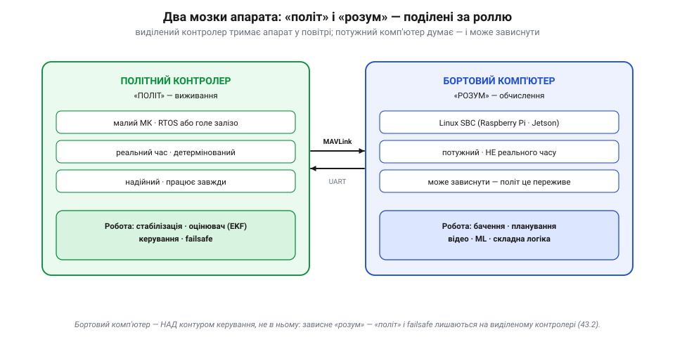
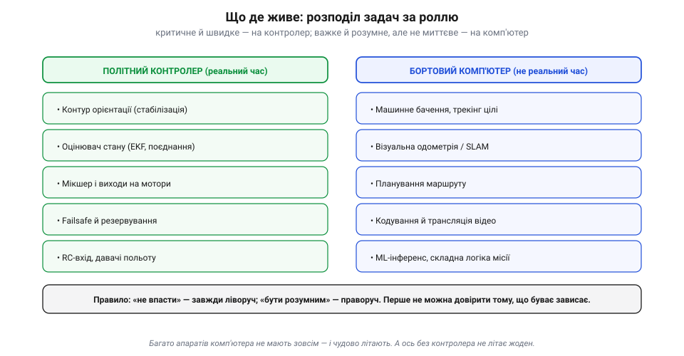
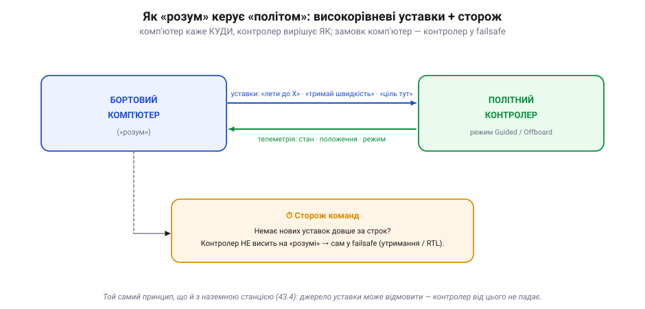
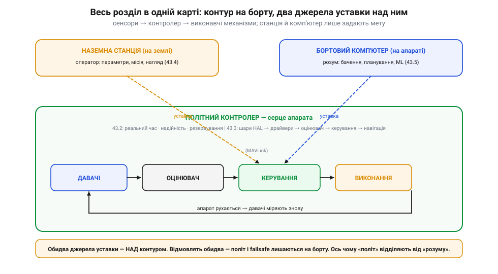

# Поділ «політ vs розум»: політний контролер і бортовий комп'ютер (огляд)

В автономному апараті стикаються дві несумісні вимоги. Критичне керування потребує [виділеного, простого, реального контролера](root:sys-dron/flight-controller): швидкого, передбачуваного, надійного. А складні задачі — розпізнавання, планування, відео — потребують **потужного, гнучкого** комп'ютера, який ніколи не буде ні простим, ні гарантовано вчасним. Запхати обидві вимоги в одну машину неможливо: те, що добре для однієї, шкодить іншій. Мудра архітектура й не вибирає одне з двох — вона ставить на борт **обидва** мозки й **поділяє** їх за роллю.

Звучить майже банально — «розклади роботу між двома комп'ютерами», — але вся сіль у тому, **як** саме розділити й де провести межу. Проведеш її не там — або втратиш реальний час (і апарат впаде), або переплатиш складністю там, де вистачило б одного контролера. Тож розгляньмо цей поділ уважно.

### Два мозки, дві ролі


*Поділ праці між двома машинами. Зліва — **політний контролер**: малий МК реального часу, що тримає апарат у повітрі (стабілізація, оцінювач, керування, failsafe). Справа — **бортовий комп'ютер** (*companion computer*): потужний Linux-одноплатник (Raspberry Pi, NVIDIA Jetson), що думає (бачення, планування, відео, ML) — і якому **дозволено** зависнути. З'єднані вони тонким каналом MAVLink по UART.*

Назвемо їх по-простому: **«політ»** і **«розум»**. «Політ» — це виживання: він має бути швидким, передбачуваним і надійним, тому живе на [виділеному контролері](root:sys-dron/flight-controller). «Розум» — це кмітливість: розпізнати ціль, прокласти маршрут, стиснути відео, виконати нейромережу. Ці задачі **важкі** обчислювально, але — ключове — **не миттєві**: якщо розпізнавання цілі спізниться на 50 мс, нічого страшного; а якщо на 50 мс спізниться стабілізація, апарат може помітно хитнути чи й зірватися зі стабілізації (наскільки фатально — залежить від апарата, режиму й запасу стійкості). Тому «розум» можна спокійно довірити потужній, але не реального часу машині, яка часом і підвисне.

Бортовий комп'ютер з'явився на аматорських апаратах тоді, коли подешевшали Linux-одноплатники: щойно Raspberry Pi й подібні стали доступними, спільнота почала «приклеювати» їх до польотних контролерів, щоб додати апаратам зір і автономність — не чіпаючи перевіреного «польотного» ядра.

А чому не зробити навпаки — узяти один потужний комп'ютер і змусити його ще й стабілізувати апарат, скажімо, з «латкою реального часу» для Linux? Інколи так і роблять, але це боротьба з природою системи. Між двома задачами — глибока **несумісність**: контур стабілізації хоче крихітних, але **залізно вчасних** порцій роботи сотні разів на секунду, а бачення чи планування хочуть **великих** обчислень, які тривають довго й непередбачувано. Запхати їх в одну машину — означає, що важка задача рано чи пізно «вкраде» процесор у критичної, і та [спізниться зі своїм миттєвим кроком](root:sys-dron/flight-controller). Простіше, дешевше й **безпечніше** дати кожній своє залізо, ніж героїчно мирити їх в одному. Поділ — не милиця, а правильна відповідь на різну природу задач.

### Що де живе

Якщо тримати в голові поділ «виживання проти кмітливості», розкласти задачі по двох машинах легко:


*Хто за що відповідає. На контролері — усе, що критичне для виживання й мусить бути швидким: контур орієнтації, оцінювач стану, мікшер моторів, failsafe, RC. На комп'ютері — усе важке й розумне, але не миттєве: машинне бачення й трекінг, візуальна одометрія, планування, відео, ML-інференс. Без комп'ютера апарат літає; без контролера — ні.*

Останнє варто підкреслити: **дуже багато апаратів узагалі не мають бортового комп'ютера** — і чудово літають, бо все потрібне для польоту живе в контролері. Комп'ютер додають лише тоді, коли потрібна **автономна кмітливість**: летіти за рухомою ціллю, обходити перешкоди по камері, ухвалювати рішення на основі того, що апарат «бачить». «Розум» — це розкіш поверх «польоту», а не його заміна.

Розкіш має ціну, і чесний інженер її зважує. Бортовий комп'ютер — це додаткова вага й габарити, помітне споживання енергії (а отже, коротший політ), тепло, яке треба відводити, і — головне — **більша поверхня відмов**: ще одна машина, ще один кабель, ще один протокол, що можуть підвести. Тому комп'ютер ставлять не «про всяк випадок», а коли його кмітливість справді потрібна. Якщо задачу розв'язує сам контролер режимами й місією — зайвий мозок лише обтяжує апарат і вкорочує політ.

Між «явно політ» і «явно розум» є й сіра зона. Просте обминання перешкоди по далекоміру цілком уміщається в контролер; складне — по камері з побудовою карти — вже ні. Точну посадку по мітці інколи роблять на контролері, інколи на комп'ютері. Правило для сірої зони те саме, що й завжди: спитай, **чи критична задача для виживання й чи мусить бути миттєвою**. Так — тягни її ліворуч, до надійного ядра, навіть ціною простоти. Ні — хай живе праворуч, де є обчислювальна воля.

> 🔧 **Навіщо це.** Беручи до рук незнайому систему, спершу з'ясуй, **скільки в ній мозків**. Один (лише контролер) — апарат робить те, що зашито в режимах і місії. Два (контролер + комп'ютер) — шукай, що саме «розум» додає й по якому каналу він командує «польотом». Це одразу окреслює можливості й слабкі місця апарата.

### Як «розум» керує «політом»

Якщо комп'ютер не в контурі керування, то як він взагалі впливає на політ? **Високорівневими уставками**. Контролер має спеціальний режим (в ArduPilot — *Guided*, у PX4 — *Offboard*), у якому він приймає команди ззовні: «лети до точки X», «тримай таку швидкість», «дивись на ціль отут». Комп'ютер рахує **що** робити (скажімо, бачить ціль на кадрі й переводить «піксель → напрям»), а **як** це виконати — стабілізувати, відмішати на мотори — лишається контролеру.


*Діалог двох мозків. Комп'ютер шле вниз високорівневі уставки (по MAVLink, часто через [`pymavlink`](root:embedded/pymavlink)), контролер відповідає телеметрією. Але — критично — контролер **не висить** на комп'ютері. У **PX4** режим *Offboard* прямо вимагає безперервного потоку уставок (>2 Гц): пропав потік на заданий строк — і контролер виходить з режиму в failsafe. В **ArduPilot** *Guided* — м'якше й залежно від типу команди: разову ціль «лети в точку» апарат доводить до кінця, а безперервні уставки (швидкість/кут) мають таймаут, по якому він вертається до попередньої команди. Спільне одне: **джерело уставки має право відмовити**, і політ це переживе.*

Це той самий запобіжник, що й для [наземної станції](root:sys-dron/params-gcs), лише тепер для бортового «розуму»: **джерело уставки має право відмовити**. Комп'ютер може зависнути, перегрітися чи захлинутися обчисленнями — і саме тому контролер ставиться до його команд як до **порад згори**, а не до життєво необхідного входу. Замовк «розум» — «політ» спокійно бере керування на себе.

Фізично цей місток зазвичай простий: послідовний порт (UART) між комп'ютером і контролером, по якому йде той самий MAVLink, що й до наземної станції. На стороні комп'ютера з ним працюють через готові бібліотеки — [`pymavlink`](root:embedded/pymavlink), MAVSDK чи через ROS, — тож «розум» пише команди кількома рядками, а не б'ється з протоколом вручну. Іноді комп'ютер ще й **ретранслює** потік далі на землю, тобто водночас служить мостом між контролером і наземною станцією. Але хоч би скільки ролей він брав, у контур керування він так і не входить.

**Приклад (апарат, що сам летить за ціллю).** Бортовий комп'ютер бачить ціль на відеокадрі й хоче, щоб апарат тримався над нею. Потік виглядає так:

```
1. камера → кадр → комп'ютер («розум»)
2. нейромережа знаходить ціль:        піксель (320, 210)
3. «піксель → напрям»:                ціль на 4° праворуч від центру
4. комп'ютер шле уставку по MAVLink:  «змісти позицію праворуч»  (кілька разів за секунду)
5. контролер (режим Guided) приймає → контур керування веде апарат туди
6. ціль зрушила — крок 1 повторюється; апарат «висить» над ціллю
   ── камера осліпла чи комп'ютер завис → уставки спинились
      → сторож контролера спрацював → утримання / RTL (апарат НЕ падає)
```

Уся «кмітливість» (кроки 1–3) — на комп'ютері; уся «фізика польоту» (крок 5) — на контролері; а крок 4 — це тонкий місток MAVLink між ними. Прибери комп'ютер — апарат просто не вмітиме стежити за ціллю, але літати й сідати безпечно не розучиться.

І знову виручає стандартний інтерфейс. Оскільки два мозки зустрічаються на **документованому** протоколі (MAVLink), їх можна міняти незалежно: переставити «розум» з простого одноплатника на потужніший, не чіпаючи контролера; або замінити сам контролер, не переписуючи код комп'ютера. Це той самий [«контракт між шарами»](root:sys-dron/ardupilot-layers), лише тепер між двома фізичними машинами. Відкритий протокол — ось що дозволяє збирати апарат із частин різних виробників, наче конструктор, і саме тому [MAVLink](root:sys-dron/mavlink-packet) виявився такою важливою цеглинкою всієї екосистеми.

> 🔧 **Навіщо це.** Це золоте правило безпечної інтеграції: ніколи не клади виживання в залежність від машини, що може зависнути. Якщо бачиш систему, де зупинка бортового комп'ютера роняє апарат, — архітектуру побудовано небезпечно. Правильно — коли «розум» лише **підказує**, а останнє слово (і failsafe) завжди за «польотом».

### Companion — не наземна станція

Варто розвести два схожі поняття, які легко сплутати. І [наземна станція](root:sys-dron/params-gcs), і бортовий комп'ютер сидять **над** контуром керування й шлють контролеру високорівневі команди по MAVLink. Але різниця принципова: **наземна станція — на землі, керована людиною**; **бортовий комп'ютер — на апараті, автономний**. Станція — це очі й руки оператора; комп'ютер — це самостійний розум, що ухвалює рішення в польоті без людини. Перша робить апарат **керованим** із землі, другий — **автономно кмітливим** у повітрі. А контролер для обох — той самий надійний виконавець унизу.

Часто вони працюють разом. Оператор із наземної станції лише **запускає** автономну задачу («почни обліт» чи «знайди й супроводжуй»), далі бортовий комп'ютер веде її сам, а станція тим часом просто показує, що відбувається. Людина задає **намір** згори, комп'ютер перетворює його на потік уставок, контролер — на політ. Виходить три рівні, кожен повільніший і «розумніший» за нижній, — і знову той самий принцип [вкладених контурів керування](root:embedded/autonomous-system), тільки розгорнутий аж до людини на землі.

### Той самий патерн — усюди

Цей поділ — не примха дронів. Він повторюється скрізь, де машина має бути **і безпечною, і розумною**. У безпілотному автомобілі є швидкий контролер реального часу, що тримає гальма й кермо в межах безпеки, і окремий потужний комп'ютер, що розпізнає світ і планує шлях. У промисловому роботі — реальний контролер приводів і вищий «мозок» завдань. Скрізь — та сама пара: **швидке, просте, надійне ядро** плюс **повільний, складний, кмітливий верх**, з'єднані чітким інтерфейсом і захищені правилом «ядро переживає відмову верху». Зрозумівши цей патерн на прикладі апарата, ти впізнаватимеш його в десятках інших систем.

За цим стоїть і глибша причина, ніж просто продуктивність. Просте, незмінне «ядро» можна **ретельно перевірити** й навіть сертифікувати на безпеку — бо воно мале й робить одне. А «розумний» верх змінюється часто, тягне гори стороннього коду й моделей, які годі вичерпно перевірити. Відокремивши одне від одного, ми **локалізуємо ризик**: експериментуй із зором та ML скільки завгодно — найгірше, що буде при збої, — апарат увімкне failsafe. Тому поділ «політ vs розум» — це не лише про гігагерци, а про те, **де живе довіра**: критична, перевірена частина окремо від гнучкої, але непередбачуваної. Це й робить систему водночас і сміливою в можливостях, і консервативною в безпеці.

### Уся архітектура в одній карті

Якщо звести поділ ролей в один малюнок, видно, як він лягає у ширшу картину автономного апарата:


*Архітектура автономного апарата цілком. У центрі — [замкнений контур керування](root:embedded/autonomous-system) на [політному контролері](root:sys-dron/flight-controller), розкладеному [на шари](root:sys-dron/ardupilot-layers). Над ним — два джерела уставки: [наземна станція](root:sys-dron/params-gcs) і бортовий комп'ютер, обидва по MAVLink. Жодне з них не в контурі: відмовлять обидва — апарат лишається керованим, а його failsafe спрацює за наявними давачами. Оце і є відповідь на питання «з чого складається автономний апарат».*

### Куди це вкладається

Поділ «політ vs розум» — остання цеглина кістяка, спільного для будь-якої автономної системи. У центрі — [замкнений контур керування](root:embedded/autonomous-system) «давачі → оцінювач → керування → виконання → апарат → знову давачі». Цей контур мусить крутитися швидко й надійно, тому його віддають [виділеному контролеру](root:sys-dron/flight-controller) реального часу з watchdog, failsafe і резервуванням; зсередини контролер — це [стос шарів](root:sys-dron/ardupilot-layers) від HAL до навігації. Спостерігають і командують ним [із наземної станції](root:sys-dron/params-gcs) по MAVLink, причому станція лишається поза контуром. А коли апарату потрібна автономна кмітливість, поряд із «польотом» ставлять «розум» — бортовий комп'ютер, що підказує згори, але не тримає апарат у повітрі.

І ось заради чого все це. Відкривши будь-який чужий апарат — від іграшкового коптера до серйозного безпілотника, — ти знаєш, **що в ньому шукати**: де замкнений контур, де його виділене ядро, як воно розкладене на шари, чим його налаштовують і хто над ним «думає». Складна автономна машина перестає бути суцільною загадкою й розкладається на знайомі, осмислені частини. Саме ця системна грамотність — а не запам'ятовані назви — і є справжній зиск: уміння **бачити архітектуру** крізь будь-яку конкретну реалізацію.
