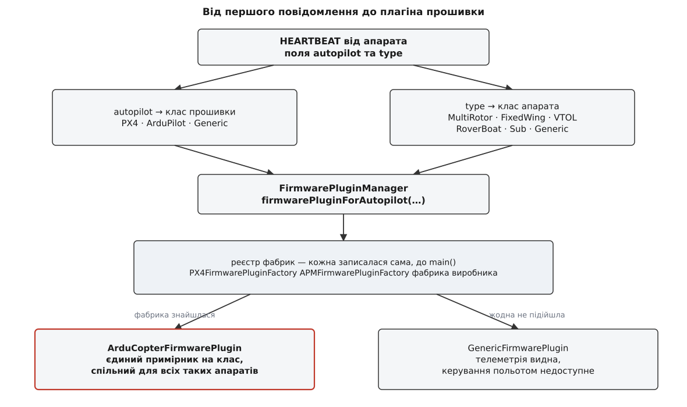
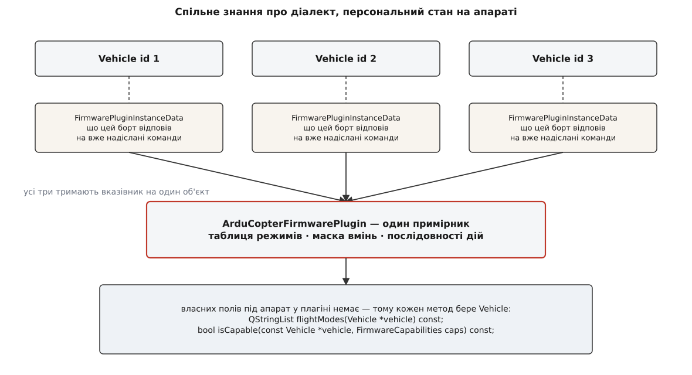
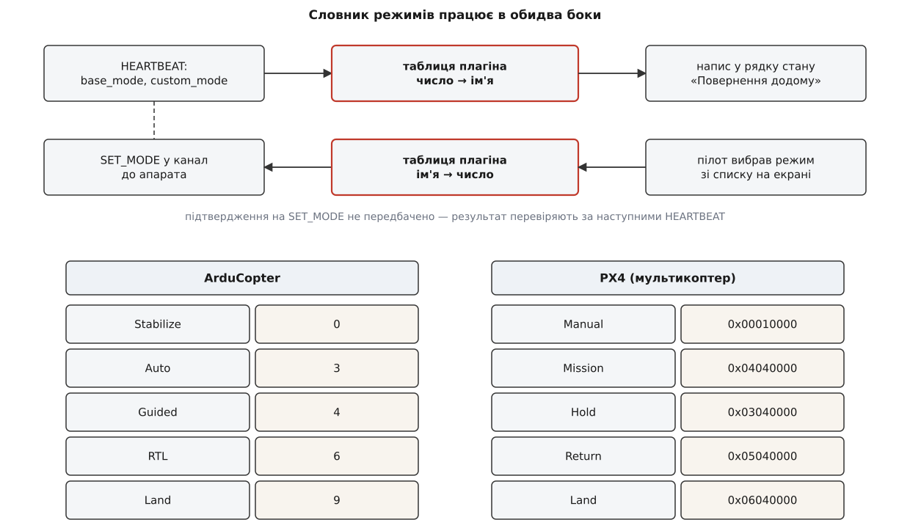
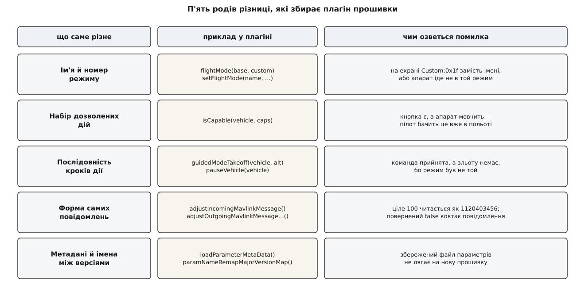

# Плагін прошивки: як станція ховає різницю між автопілотами

<preknowlist>
- [Пакет MAVLink](topic:sys-dron/mavlink-packet) — що таке одне повідомлення телеметрії й з яких полів воно складається.
- [HEARTBEAT](topic:sys-dron/mavlink-heartbeat) — періодичне повідомлення, яким апарат оголошує свій тип, тип автопілота й поточний режим.
- [Команди MAVLink](topic:sys-dron/mavlink-commands) — модель «команда з параметрами й підтвердженням» поверх повідомлень.
- [Поліморфізм і динамічне зв'язування](topic:sf-lang/polymorphism) — виклик через базовий тип потрапляє в перевизначення нащадка.
- [Стратегія](topic:sf-apps/strategy) — винесення змінної частини поведінки в окремий об'єкт, який підставляють ззовні.
- [Фабричний метод і абстрактна фабрика](topic:sf-apps/factory-method) — створення об'єкта потрібного типу без згадки цього типу в місці виклику.
- [Vehicle: модель апарата всередині застосунку](topic:sys-dron/vehicle-object) — об'єкт, що збирає весь стан одного апарата й віддає його інтерфейсу.
</preknowlist>

До станції під'єднано два апарати: квадрокоптер на ArduPilot і літак на PX4. На екрані одна кнопка «Повернення додому», і вона мусить працювати для обох. Здається, що робота тут на десять рядків: надіслати повідомлення `SET_MODE` із потрібним номером режиму. Але потрібний номер у цих двох апаратів різний. У ArduCopter режим RTL — це число 6. У PX4 це `custom_mode`, зібраний з двох байтів: головний режим AUTO у третьому байті й підрежим RTL у четвертому, разом `0x05040000`, тобто 84017152. Одне й те саме бажання пілота, два несумісні числа.

І це найлегша частина. Літак на PX4 уміє «злетіти на місці» за командою станції, а той самий літак на ArduPlane цієї команди не приймає й вимагає кидка з рук або розгону. ArduPilot надсилає значення параметрів, запакувавши будь-який тип у поле дійсного числа, — тож станція, яка чесно прочитає поле за специфікацією, отримає сміття замість цілого. Список команд, які можна покласти в місію, у двох прошивок теж різний, бо різні самі можливості автопілотів.

Отже, різниця між автопілотами пронизує станцію наскрізь: вона є в назвах, у номерах, у наборі дозволених дій, у формі повідомлень і навіть в іменах параметрів, які прошивка перейменовує від версії до версії. Питання одне: де цю різницю зібрати, щоб решта застосунку її не бачила.

## Чому цю різницю не можна вирішити збіркою

Природна перша думка — вирішити все на етапі збірки. Саме так у станції влаштована [кастомізація під виробника](topic:sys-dron/core-plugin): наявність теки власної збірки перемикає макрос, і замість типового ядрового розширення в застосунок підставляється клас виробника. Одна розвилка, вирішена препроцесором, жодного рядка різниці у файлах апстриму.

Для автопілотів цей хід не працює, і причина видна з першого ж речення статті. До однієї станції **одночасно** під'єднані апарати з різними прошивками. Макрос — це властивість бінарника, він однаковий для всієї програми; а тут потрібні дві різні поведінки в один і той самий момент часу, у межах одного вікна. Ба більше: коли застосунок запускається, він ще не знає, з чим має справу. Тип автопілота приїжджає полем `autopilot` у першому ж повідомленні HEARTBEAT — тобто вже після старту, після відкриття каналу, у випадковий момент.

Звідси форма розв'язку задана однозначно. Потрібен **об'єкт**, а не макрос: щось, що можна вибрати під час роботи. Потрібен він **на кожен апарат окремо**, бо апаратів багато й вони різні. І вибиратися він мусить **за тим, що апарат сам про себе сказав**, бо іншого джерела знань немає.

Такий об'єкт у QGroundControl зветься `FirmwarePlugin` — плагін прошивки. Це звичайний спадкоємець `QObject` із кількома десятками віртуальних методів; жодного динамічного завантаження з файлу за цим іменем немає, класи скомпільовані в застосунок. Слово «плагін» (англ. plug-in — «увімкнути в розетку») тут описує роль, а не механізм: це змінна частина, яку підставляють у незмінну.

## Дві осі, за якими добирають об'єкт

Плагін добирають за парою значень із HEARTBEAT: `autopilot` (яка прошивка) і `type` (який апарат). Обидві осі потрібні, і легко побачити чому.

Різниця по першій осі очевидна: PX4 і ArduPilot — окремі проєкти з окремими історіями, у них розходиться геть усе. Але й усередині ArduPilot немає єдиної відповіді. ArduCopter має режим `LOITER` під номером 5, ArduPlane під тим самим номером 5 має `FLY_BY_WIRE_A`. Мультикоптер уміє висіти на місці, літак не вміє за визначенням, а підводний апарат має власний набір режимів, у якому взагалі немає поняття висоти над рельєфом. Тож знання «як розмовляти з цим апаратом» — це знання про пару «прошивка × клас апарата», а не про одну прошивку.

Обидві осі перед вибором звужують. У MAVLink близько двох десятків значень `MAV_AUTOPILOT` і майже сорок значень `MAV_TYPE`; тримати сорок плагінів немає сенсу, бо реальних відмінностей значно менше. Тому станція спершу згортає обидва переліки у власні класи:

```cpp
QGCMAVLink::FirmwareClass_t QGCMAVLink::firmwareClass(MAV_AUTOPILOT autopilot)
{
    if (isPX4FirmwareClass(autopilot)) {
        return FirmwareClassPX4;
    } else if (isArduPilotFirmwareClass(autopilot)) {
        return FirmwareClassArduPilot;
    } else {
        return FirmwareClassGeneric;
    }
}
```

Так само `vehicleClass()` зводить `MAV_TYPE` до жменьки класів: квадро-, гекса-, окто-, три-, співвісний і гелікоптер — усе це один `VehicleClassMultiRotor`; усі шість різновидів VTOL — один `VehicleClassVTOL`; наземний ровер і надводний човен — один `VehicleClassRoverBoat`. Згортання не косметичне: воно фіксує рівень, на якому поведінка справді збігається. Гексакоптер і октокоптер відрізняються числом моторів, але не жодним рішенням станції — тож ділити їх нічого.



*Дві осі з першого повідомлення звужуються до пари класів, за якою й добирається єдиний об'єкт; невідомий автопілот не ламає застосунок, а веде в загальний плагін із порожньою поведінкою.*

Пара класів іде в менеджер плагінів, і той віддає готовий об'єкт:

```cpp
// Vehicle::_commonInit()
_firmwarePlugin = FirmwarePluginManager::instance()
                      ->firmwarePluginForAutopilot(_firmwareType, _vehicleType);
```

Рядок стоїть у спільній частині створення апарата, тобто виконується **один раз за життя об'єкта** `Vehicle`. Тип автопілота після цього не перепитують: він не змінюється, поки апарат той самий, а якщо на тому самому системному номері з'явиться інша прошивка — це вже інший апарат і інший об'єкт. Практичний наслідок такий: усе, що плагін мав налаштувати, він налаштовує в момент під'єднання, а не поступово.

## Реєстр фабрик замість переліку в коді

Найпростіше було б написати всередині менеджера `switch` на три гілки: PX4, ArduPilot, решта. Так не зроблено, і причина та сама, що й у ядрового розширення, — виробник.

Виробник дрона тримає власну збірку станції й може мати власний автопілот, про який апстрим нічого не знає. Якби вибір плагіна був `switch`-ем усередині апстримового файлу, виробникові довелося б правити цей файл — і платити за правку на кожному оновленні. Тому вибір побудовано на **реєстрі**, у який кожна фабрика записується сама:

```cpp
class FirmwarePluginFactory : public QObject
{
public:
    virtual FirmwarePlugin *firmwarePluginForAutopilot(MAV_AUTOPILOT autopilotType,
                                                       MAV_TYPE vehicleType) = 0;
    virtual QList<QGCMAVLink::FirmwareClass_t> supportedFirmwareClasses() const = 0;
    virtual QList<QGCMAVLink::VehicleClass_t> supportedVehicleClasses() const
        { return QGCMAVLink::allVehicleClasses(); }
};

class FirmwarePluginFactoryRegister : public QObject
{
public:
    static FirmwarePluginFactoryRegister *instance();
    void registerPluginFactory(FirmwarePluginFactory *pluginFactory)
        { _factoryList.append(pluginFactory); }
    QList<FirmwarePluginFactory*> pluginFactories() const { return _factoryList; }
private:
    QList<FirmwarePluginFactory*> _factoryList;
};
```

Запис у реєстр робить конструктор базової фабрики, а сама фабрика оголошена глобальним об'єктом:

```cpp
// APMFirmwarePluginFactory.cc
APMFirmwarePluginFactory APMFirmwarePluginFactory_instance(nullptr);
```

Глобальний об'єкт створюється до `main()`, його конструктор кличе `registerPluginFactory()` — і на момент, коли перший апарат озветься, реєстр уже повний. Додати підтримку нового автопілота означає додати ще один такий файл; жодного апстримового рядка правити не треба. Це та сама [точка розширення](topic:sf-apps/plugin-architecture), що й ядрове розширення, тільки відкрита не на етапі збірки, а на етапі реєстрації.

> 🔧 **Навіщо це.** Реєстрація до `main()` має відомий бік: порядок створення глобальних об'єктів у різних одиницях трансляції не визначений стандартом. Тому конструктор фабрики має бути порожній, окрім самої реєстрації, і ні до чого не звертатися — жодних налаштувань, жодного журналу, жодних інших сінглтонів. Порушення дасть падіння, яке відтворюється через раз і залежить від того, чим саме компонувальник склав бінарник.

Далі менеджер шукає фабрику, чий список підтримуваних класів містить потрібний, і просить у неї плагін під конкретну пару. Фабрика ArduPilot розбирає другу вісь сама:

```cpp
FirmwarePlugin *APMFirmwarePluginFactory::firmwarePluginForAutopilot(
        MAV_AUTOPILOT autopilotType, MAV_TYPE vehicleType)
{
    if (autopilotType != MAV_AUTOPILOT_ARDUPILOTMEGA) {
        return nullptr;
    }
    switch (vehicleType) {
    case MAV_TYPE_QUADROTOR:
    case MAV_TYPE_HEXAROTOR:
    case MAV_TYPE_OCTOROTOR:
    case MAV_TYPE_TRICOPTER:
    case MAV_TYPE_COAXIAL:
    case MAV_TYPE_HELICOPTER:
        if (!_arduCopterPluginInstance) {
            _arduCopterPluginInstance = new ArduCopterFirmwarePlugin(this);
        }
        return _arduCopterPluginInstance;
    // …ArduPlane, ArduRover, ArduSub
    default:
        return nullptr;
    }
}
```

Коли жодна фабрика не підійшла, менеджер віддає `GenericFirmwarePlugin` — базовий клас майже без перевизначень. Це чесна реалізація [порожнього об'єкта](topic:sf-apps/null-object): застосунок працює, показує телеметрію, читає параметри, але кнопки керування польотом лишаються неактивними, бо базовий `isCapable()` повертає `false` на будь-яке питання, а базовий `setFlightMode()` пише в журнал «not supported» і повертає `false`. Невідомий автопілот дає обмежену станцію, а не порожній екран і не падіння, — і це важливіше, ніж здається: у полі краще бачити висоту й напругу батареї з чужого апарата, ніж не бачити нічого.

## Один об'єкт на багато апаратів

У наведеному коді фабрики видно деталь, яку легко проґавити: примірник створюється один раз і повертається всім. Три квадрокоптери на ArduPilot, під'єднані до однієї станції, отримають **один і той самий** `ArduCopterFirmwarePlugin`.

Це не економія пам'яті, а рішення про природу об'єкта. Плагін не є моделлю апарата — моделлю апарата є `Vehicle`. Плагін є **знанням про діалект**: таблиця режимів ArduCopter однакова для всіх ArduCopter на світі, і тримати її копію на кожен апарат безглуздо.

З цього рішення прямо випливає форма всіх методів:

```cpp
virtual QStringList flightModes(Vehicle *vehicle) const;
virtual bool isCapable(const Vehicle *vehicle, FirmwareCapabilities capabilities) const;
virtual void guidedModeTakeoff(Vehicle *vehicle, double takeoffAltRel) const;
virtual void initializeVehicle(Vehicle *vehicle);
```

Перший аргумент майже всюди — `Vehicle *`, і половина методів позначена `const`. Плагін нічого не знає про апарат наперед: усе, що йому потрібно знати, він щоразу читає з переданого об'єкта. Це [стратегія](topic:sf-apps/strategy) без власного стану — саме тому її й можна розділяти між апаратами.



*Спільний плагін тримає знання про діалект, а все, що стосується конкретного борту, живе на боці апарата — тому кожен метод і приймає Vehicle першим аргументом.*

Але стан, залежний від конкретного борту, плагінові інколи потрібен. Найпростіший приклад: станція надіслала команду, автопілот відповів `COMMAND_ACK` зі статусом «не підтримую». Це знання дорого здобуте й варте запам'ятовування — питати вдруге безглуздо. Куди його покласти, якщо в самому плагіні полів бути не може?

Відповідь — покласти на апарат. У станції є окремий клас під цю потребу:

```cpp
class FirmwarePluginInstanceData : public QObject
{
public:
    enum class CommandSupportedResult : uint8_t { SUPPORTED = 23, UNSUPPORTED = 24, UNKNOWN = 25 };

    void setCommandSupported(MAV_CMD cmd, CommandSupportedResult status)
        { MAV_CMD_supported[cmd] = status; }
    CommandSupportedResult getCommandSupported(MAV_CMD cmd) const;
private:
    QMap<MAV_CMD, CommandSupportedResult> MAV_CMD_supported;
};
```

Плагін створює такий об'єкт при ініціалізації апарата й віддає його `Vehicle`, а той бере його собі в діти:

```cpp
void Vehicle::setFirmwarePluginInstanceData(FirmwarePluginInstanceData *data)
{
    data->setParent(this);
    _firmwarePluginInstanceData = data;
}
```

Розподіл виходить чистий: **спільний плагін тримає знання, персональні дані лежать на апараті**. Нащадок може розширити `FirmwarePluginInstanceData` власними полями під свою прошивку — і вони так само помруть разом із апаратом, а не переживуть його в спільному об'єкті.

## Найпростіша різниця: одне й те саме має різні номери

Тепер, коли зрозуміло, звідки береться об'єкт і чому він такий формою, можна розібрати, що саме він приховує. Найдрібніша різниця — це словник.

Апарат постійно надсилає HEARTBEAT, у якому лежать `base_mode` і `custom_mode`. Поле `custom_mode` специфікація MAVLink навмисно лишає непрозорим: там ціле число, і що воно означає, знає лише автопілот. Станція мусить перекласти це число в напис на екрані, а натискання кнопки — назад у число. Обидва напрямки перекладу — це плагін:

```cpp
virtual QString flightMode(uint8_t base_mode, uint32_t custom_mode) const;
virtual bool setFlightMode(const QString &flightMode,
                           uint8_t *base_mode, uint32_t *custom_mode) const;
```

Словник тримається таблицею, елемент якої описує один режим:

```cpp
struct FirmwareFlightMode
{
    QString  mode_name    = "Unknown";
    uint8_t  standard_mode = 0;
    uint32_t custom_mode  = UINT32_MAX;
    bool     canBeSet     = false;
    bool     advanced     = false;
    bool     fixedWing    = false;
    bool     multiRotor   = true;
};
```

Поле `canBeSet` окреме від самої наявності режиму, і це змістовна відмінність. PX4 має режим `Takeoff`, у якому апарат перебуває під час автоматичного зльоту; показати цей напис у рядку стану треба, а дати пілотові вибрати його зі списку — ні, бо перехід у нього робиться командою зльоту, а не вибором режиму. Тож таблиця відповідає на два різні питання одразу: «як це називається» і «чи можна це вибрати». Поле `advanced` ховає режим за перемикачем розширеного інтерфейсу — акробатичний `Acro` чи `SystemID` не мають лежати поруч зі звичайними режимами для пілота, що робить перший виліт.

**Умова: пілот натиснув «Повернення додому» на квадрокоптері PX4 і на квадрокоптері ArduPilot.** Станція шукає в таблиці режим із потрібним іменем і збирає з нього поля повідомлення `SET_MODE`:

```
PX4:
  main_mode   = PX4_CUSTOM_MAIN_MODE_AUTO     = 4
  sub_mode    = PX4_CUSTOM_SUB_MODE_AUTO_RTL  = 5
  custom_mode = (sub_mode << 24) | (main_mode << 16)
              = 0x05000000 | 0x00040000
              = 0x05040000 = 84017152
  base_mode   = MAV_MODE_FLAG_CUSTOM_MODE_ENABLED = 1

ArduCopter:
  custom_mode = Mode::Number::RTL = 6
  base_mode   = MAV_MODE_FLAG_CUSTOM_MODE_ENABLED = 1
```

Ті самі два поля, ті самі байти в кадрі, різниця в 84017146 одиниць — і жодна частина застосунку, крім плагіна, про цю різницю не знає. У `base_mode` в обох випадках стоїть єдиний прапорець: він каже автопілотові «дивись у `custom_mode`, стандартні прапорці режиму ігноруй».



*Одна таблиця обслуговує обидва напрямки: показ поточного режиму й вибір нового; решта застосунку оперує лише іменами, а числа існують тільки всередині плагіна.*

Переклад назад має пастку, якої немає в перекладі вперед. `SET_MODE` — це повідомлення, а не команда, тож підтвердження на нього не передбачено: станція надіслала й не знає, чи вийшло. Автопілот міг відмовити, бо не пройшли передпольотні перевірки, або бо режим потребує GPS, якого немає. Тому станція перевіряє результат непрямо — дивиться на наступні HEARTBEAT:

```cpp
// FirmwarePlugin::_setFlightModeAndValidate(), спрощено
for (int attempt = 0; attempt < 3; ++attempt) {
    vehicle->setFlightMode(flightMode);
    // чекаємо приблизно 1.3 с, поки прийде heartbeat із новим custom_mode
    if (_waitForFlightModeChange(vehicle, flightMode)) {
        return true;
    }
}
return false;
```

Три спроби замість однієї не примха: пакет по радіоканалу губиться, і перша спроба цілком може не долетіти. Але й нескінченно повторювати не можна — якщо автопілот свідомо відмовляє, повторення нічого не змінить, а користувач має побачити відмову, а не вічний годинник.

Крім самих імен, плагін віддає ще й **ролі**: `rtlFlightMode()`, `landFlightMode()`, `missionFlightMode()`, `pauseFlightMode()`. Це відповідь на питання «як у цій прошивці зветься режим, у який треба перейти, щоб апарат повернувся додому». Застосунок оперує роллю, плагін дає ім'я, таблиця дає число — три шари, кожен зі своєю мовою.

## Різниця в тому, що апарат узагалі вміє

Словник розв'язує задачу, поки набір дій однаковий. Але він не однаковий. Літак на ArduPlane не має команди зльоту з місця, підводний апарат не має режиму «облетіти точку по колу», а старий ровер не вміє прийняти вказівку «їдь у цю точку» від станції.

Спокуса тут — надіслати команду й подивитися, що буде. Так робити не можна з простої причини: інтерфейс треба показати **до** польоту. Кнопку, яка нічого не робить, пілот побачить у найгіршу мить, і побачить не «функція недоступна», а мовчазне ігнорування. Тож станція мусить знати про вміння **наперед**, до першої команди.

Знання видає той самий плагін, а форма відповіді — бітова маска:

```cpp
enum FirmwareCapabilities {
    SetFlightModeCapability =   1 << 0,
    PauseVehicleCapability =    1 << 1,
    GuidedModeCapability =      1 << 2,
    OrbitModeCapability =       1 << 3,
    TakeoffVehicleCapability =  1 << 4,
    ROIModeCapability =         1 << 5,
    ChangeHeadingCapability =   1 << 6,
    GuidedTakeoffCapability =   1 << 7,
};

virtual bool isCapable(const Vehicle *vehicle, FirmwareCapabilities capabilities) const;
```

Маска, а не окремі методи, — бо питання завжди складене: «чи вміє цей апарат і керований режим, і зліт». Реалізація PX4 будує відповідь із класу апарата: базовий набір є в усіх, наведення на точку інтересу й зміна курсу — тільки в мультикоптера й VTOL, зліт із місця — у мультикоптера, VTOL і літака, але не в ровера.

Друга, тонша межа проходить не між класами апаратів, а **між версіями прошивки**. Прошивка трирічної давнини не знає команди, доданої торік, і про це не написано ніде: `isCapable()` описує клас апарата, а не збірку, що зараз на борту. Тут і працює той самий персональний стан на апараті: станція надсилає команду, отримує `COMMAND_ACK` зі статусом `MAV_RESULT_UNSUPPORTED`, записує це в `FirmwarePluginInstanceData` — і більше не пробує, поки цей борт під'єднаний. Виходить два шари знання про вміння: статичний, узятий із класу апарата, і накопичуваний, здобутий з відповідей конкретного борту.

## Різниця в тому, як попросити зробити те саме

Наступний шар глибший: дія одна, а послідовність кроків різна.

«Злетіти» на PX4 — це надіслати `MAV_CMD_NAV_TAKEOFF` із абсолютною висотою, дочекатися підтвердження й **аж тоді** увімкнути мотори, бо PX4 сам переходить у режим зльоту. «Злетіти» на ArduCopter — це перевести апарат у `GUIDED`, увімкнути мотори й лише потім надіслати `MAV_CMD_NAV_TAKEOFF` із **відносною** висотою, бо ArduCopter приймає команду зльоту тільки з керованого режиму й тільки коли мотори вже крутяться. Порядок кроків протилежний, тип висоти інший, попередній режим інший.

Тому в плагіні лежать не «дані про діалект», а цілі дії:

```cpp
virtual void guidedModeTakeoff(Vehicle *vehicle, double takeoffAltRel) const;
virtual void guidedModeLand(Vehicle *vehicle) const;
virtual void guidedModeRTL(Vehicle *vehicle, bool smartRTL) const;
virtual void guidedModeChangeAltitude(Vehicle *vehicle, double altitudeChange, bool pauseVehicle);
virtual bool guidedModeGotoLocation(Vehicle *vehicle, const QGeoCoordinate &gotoCoord,
                                    double forwardFlightLoiterRadius) const;
virtual void pauseVehicle(Vehicle *vehicle) const;
virtual void startMission(Vehicle *vehicle) const;
```

Інтерфейс кнопки виходить рівно такий, як його бачить пілот: «злетіти на 10 метрів». Що це означає на дроті — не його клопіт.

Показовий приклад того, наскільки далеко може заходити «те саме, але інакше», — пауза. Здавалося б, пауза — це режим: перевести апарат у зависання. У PX4 так і зроблено для мультикоптера, але для літака зависання не існує, а є коло навколо точки, і станція надсилає `MAV_CMD_DO_REPOSITION` із поточними координатами замість зміни режиму. Одна кнопка, три різні дії залежно від того, хто на іншому кінці каналу.

Базовий клас на всі ці методи має єдину реалізацію — показати користувачеві «Guided mode not supported by Vehicle». Це важлива дрібниця: типова поведінка не порожня й не аварійна, вона **повідомляє**. Апарат із незнайомим автопілотом на натискання кнопки відповість зрозумілою відмовою, а не тишею.

> 🔧 **Навіщо це.** Коли треба додати станції нову дію над апаратом, спокуса написати надсилання команди прямо в обробнику кнопки. Ціна виявляється за півроку: приїжджає апарат на іншій прошивці, і команда мовчки не працює, бо там її треба надсилати з іншого режиму. Правило просте — усе, що виражається реченням «попросити апарат зробити X», належить плагінові; в обробнику кнопки лишається виклик одного методу.

## Різниця в самому потоці даних

Найглибший рід різниці — коли прошивка не просто інакше називає речі, а порушує власну специфікацію. Тут словником і набором дій не обійтися: правити доводиться самі повідомлення.

Плагін має два гачки на потоці, і вони несиметричні:

```cpp
virtual bool adjustIncomingMavlinkMessage(Vehicle *vehicle, mavlink_message_t *message);
virtual void adjustOutgoingMavlinkMessageThreadSafe(Vehicle *vehicle, LinkInterface *outgoingLink,
                                                    mavlink_message_t *message);
```

Вхідний повертає `bool` — плагін може не тільки виправити повідомлення на місці, а й **проковтнути** його, повернувши `false`; тоді жоден обробник апарата його не побачить. Вихідний нічого не повертає, бо викидати власне повідомлення нікому не потрібно, зате має в імені `ThreadSafe`: він виконується в [потоці каналу](topic:sys-dron/threading-model), а не в потоці інтерфейсу, тож усе, до чого він торкається, мусить бути захищене.

Найвідоміше застосування — параметри ArduPilot. Специфікація MAVLink каже, що в повідомленні `PARAM_VALUE` поле `param_value` — це чотири байти, у яких лежить значення **того типу**, що вказано в `param_type`; ціле передається як цілі байти. ArduPilot історично робить інакше: він перетворює будь-яке значення на дійсне число й кладе саме його. Ціле 100 приїжджає не як байти `0x64 0x00 0x00 0x00`, а як дійсне `100.0`, тобто байти `0x00 0x00 0xC8 0x42`. Станція, що прочитає їх за специфікацією, отримає ціле 1120403456.

Виправляти це в [менеджері параметрів](topic:sys-dron/parameter-manager) було б помилкою: він мав би знати про ArduPilot, і знання про діалект розповзлося б по застосунку. Тому виправлення сидить у плагіні прошивки: він ловить `PARAM_VALUE`, читає поле як дійсне число, зводить до оголошеного типу й **перезбирає повідомлення** так, ніби воно прийшло за специфікацією. Далі по застосунку тече вже чистий MAVLink. Симетрично, у вихідному гачку `PARAM_SET` псується назад — значення знову пакується як дійсне, бо інакше автопілот його не зрозуміє. Причому лише для тих компонентів, які плагін уже впізнав як ArduPilot: підвіс чи камера на тій самій шині можуть бути стороннього виробництва й дотримуватися специфікації, і псувати їм параметри не можна.

Це [антикорупційний шар](topic:sf-apps/anti-corruption-layer) у чистому вигляді: межа, за якою чужі домовленості перекладаються на власні, а решта системи живе у світі, де всі дотримуються стандарту.

Другий приклад менш очевидний і стосується вже не даних, а поведінки. ArduPilot під час калібрування компаса надсилає підказки на кшталт «Place vehicle nose down» повідомленням `STATUSTEXT` із високою важливістю. Формально це правильно: користувач мусить це побачити. Але станція показує повідомлення високої важливості як попередження поверх екрана — і майстер калібрування, який ті самі підказки вже малює у своєму вікні, потонув би у вискакуванні. Тому плагін розпізнає ці рядки й **знижує їм важливість** до інформаційної. Знання «ці конкретні рядки — не аварія, а хід майстра» специфічне для ArduPilot, тож лежить рівно там, де має.

## Різниця, що змінюється з версією прошивки

Лишається останній шар, і він єдиний, де різниця не між прошивками, а всередині однієї — між її випусками.

Параметрів на борту тисячі, і кожен потребує опису: одиниці, межі, крок, текст підказки, перелік значень. Опис приїхати з борту здебільшого не може — його [метадані](topic:sys-dron/fact-system) станція тримає в себе. Але формат опису в PX4 і ArduPilot різний, тож розбір і завантаження описів теж належить плагінові:

```cpp
ParameterMetaData *loadParameterMetaData(const Vehicle *vehicle);
virtual ParameterMetaData *_createParameterMetaData() { return nullptr; }
```

Ще одна крапля тієї самої роботи — `adjustMetaData()`. Опис факту може залежати від типу апарата: та сама величина в підводного апарата й у мультикоптера має різні межі й різний зміст. Тому після створення апарата станція проганяє всі свої факти крізь плагін:

```cpp
_firmwarePlugin->initializeVehicle(this);
for (const auto &factName : factNames()) {
    _firmwarePlugin->adjustMetaData(vehicleType, getFact(factName)->metaData());
}
```

А тепер найцікавіше. Прошивка живе роками, і параметри в ній **перейменовують**. У ArduCopter 4.0 параметри `TUNE_MIN` і `TUNE_MAX` стали `TUNE_LOW` і `TUNE_HIGH`. У 4.7 відбулося масове перейменування під одиниці СІ: `PSC_VELXY_P` став `PSC_NE_VEL_P`, `WPNAV_ACCEL` став `WP_ACC`, `RTL_ALT` став `RTL_ALT_M`. Апарат із новою прошивкою надішле нові імена, і все буде добре. Проблема виникає, коли користувач відкриває збережений файл параметрів, знятий торік зі старої прошивки, або редагує план офлайн для апарата, якого зараз немає поруч.

Тому плагін тримає ще й **історію імен**:

```cpp
virtual const remapParamNameMajorVersionMap_t &paramNameRemapMajorVersionMap() const;
```

Це відображення «мажорна версія → мінорна версія → старе ім'я → нове ім'я». Знаючи версію прошивки на борту й версію, з якої знято файл, станція прокручує ланцюжок перейменувань і підставляє те ім'я, яке зрозуміє цей конкретний апарат. Знання суто історичне: воно не про те, як прошивка влаштована, а про те, як вона змінювалася. Місце для нього є лише одне — об'єкт, який і так відповідає за все, що специфічне для цієї прошивки.

Останній приклад того самого роду — набір команд місії. Список того, що можна покласти в план, у прошивок різний, і в межах прошивки різний за класом апарата: `MAV_CMD_NAV_VTOL_TAKEOFF` осмислений для VTOL і безглуздий для ровера. Плагін віддає шлях до файлу з описом:

```cpp
QString APMFirmwarePlugin::missionCommandOverrides(QGCMAVLink::VehicleClass_t vehicleClass) const
{
    switch (vehicleClass) {
    case QGCMAVLink::VehicleClassGeneric:    return QStringLiteral(":/json/APM-MavCmdInfoCommon.json");
    case QGCMAVLink::VehicleClassMultiRotor: return QStringLiteral(":/json/APM-MavCmdInfoMultiRotor.json");
    case QGCMAVLink::VehicleClassFixedWing:  return QStringLiteral(":/json/APM-MavCmdInfoFixedWing.json");
    case QGCMAVLink::VehicleClassVTOL:       return QStringLiteral(":/json/APM-MavCmdInfoVTOL.json");
    case QGCMAVLink::VehicleClassSub:        return QStringLiteral(":/json/APM-MavCmdInfoSub.json");
    case QGCMAVLink::VehicleClassRoverBoat:  return QStringLiteral(":/json/APM-MavCmdInfoRover.json");
    }
}
```

Слово «overrides» в імені не випадкове: це не повний перелік, а **накладка**. Дерево команд збирається чотирма шарами — спільний для всіх, шар класу апарата, шар прошивки, шар пари «прошивка + клас апарата», — і кожен наступний править окремі властивості попереднього, а не заміняє його цілком. Так опис команди «летіти до точки» пишеться один раз, а ArduCopter лише уточнює в ньому назву параметра затримки.



*Роди йдуть від найповерхневішого до найглибшого: спершу міняється лише число за іменем, далі набір дозволених дій, потім послідовність кроків, потім самі байти повідомлення й, нарешті, знання про історію прошивки.*

Повний перелік методів із сигнатурами, типовими значеннями базового класу та порядком реєстрації власної фабрики зібрано в [контракті плагіна прошивки](topic:sys-dron/firmware-plugin/api-firmware-plugin.md). Як із цього скласти робочий плагін під власний автопілот — від фабрики й таблиці режимів до перевизначення однієї дії — розібрано в [прикладі власного плагіна прошивки](topic:sys-dron/firmware-plugin/proj-custom-firmware-plugin.md).

## Що плагін робить у мить під'єднання

Окремо стоїть метод, який виконується рівно один раз і задає весь подальший потік даних:

```cpp
virtual void initializeVehicle(Vehicle *vehicle);
```

Різниця тут така сама принципова, як із режимами. PX4 після під'єднання сам надсилає розумний набір потоків із розумними частотами: станція нічого не просить і одразу бачить телеметрію. ArduPilot чекає, поки його попросять: без явного запиту він надсилає майже нічого, і станція показуватиме порожні прилади. Тому плагін ArduPilot у цьому методі виставляє [частоти потоків](topic:sys-dron/stream-rates) за налаштуваннями користувача й додатково просить окремі повідомлення — домашню точку раз на секунду й `EXTENDED_SYS_STATE`, без якого не працює переривання посадки.

Причому просить не один раз. ArduPilot може перезавантажитися в польоті або втратити налаштовані частоти після перепідключення радіоканалу, і тоді потоки просто зникнуть. Плагін стежить за часом останнього отриманого HEARTBEAT, повідомлення про батарею й домашню точку — і якщо чогось немає понад десять секунд, повторює запит. Це поведінка, яку не можна написати в загальному коді станції: для PX4 такий повтор був би зайвим трафіком, а для ArduPilot без нього телеметрія тихо вмирає.

## Де межа: що сюди не належить

Плагінів кастомізації в станції два, і плутати їх коштує дорого.

[Ядрове розширення](topic:sys-dron/core-plugin) описує **застосунок**: логотип, набір екранів, дозволи, кольори, фабрики підсистем. Воно одне на весь бінарник і вибирається на етапі збірки, бо продукт відомий заздалегідь.

Плагін прошивки описує **апарат**: діалект, уміння, дії, правки потоку. Їх стільки, скільки різних пар «прошивка × клас апарата» під'єднано, і вибираються вони під час роботи, бо наперед відомо не буде ніколи.

Правило запам'ятовується одним рядком: що різне між **продуктами** — у ядровому розширенні; що різне між **апаратами** — у плагіні прошивки.

Поруч є ще одна конструкція, яку легко сплутати з плагіном прошивки, — `AutoPilotPlugin`. Плагін прошивки віддає його методом `autopilotPlugin()`, і відповідає той не за діалект, а за **сторінки налаштування**: перелік екранів калібрування, радіо, польотних режимів, живлення. Розділення просте: якщо йдеться про те, як розмовляти з апаратом, — плагін прошивки; якщо про те, які екрани налаштування показати, — плагін автопілота.

## Ціна й куди це рухається

Конструкція чесно розв'язує задачу, і за неї платять.

Плата перша — **дублювання знання**. Таблиця режимів ArduCopter існує двічі: у прошивці, де вона істина, і в станції, де вона копія. Копія відстає. ArduPilot додає режим, станція його не знає, і на екрані з'являється `Custom:0x1f` замість імені. Помилки не буде, падіння не буде — буде тихе незнання, яке треба помітити, знайти й додати вручну. Кожна нова версія прошивки — це потенційна робота в станції.

Плата друга — **поріг для нового автопілота**. Виробник із власною прошивкою або пише свій плагін і тримає власну збірку станції, або отримує загальний плагін, у якому не працює нічого, крім показу телеметрії. Проміжного стану немає.

Плата третя — **невидимість помилок**. Гачок на вхідному потоці, який помилково повернув `false`, мовчки забирає повідомлення; неправильний номер у таблиці режимів переведе апарат не туди, куди просив пілот, і жоден компілятор цього не звірить. Найдорожчі помилки в цій конструкції не падають — вони працюють неправильно.

Саме через цю ціну MAVLink рухається в бік того, щоб апарат сам розповідав про себе. Замість непрозорого `custom_mode` з'явився протокол стандартних режимів: апарат перелічує свої режими повідомленнями `AVAILABLE_MODES`, кожен зі стандартним номером і власним іменем, — і станція більше не мусить тримати таблицю. Слід цього руху видно просто в коді: у `FirmwareFlightMode` поруч із `custom_mode` уже стоїть поле `standard_mode`. Тим самим шляхом іде опис компонентів: [відомості про компонент](topic:sys-dron/component-information) приїжджають із борту замість того, щоб лежати в станції.

Куди все це веде, видно з напрямку. Кожне знання, перенесене з плагіна на борт, зменшує плагін і прибирає з нього шматок дублювання. Якби протокол колись покрив усе — режими, вміння, метадані параметрів, набір команд місії, — плагін прошивки звівся б до порожнього класу, і потреби в ньому не стало б. Але прошивки, що вже літають, ніхто не перепише, а старий апарат має під'єднуватися до нової станції. Тож плагін прошивки лишається тим, чим був від початку: місцем, де зібрано всі накопичені за роки розбіжності, які інакше довелося б розсипати по всьому застосунку.
