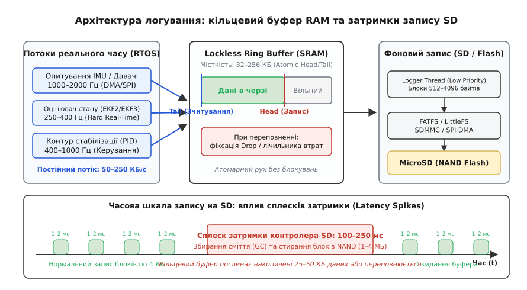
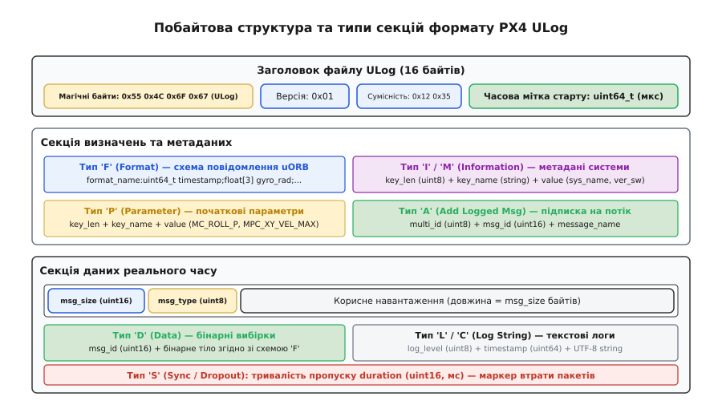
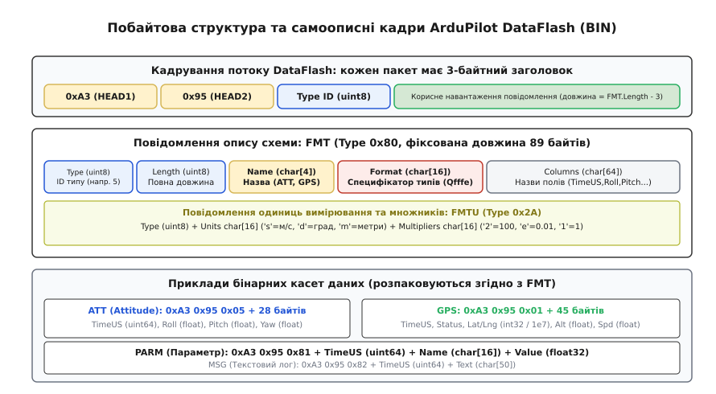
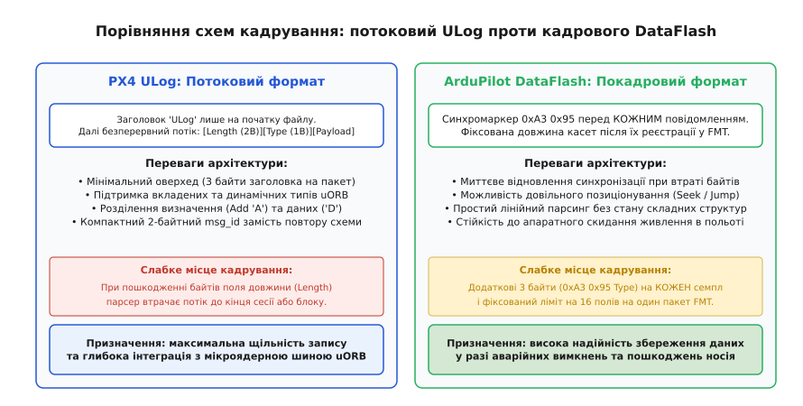

# Формати бортових логів: ULog і DataFlash

<preknowlist>
- [Формування та структура мережевого пакета](root:com-transport/packet-design) — двійкові заголовки, вирівнювання полів, корисне навантаження та виявлення меж блоків даних.
- [Потокова передача телеметрії](root:sys-dron/telemetry-stream) — відмінності між потоками реального часу з обмеженою пропускною здатністю та автономним накопиченням даних.
- [Керування потоком даних](root:com-transport/flow-control) — узгодження швидкості джерела та приймача, кільцеві буфери пам'яті та стратегії обробки переповнення черги.
</preknowlist>

Коли швидкісний безпілотний апарат зазнає раптового зриву стабілізації на швидкості 120 км/год або стикається з високочастотним механічним резонансом рами, стандартний бездротовий телеметричний радіоканал виявляється безсилим для з'ясування причин аварії. Радіомодеми діапазону 433/915 МГц або зв'язок MAVLink поверх каналів керування зазвичай обмежені пропускною здатністю 57600–115200 бод (що дає лише 4–8 КБ/с корисного трафіку) і піддаються завмиранням сигналу та втратам до 10–30% пакетів. Водночас для якісного аналізу контуру орієнтації, роботи розширеного фільтра Калмана (англ. *Extended Kalman Filter*, EKF) та налаштування динамічних режекторних фільтрів (англ. *notch filters*) інженерам потрібні неперервні сирі вибірки тривісних гіроскопів та акселерометрів на частотах 1000–2000 Гц, кутові швидкості на частоті 400 Гц та вихідні команди моторних приводів DShot.

Такий потік даних генерує від 100 до 250 КБ бінарної інформації щосекунди (понад 500 МБ за годину місії) з абсолютними вимогами до цілісності часових міток. Єдиним способом зберегти цей масив є локальне бортове логування (англ. *onboard flight logging*, від лат. *annalis* — літопис) на незалежні накопичувачі Flash або карти MicroSD.

Для розв'язання цього завдання у світі безпілотної авіації склалися два індустріальні стандарти високочастотного збереження польотних даних: формат **ULog** (основний формат екосистеми PX4 Autopilot) та формат **DataFlash / BIN** (традиційний двійковий стандарт екосистеми ArduPilot).

---

## 1. Архітектурне протиріччя: реальний час проти затримок накопичувачів

Головний інженерний виклик підсистеми бортового логування полягає в подоланні фундаментальної невідповідності між детермінізмом контурів керування та стохастичною природою флеш-пам'яті.

Контури кутової стабілізації та оцінювання просторового стану безпілотника працюють у жорсткому реальному часі (англ. *Hard Real-Time*). Завдання опитування IMU, обчислення кроку EKF та генерації сигналів на мотори у таких операційних системах реального часу, як NuttX або ChibiOS, виконуються у високопріоритетних перериваннях і потоках із періодом 1.0–2.5 мс. Затримка будь-якого з цих завдань навіть на 5–10 мілісекунд призводить до втрати контролю над квадрокоптером і неминучої катастрофи.

Водночас запис на зовнішні карти MicroSD за своєю фізичною природою є вкрай нестабільним:
* **Асиметрія сторінок і блоків:** Запис у комірки NAND Flash виконується сторінками по 4–16 КБ, але оновлення раніше записаних даних вимагає попереднього електричного очищення цілого блока стирання (англ. *Erase Block*) розміром 1–4 МБ.
* **Внутрішнє збирання сміття (Garbage Collection):** Коли мікроконтролер карти пам'яті вичерпує резерв заздалегідь підготовлених чистих блоків, він раптово призупиняє прийом даних по шині SDIO/SPI для перенесення валідних сторінок та стирання старого блока.
* **Сплески затримок (Latency Spikes):** У цей момент затримка виконання операції запису окремого 512-байтного сектора стрибає від штатних 1–2 мс до **100–250 мс**.


*Архітектура логування: високочастотні потоки RTOS скидають дані в кільцевий буфер SRAM без блокувань, тоді як фоновий потік вивантажує байти блоками на SD-карту, компенсуючи сплески затримки контролера NAND Flash.*

### 1.1. Механіка безблокувального кільцевого буфера (Lockless Ring Buffer)

Щоб ізолювати критичні потоки керування від затримок шини SDIO, архітектура польотного стека розділяє контур генерації даних і контур запису за допомогою **безблокувального кільцевого буфера** (англ. *lockless circular ring buffer*) в оперативній пам'яті (SRAM).

Потоки сенсорів та регуляторів виступають у ролі виробників (англ. *Producers*). Вони копіюють бінарні кадри в буфер, використовуючи атомарні операції зсуву покажчика `Head` (голова черги). При цьому операція займає частки мікросекунди і ніколи не викликає системних викликів блокування чи очікування м'ютексів.

Фоновий потік логера (англ. *Logger Thread*) виконується з найнижчим пріоритетом у системі (`Low Priority Task`). Він виступає споживачем (англ. *Consumer*): вичитує накопичені дані з покажчика `Tail` (хвіст черги) порціями, кратними розміру сектора файлової системи FATFS (512, 1024 або 4096 байтів), та передає їх апаратному контролеру прямого доступу до пам'яті (англ. *Direct Memory Access*, DMA) для трансляції по 4-бітній шині SDMMC.

### 1.2. Когерентність кешу та апаратна організація DMA на ARM Cortex-M7
На сучасних мікроконтролерах польотних плат (STM32H7, STM32F7) процесорне ядро працює з увімкненим кешем даних першого рівня (L1 D-Cache, 16–32 КБ). Коли потік логера записує байти в буфер, дані спочатку осідають у кеш-рядках процесора і ще не потрапляють у фізичну пам'ять SRAM. Якщо в цей момент запустити апаратний контролер DMA, він вичитає застарілі дані з шини пам'яті, що призведе до запису битих байтів на карту пам'яті.

Щоб запобігти порушенню когерентності, застосовують одну з двох апаратних стратегій:
1. **Явне очищення кешу (Cache Clean):** Перед запуском DMA-транзакції потік логера викликає інструкцію `SCB_CleanDCache_by_Addr()`, примусово виштовхуючи кешовані байти в фізичну пам'ять.
2. **Ненекешовані регіони пам'яті (MPU Non-Cacheable Buffer):** За допомогою модуля захисту пам'яті (англ. *Memory Protection Unit*, MPU) область пам'яті кільцевого буфера (наприклад, блок пам'яті AXI SRAM або SRAM4) конфігурується як `Device Memory` або `Normal Non-Cacheable`. Усі операції запису оминають кеш, гарантуючи миттєву готовність даних для DMA без додаткових затримок процесора.

### 1.3. Стратегії синхронізації файлової системи (fsync)
У файлових системах FAT32 кожен запис даних супроводжується оновленням таблиці розміщення файлів (англ. *File Allocation Table*, FAT) та запису директорії (Directory Entry).
* Якщо викликати системний виклик `fsync()` або функцію FatFs `f_sync()` після кожного збереженого кадру, продуктивність запису падає у 50–100 разів, оскільки накопичувач змушений постійно перезаписувати один і той самий сектор метаданих FAT.
* **Рішення:** Потік логера використовує **ледачу синхронізацію** (англ. *lazy sync*): `fsync()` викликається періодично (наприклад, раз на 1.0–2.0 секунди) або в момент посадки та переведення апарата в стан Disarm. Це гарантує максимальну пропускну здатність шини, мінімізуючи ризик втрати більше ніж однієї секунди даних у разі аварійного відриву акумулятора.

Якщо під час сплеску затримки MicroSD тривалістю 200 мс кільцевий буфер SRAM вичерпує свою місткість, підсистема логування змушена зафіксувати подію переповнення (англ. *drop*) і скинути найстаріші або найменш пріоритетні пакети, про що в лог обов'язково записується спеціальний маркер втрати синхронізації.

> Строге математичне виведення необхідного обсягу кільцевого буфера, розрахунок коефіцієнтів відновлення черги та аналіз надійності за формулою Поллачека-Хінчина викладено у вставці [🧮 Математичний аналіз черг буферизації та оцінка ризику переповнення під час затримок SD-карт](root:sys-dron/flight-log-formats/math-log-buffering.md).

---

## 2. Парадигма самоописного логу (Self-Describing Format)

Історично перші польотні логи являли собою прості дампи пам'яті або бінарні потоки фіксованих структур мови C. Проте зі швидким розвитком безпілотних технологій такий підхід створив кризу сумісності:
* Додавання навіть одного нового поля (наприклад, четвертої осі магнітометра або нового коефіцієнта EKF) повністю змінювало бінарне зміщення всіх наступних полів у структурі.
* Старі діагностичні програми переставали читати логи нових прошивок або, що значно небезпечніше, інтерпретували нові поля зі зміщенням, показуючи хибні значення висоти та швидкості.
* Різні типи апаратів (квадрокоптери, літаки, VTOL, гексакоптери) вимагали принципово різного набору параметрів.

Щоб подолати цю проблему, сучасні формати бортових логів побудовані на принципі **динамічного самоопису** (англ. *self-describing stream*). 

Суть парадигми полягає в тому, що **файл логу містить у собі повну декларацію власної схеми даних**. Перед тим як почати запис сирих числових вибірок датчиків, польотний контролер серіалізує на початку файлу спеціальні керуючі повідомлення. Вони описують назви структур, типи кожного окремого поля (`uint64_t`, `float`, `int16_t`), символьні ідентифікатори стовпчиків, одиниці вимірювання та масштабні коефіцієнти.

Завдяки цьому будь-який сторонній парсер здатен повністю декодувати структуру повідомлень польоту, здійсненого багато років тому, не маючи вихідного коду автопілота чи заголовних файлів відповідної версії прошивки.

---

## 3. Внутрішня двійкова будова формату PX4 ULog

Формат **ULog** був розроблений спільнотою PX4 як офіційний системний формат логування для операційної системи реального часу NuttX. Він тісно інтегрований із внутрішньою мікроядерною шиною публікацій/підписок **uORB** (англ. *Micro Object Request Broker*).

ULog є повністю потоковим форматом, який складається з фіксованого 16-байтного заголовка файлу та неперервного ланцюжка уніфікованих секцій-контейнерів.


*Побайтова структура ULog: 16-байтний заголовок файлу передує неперервному потоку контейнерів [msg_size][msg_type], що поділяються на секції схем ('F'), параметрів ('P'), підписок ('A'), даних ('D') та пропусків ('S').*

### 3.1. Заголовок файлу ULog

Кожен коректний файл ULog обов'язково починається з 16 байтів базової ідентифікації:
* **Байти 0..6 (7 байтів):** Магічна бінарна сигнатура `0x55 0x4C 0x6F 0x67 0x01 0x12 0x35`. Перші 4 байти відповідають ASCII-символам `'U'`, `'L'`, `'o'`, `'g'`, п'ятий байт `0x01` визначає версію стандарту ULog (версія 1), а останні два байти є константою валідації сумісності.
* **Байти 7..14 (8 байтів):** 64-бітне ціле без знака `timestamp` (Little-Endian) — час старту логування в мікросекундах від завантаження системи або за шкалою UTC.
* **Байт 15 (1 байт):** Зарезервований байт `0x00`.

### 3.2. Універсальний контейнер секцій ULog

Після заголовка файлу кожен блок даних загортається в стандартний 3-байтний транспортний фрейм:

```
[msg_size: uint16_t (2 байти)][msg_type: uint8_t (1 байт)][payload: msg_size байтів]
```

Поле `msg_size` вказує довжину корисного навантаження `payload` без урахування 3 байтів заголовка. Однобайтний код `msg_type` визначає функціональний тип секції.

### 3.3. Ключові типи повідомлень ULog

* **Тип `'H'` (`0x48`, Header / Flags):** Передається першим після заголовка файлу. Містить бітові маски сумісності (`incompat_flags` та `compat_flags`). Якщо в `incompat_flags` встановлено біт `0x01`, це сигналізує, що файл містить блоки дозапису (Append), і парсер без підтримки цієї функції не зможе прочитати файл.
* **Тип `'F'` (`0x46`, Format Definition):** Оголошує текстову схему структури топіка uORB. Тіло секції містить рядок формату: `назва_структури:тип1 поле1;тип2 поле2;...`. Наприклад:
  `vehicle_attitude:uint64_t timestamp;float[4] q;float[3] delta_q_reset;`
  Формат ULog дозволяє вкладеність: якщо поле містить тип, раніше оголошений власним повідомленням `'F'`, парсер автоматично розгортає його як підструктуру.
* **Тип `'I'` (`0x49`, Information) та `'M'` (`0x4D`, Multi-Information):** Зберігає системні метадані у вигляді пар «ключ-значення». Секція містить довжину ключа `key_len`, текстовий опис типу й імені (`char[16] ver_sw`, `char[28] sys_name`) та бінарне значення. Повідомлення `'M'` використовується для довгих текстових звітів, розбитих на фрагменти по 255 байтів.
* **Тип `'P'` (`0x50`, Parameter) та `'Q'` (`0x51`, Parameter Default):** Фіксує системні параметри автопілота на момент зльоту (`MC_ROLL_P`, `MPC_XY_VEL_MAX`) та їхні динамічні зміни оператором або алгоритмами автотюнінгу під час польоту.
* **Тип `'A'` (`0x41`, Add Logged Message):** Виконує реєстрацію підписки на потік даних. Повідомлення містить 1 байт `multi_id` (номер екземпляра сенсора: 0 — основний, 1 — резервний), 2 байти числового ідентифікатора `msg_id` та текстову назву структури. Це ключова оптимізація ULog: замість того щоб передавати довгу текстову назву топіка в кожному високочастотному кадрі, система один раз прив'язує його до короткого 2-байтного дескриптора `msg_id`.
* **Тип `'R'` (`0x52`, Remove Logged Message):** Скасовує реєстрацію раніше створеного `msg_id`, звільняючи числовий дескриптор.
* **Тип `'D'` (`0x44`, Data):** Найбільш високочастотне повідомлення у файлі (до 95–98% загального розміру). Складається з 2 байтів `msg_id`, за якими слідують сирі байти структури згідно зі схемою `'F'`.
* **Тип `'L'` (`0x4C`, Log Message) та `'C'` (`0x43`, Tagged Log Message):** Текстовий журнал діагностичних повідомлень (`syslog`). Містить рівень важливості `log_level` (від 0 = Emergency до 7 = Debug), 64-бітну часову мітку та рядок тексту у форматі UTF-8.
* **Тип `'S'` (`0x53`, Sync / Dropout):** Спеціальний маркер втрати пакетів. Містить 2-байтне число `duration` — тривалість інтервалу часу в мілісекундах, протягом якого підсистема логування відкидала кадри через переповнення черги RAM.

### 3.4. Динаміка підписок та профілі логування PX4
Підсистема логування в PX4 підтримує зміну профілів у реальному часі. Коли апарат перебуває на землі в роззброєному стані (Disarmed), потік логера записує дані з мінімальною частотою (наприклад, IMU на 50 Гц замість 2000 Гц), щоб не витрачати ресурс флеш-пам'яті. У момент переведення в режим Arming логер надсилає нові повідомлення `'A'`, підвищуючи частоти сенсорів до максимальних.

> Повну двійкову розмітку полів кожного типу повідомлень ULog, правила роботи з масками прапорців та таблиці кодів помилок зібрано у довіднику [📋 Побайтова специфікація двійкових форматів ULog та DataFlash (BIN)](root:sys-dron/flight-log-formats/api-ulog-dataflash-specs.md).

---

## 4. Внутрішня двійкова будова формату ArduPilot DataFlash (.BIN)

Формат **DataFlash** (файли з розширенням `.BIN`) є основним бінарним форматом польотних контролерів під керуванням ArduPilot (ArduCopter, ArduPlane, ArduRover).

На відміну від ULog, формат DataFlash спроектовано за принципом **жорсткого покадрового кадрування** (англ. *frame-oriented stream*).


*Побайтова структура DataFlash: кожен пакет має 3-байтний заголовок [0xA3][0x95][Type], що дозволяє миттєво відновити синхронізацію при пошкодженні окремих байтів файлу.*

### 4.1. Кадрування касет DataFlash

Кожне двійкове повідомлення DataFlash починається з унікальної 3-байтної преамбули:
* **Байт 0 (`0xA3`, HEAD1):** Перший магічний байт синхронізації (десяткове 163).
* **Байт 1 (`0x95`, HEAD2):** Другий магічний байт синхронізації (десяткове 149).
* **Байт 2 (`Type`, 1 байт):** Числовий код типу повідомлення (`0x00..0xFF`).

Завдяки постійній присутності сигнатури `0xA3 0x95` перед кожним окремим повідомленням парсер DataFlash має унікальну стійкість: при випаданні довільної кількості байтів у пошкодженому файлі декодер просто сканує потік до наступної комбінації `0xA3 0x95` і негайно відновлює розбір наступного кадру.

### 4.2. Схема дескриптора FMT (Format Message)

Самоописність у DataFlash забезпечується спеціальним системним повідомленням **`FMT`** (Type `0x80` = 128), яке має жорстко зафіксовану довжину 89 байтів (включно з 3 байтами преамбули):

:::tabs
```c
// C99 / C11
struct __attribute__((packed)) DataFlash_FMT {
    uint8_t  head1;        // 0xA3
    uint8_t  head2;        // 0x95
    uint8_t  msg_type;     // 0x80 (FMT)
    uint8_t  type;         // Числовий ID типу, який описується цим FMT (1..255)
    uint8_t  length;       // Повна довжина майбутніх повідомлень цього типу в байтах
    char     name[4];      // 4-символьна назва структури ("ATT\0", "GPS\0", "IMU\0")
    char     format[16];   // Рядок символьних кодів типів полів ("Qffff", "Qcccc")
    char     columns[64];  // Назви полів через кому ("TimeUS,Roll,Pitch,Yaw,ErrRP")
};
```
```cpp
// C++20
#include <cstdint>
#include <array>

#pragma pack(push, 1)
struct DataFlash_FMT {
    uint8_t  head1{0xA3};
    uint8_t  head2{0x95};
    uint8_t  msg_type{0x80};
    uint8_t  type{0};
    uint8_t  length{0};
    std::array<char, 4>  name{};
    std::array<char, 16> format{};
    std::array<char, 64> columns{};
};
#pragma pack(pop)
```
:::

Символьні специфікатори типів у полі `format`:
* `'b'` / `'B'` — 8-бітне ціле зі знаком / без знака (`int8_t` / `uint8_t`, 1 байт).
* `'h'` / `'H'` — 16-бітне ціле зі знаком / без знака (`int16_t` / `uint16_t`, 2 байти).
* `'i'` / `'I'` — 32-бітне ціле зі знаком / без знака (`int32_t` / `uint32_t`, 4 байти).
* `'q'` / `'Q'` — 64-бітне ціле зі знаком / без знака (`int64_t` / `uint64_t`, 8 байтів; `'Q'` зазвичай використовується для мікросекундного часу `TimeUS`).
* `'f'` — 32-бітне число з рухомою комою IEEE 754 одинарної точності (`float`, 4 байти).
* `'d'` — 64-бітне число з рухомою комою IEEE 754 подвійної точності (`double`, 8 байтів).
* `'c'` / `'C'` — 16-бітне ціле зі знаком / без знака, помножене на 100 (`значення = int16 / 100.0` градусів для кутів крену й тангажу).
* `'e'` / `'E'` — 32-бітне ціле, помножене на 100.
* `'L'` — 32-бітне ціле для географічних координат (`градуси = int32 / 10000000.0`, масштаб 10⁻⁷).
* `'n'` / `'N'` / `'Z'` — текстові рядки фіксованої довжини 4, 16 або 64 байти.

### 4.3. Одиниці вимірювання та множники: FMTU, UNIT та MULT

Для забезпечення точної інженерної розмірності сучасні версії DataFlash додають повідомлення **`FMTU`** (Type `0x2A`), яке прив'язує до кожного поля зареєстрованого типу символьний код фізичної одиниці вимірювання (наприклад, `'d'` = градуси, `'s'` = м/с, `'m'` = метри, `'r'` = рад/с, `'G'` = Гауси, `'A'` = Ампери, `'v'` = Вольти) та символьний код множника (`'1'` = 1.0, `'2'` = 100.0, `'e'` = 0.01, `'m'` = 0.001).

### 4.4. Архітектура сховища AP_Logger: SD-карта проти впаяної SPI Flash
У прошивках ArduPilot підсистема `AP_Logger` підтримує два альтернативні бекенди запису:
1. **`AP_Logger_File`:** Працює з файловою системою FAT32 на знімній карті MicroSD через інтерфейс SDMMC. Забезпечує практично необмежений обсяг логів (до 32–64 ГБ), але піддається спайкам затримки.
2. **`AP_Logger_Block`:** Застосовується на компактних контролерах без слота SD-карти, де встановлена впаяна мікросхема SPI NOR/NAND Flash (наприклад, Winbond W25Q128 на 16 МБ). Цей бекенд оминає файлову систему FAT, записуючи сирі сектори пам'яті по 4 КБ напряму. Логи індексуються за номерами місій (`Log #1`, `Log #2`), що гарантує детермінований час запису, але вимагає процедури попереднього завантаження через протокол MAVLink FTP після посадки.

### 4.5. Конфігурація бітових масок LOG_BITMASK
В ArduPilot обсяг генерованого трафіку логування тонко налаштовується 32-бітним цілим параметром `LOG_BITMASK`. Кожен окремий біт маски вмикає або вимикає цілу категорію повідомлень:
* `Bit 0 (1):` `ATT` (орієнтація та кути).
* `Bit 1 (2):` `PM` (продуктивність процесора та навантаження RTOS).
* `Bit 2 (4):` `CTUN` (налагодження контуру керування).
* `Bit 3 (8):` `NTUN` (навігаційні контури швидкості).
* `Bit 4 (16):` `RCIN` (вхідні канали радіокерування).
* `Bit 5 (32):` `IMU` (сирі дані гіроскопів та акселерометрів).
* `Bit 6 (64):` `CMD` (команди автономної місії).
* `Bit 7 (128):` `BAT` / `CURRENT` (напруга й струм батареї).
* `Bit 9 (512):` `GPS` (позиція та швидкість).
* `Bit 10 (1024):` `COMPASS` (магнітометр).
* `Bit 15 (32768):` `PID` (внутрішні P, I, D складові регулятора).

Завдяки цьому пілот або інженер може зменшити навантаження на шину логування на слабких процесорах, вимкнувши непотрібні топіки.

---

## 5. Порівняльний аналіз архітектурних рішень

Обидва формати успішно вирішують задачу високочастотного збереження даних, проте мають різні інженерні компроміси.


*Порівняння стратегій кадрування: ULog забезпечує гнучкість вкладених структур та високу щільність даних, тоді як DataFlash гарантує миттєву стійкість до втрати байтів завдяки маркеру 0xA3 0x95.*

| Критерій оцінки | PX4 ULog | ArduPilot DataFlash (.BIN) |
| :--- | :--- | :--- |
| **Архітектурний тип** | Потоковий контейнерний формат | Покадровий касетний формат |
| **Накладні витрати на семпл** | 3 байти (`msg_size` + `msg_type` = 3 B) | 3 байти (`0xA3` + `0x95` + `Type` = 3 B) |
| **Гнучкість типів даних** | Висока (підтримка вкладених структур uORB, масивів довільної розмірності) | Середня (тільки одновимірні пласкі структури до 16 полів у повідомленні) |
| **Стійкість до втрати байтів** | Середня/Низька (пошкодження поля довжини `msg_size` десинхронізує розбір) | Абсолютна (декодер негайно відновлює зв'язок за маркером `0xA3 0x95`) |
| **Можливість довільного Seek**| Вимагає попереднього повного проходу для побудови карти типів | Можливий з будь-якого зміщення після знаходження преамбули `0xA3 0x95` |
| **Фіксація втрати кадрів** | Явне повідомлення `'S'` з тривалістю пропуску в мілісекундах | Непряма (через аналіз розривів у часовій мітці `TimeUS`) |
| **Інтеграція з мікроядром** | Пряма відповідність системній шині uORB | Відповідність внутрішнім структурам C++ класів AP_Logger |

> Повнофункціональну робочу реалізацію бінарних декодерів для обох форматів мовами C та сучасним C++20 наведено у вставці [⚙️ Розробка двійкових парсерів польотних логів: кодеки ULog та DataFlash у C та C++](root:sys-dron/flight-log-formats/proj-flight-log-parser.md).

---

## 6. Практична діагностика, спектральний аналіз FFT та інженерні кейси

Головна мета ведення високочастотних бортових логів полягає в післяпольотній діагностиці складних фізичних процесів та аварійних ситуацій.

### 6.1. Спектральний аналіз вібрацій (FFT Analysis)
Механічні вібрації від обертання гвинтів та моторів передаються через промені рами на чутливі кристали MEMS-гіроскопів. Якщо частота обертання пропелерів (зазвичай 100–350 Гц) збігається з власною резонансною частотою рами або смугою пропускання ПІД-регулятора, виникає неконтрольована автогенерація коливань, яка перегріває мотори та призводить до аварії.

Завдяки наявності в логах сирих даних гіроскопа на частоті 1000–2000 Гц інженери застосовують швидке перетворення Фур'є (англ. *Fast Fourier Transform*, FFT). Спектрограма дозволяє точно визначити гармонійні піки вібрацій та налаштувати програмні гіроскопічні **динамічні режекторні фільтри** (англ. *Dynamic Harmonic Notch Filters*), які вирізають шум моторів у реальному часі за даними телеметрії обертів ESC (DShot RPM Telemetry), зберігаючи контур керування ідеально чистим.

### 6.2. Часова синхронізація гетерогенних джерел (Multi-Clock Domain Alignment)
Під час польоту різні датчики та зовнішні пристрої працюють у власних часових доменах:
1. **Монотонний системний годинник мікроконтролера:** Мікросекундний лічильник `TimeUS` / `hrt_absolute_time()`, який тактується від апаратного таймера процесора.
2. **Абсолютний час GPS (UTC):** Астрономічний час, що надходить від супутників із точністю до наносекунд через апаратний строб переривання PPS (Pulse Per Second).
3. **Годинник бортового комп'ютера (Companion Computer):** UNIX-час мілісекундної точності операційної системи Linux (Raspberry Pi, Nvidia Jetson).
4. **Синхронізація камер (Hot-Shoe Trigger):** Мікросекундні апаратні імпульси зворотного зв'язку затвора камери `CAM`.

Підсистема логування записує регулярні повідомлення часової прив'язки (наприклад, `vehicle_gps_position` у ULog або `GPS` у DataFlash). Це дозволяє післяпольотним парсерам перераховувати локальний час кожного семпла в абсолютний UTC, що критично для геоприв'язки аерофотознімків при фотограмметрії.

### 6.3. Розслідування типових польотних інцидентів (Flight Log Forensics)

Аналіз логів базується на зіставленні декількох взаємопов'язаних часових рядів:

1. **Відмова мотора або регулятора ESC у польоті:**
   * *Симптом у логу:* Один із вихідних каналів мотора у повідомленні `RCOU` раптово стрибає до максимального насичення (`2000 мкс` або `100% DShot`), тоді як протилежний мотор падає до мінімуму.
   * *Фізична причина:* Контур регулювання намагається компенсувати втрату тяги на пошкодженому промені. Помилка орієнтації `Roll/Pitch Error` у повідомленні `ATT` невпинно зростає, після чого слідує різке падіння по осі Z.

2. **Ефект «унітазингу» (Toilet-Bowling) через похибку компаса:**
   * *Симптом у логу:* Апарат у режимі утримання позиції (Loiter/Position) починає описувати кола з наростаючим радіусом.
   * *Фізична причина:* Причиною є невідповідність між курсом компаса (`Yaw`) та курсом руху над землею з супутникового приймача (`GPS Ground Course`). Розбіжність викликає конфлікт у векторі інновацій EKF, змушуючи автопілот прискорюватися по колу для виправлення уявного зсуву.

3. **Вібраційний кліпінг акселерометра (Sensor Clipping):**
   * *Симптом у логу:* У повідомленні `IMU` вибірки прискорення `a_z` упираються в апаратні полиці ±16g або ±32g.
   * *Фізична причина:* Нелінійне насичення MEMS-давача призводить до інтегрального дрейфу вертикальної швидкості в EKF. Автопілот помилково вважає, що апарат падає, і вмикає максимальний газ або навпаки різко скидає тягу.

4. **Просідання напруги та десинхронізація моторів (ESC Desync / Brownout):**
   * *Симптом у логу:* У повідомленні `BAT` напруга акумулятора `Volt` раптово провалюється нижче порогу відсічки (наприклад, з 16.8 В до 11.2 В) під час різкого маневру, супроводжуючись стрибком струму `Curr` понад 120 А та подальшим падінням швидкості обертання одного з моторів (`RPM`).
   * *Фізична причина:* Високий внутрішній опір (ESR) деградованого літій-полімерного акумулятора під піковим навантаженням викликає падіння напруги на силовій шині. Електронні регулятори обертів (ESC) втрачають зворотну ЕРС (BEMF) безколекторного мотора, що призводить до апаратної десинхронізації та миттєвого перекидання апарата.

### 6.4. Екосистема аналітичного програмного забезпечення
Для аналізу логів застосовується спеціалізований інструментарій:
* **PlotJuggler:** Універсальний високопродуктивний візуалізатор часових рядів на C++ та Qt, що підтримує імпорт ULog та DataFlash, швидке накладання графіків, обчислення похідних, інтегралів та спектрів FFT.
* **PX4 Flight Review:** Веб-сервіс для автоматизованої побудови звітів за файлами ULog із 3D-візуалізацією траєкторії, графіками вібрацій, оцінкою якості живлення та навантаження процесора.
* **Mission Planner / ArduPilot Log Viewer:** Комплексні середовища аналізу файлів `.BIN`, що підтримують автоматичний пошук типових помилок (падіння напруги батареї, збої EKF, вібраційний кліпінг датчиків).
* **Бібліотеки `pyulog` та `pymavlink.dfreader`:** Програмні бібліотеки мовою Python для автоматизованої пакетної обробки логів у конвеєрах тестування безпілотних флотів.

---

## 7. Підсумковий синтез

Формати ULog та DataFlash перетворили бортове логування безпілотників із наївного дампу пам'яті на строгу наукову та інженерну дисципліну. 

Поєднання **самоописних бінарних схем**, які забезпечують абсолютну сумісність через десятиліття, та **безблокувальної буферизації в SRAM**, яка захищає критичні контури реального часу від стохастичних пауз накопичувачів Flash, створило надійний фундамент для сучасної автономної авіації. У результаті будь-який політ — від тренувального зависання мікрокоптера до трансконтинентального перельоту автономного БПЛА — залишає повний, математично строгий і доступний для аналізу цифровий відбиток.
