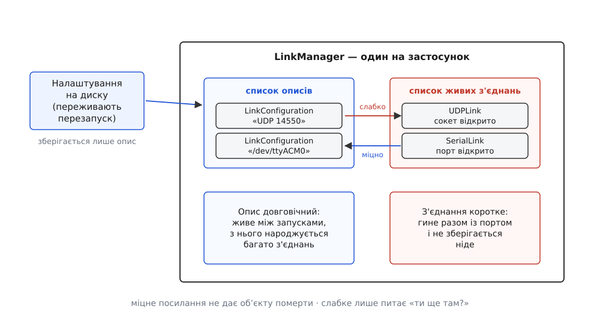
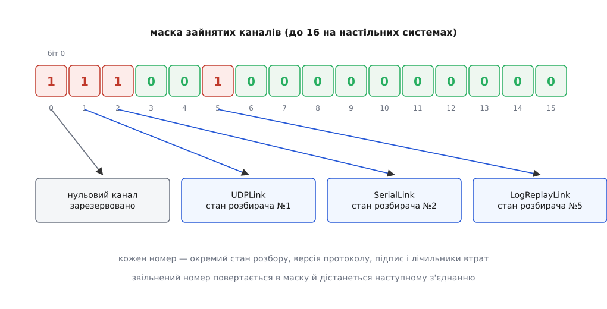
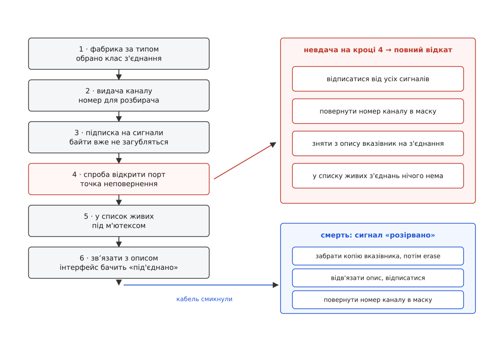

# Менеджер каналів: облік і життєвий цикл з'єднань

<preknowlist>
- [Пакет MAVLink](topic:sys-dron/mavlink-packet) — що таке одне повідомлення телеметрії, з чого воно складається і навіщо йому наскрізний номер.
- [Підрахунок посилань](topic:sf-lang/reference-counting) — спільний вказівник тримає об'єкт живим, поки на нього лишається хоч одне посилання.
- [Слабкі й м'які посилання](topic:sf-lang/weak-references) — посилання, яке не заважає об'єктові померти, і перевірка, чи він іще живий.
- [Потокова безпека](topic:sf-tasks/thread-safety) — що таке гонка за спільними даними і як м'ютекс її прибирає.
- [Цикл подій](topic:sf-tasks/event-loop) — черга, через яку сповіщення доходить до отримувача не миттєво, а трохи згодом.
- [З чого складається застосунок: шари й запуск](topic:sys-dron/app-composition) — у якому порядку станція піднімає свої підсистеми на старті.
</preknowlist>

Оператор втикає політний контролер у USB — і за пару секунд у вікні станції сам собою з'являється апарат, якого щойно не було. Через хвилину він висмикує кабель просто посеред завантаження параметрів. Ще через хвилину вмикає радіомодем на іншому порту, а поруч колега віддає той самий потік по мережі в симулятор. Застосунок не має ні впасти, ні лишити на екрані апарата-привида, ні змішати два потоки байтів в одну кашу.

Усе, що станція знає про апарат, приходить до неї байтами з якогось джерела. Джерел кілька видів: послідовний порт, UDP-сокет, TCP-з'єднання, Bluetooth, ба навіть файл записаного польоту, який відтворюють після посадки. Код у них спільного має мало. Але для карти, для віджетів телеметрії, для редактора місії однаково: їм треба відправити повідомлення й отримати повідомлення, а не знати, чи то дріт, чи ефір.

Сховати відмінність за спільним інтерфейсом — рішення очевидне й дешеве: базовий клас `LinkInterface` з методами «надіслати» й «від'єднатися» та сигналами «прийшли байти», «з'єднався», «розірвалося». Нащадки — `SerialLink`, `UDPLink`, `TCPLink`, `BluetoothLink`, `LogReplayLink`. На цьому проста частина закінчується, і починається те, заради чого існує окремий менеджер.

## Три питання, на які інтерфейс не відповідає

Спільний інтерфейс каже, **що вміє** з'єднання. Він нічого не каже про те, **скільки воно живе** і **хто за нього відповідає**. А саме тут і болить.

**Перше питання — хто володіє об'єктом.** Апарат тримає вказівник на свій канал, бо шле ним команди. Підсистема запису логів тримає той самий канал, бо пише все, що ним пройшло. Користувач тисне «Від'єднати». Хтось має видалити об'єкт — але будь-хто, хто це зробить, залишить іншим мертвий вказівник. Гірше: у цю мить у черзі подій уже може лежати порція байтів, адресована саме цьому об'єктові.

**Друге питання — де живуть налаштування.** З'єднання розірвалося, об'єкт помер. Але «UDP на порту 14550» чи «/dev/ttyACM0 на 115200» — річ, яка має пережити і розрив, і перезапуск застосунку. Отже, опис з'єднання не може лежати всередині з'єднання.

**Третє питання — стан розбору.** Розбирач MAVLink складає повідомлення побайтово й між викликами тримає, де він зараз: чи чекає стартовий байт, чи добирає корисне навантаження, який очікує наступний порядковий номер. Цей стан прив'язаний до **каналу** — цілого числа, яке передають у розбирач разом із байтом. Два джерела в один канал — це два переплетені напівпакети й суцільні помилки контрольної суми. Отже, кожному з'єднанню треба видати свій номер, а номерів скінченна кількість.

Жодне з трьох питань не належить конкретному з'єднанню: усі три — про облік. Об'єкт, який цей облік веде, у QGroundControl зветься `LinkManager` — менеджер каналів (від лат. *manus* — рука, через англ. *manage* — давати раду). Він єдиний на застосунок, живе в `src/Comms/LinkManager.h` і тримає рівно два списки та одну бітову маску. Далі — про те, чому саме такі.

## Опис і живе з'єднання — це дві різні речі

Друге питання розв'язується розділенням на дві сутності, і це розділення тягне за собою решту конструкції.

`LinkConfiguration` — **опис**: ім'я, тип, адреса й порт або ім'я порту й швидкість. Опис довговічний: користувач створив його один раз, і застосунок зберігає його між запусками. `LinkInterface` — **живе з'єднання** за цим описом: сокет відкрито, байти йдуть. Воно коротке й може повторюватися — з одного опису за вечір народиться десяток з'єднань, якщо радіозв'язок нестійкий.

З цього одразу випливає, як вони мають дивитися одне на одного:

```cpp
// LinkInterface: живе з'єднання тримає свій опис МІЦНО
SharedLinkConfigurationPtr _config;

// LinkConfiguration: опис тримає своє з'єднання СЛАБКО
std::weak_ptr<LinkInterface> _link;
LinkInterface *link() const { return _link.lock().get(); }
```

Асиметрія не випадкова. З'єднання без опису безглузде — воно не знає, куди слати; поки воно живе, опис має бути живий, тож посилання міцне. Навпаки — ні: якщо опис триматиме з'єднання міцно, з'єднання не помре ніколи, бо опис не помирає. Тому опис тримає слабке посилання, з якого щоразу питає: «ти ще там?». Заразом розривається цикл: два міцні посилання назустріч одне одному не дали б померти жодному з об'єктів.



*Менеджер тримає два списки. Описи зберігаються на диск і переживають перезапуск; живі з'єднання не зберігаються ніде й гинуть разом із сеансом.*

Зберігаються, до речі, не всі описи. Ті, що застосунок вигадав сам — автопідключений UDP-канал, канал пересилання, відтворення логу, — позначені прапорцем `dynamic` і на диск не потрапляють: наступного разу автопідключення вигадає їх заново, а зайві записи лише засмічували б налаштування. Що саме й де станція зберігає між запусками — окрема тема [збереження налаштувань](topic:sys-dron/settings-persistence).

## Хто володіє живим з'єднанням

Тепер перше питання — про власність. Менеджер тримає живі з'єднання так:

```cpp
QMutex _linksMutex;                      // захищає список від інших потоків
QList<SharedLinkInterfacePtr> _rgLinks;  // shared_ptr<LinkInterface>
```

Список зі **спільних** вказівників, а не з сирих. Різницю видно на конкретній послідовності. Користувач тисне «Від'єднати»; менеджер прибирає з'єднання зі свого списку. Якби список володів об'єктом одноосібно, тут об'єкт і був би знищений. Але в цю саму мить у черзі подій може лежати порція байтів, яку сокет прочитав мілісекундою раніше й відправив розбирачеві разом із вказівником на своє з'єднання. Оброблювач черги візьме цей вказівник — і вчитається у звільнену пам'ять.

Зі спільним вказівником видалення зі списку — це лише **мінус одне посилання**. Об'єкт помре тоді й тільки тоді, коли його відпустить останній тримач. Тому в менеджера є метод із красномовним поясненням у коментарі: «якщо ти збираєшся тримати вказівник на з'єднання у своєму об'єкті — візьми його ось так»:

```cpp
SharedLinkInterfacePtr LinkManager::sharedLinkInterfacePointerForLink(const LinkInterface *link)
{
    QMutexLocker locker(&_linksMutex);
    for (const SharedLinkInterfacePtr &sharedLink : _rgLinks) {
        if (sharedLink.get() == link) {
            return sharedLink;
        }
    }
    return SharedLinkInterfacePtr(nullptr);   // уже від'єднане — це нормально
}
```

Зверніть увагу на повернення порожнього вказівника як на **штатний** результат, а не помилку. Якщо в черзі ще їхала подія про з'єднання, якого вже нема в списку, чесна відповідь — «нема», і кожен, хто питає, зобов'язаний її перевірити. Саме тому по всьому коду апарата видно однаковий візерунок: узяти спільний вказівник, переконатися, що він не порожній, і лише тоді слати.

М'ютекс тут стереже **список**, а не з'єднання. Читає й міняє список кілька потоків: код інтерфейсу, код апарата, потоки самих з'єднань. Тому кожен прохід по `_rgLinks` — під замком, а сам замок тримається якнайкоротше: у `disconnectAll()` менеджер під замком лише **копіює** список, а роз'єднує вже поза ним, бо роз'єднання породжує сигнали, які потягнуть за собою інші дії й інші замки. Де саме в застосунку живуть потоки з'єднань — розібрано в [моделі потоків](topic:sys-dron/threading-model).

## Другий лічильник: скільки апаратів має сенс на каналі

Спільний вказівник відповідає на питання «чи можна зараз звільнити пам'ять». Він не відповідає на інше питання: «чи має це з'єднання ще сенс». Це різні речі, і в `LinkInterface` для другого є окремий лічильник:

```cpp
void addVehicleReference() { ++_vehicleReferenceCount; }
void removeVehicleReference();

void LinkInterface::_connectionRemoved()
{
    if (_vehicleReferenceCount == 0) {
        // апаратів на каналі не лишилося — можна рвати просто зараз
        disconnect();
    }
    // інакше чекаємо: решта апаратів іще розмовляє
}
```

Через один фізичний канал може розмовляти кілька апаратів, і навпаки — один апарат може бути видний одразу кількома каналами (наприклад, коротким USB і довгим радіо як резервом). Коли апарат з'являється, він додає одиницю до лічильника свого каналу; коли зникає — віднімає. Щойно лічильник упав до нуля, канал сам себе роз'єднує: тримати відкритий порт, на якому ніхто не озивається, нема сенсу.

Так виходить два незалежні лічильники на один об'єкт: **лічильник посилань** спільного вказівника вирішує, коли звільнити пам'ять, а **лічильник апаратів** — коли розірвати з'єднання. Плутати їх не можна: канал може лишатися відкритим із єдиним посиланням (його тримає лише список менеджера) і навпаки — бути вже розірваним, поки на нього ще є посилання з черги подій. Як апарат вибирає між кількома своїми каналами головний, описано в темі [кілька апаратів в одному застосунку](topic:sys-dron/multi-vehicle).

## Канал MAVLink — скінченний ресурс

Лишилося третє питання. Розбирач MAVLink із бібліотеки на C влаштований так, що весь свій проміжний стан тримає в статичних масивах, індексованих номером каналу:

```cpp
const uint8_t framing = mavlink_parse_char(mavlinkChannel, byte, &message, &status);
```

Стан каналу — це не лише «де ми посеред пакета». Там-таки лежить обрана версія протоколу, там висить [підпис повідомлень](topic:sys-dron/mavlink-v2-signing), якщо його ввімкнено, і туди ж прив'язані лічильники, з яких станція рахує відсоток утрат. Два джерела в один номер — і всі чотири речі зіпсуються одночасно.

Кількість каналів у бібліотеці фіксована на етапі збірки: на настільних системах — до 16, на решті — 4. Тобто це справжній обмежений ресурс, який треба видавати й повертати. Менеджер робить це найдешевшим можливим способом — бітовою маскою, де одиниця означає «зайнято»:

```cpp
uint32_t _mavlinkChannelsUsedBitMask = 1;   // нульовий канал зайнято ще до старту
```

Маска стартує не з нуля: нульовий канал позначений зайнятим від самого початку й жодному з'єднанню не дістається. Це давня домовленість самого коду, і причину тут виводити нема з чого — важливо лише, що доступних каналів на один менше, ніж дала б бібліотека, і при десятку з'єднань це вже відчутно. Механіку видачі — пошук першого вільного біта, скидання стану каналу перед видачею, повернення й типові пастки подвійного звільнення — розібрано окремо у [видачі каналів бітовою маскою](topic:sys-dron/link-manager/proj-channel-allocator.md).



*Номер каналу — єдине, що зв'язує з'єднання з його станом усередині розбирача. Звільнений номер повертається в маску і згодом дістанеться іншому з'єднанню.*

> 🔧 **Навіщо це.** Коли станція показує дивні втрати пакетів або скаче відсоток збоїв, перше, що варто перевірити, — чи не сидять два джерела на одному каналі. Класичний спосіб дійти до цього — власна збірка, у якій код відкриває сокет повз менеджер: канал не виділено, номер лишається невизначеним, байти йдуть у чужий стан. Правило просте: усе, що приносить байти MAVLink, має народжуватися через менеджер, інакше воно не отримає власного каналу.

## Народження з'єднання: чому саме такий порядок

Тепер видно, що має статися при під'єднанні, і — головне — в якому порядку. Ось повний шлях, зведений до суті:

```cpp
bool LinkManager::createConnectedLink(SharedLinkConfigurationPtr &config)
{
    config->setSuppressAutoReconnect(false);

    SharedLinkInterfacePtr link = nullptr;
    switch (config->type()) {                       // 1. фабрика за типом опису
    case LinkConfiguration::TypeSerial: link = std::make_shared<SerialLink>(config); break;
    case LinkConfiguration::TypeUdp:    link = std::make_shared<UDPLink>(config);    break;
    case LinkConfiguration::TypeTcp:    link = std::make_shared<TCPLink>(config);    break;
    // ... Bluetooth, відтворення логу, тестовий канал
    }
    if (!link) { return false; }

    if (!link->_allocateMavlinkChannel()) {         // 2. канал — ДО з'єднання
        return false;
    }

    // 3. підписатися на сигнали, поки з'єднання ще не потекло
    connect(link.get(), &LinkInterface::bytesReceived, MAVLinkProtocol::instance(), &MAVLinkProtocol::receiveBytes);
    connect(link.get(), &LinkInterface::disconnected,  this, &LinkManager::_linkDisconnected);
    // ... bytesSent, connected, communicationError

    MAVLinkProtocol::instance()->resetMetadataForLink(link.get());

    if (!link->_connect()) {                        // 4. спроба відкрити порт чи сокет
        // повний відкат: відписатися, повернути канал, забути про з'єднання
        disconnect(link.get(), &LinkInterface::bytesReceived, MAVLinkProtocol::instance(), &MAVLinkProtocol::receiveBytes);
        disconnect(link.get(), &LinkInterface::disconnected,  this, &LinkManager::_linkDisconnected);
        // ... решта підписок
        link->_freeMavlinkChannel();
        config->setLink(nullptr);
        return false;
    }

    {                                               // 5. лише тепер — у список
        QMutexLocker locker(&_linksMutex);
        _rgLinks.append(link);
    }
    config->setLink(link);                          // 6. і зв'язати з описом
    return true;
}
```

Кожен крок стоїть на своєму місці не випадково.

**Фабрика за типом** — єдине місце в усьому застосунку, де вибирають конкретний клас з'єднання. Далі його ніхто не розрізняє: чи то серійний порт, чи відтворення записаного польоту, для решти коду це однаковий `LinkInterface`. Завдяки цьому [відтворення логу](topic:sys-dron/telemetry-logging) працює через ті самі підсистеми, що й живий політ, — і саме тому конструктор `LinkInterface` захищений, а створити з'єднання може лише менеджер. Про самі різновиди — у темі [типи каналів](topic:sys-dron/link-types).

**Канал видають до спроби з'єднатися**, бо перший же байт після відкриття порту вже піде в розбирач і мусить застати готовий номер. Порядок «спершу відкрити, потім видати» лишив би вузьке вікно, у якому байти йдуть у невизначений канал.

**На сигнали підписуються теж до з'єднання** — з тієї самої причини: сокет може віддати дані вже в межах виклику `_connect()`, і якщо підписка спізниться, ці дані просто зникнуть.

**У список з'єднання потрапляє лише після успіху.** Це прибирає цілий клас неприємностей: у `_rgLinks` ніколи не лежить об'єкт, який насправді нікуди не під'єднаний. Ціна — обов'язковий відкат на невдачі, і відкат мусить бути повний: відписатися від сигналів, **повернути канал** (інакше кожна невдала спроба з'їдала б по одному з п'ятнадцяти) і зняти з опису вказівник на з'єднання.

**Зв'язок з описом — останній крок**, бо саме він робить з'єднання видимим для інтерфейсу: властивість `link` в описі оживає, і кнопка в списку каналів перемикається на «під'єднано».



*Шлях народження має точку неповернення — успішний `_connect()`. До неї будь-яка невдача згортає все зроблене; після неї з'єднання існує для всього застосунку.*

## Смерть з'єднання

Помирає з'єднання не за командою, а за **фактом**: хтось смикнув кабель, сокет закрився, апарат вимкнувся, файл логу дограв до кінця. Тому шлях смерті починається не з виклику, а з сигналу `disconnected`, який з'єднання випускає саме:

```cpp
void LinkManager::_linkDisconnected()
{
    LinkInterface *const link = qobject_cast<LinkInterface*>(sender());
    if (!link) { return; }

    SharedLinkInterfacePtr linkToCleanup;
    {
        QMutexLocker locker(&_linksMutex);
        for (auto it = _rgLinks.begin(); it != _rgLinks.end(); ++it) {
            if (it->get() == link) {
                linkToCleanup = *it;      // ⚠️ забрати копію ПЕРЕД видаленням зі списку
                _rgLinks.erase(it);
                break;
            }
        }
    }
    if (!linkToCleanup) { return; }       // уже прибрано — це не помилка

    // ... відв'язати опис, відписатися від сигналів
    link->_freeMavlinkChannel();
}
```

Тут важлива саме та строчка, що виглядає зайвою: локальна копія спільного вказівника, зроблена **перед** видаленням елемента зі списку. Без неї список міг би тримати останнє посилання, `erase` знищив би об'єкт негайно — і решта методу працювала б із мертвим вказівником, включно зі звільненням каналу. Копія тримає об'єкт живим до кінця прибирання, а помирає він, коли з методу вийде остання локальна змінна.

Далі — те саме, що й у відкаті, лише в зворотному порядку: опис відв'язують від з'єднання, сигнали від'єднують, канал повертають у маску. І окремо варто помітити, що метод спокійно переживає повторний виклик: якщо з'єднання вже прибрали, у списку його не знайдуть, і метод просто вийде. Асинхронна доставка сигналів робить такий подвійний виклик буденністю, а не аварією.

## Чому кнопка «Від'єднати» потребувала окремого прапорця

Опис із прапорцем «автопідключення» станція піднімає сама. Раз на секунду вона перевіряє, чи не впав такий канал, і піднімає його заново. Через це проста кнопка «Від'єднати» без додаткової умови не працює зовсім: користувач рве канал, а за секунду той оживає. Звідси окремий прапорець на описі:

```cpp
void LinkManager::disconnectLink(LinkInterface *link)
{
    const SharedLinkConfigurationPtr config = link->linkConfiguration();
    if (config) {
        config->setSuppressAutoReconnect(true);   // це рішення людини, не збій
    }
    link->disconnect();
}
```

Прапорець тримається до наступного явного під'єднання: `createConnectedLink` першою ж дією його скидає. Так розділяються дві причини розриву — **збій**, після якого треба перепідключатися, і **воля користувача**, після якої не треба.

Друга умова того ж циклу — не бити в мертвий вузол щосекунди. Опис веде власну [витримку між спробами](topic:sf-distributed/retries-backoff), що подвоюється:

```
базова витримка = 1000 мс
затримка(n)     = min(1000 · 2ⁿ, 5000)     n — число невдалих спроб поспіль

n=0 → 1000 мс     n=1 → 2000 мс     n=2 → 4000 мс     n≥3 → 5000 мс
```

Лічильник невдач скидається не за фактом з'єднання, а лише якщо канал протримався **щонайменше дві секунди**. Інакше з'єднання, яке щоразу відвалюється через півсекунди, вважалося б успішним, і застосунок довбав би порт у повну силу без кінця.

Є й третій прапорець, який легко проґавити: перепідключати автоканал дозволено лише тоді, коли його вже **запускали в цьому сеансі** — або на старті застосунку, або натисканням користувача. Свіжо доданий опис із галочкою «автопідключення» не полізе на зв'язок відразу, а дочекається наступного запуску. Це рятує від несподіванки, коли людина щойно набирає адресу в діалозі, а станція вже кудись стукає.

## Секундний прохід автопідключення

Автопідключення побудоване не на подіях від системи, а на **опитуванні**: таймер раз на секунду виконує повний прохід. Вибір між [опитуванням і подією](topic:sf-tasks/polling-vs-events) тут вирішує переносність — сповіщення про появу пристрою в трьох цільових системах виглядають зовсім по-різному, а перебір списку портів однаковий скрізь і коштує дрібницю.

Один прохід робить чотири речі: додає, якщо треба, стандартний UDP-канал; додає канал пересилання; перепідключає ті автоканали, що впали й дочекалися своєї витримки; перебирає послідовні порти.

Перебір портів — найцікавіша частина, бо там правильна поведінка не виводиться з першого міркування. Наївна логіка «побачив плату — з'єднуйся» ламається одразу на кількох реальних дрібницях.

**Плату видно раніше, ніж вона готова.** Одразу після ввімкнення політний контролер кілька секунд сидить у завантажувачі (англ. *bootloader*) і як MAVLink-пристрій ще не відповідає. Надійно відрізнити завантажувач від прошивки на всіх системах не виходить, тому станція чинить простіше: порт, побачений уперше, потрапляє до списку очікування, і з'єднання пробують лише на наступних проходах. На Linux і macOS витримка — секунда, у Windows — шість, бо там перехід від завантажувача до прошивки помітно повільніший.

**Одна плата може дати два порти.** Багато контролерів — складені USB-пристрої, у яких перший порт віддає MAVLink, а другий зайнятий чимось іншим. Обидва порти прийшли б від одного [пристрою на шині USB](topic:com-devices/usb-device-basics) з однаковими ідентифікаторами виробника й моделі та однаковим серійним номером — за цією трійкою другий порт і відсіюють, лишаючи перший.

**Не все, що втикають, є апаратом.** Розпізнаний тип плати визначає, що з нею робити: політний контролер отримує послідовний канал на 115200 бод, радіомодем SiK — на 57600, а RTK-приймач узагалі не стає каналом MAVLink і йде в підсистему супутникових поправок. Так само окремо обробляють приймач із потоком NMEA — його байти йдуть у менеджер позиції як координати самої станції, а не апарата.

Кожен опис, народжений автопідключенням, позначається як динамічний і на диск не потрапляє: наступного разу той самий прохід створить його заново з того, що реально встромлено.

## З'єднання, за яким нема апарата

Абстракція каналу виявилася ширшою за «спосіб поговорити з дроном», і це видно з двох випадків.

Перший — **пересилання**. Якщо в налаштуваннях увімкнено віддавати трафік назовні, менеджер створює звичайний UDP-канал із позначкою «пересилання» на заданий вузол. Апарата на тому кінці нема й не буде; канал існує, щоб копія потоку йшла в сторонню програму. Куди саме прямує кожне повідомлення й чому пересилання не робиться простим «слати все всім» — розібрано в [маршрутизації за sysid і compid](topic:sys-dron/message-routing).

Другий — **відтворення записаного польоту**. Файл логу підставляється тим самим `createConnectedLink` і стає повноцінним з'єднанням зі своїм каналом MAVLink. Для карти, приладів і інспектора повідомлень різниці з живим польотом нема взагалі — вони й не дізнаються, що байти прийшли з диска, а не з ефіру.

Обидва випадки — наслідок того самого рішення: менеджер обліковує **канали**, а не апарати. Апарати з'являються шаром вище, коли з каналу приходить перший пульс серця з невідомим ідентифікатором системи, і живуть за власними правилами, описаними в темі [Vehicle: модель апарата](topic:sys-dron/vehicle-object).

## Що з цього бачить інтерфейс

Список каналів у налаштуваннях показує **описи**, а не з'єднання, — і це знову наслідок розділення двох сутностей. Редагування опису йде через тимчасову копію: діалог править копію, і лише «Гаразд» переносить її вміст в оригінал і зберігає список на диск; «Скасувати» просто видаляє копію. Так напівзаповнений діалог ніколи не псує робочий опис.

Одна деталь тут неочевидна. Ознака «канал активний» для інтерфейсу — не просто «з'єднання існує»:

```cpp
bool linkActive() const {
    return (link() != nullptr) || (_autoConnect && _autoConnectStarted && !_suppressAutoReconnect);
}
```

Для автоканалу вона лишається правдивою і в проміжках між спробами перепідключення. Інакше при поганому зв'язку кнопка блимала б туди-сюди щосекунди, показуючи технічну правду й повідомляючи людині рівно нічого. Тут свідомо обрано корисніше значення: «станція вважає цей канал своїм і працює над ним», а не «сокет відкритий саме цієї мілісекунди».

Повний перелік того, що менеджер віддає назовні — методи, доступні з інтерфейсу, методи для коду підсистем і властивості, на які підписується список каналів, — зібрано в [контракті менеджера каналів](topic:sys-dron/link-manager/api-linkmanager.md).

## Вимкнення застосунку

Останній шматок життєвого циклу — той, який найлегше зробити неправильно:

```cpp
void LinkManager::shutdown()
{
    setConnectionsSuspended(tr("Shutdown"));   // 1. заборонити нові з'єднання
    disconnectAll();                           // 2. розірвати наявні

    // 3. дочекатися, поки зникнуть усі апарати
    while (MultiVehicleManager::instance()->vehicles()->count()) {
        QCoreApplication::processEvents(QEventLoop::ExcludeUserInputEvents);
    }
}
```

Заборона нових з'єднань іде **першою** — інакше секундний таймер автопідключення встиг би підняти назад щойно розірваний канал, і вихід перетворився б на перегони. Далі — розрив усіх каналів. А потім найцікавіше: замість того щоб одразу вийти, застосунок **крутить чергу подій**, доки не зникне останній апарат.

Причина в тому, що смерть апарата асинхронна: канал розірвався, апарат утратив останнє з'єднання, випустив сигнал, і його справжнє знищення відкладено до обробки цього сигналу. Якби застосунок вийшов негайно, ці події ніхто б не обробив, а деструктори не відпрацювали б у правильному порядку. Прокручування черги дає всім відкладеним подіям дійти до адресатів — і лише тоді станція справді гасне.

---

Менеджер каналів не передає жодного байта. Усі байти проходять повз нього — від сокета прямо в розбирач, від апарата прямо в сокет. Він веде бухгалтерію: які описи існують, які з'єднання живі зараз, який номер каналу за ким закріплено, скільки апаратів іще має сенс на кожному каналі. Саме тому в ньому так мало логіки протоколу й так багато лічильників, прапорців і порядку кроків. З'єднання не знає, скільки йому лишилося жити; це знає тільки той, хто рахує.
