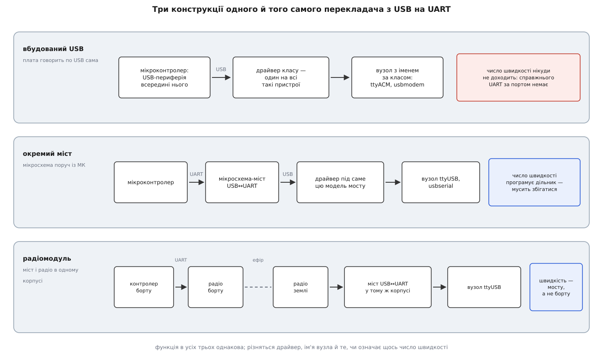
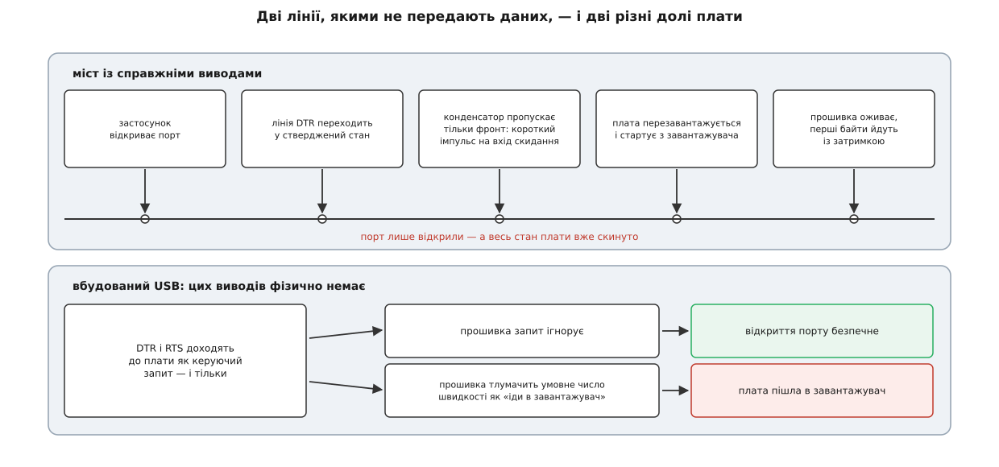
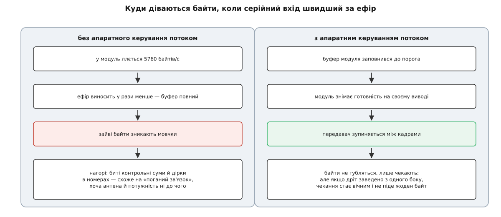

# 🔌 Перекладачі між платою й портом: вбудований USB, окремий міст, радіомодуль

Між виводами плати й тим вузлом системи, який станція відкриває як «серійний порт», завжди стоїть перекладач з USB на UART — і зроблений він буває трьома різними способами. Розрізняти їх варто не з цікавості: від конструкції залежить, чи означає щось число швидкості, чи перезавантажується плата від самого факту відкриття порту, чи зникне вузол при скиданні борту й чому одна плата з'являється в системі під одним іменем, а сусідня — під іншим.

Симптоми, які ця конструкція породжує, збивають з пантелику тим, що виглядають як несправність зв'язку. Порт відкрився, лічильник байтів стоїть на нулі. Плата раптом «перезавантажилася сама» рівно в момент під'єднання. Швидкість виставили правильно — сміття; виставили навмання неправильну — усе працює. Порт зайнятий, хоча жодної програми не запущено. Кожен із цих випадків має точну причину в тому шматку апаратури, якого не видно ні в діалозі станції, ні в списку портів.

## Три конструкції, одна функція

Почнімо з питання, яке пояснює всю решту: навіщо взагалі перекладати USB на UART, якщо можна було б обійтися чимось одним?

Річ у ціні на боці мікроконтролера. Асинхронний послідовний обмін коштує два виводи, зсувний регістр і дільник частоти — периферія настільки дешева, що є практично в кожному мікроконтролері, навіть найдрібнішому ([асинхронний послідовний обмін](root:com-devices/async-serial): старт-біт, вісім бітів даних, стоп-біт, спільного тактового сигналу немає — кожна сторона рахує час своїм годинником). USB коштує незрівнянно більше: диференційна пара з контрольованим опором, тактовий генератор із похибкою в частки відсотка, а головне — цілий протокольний стек із дескрипторами, адресацією й кінцевими точками ([енумерація USB](root:com-devices/usb-enumeration): пристрій, щойно з'явившись на шині, мусить відповісти на низку запитів і розповісти про себе все). Комп'ютер, зі свого боку, вже давно не має ні виводів UART, ні відповідного роз'єму.

Тому в ланцюг лягає перекладач. Питання лише в тому, де саме він фізично сидить.


*Функція скрізь однакова — перекласти пакети USB на потік байтів і назад. Різниця в тому, чи є за віртуальним портом справжній UART: від цього залежить і драйвер, і ім'я вузла, і чи має значення виставлена швидкість.*

**Вбудований USB.** Сучасний мікроконтролер середнього класу має USB-периферію просто в кристалі. Прошивка оголошує себе пристроєм класу комунікаційних — того самого класу, під яким колись описували модеми, — і система бачить віртуальний послідовний порт. Ніякого UART у цьому ланцюгу немає взагалі: байти йдуть шиною USB від коду прошивки прямо до драйвера ([класи USB](root:com-devices/usb-device-classes): пристрій сам оголошує клас у дескрипторі, і система підбирає універсальний драйвер, не знаючи ні виробника, ні моделі).

**Окремий міст.** На платі поруч із головним мікроконтролером стоїть спеціалізована мікросхема: з одного боку в неї USB, з другого — справжній UART, який дротами на платі йде до виводів контролера. Тут перекладач фізичний, і UART теж фізичний.

**Радіомодуль.** Той самий міст, тільки схований в одному корпусі з радіочастиною. З боку комп'ютера це рівно попередній випадок; але за мостом стоїть не мікроконтролер, а передавач, а ще далі — ефір і дзеркальний модуль на борту. Кожен стрибок у цьому ланцюгу має власний темп, і жоден із них не збігається з тим, що видно з комп'ютера.

## Чому одна плата — це ttyACM, а інша — ttyUSB

Тепер найпоширеніша плутанина. Буква в імені вузла — це не марка пристрою, не швидкість і не «якість» з'єднання. Це відповідь на одне-єдине запитання: **яким драйвером система з ним розмовляє**.

Пристрій класу комунікаційних розмовляє за писаним стандартом. Він каже про себе «я такого-то класу», і система бере узагальнений драйвер, який однаково працює з будь-яким таким пристроєм будь-якого виробника. Ім'я вузла походить від назви цього класу: у системах на ядрі Linux — `ttyACM0`, `ttyACM1` і далі; на macOS — `cu.usbmodem…`; у Windows пристрій підхоплює вбудований драйвер і стає черговим `COM`-портом без установки чогось стороннього.

Мікросхема-міст стандарту не має. Кожен виробник вигадав власний спосіб класти байти в масові передачі USB і власний набір керуючих запитів на кшталт «постав ось таку швидкість». Тому системі потрібен драйвер, написаний саме під цю модель; усі такі драйвери зібрані в окрему підсистему послідовних USB-пристроїв, і вузли, які вони створюють, іменуються `ttyUSB0`, `ttyUSB1`, а на macOS — `cu.usbserial…`. Раніше під кожну таку мікросхему доводилося ставити драйвер від виробника вручну; тепер поширені моделі приїжджають у складі системи, але окремість гілки нікуди не поділася.

Звідси й практичне читання списку портів. Побачили `ttyACM` — за портом майже напевно сама плата з вбудованим USB. Побачили `ttyUSB` — між вами й платою є ще одна мікросхема, а часто ще й радіоканал. Це перше, що варто відзначити, ще нічого не відкриваючи.

Є й підступний проміжний випадок, який ламає просте правило: **міст, зроблений на мікроконтролері**. Такий пристрій оголошується класом комунікаційних — тож дістає ім'я `ttyACM`, — але за ним таки стоїть справжній апаратний UART, який іде в дроти. Тому надійне формулювання правила звучить не «дивись на букву», а «дивись, чи є за віртуальним портом фізичний UART». Буква лише підказує відповідь, і зазвичай не бреше.

> 🔧 **Навіщо це.** Ім'я вузла — єдине, що ви бачите до під'єднання, і воно вже несе половину діагнозу. Плата, що прийшла як `ttyACM`, живиться від того ж кабелю, скидається разом із ним і зникає зі списку при кожному перезавантаженні прошивки. Радіомодуль, що прийшов як `ttyUSB`, живе на шині незалежно від того, що коїться на борту, і зі списку не зникає ніколи — навіть коли на іншому кінці ефіру вже нікого немає. Дві протилежні поведінки, і розрізняє їх один символ у назві.

## Число швидкості: коли воно значить усе, а коли нічого

Для мосту швидкість — це справжня фізична величина. Керуючий запит із застосунку доходить до мікросхеми й програмує дільник її тактового генератора; від отриманої частоти залежить, коли саме приймач братиме вибірку кожного біта.

**Умова.** Тактова частота вузла UART — 24 МГц, потрібно 57600 бодів, приймач бере вибірку 16 разів на біт.

```
дільник   = f / (16 · швидкість) = 24 000 000 / (16 · 57600) = 26.04
регістр цілий                    → 26
фактично  = 24 000 000 / (16 · 26)                           = 57 692 бод
похибка   = (57 692 − 57 600) / 57 600                       = +0.16 %
```

Запас на похибку є, але скромний. Кадр 8N1 — це десять бітових інтервалів, і найдальший від старту біт приймач ловить приблизно на 9.5-му інтервалі. Щоб вибірка не з'їхала за межу біта, накопичене розходження мусить лишитися меншим за пів інтервалу:

```
0.5 / 9.5 = 5.3 %   — стеля на обидві сторони РАЗОМ
на кожну сторону практично закладають ≈ 2 %
```

0.16 % у цю рамку вкладається із запасом, а от розходження між 57600 і 115200 — це рівно вдвічі, тобто 100 %, і жоден біт не потрапить куди треба. Ось чому неправильна швидкість дає не помилку, а рівномірне сміття: перевіряти правильність нема кому, [швидкість у бодах](root:com-devices/baud-rate) ніде в кадрі не записана, і приймач просто чесно ділить час не так, як передавач.

А тепер вбудований USB. Той самий керуючий запит із тим самим числом усе одно летить до пристрою — стандарт класу його передбачає. Але за ним нема дільника, який можна було б запрограмувати: прошивка отримує число й може хіба що записати його в змінну. Обмін іде на швидкості шини — сотні кілобайтів за секунду й більше, незалежно від того, чи стоїть у полі 9600, чи 921600. Станція підставляє в це поле якесь розумне значення просто щоб воно не було порожнім.

Практичний висновок із цієї пари: **швидкість треба узгоджувати рівно з тим пристроєм, який фізично тримає UART**. Для радіомодуля це число, зашите в самому наземному модулі, а не те, що виставлене на борту. Для плати з вбудованим USB узгоджувати нема з чим.

## Дві лінії, якими не передають даних

У наборі сигналів послідовного порту, крім передавача й приймача, лишилися виводи з часів телефонних модемів: «термінал готовий» (DTR) і «запит на передачу» (RTS). Даних вони не несуть — це просто рівні, які одна сторона виставляє, а друга читає. У мосту це фізичні виводи мікросхеми. У пристрої з вбудованим USB фізичних виводів немає, а є керуючий запит «стан лінії», який доходить до прошивки, — і що вона з ним зробить, вирішує тільки вона.

Розробники плат скористалися цим із неабиякою винахідливістю, і саме звідси береться найдивніший симптом усього класу.


*Відкриття порту — не пасивна дія. У найпоширенішій схемі воно смикає вивід скидання, і плата починає життя спочатку саме тоді, коли до неї щойно під'єдналися.*

Схема до смішного проста: вивід DTR мосту з'єднують із входом скидання мікроконтролера через невеликий конденсатор. Постійний рівень крізь конденсатор не проходить, а фронт проходить — тож у момент, коли застосунок відкриває порт і драйвер стверджує DTR, на вході скидання виникає короткий імпульс. Плата перезавантажується й стартує з [завантажувача](root:hw-arch/bootloader) — програми, яка перші сотні мілісекунд слухає порт, чекаючи, чи не хоче хтось залити нову прошивку. Задум був у тому, щоб середовище програмування могло скинути плату без кнопки. Наслідок для всього іншого: **будь-яке відкриття порту перезавантажує плату**, і перші байти після під'єднання губляться, бо прошивки в ці мілісекунди ще немає.

У пристроїв із вбудованим USB такої схеми немає — скидати нема чим. Замість цього поширилася інша домовленість, і вона логічно виростає з попереднього розділу: якщо число швидкості однаково ні на що не впливає, його можна переосмислити як команду. Відкриття порту на певному умовному значенні (традиційно найповільнішому зі стандартних) прошивка тлумачить як «перезавантажся в завантажувач». Прийом цей навмисний і документований у кількох поширених екосистемах плат із власним USB.

Що з цього випливає на практиці. Наземна станція серійне з'єднання відкриває акуратно й ці лінії не смикає — інакше кожне під'єднання скидало б апарат. А от сторонній термінал, скрипт на два рядки чи системна служба, яка вирішила «подивитися, що це за пристрій», діють за замовчуванням драйвера — тобто стверджують DTR. Звідси й скарга «плата сама перезавантажується, коли я запускаю ось цю утиліту»: утиліта не робить нічого дивного, вона просто відкриває порт.

## Апаратне керування потоком: рятівник і найлегший спосіб усе зупинити

Ті самі керуючі лінії мають друге, значно корисніше застосування — сказати сусідові «замовкни, я не встигаю».

Потреба виникає там, де швидкості по два боки моста різні, а різні вони завжди, коли за мостом стоїть радіо. Ефір несе менше, ніж серійний вхід, різницю бере на себе буфер модуля, і коли буфер повний, у модуля лишається рівно два варіанти: попросити зупинитися або мовчки викидати байти.


*Втрачений байт не позначається нічим: він просто не приходить. Наслідок видно аж нагорі — контрольна сума не збігається, кадр відкидається, у номерах послідовності з'являється розрив.*

Порахуймо, наскільки це реальна загроза.

**Умова.** Серійний бік наземного модуля — 57600 бодів, кадр 8N1. Телеметрія — тридцять повідомлень за секунду із середнім навантаженням 20 байтів, протокол другої версії (12 службових байтів на повідомлення).

```
на один байт     = 1 старт + 8 даних + 1 стоп = 10 бітів
серійна стеля    = 57 600 / 10                = 5760 байтів/с
на повідомлення  = 12 + 20                    = 32 байти
звичайний потік  = 30 · 32                    = 960 байтів/с  (17 % стелі)
```

У спокійному режимі запас величезний — тому й здається, що керування потоком не потрібне. Але станція не завжди спокійна: під час вичитування параметрів чи вивантаження плану вона й борт женуть у канал усе, що влазить, і серійний бік виходить на стелю. Хай ефір при цьому виносить, скажімо, 1200 байтів за секунду:

```
надлишок          = 5760 − 1200        = 4560 байтів/с
буфер модуля      ≈ 2 КіБ              (типовий порядок: сотні байтів … кілька КіБ)
час до переповнення = 2048 / 4560      ≈ 0.45 с
```

Менш ніж за півсекунди буфер повний, і далі кожен зайвий байт зникає без сліду. Апаратне керування потоком розв'язує це чесно: модуль знімає готовність на своєму виводі, драйвер бачить це й зупиняє передавач між кадрами, поки ефір не розгребе чергу ([керування потоком](root:com-transport/flow-control) — механізм цей однаковий для будь-якої пари, що спілкується через буфер скінченного розміру).

Пастка дзеркальна й дуже характерна. Керування потоком **мусить бути ввімкнене з обох боків і фізично заведене дротом**. Якщо його ввімкнено в налаштуваннях, а відповідний вивід на тому кінці нікуди не під'єднано, драйвер побачить рівень «не готовий» — і чекатиме вічно. Симптом виходить майже комічний: порт відкрито, помилок немає, у канал не пішло жодного байта. І навпаки: керування вимкнене там, де воно потрібне, дає не тишу, а рівний потік дрібних утрат, який легко переплутати зі слабким сигналом.

## Вузол, який зникає, і вузол, який лишається

Ім'я вузла належить не пристрою, а системі: воно видається в момент появи пристрою на шині, за порядком появи. Правила [іменування пристроїв](root:sys-unix/udev-rules) можна доповнити власними — прив'язати стійке ім'я до серійного номера, який пристрій повідомляє при енумерації, — але за замовчуванням номер непостійний, і після переввімкнення та сама плата може стати іншим числом.

Тут між двома конструкціями лягає діагностична межа, яку варто запам'ятати.

**Плата з вбудованим USB перезавантажилася — вузол зник.** Логіка проста: USB-контролер сидить у тому самому кристалі, який щойно скинули. Скидання рве з'єднання на шині, система знімає вузол, і відкритий у застосунку дескриптор стає недійсним. Для станції це миттєве падіння каналу; за секунду-другу пристрій з'явиться знову — можливо, під іншим номером, — і автопере'єднання підхопить його як новий порт.

**Плата за мостом перезавантажилася — вузол лишився.** Міст живиться від шини USB і до скидання плати непричетний. Він як стояв на шині, так і стоїть; вузол не зникає, порт не закривається, дескриптор чинний. Змінюється рівно одне: на кілька секунд перестають надходити байти.

Отже, симптоми розділяються однозначно. Порт зник зі списку — перезавантажилася сама плата з вбудованим USB. Порт на місці, а байти стихли — щось трапилося далі за мостом: перезавантажився борт, урвався ефір, від'єднався дріт між мостом і контролером. Це різні несправності, і плутати їх дорого.

Дрібниця, яка псує стійке іменування: серійний номер у дескрипторі є не в усіх. Дешеві мости часто йдуть із однаковим номером на всю партію або взагалі без нього. Два таких адаптери в одному комп'ютері правилом за серійним номером не розрізнити — лишається прив'язка до фізичного гнізда хаба, тобто до того, у яке саме гніздо під'єднано кабель.

І ще одне джерело плутанини: пристрій може оголосити не один інтерфейс, а кілька — тоді в системі з'явиться пара вузлів поспіль. Телеметрію везе лише один із них, другий може бути службовою консоллю; відкриття «не того» дає порт, який слухняно відкривається й мовчить.

## Хто ще хоче цей порт

Серійний порт відкривається монопольно — і це не примха застосунку, а необхідність: два незалежні читачі одного потоку байтів розібрали б кадри навпіл і зіпсували обом. Застосунок явно просить у ядра ексклюзив на відкритий пристрій, після чого решта спроб отримує відмову «зайнято» (обійти її можуть хіба привілейовані процеси). Механіка цього замка й решта поведінки послідовного вузла живуть у [підсистемі tty](root:sys-unix/tty-and-termios).

Типові претенденти на той самий порт:

- **Інший екземпляр станції або термінал**, забутий у сусідньому вікні. Найчастіший випадок і найшвидший у перевірці.
- **Служба пошуку модемів.** Класична для настільних систем на Linux служба керування мобільним зв'язком за замовчуванням пробує кожен новий послідовний вузол на предмет модема — відкриває його й шле туди команди. Наслідків два, і обидва погані: порт зайнято на час проби, а в плату при цьому летять сторонні байти, які прошивка чи завантажувач можуть витлумачити по-своєму. Лікується правилом, яке позначає конкретний пристрій як «не чіпати».
- **Служба брайлівських дисплеїв.** У кількох поширених дистрибутивах вона встановлена типово й упізнає деякі мости за їхніми ідентифікаторами виробника й продукту — бо ті самі мікросхеми стоять у брайлівських терміналах. Пристрій захоплюється одразу після під'єднання, і скарга виглядає як «вузол з'явився й за секунду пропав».
- **Права доступу.** Вузол належить окремій групі, і без членства в ній відкриття не вдасться навіть тоді, коли порт вільний ([доступ до пристроїв через групи](root:sys-unix/device-access-groups)).
- **Другий вузол на той самий пристрій.** У системах, що ведуть родовід від BSD, — зокрема в macOS — кожен послідовний пристрій дає пару вузлів: один призначений для вхідних викликів і при відкритті чекає сигналу несучої, другий — для вихідних і відкривається одразу. Відкриття «вхідного» на пристрої, який несучої ніколи не виставить, виглядає як зависання. Тому програми беруть вихідний — той, чиє ім'я починається з `cu`.

## Варіації класу

Той самий перекладач трапляється в кількох різновидах, і кожен додає до опису рівно одну властивість.

**Із гальванічною розв'язкою.** Між боком USB і боком UART стоїть бар'єр, крізь який іде сигнал, але не йде струм. Потрібно це там, де комп'ютер і апарат живляться від різних джерел: без бар'єра земля замикається двічі, і різниця потенціалів жене струм по обплетенню кабелю ([гальванічна розв'язка](root:hw-components/galvanic-isolation)). Ціна — вища затримка й зазвичай нижча стеля швидкості.

**Із іншими рівнями сигналу.** Логічні рівні мосту — це трохи більше нуля й трохи менше живлення, три з третиною або п'ять вольтів. Але UART як спосіб кодування не прив'язаний до рівнів: між мостом і лінією можна поставити приймач-передавач, який переганяє їх у розмах старого послідовного інтерфейсу (десяток вольтів кожної полярності, і логіка інвертована) або в диференційну пару для довгої лінії ([диференційна передача](root:hw-analog/differential-signaling) — саме те, що дає сотні метрів замість одиниць). Байти при цьому ті самі, і драйвер нічого не помічає.

**Із розгалуженням.** Одна мікросхема з кількома незалежними каналами — і в системі з'являється відразу чотири чи вісім вузлів, кожен зі своєю швидкістю. Так під'єднують стенд, де одночасно висять контролер, приймач супутникової навігації й аналізатор.

**Без USB взагалі.** «Серійний порт через мережу» — коробка, у якій UART з одного боку, а з другого мережевий роз'єм; байти віддаються в мережевий сокет. Класу цього досить, щоб опинитися по інший бік межі: з погляду станції такий пристрій уже не серійний порт, а мережевий канал.

Спільне в усіх варіаціях те, з чого ми почали: рівно посередині стоїть межа між двома світами, і кожна властивість, яка вас турбує, належить котромусь одному з них. Швидкість, керування потоком, скидання, рівні сигналу — це бік UART. Ім'я вузла, драйвер, монопольність, живлення від шини ([живлення з USB](root:com-devices/usb-power)) — бік USB. Питання «а чиє це насправді?» розв'язує більшість загадок раніше, ніж доводиться братися за осцилограф.

## Перший байт: як за хвилину зрозуміти, де рветься

Наостанок — послідовність, яка розділяє ланцюг на частини й дає відповідь без здогадок.

**Крок перший — чи бачить система пристрій.** Подивіться список портів до під'єднання кабелю й після. Новий вузол з'явився — фізика й енумерація в порядку, драйвер знайдено; читайте букву в імені, вона вже сказала вам конструкцію. Не з'явився — далі йти нема сенсу: справа в кабелі (їх чимало продають без сигнальних жил, тільки для заряджання), у живленні або в драйвері.

**Крок другий — чи живий сам міст.** З'єднайте на роз'ємі UART вивід передавача з виводом приймача — коротко, дротиком. Відкрийте порт будь-яким терміналом і надрукуйте кілька символів. Повернулися ті самі — міст, драйвер і кабель поза підозрою, і залишок пошуку переїхав за міст. Не повернулися — проблема ближче, ніж плата.

**Крок третій — чи узгоджена швидкість.** Якщо байти йдуть, але це сміття, і буква в імені вузла каже про справжній UART, спробуйте кілька стандартних значень. Правильне впізнається миттєво: замість рівномірного шуму починають надходити осмислені кадри. Якщо ж вузол класу комунікаційних — цей крок пропускайте, там міняти нічого.

**Крок четвертий — чи не заблокував потік.** Тиша в бік передавання при відкритому порті без помилок майже завжди означає ввімкнене апаратне керування потоком при незаведеному дроті. Вимкніть його й повторіть; якщо байти пішли — діагноз підтверджено, і далі це вже питання розпаювання, а не налаштувань.

Чотири кроки покривають майже все, що ламається в цьому класі, — і жоден із них не вимагає нічого, крім списку портів і терміналу.
