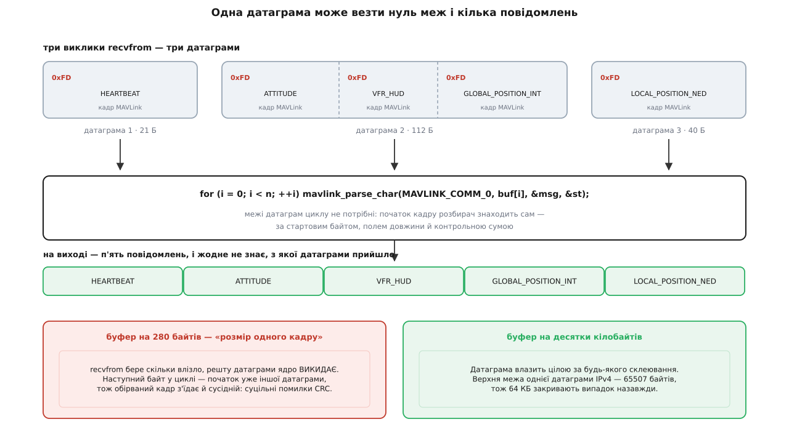
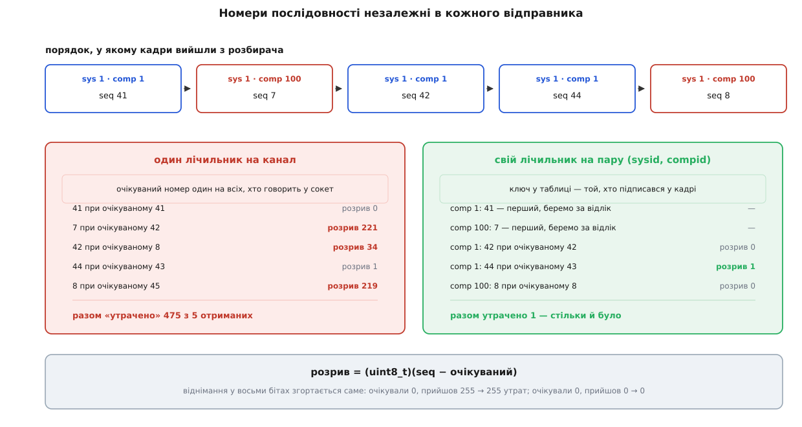

# 🛠 Свій кінець MAVLink на UDP: адресу апарата програма дізнається сама

Півсотні рядків на C++ — і в мережі з'являється повноцінний співрозмовник апарата: він слухає порт, витягує з байтів цілі повідомлення, рахує загублені й раз на секунду відповідає серцебиттям. Найцікавіше в цих рядках те, чого в них немає: ніде не сказано, **куди** слати. Адресу цілі програма витягує з першої ж датаграми, яка до неї прийшла, — і саме на цьому тримається вся невибагливість UDP у полі.

## Задача

Написати самостійну програму, яка:

1. займає порт 14550 і приймає датаграми від кого завгодно;
2. виділяє з байтового потоку цілі кадри MAVLink;
3. рахує, скільки повідомлень загубилося дорогою;
4. раз на секунду шле власне серцебиття — усім, від кого щось чула.

Перші три пункти прямолінійні. Вузол — у четвертому.

## Ідея: адресу не задають, її дізнаються

Щоб відправити датаграму, системному викликові потрібна адреса отримувача. Звідки її взяти?

Найочевидніший шлях — записати в налаштування. Він розсипається на першому ж виїзді: адресу бортовому комп'ютерові видає той-таки маршрутизатор точки доступу, і після переввімкнення вона інша. А коли апарат сидить за трансляцією адрес ([NAT](root:com-transport/nat)), його «адреси» ззовні не існує взагалі — є лише тимчасова дірка, яку відкрив вихідний пакет.

Другий шлях — широкомовна розсилка на всю підмережу. Вона не проходить крізь маршрутизатори, її ріже більшість корпоративних мереж, і вона будить кожен вузол сегмента заради одного адресата.

Третій шлях коштує нуль. Виклик приймання **вже** повертає адресу відправника — просто в неї зазвичай передають нульовий покажчик і викидають. Візьмімо її й запам'ятаймо: хто до нас озвався, той і адресат. Апарат чи бортовий міст надішле перше серцебиття сам, бо його прошивку налаштували слати телеметрію на наш порт; ця перша датаграма й приносить усе, що треба знати про зворотний шлях. Заразом вона пробиває дірку в трансляції адрес, тож відповідь пройде назад без жодного налаштування маршрутизатора.

Одного адресата мало: у сокет може говорити відразу кілька вузлів — автопілот, бортовий комп'ютер, маршрутизатор MAVLink, сусідня станція. Тому запам'ятовуємо не адресу, а **множину** адрес і шлемо в усі одразу. Це груба політика: справжній маршрутизатор веде табличку «яку систему востаннє чули на якому шляху» і шле точково. Але для власного кінця вона правильна за замовчуванням — на момент відправлення ми ще не знаємо, хто з відправників автопілот, бо це з'ясується аж із поля `sysid` у кадрі.

> 🔧 **Навіщо це.** Той самий прийом рятує далеко за межами MAVLink: щойно транспорт не має з'єднання, «хто мені написав» — єдине надійне джерело зворотної адреси. Конфігурація описує, кого ми **готові** слухати; хто відповість насправді — покаже перший пакет.

## Код

Один файл, POSIX-сокети, бібліотека протоколу — офіційна `c_library_v2`.

```cpp
// збірка: g++ -std=c++17 -I/usr/include/mavlink/v2.0 endpoint.cpp -o endpoint
#include <common/mavlink.h>

#include <arpa/inet.h>
#include <netinet/in.h>
#include <poll.h>
#include <sys/socket.h>

#include <chrono>
#include <cstdint>
#include <cstdio>
#include <map>
#include <vector>

using Clock = std::chrono::steady_clock;

// ── кому слати: те, що ми вивчили з вхідних датаграм ─────────────────────
struct Target {
    sockaddr_in       addr{};
    Clock::time_point heard{};
};
static uint64_t targetKey(const sockaddr_in& a) {   // адреса й порт в одне число
    return (static_cast<uint64_t>(a.sin_addr.s_addr) << 16) | ntohs(a.sin_port);
}

// ── скільки загубилося: свій відлік на кожного, хто говорить ─────────────
struct SeqState { uint8_t next = 0; bool primed = false; };

int main() {
    const int fd = ::socket(AF_INET, SOCK_DGRAM, 0);
    if (fd < 0) { ::perror("socket"); return 1; }

    int on = 1;
    ::setsockopt(fd, SOL_SOCKET, SO_REUSEADDR, &on, sizeof(on));

    sockaddr_in local{};
    local.sin_family      = AF_INET;
    local.sin_addr.s_addr = htonl(INADDR_ANY);
    local.sin_port        = htons(14550);
    if (::bind(fd, reinterpret_cast<sockaddr*>(&local), sizeof(local)) < 0) {
        ::perror("bind");        // порт зайнято — це ЄДИНА помилка, можлива тут;
        return 1;                // мовчання апарата помилкою не є
    }

    std::vector<uint8_t>         rx(64 * 1024);   // датаграма може везти багато кадрів
    std::map<uint64_t, Target>   targets;
    std::map<uint16_t, SeqState> seq;             // ключ: sysid<<8 | compid
    uint64_t got = 0, lost = 0;

    mavlink_message_t msg{};
    mavlink_status_t  st{};
    auto beatAt = Clock::now();

    for (;;) {
        pollfd p{fd, POLLIN, 0};
        const int ready = ::poll(&p, 1, 50);      // 50 мс — щоб не проспати серцебиття

        if (ready > 0 && (p.revents & POLLIN)) {
            sockaddr_in from{};
            socklen_t   fromLen = sizeof(from);
            const ssize_t n = ::recvfrom(fd, rx.data(), rx.size(), 0,
                                         reinterpret_cast<sockaddr*>(&from), &fromLen);
            if (n > 0) {
                // 1. ВИВЧАЄМО ВІДПРАВНИКА: адресу приніс сам пакет
                Target& t = targets[targetKey(from)];
                t.addr  = from;
                t.heard = Clock::now();

                // 2. КОЖЕН байт крізь розбирач: межі датаграми йому не потрібні
                for (ssize_t i = 0; i < n; ++i) {
                    if (mavlink_parse_char(MAVLINK_COMM_0, rx[i], &msg, &st)
                        != MAVLINK_FRAMING_OK) continue;

                    // 3. РОЗРИВ У НОМЕРАХ — свій відлік на кожного відправника
                    SeqState& s = seq[(static_cast<uint16_t>(msg.sysid) << 8) | msg.compid];
                    if (s.primed) lost += static_cast<uint8_t>(msg.seq - s.next);
                    s.primed = true;
                    s.next   = static_cast<uint8_t>(msg.seq + 1);
                    ++got;

                    if (msg.msgid == MAVLINK_MSG_ID_HEARTBEAT) {
                        mavlink_heartbeat_t hb;
                        mavlink_msg_heartbeat_decode(&msg, &hb);
                        std::printf("серцебиття від sys %u comp %u (тип %u); "
                                    "прийнято %llu, утрачено %llu\n",
                                    msg.sysid, msg.compid, hb.type,
                                    static_cast<unsigned long long>(got),
                                    static_cast<unsigned long long>(lost));
                    }
                }
            }
        }

        const auto now = Clock::now();
        if (now < beatAt) continue;
        beatAt = now + std::chrono::seconds(1);

        mavlink_message_t out{};
        mavlink_msg_heartbeat_pack(255, MAV_COMP_ID_MISSIONPLANNER, &out,
                                   MAV_TYPE_GCS, MAV_AUTOPILOT_INVALID,
                                   0, 0, MAV_STATE_ACTIVE);
        uint8_t        wire[MAVLINK_MAX_PACKET_LEN];
        const uint16_t len = mavlink_msg_to_send_buffer(wire, &out);

        // 4. ШЛЕМО В УСІ ВІДОМІ ЦІЛІ — і забуваємо тих, хто давно мовчить
        for (auto it = targets.begin(); it != targets.end(); ) {
            if (now - it->second.heard > std::chrono::seconds(10)) {
                it = targets.erase(it);
                continue;
            }
            ::sendto(fd, wire, len, 0,
                     reinterpret_cast<sockaddr*>(&it->second.addr), sizeof(sockaddr_in));
            ++it;
        }
    }
}
```

Це працює: запустіть поруч симулятор апарата, налаштований слати телеметрію на 14550, — і в консолі поповзуть серцебиття з лічильниками. Наземна станція, під'єднана до того самого порту, побачить і ваше серцебиття теж, бо тепер у мережі два співрозмовники.

Чотири позначені місця варті окремого розбору — у трьох із них ховаються найчастіші помилки.

## Датаграма — це шматок байтів, а не повідомлення

Спокуса номер один: якщо UDP зберігає межі, то одне приймання — це одне повідомлення, і розбирати можна не побайтово, а відразу всю датаграму як кадр. Спокуса хибна двічі.


*Кількість повідомлень у датаграмі не визначена нічим: відправник має право скласти в один виклик усе, що назбиралося за такт. Цикл по байтах цього навіть не помічає — а от малий буфер обертає склейку на помилки контрольної суми.*

По-перше, відправник вільний скласти в одну датаграму скільки завгодно кадрів. Так робить і сама наземна станція: вхідні байти вона накопичує в буфері й віддає їх угору не на кожен пакет, а коли назбирається близько десяти кілобайтів або мине п'ятдесят мілісекунд — що станеться раніше. Один такий «пакунок» несе десятки повідомлень.

По-друге — і це наслідок першого — приймальний буфер не можна робити «за розміром кадру». Найбільший кадр MAVLink другої версії має 280 байтів (255 байтів корисного навантаження + 12 байтів обрамлення + 13 байтів підпису), і буфер такого розміру виглядає ощадним. Але якщо в датаграмі 400 байтів, приймання забере 280, **а решту ядро викине** — датаграма не ділиться на порції, зайве просто зникає. Наступний виклик поверне вже іншу датаграму, і розбирач, який стояв посеред обрізаного кадру, з'їсть її початок як хвіст попереднього. Симптом характерний: рівний, ніколи не зникаючий потік помилок контрольної суми при цілком справному каналі.

Ліки тривіальні: буфер на десятки кілобайтів. Верхня межа однієї датаграми IPv4 — 65507 байтів корисного навантаження, тож 64 КБ закривають питання назавжди.

Побайтовий цикл при цьому не коштує нічого зайвого: кінцевий автомат розбирача шукає стартовий байт, набирає оголошену довжину й звіряє контрольну суму ([пакет MAVLink](root:sys-dron/mavlink-packet)). Скільки кадрів було в датаграмі — один, нуль чи двадцять — він не питає. І саме тому одну й ту саму функцію розбору використовують і для сокета, і для послідовного порту, де меж немає взагалі.

Одне обмеження цикл усе-таки має. Константа `MAVLINK_COMM_0` — це **номер каналу розбору**, і за нею в бібліотеці стоїть окремий набір стану: напівзібраний кадр, останній номер, лічильники. Другий сокет мусить отримати `MAVLINK_COMM_1`, інакше байти двох джерел переплетуться посеред кадру й жоден із них не пройде перевірку ([канал MAVLink](root:sys-dron/mavlink-channel)).

Ще одна межа, про яку варто знати заздалегідь: датаграма, більша за найменший MTU на шляху, поїде розрізаною на фрагменти, і втрата будь-якого з них знищить її цілком ([MTU й фрагментація IP](root:com-transport/mtu-and-fragmentation)). Телеметрії це не загрожує — її кадри в десятки разів менші, — але шлюз, який зливає в одну датаграму все, що назбиралося за півсекунди, легко перетне межу й почне втрачати пачками замість поодинці.

## Розриви в номерах: свій лічильник на кожного відправника

У кожному кадрі MAVLink є однобайтове поле номера послідовності: відправник збільшує його на одиницю з кожним випущеним повідомленням. Розрив у цих номерах — єдине, що взагалі можна дізнатися про втрати в UDP, бо ні підтверджень, ні повторів тут немає ([семантика датаграми UDP](root:com-transport/udp-datagram-semantics)).

Перша несподіванка: **бібліотека протоколу цього не рахує**. У структурі стану є поле з красномовною назвою «кількість утрачених пакетів», але в актуальній `c_library_v2` воно лише скидається в нуль на першому вдалому кадрі — код, який мав нарощувати його за номерами, закоментований і не працює. Хто хоче знати втрати, рахує їх сам. Наземна станція, до речі, саме так і робить.

Друга несподіванка серйозніша. Номер живе **не в каналі, а у відправника**: кожна пара «система + компонент» веде власний, незалежний від інших відлік. У той самий сокет говорять автопілот, камера, бортовий комп'ютер — і їхні номери не мають між собою нічого спільного.


*Той самий потік, дві облікові політики. Спільний лічильник дає 475 «утрат» на п'яти отриманих кадрах; лічильники на кожного відправника дають одну — стільки й було насправді.*

Тому ключем таблиці мусить бути пара `(sysid, compid)`, а не сокет. Станція веде такий самий облік, тільки ключ у неї потрійний: номер каналу розбору плюс та сама пара — бо той самий апарат може приходити двома шляхами водночас.

Сама арифметика вміщається в один рядок, і в ньому працює переповнення восьми бітів:

```
розрив = (uint8_t)(отриманий_номер − очікуваний_номер)

очікували 43, прийшов 44   →  (44 − 43) mod 256 = 1    один кадр загублено
очікували 43, прийшов 43   →  (43 − 43) mod 256 = 0    усе на місці
очікували  0, прийшов 255  →  (255 − 0) mod 256 = 255  загублено майже все коло
```

Віднімання в беззнаковому байті згортається саме, тож окремої обробки переходу через 255 не потрібно — умовне розгалуження тут лише додало б помилок.

Чесно про межі цього лічильника. По-перше, він сліпий до втрат, кратних 256: рівно 256 підряд загублених кадрів дадуть розрив нуль. Практично неважливо — така пауза все одно видна за пропалим серцебиттям. По-друге, перезапуск відправника обнуляє його номери, і на місці перезапуску ви побачите вигаданий сплеск на сотню-другу. По-третє, і найважливіше: **розрив не завжди означає втрату**. Якщо між вами й апаратом стоїть маршрутизатор MAVLink, який фільтрує потоки чи розкладає їх по різних адресатах, до вас дійде рідший ряд із дірками — цілком справний. Розрив вимірює, скільки повідомлень цього відправника **не дійшло цим шляхом**, а не скільки згинуло в ефірі.

## Приєднання до групи багатоадресної розсилки

Коли апарат не знає адреси станції навіть приблизно, лишається крикнути в локальний сегмент. Наземна станція для цього приєднується до групи `224.0.0.1`; свій кінець робить те саме одним викликом після прив'язки:

```cpp
ip_mreq mreq{};
mreq.imr_multiaddr.s_addr = ::inet_addr("224.0.0.1");
mreq.imr_interface.s_addr = ::inet_addr("192.168.1.7");  // НЕ INADDR_ANY, якщо мереж кілька
if (::setsockopt(fd, IPPROTO_IP, IP_ADD_MEMBERSHIP, &mreq, sizeof(mreq)) < 0)
    ::perror("IP_ADD_MEMBERSHIP");
```

Два місця, де це зазвичай не працює з першого разу. Перше — вибір мережевого інтерфейсу. На ноутбуці з Wi-Fi, дротовою карткою й парою віртуальних мостів нульова адреса інтерфейсу віддає вибір на відкуп таблиці маршрутів, і приєднання цілком законно відбувається не на тій картці, у яку ввімкнено апарат. Приєднання вдалося, помилки немає, датаграм немає. Лікується явною адресою потрібного інтерфейсу — як у рядку вище.

Друге — час життя пакета. Вихідні багатоадресні датаграми за замовчуванням мають одиницю, тобто не переживають жодного маршрутизатора; це навмисно, щоб службова балаканина не розтікалася далі сегмента. Якщо апарат за іншим стрибком, треба або підняти це значення, або відмовитися від групової розсилки на користь звичайної адреси ([багатоадресна розсилка й виявлення вузлів](root:com-transport/multicast-and-discovery)).

## Скільки це коштує

Розбір — рівно один прохід по вхідних байтах, стала робота на байт і жодного виділення пам'яті: бібліотека тримає один буфер на 280 байтів у стані каналу. Мегабіт телеметрії на секунду — це 125 тисяч викликів розбирача, тобто одиниці відсотків одного ядра.

Відправлення — один системний виклик **на кожну ціль**. З трьома цілями й п'ятдесятьма повідомленнями на секунду виходить 150 викликів — непомітно. А от міст, що пересилає повний потік у десяток кінців, платить уже відчутно, і саме тут з'являється сенс у справжній маршрутизації: слати повідомлення туди, де цю систему чули востаннє, а не всім.

Пам'ять: 64 КБ приймального буфера й по кілька десятків байтів на запис у двох табличках. Табличка номерів теоретично може вирости до 65536 записів, практично в ній одиниці — стільки, скільки компонентів реально говорить у сокет.

## Де воно ламається

**«З'єднано», хоча апарата нема.** Прив'язка до порту вдається завжди, коли порт вільний, — незалежно від того, чи існує апарат у природі. Єдина чесна ознака життя — серцебиття, і саме за ним, а не за станом сокета, треба вмикати в інтерфейсі напис «є зв'язок». Дзеркальне правило: зникло серцебиття на кілька секунд — зв'язку немає, хоч сокет і відкритий.

**Чужий відправник назавжди в списку цілей.** Запущений на тій самій машині симулятор, скрипт-аналізатор, сусідня станція — усі вони озвуться, потраплять у цілі й до кінця сеансу отримуватимуть копію кожної вашої команди. Для станції це терпимо, бо список гине разом із роз'єднанням; для служби, яка працює тижнями, — ні. Тому в коді вище цілі старіють: не чули десять секунд — забуваємо. Для параноїка є суворіший варіант: додавати ціль не за будь-якою датаграмою, а лише за такою, з якої вдалося розібрати кадр із очікуваним ідентифікатором системи.

**Малий приймальний буфер.** Розібрано вище; ознака — рівний потік помилок контрольної суми при справному каналі.

**Порт зайнято.** Два кінці на 14550 на одній машині — звичайна ситуація: станція й ваша програма. Опція повторного використання адреси дозволяє прив'язатися обом, але дає не те, чого зазвичай чекають: датаграму отримає лише хтось один із них, а не обидва. Правильний спосіб роздати той самий потік кільком слухачам — маршрутизатор MAVLink, який приймає на один порт і пересилає копії на різні ([опції сокета](root:sf-os/socket-options)).

**Відправлення з іншої нитки.** Тут UDP несподівано поблажливий: відправлення датаграми атомарне, тож дві нитки, які пишуть в один сокет, ніколи не переплетуть байти всередині кадру — на відміну від послідовного порту чи потоку TCP, де так робити не можна. А от розбирач лишається однонитковим: його стан канальний, і два читачі одного каналу зруйнують напівзібраний кадр.

**Блокування на прийманні.** У коді вище очікування вирішує `poll` із кінцевим часом, і саме тому програма встигає і слухати, і бити серцем в одній нитці. Без цього довелося б або крутити холостий цикл, або віддавати приймання окремій нитці ([select, poll, epoll](root:sys-unix/select-poll-epoll)).

Далі цей кінець нарощується без переробок: розібрані повідомлення можна складати в модель стану, на серцебиття відповідати запитом потоків даних, а замість друку в консоль писати той самий сирий потік у файл — і отримати власний записувач телеметрії.
