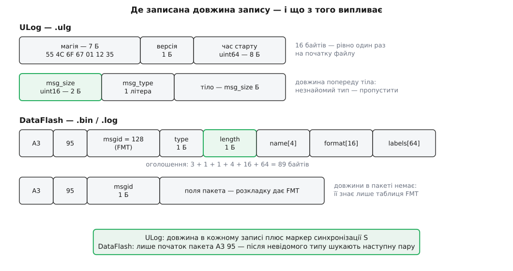

# 📋 ULog і DataFlash байт у байт: заголовки, типи повідомлень, літери формату

Довідник двох бортових форматів, покладених поруч: усі службові записи з розкладкою полів, повна таблиця типів повідомлень ULog, повна таблиця літер формату DataFlash із довжинами й множниками — і наприкінці перелік того, що з усього цього наземна станція справді читає, а повз що проходить. Потрібен він у двох випадках: коли пишете власний читач бортового файлу і коли треба зрозуміти, чому конкретне поле не з'явилося в переліку для графіка.

## Різниця, з якої випливає решта

| | ULog (`.ulg`, PX4) | DataFlash (`.bin`, `.log`, ArduPilot) |
| --- | --- | --- |
| Магія файлу | 7 байтів на початку файлу | немає; перший пакет — оголошення `FMT` |
| Початок запису | нічим не позначений | `0xA3 0x95` перед кожним пакетом |
| **Довжина запису** | **у заголовку кожного запису** | **лише в оголошенні типу** |
| Номер типу в записі | двобайтовий номер підписки | однобайтовий номер типу |
| Ім'я структури | повне, скільки влізе в запис | рівно 4 байти |
| Імена полів | у рядку формату, повні | у полі `labels`, через кому, разом ≤ 64 Б |
| Стеля розміру запису | 65 535 Б (`uint16`) | 255 Б (`uint8`) |
| Час | поле `timestamp`, `uint64`, мкс | колонка `TimeUS`, `uint64`, мкс |
| Порядок байтів | молодший перший | молодший перший |
| Вирівнювання полів | не гарантоване | не гарантоване (`PACKED`) |
| Провал запису | повідомлення `O` | не позначено ніяк |
| Одиниці полів | немає | пакети `UNIT`, `MULT`, `FMTU` |
| Відновлення після сміття | маркер `S` із восьми байтів | пошук наступної пари `0xA3 0x95` |

Найважливіший рядок тут — довжина. ULog пише її **в кожному записі, перед тілом**, тому читач, що зустрів невідому літеру типу, просто відлічує стільки байтів і йде далі. DataFlash довжини в пакеті не має взагалі: єдине місце, де вона є, — поле `length` в оголошенні `FMT`. Читач, який натрапив на тип без оголошення (файл обрізано з початку, карта віддала сміття посеред запису), не знає, скільки пропустити, — і мусить шукати наступну пару `0xA3 0x95` побайтово, ризикуючи натрапити на ці два байти всередині даних.



*Зелене — поле довжини; від того, де воно лежить, залежить, чи вміє читач пропускати незнайоме.*

Обидва формати кладуть числа **молодшим байтом уперед** — [байти й порядок байтів](root:sf-algorithms/bits-bytes-endianness) тут означають, що двобайтове число `0x0123` лежить у файлі як `23 01`. І обидва **не вирівнюють полів**: специфікація ULog прямо попереджає, що зсув поля всередині запису не обов'язково кратний його розміру, а структури ArduPilot оголошені `PACKED`. Читати такі поля прямим приведенням покажчика — помилка, яка на архітектурі x86 працює, а на ARM дає або пастку, або мовчазне сповільнення; правильно копіювати байти в локальну змінну. Чому саме так, розібрано у [вирівнюванні в пам'яті](root:sf-apps/memory-alignment).

## ULog: заголовок файлу — рівно 16 байтів

```
зсув  розмір  вміст
0     7 Б     0x55 0x4C 0x6F 0x67 0x01 0x12 0x35   магія («ULog» + три байти)
7     1 Б     0x01                                  версія формату
8     8 Б     uint64                                час старту запису, мкс
```

Перші чотири байти магії читаються як текст `ULog`; три наступні — довільно обрані розрізнювальні числа. Версія станом на сьогодні лише одна — `1`. Час старту — той самий монотонний лічильник у мікросекундах, що потім стоїть у полі `timestamp` кожного запису.

## ULog: три байти перед кожним повідомленням

```c
struct message_header_s {
    uint16_t msg_size;   // довжина ТІЛА, без цих трьох байтів
    uint8_t  msg_type;   // літера типу
};
```

Запис на диску займає `3 + msg_size` байтів. Літера типу — звичайний код ASCII, тому в шістнадцятковому дампі типи видно очима: `0x46` це `F`, `0x44` це `D`.

Файл ділиться на дві частини, і межа між ними не позначена окремим записом: **секція означень закінчується перед першим повідомленням `A` або `L`** — залежно від того, яке трапиться раніше. До цієї межі йдуть оголошення й довідкові пари; після неї — потік даних, у який довідкові пари теж можуть вклинюватися.

### Секція означень

| Літера | Назва | Поля тіла по порядку | Довжина тіла |
| --- | --- | --- | --- |
| `B` | flag bits | `uint8_t compat_flags[8]`, `uint8_t incompat_flags[8]`, `uint64_t appended_offsets[3]` | 40 Б |
| `F` | format | `char format[msg_size]` — рядок оголошення | змінна |
| `I` | information | `uint8_t key_len`, `char key[key_len]`, `char value[msg_size−1−key_len]` | змінна |
| `M` | information multiple | `uint8_t is_continued`, `uint8_t key_len`, `char key[…]`, `char value[…]` | змінна |
| `P` | parameter | `uint8_t key_len`, `char key[key_len]`, `char value[…]` | змінна |
| `Q` | default parameter | `uint8_t default_types`, `uint8_t key_len`, `char key[…]`, `char value[…]` | змінна |

`B` мусить стояти найпершим після заголовка файлу, і саме він вирішує долю читача: **`incompat_flags` перелічує властивості, без розуміння яких файл читати не можна**. Біт 0 означає, що до файлу дописано дані після його закриття, а `appended_offsets` дають зсуви, з яких ці дописані шматки починаються. Читач, який побачив невідомий йому ненульовий біт у `incompat_flags`, зобов'язаний відмовитися від розбору, а не вгадувати; `compat_flags`, навпаки, можна ігнорувати без наслідків.

`I` і `M` — пари «ключ-значення», де **тип значення зашитий у сам ключ**: ключ має вигляд `<тип> <ім'я>`, наприклад `char[5] sys_name` чи `int32_t time_ref_utc`. `M` відрізняється лише прапорцем `is_continued`, яким довге значення розбивають на кілька записів.

| Ключ `I` | Тип | Що це |
| --- | --- | --- |
| `sys_name` | `char[]` | ім'я системи, зазвичай `PX4` |
| `ver_hw` | `char[]` | позначення плати |
| `ver_sw` | `char[]` | версія прошивки (хеш коміту) |
| `time_ref_utc` | `int32_t` | зсув місцевого часу від UTC, у секундах |

`P` і `Q` несуть параметри автопілота — і тип значення знову лежить у ключі, але **дозволено рівно два типи: `int32_t` і `float`**. `Q` додає байт `default_types`: бітове поле, яке каже, для якого саме «типового» набору наведено значення — загальносистемного чи конфігураційного. Саме наявність `Q` дає змогу побачити змінені параметри прямо з файлу, не звіряючись із зовнішніми описами.

### Рядок оголошення `F`

Тіло повідомлення `F` — це текст без завершального нуля, з такою будовою:

```
ім'я_структури:тип поле0;тип поле1;тип[довжина] поле2;
```

Приклад із реального файлу:

```
vehicle_attitude:uint64_t timestamp;float[4] q;float[4] delta_q_reset;uint8_t quat_reset_counter;uint8_t[3] _padding0;
```

Дозволені типи й їхні розміри:

| Тип | Байтів | | Тип | Байтів |
| --- | --- | --- | --- | --- |
| `int8_t`, `uint8_t` | 1 | | `int64_t`, `uint64_t` | 8 |
| `int16_t`, `uint16_t` | 2 | | `float` | 4 |
| `int32_t`, `uint32_t` | 4 | | `double` | 8 |
| `bool` | 1 | | `char` | 1 |

Три правила, які легко проґавити й потім довго ловити зсув на кілька байтів:

- **Масив пишеться `тип[довжина]`** і займає рівно `довжина × розмір` байтів поспіль. Рядки — це `char[]` **без завершального нуля**.
- **Поля з іменем, що починається на `_padding`, — не дані, а вирівнювання.** Їх треба пропускати при тлумаченні, але враховувати в зсувах. Виняток один: якщо поле-набивка **останнє**, прошивка має право не записувати його зовсім, і тоді запис коротший за суму розмірів полів.
- **Структура, на яку є підписка, зобов'язана мати першим полем `uint64_t timestamp`** у мікросекундах, монотонно зростальний у межах одного `msg_id`. Без нього запис не має де взяти абсцису.

### Секція даних

| Літера | Назва | Поля тіла по порядку | Довжина тіла |
| --- | --- | --- | --- |
| `A` | add logged message | `uint8_t multi_id`, `uint16_t msg_id`, `char message_name[…]` | 3 + довжина імені |
| `R` | remove logged message | `uint16_t msg_id` | 2 Б |
| `D` | data | `uint16_t msg_id`, `uint8_t data[…]` | 2 + розмір структури |
| `L` | logged string | `uint8_t log_level`, `uint64_t timestamp`, `char message[…]` | 9 + довжина тексту |
| `C` | tagged logged string | `uint8_t log_level`, `uint16_t tag`, `uint64_t timestamp`, `char message[…]` | 11 + довжина тексту |
| `S` | synchronization | `uint8_t sync_magic[8]` | 8 Б |
| `O` | dropout | `uint16_t duration` — тривалість провалу, мс | 2 Б |

Механіка підписки тримається на трьох домовленостях. **`msg_id` роздають підряд від нуля** й ніколи не використовують двічі для різних підписок — навіть після `R`. **`multi_id` розрізняє екземпляри** однієї структури: перший і типовий завжди `0`, тому три гіроскопи дають три записи `A` з однаковим іменем і `multi_id` 0, 1, 2. І **`D` не несе ані імені, ані розміру структури** — лише двобайтовий номер; усе інше читач мусить уже знати з `F` і `A`.

Рівні важливості в `L` і `C` записані **не числами 0…7, а їхніми літерами** — тобто кодами ASCII `'0'`…`'7'`, від 48 до 55:

| Байт | Рівень | Значення |
| --- | --- | --- |
| `'0'` | EMERG | система непрацездатна |
| `'1'` | ALERT | треба втручатися негайно |
| `'2'` | CRIT | критичний стан |
| `'3'` | ERR | помилка |
| `'4'` | WARNING | попередження |
| `'5'` | NOTICE | звичайна, але значуща подія |
| `'6'` | INFO | довідково |
| `'7'` | DEBUG | налагоджувальне |

Маркер `S` містить фіксовану вісімку байтів `2F 73 13 20 25 0C BB 12` і потрібен рівно для одного: коли розбір збився, читач шукає в потоці цю послідовність і від неї продовжує з відомого місця.

`O` — єдина в обох форматах чесна позначка **провалу запису**: прошивка сама повідомляє, що стільки-то мілісекунд не встигла записати. Без такої позначки діра в даних і відсутність подій на графіку виглядають однаково.

## DataFlash: пакет, який не знає своєї довжини

Заголовок пакета — три байти, оголошені макросом:

```c
#define HEAD_BYTE1  0xA3
#define HEAD_BYTE2  0x95
#define LOG_PACKET_HEADER  uint8_t head1, head2, msgid;
```

Далі йдуть поля пакета — і на цьому все: **поля довжини в пакеті немає**. Довжину дає оголошення, а оголошення — це теж пакет, типу 128:

```c
struct PACKED log_Format {
    LOG_PACKET_HEADER;      // 0xA3, 0x95, msgid = 128
    uint8_t type;           // номер типу, який тут оголошується
    uint8_t length;         // ПОВНА довжина пакета цього типу, разом із трьома байтами заголовка
    char    name[4];        // ім'я: "ATT", "GPS", "IMU"
    char    format[16];     // по літері на кожне поле
    char    labels[64];     // підписи полів через кому
};
```

Розкладка бутстрапиться сама собою: найперший пакет у файлі — це `FMT`, який оголошує **сам себе**, з рядком формату `BBnNZ` і підписами `Type,Length,Name,Format,Columns`. Прочитавши його за наперед відомою розкладкою, читач далі тлумачить усі інші `FMT` уже як звичайні дані.

**Дано: оголошення `FMT` самого себе, формат `BBnNZ`.**

```
B (uint8_t type)      1
B (uint8_t length)    1
n (char[4]  name)     4
N (char[16] format)  16
Z (char[64] labels)  64
                     ──
поля                 86
+ заголовок пакета    3
                     ──
length                89     ← і саме 89 стоїть у полі length пакета FMT
```

З цієї структури випливають три жорсткі стелі формату, які пояснюють, чому імена в логах ArduPilot такі скупі: **не більше 16 полів у пакеті** (`format[16]`), **разом не більше 64 байтів на всі підписи** (`labels[64]`), **не довше 255 байтів на весь пакет** (`length` — це `uint8_t`). Звідси `DesRoll` замість `desired_roll` і `TimeUS` замість `timestamp_us`.

Рядки в полях `name`, `format`, `labels` — фіксованої довжини, добиті нулями; якщо рядок займає масив цілком, завершального нуля немає. Читати їх треба до першого нуля **або** до кінця масиву, дивлячись що трапиться раніше.

## DataFlash: словник літер формату

| Літера | Тип у файлі | Байтів | Що дає читачеві |
| --- | --- | --- | --- |
| `b` | `int8_t` | 1 | ціле зі знаком |
| `B` | `uint8_t` | 1 | ціле без знака |
| `h` | `int16_t` | 2 | ціле зі знаком |
| `H` | `uint16_t` | 2 | ціле без знака |
| `i` | `int32_t` | 4 | ціле зі знаком |
| `I` | `uint32_t` | 4 | ціле без знака |
| `q` | `int64_t` | 8 | ціле зі знаком |
| `Q` | `uint64_t` | 8 | ціле без знака; ним пишуть `TimeUS` |
| `f` | `float` | 4 | дробове |
| `d` | `double` | 8 | дробове подвійної точності |
| `c` | `int16_t` | 2 | **значення ÷ 100** |
| `C` | `uint16_t` | 2 | **значення ÷ 100** |
| `e` | `int32_t` | 4 | **значення ÷ 100** |
| `E` | `uint32_t` | 4 | **значення ÷ 100** |
| `L` | `int32_t` | 4 | широта чи довгота, **градуси × 10⁷** |
| `M` | `uint8_t` | 1 | номер режиму польоту |
| `n` | `char[4]` | 4 | короткий рядок |
| `N` | `char[16]` | 16 | рядок |
| `Z` | `char[64]` | 64 | довгий рядок |
| `a` | `int16_t[32]` | 64 | масив із 32 цілих |

Чотири літери `c C e E` — це не окремі типи, а **ціле з умовленим множником**: у файл записано значення, помножене на сто, і читач мусить поділити. Так дробові величини клали в лог тоді, коли зайві два байти на кожному записі були відчутною ціною. Літера `L` — той самий прийом із іншим множником: широта в цілих стомільйонних частках градуса.

**Дано: оголошення `ATT` — формат `QffffffB`, підписи `TimeUS,DesRoll,Roll,DesPitch,Pitch,DesYaw,Yaw,AEKF`.**

```
Q (TimeUS)                   8
f × 6 (кути, задані й дійсні) 24
B (AEKF)                     1
                            ──
поля                        33
+ заголовок пакета           3
                            ──
length                      36 байтів на кожен запис ставлення
```

Кількість літер у `format` мусить збігатися з кількістю підписів у `labels` — розбіжність означає зіпсоване оголошення, і рядок даних із нього не збудувати.

> 🔧 **Навіщо це.** Літера `M` — головна пастка тлумачення. Це просто `uint8_t`, і **сам файл ніде не каже, що означає число**: режим 5 на мультикоптері й режим 5 на літаку — різні режими. Щоб перекласти число в назву, читач мусить спершу довідатися **тип апарата** (з пакета `MSG`, де прошивка представляється рядком) і лише тоді брати відповідну таблицю режимів. Читач, який цього не зробить, показуватиме назви режимів упевнено й неправильно.

## DataFlash: одиниці, множники й службові пакети

Пізніші версії формату додали до самоопису ще один поверх — **одиниці вимірювання й десяткові множники кожного поля**. Робиться це трьома пакетами, кожен з яких теж оголошений через `FMT`:

| Ім'я | Формат | Підписи | Що каже |
| --- | --- | --- | --- |
| `UNIT` | `QbZ` | `TimeUS,Id,Label` | літері-ідентифікатору відповідає назва одиниці |
| `MULT` | `Qbd` | `TimeUS,Id,Mult` | літері-ідентифікатору відповідає числовий множник |
| `FMTU` | `QBNN` | `TimeUS,FmtType,UnitIds,MultIds` | для типу `FmtType` — по літері одиниці й по літері множника на кожне поле |

Множники — фіксований словник:

| Літера | Множник | | Літера | Множник |
| --- | --- | --- | --- | --- |
| `-` | немає (рядок) | | `B` | 10⁻² |
| `?` | невідомий | | `C` | 10⁻³ |
| `2` | 10² | | `D` | 10⁻⁴ |
| `1` | 10¹ | | `E` | 10⁻⁵ |
| `0` | 10⁰ | | `F` | 10⁻⁶ |
| `A` | 10⁻¹ | | `G` | 10⁻⁷ |
| `I` | 10⁻⁹ | | `!` | 3.6 |
| `/` | 3600 | | | |

Дві останні — не степені десятки, а перевідні коефіцієнти: `!` переводить ампер-секунди в міліампер-години (і кілометри за годину в метри за секунду), `/` — ампер-секунди в ампер-години.

Оголошення `ATT` супроводжується рядками одиниць `sddddhh-` і множників `F000000-`. Читаються вони по літері на поле:

```
поле    TimeUS  DesRoll  Roll  DesPitch  Pitch  DesYaw  Yaw  AEKF
одиниця   s        d       d       d       d       h      h    -
множник   F        0       0       0       0      0      0    -

TimeUS: одиниця «с», множник 10⁻⁶  →  значення 412700000 означає 412.7 с
Roll:   одиниця «град», множник 10⁰ →  значення читається як є
AEKF:   одиниці немає, множника немає
```

Тобто **сам файл каже, що поле часу в мікросекундах і як його перевести в секунди** — не за домовленістю читача, а за метаданими. Кутові одиниці розрізняються: `d` — це кут у діапазоні −180…180, `h` — курс 0…360.

Решта службових пакетів, без яких лог мало про що каже:

| Ім'я | Формат | Підписи | Вміст |
| --- | --- | --- | --- |
| `FMT` | `BBnNZ` | `Type,Length,Name,Format,Columns` | оголошення типу |
| `PARM` | `QNff` | `TimeUS,Name,Value,Default` | параметр: значення й типове значення |
| `MSG` | `QBBZ` | `TimeUS,ID,Seq,Message` | текстове повідомлення прошивки |
| `MODE` | `QMBB` | `TimeUS,Mode,ModeNum,Rsn` | зміна режиму польоту й її причина |
| `EV` | `QB` | `TimeUS,Id` | подія за номером |
| `ERR` | `QBB` | `TimeUS,Subsys,ECode` | помилка: підсистема й код |

`PARM` варто відзначити окремо: у сучасних версіях він несе **і поточне, і типове значення** в одному записі, тож змінені параметри видно прямо з файлу, без зовнішніх описів. У старих логах поля `Default` немає — там оголошення `FMT` для `PARM` буде коротшим, і саме тому розбирач мусить будувати розкладку з оголошення, а не з пам'яті про те, «як буває».

## Що з цього справді читає наземна станція

Розбирач станції не є повним читачем формату — він бере рівно те, з чого будуються чотири вкладки: ряди для графіка, точки для карти, перелік параметрів і перелік повідомлень.

**З ULog станція розбирає:**

| Тип | Куди йде |
| --- | --- |
| `F` | будує розкладку структури |
| `A` | зв'язує номер із іменем; `multi_id` дає суфікс `[N]` в імені поля |
| `D` | дає точки рядів: ключ `ім'я_структури.поле` або `ім'я_структури[N].поле` |
| `L` | перелік повідомлень; рівні помилки й попередження ще й потрапляють у список подій |
| `P`, `Q` | перелік параметрів із позначенням змінених від типових |
| `O` | проміжки провалу запису на осі часу |

Крім типів, станція шукає у файлі **кілька структур на ім'я**: `vehicle_status` дає тип апарата й номер режиму польоту (з якого будуються смуги режимів), `sensor_gps` або `vehicle_gps_position` дають час UTC, `vehicle_global_position` — трек для карти.

**Повз що станція проходить:** `B` (прапорці сумісності й дописані дані), `I` та `M` (довідкові пари), `R` (скасування підписки), `S` (маркер синхронізації), `C` (текст із теґом). Ігнорувати `R` безпечно за самою будовою формату — `msg_id` не використовується вдруге, тож підписка лишається чинною до кінця файлу. А от `B` у власному читачі ігнорувати не варто: саме він каже про дописані шматки й про несумісні властивості, без розуміння яких файл читати не можна.

**З DataFlash станція розбирає:** `FMT` (обов'язково, інакше файл не відкривається зовсім), `PARM`, `MSG` (звідки заразом визначає тип апарата), `MODE` (з нього будуються відрізки режимів), `ERR` і `EV`. Решта пакетів стають рядами за загальним правилом: ім'я поля — це `ІМ'Я.Підпис`, тобто `ATT.Roll` чи `GPS.Alt`.

Настінний час у двох форматах добувається по-різному, і саме тому лог без супутникового розв'язку лишається без дати. ULog має готове поле UTC у мікросекундах поруч із монотонною міткою:

```
початок відліку = time_utc_usec − timestamp      (мкс від епохи Unix)
```

DataFlash дає натомість номер тижня й мілісекунди від початку тижня в [шкалі супутникової навігації](root:hw-sensing/gnss), і їх треба перевести:

**Дано: пакет `GPS` із `GWk = 2360` і `GMS = 302400000`.**

```
секунд від початку епохи GPS = 604800·GWk + GMS/1000
                             = 604800·2360 + 302400
                             = 1427630400 с

епоха GPS у шкалі Unix        = 315964800 с   (6 січня 1980, 00:00 UTC)

UTC = 315964800 + 1427630400 − 18
    = 1743595182 с  →  2 квітня 2025, 11:59:42 UTC
```

Вісімнадцять секунд у кінці — це поточна різниця між шкалою супутників і UTC: шкала GPS не має [високосних секунд](root:hw-sensing/leap-second), тому за роки набігла стала різниця. Станом на 2026 рік вона дорівнює 18 с і не змінювалася з 2017 року, але це **значення таблиці, а не константа формату** — читач, зашитий на 18, колись помилиться рівно на одну секунду. Перевірка `GWk > 2000` перед обчисленням відкидає записи, зроблені до появи розв'язку, у яких номер тижня ще нульовий.

Нарешті, правила, за якими поле стає **рядом на графіку**, а не просто рядком у переліку наявних полів:

- **Поле мусить бути числом.** Цілі, дробові, логічні — так; рядки (`n`, `N`, `Z` у DataFlash, `char[]` у ULog) лишаються в переліку наявних, але ввімкнути їх не можна.
- **Масив рядом не стає.** Кватерніон `float[4]` чи `a` з тридцяти двох цілих у переліку придатних не з'явиться; щоб побачити кут, треба брати поле, де кут уже обчислено прошивкою.
- **Структура без часової мітки не дає жодної точки.** Ім'я поля з'явиться, а ряд буде порожній: точці немає звідки взяти абсцису.
- **Усі значення зводяться до `double`.** Ціле, більше за 2⁵³, округлиться — лічильники подій і мітки часу як окремі поля на графіку варто вважати приблизними, а точні значення дивитися там, де вони не проходили через дробовий тип.
