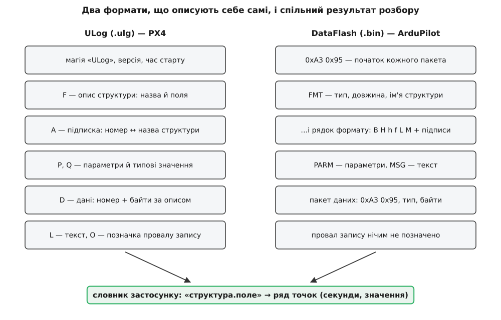
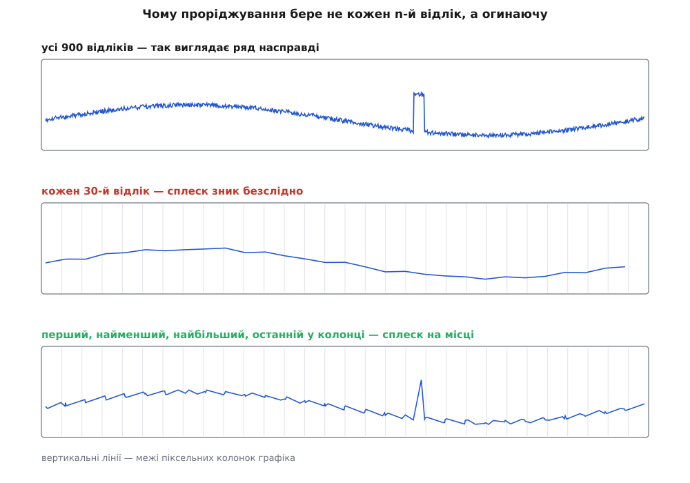
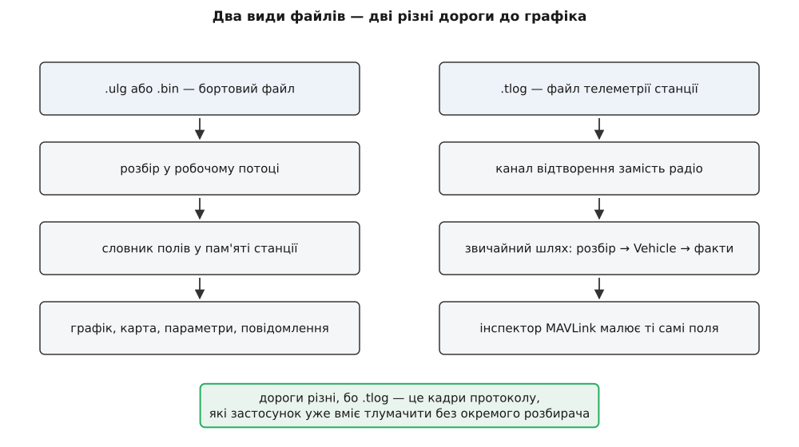

# Переглядач логів: графіки й повідомлення з бортового файлу

<preknowlist>
- [Бортові логи апарата](topic:sys-dron/vehicle-logs) — як файл із карти апарата опиняється на диску станції: перелік записів, витягування шматками, потокове передавання.
- [Запис телеметрії й відтворення логів](topic:sys-dron/telemetry-logging) — що таке `.tlog`: кадри протоколу з міткою часу, які можна підсунути застосункові замість каналу зв'язку.
- [Пакет MAVLink](topic:sys-dron/mavlink-packet) — будова кадру й те, що набір полів у ньому заданий наперед словником протоколу, однаковим для обох сторін.
- [Байти й порядок байтів](topic:sf-algorithms/bits-bytes-endianness) — як число лежить у файлі й чому, щоб його прочитати, треба знати довжину й порядок байтів кожного поля.
- [Серіалізація даних](topic:com-protocol/data-serialization) — навіщо описувати розкладку структури й де може лежати цей опис: у коді читача чи в самому файлі.
- [Самоописовий формат](topic:sf-data/self-describing-format) — файл, що на початку оголошує свої власні структури, і читач, який будує розбирач із прочитаного.
- [Найквіст і аліасинг](topic:com-signal/nyquist-aliasing) — чому проріджений ряд може показати частоту, якої в сигналі не було, і зовсім не показати ту, що була.
- [Настінний час і монотонний](topic:sf-apps/monotonic-vs-wall-time) — лічильник, що росте від увімкнення, і годинник, який знає дату; за яких умов одне переводиться в інше.
</preknowlist>

Файл із бортовим журналом уже лежить на диску. Кілька десятків мегабайтів двійкових даних: усе, що прошивка записала на карту, поки апарат літав. Питання, заради якого його тягнули, звучить просто — «покажи мені крен і тягу за останні п'ять секунд перед падінням» — але між цим питанням і файлом стоїть перешкода, якої немає в жодного іншого файлу, що його відкриває станція.

Станція **не знає наперед, що в цьому файлі**.

Це не фігура мови. План місії має заздалегідь відомий набір полів; кадр MAVLink має набір полів, записаний у словнику протоколу, який обидві сторони отримали ще на етапі складання. Бортовий журнал не такий. Туди прошивка кладе свої **внутрішні** структури: оцінку положення, окремі екземпляри гіроскопів, уставки регуляторів, лічильники, які автор коду завів минулого тижня. Ці структури змінюються від версії до версії прошивки, від апарата до апарата, від набору увімкнених модулів. Складати переглядач, у який зашито таблицю «поле такої-то структури лежить за таким-то зміщенням», — означає ламати його щоразу, коли хтось у чужому проєкті додасть змінну.

Тому обидва бортові формати, якими користуються сьогодні, вирішили ту саму задачу однаково, хоч зроблено це геть різними байтами: **файл описує сам себе**. На початку — оголошення структур, далі — записи за цими оголошеннями. Читач не знає розкладки заздалегідь; він **будує її з прочитаного** і лише потім починає розбирати дані.

## Файл, який пояснює сам себе

Подивімося, як це виглядає у двох форматів, які переглядач станції вміє відкривати.

**ULog** — формат PX4. Файл починається з шістнадцяти байтів: сім байтів магії (`0x55 0x4c 0x6f 0x67 0x01 0x12 0x35`, у яких видно слово «ULog»), байт версії й вісім байтів часу початку запису в мікросекундах. Далі йде послідовність повідомлень, і кожне має однаковий трибайтовий заголовок: два байти довжини й один байт типу. Тип — це літера, і саме літера каже, що робити з рештою.

Повідомлення `F` (format) оголошує структуру: її назву й перелік полів із типами, у вигляді рядка на кшталт `vehicle_attitude:uint64_t timestamp;float[4] q;`. Повідомлення `A` (add logged message) прив'язує до вже оголошеної структури **числовий номер**. І тільки після цього починають іти повідомлення `D` (data): номер плюс байти, розкладені точно так, як оголошено в `F`.

Ця подвійність — назва в одному місці, номер у другому — не примха. Назва структури довга, і писати її поруч із кожним записом означало б витратити на неї більше місця, ніж на самі дані. Тому назву пишуть **один раз**, а далі посилаються двобайтовим номером. Той самий прийом, що в будь-якому словнику стиснення: довге позначення міняють на коротке, заплативши за це одним рівнем непрямості.

Є ще одна причина для окремого `A`: тих самих структур на борту може бути **кілька екземплярів**. Три гіроскопи публікують ту саму структуру `sensor_gyro`, і розрізняє їх поле `multi_id` у підписці. Одне оголошення формату — три підписки — три незалежні потоки записів.

**DataFlash** — формат ArduPilot, історично старший і влаштований простіше. Тут немає розділення на «шапку» й «тіло»: кожен пакет починається двома байтами `0xA3 0x95`, за якими йде байт типу. Оголошення теж є пакетом — типу 128, з назвою `FMT`, і його розкладка фіксована:

```c
struct PACKED log_Format {
    LOG_PACKET_HEADER;      // 0xA3 0x95 і байт типу
    uint8_t type;           // номер типу, який тут оголошується
    uint8_t length;         // повна довжина пакета цього типу, у байтах
    char    name[4];        // коротке ім'я: "ATT", "GPS", "IMU"
    char    format[16];     // по літері на кожне поле
    char    labels[64];     // підписи полів через кому
};
```

Уся розкладка вміщена в шістнадцять літер рядка `format`, і словник цих літер невеликий: `b` — знаковий байт, `B` — беззнаковий, `h`/`H` — шістнадцятибітні, `i`/`I` — тридцятидвобітні, `q`/`Q` — шістдесятичотирибітні, `f` — число з рухомою комою, `d` — подвійної точності, `n`/`N`/`Z` — рядки завдовжки 4, 16 і 64 байти. Кілька літер означають не тип, а **тип із множником**: `c` — це `int16_t`, поділений на сто при читанні, `e` — `int32_t`, поділений на сто. Так у файл клали дробові величини ще тоді, коли зайвий байт на полі був відчутною ціною.

Відмінність від ULog у характері: там оголошення описує **структуру програми** і несе довгі імена полів, тут — **рядок пакета** з чотирилітерним іменем і підписами колонок. Але механіка та сама: спершу прочитай оголошення, з нього збудуй розбирач, і тільки потім розбирай дані. Повний перелік типів повідомлень ULog і літер формату DataFlash, разом із тим, які з них станція справді читає, зібрано в [довіднику двох бортових форматів](topic:sys-dron/log-viewer/api-log-formats.md).



*Ліворуч і праворуч — різні байти й різні домовленості; знизу — те єдине, що з них потрібне переглядачеві.*

Вибір розбирача застосунок робить за розширенням файлу: `.bin` і `.log` ідуть до розбирача DataFlash, `.ulg` — до розбирача ULog, а вже той перевіряє магічні байти й відмовляється, якщо всередині не те, що обіцяє ім'я. Розширення тут — підказка, а не доказ; доказ — перші байти.

## Один словник замість двох форматів

Тепер найважливіше рішення переглядача, з якого випливає майже все інше в ньому.

Розбір обох форматів закінчується **однією й тією самою структурою в пам'яті** — пласким словником, де ключ це ім'я поля, а значення — вектор точок:

```cpp
QHash<QString, QVector<QPointF>> fieldSamples;
```

Точка тут — пара `(секунди, значення)`. І це, якщо вдуматися, доволі рішучий крок: усе розмаїття типів, які були у файлі, зводиться до `double`; уся ієрархія структур зводиться до рядка-ключа.

Ключ будують склеюванням: назва структури, крапка, назва поля. `vehicle_local_position.z` для ULog, `ATT.Roll` для DataFlash. Другий і подальші екземпляри отримують номер у квадратних дужках — `sensor_gyro[1].x`, — і саме тому в переліку полів другий гіроскоп видно окремо від першого.

Навіщо зводити все до одного вигляду? Бо далі з цим словником працює **одна** система малювання, один пошук по полях, один курсор, одна карта. Якби ULog і DataFlash лишилися різними моделями даних, кожну з них довелося б окремо навчати всього, що вміє переглядач, і кожна нова можливість писалася б двічі. Ціна за цю економію теж є, і про неї варто знати чесно:

- **Не все влазить у `double` без втрат.** Ціле шістдесятичотирибітне число більше за 2⁵³ округлиться. Лічильники подій, ідентифікатори, час у мікросекундах як окреме поле — усе це на графіку буде приблизним. Для величин, які взагалі мають сенс на графіку, це не проблема; для тих, які мали б бути точними цілими, — пастка.
- **Не всяке поле стає рядом.** Масиви (кватерніон із чотирьох чисел), рядки, поля без розв'язаного опису до словника рядів не потрапляють. Вони лишаються у списку **наявних** полів, але не потрапляють у список **придатних до графіка** — і саме тому в переліку зустрічається поле, яке видно, але не можна ввімкнути.
- **Запис без часової мітки не дає точки взагалі.** Точка потребує двох координат; якщо в структурі немає поля часу, ім'я поля до словника додасться, а вектор лишиться порожнім.

> 🔧 **Навіщо це.** Коли потрібного вам поля немає у списку для графіка, шукати причину слід у цих трьох правилах, а не в переглядачі. Кватерніон покаже не «крен», а чотири числа, яких у списку нема; щоб побачити кут, беріть поле, де кут уже обчислено прошивкою. Ціле лічильне поле краще дивитися не як графік, а в переліку повідомлень, де воно не проходило через `double`.

## Час, якого у файлі два

Кожна точка має абсцису в секундах. Звідки вона береться — питання не таке просте, як здається, і від відповіді залежить, чи зможете ви покласти лог поруч із відео.

Час, який пише прошивка, — **монотонний**, від увімкнення живлення. В ULog це поле `timestamp` у мікросекундах усередині кожної структури; у DataFlash — колонка `TimeUS` із тим самим сенсом. Розбирач ділить його на мільйон і кладе в абсцису. Ось чому вісь графіка починається не з нуля, а з довільного числа: апарат уже якийсь час стояв увімкнений, коли запис почався.

Але дати в цьому лічильнику немає. А вона потрібна — щоб звести журнал із файлом телеметрії станції, з відеозаписом, із записом другого апарата. Тому переглядач добуває **настінний** час одним арифметичним ходом: у повідомленнях приймача супутникової навігації є поле часу UTC, і воно приходить у тому самому записі, що й монотонна мітка. Різниця між ними — це і є момент увімкнення, виражений у настінному часі:

**Дано: запис `sensor_gps` із `time_utc_usec = 1743158400000000` і `timestamp = 372450000`.**

```
початок відліку = time_utc_usec − timestamp
                = 1743158400000000 − 372450000
                = 1743158027550000 мкс від початку епохи Unix
                = 1743158027.55 с  →  28 березня 2025, 10:33:47.55 UTC

момент точки з абсцисою 412.7 с у настінному часі:
                = 1743158027.55 + 412.7
                = 1743158440.25 с  →  10:40:40.25 UTC
```

Умова, за якої це працює, одна: поле UTC має бути ненульовим, тобто приймач мусить уже мати розв'язок. Поки супутників немає, настінного часу в логу теж немає — і в переліку файлів такий політ буде без дати. Це не збій станції; це відсутність джерела.

## Що ще є у файлі, крім чисел

Ряди — головне, але не єдине, заради чого файл розбирають.

**Параметри.** Обидва формати кладуть у журнал значення всіх параметрів автопілота на момент запису — ULog повідомленнями `P`, ArduPilot пакетами `PARM`. Сам по собі перелік із тисячі рядків мало що каже; корисним він стає, коли видно, **що саме змінено від типового значення**. ULog це полегшує: він має окреме повідомлення для типових значень, і різницю видно прямо з файлу. У DataFlash такого немає, тому станція бере типові значення з тих самих описів параметрів, що постачаються з нею, звіряючись із типом апарата й версією прошивки, які знайшла в логу. Заразом із описів підтягуються одиниці вимірювання, кількість знаків після коми й короткий опис — той самий апарат метаданих, що працює в [менеджері параметрів](topic:sys-dron/parameter-manager) для живого апарата.

**Текстові повідомлення.** Те, що автопілот казав про себе словами: попередження передпольотних перевірок, причини відмови зброїти, повідомлення про спрацювання захистів. В ArduPilot це пакети `MSG`, у PX4 — повідомлення `L` із рівнем важливості. Список цих рядків із часовими мітками часто дає відповідь швидше, ніж будь-який графік: рядок «EKF variance» за секунду до падіння каже більше, ніж крива крену.

**Смуги режимів.** Із записів про зміну режиму польоту переглядач будує перелік відрізків «від такої секунди до такої — режим такий», і показує їх кольоровими смугами під графіком. Це найдешевший спосіб не помилитися в тлумаченні кривої: те саме коливання тяги в режимі ручного керування й у режимі утримання висоти означає різні речі.

**Провали запису.** ULog має для цього окреме повідомлення `O` — прошивка сама зізнається, що не встигла записати стільки-то мілісекунд (карта задумалася, буфер переповнився). Переглядач показує ці проміжки окремо, і це важливо: **розрив у даних і відсутність подій виглядають на графіку однаково**. У DataFlash такої позначки немає взагалі, і там діру в кривій відрізнити від тиші неможливо — хіба що за розривом у лічильниках сусідніх записів.

## Ціна повного розбору

Розбирач проходить файл **один раз** і **до кінця**, складаючи все у пам'ять. Це рішення теж має ціну, і корисно вміти оцінити її наперед.

**Дано: запис ULog зі структури на п'ятнадцять полів типу `float`.**

```
на диску:   3 (заголовок) + 2 (номер) + 8 (час) + 15·4 = 73 байти
у пам'яті:  15 точок × 16 байтів (два double)          = 240 байтів
відношення:                          240 / 73          ≈ 3.3

файл 30 МБ  →  ≈ 100 МБ точок
з урахуванням запасу ємності векторів (до вдвічі)  →  до ≈ 200 МБ
```

Тобто **бортовий файл у пам'яті займає в кілька разів більше, ніж на диску** — і це неминучий наслідок вибору моделі. У файлі одна часова мітка обслуговує всі поля запису й кожне значення займає чотири байти; у словнику рядів кожне значення тягне за собою власну копію часу й розширюється до восьми байтів. Ми заплатили пам'яттю за те, щоб будь-яке поле діставалося за іменем без повторного проходу по файлу.

Прямий наслідок другий: розбір триває помітно довго — секунди для звичайного польоту, десятки секунд для довгого. Тому він іде **не в потоці інтерфейсу**: розбирач працює у робочому потоці, звітує про поступ часткою від одиниці й перевіряє прапорець скасування, щоб закриття вкладки не змушувало чекати кінця роботи. Це той самий поділ обов'язків, що й у [моделі потоків застосунку](topic:sys-dron/threading-model) загалом — важка робота осторонь, готовий результат у потік, який малює.

## Мільйон точок у тисячу пікселів

Тепер словник рядів є, і треба намалювати криву. Тут виникає задача, яку легко недооцінити.

Поле, що писалося з частотою 250 Гц упродовж десятихвилинного польоту, дає 150 000 точок. Графік на екрані завширшки 1200 пікселів. Тобто **на кожну піксельну колонку припадає 125 точок** — і 124 з них у будь-якому разі не буде видно, бо в колонці всього один стовпчик пікселів. Малювати всі 150 000 означає витратити час на 149 000 відрізків, які лягають один на одного.

Напрошується очевидне: брати кожен n-й відлік. Це найгірше з можливих рішень, і причина — не швидкість, а **брехня**. Взяти кожен 125-й відлік означає провести дискретизацію з частотою 2 Гц по сигналу, у якому є складові до 125 Гц. Вони не зникнуть — вони [перекинуться в низькі частоти](topic:com-signal/nyquist-aliasing) й намалюють коливання, якого не було. А одиничний сплеск, тривалістю в п'ять відліків, з імовірністю близько 96% просто не потрапить у вибірку: ви дивитиметеся на гладеньку криву й будете впевнені, що нічого не сталося.

Правильна постановка задачі інша. Нас цікавить не «які значення взяти», а **який слід ці 125 значень залишили б на екрані, якби ми намалювали всі**. А слід — це вертикальний відрізок від найменшого значення в колонці до найбільшого. Отже, у колонці треба лишити **мінімум і максимум**: тоді огинаюча збережеться точно, а сплеск залишиться сплеском.

До цих двох переглядач додає ще дві точки — **першу й останню** в колонці. Без них крива в місці стику з сусідньою колонкою піде не туди: відрізок, що заходить у колонку, з'єднається з тим із двох екстремумів, який опинився раніше за часом, і на межі колонок з'явиться зайвий зигзаг. Перша й остання точки прив'язують кінці, а всі чотири виводяться **у порядку часу** й без повторів — якщо мінімум і є першою точкою, він не подвоїться.



*Вузький сплеск переживає прорідження огинаючою і не переживає прорідження «кожен n-й».*

Ось серце цього перетворення — на вхід іде видимий діапазон і ширина графіка в пікселях, на вихід — не більш ніж чотири точки на колонку:

```cpp
auto columnOf = [&](double x) -> int {
    return static_cast<int>((x - minX) / range * pixelWidth);
};

for (qsizetype i = 0; i < sliceCount; ++i) {
    const QPointF &p = *(sliceBegin + i);
    const int col = std::clamp(columnOf(p.x()), 0, pixelWidth - 1);
    if (col != curCol) {
        flush();                    // віддати першу, мін, макс, останню попередньої колонки
        curCol   = col;
        firstIdx = i;
        minIdx   = i;
        maxIdx   = i;
    } else {
        if (p.y() < (sliceBegin + minIdx)->y()) minIdx = i;
        if (p.y() > (sliceBegin + maxIdx)->y()) maxIdx = i;
    }
    lastIdx = i;
}
flush();
```

Зверніть увагу на два наслідки, які видно прямо з коду.

По-перше, **прорідження залежить від погляду, а не від даних**. Колонка обчислюється від `minX`, `maxX` і `pixelWidth` — тобто від поточного масштабу. Кожне наближення перераховує огинаючу заново, і в наближеному вигляді ви бачите вже справжні відліки, а не згорнуті. Саме тому наближення в переглядачі не «розтягує» криву, а показує подробиці, яких щойно не було.

По-друге, **прорідження вмикається лише тоді, коли є що проріджувати**. Якщо у видимому діапазоні точок менше, ніж учетверо більше за кількість колонок, зріз віддають як є: складніше не означає краще, а зайве перетворення на малих даних тільки з'їло б час. Межа «вчетверо» тут не випадкова — це рівно та кількість, яку прорідження й видало б у гіршому разі.

Сам відбір видимого зрізу робиться двійковим пошуком по вже впорядкованому за часом вектору, тож витрати ростуть з кількістю **видимих** точок, а не з розміром логу. Загальний прийом — прорідження часового ряду під роздільність екрана — не залежить від станції й розібраний окремо в [прорідженні часового ряду для екрана](topic:com-signal/plot-downsampling).

## Курсор: значення в одній точці часу

Крива відповідає на питання «як воно змінювалося». Розслідування зазвичай має інше питання: «а скільки було **отут**».

Тому переглядач тримає окреме поняття — **позицію курсора в часі**, спільну для всіх кривих. Для кожного ввімкненого поля він знаходить значення в цій точці, а якщо відліку рівно на цій секунді немає (а його майже ніколи немає, бо поля пишуться з різними частотами) — бере значення між двома сусідніми відліками. Одна вертикальна лінія на графіку, і поруч — значення всіх полів у цю мить, зведені до спільного моменту часу, хоча в файлі жодні два з них не збігалися.

Той самий момент часу вміє повертати й режим польоту, і найближчі до нього повідомлення — з відрізків і переліків, побудованих під час розбору. І та сама позиція курсора передається карті: точка на треку й точка на графіку — це одна й та сама секунда польоту. Синхронний курсор перетворює карту з ілюстрації на інструмент: ви ведете вздовж кривої висоти й бачите, над яким саме місцем апарат просів.

## Чому файл телеметрії йде іншою дорогою

Переглядач відкриває й `.tlog` — файл, який станція писала сама, поки апарат літав. Але робить із ним щось зовсім інше, і причина цієї відмінності чи не найповчальніша в усій темі.

Бортовий файл довелося розбирати самотужки, бо його вміст — внутрішні структури чужої програми, і жодна частина станції не вміє їх тлумачити. З `.tlog` усе навпаки: там лежать **кадри MAVLink**, а машина, яка перетворює кадри MAVLink на стан апарата, у застосунку вже є — це весь його звичайний шлях від каналу до екрана. Писати другу таку машину для файлу означало б продублювати половину програми.

Тому файл телеметрії не розбирають — його **підсовують застосункові замість каналу зв'язку**. Станція створює канал відтворення, який видає кадри з файлу з тими самими проміжками, з якими вони колись прийшли, і далі все йде звичайною дорогою: розбирач, маршрутизація, [об'єкт апарата](topic:sys-dron/vehicle-object), факти, віджети. З'являються керування, яких немає в бортового логу: пауза, перемотування, швидкість від десятої частки до десятикратної. А графіки для такого файлу малює [інспектор MAVLink](topic:sys-dron/mavlink-inspector) — той самий, що працює на живому апараті, бо для нього між живим каналом і каналом відтворення різниці немає.



*Одне вікно, дві принципово різні механіки: для одних файлів застосунок пише розбирач, для інших — прикидається, що це радіо.*

З цього випливає й практична різниця, про яку легко забути. Бортовий файл після розбору **весь** доступний одразу: можна стрибнути на будь-яку секунду, взяти будь-яке поле, порівняти початок із кінцем. Файл телеметрії програється **вперед у часі**, і те, що показують віджети, — це стан на поточну мить відтворення, а не весь політ. Перше — таблиця, друге — кіно.

> 🔧 **Навіщо це.** Обидва файли варто дивитися разом і в такому порядку. У `.tlog` шукайте, **що станція надіслала й коли побачила відповідь** — там є ваші команди й ваш бік розмови. У `.bin` чи `.ulg` шукайте, **що апарат зробив і чому** — там частота в десятки разів вища й є внутрішні величини, які в канал не влазять. Розбіжність між файлами — окремий діагноз: команда є в записі станції й немає в бортовому означає, що вона не долетіла.

## Де проходить межа переглядача

Корисно ясно бачити, чого цей інструмент не робить — бо саме на цих межах починається робота зовнішніх програм.

Переглядач **не рахує похідних величин**. Він показує поля такими, як їх записала прошивка; ні різниці двох полів, ні інтеграла, ні відфільтрованої версії кривої тут немає. Питання на кшталт «яка була похибка утримання висоти» вимагає віднімання двох рядів — і це вже за межею.

Він **не порівнює двох логів**. У пам'яті живе один розібраний файл; звірити політ до налаштування з польотом після доведеться, відкриваючи їх по черзі.

Він **тримає все в пам'яті**, а отже, має стелю. Багатогодинний журнал із високою частотою запису може не влізти, і тут нічим не зарадиш без переходу на іншу модель — читання файлу шматками під запит замість повного розбору.

І він **не робить діагнозу**. Онлайнові служби розбору логів дивляться на ряди своїми правилами й одразу кажуть «тут вібрація за межею, тут оцінювач розійшовся»; переглядач станції такого висновку не дає — він дає криву. Те, що така можливість з'явилася в самому застосунку лише недавно, а до того аналіз логів роками жив цілком поза станцією, має свою історію — і вона пояснює, чому інструменти розбору бортових файлів досі розпорошені між кількома різними програмами; про це — в [історії розбору логів навколо станції](topic:sys-dron/log-viewer/hist-log-analysis-outside.md).

Ця межа не є вадою конструкції. Переглядач станції відповідає на питання «що показує лог» там, де лог уже в руках, і робить це, не вимагаючи ні мережі, ні другої програми, ні вивантаження польотних даних кудись назовні. Коли треба більше — файл нікуди не дівається, і його читає той інструмент, якому потрібне більше. А щоб самому дістати з бортового файлу конкретне поле — скажімо, злити один ряд у таблицю для власних обчислень, — потрібен не переглядач, а десяток кілобайтів коду: [мінімальний читач DataFlash](topic:sys-dron/log-viewer/proj-dataflash-reader.md) показує, як самоопис формату перетворюється на робочий розбирач, який ніде не зашиває розкладки полів.
