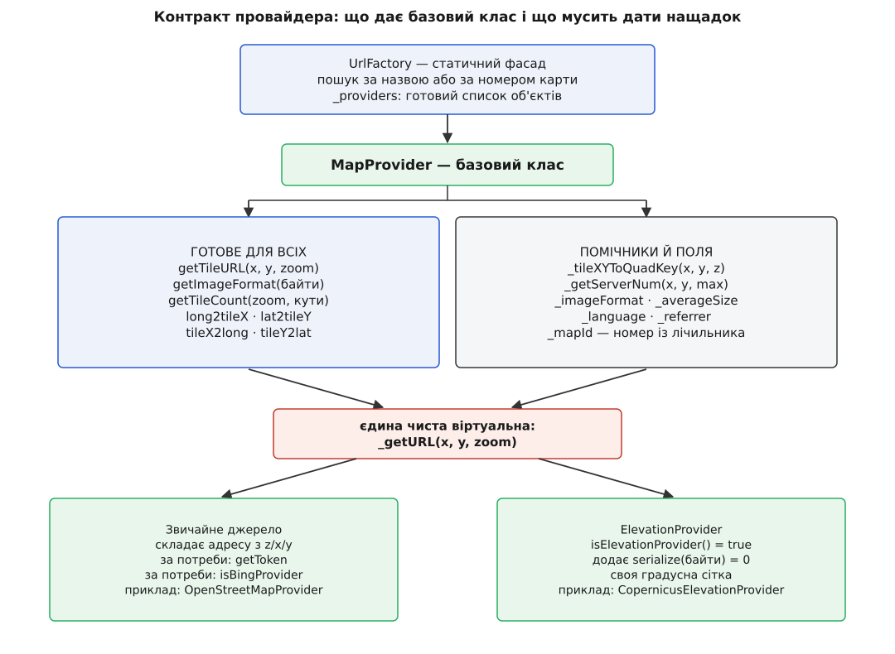

# 🔌 Контракт провайдера карти: базовий клас, статичний реєстр, ключ тайла

Тут зібрано все, що треба, щоб додати до QGroundControl власне джерело тайлів або розібрати чуже: повний публічний зріз класу `MapProvider` із типами й типовими тілами, перелік того, що базовий клас відповідає сам, помічники, які він дає нащадкові в руки, статичний фасад `UrlFactory` з поведінкою кожного методу при невдачі, точний формат ключа тайла, порядок реєстру та окремий контракт `ElevationProvider`. Довідник потрібен, щоб перевизначати рівно те, що справді треба, і наперед бачити місця, де помилка не впаде, а тихо віддасть неправильну карту.

Звірено з гілкою `master` репозиторію `mavlink/qgroundcontrol` 2 серпня 2026 року. Файли: `src/QtLocationPlugin/Providers/` (`MapProvider.h|.cpp`, `ElevationMapProvider.h|.cpp`, `GenericMapProvider.h|.cpp`, `BingMapProvider.h`, `GoogleMapProvider.h|.cpp`, `EsriMapProvider.h|.cpp`, `MapboxMapProvider.h`, `TianDiTuProvider.h`), `src/QtLocationPlugin/` (`QGCMapUrlEngine.h|.cpp`, `QGCTileSet.h`, `QGeoTileFetcherQGC.cpp`, `QGeoTiledMappingManagerEngineQGC.cpp`), `src/Terrain/Providers/TerrainTileCopernicus.h`.



*Уся обов'язкова частина контракту — одна чиста віртуальна функція; решта ієрархії існує, щоб нащадкові не довелося писати нічого іншого.*

---

## Дві сталі, оголошені разом із базовим класом

| Ім'я | Вид | Значення | На що впливає |
|---|---|---|---|
| `QGC_MAX_MAP_ZOOM` | `#define` у `MapProvider.h` | `23` | верхня межа камери; стеля, до якої `UrlFactory::getTileCount` обрізає аргумент `zoom` |
| `QGC_AVERAGE_TILE_SIZE` | `static constexpr quint32` | `13652` | типовий середній розмір тайла в байтах; він же — відповідь `averageSizeForType`, коли провайдера не знайдено |

Обидві видно з будь-якого файлу, що вмикає `MapProvider.h`, — тобто з усіх провайдерів і з рушія карти.

---

## `MapProvider`: публічний зріз

```cpp
class MapProvider
{
public:
    enum MapStyle { NoMap = 0, StreetMap, SatelliteMapDay, SatelliteMapNight,
                    TerrainMap, HybridMap, TransitMap, GrayStreetMap,
                    PedestrianMap, CarNavigationMap, CycleMap, CustomMap = 100 };

    MapProvider(const QString &mapName, const QString &referrer, const QString &imageFormat,
                quint32 averageSize = QGC_AVERAGE_TILE_SIZE, MapStyle mapStyle = CustomMap);
    virtual ~MapProvider();

    QUrl    getTileURL(int x, int y, int zoom) const;
    QString getImageFormat(QByteArrayView image) const;

    quint32        getAverageSize() const { return _averageSize; }
    MapStyle       getMapStyle()    const { return _mapStyle; }
    const QString &getMapName()     const { return _mapName; }
    int            getMapId()       const { return _mapId; }
    const QString &getReferrer()    const { return _referrer; }

    virtual QByteArray getToken() const { return QByteArray(); }

    virtual int    long2tileX(double lon, int z) const;
    virtual int    lat2tileY(double lat, int z) const;
    virtual double tileX2long(int x, int z) const;
    virtual double tileY2lat(int y, int z) const;

    virtual bool isElevationProvider() const { return false; }
    virtual bool isBingProvider()      const { return false; }

    virtual QGCTileSet getTileCount(int zoom, double topleftLon, double topleftLat,
                                    double bottomRightLon, double bottomRightLat) const;

protected:
    QString _tileXYToQuadKey(int tileX, int tileY, int levelOfDetail) const;
    int     _getServerNum(int x, int y, int max) const;

    virtual QString _getURL(int x, int y, int zoom) const = 0;

    const QString  _mapName;
    const QString  _referrer;
    const QString  _imageFormat;
    const quint32  _averageSize;
    const MapStyle _mapStyle;
    const QString  _language;
    const int      _mapId;

private:
    static int _mapIdIndex;
};
```

Клас не успадковує `QObject` і не має сигналів: провайдер — це незмінна купка сталих плюс одна функція. Усі поля оголошені `const`, тож після конструктора нічого не міняється, і той самий об'єкт безпечно читають різні нитки. Живуть провайдери під `std::shared_ptr<const MapProvider>`, для якого в `QGCMapUrlEngine.h` заведено скорочення `SharedMapProvider` (і `SharedElevationProvider` для висот).

### Аргументи конструктора

| Аргумент | Тип | Типово | Що з ним стається далі |
|---|---|---|---|
| `mapName` | `QString` | — | **первинний ідентифікатор**: за цим рядком провайдера шукають усюди, він же йде в QML як назва типу карти й у файл налаштувань |
| `referrer` | `QString` | — | підставляється в заголовок `Referer` запиту, **але лише якщо непорожній** |
| `imageFormat` | `QString` | — | запасна відповідь `getImageFormat`, коли байти не впізнано за підписом |
| `averageSize` | `quint32` | `QGC_AVERAGE_TILE_SIZE` | множник в оцінці ваги району; на розмір самих запитів не впливає |
| `mapStyle` | `MapStyle` | `CustomMap` | групування джерел в інтерфейсі; передається у `QGeoMapType` як `MapStyle` |

Поле `_language` конструктор заповнює сам — першою мовою з `QLocale::system().uiLanguages()`, а якщо список порожній, то рядком `en`. Нащадок може підставити його в адресу (так робить Google через параметр `hl`), але задати ззовні не може.

Поле `_mapId` теж заповнює конструктор, і саме воно робить порядок реєстру значущим:

```cpp
int MapProvider::_mapIdIndex = 1;          // QtLocation вимагає, щоб номери йшли з 1 підряд
…
    , _mapId(_mapIdIndex++)
```

Номер видається **лічильником у порядку створення об'єктів**. Оскільки всі провайдери створюються один раз, у порядку запису в статичному списку `UrlFactory::_providers`, номер дорівнює позиції в цьому списку.

### `MapStyle`: значення й дзеркало

| Ім'я | Значення | Ім'я | Значення |
|---|---|---|---|
| `NoMap` | `0` | `TransitMap` | `6` |
| `StreetMap` | `1` | `GrayStreetMap` | `7` |
| `SatelliteMapDay` | `2` | `PedestrianMap` | `8` |
| `SatelliteMapNight` | `3` | `CarNavigationMap` | `9` |
| `TerrainMap` | `4` | `CycleMap` | `10` |
| `HybridMap` | `5` | `CustomMap` | `100` |

Це навмисна копія переліку `QGeoMapType::MapStyle` — заведена для того, щоб публічний заголовок провайдера не тягнув за собою приватний заголовок фреймворку. Копія не може розійтися з оригіналом непомітно: у `MapProvider.cpp` на кожен елемент стоїть `static_assert`, тож розбіжність зупинить збірку, а не з'явиться в роботі.

---

## Що базовий клас відповідає сам

Нащадкові не треба чіпати нічого з цього списку, поки джерело поводиться як звичайна тайлова служба.

| Метод | Тіло базового класу |
|---|---|
| `getTileURL(x, y, zoom)` | `QUrl(_getURL(x, y, zoom))` — єдиний перехід від рядка до адреси |
| `getImageFormat(image)` | розпізнавання за підписом, інакше `_imageFormat` |
| `long2tileX` / `lat2tileY` | пряме перетворення Web Mercator |
| `tileX2long` / `tileY2lat` | зворотне перетворення |
| `getTileCount(zoom, кути)` | номери кутових клітинок, добуток, множення на `getAverageSize()` |
| `getToken()` | порожній `QByteArray` |
| `isElevationProvider()` / `isBingProvider()` | `false` |

### Розпізнавання формату за першими байтами

```cpp
QString MapProvider::getImageFormat(QByteArrayView image) const
{
    if (image.size() < 3) { return QString(); }
    if (image.startsWith("\x89\x50\x4E\x47\x0D\x0A\x1A\x0A")) { return QStringLiteral("png"); }
    if (image.startsWith("\xFF\xD8\xFF"))                     { return QStringLiteral("jpg"); }
    if (image.startsWith("\x47\x49\x46\x38"))                 { return QStringLiteral("gif"); }
    return _imageFormat;
}
```

| Підпис | Байти | Відповідь |
|---|---|---|
| PNG | `89 50 4E 47 0D 0A 1A 0A` | `png` |
| JPEG | `FF D8 FF` | `jpg` |
| GIF | `47 49 46 38` (`GIF8`) | `gif` |
| нічого з переліченого | — | `_imageFormat` із конструктора |
| менше трьох байтів | — | порожній `QString` |

Тобто оголошений у конструкторі формат — це не заявка, а **запасний варіант**: сервер може віддати jpg замість png, і кеш запише правильний формат попри оголошення. Зворотний бік: провайдер, у якого `imageFormat` порожній (так у сімействі Esri), при нерозпізнаних байтах поверне порожній рядок.

### Геометрія: сітка Web Mercator

```cpp
int MapProvider::long2tileX(double lon, int z) const
{
    return static_cast<int>(floor((lon + 180.0) / 360.0 * pow(2.0, z)));
}

int MapProvider::lat2tileY(double lat, int z) const
{
    return static_cast<int>(floor((1.0 - log(tan(lat * M_PI / 180.0)
                                 + 1.0 / cos(lat * M_PI / 180.0)) / M_PI) / 2.0 * pow(2.0, z)));
}
```

У звичних позначеннях, з `n = 2ᶻ`:

```
x = ⌊ n · (λ + 180) / 360 ⌋
y = ⌊ n · (1 − ln(tan φ + sec φ) / π) / 2 ⌋

λ = tileX2long(x, z) = x / 2ᶻ · 360 − 180
φ = tileY2lat(y, z)  = atan( sinh( π − 2π · y / 2ᶻ ) )     у градусах
```

Пряма й зворотна пари не симетричні за змістом: `long2tileX` дає **номер клітинки**, а `tileX2long` — довготу її **лівого краю**. Чому вісь y росте на південь і звідки береться логарифм тангенса, розкладено у [Web Mercator і тайловій сітці](root:math-geometry/web-mercator-tiles) — там же межа ±85.05°, за якою ці формули втрачають сенс.

### `getTileCount` і `QGCTileSet`

```cpp
struct QGCTileSet
{
    QGCTileSet &operator+=(const QGCTileSet &other);   // додає tileCount і tileSize
    void clear();

    int     tileX0 = 0,  tileX1 = 0;
    int     tileY0 = 0,  tileY1 = 0;
    quint64 tileCount = 0;
    quint64 tileSize  = 0;
};
```

| Поле | Що містить після базового `getTileCount` |
|---|---|
| `tileX0`, `tileY0` | клітинка верхнього лівого кута прямокутника |
| `tileX1`, `tileY1` | клітинка нижнього правого кута |
| `tileCount` | `(tileX1 − tileX0 + 1) · (tileY1 − tileY0 + 1)` |
| `tileSize` | `tileCount · getAverageSize()` — **оцінка в байтах**, не виміряна величина |

Оператор `+=` додає лише `tileCount` і `tileSize`, а межі лишає від лівого доданка. Це навмисно: набір для офлайну складається з кількох рівнів, і сумарна вага має сенс, а сумарний прямокутник — ні. Як із цієї оцінки виходить рядок «стільки-то мегабайтів» перед завантаженням району — в [офлайн-картах](root:sys-dron/offline-maps).

---

## Що зобов'язаний дати нащадок

```cpp
virtual QString _getURL(int x, int y, int zoom) const = 0;
```

Це єдина чиста віртуальна функція контракту. Вона `protected`, тож ззовні провайдера викликати її не можна — тільки через публічний `getTileURL`.

| Що перевизначають | Коли це потрібно | Хто так робить у чинному коді |
|---|---|---|
| `_getURL` | завжди | усі |
| `getToken()` | коли ключ доступу йде **заголовком**, а не в адресі | сімейство `EsriMapProvider` |
| `isBingProvider()` | коли треба відрізняти заглушку «немає тайла» | `BingMapProvider` |
| `long2tileX` / `lat2tileY` / `getTileCount` | коли сітка не меркаторська | `CopernicusElevationProvider` |
| `isElevationProvider()` | ніколи вручну | закріплено як `final` у `ElevationProvider` |

Найкоротший робочий приклад — вуличні тайли OpenStreetMap:

```cpp
class OpenStreetMapProvider : public MapProvider
{
public:
    OpenStreetMapProvider()
        : MapProvider(QStringLiteral("Street Map"),
                      QStringLiteral("https://www.openstreetmap.org"),
                      QStringLiteral("png"),
                      QGC_AVERAGE_TILE_SIZE,
                      MapProvider::StreetMap) {}
private:
    QString _getURL(int x, int y, int zoom) const final { return _mapUrl.arg(zoom).arg(x).arg(y); }

    const QString _mapUrl = QStringLiteral("http://tile.openstreetmap.org/%1/%2/%3.png");
};
```

Порядок підстановки в шаблон — не формальність: кожна служба розклала ті самі три числа по-своєму, і помилка тут дає не збій, а тайл з іншого місця світу.

| Провайдер | Порядок аргументів у `_mapUrl` |
|---|---|
| `OpenStreetMapProvider` | `zoom, x, y` |
| `EsriMapProvider` | `_mapTypeId, zoom, y, x` |
| `StatkartMapProvider`, `SvalbardMapProvider` | `zoom, y, x` |
| `EniroMapProvider` | `zoom, x, (1 << zoom) − 1 − y` — вісь y перевернута (угода TMS) |
| `MapQuestMapProvider` | `_getServerNum(x, y, 4), _mapName, zoom, x, y, _imageFormat` |

Різні угоди адресації — XYZ, TMS, WMTS, квадроключ — і те, чим вони насправді відрізняються, крім запису, розібрано в [адресних схемах тайлових сервісів](root:sf-visual/tile-url-schemes). Сам візерунок «базовий клас веде весь порядок дій, нащадок дає одну відсутню операцію» — це [шаблонний метод](root:sf-apps/template-method) у найчистішому вигляді.

---

## Помічники базового класу

Обидва `protected` і `const`: вони не міняють провайдера, а існують, щоб `_getURL` не переписував ту саму арифметику.

### `_tileXYToQuadKey` — адресація Bing

```cpp
QString MapProvider::_tileXYToQuadKey(int tileX, int tileY, int levelOfDetail) const
{
    QString quadKey;
    for (int i = levelOfDetail; i > 0; i--) {
        char digit = '0';
        const int mask = 1 << (i - 1);
        if ((tileX & mask) != 0) { digit++; }
        if ((tileY & mask) != 0) { digit += 2; }
        quadKey.append(digit);
    }
    return quadKey;
}
```

Цифра на кожному рівні — це `біт x + 2 · біт y`, тобто номер чверті. Довжина рядка дорівнює рівню масштабу.

**Приклад: z = 4, x = 9, y = 5.**

```
x = 9 = 1001₂        y = 5 = 0101₂
             біт x   біт y   цифра = x + 2·y
i = 4 (маска 8):  1      0        1
i = 3 (маска 4):  0      1        2
i = 2 (маска 2):  0      0        0
i = 1 (маска 1):  1      1        3

квадроключ = "1203"
```

Наслідок, який використовують сховища: **префікс квадроключа — це предок тайла**, тож `"120"` — батько для всіх чотирьох клітинок `"1200"…"1203"`.

Шаблон адреси Bing, куди цей рядок лягає:

```cpp
const QString _mapUrl = QStringLiteral("http://ecn.t%1.tiles.virtualearth.net/tiles/%2%3.%4?g=%5&mkt=%6");
const QString _versionBingMaps = QStringLiteral("2981");
```

### `_getServerNum` — розкидання по іменах серверів

```cpp
int MapProvider::_getServerNum(int x, int y, int max) const { return (x + 2 * y) % max; }
```

**Приклад: три сусідні клітинки в ряд, `max = 4`.**

```
y = 88388,  2·y = 176776

x = 153296 → (153296 + 176776) % 4 = 330072 % 4 = 0   →  mt0
x = 153297 → 330073 % 4 = 1                           →  mt1
x = 153298 → 330074 % 4 = 2                           →  mt2
```

Формула навмисно бере обидві координати з вагою 2 на y: сусіди по горизонталі й по вертикалі потрапляють на різні імена, тож видимий прямокутник рівномірно розподіляється між чотирма серверами, а не б'є в один. У чинному коді її кличуть, зокрема, `GoogleMapProvider` і `MapQuestMapProvider` — обидва з `max = 4`.

---

## Токен доступу: два різні шляхи

Контракт не нав'язує одного способу — і в коді живуть обидва.

**Шлях 1 — заголовком.** Провайдер перевизначає `getToken()`, а добувач тайлів вставляє відповідь у запит:

```cpp
// EsriMapProvider.cpp
QByteArray EsriMapProvider::getToken() const
{
    return SettingsManager::instance()->appSettings()->esriToken()->rawValue().toString().toUtf8();
}

// QGeoTileFetcherQGC.cpp
const QByteArray token = mapProvider->getToken();
if (!token.isEmpty()) {
    request.setRawHeader(QByteArrayLiteral("User-Token"), token);
}
```

Заголовок називається `User-Token`; порожня відповідь означає «заголовка не буде».

**Шлях 2 — усередині адреси.** Провайдер сам читає налаштування у своєму `_getURL`:

| Провайдер | Куди лягає ключ |
|---|---|
| `OpenAIPMapProvider` | `?apiKey=…` дописується в кінець, якщо ключ непорожній |
| `VWorldMapProvider` | перший аргумент шаблону адреси |
| `TianDiTuProvider` | параметр `tk=` у шаблоні `https://t%1.tianditu.gov.cn/DataServer?tk=%2&T=%3&x=%4&y=%5&l=%6` |

Обидва шляхи ведуть в те саме сховище налаштувань застосунку, звідки значення [переживає перезапуск](root:sys-dron/settings-persistence). Практична різниця одна й важлива: ключ, вставлений в адресу, стає **частиною URL** — а отже, потрапляє в журнали, у мережевий кеш фреймворку й у будь-який знімок трафіку.

---

## `UrlFactory`: статичний фасад

Клас без стану, без конструктора й без примірників — самі статичні функції над одним статичним списком.

```cpp
class UrlFactory
{
public:
    static QString getImageFormat(QStringView type, QByteArrayView image);
    static QString getImageFormat(int qtMapId,      QByteArrayView image);

    static QUrl getTileURL(QStringView type, int x, int y, int zoom);
    static QUrl getTileURL(int qtMapId,      int x, int y, int zoom);

    static quint32 averageSizeForType(QStringView type);
    static bool    isElevation(int qtMapId);

    static int long2tileX(QStringView mapType, double lon, int z);
    static int lat2tileY(QStringView mapType, double lat, int z);

    static QGCTileSet getTileCount(int zoom, double topleftLon, double topleftLat,
                                   double bottomRightLon, double bottomRightLat,
                                   QStringView mapType);

    static const QList<SharedMapProvider> &getProviders();
    static QStringList getProviderTypes();
    static QStringList getElevationProviderTypes();

    static int     getQtMapIdFromProviderType(QStringView type);
    static QString getProviderTypeFromQtMapId(int qtMapId);
    static SharedMapProvider getMapProviderFromQtMapId(int qtMapId);
    static SharedMapProvider getMapProviderFromProviderType(QStringView type);

    static int     hashFromProviderType(QStringView type);
    static QString providerTypeFromHash(int hash);
    static QString tileHashToType(QStringView tileHash);
    static QString getTileHash(QStringView type, int x, int y, int z);

private:
    static const QList<SharedMapProvider> _providers;
};
```

Усі пошуки — лінійний перебір списку зі звіркою рядка або числа; жодних мап і жодного кешування. Відповідь при невдачі скрізь тиха, і саме її треба знати напам'ять:

| Метод | Що робить | Коли провайдера не знайдено |
|---|---|---|
| `getTileURL(type\|id, x, y, zoom)` | `provider->getTileURL(…)` | порожній `QUrl()` |
| `getImageFormat(type\|id, image)` | `provider->getImageFormat(image)` | порожній `QString()` |
| `averageSizeForType(type)` | `provider->getAverageSize()` | **`QGC_AVERAGE_TILE_SIZE`** — тобто 13652 |
| `isElevation(qtMapId)` | `provider->isElevationProvider()` | `false` |
| `long2tileX` / `lat2tileY` | делегує провайдерові | **`0`** — координата, а не помилка |
| `getTileCount(…)` | обрізає `zoom` до `1…QGC_MAX_MAP_ZOOM`, делегує | порожній `QGCTileSet()` (усі нулі) |
| `hashFromProviderType(type)` | повертає `getMapId()` | **`−1`** + попередження в журнал |
| `providerTypeFromHash(hash)` | зворотний пошук за номером | порожній `QString()` |
| `getQtMapIdFromProviderType(type)` | номер карти за назвою | `−1`; на порожній рядок теж `−1`, без журналу |
| `getProviderTypeFromQtMapId(id)` | назва за номером | порожній `QString()`; на `−1` теж, без журналу |
| `getMapProviderFromQtMapId(id)` | сам об'єкт за номером | `nullptr`; на `−1` теж, без журналу |
| `getMapProviderFromProviderType(type)` | сам об'єкт за назвою | `nullptr`; на порожній рядок теж |

Два рядки цієї таблиці вимагають окремої уваги. `long2tileX` при невідомому типі повертає **нуль** — цілком правдоподібний номер клітинки біля антимеридіана, який ніде далі не відрізнити від справжнього. А `averageSizeForType` тихо підставляє загальну сталу: оцінка ваги району при друкарській помилці в назві не впаде, а просто збреше — для супутникових знімків у чотири рази применшить.

### Ключ тайла: `%010d%08d%08d%03d`

```cpp
QString UrlFactory::getTileHash(QStringView type, int x, int y, int z)
{
    const int hash = hashFromProviderType(type);
    return QString::asprintf("%010d%08d%08d%03d", hash, x, y, z);
}

QString UrlFactory::tileHashToType(QStringView tileHash)
{
    return providerTypeFromHash(tileHash.mid(0, 10).toInt());
}
```

| Поле | Позиції | Ширина | Джерело |
|---|---|---|---|
| номер провайдера | 0–9 | 10 | `hashFromProviderType(type)` = `_mapId` |
| `x` | 10–17 | 8 | номер клітинки по довготі |
| `y` | 18–25 | 8 | номер клітинки по широті |
| `z` | 26–28 | 3 | рівень масштабу |
| **разом** | | **29** | рядок сталої довжини |

**Приклад: центр Києва, z = 18, провайдер `Bing Road` (шостий у списку).**

```
λ = 30.52°,  φ = 50.45°,  n = 2¹⁸ = 262144

x = ⌊ 262144 · (30.52 + 180) / 360 ⌋            = 153296
y = ⌊ 262144 · (1 − ln(tan φ + sec φ)/π) / 2 ⌋  =  88388

          провайдер      x          y        z
ключ = "0000000006" "00153296" "00088388" "018"
     = "00000000060015329600088388018"          — 29 символів
```

Ширини вибрано з запасом рівно під межу камери: на `z = 23` найбільший можливий номер клітинки — `2²³ − 1 = 8388607`, сім цифр, тож вісім позицій ніколи не переповняться, а три позиції під рівень покривають `23` з великим запасом.

А от невдалий пошук ширину не ламає, і це найнеприємніша деталь усього формату:

```
hashFromProviderType("Bnig Road")  →  −1              (друкарська помилка в назві)

getTileHash(…)  →  "-0000000010015329600088388018"    — теж рівно 29 символів
tileHashToType(…)  →  mid(0,10) = "-000000001" → toInt() = −1 → ""
```

Ключ виходить синтаксично бездоганний: правильна довжина, правильні поля, впевнено лягає в базу як унікальний рядок. Тільки провайдера з номером `−1` не існує, тож усе, збережене під ним, назавжди осідає в кеші сміттям, яке ніхто ніколи не спитає. Це підручниковий випадок [ключа, що не витримує власних крайніх значень](root:sf-distributed/cache-key-design): формат передбачив ширину, але не передбачив відсутність.

---

## Реєстр `_providers`: позиція визначає номер

Список — статична константа в `QGCMapUrlEngine.cpp`. Порядок запису й тільки він задає `_mapId` кожного провайдера, тобто число, яке потім лежить у ключі кожного тайла на диску.

| № | Клас | № | Клас |
|---|---|---|---|
| 1 | `GoogleStreetMapProvider` ⚠ | 21 | `MapboxSatelliteMapProvider` |
| 2 | `GoogleSatelliteMapProvider` ⚠ | 22 | `MapboxHybridMapProvider` |
| 3 | `GoogleTerrainMapProvider` ⚠ | 23 | `MapboxStreetsBasicMapProvider` |
| 4 | `GoogleHybridMapProvider` ⚠ | 24 | `MapboxOutdoorsMapProvider` |
| 5 | `GoogleLabelsMapProvider` ⚠ | 25 | `MapboxBrightMapProvider` |
| 6 | `BingRoadMapProvider` | 26 | `MapboxCustomMapProvider` |
| 7 | `BingSatelliteMapProvider` | 27 | `MapQuestMapMapProvider` |
| 8 | `BingHybridMapProvider` | 28 | `MapQuestSatMapProvider` |
| 9 | `TianDiTuRoadProvider` | 29 | `VWorldStreetMapProvider` |
| 10 | `TianDiTuSatelliteProvider` | 30 | `VWorldSatMapProvider` |
| 11 | `StatkartTopoMapProvider` | 31 | `JapanStdMapProvider` |
| 12 | `StatkartBaseMapProvider` | 32 | `JapanSeamlessMapProvider` |
| 13 | `SvalbardMapProvider` | 33 | `JapanAnaglyphMapProvider` |
| 14 | `EniroMapProvider` | 34 | `JapanSlopeMapProvider` |
| 15 | `EsriWorldStreetMapProvider` | 35 | `JapanReliefMapProvider` |
| 16 | `EsriWorldSatelliteMapProvider` | 36 | `LINZBasemapMapProvider` |
| 17 | `EsriTerrainMapProvider` | 37 | `OpenStreetMapProvider` |
| 18 | `MapboxStreetMapProvider` | 38 | `OpenAIPMapProvider` |
| 19 | `MapboxLightMapProvider` | 39 | `CustomURLMapProvider` |
| 20 | `MapboxDarkMapProvider` | 40 | `CopernicusElevationProvider` |

⚠ П'ять google-провайдерів обгорнуто в `#ifndef QGC_NO_GOOGLE_MAPS`. У збірці з цим макросом їх у списку немає — і **весь хвіст піднімається на п'ять позицій**: `BingRoadMapProvider` дістає номер 1 замість 6, `CopernicusElevationProvider` — 35 замість 40. Ключ тайла, записаного іншою збіркою, лишається формально валідним і розшифровується неправильно. Що ще міняє макрос і як зібрати продукт із власним переліком джерел — у [власній збірці](root:sys-dron/custom-build).

Звірені параметри тих родин, чиї заголовки видно повністю:

| `getMapName()` | Формат | `averageSize` | `MapStyle` |
|---|---|---|---|
| `Google Street Map` | `png` | `4913` | `StreetMap` |
| `Google Satellite` | `jpg` | `56887` | `SatelliteMapDay` |
| `Google Terrain` | `png` | `19391` | `TerrainMap` |
| `Google Hybrid` | `png` | `56887` | `HybridMap` |
| `Bing Road` | `png` | `1297` | `StreetMap` |
| `Bing Satellite` | `jpg` | `19597` | `SatelliteMapDay` |
| `Bing Hybrid` | `jpg` | `19597` | `HybridMap` |
| `TianDiTu Road` | `png` | `1297` | `StreetMap` |
| `TianDiTu Satellite` | `jpg` | `19597` | `SatelliteMapDay` |
| `Esri World Street` | *порожній* | `13652` | `StreetMap` |
| `Esri World Satellite` | *порожній* | `13652` | `SatelliteMapDay` |
| `Esri Terrain` | *порожній* | `13652` | `TerrainMap` |
| `Mapbox Streets` | `jpg` | `5648` | `StreetMap` |
| `Mapbox Satellite` | `jpg` | `15739` | `SatelliteMapDay` |
| `Mapbox Hybrid` | `jpg` | `15739` | `HybridMap` |
| `Street Map` (OpenStreetMap) | `png` | `13652` | `StreetMap` |
| `OpenAIP` | `png` | `13652` | `CustomMap` |
| `CustomURL Custom` | *порожній* | `13652` | `CustomMap` |
| `Copernicus` | `bin` | `2786` | `TerrainMap` |

Три деталі, помітні лише в таблиці. Назва провайдера OpenStreetMap — просто `Street Map`, без згадки служби; саме цей рядок лежить у налаштуваннях користувача. Сімейство Esri оголошує **порожній referrer** — тож заголовка `Referer` у його запитах не буде взагалі, бо добувач ставить його лише для непорожнього рядка. І провайдер `CustomURL Custom` бере шаблон з налаштувань, підставляючи в нього три числа:

```cpp
QString url = SettingsManager::instance()->appSettings()->customURL()->rawValue().toString();
url.replace("{x}", QString::number(x));
url.replace("{y}", QString::number(y));
static const QRegularExpression zoomRegExp("\\{(z|zoom)\\}");
url.replace(zoomRegExp, QString::number(zoom));
```

Приймаються дві форми запису рівня — `{z}` і `{zoom}`; для x та y синонімів немає.

### Як реєстр стає списком типів карти

```cpp
for (const SharedMapProvider &provider : UrlFactory::getProviders()) {
    mapList.append(QGeoMapType(static_cast<QGeoMapType::MapStyle>(provider->getMapStyle()),
                               provider->getMapName(),      // назва
                               provider->getMapName(),      // опис — той самий рядок
                               false, false,
                               provider->getMapId(),        // mapId фреймворку = _mapId
                               QByteArrayLiteral("QGroundControl"),
                               cameraCapabilities()));
}
setSupportedMapTypes(mapList);
```

Звідси видно замикання кола: `mapId`, з яким фреймворк потім приходить по кожен тайл (`spec.mapId()`), — це той самий лічильник із конструктора провайдера, і той самий номер у перших десяти цифрах ключа.

---

## `ElevationProvider`: провайдер, у якого немає пікселів

```cpp
class ElevationProvider : public MapProvider
{
protected:
    ElevationProvider(const QString &mapName, const QString &referrer, const QString &imageFormat,
                      quint32 averageSize, MapProvider::MapStyle mapType)
        : MapProvider(mapName, referrer, imageFormat, averageSize, mapType) {}

public:
    bool isElevationProvider() const final { return true; }
    virtual QByteArray serialize(const QByteArray &image) const = 0;
};
```

Проміжний клас додає до контракту рівно дві речі: закріплює `isElevationProvider()` як `true` без права перевизначення й вимагає другу чисту віртуальну — `serialize`. Конструктор `protected`, тож самостійно `ElevationProvider` не створюється.

| Метод | Хто його кличе | Навіщо |
|---|---|---|
| `serialize(image)` | конвеєр запису тайла — **перед** тим, як покласти байти в базу | перепакувати відповідь служби в щільний двійковий вигляд |
| `isElevationProvider()` | `UrlFactory::isElevation(qtMapId)`; `getElevationProviderTypes()` | відсіяти висоти від картинок у списках |

Єдина реалізація — `CopernicusElevationProvider`:

```cpp
class CopernicusElevationProvider : public ElevationProvider
{
public:
    CopernicusElevationProvider()
        : ElevationProvider(kProviderKey, kProviderURL, QStringLiteral("bin"),
                            kAvgElevSize, MapProvider::TerrainMap) {}

    int long2tileX(double lon, int z) const final;
    int lat2tileY(double lat, int z) const final;
    QGCTileSet getTileCount(int zoom, double topleftLon, double topleftLat,
                            double bottomRightLon, double bottomRightLat) const final;
    QByteArray serialize(const QByteArray &image) const final;

    static constexpr const char *kProviderKey    = "Copernicus";
    static constexpr const char *kProviderNotice = "© Airbus Defence and Space GmbH";
    static constexpr const char *kProviderURL    = "https://terrain-ce.suite.auterion.com";
    static constexpr quint32     kAvgElevSize    = 2786;

private:
    QString _getURL(int x, int y, int zoom) const final;

    const QString _mapUrl = QString(kProviderURL) + QStringLiteral("/api/v1/carpet?points=%1,%2,%3,%4");
};
```

### Градусна сітка замість меркаторської

```cpp
int CopernicusElevationProvider::long2tileX(double lon, int z) const
{
    Q_UNUSED(z)
    return static_cast<int>(floor((lon + 180.0) / TerrainTileCopernicus::kTileSizeDegrees));
}

int CopernicusElevationProvider::lat2tileY(double lat, int z) const
{
    Q_UNUSED(z)
    return static_cast<int>(floor((lat + 90.0) / TerrainTileCopernicus::kTileSizeDegrees));
}
```

| Стала (`TerrainTileCopernicus`) | Значення | Що означає |
|---|---|---|
| `kTileSizeDegrees` | `0.01` | сторона клітинки в градусах — 36 кутових секунд |
| `kTileValueSpacingDegrees` | `1.0 / 3600` | крок між сусідніми висотами — одна кутова секунда |
| `kTileValueSpacingMeters` | `30.0` | той самий крок у метрах |

Дві відмінності від меркаторської сітки видно просто з коду. Перша: **`z` ігнорується** — клітинка одна на всі рівні масштабу, тож у ключі тайла третє поле не несе інформації, а просто повторює рівень, з яким запитали. Друга, підступніша: **вісь y тут росте на північ**, бо номер рахується від −90°, тоді як у меркаторській сітці y росте на південь. Саме тому перевизначений `getTileCount` міняє кути місцями:

```cpp
set.tileY0 = lat2tileY(bottomRightLat, zoom);   // а не topleftLat, як у базовому класі
set.tileY1 = lat2tileY(topleftLat, zoom);
```

**Приклад: точка φ = 50.4501°, λ = 30.5233°.**

```
крок Δ = 0.01°

x = ⌊ (30.5233 + 180) / 0.01 ⌋ = ⌊ 21052.33 ⌋ = 21052
y = ⌊ (50.4501 +  90) / 0.01 ⌋ = ⌊ 14045.01 ⌋ = 14045

кути клітинки:
lat1 = 14045 · 0.01 − 90 = 50.45      lon1 = 21052 · 0.01 − 180 = 30.52
lat2 = 14046 · 0.01 − 90 = 50.46      lon2 = 21053 · 0.01 − 180 = 30.53

адреса = .../api/v1/carpet?points=50.45,30.52,50.46,30.53
```

Розмір клітинки на цій широті:

```
по широті   = 0.01 · 111320                = 1113 м
по довготі  = 0.01 · 111320 · cos 50.45°   =  709 м
```

Тобто «тайл» висот — це прямокутник близько кілометра, всередині якого 36 × 36 значень із кроком у тридцять метрів. Що це за модель рельєфу й чим вона відрізняється від справжньої поверхні землі — у [моделі рельєфу й профілі висот](root:sf-visual/terrain-elevation-model).

> ⚠ **Межа клітинки й подвійна точність.** Ділення на `0.01` не є точним у двійковій рухомій комі. Для координати рівно на межі сітки — φ = 50.45° — вираз `(50.45 + 90.0) / 0.01` дає `14044.999999999998`, і `floor` повертає **14044**, тобто клітинку на південь від очікуваної. На звичайних координатах це непомітно, але при звірці меж району або при написанні тестів на рівні числа розбіжність в одну клітинку береться саме звідси.

### `serialize`

```cpp
QByteArray CopernicusElevationProvider::serialize(const QByteArray &image) const
{
    return TerrainTileCopernicus::serializeFromData(image);
}
```

Служба відповідає у JSON, а в базу лягає щільний двійковий блок — саме тому оголошений формат провайдера `bin`, а не `png`. Далі цей блок для всієї станції неможливо відрізнити від картинки: той самий ключ, та сама таблиця, те саме витіснення. Як із цих блоків виходить профіль висоти вздовж маршруту — в [рельєфі та режимах висоти](root:sys-dron/terrain-and-altitude).

---

## Мінімальне додавання власного провайдера

Три кроки, з яких помилитися можна лише в третьому.

**1. Клас.** Достатньо заголовка — реалізація вміщується в рядок:

```cpp
// MyOrthoMapProvider.h
class MyOrthoMapProvider : public MapProvider
{
public:
    MyOrthoMapProvider()
        : MapProvider(QStringLiteral("Ortho Rescue"),          // ім'я → налаштування й ключ
                      QStringLiteral("https://gis.example.org"),
                      QStringLiteral("jpg"),
                      42000,                                    // виміряний середній тайл
                      MapProvider::SatelliteMapDay) {}
private:
    QString _getURL(int x, int y, int zoom) const final { return _mapUrl.arg(zoom).arg(x).arg(y); }

    const QString _mapUrl = QStringLiteral("https://gis.example.org/tiles/%1/%2/%3.jpg");
};
```

**2. Вмикання.** Додати `#include` у `QGCMapUrlEngine.cpp`.

**3. Реєстрація — тільки в кінець списку:**

```cpp
const QList<SharedMapProvider> UrlFactory::_providers = {
    …
    std::make_shared<CustomURLMapProvider>(),
    std::make_shared<CopernicusElevationProvider>(),
    std::make_shared<MyOrthoMapProvider>(),          // ← сюди, і нікуди інакше
};
```

Вставка в середину зсуває номери всіх наступних провайдерів, а разом із ними — сенс уже записаних на диску ключів. Ні компілятор, ні база не побачать нічого дивного.

---

## Пастки контракту, помітні лише під час роботи

| Що зроблено | Що зламається | Чому мовчки |
|---|---|---|
| провайдера вставлено в середину списку | старі тайли на диску починають належати іншому джерелу — супутник замість схеми | номер видає лічильник за позицією, а не стала |
| збірку зроблено з `QGC_NO_GOOGLE_MAPS` і взято чужий кеш | той самий зсув, тільки на п'ять позицій | ключ формально валідний, довжина правильна |
| у назві типу карти є друкарська помилка | тайли пишуться під номером `−1` і не читаються ніколи | `asprintf` формує рівно 29 символів і для `−1` |
| перейменовано `mapName` наявного провайдера | увесь його кеш стає недосяжним, налаштування користувача теж | назва — первинний ідентифікатор, а не підпис |
| у шаблоні адреси переставлено `x` і `y` | карта показує тайли з іншого місця світу | обидва числа валідні, сервер відповідає `200` |
| `averageSize` узято зі стелі | оцінка ваги району бреше в рази ще до першого запиту | оцінка ніде не звіряється з фактом |
| поле `imageFormat` лишено порожнім, а сервер віддав нестандартні байти | формат тайла в базі — порожній рядок | розпізнавання за підписом мовчки повертає `_imageFormat` |
| ключ доступу вставлено в адресу замість `getToken()` | ключ осідає в журналах і в мережевому кеші | адреса — звичайний рядок, ніхто її не чистить |
| для не-меркаторської сітки перевизначено `lat2tileY`, але не `getTileCount` | лічильник тайлів дає від'ємну кількість або нуль | базовий `getTileCount` припускає, що y росте на південь |
