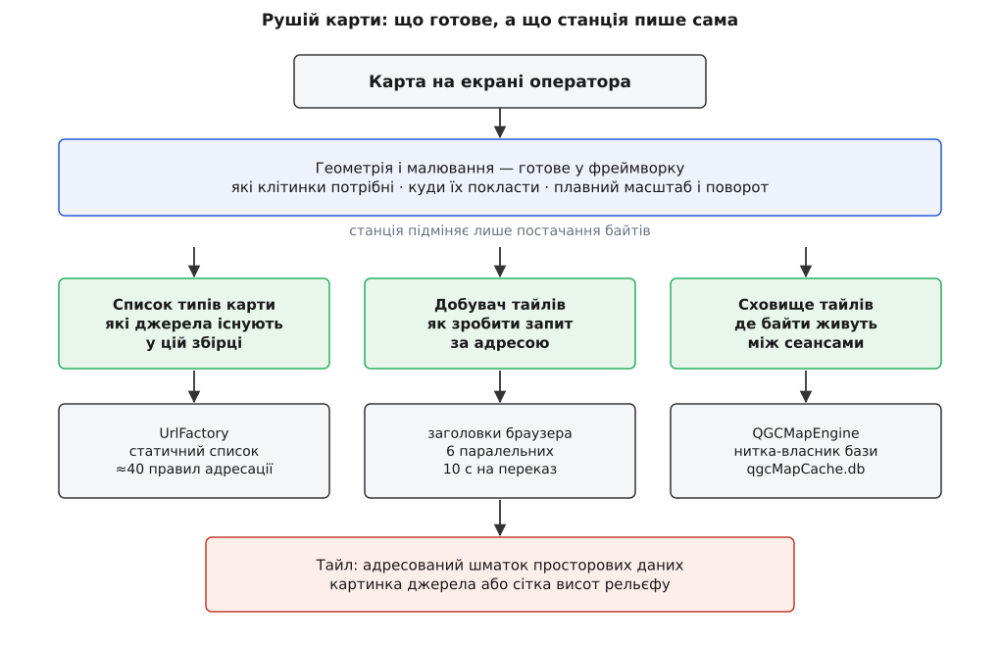
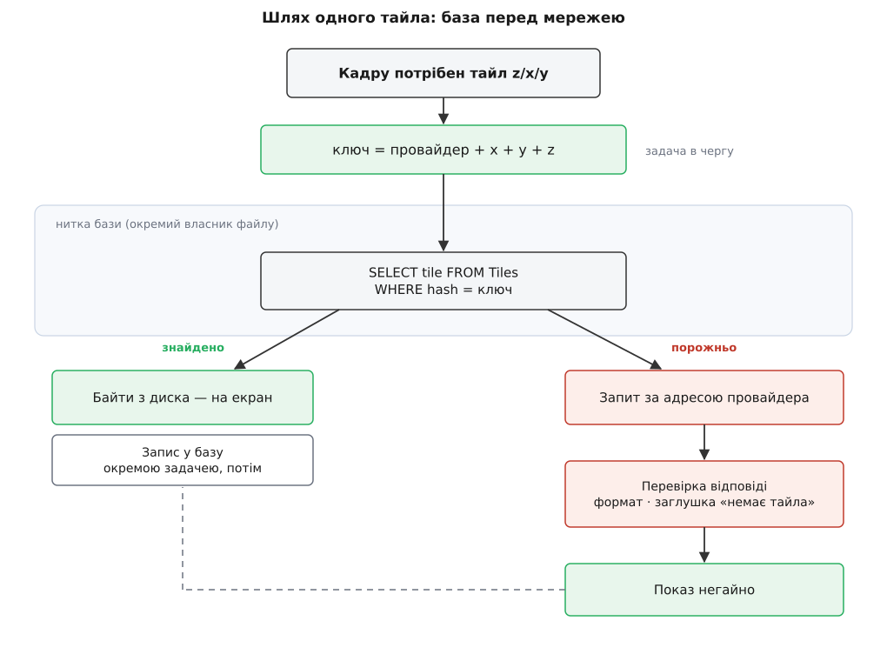
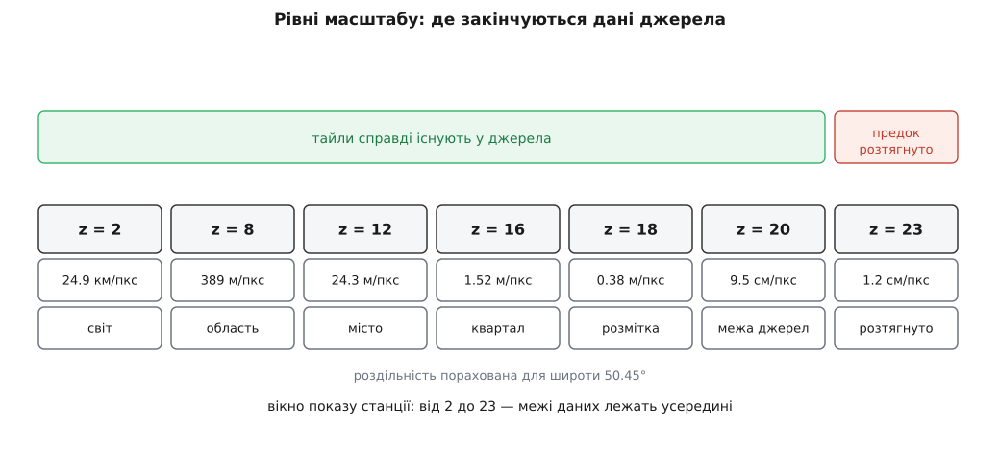

# Рушій карти: провайдери, тайли, рівні масштабу

<preknowlist>
- [Web Mercator і тайлова сітка](root:math-geometry/web-mercator-tiles) — як довгота й широта перетворюються на трійку z/x/y і чому весь світ уміщається в квадрат.
- [Тайловий конвеєр карти](root:sf-visual/map-tile-pipeline) — піраміда рівнів, вибір рівня під масштаб, поверхи кешу, правило «ніколи не показувати діру».
- [HTTP](root:com-protocol/http) — запит, заголовки, коди відповіді, повторне використання з'єднання.
- [Вбудована база даних](root:sf-data/embedded-database) — SQLite усередині процесу: файл замість сервера і виклики, які вміють чекати на диск.
- [Дизайн ключів кешу](root:sf-distributed/cache-key-design) — ключ мусить містити все, від чого залежить відповідь, інакше кеш віддає чуже.
- [Модель потоків станції](root:sys-dron/threading-model) — увесь стан живе в одній нитці, а кожен блокувальний ресурс — у своїй власній.
</preknowlist>

Карта в наземній станції зовні не відрізняється від карти в телефоні: те саме перетягування пальцем, ті самі квадратики, що підвантажуються під час руху. Різниця починається там, де її не видно, — у чотирьох вимогах, жодну з яких карта в телефоні не має виконувати.

Перша: джерело карти вибирає **оператор**, а не автор застосунку. Рятувальна служба має власний сервер ортофотопланів, аграрій — знімки з минулого тижня, а хтось у полі має тільки OpenStreetMap. Ці джерела не можна зашити в застосунок наперед, і не можна вимагати перезбирання, щоб додати ще одне.

Друга: політ відбувається там, де мережі немає. Отже, вирішальним є не швидкість завантаження, а те, **що вже лежить на диску** — і цим вмістом мусить керувати сам застосунок, бо ніхто інший не знає, який саме прямокутник землі буде потрібен завтра.

Третя: карта — не єдиний просторовий шар, який станція тягне мережею. Потрібні ще й **висоти рельєфу**, щоб перевірити, чи не в'їде маршрут у схил. Якщо для висот завести окремий завантажувач з окремим кешем, з'явиться друга підсистема з тими самими проблемами й іншими помилками.

Четверта: перед вильотом станція мусить уміти відповісти на питання «скільки важить цей район», перш ніж почне його качати. Тобто вона мусить рахувати кількість тайлів, а не просто просити їх у міру потреби.

Готовий картографічний плагін фреймворку не виконує жодної з цих вимог: він знає одного постачальника, тримає його ключ і ховає свій кеш там, де застосунок до нього не дістанеться. Тому QGroundControl реєструє **власний плагін геосервісу** під назвою `QGroundControl` — і далі вся карта в застосунку йде через нього.

## Що саме станція підміняє, а що бере готовим

Малювання карти розпадається на дві дуже різні задачі. Перша — геометрія: за видимим прямокутником і рівнем масштабу порахувати, які клітинки сітки потрібні, куди їх покласти на екрані, як плавно зсунути й змінити масштаб. Друга — постачання: звідки взяти байти кожної клітинки. Перша задача однакова для будь-якої карти світу й давно розв'язана в самому фреймворку. Друга — саме те місце, де станція відрізняється від телефона.

Тому підміняється лише постачання, і воно розкладене на три окремі шматки:

- **список типів карти** — які джерела взагалі існують у цій збірці й під якими назвами;
- **добувач тайлів** (англ. *tile* — плитка) — що робити, коли для конкретної клітинки треба байти з мережі;
- **сховище тайлів** — де ці байти живуть між сеансами.



*Станція не переписує малювання карти — вона підміняє три точки постачання й додає за ними власну базу тайлів із власною ниткою.*

Ці три шматки збирає докупи один об'єкт, `QGeoTiledMappingManagerEngineQGC`. Він же задає параметри камери, які визначають усе подальше:

```cpp
cameraCaps.setTileSize(256);
cameraCaps.setMinimumZoomLevel(2.0);
cameraCaps.setMaximumZoomLevel(QGC_MAX_MAP_ZOOM);   // 23
cameraCaps.setSupportsBearing(true);
cameraCaps.setSupportsTilting(false);
cameraCaps.setOverzoomEnabled(true);
```

Жодне з цих чисел не декоративне. Сторона тайла 256 пікселів визначає, скільки метрів землі припадає на клітинку кожного рівня. Поворот карти дозволено, бо оператор часто хоче тримати ніс апарата вгору; нахил — заборонено, бо косий погляд на план місії тільки заважає бачити, куди насправді веде маршрут. Дозвіл на розтягування (`overzoom`) визначає, що станція покаже там, де в джерела вже немає знімків.

## Провайдер — це правило, як із z/x/y зробити адресу

Найменша одиниця постачання називається **провайдер** (лат. *providere* — постачати). У станції це не сервіс і не з'єднання, а щось значно скромніше: об'єкт, який уміє перетворити три числа на адресу.

Мінімальний провайдер виглядає рівно так:

```cpp
class OpenStreetMapProvider : public MapProvider
{
public:
    OpenStreetMapProvider()
        : MapProvider(QStringLiteral("Street Map"),
                      QStringLiteral("https://www.openstreetmap.org"),
                      QStringLiteral("png"),
                      QGC_AVERAGE_TILE_SIZE,
                      MapProvider::StreetMap) {}
private:
    QString _getURL(int x, int y, int zoom) const final
    {
        return _mapUrl.arg(zoom).arg(x).arg(y);
    }
    const QString _mapUrl =
        QStringLiteral("http://tile.openstreetmap.org/%1/%2/%3.png");
};
```

Обов'язковий метод тут один — `_getURL`. Решта — це п'ять сталих, які провайдер повідомляє про себе в конструкторі: назва, за якою його вибирають; сторінка-джерело, яку слід підставляти в заголовок `Referer`; формат картинки; **очікуваний середній розмір тайла в байтах**; стиль (вулична схема, супутник, гібрид, рельєф), за яким інтерфейс групує джерела.

Середній розмір заслуговує окремої уваги, бо це не статистика заради статистики. Загальна стала — `QGC_AVERAGE_TILE_SIZE = 13652` байти, але кожне джерело може її уточнити: у Google вулична схема оголошена як 4913 байтів, а супутник — як 56887. Різниця більш ніж у десять разів, і саме на цих числах станція рахує, скільки важитиме район, який оператор обвів рамкою, — задовго до того, як хоч один тайл поїде мережею.

Одного `_getURL` вистачає, поки сервер віддає тайли за угодою `z/x/y`. Але не всі так роблять, і саме тут базовий клас перестає бути формальністю. Bing адресує тайли **квадроключем** — рядком, у якому цифри пронумеровують чверті на кожному рівні згори вниз:

```
z = 3, x = 5 (101₂), y = 3 (011₂)

рівень 1: біт x = 1, біт y = 0  →  цифра 1
рівень 2: біт x = 0, біт y = 1  →  цифра 2
рівень 3: біт x = 1, біт y = 1  →  цифра 3

квадроключ = "123"
```

Цифра на кожному рівні — це два біти, зліплені разом: молодший від x, старший від y. Наслідок гарний і практичний: **префікс квадроключа — це предок тайла**, тому сусідні тайли лежать поруч у будь-якому лексикографічному сховищі. Різні служби розв'язали ту саму задачу адресації по-різному, і ці розбіжності — окрема тема: [адресні схеми тайлових сервісів](root:sf-visual/tile-url-schemes) розкладають XYZ, TMS, WMTS і квадроключ по полицях та показують, чим вони відрізняються, окрім запису.

Google вимагає іншого — розкидати запити між кількома іменами серверів, щоб не впертися в обмеження на одне ім'я, — тому в базовому класі є ще й `_getServerNum`, який вибирає номер сервера з тих самих x та y. Mapbox і Esri вимагають третього: токена доступу, який приїжджає з налаштувань і йде окремим заголовком. Тому базовий клас має віртуальний `getToken`, який за замовчуванням повертає порожнечу.

Виходить проста ієрархія: базовий клас тримає **все спільне** (складання адреси, розпізнавання формату за першими байтами, перерахунок координат у номери клітинок), а нащадок доповідає лише те, чим він відрізняється. Повний перелік того, що можна перевизначити і що кожне поле означає, — у [контракті провайдера карти](root:sys-dron/map-engine/api-map-provider.md): підписи методів, обов'язкові поля конструктора, помічники базового класу, окремий контракт для провайдера висот і те, як провайдер потрапляє в реєстр.

> 🔧 **Навіщо це.** Провайдер із одним обов'язковим методом — це те, що дозволяє рятувальній службі поставити свій сервер ортофотопланів поруч із супутником Bing і не відрізнити їх в інтерфейсі. Уся станція далі працює з абстракцією «джерело, яке вміє віддати тайл за адресою», і жодна її частина — ні планувальник, ні завантажувач районів, ні кеш — не знає, чий саме тайл вона тримає. Тому додати джерело коштує один клас, а не гілку в десятку місць.

## Реєстр і номер, що просочується в кеш

Усі провайдери зібрані в один статичний список у класі `UrlFactory` — близько сорока об'єктів на десяток служб: Google, Bing, Esri, Mapbox, MapQuest, OpenStreetMap, VWorld, Statkart, TianDiTu, японський геопортал, LINZ, OpenAIP, а наприкінці — «власна адреса» й провайдер висот. Порядок у цьому списку виглядає як питання смаку. Насправді він визначає числа, які потім роками лежатимуть на диску користувача.

Річ у тім, що номер провайдера ніде не записаний як стала. Він **видається в порядку створення**: перший об'єкт списку дістає 1, другий — 2 і так далі. Саме цей номер станція показує фреймворку як ідентифікатор типу карти, і саме він потрапляє в ключ тайла:

```cpp
QString UrlFactory::getTileHash(QStringView type, int x, int y, int z)
{
    const int hash = hashFromProviderType(type);   // = номер провайдера
    return QString::asprintf("%010d%08d%08d%03d", hash, x, y, z);
}
```

Ключ тайла в станції — це рядок фіксованої ширини з чотирьох полів: десять цифр на провайдера, вісім на x, вісім на y, три на рівень. Для клітинки над центром Києва на вісімнадцятому рівні, узятої з шостого за списком провайдера, він виглядає так:

```
λ = 30.52°,  φ = 50.45°,  z = 18,  n = 2¹⁸ = 262144

x = ⌊ 262144 · (30.52 + 180) / 360 ⌋            = 153296
y = ⌊ 262144 · (1 − ln(tan φ + sec φ)/π) / 2 ⌋  =  88388

           провайдер      x         y      z
ключ = "0000000006" "00153296" "00088388" "018"
     = "00000000060015329600088388018"        — 29 символів
```

Вибір рядка замість структури тут не стилістичний. Ключ мусить бути водночас **первинним ключем у базі** й таким, з якого можна дістати назад провайдера, — і фіксована ширина дає обидва: рядок однозначно порівнюється, а перші десять символів завжди означають те саме. Метод `tileHashToType` тільки й робить, що відрізає ці десять символів і шукає провайдера з таким номером.

Звідси випливає пастка, про яку варто знати кожному, хто редагує список провайдерів. **Номер залежить від позиції в списку, а на диску вже лежать тайли зі старими номерами.** Уставте нове джерело в середину — і всі наступні зсунуться на одиницю; тайли, записані вчора під номером 12, завтра належатимуть іншому джерелу. База не помітить нічого: рядок валідний, тайл знайдено, картинку видано — просто це буде супутниковий знімок там, де просили схему.

Той самий механізм спрацьовує й між платформами. У складанні під iOS п'ять google-провайдерів вимикаються директивою `QGC_NO_GOOGLE_MAPS` — і весь список нижче з'їжджає на п'ять позицій. Кеш, скопійований з настільної збірки на планшет, формально придатний, а насправді розшифровується неправильно. Це не задокументована поведінка, а прямий наслідок коду: номер видається лічильником у конструкторі, а список складається під час компіляції.

> 🔧 **Навіщо це.** Правило звучить нудно: **не переставляй провайдерів місцями й додавай нові тільки в кінець списку**. Ціна порушення — не падіння, а тихо неправильна карта в польоті, яку майже неможливо зв'язати з причиною. Це навчальний випадок [ключа кешу, що забув частину умов](root:sf-distributed/cache-key-design): ключ містить номер джерела, але не містить того, що цей номер означає, — і застосунок не має способу дізнатися, що значення змінилося.

## База попереду мережі, а не позаду

Тепер найцікавіше — порядок, у якому станція шукає байти тайла.

У звичайному тайловому клієнті логіка така: спитати мережу, а те, що прийшло, покласти в кеш на потім. Кеш стоїть **після** мережі й прискорює повторний перегляд. Станції такий порядок не годиться: у полі мережі немає взагалі, а карта потрібна. Тож порядок перевернуто.

Об'єкт, який фреймворк створює під кожен тайл (`QGeoTiledMapReplyQGC`), у своєму `init()` не робить жодного мережевого запиту. Він складає задачу на пошук у базі й віддає її рушію кеша:

```cpp
QGCFetchTileTask *task = QGeoFileTileCacheQGC::createFetchTileTask(
        UrlFactory::getProviderTypeFromQtMapId(tileSpec().mapId()),
        tileSpec().x(), tileSpec().y(), tileSpec().zoom());

connect(task, &QGCFetchTileTask::tileFetched, this, &QGeoTiledMapReplyQGC::_cacheReply);
connect(task, &QGCMapTask::error,             this, &QGeoTiledMapReplyQGC::_cacheError);
getQGCMapEngine()->addTask(task);
```

Мережевий запит живе в обробнику `_cacheError` — тобто виконується **лише тоді, коли в базі тайла не знайшлося**. І перше, що робить цей обробник, — перевіряє, чи є взагалі зв'язок; якщо ні, тайл одразу оголошується помилковим, і карта показує на його місці попередника з нижчого рівня.



*База стоїть перед мережею, а не за нею: офлайн для станції — не аварійний режим, а звичайний.*

Тайл, який усе-таки приїхав мережею, перед показом проходить перевірку і аж потім лягає в базу — асинхронно, окремою задачею на запис. Це важлива дрібниця: **запис у базу ніколи не затримує показ**. Байти вже в руках, малювання починається негайно, а збереження стається колись потім.

Перевірка ж потрібна тому, що сервер уміє відповісти «двісті, все гаразд» і віддати при цьому не тайл. Bing на надто великому рівні повертає цілком коректну картинку з написом «зображення недоступне». Станція тримає її еталонні байти у своїх ресурсах і порівнює кожну відповідь Bing із ними:

```cpp
if (mapProvider->isBingProvider() && (image == _bingNoTileImage)) {
    setError(QGeoTiledMapReply::CommunicationError, tr("Bing Tile Above Zoom Level"));
    return;
}
```

Збіг перетворюється на помилку — і саме тому заглушка не потрапляє в кеш. Інакше вона осіла б на диску назавжди й показувалася б навіть тоді, коли джерело врешті з'явиться.

## Чому база живе в окремій нитці

База тайлів у станції — це файл `qgcMapCache.db` у теці кеша застосунку, звичайна вбудована SQLite з чотирма таблицями: самі тайли, набори для офлайну, зв'язок «тайл належить наборові» й черга завантаження. Той самий рядок-ключ із двадцяти дев'яти цифр — це стовпчик `hash` у таблиці `Tiles`, оголошений унікальним.

Виклик до цієї бази вміє чекати. Диск може бути зайнятий, файл — на повільній картці планшета, запит — потрапити на момент, коли інша задача пише кілька мегабайтів району. У станції є [залізне правило](root:sys-dron/threading-model): нитка, яка володіє станом і малює, не блокується ніколи. Отже, вся робота з базою винесена в **окрему нитку-власника**, а спілкування з нею йде задачами:

```cpp
bool QGCMapEngine::addTask(QGCMapTask *task);   // єдиний вхід до бази
```

Нитка-робітник крутить простий цикл: узяти задачу з черги, виконати, повернути результат сигналом; коли черга порожня — заснути на умовній змінній. Той самий візерунок, що й для послідовного порту чи відеотракту: один блокувальний ресурс — одна нитка, жодних замків у логіці.

Обсяги, які ця нитка сторожує, задані налаштуваннями й мають розумні початкові значення: до 1024 МБ на диску й до 128 МБ у пам'яті (на мобільних — 16 МБ, і не менш як мегабайт у будь-якому разі). Ці два числа оператор змінює в налаштуваннях, і вони [переживають перезапуск](root:sys-dron/settings-persistence) разом із рештою параметрів застосунку. Коли диск заповнюється, найстаріші тайли поза збереженими наборами витісняються — звичайна дисципліна [витіснення за давністю](root:sf-data/cache-eviction-policies), тільки з винятком для того, що оператор свідомо завантажив наперед. Цей виняток і вся механіка наборів — тема [офлайн-карт](root:sys-dron/offline-maps).

## Мережа як запасний варіант

Коли справа таки доходить до мережі, добувач тайлів робить з голої адреси повноцінний запит. І майже все, що він додає, додано через чужі відмови.

```cpp
request.setTransferTimeout(10000);
request.setRawHeader("Accept", "*/*");
request.setHeader(QNetworkRequest::UserAgentHeader, s_userAgent);
request.setRawHeader("Referer", mapProvider->getReferrer().toUtf8());
request.setRawHeader("Connection", "keep-alive");
request.setAttribute(QNetworkRequest::CacheLoadControlAttribute, QNetworkRequest::PreferCache);
request.setAttribute(QNetworkRequest::BackgroundRequestAttribute, true);
request.setAttribute(QNetworkRequest::Http2AllowedAttribute, true);
```

`User-Agent` тут — рядок звичайного браузера, свій для кожної платформи: Firefox на Windows, Firefox на macOS, Firefox на Android. Причина проста й неприємна: більшість тайлових служб не обслуговує клієнтів, які чесно назвалися стороннім застосунком. Той самий мотив стоїть за `Referer`, який провайдер підставляє зі своєї сторінки-джерела.

Тут варто назвати речі своїми іменами. Умови користування великих картографічних платформ, як правило, дозволяють брати тайли **лише через їхні власні програмні інтерфейси** з ключем, а не прямими запитами до тайлових серверів; питання, наскільки такий доступ припустимий, обговорювалося у спільноті й лишається неврегульованим. Стан доказів тут різний: код перевіряється безпосередньо (заголовки, адреси, вимикання google-провайдерів у складанні під iOS директивою `QGC_NO_GOOGLE_MAPS`), а правова оцінка залежить від конкретної служби та її чинних умов. Практичний висновок для того, хто робить [власну збірку](root:sys-dron/custom-build): перелік провайдерів у продукті — це рішення не технічне, а ліцензійне.

Решта налаштувань запиту — про поведінку в полі. Час на переказ обмежено десятьма секундами, бо в мобільній мережі краще швидко здатися й показати попередника, ніж тримати відкритий запит; кількість одночасних завантажень обмежено шістьма; з'єднання тримаються теплими, бо тайли їдуть рідкими пачками, і кожне нове рукостискання коштувало б дорожче за самі байти. Прапорець `PreferCache` дозволяє віддати відповідь із мережевого кеша фреймворку, не питаючи сервера, — це другий, менший кеш, який працює за звичайними [правилами HTTP-кешування](root:com-protocol/http-caching) і живе у теці `providers` поруч із базою.

Особливий випадок постачання — коли ніякого зовнішнього сервера немає. Провайдер `CustomURL Custom` бере шаблон адреси прямо з налаштувань і підставляє в нього числа:

```cpp
QString url = SettingsManager::instance()->appSettings()->customURL()->rawValue().toString();
url.replace("{x}", QString::number(x));
url.replace("{y}", QString::number(y));
url.replace(QRegularExpression("\\{(z|zoom)\\}"), QString::number(zoom));
```

Це найдешевший спосіб під'єднати власний тайловий сервер: жодного перезбирання, лише рядок у налаштуваннях. Ціна — усе, що не вміщається в підстановку трьох чисел: ані токена, ані вибору серверів, ані власних меж масштабу. Коли шаблону мало, джерело доводиться заводити класом — і як це зробити від початку до кінця, з реєстрацією, токеном і типовими пастками, показано в [розборі власного джерела карти](root:sys-dron/map-engine/proj-custom-map-source.md).

## Рівні масштабу: що означає число від 2 до 23

Межі масштабу, оголошені в параметрах камери, — від 2 до 23. Обидва числа означають не те, що звично думають.

Нижня межа — 2, а не 0. Нульовий рівень (увесь світ одним тайлом) для станції не має сенсу: планувати політ на глобусі неможливо, а частина служб на нульовому й першому рівнях просто не має тайлів. Отже, це не технічне обмеження, а відсікання марного.

Верхня межа — 23. І ось тут криється головне непорозуміння щодо тайлових карт: **23 — це стеля показу, а не стеля даних**. Знімки закінчуються значно раніше: у Google супутник має найбільший рівень близько 20, у різних служб — від 17 до 21, а на морі й у пустелі детальні знімки закінчуються ще раніше. Що ж тоді малюється на 21-му, 22-му й 23-му?

Відповідь — у прапорці `setOverzoomEnabled(true)`. Коли тайла потрібного рівня немає, карта бере тайл-предок із того рівня, який існує, і розтягує його. Оператор бачить розмиття — і це чесно: розмиття означає «докладніших даних не існує», тоді як діра означала б «дані є, але не приїхали». Різниця критична, бо перше — властивість світу, а друге — привід перевірити зв'язок.



*Межі 2 і 23 належать вікну показу; знімки закінчуються десь між ними, і далі карта розтягує предка замість того, щоб лишити порожнечу.*

Щоб число рівня перестало бути абстракцією, його варто перевести в метри на піксель. Для сітки з тайлом 256 пікселів:

```
роздільність(z, φ) = 156543.0339 · cos φ / 2ᶻ        м/піксель
сторона тайла      = 256 · роздільність(z, φ)        м
```

**Приклад: центр Києва (φ = 50.45°), рівень 18.**

```
cos 50.45°          = 0.63673
156543.0339 · cos φ = 99676        м/піксель на z = 0
2¹⁸                 = 262144
роздільність        = 99676 / 262144 = 0.380  м/піксель
сторона тайла       = 256 · 0.380   = 97.3   м
```

Тобто один тайл вісімнадцятого рівня — це квадрат приблизно сто на сто метрів, і на ньому видно розмітку на асфальті. Звідси одразу рахується й бюджет району:

**Приклад: ділянка 3 × 2 км, рівень 18, супутникові знімки.**

```
тайлів по ширині  = 3000 / 97.3 = 30.8  →  32 (з урахуванням країв)
тайлів по висоті  = 2000 / 97.3 = 20.6  →  22
тайлів на z = 18  = 32 · 22 = 704

середній тайл (google-супутник) = 56887 байтів
обсяг на z = 18 = 704 · 56887 = 40 048 448  ≈ 40 МБ

нижчі рівні 17, 16, 15, …    ≈ 704 · (1/4 + 1/16 + …) ≈ 235 тайлів
разом                        ≈ 940 тайлів ≈ 47 МБ
```

Ту саму арифметику робить метод `getTileCount`, коли оператор обводить район рамкою: він рахує номери кутових клітинок на кожному рівні, множить кількість на середній розмір тайла цього провайдера — і показує оцінку ще до першого запиту. Та сама ділянка у вуличній схемі важила б на тому самому рівні лише 3.5 МБ: 4913 байтів на тайл замість 56887.

І остання деталь про рівні — упереджувальне читання. Коли зв'язок є, карта підкачує **два сусідні рівні** навколо поточного, щоб зміна масштабу не показувала порожнечу. Коли зв'язку немає — підкачування вимикається зовсім:

```cpp
m_prefetchStyle = QGCNetworkHelper::isInternetAvailable()
                ? QGeoTiledMap::PrefetchTwoNeighbourLayers
                : QGeoTiledMap::NoPrefetching;
```

Це перемикається на льоту, за сповіщенням системи про появу чи зникнення мережі. Логіка проста: у полі кожен зайвий запит — це витрачений час очікування на тайли, які справді потрібні зараз.

## Тайл, у якому немає пікселів

Тепер видно, наскільки насправді широка абстракція провайдера. Провайдер не зобов'язаний віддавати картинку. Він зобов'язаний лише перетворювати адресу на запит і повертати байти, які станція вміє покласти в базу під ключем.

Саме цим користується постачальник висот рельєфу. Провайдер `Copernicus` — такий самий елемент того самого списку, з таким самим номером і таким самим ключем у базі, але всередині все інакше:

```cpp
int CopernicusElevationProvider::long2tileX(double lon, int z) const
{
    Q_UNUSED(z)
    return static_cast<int>(floor((lon + 180.0) / 0.01));   // кроком 0.01°
}
```

Рівень масштабу тут ігнорується взагалі. Сітка не меркаторська, а градусна: клітинка — квадрат 0.01° × 0.01°, тобто приблизно 1.1 км по широті й близько 700 м по довготі на широті Києва. Адреса — не шлях до файлу, а виклик до служби рельєфу з чотирма координатами кутів. Відповідь приходить у JSON, і провайдер її **перепаковує** у щільний двійковий вигляд, перш ніж вона потрапить у кеш:

```cpp
image = elevationProvider->serialize(image);
```

Формат такого тайла оголошено як `bin`, середній розмір — 2786 байтів, а всередині — сітка висот із кроком в одну кутову секунду, тобто приблизно тридцять метрів. Далі станція оперує ним точнісінько так само, як картинкою: та сама база, та сама нитка, те саме витіснення, той самий офлайн. Той факт, що показувати цей тайл нема чого, нікого в конвеєрі не турбує.

Тому «тайл» у станції означає не «квадратик карти», а **адресований шматок просторових даних**. Як із цих шматків виходять профіль висоти вздовж маршруту й перевірка безпечної висоти, розказано у [рельєфі та режимах висоти](root:sys-dron/terrain-and-altitude), а самий принцип цифрової моделі рельєфу — у [моделі рельєфу й профілі висот](root:sf-visual/terrain-elevation-model).

## Що з цього виходить

Рушій карти станції легко прийняти за графічну підсистему: він же малює карту. Але майже все в ньому — не про малювання. Провайдер — це правило складання адреси. Ключ — це рядок для первинного індексу. Нитка-робітник — це власник файлу бази. Рівні масштабу — це домовленість про те, який шматок землі відповідає якому числу. Пікселі з'являються в самому кінці й лише як окремий випадок: у тайлах рельєфу їх немає взагалі.

З цього випливає спосіб думати про несправності. Коли карта поводиться дивно, причина майже ніколи не в графіці. Порожній екран у полі означає порожню базу; чужі знімки замість схеми — зсунуті номери провайдерів; розмиття на найбільшому наближенні — вичерпані дані джерела, а не поламане малювання; тайл, що не оновлюється тижнями, — успішно збережену колись відповідь. Карта в наземній станції — це передусім сховище з географічним ключем, і діагностувати її треба як сховище.
