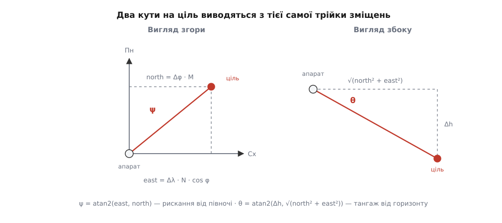

# ⚙️ Навести підвіс на точку й зняти кадр

<preknowlist>
- [Команди MAVLink](topic:sys-dron/mavlink-commands) — `COMMAND_LONG` із сімома числовими параметрами, `COMMAND_ACK` із кодом результату й правило, що разову дію треба підтверджувати.
- [WGS-84: еліпсоїд і датум](topic:math-geometry/wgs84-datum) — широта й довгота як координати на еліпсоїді, а не на кулі.
- [ECEF, NED і ENU](topic:math-geometry/ecef-ned-enu) — локальна прямокутна система «північ–схід–вгору», прив'язана до точки на поверхні.
- [atan2](topic:math-geometry/atan2) — арктангенс, що розрізняє всі чотири чверті й тому годиться для азимута.
- [Кватерніони](topic:math-geometry/quaternions) — компактний запис повороту; підвіс звітує про своє положення саме ним.
</preknowlist>

Бортовий комп'ютер знає координати цілі на землі й має повернути на неї камеру та привезти кадр, про який достеменно відомо, що він існує. Далі — робочий код цієї процедури на C з бібліотекою MAVLink і ті місця в ньому, де очевидне рішення мовчки не працює.

## Умова

Комп'ютер сидить на тому самому апараті (`sysid 1`) і має `compid 191`. Менеджер підвісу живе в автопілоті (`compid 1`), саме залізо підвісу — `compid 154`, камера — `compid 100`. Дано широту, довготу й висоту цілі. Треба навести камеру, дочекатися, поки вона **справді** туди дивиться, зняти один кадр і повернути його наскрізний номер.

Межа з платформою — три функції, які кожен пише під свою систему:

```c
uint32_t now_ms(void);                                     /* монотонний час, мс      */
bool     recv_msg(mavlink_message_t *m, uint32_t wait_ms); /* розібраний кадр із шини */
void     send_msg(const mavlink_message_t *m);             /* кадр у шину             */
```

Ще потрібні свіжа поза апарата й опис підвісу — приймальний цикл складає їх у три глобальні змінні: `g_pose` (координати з `GLOBAL_POSITION_INT`), `g_vehicle_yaw` (курс із `ATTITUDE`, у радіанах) і `g_dev_info` — одноразово запитаний `GIMBAL_DEVICE_INFORMATION`.

## Крок 1. Право керувати

Менеджер підвісу слухає не всіх. Поки бортовий комп'ютер не оголошений первинним розпорядником, менеджер має повне право проігнорувати його завдання, а в кращому разі відповість `COMMAND_ACK` із результатом `MAV_RESULT_NOT_IN_CONTROL` (10). Тому процедура починається не з геометрії, а з заявки.

```c
#define MY_SYS       1
#define MY_COMP      MAV_COMP_ID_ONBOARD_COMPUTER  /* 191 */
#define MANAGER_COMP MAV_COMP_ID_AUTOPILOT1        /* 1   */
#define DEVICE_COMP  MAV_COMP_ID_GIMBAL            /* 154 */
#define CAMERA_COMP  MAV_COMP_ID_CAMERA            /* 100 */

static void send_command(uint16_t cmd, uint8_t target_comp, const float p[7])
{
    mavlink_message_t m;
    mavlink_msg_command_long_pack(MY_SYS, MY_COMP, &m,
                                  MY_SYS, target_comp, cmd, /* confirmation */ 0,
                                  p[0], p[1], p[2], p[3], p[4], p[5], p[6]);
    send_msg(&m);
}

static void take_primary_control(void)
{
    const float p[7] = {
        (float)MY_SYS, (float)MY_COMP,  /* первинний розпорядник — це я */
        -1.0f, -1.0f,                   /* вторинного не чіпаємо        */
        0.0f, 0.0f, (float)DEVICE_COMP  /* param7 — котрий саме пристрій */
    };
    send_command(MAV_CMD_DO_GIMBAL_MANAGER_CONFIGURE, MANAGER_COMP, p);
}
```

Значення `-1` означає «лиши як було»: команда переписує рівно ті поля, які ти назвав. Це навмисно не замок — той самий рядок будь-якої миті виконає наземна станція й забере керування собі. Тому доросла програма не бере керування один раз на старті, а поновлює заявку перед кожним наведенням і звіряє `primary_control_compid` у `GIMBAL_MANAGER_STATUS`, що приходить сам собою кілька разів на секунду.

## Крок 2. Куди дивитися

Кут на ціль виводиться з трьох зміщень: скільки метрів на північ, скільки на схід і на скільки ціль нижча за апарат.


*Різниця широт стає метрами через меридіанний радіус, різниця довгот — через радіус першого вертикала, помножений на косинус широти. Далі обидва кути — це два виклики `atan2`.*

Тут ховається перша пастка, і вона не в протоколі, а в географії. Градус широти й градус довготи — **різної довжини**, і довжина градуса довготи ще й зменшується з широтою пропорційно до `cos φ`. На широті Києва косинус дорівнює приблизно 0.637, тобто забутий множник роздуває східне зміщення в півтора раза.

```c
typedef struct { double lat_deg, lon_deg, alt_m; } geo_t;

/* Кути на ціль: рискання від півночі, тангаж від горизонту, обидва в радіанах. */
static void aim_angles(const geo_t *v, const geo_t *t, float *yaw_earth, float *pitch)
{
    const double a   = 6378137.0;          /* велика піввісь WGS-84, м        */
    const double e2  = 6.69437999014e-3;   /* квадрат першого ексцентриситету */
    const double phi = v->lat_deg * M_PI / 180.0;
    const double s   = sin(phi);
    const double w   = 1.0 - e2 * s * s;

    const double N = a / sqrt(w);                    /* радіус першого вертикала */
    const double M = a * (1.0 - e2) / (w * sqrt(w)); /* меридіанний радіус       */

    const double north = (t->lat_deg - v->lat_deg) * M_PI / 180.0 * M;
    const double east  = (t->lon_deg - v->lon_deg) * M_PI / 180.0 * N * cos(phi);
    const double up    = t->alt_m - v->alt_m;

    *yaw_earth = (float)atan2(east, north);
    *pitch     = (float)atan2(up, hypot(north, east));
}
```

Два радіуси кривини — не педантизм: меридіанний `M` і поперечний `N` різняться приблизно на 0.3 %, і на кілометрі це вже кілька метрів. Звідки вони беруться — у вставці [радіуси кривини еліпсоїда](topic:math-geometry/wgs84-datum/math-radii-of-curvature.md). Плоска модель годиться, поки ціль ближча за десяток кілометрів; далі треба розв'язувати обернену геодезичну задачу на еліпсоїді.

**Апарат на 50.4501° пн. ш., 30.5234° сх. д., висота 420 м; ціль на 50.4530°, 30.5290°, висота 180 м:**

```
φ = 50.4501°   cos φ = 0.63673
N = 6390865 м        M = 6373444 м

north = 0.0029° · π/180 · 6373444           = 322.6 м
east  = 0.0056° · π/180 · 6390865 · 0.63673 = 397.7 м
Δh    = 180 − 420                           = −240 м

горизонталь = √(322.6² + 397.7²)  = 512.1 м
ψ = atan2(397.7, 322.6)  =  50.95°  =  0.889 рад
θ = atan2(−240, 512.1)   = −25.11°  = −0.438 рад

забути cos φ:  east = 624.6 м  →  ψ = 62.68°
похибка 11.7° на дальності 512 м  →  ціль повз кадр на 106 м
```

## Крок 3. Межа осі — завжди про корпус

Тепер найтонше. Підвіс віддає в `GIMBAL_DEVICE_INFORMATION` межі осей — `yaw_min`, `yaw_max` і решту. Це **апаратні** межі: скільки ходу дає залізо. А отже, вони описують кут відносно корпусу апарата — і залишаються такими, хоч би в якій рамці ти формулюєш наказ. Команда в земній рамці не додає осі жодного градуса: менеджер усе одно перерахує її в кут відносно корпусу, і саме цей перерахований кут упреться в механічну межу.

```c
static float wrap_pi(float x)
{
    while (x >  (float)M_PI) x -= 2.0f * (float)M_PI;
    while (x < -(float)M_PI) x += 2.0f * (float)M_PI;
    return x;
}

/* Порівнюємо ЗАВЖДИ кут у рамці корпусу. NaN у межі означає «невідомо». */
static bool within_limits(const mavlink_gimbal_device_information_t *i,
                          float pitch, float yaw_body)
{
    if (isfinite(i->pitch_min) && pitch    < i->pitch_min) return false;
    if (isfinite(i->pitch_max) && pitch    > i->pitch_max) return false;
    if (isfinite(i->yaw_min)   && yaw_body < i->yaw_min)   return false;
    if (isfinite(i->yaw_max)   && yaw_body > i->yaw_max)   return false;
    return true;
}
```

Явний `isfinite` тут не для краси. `NaN` у полі межі за домовленістю MAVLink означає «виробник не сказав», а будь-яке порівняння з `NaN` дає хибу — і природний на вигляд запис `if (!(yaw >= min && yaw <= max)) return false;` завернув би цілком законне завдання просто тому, що межа невідома. Знак заперечення міняє поведінку на протилежну, і в жодному з двох випадків намір не написаний у коді. Чому так — у статті про [IEEE 754](topic:math-numeric/ieee754).

> 🔧 **Навіщо це.** Перевірка меж **перед** відправкою — єдиний спосіб відрізнити «підвіс не встиг» від «підвіс не може». Наказ поза межею не спричиняє відмови: менеджер його приймає, пристрій доїжджає до механічної межі й лишається там, а програма чекає на кут, якого не буде. Коли потрібне рискання не влазить у вісь, крутити треба **сам апарат**: віддати автопілотові `MAV_CMD_CONDITION_YAW` (кут у градусах, нуль — північ) і аж тоді наводити підвіс, якому тепер вистачає ходу. Ось чому стеження за нерухомою ціллю в режимі утримання час від часу вимагає маневру носія, а не самої лише камери.

## Крок 4. Наказ: радіани, NaN і рамка

```c
static bool point_gimbal(const mavlink_gimbal_device_information_t *info,
                         float pitch, float yaw_earth, float vehicle_yaw)
{
    const float yaw_body = wrap_pi(yaw_earth - vehicle_yaw);
    if (!within_limits(info, pitch, yaw_body))
        return false;                       /* просити неможливе — гірше, ніж не просити */

    const uint32_t caps = info->cap_flags2 ? info->cap_flags2 : info->cap_flags;
    const bool earth = caps & GIMBAL_DEVICE_CAP_FLAGS_SUPPORTS_YAW_IN_EARTH_FRAME;

    mavlink_message_t m;
    mavlink_msg_gimbal_manager_set_pitchyaw_pack(
        MY_SYS, MY_COMP, &m,
        MY_SYS, MANAGER_COMP,
        earth ? GIMBAL_MANAGER_FLAGS_YAW_IN_EARTH_FRAME
              : GIMBAL_MANAGER_FLAGS_YAW_IN_VEHICLE_FRAME,
        DEVICE_COMP,
        pitch,                              /* радіани, не градуси! */
        earth ? yaw_earth : yaw_body,
        NAN, NAN);                          /* швидкості не задаю — тримай як знаєш */
    send_msg(&m);
    return true;
}
```

Три дрібниці, кожна з яких псує весь виліт. Перша: `GIMBAL_MANAGER_SET_PITCHYAW` бере **радіани**, а команда `MAV_CMD_DO_GIMBAL_MANAGER_PITCHYAW` — **градуси**. Ті самі 0.889 рад, покладені в команду, дадуть поворот на 0.889°, і підвіс лише ледь смикнеться; ті самі 50.95°, покладені в повідомлення, означають 50.95 рад — вісім повних обертів. Друга: `NaN` у полі швидкості — це не «нуль» і не помилка, а «цю величину я не задаю». Нуль замість `NaN` означав би наказ **стояти нерухомо** й міг би зупинити підвіс на півдорозі. Третя: рамку рискання не вгадують — біт `SUPPORTS_YAW_IN_EARTH_FRAME` у можливостях пристрою каже, чи взагалі є про що просити.

## Крок 5. Вихід на кут — це звіт, а не пауза

Пауза на дві секунди після наказу — найпоширеніший спосіб зняти розмите ніщо. Скільки підвіс їхатиме, залежить від кута, вітру й налаштувань; єдиний чесний критерій — його власний звіт.

```c
/* Тангаж і рискання з кватерніона (послідовність ZYX). */
static void q_to_pitch_yaw(const float q[4], float *pitch, float *yaw)
{
    const float w = q[0], x = q[1], y = q[2], z = q[3];
    float s = 2.0f * (w * y - z * x);
    if (s >  1.0f) s =  1.0f;
    if (s < -1.0f) s = -1.0f;
    *pitch = asinf(s);
    *yaw   = atan2f(2.0f * (w * z + x * y), 1.0f - 2.0f * (y * y + z * z));
}

static bool wait_on_target(float want_pitch, float want_yaw, bool want_earth,
                           float tol, uint32_t timeout_ms)
{
    const uint32_t t0 = now_ms();
    mavlink_message_t m;

    while (now_ms() - t0 < timeout_ms) {
        if (!recv_msg(&m, 100)) continue;
        if (m.msgid != MAVLINK_MSG_ID_GIMBAL_DEVICE_ATTITUDE_STATUS) continue;

        mavlink_gimbal_device_attitude_status_t st;
        mavlink_msg_gimbal_device_attitude_status_decode(&m, &st);

        if (st.failure_flags & (GIMBAL_DEVICE_ERROR_FLAGS_AT_YAW_LIMIT |
                                GIMBAL_DEVICE_ERROR_FLAGS_AT_PITCH_LIMIT))
            return false;                   /* уперся: далі чекати нема сенсу */

        float pitch, yaw;
        q_to_pitch_yaw(st.q, &pitch, &yaw);

        /* Рамку звіту задають прапорці пристрою, а не твоє бажання. */
        const bool in_earth = st.flags & GIMBAL_DEVICE_FLAGS_YAW_IN_EARTH_FRAME;
        const bool in_body  = st.flags & GIMBAL_DEVICE_FLAGS_YAW_IN_VEHICLE_FRAME;
        if (!in_earth && !in_body) continue;          /* рамка не оголошена — не гадаємо */
        if (in_earth != want_earth) {
            if (!isfinite(st.delta_yaw)) continue;    /* нема чим перевести          */
            yaw = wrap_pi(want_earth ? yaw + st.delta_yaw : yaw - st.delta_yaw);
        }

        if (fabsf(wrap_pi(yaw - want_yaw)) < tol && fabsf(pitch - want_pitch) < tol)
            return true;
    }
    return false;
}
```

Два підводні камені сховані тут. Перший: звіт приходить кватерніоном, і його рамка оголошена прапорцями `YAW_IN_EARTH_FRAME` та `YAW_IN_VEHICLE_FRAME` — порівняння земного завдання з кутом у рамці корпусу просто ніколи не збіжиться. Поле `delta_yaw` і є той кут, що переводить одне в інше. Другий: `failure_flags` із бітом `AT_YAW_LIMIT` — це пристрій прямо каже «я вперся». Без цієї перевірки програма чекатиме до кінця тайм-ауту й спише все на радіозв'язок.

## Крок 6. Кадр — подія, а не підтвердження

```c
static bool shoot_one(int32_t *out_index, uint32_t timeout_ms)
{
    static float seq = 0.0f;
    const float p[7] = { 0.0f,      /* усі сенсори цієї камери */
                         0.0f,      /* інтервал не потрібен    */
                         1.0f,      /* один кадр               */
                         ++seq, 0.0f, 0.0f, 0.0f };
    send_command(MAV_CMD_IMAGE_START_CAPTURE, CAMERA_COMP, p);

    const uint32_t t0 = now_ms();
    bool acked = false;
    mavlink_message_t m;

    while (now_ms() - t0 < timeout_ms) {
        if (!recv_msg(&m, 100)) continue;

        if (m.msgid == MAVLINK_MSG_ID_COMMAND_ACK) {
            mavlink_command_ack_t ack;
            mavlink_msg_command_ack_decode(&m, &ack);
            if (ack.command != MAV_CMD_IMAGE_START_CAPTURE) continue;
            if (ack.result == MAV_RESULT_IN_PROGRESS)       continue;
            if (ack.result != MAV_RESULT_ACCEPTED)          return false;
            acked = true;                   /* наказ прийнято — кадру ще нема */
            continue;
        }

        if (acked && m.msgid == MAVLINK_MSG_ID_CAMERA_IMAGE_CAPTURED) {
            mavlink_camera_image_captured_t ev;
            mavlink_msg_camera_image_captured_decode(&m, &ev);
            if (!ev.capture_result) return false;   /* камера зізналася, що не вийшло */
            *out_index = ev.image_index;
            return true;
        }
    }
    return false;
}
```

Повернутися на `COMMAND_ACK` — і є та помилка, задля якої написана вся ця функція. Підтвердження означає «наказ прийнято», а не «кадр існує»: між ними лежать автофокус і запис попереднього файла. Доказом кадру є `CAMERA_IMAGE_CAPTURED` із власним `image_index`, і саме цей номер варто везти далі — за розривом у нумерації видно загублену подію, а `MAV_CMD_REQUEST_MESSAGE` із номером повідомлення 263 у першому параметрі й потрібним індексом у другому дістане саме її. Поле `param4` команди зйомки — послідовний номер знімка — існує рівно для того, щоб повторно надіслана команда не зняла другий кадр.

У цій самій події лежить і те, заради чого зазвичай усе затівалося. Поля `lat`, `lon`, `alt` і кватерніон `q` описують, **звідки й куди дивилася камера тієї миті, коли відкрився затвор**, — а не тоді, коли ти надіслав команду. Між цими двома моментами апарат пролетів кілька метрів і трохи хитнувся, тож для прив'язки пікселів до місцевості беруть числа з події, а свою позу лишають хіба що для перевірки.

Разом:

```c
bool point_and_shoot(const geo_t *target, int32_t *image_index)
{
    take_primary_control();

    if (!pose_fresh(200)) return false;     /* поза старша за 200 мс — не наводимо */

    float pitch, yaw_earth;
    aim_angles(&g_pose, target, &yaw_earth, &pitch);

    if (!point_gimbal(&g_dev_info, pitch, yaw_earth, g_vehicle_yaw)) return false;

    const uint32_t caps = g_dev_info.cap_flags2 ? g_dev_info.cap_flags2
                                                : g_dev_info.cap_flags;
    const bool earth = caps & GIMBAL_DEVICE_CAP_FLAGS_SUPPORTS_YAW_IN_EARTH_FRAME;
    const float want_yaw = earth ? yaw_earth
                                 : wrap_pi(yaw_earth - g_vehicle_yaw);

    if (!wait_on_target(pitch, want_yaw, earth, 0.017f /* ≈1° */, 4000)) return false;

    return shoot_one(image_index, 5000);
}
```

## Ціна й що ще ламається

Обчислень тут на десяток тригонометричних викликів — усе, що коштує часу, це очікування: близько 0.5–3 с на вихід підвісу й ще до секунди на кадр. Виклик блокує потік, тож у реальному борті це або окрема нитка, або скінченний автомат на тому самому приймальному циклі.

Що ламається понад уже сказане. **Стара поза**: між зчитуванням координат і поворотом підвісу апарат летить, і при 15 м/с затримка в півсекунди зсуває точку зйомки на сім метрів — тому перевірка свіжості пози стоїть перед розрахунком, а не після. **Курс, узятий не звідти**: поле `hdg` у `GLOBAL_POSITION_INT` міряється в сантиградусах і дорівнює `UINT16_MAX`, коли невідоме; чесніший `yaw` із `ATTITUDE` уже в радіанах. **Дві різні висоти в одному відніманні**: `relative_alt` відлічують від точки зльоту, а висоту цілі беруть із мапи рельєфу над рівнем моря — змішавши їх, отримаєш `Δh`, помилкове рівно на висоту місця зльоту, і разом з ним криво порахований тангаж. У розрахунку має бути `alt`, бо він теж від рівня моря. **Наведення без права керувати**: команда доїжджає, менеджер її мовчки відкидає, а програма чесно чекає на кут, якого ніхто не збирався відпрацьовувати.
