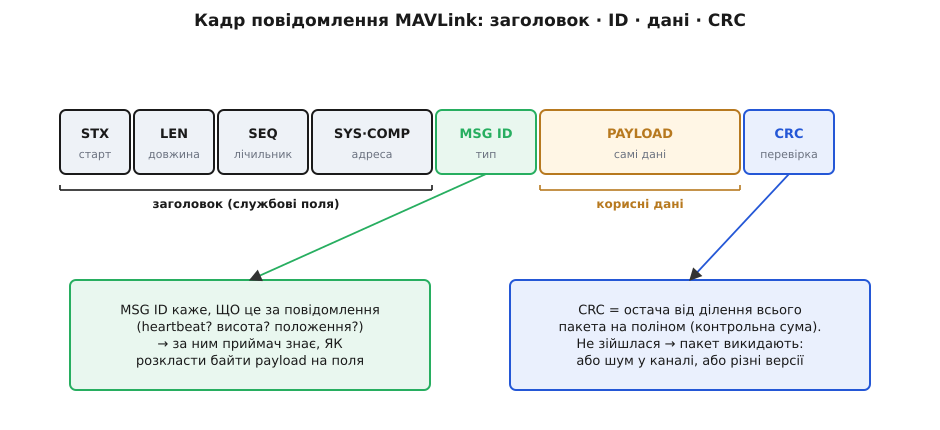
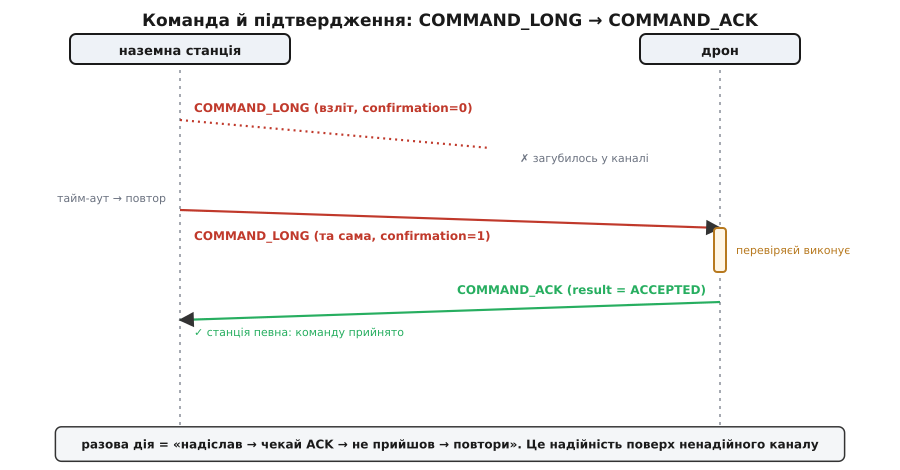
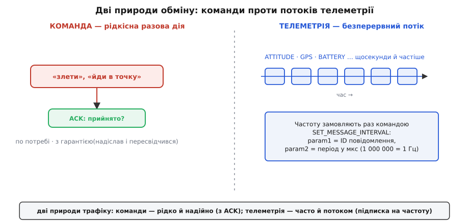

# Команди MAVLink

Уяви, що тримаєш у руках пульт наземної станції, а за кілометр у небі висить дрон. Ти тиснеш «злети» — і за частку секунди апарат починає підійматися. Між твоїм натиском і цим рухом лежить ціла мова: домовленість про те, як упакувати слово «злети» в радіохвилі так, щоб дрон його зрозумів, виконав і **підтвердив**, що виконав. Ця мова — **MAVLink** (*Micro Air Vehicle Link*, «зв'язок з мікроповітряним апаратом»). Вона легка, двійкова й створена рівно для двох речей: **слати команди** на апарат і **отримувати телеметрію** з нього. Розберімо її від першопричини — чому вона саме така.

### Чому взагалі потрібна окрема мова

Почнімо з потреби. Дрон і наземна станція з'єднані не дротом, а **радіолінією** — вузькою, шумною й ненадійною. На землі ми звикли, що мережа широка й майже безпомилкова, тож можна слати громіздкі текстові повідомлення й не рахувати кожен байт. У небі все навпаки: канал телеметрії часто має лічені кілобіти за секунду, частина пакетів **губиться** в дорозі, а затримка коштує стабільності польоту. У таких умовах кожен зайвий байт — це менше місця для корисних даних і більший шанс, що пакет спотвориться шумом.

Звідси випливають усі риси MAVLink. Якщо канал вузький — повідомлення мусять бути **щільні й двійкові**, без жодного зайвого тексту. Якщо пакети губляться — приймач має **сам помічати** пропажу й спотворення, а важливі команди мусять **підтверджуватися**. Якщо учасників на лінії багато (рій дронів, кілька пристроїв на борту) — кожне повідомлення мусить нести **адресу**. MAVLink — це не довільний винахід, а прямий висновок із того, яким є радіоканал над головою.

> 🔧 **Навіщо це.** Майже все, що літає на любительських і професійних автопілотах (ArduPilot, PX4), розмовляє саме MAVLink. Хочеш написати власну наземну станцію, прикрутити до дрона бортовий комп'ютер, що сам віддає команди, чи просто розібратися, чому апарат «не бачиться» в QGroundControl, — ти неминуче працюєш із цією мовою. Розуміння її будови — це здатність читати логи, налагоджувати лінк і керувати апаратом програмно, а не лише пальцем по екрану.

### З чого складається повідомлення

Будь-яке спілкування MAVLink — це потік **повідомлень** (*messages*), і кожне має ту саму скелетну будову. Вона проста рівно настільки, наскільки складна задача: позначити початок, сказати, що всередині, вкласти дані й дати спосіб перевірити, що нічого не зіпсувалося в дорозі.


*Повідомлення починається стартовим байтом, далі йде короткий службовий заголовок (довжина, лічильник, адреса відправника), потім ідентифікатор типу, самі дані й наприкінці контрольна сума. Ідентифікатор вирішує, як саме розкласти байти даних на поля; контрольна сума ловить спотворення.*

Розгляньмо частини за їхнім сенсом, а не за порядком у пам'яті. **Стартовий байт** — це маркер «тут починається повідомлення»; за ним приймач, що читає суцільний потік байтів, ловить, де новий пакет. Далі — **заголовок** зі службових полів: скільки байтів даних попереду, лічильник повідомлень (за розривами в його нумерації видно **загублені** пакети) і **адреса** — який апарат і який його вузол це надіслав. Потім — найважливіше для розуміння: **ідентифікатор типу** (*message ID*). Саме він каже, **що** це за повідомлення — серцебиття? висота? положення? — а отже, **як** читати наступні байти. Далі лежать **корисні дані** (*payload*): власне зміст, чиє розкладання на поля повністю залежить від ідентифікатора. І наприкінці — **контрольна сума**, двобайтове число, що дає змогу впевнитися: пакет дійшов неспотвореним.

Ключ до всієї конструкції — пара «ідентифікатор + дані». Один і той самий блок байтів означає зовсім різне залежно від ідентифікатора: для одного типу це три числа кутів нахилу, для іншого — широта, довгота й висота. Тому приймач спершу читає ідентифікатор, а вже потім знає, **за яким шаблоном** тлумачити решту. Це робить MAVLink не просто форматом, а **словником** типізованих повідомлень: сторони наперед домовилися, що повідомлення номер такий-то має саме такі поля саме таких типів.

Така будова не випадкова — це класична [конструкція пакета](root:com-transport/packet-design): маркер старту, поле довжини, корисне навантаження, перевірка цілісності. MAVLink бере цю перевірену схему й доводить її до світового стандарту.

### Контрольна сума, що стереже цілісність

На спотворення в ефірі MAVLink відповідає **контрольною сумою** в кінці кожного повідомлення.

> Контрольну суму тут рахують методом [CRC](root:com-modulation/crc): увесь пакет беруть за одне довге двійкове число й ділять на наперед домовлений дільник; остача від цього ділення й є контрольною сумою. Будь-яка зміна навіть одного біта майже напевно дасть іншу остачу, тож приймач, поділивши прийняте на той самий дільник, одразу бачить: остача збіглася — пакет цілий, не збіглася — пакет битий і його викидають.

У MAVLink ця перевірка має додаткову хитрість: до контрольної суми домішують ще й невеликий «відбиток» структури самого повідомлення — байт, похідний від набору й типів його полів. Наслідок елегантний: якщо передавач і приймач мають **різні визначення** того самого типу повідомлення (хтось оновив словник, додавши поле, а хтось ні), їхні відбитки не збігаються — і контрольна сума не зійдеться. Одна-єдина перевірка ловить **одразу дві** біди: пошкодження від радіошуму й «розмову різними діалектами». Саме тому пакет, у якого не зійшлася контрольна сума, мовчки відкидають: довіряти його вмісту не можна.

### Команда: разова дія, яку треба підтвердити

Тепер — про головне, про **команди**. Телеметрія тече сама собою, а команда — це **разова дія**, яку наземна станція наказує апарату виконати: злети, сідай, лети в точку, увімкни мотори, поверни камеру. І тут з'являється потреба, якої немає в потокових даних: разову дію не можна просто «кинути в ефір і забути». Якщо команда «злети» загубиться в каналі, апарат не злетить, а станція й не дізнається. Якщо команда «армуй мотори» прийде двічі через повтор — це теж має бути безпечно. Отже, команда потребує **надійної доставки**: гарантії, що її прийняли й виконали.

MAVLink вирішує це парою повідомлень. Команду несе спеціальне повідомлення `COMMAND_LONG`. Воно влаштоване дуже узагальнено: одне-єдине поле каже, **яку саме** команду виконати (це число з домовленого переліку команд — `MAV_CMD`), а далі йдуть **сім універсальних числових параметрів** `param1…param7`, чий зміст залежить від конкретної команди. Така будова дає змогу однією формою повідомлення передати сотні різних наказів.

```
COMMAND_LONG (структура полів)
  target_system     ← якому апарату (адреса)
  target_component  ← якому вузлу всередині апарата
  command           ← яка команда (число з переліку MAV_CMD)
  confirmation      ← 0 = перша відправка; 1..255 = повтор
  param1 … param7   ← сім параметрів (зміст залежить від command)
```

У відповідь апарат **зобов'язаний** надіслати підтвердження — повідомлення `COMMAND_ACK`. Воно несе два поля: яку **саме** команду підтверджують і **результат** її обробки — число з переліку `MAV_RESULT`. Результат не зводиться до «так/ні»: команду можуть **прийняти** (`MAV_RESULT_ACCEPTED`), повідомити, що вона **виконується** (`MAV_RESULT_IN_PROGRESS`), **відхилити** (`MAV_RESULT_DENIED`), сказати, що команда **не підтримується** цим апаратом (`MAV_RESULT_UNSUPPORTED`), або що вона **тимчасово відхилена** (`MAV_RESULT_TEMPORARILY_REJECTED`) — приходь пізніше. Завдяки цьому станція не просто кидає наказ у порожнечу, а отримує чітку відповідь, чому щось не спрацювало.


*Станція надсилає команду й чекає на підтвердження. Якщо за відведений час підтвердження не прийшло (команда чи відповідь загубилися), станція надсилає ту саму команду знову, збільшивши лічильник підтвердження. Апарат, отримавши повтор, безпечно його обробляє й відповідає результатом. Так надійність будується поверх ненадійного каналу.*

Складімо це в живий діалог. Станція шле `COMMAND_LONG` із командою «злети» й лічильником підтвердження 0. Якщо протягом домовленого часу `COMMAND_ACK` не прийшов — припускаємо, що або команда, або відповідь загубилися, і **повторюємо** ту саму команду, тепер уже з лічильником 1. Поле `confirmation` тут і потрібне: воно каже апарату, що це **повтор тієї самої** команди, а не нова, — тож апарат не виконає взліт двічі. Цикл «надіслав → чекай → не прийшло → повтори» триває, доки не надійде підтвердження. По суті, це той самий принцип, на якому стоїть [надійний обмін](root:com-transport/reliable-link): надійність будується **поверх** ненадійного каналу повторами й підтвердженнями.

> 🔧 **Навіщо це.** Коли твоя програма шле дрону команду, мало просто викликати «надіслати» — треба **дочекатися** `COMMAND_ACK` і подивитися на результат. Бачиш `ACCEPTED` — команда пішла в роботу. Бачиш `TEMPORARILY_REJECTED` — апарат зараз зайнятий (наприклад, ще не готовий армуватися), варто повторити трохи згодом. Бачиш `DENIED` чи `UNSUPPORTED` — повторювати марно, проблема в самій команді чи в тому, що цей автопілот її не вміє. Програма, яка ігнорує `COMMAND_ACK`, рано чи пізно «загубить» команду й не зрозуміє чому.

Розгляньмо це на короткому прикладі. Нехай бортовий комп'ютер на C++ хоче наказати апарату злетіти на висоту 10 метрів. Команда взльоту в переліку `MAV_CMD` має умовний код, а потрібна висота передається одним з параметрів:

**Складання команди «злети на 10 м» для апарата з адресою 1:**

:::tabs
```cpp
// MAV_CMD_NAV_TAKEOFF — команда взльоту; висота йде в param7.
mavlink_command_long_t cmd = {0};      // обнуляємо всі поля
cmd.target_system    = 1;              // якому апарату
cmd.target_component = 1;              // автопілоту цього апарата
cmd.command          = MAV_CMD_NAV_TAKEOFF;
cmd.confirmation     = 0;              // перша відправка
cmd.param7           = 10.0f;          // цільова висота, метри

mavlink_message_t msg;
mavlink_msg_command_long_encode(255, 190, &msg, &cmd);  // 255/190 — адреса станції

uint8_t buf[MAVLINK_MAX_PACKET_LEN];
int len = mavlink_msg_to_send_buffer(buf, &msg);        // готові байти кадру
serial_write(buf, len);                                 // у радіоканал
// далі — чекаємо COMMAND_ACK і дивимося cmd_ack.result
```
```python
# MAV_CMD_NAV_TAKEOFF — команда взльоту; висота йде в param7 (pymavlink).
from pymavlink import mavutil

# з'єднання зі станції 255/190; бібліотека сама складе кадр і CRC
master = mavutil.mavlink_connection("/dev/ttyUSB0", baud=57600,
                                    source_system=255, source_component=190)

master.mav.command_long_send(
    1,                                        # target_system — якому апарату
    1,                                        # target_component — автопілоту
    mavutil.mavlink.MAV_CMD_NAV_TAKEOFF,      # яка команда
    0,                                        # confirmation — перша відправка
    0, 0, 0, 0, 0, 0,                         # param1..param6 — не вжиті
    10.0)                                     # param7 — цільова висота, метри

# далі — чекаємо COMMAND_ACK і дивимося ack.result
ack = master.recv_match(type="COMMAND_ACK", blocking=True)
```
:::

Зверни увагу: ми **не складаємо байти руками** й не рахуємо контрольну суму самотужки. Функції `..._encode` і `..._to_send_buffer` — частина бібліотеки, **згенерованої** зі словника MAVLink; вони самі розкладуть поля по місцях, додадуть заголовок і порахують контрольну суму. Нам лишається заповнити змістовні поля.

### Телеметрія: підписка на потік

Друга половина протоколу — **телеметрія**, рух даних у зворотний бік, з апарата на землю. І тут природа обміну зовсім інша. Положення, висота, заряд батареї, координати GPS потрібні **постійно й часто** — десятки разів на секунду. Якби станція щоразу окремо **запитувала** кожне значення й чекала відповіді, канал захлинувся б від самих лише запитів, а дані спізнювалися б. Тому телеметрію будують не як «питання–відповідь», а як **потік**: апарат **сам** регулярно надсилає повідомлення, а станція їх просто слухає.


*Команда — рідкісна разова дія, яку шлють по потребі й підтверджують. Телеметрія — безперервний потік однотипних повідомлень (положення, GPS, батарея), що тече сам із заданою частотою. Частоту замовляють один раз командою, яка задає для потрібного повідомлення період між відправками.*

Кожен **тип** телеметрії — це окреме повідомлення зі своїм ідентифікатором: положення апарата, його координати, стан батареї, сирі покази давачів. Серед них є одне особливе — **серцебиття** (`HEARTBEAT`, повідомлення з ідентифікатором 0), яке **кожна** MAVLink-система зобов'язана слати приблизно раз на секунду. Воно несе мінімум: тип апарата, який автопілот, у якому режимі він зараз і чи армований. Користь подвійна: поки серцебиття приходить — апарат **живий** і станція його **бачить**; щойно воно зникло на кілька секунд — лінк вважають **втраченим**, і спрацьовує захисний сценарій (failsafe). Це наче пульс пацієнта: б'ється — живий, зник — тривога.

Лишається питання: хто й як вирішує, **з якою частотою** тече кожен потік? Адже одна станція хоче положення 50 разів на секунду для плавного горизонту, а інша — лише раз на секунду, щоб заощадити канал. Відповідь логічна: частоту **замовляють командою**. Тією самою машинерією `COMMAND_LONG` станція надсилає команду `SET_MESSAGE_INTERVAL`, де перший параметр — **ідентифікатор** повідомлення, яке треба слати, а другий — **період** між відправками в мікросекундах:

```
SET_MESSAGE_INTERVAL (через COMMAND_LONG)
  param1 = ID повідомлення   (яке саме слати)
  param2 = період у мкс      (інтервал між відправками)

приклади param2:
  1 000 000 мкс  →  1 пакет/с   (1 Гц)
    100 000 мкс  →  10 пакетів/с (10 Гц)
        -1       →  вимкнути цей потік
         0       →  частота за замовчуванням
```

Тобто телеметрія — це **підписка**: один раз командою сказав «слати мені положення 10 разів на секунду» — і апарат далі сам тече цим потоком, доки не скажеш інакше. Команда задає правило, потік виконує його без подальших нагадувань. (Раніше для цього був інший, грубіший механізм запиту групами; команда інтервалу прийшла йому на зміну близько 2015 року, давши керувати кожним повідомленням окремо.) Так дві природи трафіку — рідкісні надійні команди й часта потокова телеметрія — поєднуються однією й тією самою системою повідомлень.

### Чому компактний двійковий формат

Тепер можна повернутися до риси, яку ми весь час бачили, і назвати її причину прямо: чому MAVLink **двійковий і щільний**, а не зручний текст на кшталт того, яким користуються веб-служби.

Причина — у каналі. Порахуймо на пальцях. Повідомлення про положення апарата несе, скажімо, три кути по чотири байти — дванадцять байтів даних. У MAVLink на нього накладається заголовок і контрольна сума — лічені байти службового. Те саме значення в текстовому форматі з назвами полів («roll», «pitch», «yaw»), дужками й комами роздулося б у кілька разів:

```
MAVLink (двійковий):     ~21 байт на повідомлення з трьома кутами
текстовий формат:        ~90–120 байтів на те саме
                         ───────────────────────────
різниця:                 у 4–6 разів більше байтів в ефірі
```

А тепер згадаймо, що це повідомлення йде десятки разів на секунду й ділить вузький радіоканал з усією іншою телеметрією та командами. Подвоєння-потроєння кожного пакета означає або **вчетверо рідші** оновлення, або **переповнений** канал, де пакети починають тіснити одне одного й губитися. Двійковий формат — це не данина моді, а пряма плата за те, щоб у вузький канал влізло більше корисного й рідше щось спотворювалося. Додаткова вигода: розбір двійкового пакета з фіксованою структурою — це просте читання байтів за зміщенням, що дешево навіть для слабенького бортового процесора, тоді як розбір тексту потребує значно більше обчислень.

Ціна компактності — людська **нечитабельність**: глянувши на сирі байти MAVLink, оком нічого не зрозумієш, потрібен інструмент-декодер. Але для машинного обміну над вузьким каналом це чесний і правильний компроміс.

### Де це працює

Лишилося побачити, де MAVLink живе насправді, бо це не лабораторна абстракція. Він — фактичний **стандарт** спілкування з безпілотниками. На ньому розмовляють два найпоширеніші автопілоти з відкритим кодом — **ArduPilot** і **PX4**; ним користуються наземні станції **QGroundControl** і **Mission Planner**; його розуміють бортові комп'ютери, що автоматизують польоти. Та сама мова працює як над радіолінією телеметрії, так і над звичайним послідовним з'єднанням по дроту, і навіть поверх мережевих з'єднань, — бо MAVLink описує лише **зміст** повідомлень, а яким середовищем їх нести, його не обходить.

Це і є остаточна відповідь на питання «навіщо така мова». Дрон, наземна станція й бортовий комп'ютер можуть бути від різних виробників, написані різними людьми різними мовами програмування — а спілкуються без проблем, бо всі говорять MAVLink, зібраний з того самого словника повідомлень. Команда «злети», надіслана твоєю програмою на C++, буде правильно зрозуміла автопілотом, написаним зовсім іншою командою, рівно тому, що обидві сторони дотримуються однієї домовленості: компактний двійковий кадр, типізовані повідомлення з ідентифікатором, команди з підтвердженням і телеметрія потоком. Від твого натиску «злети» до руху апарата в небі — саме ця мова.

---
