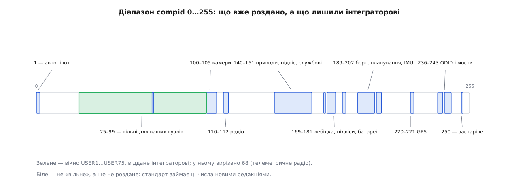

# 📋 Номери компонентів MAVLink і поля адресації

Це структурна довідка про три речі, які доводиться шукати щоразу наново, коли збираєш апарат із кількох вузлів: які числа перелік `MAV_COMPONENT` уже роздав і які лишив вільними; які повідомлення взагалі несуть у собі адресата, а які ні; і якими параметрами прошивки задають власну пару номерів. Наприкінці — структура, з якої кодек дістає відповідь на питання «де в цьому пакеті лежить адресат», не розбираючи самих полів.

Числа звірено з `minimal.xml` і `common.xml` дерева `mavlink/mavlink` та із заголовками `c_library_v2` станом на серпень 2026 року. Перелік `MAV_COMPONENT` шукати треба саме в `minimal.xml`: його переселили туди з `common.xml`, щоб мінімальний набір визначень був самодостатнім і не тягнув за собою весь спільний словник повідомлень.

## Перелік MAV_COMPONENT

Порожній рядок «не роздано» тут не декоративний — саме він показує, куди стандарт має право дописати нове ім'я в наступній редакції.

| номер | ім'я в переліку | що це |
|---|---|---|
| 0 | `MAV_COMP_ID_ALL` | адреса розсилання; ніколи не буває номером відправника |
| 1 | `MAV_COMP_ID_AUTOPILOT1` | польотний контролер; передбачено рівно один на апарат |
| 2…24 | — | не роздано |
| 25…67 | `MAV_COMP_ID_USER1` … `USER43` | будь-яке призначення в приватній мережі |
| 68 | `MAV_COMP_ID_TELEMETRY_RADIO` | телеметричне радіо (SiK та інші джерела `RADIO_STATUS`) |
| 69…99 | `MAV_COMP_ID_USER45` … `USER75` | продовження того самого вікна; імені `USER44` більше немає |
| 100…105 | `MAV_COMP_ID_CAMERA` … `CAMERA6` | камери 1–6 |
| 106…109 | — | не роздано |
| 110…112 | `MAV_COMP_ID_RADIO` … `RADIO3` | радіомодулі 1–3 |
| 113…139 | — | не роздано |
| 140…153 | `MAV_COMP_ID_SERVO1` … `SERVO14` | сервоприводи 1–14 |
| 154 | `MAV_COMP_ID_GIMBAL` | підвіс 1 |
| 155 | `MAV_COMP_ID_LOG` | реєстратор |
| 156 | `MAV_COMP_ID_ADSB` | приймач-передавач ADS-B |
| 157 | `MAV_COMP_ID_OSD` | накладання показників на відеопотік |
| 158 | `MAV_COMP_ID_PERIPHERAL` | периферія, що не тримає служби параметрів |
| 159 | `MAV_COMP_ID_QX1_GIMBAL` | ⚠ **застаріле** — замість нього `GIMBAL` (154) |
| 160 | `MAV_COMP_ID_FLARM` | сповіщувач зіткнень FLARM |
| 161 | `MAV_COMP_ID_PARACHUTE` | парашутна система |
| 162…168 | — | не роздано |
| 169 | `MAV_COMP_ID_WINCH` | лебідка |
| 170 | — | не роздано |
| 171…175 | `MAV_COMP_ID_GIMBAL2` … `GIMBAL6` | підвіси 2–6 |
| 176…179 | — | не роздано |
| 180…181 | `MAV_COMP_ID_BATTERY`, `BATTERY2` | розумні батареї 1–2 |
| 182…188 | — | не роздано |
| 189 | `MAV_COMP_ID_MAVCAN` | клієнт CAN поверх MAVLink |
| 190 | `MAV_COMP_ID_MISSIONPLANNER` | той, хто вміє видати план місії: станція або програмний інтерфейс розробника |
| 191…194 | `MAV_COMP_ID_ONBOARD_COMPUTER` … `4` | бортові комп'ютери загального призначення |
| 195 | `MAV_COMP_ID_PATHPLANNER` | прокладач шляху між точками за обмеженнями |
| 196 | `MAV_COMP_ID_OBSTACLE_AVOIDANCE` | обхід перешкод |
| 197 | `MAV_COMP_ID_VISUAL_INERTIAL_ODOMETRY` | оцінювач положення за відео й інерцією |
| 198 | `MAV_COMP_ID_PAIRING_MANAGER` | спарювання апарата зі станцією |
| 199 | — | не роздано |
| 200…202 | `MAV_COMP_ID_IMU`, `IMU_2`, `IMU_3` | інерційні блоки 1–3 |
| 203…219 | — | не роздано |
| 220…221 | `MAV_COMP_ID_GPS`, `GPS2` | приймачі супутникової навігації 1–2 |
| 222…235 | — | не роздано |
| 236…238 | `MAV_COMP_ID_ODID_TXRX_1` … `_3` | приймачі-передавачі Open Drone ID |
| 239 | — | не роздано |
| 240 | `MAV_COMP_ID_UDP_BRIDGE` | міст MAVLink у UDP |
| 241 | `MAV_COMP_ID_UART_BRIDGE` | міст MAVLink у UART |
| 242 | `MAV_COMP_ID_TUNNEL_NODE` | обробник повідомлень `TUNNEL` |
| 243 | `MAV_COMP_ID_ILLUMINATOR` | освітлювач |
| 244…249 | — | не роздано |
| 250 | `MAV_COMP_ID_SYSTEM_CONTROL` | ⚠ **застаріле** — замість нього `ALL` (0) |
| 251…255 | — | не роздано |


*Не роздано понад сотню чисел із 256 — але вашим із них є лише зелене вікно; решта чекає на нові імена зі стандарту.*

**Вікно 25…99 — єдине, що віддано вам.** Опис `USER*` каже прямо: номер для вузла в приватно керованій мережі, призначення довільне. Решта проміжків у смузі — не вільне місце, а ще не роздане; вузол, посаджений на 205, одного дня зустрінеться з новим іменем зі стандарту, і зіткнення проявиться вже в польоті.

**У вікні USER є вирізка.** Число 68 колись звалося `USER44`, але радіомодулі SiK історично підписувалися саме ним, коли слали `RADIO_STATUS`. Стандарт визнав те, що вже сталося, і замінив загальне ім'я на `MAV_COMP_ID_TELEMETRY_RADIO`. Тому 68 з вікна треба подумки викреслити: там уже хтось сидить, і ви його не вибирали.

**Номери в переліку — заводські усталені, а не оголошення типу.** Другу камеру на апараті доведеться зсунути на 101, самозроблений вузол цілком законно сяде на 45, а старанно перенумероване обладнання поламає будь-який здогад «100 — значить камера». Тип пристрою питають у полі `MAV_TYPE` повідомлення [HEARTBEAT](topic:sys-dron/mavlink-heartbeat), а номер відповідає лише на питання «куди слати».

**Діапазони, ширші за перелік.** Свій діалект має право дописати власні імена компонентів, і роблять це охоче — тому число, якого немає в цій таблиці, може щось означати у вашій збірці й нічого не означати в сусідній. Межі, за якими це відбувається, — у темі про [діалекти MAVLink](topic:sys-dron/mavlink-dialect).

> 🔧 **Навіщо це.** Порядок вибору номера для власного вузла виходить із таблиці сам собою. Якщо пристрій справді належить до відомого класу й такий на апараті один — беріть заводське число (камера на 100, лебідка на 169): чужі станції знайдуть його там, де шукають. Якщо пристроїв класу кілька — беріть наступне з того самого діапазону, поки він не скінчився. Якщо класу в переліку немає взагалі — беріть із вікна 25…99, обходячи 68, і **запишіть вибір у документацію збірки**: перевірити зайнятість числа на працюючому апараті нема чим — окремого протоколу переклику «хто тут є» MAVLink не має, вузли лише самі оголошуються серцебиттям. Тож єдиний доступний спосіб — послухати ефір і подивитися, чиї підписи в ньому з'являються; вузол, який поки мовчить, у такій перевірці не проступить.

## Хто несе адресата

Поля `target_system` і `target_component` — не частина заголовка, а звичайні поля корисних даних, оголошені в XML-описі конкретного типу. Тому питання «кому це» має сенс лише разом із номером повідомлення. Нижче — поширені типи `common.xml`, згруповані за тим, що саме в них є.

| несуть обидва поля | навіщо |
|---|---|
| `COMMAND_LONG` (76), `COMMAND_INT` (75), `COMMAND_CANCEL` (80) | разова дія й відмова від неї |
| `COMMAND_ACK` (77) | підтвердження — із застереженням нижче |
| `PARAM_REQUEST_READ` (20), `PARAM_REQUEST_LIST` (21), `PARAM_SET` (23) | читання й запис [параметрів](topic:sys-dron/mavlink-param-protocol-model) |
| `PARAM_EXT_REQUEST_READ` (320), `PARAM_EXT_REQUEST_LIST` (321), `PARAM_EXT_SET` (323) | те саме для розширених параметрів |
| `MISSION_REQUEST_LIST` (43), `MISSION_COUNT` (44), `MISSION_REQUEST_INT` (51), `MISSION_ITEM_INT` (73), `MISSION_ACK` (47), `MISSION_CLEAR_ALL` (45), `MISSION_SET_CURRENT` (41) | увесь обмін [протоколу місій](topic:sys-dron/mavlink-mission-protocol) |
| `LOG_REQUEST_LIST` (117), `LOG_REQUEST_DATA` (119), `LOG_ERASE` (121), `LOG_REQUEST_END` (122) | вивантаження журналів |
| `REQUEST_DATA_STREAM` (66) | замовлення потоку телеметрії (застаріле на користь `MAV_CMD_SET_MESSAGE_INTERVAL`) |
| `RC_CHANNELS_OVERRIDE` (70) | підміна каналів апаратури керування |
| `SET_ATTITUDE_TARGET` (82), `SET_POSITION_TARGET_LOCAL_NED` (84), `SET_POSITION_TARGET_GLOBAL_INT` (86) | зовнішній контур керування |
| `PING` (4) | вимір затримки до конкретного вузла |
| `SERIAL_CONTROL` (126), `TIMESYNC` (111) | обидва здобули поля адресата як розширення MAVLink 2 |
| `FILE_TRANSFER_PROTOCOL` (110) | ще й `target_network` перед парою |
| `GIMBAL_MANAGER_SET_ATTITUDE` (282) | керування [підвісом](topic:sys-dron/mavlink-camera-gimbal) |

| без полів адресата | наслідок |
|---|---|
| `HEARTBEAT` (0), `SYS_STATUS` (1), `SYSTEM_TIME` (2) | службові оголошення для всіх |
| `ATTITUDE` (30), `GLOBAL_POSITION_INT` (33), `GPS_RAW_INT` (24), `ALTITUDE` (141), `VFR_HUD` (74) | потік стану |
| `RC_CHANNELS` (65), `BATTERY_STATUS` (147), `EXTENDED_SYS_STATE` (245) | те саме |
| `PARAM_VALUE` (22) | **відповідь без адресата**: значення параметра йде розсиланням усім |
| `MISSION_CURRENT` (42), `MISSION_ITEM_REACHED` (46), `HOME_POSITION` (242) | поточний пункт, досягнення пункту, точка дому — теж усім |
| `STATUSTEXT` (253), `RADIO_STATUS` (109) | текст і стан лінії для всіх слухачів |

Кілька рядків цих таблиць кусають частіше за решту.

**`SET_MODE` (11) має тільки `target_system`.** Поля компонента там немає й не передбачено: режим за визначенням належить апарату, а не котромусь його вузлу. Код, що сліпо шукає в кожному «зверненні» пару сусідніх байтів, на цьому типі прочитає замість другого з них `base_mode` — і рішення про адресата вийде з довільного числа.

**`COMMAND_ACK` носить адресата як розширення MAVLink 2.** Пара `target_system`/`target_component` там оголошена після `<extensions/>`, разом із `progress` і `result_param2`. Практичних наслідків два. Відправник, що працює по MAVLink 1, ці байти взагалі не передасть. Відправник по MAVLink 2, який їх не заповнив, теж нічого не передасть — порожній хвіст корисних даних при кодуванні відтинають, — і приймач побачить нулі, тобто «підтвердження всім». Саме тому дві наземні станції на спільній лінії іноді бачать чужі підтвердження: не через збіг номерів, а через прошивку, яка не заповнює розширення.

**`MANUAL_CONTROL` (69) не має `target_system`.** Її поле зветься просто `target`, і це не синонім: генератор шукає в описі поля з точними іменами `target_system` і `target_component`, тож для маршрутизатора це повідомлення — оголошення без адресата. Наслідок буквальний: міст роздає його в усі канали, а кожен апарат на лінії мусить сам порівняти `target` зі своїм `sysid` і зайве відкинути.

Окремо варто тримати в голові третє поле `FILE_TRANSFER_PROTOCOL`: там перед звичайною парою стоїть `target_network`, і його теперішнє призначення — завжди нуль. Поле лишили як запас на випадок, коли одна пара `sysid`/`compid` існуватиме в кількох незалежних мережах; жодна чинна реалізація його не розрізняє, тож заповнювати його чимось іншим означає лише зіпсувати сумісність.

Нуль в `target_component` — це не «байдуже кому», а вимога до всіх. Служба параметрів формулює її прямо: кожен компонент зобов'язаний відповісти на запит, надісланий і на його власний номер, і на `MAV_COMP_ID_ALL`. Звідси практична різниця між двома звертаннями, які виглядають однаково. `PARAM_REQUEST_LIST` із `target_component = 1` дає перелік параметрів автопілота; той самий запит із нулем змусить озватися ще й камеру, підвіс і борткомп'ютер, і в потоці опиняться кілька списків з однаковими іменами параметрів, розрізнити які можна лише за підписом у заголовку кожного кадру.

## Параметри, якими задають власні номери

| прошивка | параметр | що задає | усталено |
|---|---|---|---|
| ArduPilot | `SYSID_THISMAV` | `sysid` апарата | 1 |
| PX4 | `MAV_SYS_ID` | `sysid` апарата | 1 |
| PX4 | `MAV_COMP_ID` | `compid` самого автопілота | 1 |

Кожен із цих номерів набуває чинності лише після перезавантаження: він іде в заголовок кожного вихідного кадру, і міняти його на льоту означало б розірвати всі обміни, що вже в дорозі.

ArduPilot окремого параметра для `compid` не має — автопілот там завжди `1`, як і передбачає опис `MAV_COMP_ID_AUTOPILOT1` («очікується рівно один автопілот»). PX4 такий параметр має, але користуватися ним варто лише з ясною метою: наземні станції за домовленістю шукають автопілота саме на `compid 1`, і апарат, пересаджений на 50, для багатьох із них просто не існує.

Домовленість про `sysid` симетрична й неформальна: апарати беруть числа від 1 угору, наземні станції та інструменти розробника — від 255 униз, а програмні набори для розробки заведено селити десь посередині діапазону. Протокол цього не вимагає й не перевіряє; домовленість лише розводить табори по краях, щоб у звичайній збірці «один апарат плюс станція» зіткнення не сталося саме собою. Рій ламає її одразу: щойно апаратів більше одного, номери доводиться роздавати вручну й тримати список поза мережею — спитати про них у самої мережі нема кого.

## Як дістати адресата з довільного типу

Кодек, зібраний із XML-опису, носить таблицю записів — по одному на кожен відомий йому номер повідомлення. Саме звідти беруть і довжини, і додаток до контрольної суми, і зсуви полів адресата:

```c
typedef struct __mavlink_msg_entry {
    uint32_t msgid;
    uint8_t  crc_extra;
    uint8_t  min_msg_len;           /* без розширень MAVLink 2 */
    uint8_t  max_msg_len;           /* з розширеннями         */
    uint8_t  flags;                 /* MAV_MSG_ENTRY_FLAG_*   */
    uint8_t  target_system_ofs;     /* зсув у корисних даних, або 0 */
    uint8_t  target_component_ofs;  /* зсув у корисних даних, або 0 */
} mavlink_msg_entry_t;

#define MAV_MSG_ENTRY_FLAG_HAVE_TARGET_SYSTEM     1
#define MAV_MSG_ENTRY_FLAG_HAVE_TARGET_COMPONENT  2

const mavlink_msg_entry_t *mavlink_get_msg_entry(uint32_t msgid);
```

Прапорці тут не надмірність. Зсув `0` — цілком законне значення: у `CHANGE_OPERATOR_CONTROL` усі поля однобайтові, порядок оголошення зберігається, і `target_system` справді лежить першим байтом корисних даних. Тому «є поле» й «зсув дорівнює нулю» мусять бути різними питаннями, і відповідає на перше саме `flags`.

Друга тонкість — **зсув рахують у тому порядку, в якому поля лежать у кадрі, а не в порядку XML-опису**. [Генератор](topic:sys-dron/mavlink-xml-codegen) переставляє поля за спаданням розміру типу, зберігаючи порядок оголошення всередині однакового розміру; розширення MAVLink 2 не переставляються й лишаються в хвості. Через це поле, оголошене в описі першим, у кадрі опиняється майже наприкінці:

**Умова.** `COMMAND_LONG` оголошено як `target_system`, `target_component`, `command` (uint16), `confirmation`, `param1`…`param7` (float).

```
чотирибайтові:  param1…param7        зсуви  0…27
двобайтові:     command              зсув     28
однобайтові:    target_system        зсув     30
                target_component     зсув     31
                confirmation         зсув     32
                                     довжина  33 байти
```

**Висновок.** `target_system_ofs = 30`, `target_component_ofs = 31` — і жодного зв'язку з тим, що в описі ці поля стоять першими. Обчислювати їх самотужки не треба: генератор уже поклав готові числа в таблицю.

Найпростіший спосіб перевірити свою збірку — надрукувати кілька записів і подивитися, що в них насправді:

```c
#include <mavlink.h>
#include <stdio.h>

static void show(uint32_t msgid, const char *name)
{
    const mavlink_msg_entry_t *e = mavlink_get_msg_entry(msgid);
    if (!e) { printf("%-14s немає в таблиці цього діалекту\n", name); return; }

    printf("%-14s len %2u…%2u  crc_extra %3u  ",
           name, e->min_msg_len, e->max_msg_len, e->crc_extra);

    if (e->flags & MAV_MSG_ENTRY_FLAG_HAVE_TARGET_SYSTEM)
        printf("target_system@%u ", e->target_system_ofs);
    if (e->flags & MAV_MSG_ENTRY_FLAG_HAVE_TARGET_COMPONENT)
        printf("target_component@%u", e->target_component_ofs);
    if (!e->flags)
        printf("адресата немає");
    putchar('\n');
}

int main(void)
{
    show(MAVLINK_MSG_ID_COMMAND_LONG, "COMMAND_LONG");
    show(MAVLINK_MSG_ID_ATTITUDE,     "ATTITUDE");
    return 0;
}
```

```
COMMAND_LONG   len 33…33  crc_extra 152  target_system@30 target_component@31
ATTITUDE       len 28…28  crc_extra  39  адресата немає
```

Саме ця таблиця й дозволяє вирішувати долю пакета, не розбираючи його корисних даних: два порівняння з прапорцями, два читання байтів за готовими зсувами. Розуміти сам тип повідомлення при цьому не обов'язково — досить того, що він у таблиці є. А номер, якого в таблиці немає, вузол чесно не розпізнає, і саме тому такий пакет годиться вважати лише оголошенням для всіх: адресата з нього не дістати, а мовчки з'їдати чуже повідомлення міст не має права.
