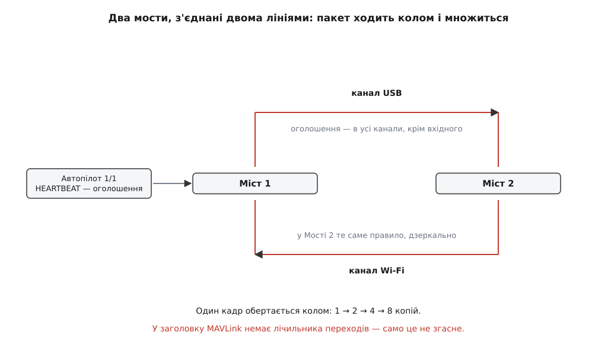

# ⚙️ Маршрутизатор MAVLink на три канали

Це працюючий міст на C: три лінії, жодного налаштування, а карту мережі він складає сам — із підписів на пакетах, які крізь нього проходять.

**Завдання.** Маємо три канали: UART до автопілота з підвісом, USB до борткомп'ютера, UDP до наземної станції. Хто де сидить, нам ніхто не сказав — і не міг сказати: реєстру вузлів у MAVLink немає, як немає й протоколу оголошення маршрутів. Треба з байтового потоку кожної лінії зібрати кадри й роздати їх так, щоб кожен дійшов туди, куди призначений, і не дійшов туди, куди не призначений.

**Задум** тримається на одному спостереженні: підпис відправника в заголовку кожного кадру — це безкоштовна розвідка. Прийнявши пакет, ми дізналися факт: пару `sysid/compid` чути **ось на цьому** каналі. Складаємо такі факти в таблицю, і питання «куди пересилати» перетворюється на пошук у ній. Але таблиця тут — не карта мережі, а **журнал спостережень**, і поводитися з нею треба відповідно: записувати, коли саме почули, і забувати старе.

### Таблиця почутого

Домен заданий намертво: код живе в прошивці або в бортовому демоні, працює на кожному байті лінії й не має права ні на алокації, ні на несподівані затримки. Це C.

```c
#include <mavlink.h>          /* c_library_v2, зібрана з XML-опису діалекту мережі */
#include <stddef.h>
#include <stdint.h>
#include <stdbool.h>

#define NCHAN         3       /* 0 — UART, 1 — USB, 2 — UDP.                     */
                              /* MAVLINK_COMM_NUM_BUFFERS мусить бути ≥ NCHAN:   */
                              /* у кожного каналу свій стан збирання кадру.      */
#define ROUTE_MAX     24
#define ROUTE_TTL_MS  30000u  /* чому саме стільки — наприкінці */

typedef struct {
    uint8_t  sysid, compid;   /* адреса вузла — пара, не одне число */
    uint8_t  chan;            /* канал, на якому його чули          */
    uint32_t seen_ms;         /* коли чули востаннє                 */
} route_t;

static route_t routes[ROUTE_MAX];
static uint8_t route_n;

/* Єдина зовнішня залежність усього моста. */
extern void chan_write(uint8_t chan, const uint8_t *buf, uint16_t len);

static bool fresh(const route_t *r, uint32_t now)
{
    return (uint32_t)(now - r->seen_ms) <= ROUTE_TTL_MS;
}
```

Вік запису рахуємо **відніманням у беззнаковій арифметиці**, а не порівнянням `now > seen_ms + TTL`. Різниця не косметична: перша форма правильно переживає обертання лічильника мілісекунд, друга на ньому ламається й оголошує всю таблицю свіжою рівно тоді, коли апарат уже кілька тижнів у повітрі.

Ключ запису — трійка, а не пара. Той самий вузол цілком законно чути на кількох каналах одразу, коли до нього ведуть два шляхи; тоді пересилати треба в обидва, і кожен шлях мусить мати свій рядок.

```c
static void route_learn(uint8_t sysid, uint8_t compid, uint8_t chan, uint32_t now)
{
    if (sysid == 0 || compid == 0)      /* нуль не буває адресою відправника */
        return;

    uint8_t  victim = 0;
    uint32_t oldest = 0;

    for (uint8_t i = 0; i < route_n; i++) {
        route_t *r = &routes[i];
        if (r->sysid == sysid && r->compid == compid && r->chan == chan) {
            r->seen_ms = now;           /* знайомий вузол на знайомому каналі */
            return;
        }
        uint32_t age = now - r->seen_ms;
        if (age >= oldest) { oldest = age; victim = i; }
    }

    if (route_n < ROUTE_MAX)                         /* є вільне місце        */
        routes[route_n++] = (route_t){ sysid, compid, chan, now };
    else if (oldest > ROUTE_TTL_MS)                  /* витісняємо лиш протухле */
        routes[victim]   = (route_t){ sysid, compid, chan, now };
    /* інакше таблиця повна живими вузлами — новачка не запам'ятовуємо */
}
```

### Куди віддавати

Рішення зручно виражати бітовою маскою каналів: її легко скласти з дозволів і так само легко відняти від неї заборони.

```c
/* Канали, де чули названу ціль. tcomp = 0 — будь-який вузол системи tsys. */
static uint8_t target_mask(uint8_t tsys, uint8_t tcomp, uint32_t now)
{
    if (tsys == 0)                              /* оголошення — потенційно всім */
        return (uint8_t)((1u << NCHAN) - 1u);

    uint8_t mask = 0;
    for (uint8_t i = 0; i < route_n; i++) {
        const route_t *r = &routes[i];
        if (!fresh(r, now))              continue;
        if (r->sysid != tsys)            continue;
        if (tcomp && r->compid != tcomp) continue;
        mask |= (uint8_t)(1u << r->chan);
    }
    return mask;                                /* 0 — пари не чули ніде: мовчимо */
}

/* Канали, на яких ми вже чули самого відправника цього пакета. */
static uint8_t source_mask(uint8_t sysid, uint8_t compid, uint32_t now)
{
    uint8_t mask = 0;
    for (uint8_t i = 0; i < route_n; i++) {
        const route_t *r = &routes[i];
        if (fresh(r, now) && r->sysid == sysid && r->compid == compid)
            mask |= (uint8_t)(1u << r->chan);
    }
    return mask;
}
```

### Гарячий шлях

```c
/* Кому призначено пакет. Зсуви полів target_* бере генератор з XML-опису. */
static void packet_target(const mavlink_message_t *m, uint8_t *tsys, uint8_t *tcomp)
{
    const mavlink_msg_entry_t *e = mavlink_get_msg_entry(m->msgid);

    *tsys = *tcomp = 0;                  /* немає адресата → оголошення для всіх */
    if (!e) return;
    if (e->flags & MAV_MSG_ENTRY_FLAG_HAVE_TARGET_SYSTEM)
        *tsys  = _MAV_PAYLOAD(m)[e->target_system_ofs];
    if (e->flags & MAV_MSG_ENTRY_FLAG_HAVE_TARGET_COMPONENT)
        *tcomp = _MAV_PAYLOAD(m)[e->target_component_ofs];
}

/* now — монотонний час у мілісекундах; from — номер каналу, звідки байти. */
void router_feed(uint8_t from, const uint8_t *in, size_t n, uint32_t now)
{
    mavlink_message_t msg;
    mavlink_status_t  st;

    for (size_t i = 0; i < n; i++) {
        /* from служить і номером каналу парсера: стан збирання в кожного свій */
        if (!mavlink_parse_char(from, in[i], &msg, &st))
            continue;                            /* кадр ще не зібрано або битий */

        route_learn(msg.sysid, msg.compid, from, now);

        uint8_t tsys, tcomp;
        packet_target(&msg, &tsys, &tcomp);

        uint8_t mask = target_mask(tsys, tcomp, now);
        mask &= (uint8_t)~(1u << from);                            /* не назад   */
        mask &= (uint8_t)~source_mask(msg.sysid, msg.compid, now); /* і не в коло */
        if (!mask) continue;

        uint8_t  out[MAVLINK_MAX_PACKET_LEN];
        uint16_t len = mavlink_msg_to_send_buffer(out, &msg);

        for (uint8_t c = 0; c < NCHAN; c++)
            if (mask & (1u << c))
                chan_write(c, out, len);
    }
}
```

Кадр пересилаємо **як є**: не перепідписуємо, не перенумеровуємо `seq`, не чіпаємо жодного байта корисних даних. `mavlink_msg_to_send_buffer` збирає той самий кадр, включно з блоком підпису, якщо [пакет підписаний](topic:sys-dron/mavlink-v2-signing) — а міст, який змінив би бодай байт, зробив би підпис недійсним і сам себе перетворив на порушника.

### Ціна

```
таблиця:      24 записи × 8 Б              = 192 Б
парсер:       3 канали × ≈300 Б            ≈ 900 Б
на кадр:      3 лінійні проходи × 24       ≤ 72 порівняння
при 100 кадр/с                             ≈ 7 200 порівнянь/с
```

Витрати губляться на тлі самого читання байтів із UART. Лінійний пошук тут не недбалість, а свідомий вибір: на двох десятках записів він швидший за будь-яку хеш-таблицю, бо вся таблиця вміщається в кеш і не потребує ні гешування, ні пам'яті з купи.

### Пастки

**Пакет, що повертається у власний канал.** Рядок `mask &= ~(1u << from)` схожий на дрібну гігієну рівно доти, доки канал не спільний. На UDP-сокеті з розсиланням, на напівдуплексній лінії, на будь-якій шині, де відправник чує сам себе, віддати пакет назад — означає негайно прийняти його вдруге, вивчити вдруге й віддати втретє. Один кадр забиває лінію за секунди. Захист від відправника нижче робить те саме в загальнішому вигляді, але потрібні обидва рядки: пакет, безглуздо підписаний нулями, у таблицю не потрапляє взагалі — і тоді єдиним, що втримує його від повернення, лишається `from`.

**Закільцювання між двома мостами.**


*Кожен міст поводиться бездоганно за своїм правилом. Кільце створює не помилка в правилі, а те, що правил двоє й вони дзеркальні.*

Дві коробки, з'єднані двома лініями одночасно, — не екзотика, а звичайний спосіб «щоб напевно»: борткомп'ютер бачить автопілот і по USB, і по Wi-Fi. Оголошення (`target_system = 0`) за правилом іде в усі канали, крім вхідного. Міст 1 віддає серцебиття автопілота в обидві лінії; Міст 2 отримує дві копії й кожну віддає в іншу лінію — назад до Мосту 1. Далі кількість копій подвоюється щообертом.

Зупинитися само це **не може**. У заголовку MAVLink немає нічого схожого на лічильник переходів [IP](topic:com-transport/ip-routing): жодне поле не зменшується на мості, тож кадрові немає де померти. Ловити повтори за [номером послідовності](topic:com-transport/sequence-numbering) теж не вийде — `seq` восьмибітний і обертається кожні 256 пакетів, тобто менш ніж за секунду живої телеметрії.

Ріже кільце `source_mask`. Міст 2 чує автопілот `1/1` на обох лініях, що ведуть до Мосту 1, — отже, жоден пакет, підписаний `1/1`, туди не піде. Правило коротке: **не віддавай вузлові те, що прийшло від нього самого**. Саме так робить і `mavlink-router`, найпоширеніший окремий маршрутизатор для борту; в ArduPilot той самий вузол розв'язують інакше — маскою `no_route_mask`, якою канал вручну оголошують приватним і виводять з маршрутизації взагалі.

**Незнайомий msgid.** Правило протоколу просте: тип, якого міст не знає, він мусить вважати оголошенням і віддати всім, інакше мовчки з'їдав би чужі повідомлення. Це роблять два рядки з нулями на початку `packet_target`.

Але глибша пастка спрацьовує **раніше** за це правило. Байт `CRC_EXTRA`, що входить у контрольну суму й залежить від опису повідомлення, парсер бере з тієї самої таблиці типів. Не знайшовши в ній `msgid`, він не має звідки взяти цей байт, суму порахувати не може — і оголошує кадр битим. `mavlink_parse_char` поверне нуль, і твоє правило «незнайоме — всім» навіть не отримає шансу спрацювати: кадру для нього вже не існує.

Наслідок практичний: міст збирають із **найширшого діалекту**, який ходить у цій мережі, а не з того, що потрібен йому самому для роботи. Міст на голому `common`, поставлений між станцією та автопілотом із власним [діалектом](topic:sys-dron/mavlink-dialect), тихо ковтне частину трафіку — а симптом буде «камера не відповідає», а зовсім не «помилка розбору».

**Переповнення таблиці.** Запис — це не вузол, а пара «вузол × канал»: один компонент, почутий на трьох лініях, займає три рядки. Двадцять чотири записи — це, отже, вісім вузлів у найгіршому разі, і на групі апаратів цього мало. В ArduPilot межа ще жорсткіша: `MAVLINK_MAX_ROUTES` дорівнює 20.

Питання не в тому, чи таблиця переповниться, а що робити, коли переповнилася. Витіснити найстаріший **живий** запис — звична тактика кешів — тут коштує дорого: тихий, але справний вузол (камера, що озивається лише у відповідь) зникне з маршрутів, і команда до нього перестане доходити без жодної ознаки помилки. Тому код вище відмовляє **новачкові**, доки всі місця зайняті свіжими записами. Деградація стає передбачуваною: мережа не забуває тих, кого вже знає, а новий вузол пропишеться, щойно звільниться місце — тобто щойно хтось замовкне на цілий TTL.

**Чому запис мусить старіти.** Нічого в MAVLink не оголошує «я йду». Вузол просто перестає говорити: висмикнули кабель, сів акумулятор, апарат вийшов за межу радіо. Єдиний доступний сигнал відсутності — тиша, а тишу можна виміряти лише годинником; без годинника таблиця вміє тільки рости.

Ціна вічних записів видна на трьох звичайних подіях. Борткомп'ютер, перевтикнутий з USB у Wi-Fi, назавжди лишає по собі рядок «канал USB» — і половина адресованого йому трафіку далі йде в мертву лінію. Апарат, якому змінили `sysid`, лишає привида зі старою парою чисел, що вічно займає місце. Наземна станція, яка від'єдналася й повернулася під іншим номером, додає ще один. Через годину роботи таблиця складається переважно з тих, кого вже немає, — і саме через них живим місця не лишається.

TTL добирають з єдиної опори, що в мережі є: кожен компонент зобов'язаний слати [HEARTBEAT](topic:sys-dron/mavlink-heartbeat) приблизно раз на секунду. Живий вузол оновлює свій запис тридцять разів за наші тридцять секунд, тож випадковий пропуск запису не вб'є. З іншого боку, коротший TTL спокусливий (привиди щезають швидше), але небезпечний: радіо, що завмерло на п'ять секунд, стерло б апарат із маршрутів саме тоді, коли оператор тисне «повертайся». Тридцять секунд — це «пережити провал зв'язку, але не пережити політ».

ArduPilot, до речі, записів не старить узагалі: маршрут тримається до перезавантаження, а скидання апарата ловлять окремим прийомом — за тим, що `time_boot_ms` у `SYSTEM_TIME` раптом зменшився. Для одного апарата з незмінною обв'язкою це робочий компроміс. Для моста, крізь який за день проходять різні вузли, — ні.
