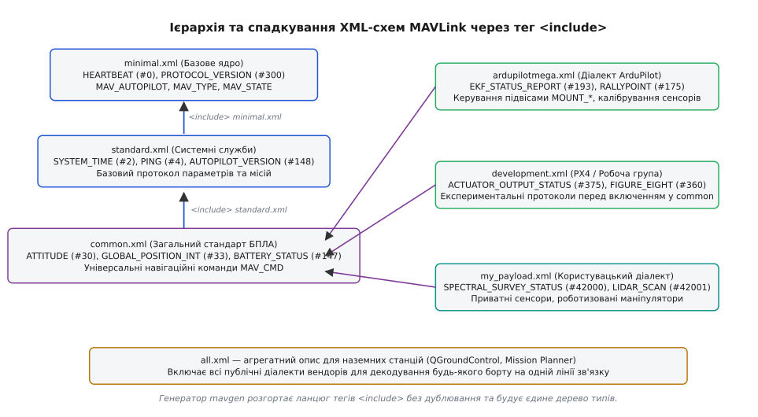
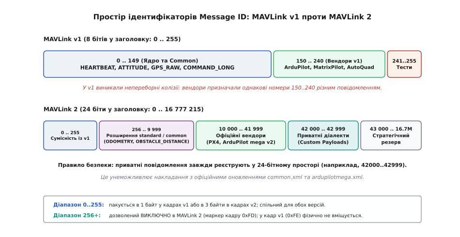
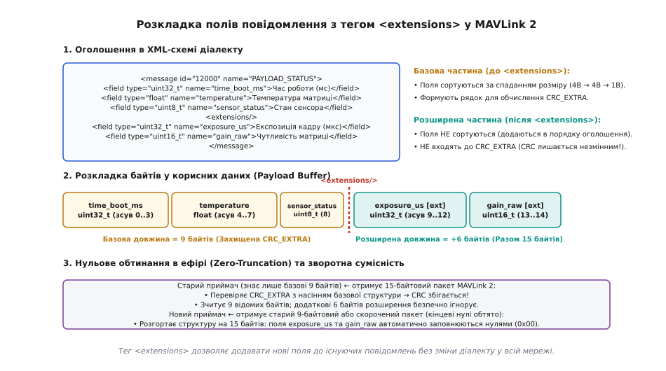
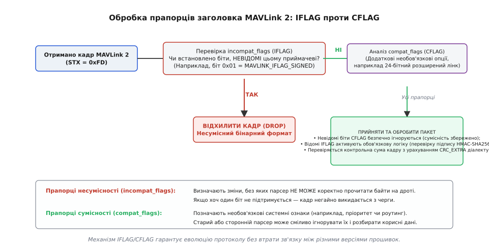

# Діалекти MAVLink: архітектура модульності, розширення та інтеграція

<preknowlist>
- [Пакет MAVLink](topic:sys-dron/mavlink-packet) — будова бінарного кадру: стартовий байт, заголовок, визначник повідомлення, прапорці сумісності та контрольна сума.
- [Генерація коду з XML-опису MAVLink](topic:sys-dron/mavlink-xml-codegen) — трансляція XML-схем інструментом mavgen, сортування полів за спаданням розміру та обчислення CRC_EXTRA.
- [CRC](topic:com-modulation/crc) — алгоритми контрольної суми CRC-16 для захисту цілісності пакетів у завадових каналах.
- [XML](topic:sf-data/xml-markup) — деревоподібна структура XML, вкладені елементи та атрибути як мова опису даних.
- [Пакування бінарного протоколу](topic:com-protocol/wire-format-packing) — серіалізація структур, порядок байтів (little-endian) та вирівнювання даних без заповнювачів.
- [Мова опису інтерфейсів (IDL)](topic:com-protocol/interface-definition-language) — підхід єдиного джерела істини (single source of truth) та кодогенерація для різнорідних систем.
</preknowlist>

У безпілотному комплексі на одній радіочастоті 915 МГц одночасно працюють квадрокоптер повітряного моніторингу з тепловізійним підвісом, гексакоптер-ретранслятор із лазерним далекоміром, агроноводрон із системою обприскування та дві наземні станції керування. Кожен борт має власний набір специфічних датчиків і виконавчих механізмів: агродрону потрібно щосекунди транслювати тиск у форсунках і рівень залишку рідини в баку, підвісу камери — кути повороту безколекторних двигунів і температуру матриці, а ретранслятору — метрики завадостійкості радіоканалу. Якщо зашити всі ці вузькоспеціалізовані поля в єдину монолітну структуру телеметрії, розмір базового пакета зросте з 30 до сотень байтів, і вузький радіоканал із пропускною здатністю 57600 бод миттєво захлинеться.

Якщо ж піти протилежним шляхом — дозволити кожній команді розробників створити власну ізольовану прошивку з довільним набором двійкових пакетів, — зникає інтероперабельність. Наземна станція керування перестане розпізнавати координати GPS та висоту сусіднього апарата, а диспетчер повітряного простору не зможе уникнути зіткнення в повітрі.

Архітектура MAVLink (Micro Air Vehicle Link) розв'язує цю дилему за допомогою **діалектів** (англ. *dialects*, від грец. *dialektos* — «наріччя, говірка»). Діалект — це модульне XML-визначення, яке успадковує стандартний словник загальноприйнятих повідомлень і додає до нього суворо ізольовані вендорні чи користувацькі структури, переліки констант та навігаційні команди. Завдяки цій схемі всі учасники повітряного руху використовують спільну базову мову для польотного керування, зберігаючи повну свободу розширення для унікального корисного навантаження.

---

### Ієрархія та спадкування схем через тег `<include>`

Основою модульності MAVLink є спрямований ациклічний граф (DAG) XML-документів, вершини якого пов'язуються за допомогою тегу `<include>`. Замість копіювання тиражованих повідомлень із репозиторію в репозиторій розробник діалекту посилається на базовий файл, отримуючи автоматичний доступ до всіх його типів, переліків та структур.


*Багаторівневе успадкування схем MAVLink: від мінімального ядра minimal.xml через системні служби standard.xml та загальний стандарт common.xml до спеціалізованих діалектів вендорів.*

Дерево визначень організоване за рівнями абстракції та функціонального призначення:

1. **`minimal.xml` (Базове ядро ідентифікації).** Автономний файл, що не містить жодного включення. У ньому визначено лише два критично важливі повідомлення: `HEARTBEAT` (ідентифікатор `#0`), за яким вузли дізнаються про тип системи, автопілот і режим польоту, та `PROTOCOL_VERSION` (`#300`). Цього мінімуму достатньо для завантажувачів мікроконтролерів (bootloaders), простих радіомаяків або супутникових передавачів із мікроскопічною пам'яттю, де немає місця для повного стеку автопілота.
2. **`standard.xml` (Фундаментальні системні служби).** Підключає `minimal.xml` і додає системні механізми, обов'язкові для будь-якого керованого робота: протокол синхронізації бортового часу `SYSTEM_TIME` (`#2`), перевірку якості зв'язку `PING` (`#4`), читання апаратних ревізій `AUTOPILOT_VERSION` (`#148`), а також базовий обмін конфігураційними параметрами.
3. **`common.xml` (Загальноприйнятий стандарт безпілотних систем).** Включає `standard.xml` і визначає універсальну мову роботизованих платформ. Сюди входять просторова орієнтація `ATTITUDE` (`#30`), глобальні географічні координати `GLOBAL_POSITION_INT` (`#33`), стан батареї `BATTERY_STATUS` (`#147`), керування точками маршруту (waypoint protocol) та фундаментальний перелік навігаційних команд `MAV_CMD`. Усі загальнодоступні наземні станції (QGroundControl, Mission Planner) гарантовано підтримують `common.xml`.
4. **Вендорні та спеціалізовані діалекти.** Розширюють `common.xml` специфікою конкретних екосистем:
   - `ardupilotmega.xml` — діалект польотного стеку ArduPilot. Містить розширені діагностичні звіти фільтра калманів `EKF_STATUS_REPORT` (`#193`), протокол ралі-точок `RALLYPOINT` (`#175`), команди калібрування компасів та керування підвісами камер.
   - `development.xml` / `px4.xml` — полігон стеку PX4 та робочої групи дронів Dronecode. Містить нові чорнові стандарти (наприклад, керування приводами `ACTUATOR_OUTPUT_STATUS` `#375` чи фігури польоту «вісімка» `FIGURE_EIGHT` `#360`), які проходять випробування перед перенесенням у `common.xml`.
   - `my_payload.xml` — приватні користувацькі діалекти виробників корисного навантаження, магнітометрів, тепловізорів, систем скидання вантажу та маніпуляторів.
5. **`all.xml` (Агрегатний опис).** Спеціальний метадіалект, який підключає абсолютно всі публічні XML-файли репозиторію. Він використовується розробниками універсальних аналізаторів трафіку (наприклад, Wireshark, MAVProxy) та наземних станцій, щоб згенерований бінарний кодек міг розпізнати й декодувати пакет будь-якого вендора, зафіксованого в ефірі.

Коли генератор коду [mavgen](topic:sys-dron/mavlink-xml-codegen) отримує на вхід файл діалекту, він будує абстрактне синтаксичне дерево (AST) та рекурсивно розгортає ланцюг тегів `<include>`. Щоб уникнути нескінченної рекурсії або повторного парсингу вже завантажених визначень, генератор підтримує глобальний реєстр канонічних шляхів оброблених XML-файлів.

Під час злиття схем діє детерміноване правило комбінування елементів:
* **Злиття переліків (`<enums>`):** Якщо базовий файл `common.xml` оголошує перелік команд `MAV_CMD`, а діалект `ardupilotmega.xml` містить блок `<enum name="MAV_CMD">` із новими записами `<entry>`, генератор об'єднує їх в єдиний монолітний перелік. Нові константи вендора отримують унікальні числові значення та стають доступними поруч зі стандартними.
* **Перевірка дублювання значень:** Якщо діалект намагається зареєструвати запис `<entry value="120">` з іменем або числовим кодом, який уже існує в цьому переліку, генератор сигналізує про помилку дублювання константи.
* **Заборона конфліктів повідомлень:** Якщо два файли дерева містять елемент `<message>` з однаковим числовим ідентифікатором `id` або однаковим рядковим ім'ям `name`, компіляція аварійно зупиняється. Перевизначення (overriding) повідомлень у MAVLink суворо заборонено: кожне повідомлення в усьому дереві зобов'язане мати унікальний числовий номер та унікальне ім'я.

Повна специфікація синтаксичних конструкцій XML, допустимих атрибутів, структури тегів та правил валідації наведена у довіднику [Специфікація XML-схеми діалектів MAVLink](topic:sys-dron/mavlink-dialect/api-dialect-xml-schema.md).

---

### Простір ідентифікаторів повідомлень: від 8 до 24 бітів

Кожне повідомлення у словнику MAVLink ідентифікується цілим беззнаковим числом — **Message ID** (MSG ID). Це число записується в заголовок кожного бінарного кадру і слугує ключем, за яким приймач визначає довжину корисного навантаження, розкладку полів і відповідну функцію зворотного виклику.

Історично простір ідентифікаторів зазнав радикальної перебудови:


*Порівняння простору ідентифікаторів Message ID: жорсткі межі 8-бітного кадру v1 та масштабована 24-бітна структура MAVLink 2.*

У протоколі MAVLink 1 під ідентифікатор було виділено рівно 1 байт у заголовку, що обмежувало протокол 256 повідомленнями (від `0` до `255`). Цей простір було директивно поділено на три діапазони:
* `0 .. 149` (150 номерів) — зарезервовано для загальних повідомлень `minimal.xml`, `standard.xml` та `common.xml`.
* `150 .. 240` (91 номер) — простір для кастомних діалектів виробників (ArduPilot, AutoQuad, MatrixPilot, ASLUAV).
* `241 .. 255` (15 номерів) — тимчасові тестові повідомлення для розробників.

Уже до 2015 року цей простір було вичерпано. Різні виробники обладнання почали призначати однаковий номер (наприклад, `#180`) власним несумісним повідомленням: у діалекті одного вендора це була телеметрія лебідки, а в іншого — статус газоаналізатора. Коли такі пристрої підключали до однієї шини, виникала катастрофічна колізія: наземна станція намагалася інтерпретувати зміщення байтів лебідки за схемою газоаналізатора.

У версії MAVLink 2 розмір поля Message ID було збільшено з 8 до **24 бітів** (3 байти в заголовку кадру, молодшим байтом уперед). Це розширило теоретичний простір до **16 777 216** унікальних повідомлень (від `0` до `16777215`).

Сучасна архітектура розподілу 24-бітного адресного простору усуває ризик колізій завдяки чіткому зонуванню:

```
Діапазон Message ID          Призначення та статус
─────────────────────────────────────────────────────────────────────────────
0 .. 255                     Збереження зворотної сумісності з MAVLink 1.
                             Повідомлення з цими ID можуть транслюватися
                             як у кадрі v1 (0xFE), так і у кадрі v2 (0xFD).

256 .. 9 999                 Офіційні стандартизовані розширення MAVLink 2
                             (common.xml, standard.xml). Сюди входять
                             ODOMETRY (#331), OBSTACLE_DISTANCE (#330),
                             TUNNEL (#385), OPEN_DRONE_ID (#12900).

10 000 .. 41 999             Офіційно зареєстровані простори вендорів
                             та консорціумів (ArduPilot, PX4, MAVGate).

42 000 .. 42 999             Приватний користувацький діапазон (Custom Range).
                             Виділено для внутрішніх розробок, закритих
                             комерційних проєктів та експериментальних датчиків.

43 000 .. 16 777 215         Довгостроковий стратегічний резерв стандарту.
─────────────────────────────────────────────────────────────────────────────
```

> 🔧 **Навіщо це.** Якщо ви створюєте власне нестандартне повідомлення для проєкту (наприклад, для власного підвісу чи лідара), **завжди вибирайте ідентифікатор у діапазоні 42000..42999**. Якщо призначити номер із діапазону 0..255 або 300..1000, чергове оновлення `common.xml` від міжнародної робочої групи MAVLink створить офіційне повідомлення з таким самим номером, що призведе до конфлікту компіляції та відмови парсера.

---

### Анатомія XML-визначення: типи, енуми та повідомлення

Файл діалекту є стандартним XML-документом, кореневим елементом якого є тег `<mavlink>`. Усередині нього розташовані заголовні метадані, секція переліків `<enums>` та секція структур `<messages>`.

Розглянемо типовий фрагмент визначення діалекту:

```xml
<?xml version="1.0"?>
<mavlink>
  <include>common.xml</include>
  <version>3</version>
  <dialect>42</dialect>

  <enums>
    <enum name="LASER_RANGEFINDER_STATE">
      <description>Робочі режими лазерного далекоміра.</description>
      <entry value="0" name="LASER_STATE_OFF">
        <description>Лазер вимкнено.</description>
      </entry>
      <entry value="1" name="LASER_STATE_STANDBY">
        <description>Очікування команди вимірювання.</description>
      </entry>
      <entry value="2" name="LASER_STATE_EMITTING">
        <description>Випромінювання та активне вимірювання дистанції.</description>
      </entry>
      <entry value="4" name="LASER_STATE_OVERHEAT_FAULT">
        <description>Аварія: перегрів випромінювача.</description>
      </entry>
    </enum>
  </enums>

  <messages>
    <message id="42010" name="LASER_RANGEFINDER_STATUS">
      <description>Поточний телеметричний статус лазерного далекоміра.</description>
      <field type="uint32_t" name="time_boot_ms" units="ms">Час від завантаження системи.</field>
      <field type="float"    name="distance_m"   units="m">Виміряна дистанція до цілі.</field>
      <field type="float"    name="voltage"      units="V">Напруга живлення модуля.</field>
      <field type="int16_t"  name="temperature"  units="cdeg">Температура модуля в сотих долях градуса.</field>
      <field type="uint8_t"  name="state"        enum="LASER_RANGEFINDER_STATE">Поточний стан.</field>
    </message>
  </messages>
</mavlink>
```

#### Система базових типів полів
MAVLink є суворо типізованим протоколом. Усі базові типи мають детермінований розмір у байтах, фіксований формат у пам'яті та прямий порядок байтів ([little-endian](topic:hw-arch/endianness)) на каналі передачі:

* `uint8_t`, `int8_t`, `char` — однобайтові цілі числа та символи (розмір 1 байт).
* `uint16_t`, `int16_t` — 16-бітні цілі числа (розмір 2 байти).
* `uint32_t`, `int32_t` — 32-бітні цілі числа (розмір 4 байти).
* `uint64_t`, `int64_t` — 64-бітні цілі числа (розмір 8 байтів).
* `float` — число з рухомою комою одинарної точності IEEE 754 (4 байти).
* `double` — число з рухомою комою подвійної точності IEEE 754 (8 байтів).
* `uint8_t_mavlink_version` — спеціальний службовий тип розміром 1 байт, у який генератор автоматично підставляє константу поточної мінорної версії MAVLink (використовується у повідомленні `HEARTBEAT`).
* Статичні масиви: позначаються додаванням розмірності в квадратних дужках, наприклад `type="char[16]"` (текстовий рядок фіксованої довжини) або `type="uint16_t[4]"` (вектор із чотирьох 16-бітних відліків).

#### Параметризація навігаційних команд `MAV_CMD`
Особливим випадком переліків у MAVLink є енум `<enum name="MAV_CMD">`. Він кодує не просто числові константи, а стандартизовані команди дій для апарата. Будь-яка команда `MAV_CMD` виконується через універсальні повідомлення-контейнери: `COMMAND_LONG` (`#76`) або `COMMAND_INT` (`#75`).

У двійковому кадрі повідомлення `COMMAND_LONG` містить поля цільової системи (`target_system`), цільового компонента (`target_component`), числовий номер команди `command` (`uint16_t`), лічильник підтверджень `confirmation` та рівно сім 32-бітних параметрів `param1 .. param7` типу `float`.

У XML-визначенні кожна команда супроводжується детальним описом призначення кожного з семи слотів параметрів за допомогою вкладених тегів `<param index="N">`:

```xml
<enum name="MAV_CMD">
  <entry value="42100" name="MAV_CMD_TRIGGER_LASER_PULSE">
    <description>Запустити серію високоточних лазерних імпульсів.</description>
    <param index="1" label="Кількість імпульсів" minValue="1" maxValue="1000" default="10">Кількість імпульсів у серії.</param>
    <param index="2" label="Частота (Гц)" units="Hz" minValue="1" maxValue="200" default="50">Частота повторення.</param>
    <param index="3" label="Потужність (%)" units="%" minValue="10" maxValue="100" default="100">Рівень випромінювання.</param>
    <param index="4" label="Зарезервовано">Порожній слот (передавати 0 або NaN).</param>
    <param index="5">Зарезервовано (NaN).</param>
    <param index="6">Зарезервовано (NaN).</param>
    <param index="7">Зарезервовано (NaN).</param>
  </entry>
</enum>
```

Коли наземна станція (наприклад, QGroundControl) завантажує такий діалект, вона автоматично формує в інтерфейсі оператора інтерактивне діалогове вікно з полями вводу, підписами параметрів, валідацією меж `minValue`/`maxValue` та одиницями вимірювання `units`. Розробнику корисного навантаження не потрібно вручну програмувати GUI для нової команди.

---

### Обчислення відбитка `CRC_EXTRA` для повідомлень діалекту

Коли дві системи обмінюються бінарними кадрами, приймач повинен мати абсолютну впевненість у тому, що передавач запакував поля з тими самими зміщеннями та типами, які очікує приймач. Передавати в кожному кадрі версію схеми неефективно: різні діалекти розвиваються асинхронно.

Для розв'язання цієї проблеми генератор обчислює для кожного повідомлення один байт відбитка — **`CRC_EXTRA`** (додаткове насіння контрольної суми).

#### Алгоритм формування рядка відбитка
Для кожного повідомлення генератор формує канонічний текстовий рядок за суворими математичними правилами:

1. Першим у рядок записується ім'я повідомлення у верхньому регістрі (наприклад, `LASER_RANGEFINDER_STATUS `), за яким ставиться пробіл.
2. Далі обробляються лише **базові поля** (поля до тегу `<extensions/>`).
3. Поля впорядковуються за **спаданням розміру базового типу** (8-байтові, потім 4-байтові, потім 2-байтові, потім 1-байтові). Поля однакового розміру зберігають відносний порядок із XML.
4. Для кожного поля в рядок додається назва типу, пробіл, ім'я поля та ще один пробіл. Для масивів розмірність додається до назви типу без пробілів: `uint16_t[4] sensor_raw `.

```
Приклад для повідомлення LASER_RANGEFINDER_STATUS:
Базові поля після сортування за спаданням розміру:
  - time_boot_ms (uint32_t, 4 байти)
  - distance_m   (float,    4 байти)
  - voltage      (float,    4 байти)
  - temperature  (int16_t,  2 байти)
  - state        (uint8_t,  1 байт)

Підсумковий канонічний рядок:
"LASER_RANGEFINDER_STATUS uint32_t time_boot_ms float distance_m float voltage int16_t temperature uint8_t state "
```

#### Математичне згортання в однобайтний відбиток
Отриманий рядок передається в алгоритм [CRC-16/MCRF4XX](topic:com-modulation/crc) (поліном `0x1021`, початкове значення `0xFFFF`). Отримане 16-бітне число згортається до одного байта за формулою:

```
CRC_EXTRA = (crc16 & 0x00FF) ^ (crc16 >> 8)
```

Під час передачі кадру передавач ініціалізує акумулятор CRC заголовком і тілом пакета, а наприкінці «догодовує» в CRC один байт `CRC_EXTRA`. Сам байт `CRC_EXTRA` **не передається по радіоканалу** — він зашитий у двійковий код обох сторін. Якщо визначення повідомлення в діалекті приймача хоча б на одну літеру чи тип відрізняється від діалекту передавача, обчислена контрольна сума не зійдеться, і пошкоджений або несумісний пакет буде тихо і безпечно відкинуто.

---

### Механізм розширень `<extensions>` та нульове обтинання

Однією з найскладніших інженерних проблем розподілених систем є сумісність версій (backward compatibility). Припустимо, у версії прошивки 1.0 польотний контролер шле повідомлення `CAMERA_STATUS` із чотирма полями розміром 12 байтів. Через рік у версії 2.0 до структури потрібно додати поле експозиції `exposure_us` (`uint32_t`) та коефіцієнт підсилення `gain_raw` (`uint16_t`).

У наївних двійкових протоколах зміна структури означає катастрофу:
1. Змінюється фізичний розмір корисних даних.
2. [Обчислення CRC_EXTRA](topic:sys-dron/mavlink-xml-codegen) від нового списку полів дає інший відбиток.
3. Стара наземна станція, отримавши новий кадр, не зможе перевірити контрольну суму й викине пакет у кошик. Оновлення одного вузла вимагає синхронного оновлення всього парку техніки.

MAVLink 2 розв'язує цю проблему через концепцію **полів розширення** за допомогою тегу `<extensions/>`.


*Схема полів розширення: базові поля сортуються за спаданням та формують CRC_EXTRA; поля після extensions не сортуються і не впливають на контрольну суму базової частини.*

#### Правила побудови та сортування полів розширення
Коли генератор `mavgen` обробляє повідомлення з тегом `<extensions/>`, він ділить список полів на дві ізольовані зони:

1. **Базова частина (поля перед тегом `<extensions/>`):**
   * Поля сортуються за спаданням розміру типу (8-байтові `uint64_t` / `double`, потім 4-байтові `uint32_t` / `float`, потім 2-байтові `uint16_t`, потім 1-байтові `uint8_t` / `char`). Це забезпечує природне вирівнювання в пам'яті мікроконтролера без байтів-заповнювачів ([пакування бінарного протоколу](topic:com-protocol/wire-format-packing)).
   * Базові поля формують текстовий рядок (ім'я повідомлення + типи та імена полів), з якого обчислюється однобайтний відбиток `CRC_EXTRA`.
2. **Розширена частина (поля після тегу `<extensions/>`):**
   * Поля **НЕ сортуються**. Вони розташовуються в пам'яті суворо в тому порядку, у якому записані в XML-файлі, одразу за кінцем базової частини.
   * Поля розширення **НЕ беруть участі в обчисленні `CRC_EXTRA`**.

Завдяки цьому значенню `CRC_EXTRA` повідомлення залишається ідентичним як для старої прошивки, так і для нової версії діалекту.

#### Механізм нульового обтинання (Zero-Truncation)
Радіоканал зв'язку має обмежену пропускну здатність. Якщо повідомлення містить поля розширення, які у 90% польотів дорівнюють нулю (наприклад, додаткові коди рідкісних помилок або нульові координати невикористаних сенсорів), передавати ці нульові байти в ефір марнотратно.

Передавач MAVLink 2 перед відправкою кадру переглядає буфер корисного навантаження від кінця до початку:
* Усі кінцеві байти, які мають значення `0x00`, відтинаються.
* Поле довжини корисних даних `len` у заголовку кадру зменшується до фактичного заповненого розміру (але не менше 1 байта, якщо тільки це не порожнє повідомлення).
* Контрольна сума CRC-16 рахується від фактично переданої скороченої довжини `len` із використанням базового насіння `CRC_EXTRA`.

Приймач виконує зворотну операцію:
* Отримавши кадр довжиною `len_received`, приймач копіює його в буфер повідомлення, а всі байти від `len_received` до повної максимальної довжини структури даного діалекту автоматично зануляє (`memset` нулями).

```
Сценарій 1: Старий приймач (знає 9 байтів) отримує новий пакет (15 байтів)
  Передавач (v2): [ Базові 9 байтів ] [ Розширення 6 байтів ] -> len = 15
  Старий приймач: читає заголовок -> знає структуру на 9 байтів.
                  Перевіряє CRC з базовим CRC_EXTRA -> СУМА ЗБІГАЄТЬСЯ!
                  Зчитує перші 9 байтів у свою структуру.
                  Хвіст із 6 байтів розширення безпечно ігнорує.

Сценарій 2: Новий приймач (знає 15 байтів) отримує старий або обтятий пакет (9 байтів)
  Передавач (v1/v2): [ Базові 9 байтів ] -> len = 9 (хвіст нулів відтято)
  Новий приймач:  перевіряє CRC з базовим CRC_EXTRA -> СУМА ЗБІГАЄТЬСЯ!
                  Копіює 9 байтів у структуру.
                  Байтам 10..15 присвоює значення 0x00.
                  Поля розширення exposure_us та gain набувають значення 0.
```

Це математично бездоганна схема: старе обладнання працює з новим без перекомпіляції, нове обладнання коректно взаємодіє зі старим, а радіоканал не перевантажується нулями.

---

### Маршрутизація діалектів: адресація компонентів та фільтрація

У сучасному безпілотному комплексі автопілот часто працює не як єдиний кінцевий вузол, а як комутатор повідомлень (маршрутизатор). На борту апарата можуть одночасно функціонувати кілька фізичних процесорів, з'єднаних шинами UART або CAN: польотний контролер (STM32H7), підвіс оптичної камери (ESP32), супутниковий модем Iridium та бортовий комп'ютер комп'ютерного зору (Raspberry Pi / NVIDIA Jetson).

Щоб приватні повідомлення діалектів досягали саме того модуля, для якого вони призначені, MAVLink використовує дворівневу систему адресації:
1. **`System ID` (SysID, 1..255):** Унікальний числовий ідентифікатор безпілотного апарата або наземної станції в радіомережі. SysID = 1 зазвичай належить першому дрону, SysID = 255 — наземній станції.
2. **`Component ID` (CompID, 1..255):** Ідентифікатор конкретної підсистеми всередині даного апарата ([компоненти MAVLink](topic:sys-dron/mavlink-component-id)). Константи визначено в переліку `MAV_COMPONENT`:
   - `MAV_COMP_ID_AUTOPILOT1` (`1`) — головний польотний контролер.
   - `MAV_COMP_ID_GIMBAL` (`154`) — триосьовий підвіс камери.
   - `MAV_COMP_ID_ONBOARD_COMPUTER` (`191`) — бортовий комп'ютер обробки відео.
   - `MAV_COMP_ID_PAYLOAD` (`100`) — спеціалізоване корисне навантаження.

Коли діалект визначає адресне повідомлення або команду (наприклад, калібрування далекоміра), структура обов'язково містить поля `target_system` та `target_component`.

```
Маршрутизація адресного пакета діалекту в польотному стеку:
1. Радіомодем отримує кадр MAVLink 2 з адресою SysID=1, CompID=100.
2. Польотний контролер (SysID=1, CompID=1) зчитує заголовок:
   - SysID збігається з бортовим номером -> кадр призначено цьому дрону.
   - CompID = 100 != 1 -> повідомлення призначено не автопілоту, а корисному навантаженню.
3. Комутатор польотного стеку перенаправляє бінарний буфер без декодування
   у відповідний UART-порт корисного навантаження (COMM_1 -> COMM_2).
```

Цей принцип наскрізного роутингу дозволяє польотному контролеру передавати повідомлення приватного діалекту між наземною станцією та датчиком, навіть якщо сам автопілот зібраний без знання цього діалекту.

---

### Узгодження версій та прапорці заголовка: IFLAG проти CFLAG

Заголовок кадру MAVLink 2 містить два спеціальні однобайтові поля прапорців, які визначають правила обробки бінарного кадру:
1. `incompat_flags` (Прапорці несумісності, `MAVLINK_IFLAG`).
2. `compat_flags` (Прапорці сумісності, `MAVLINK_CFLAG`).


*Алгоритм обробки прапорців: кадр із невідомим IFLAG негайно відхиляється, тоді як невідомий CFLAG не заважає парсингу корисних даних.*

Різниця між цими полями є принциповою для забезпечення стабільності мережі:

#### Прапорці несумісності (`incompat_flags`)
Якщо в полі `incompat_flags` встановлено хоча б один біт, призначення якого **невідоме поточному парсеру**, парсер зобов'язаний **негайно відкинути цей кадр** без спроби його розбору.

Невідомий прапорець несумісності означає, що фізична структура кадру на дроті змінилася настільки, що звичайний парсер не зможе безпечно знайти межі корисних даних чи контрольної суми.

* Біт 0 (`0x01`) — `MAVLINK_IFLAG_SIGNED` (Пакет підписано). Кадр містить додатковий 13-байтний хвіст цифрового підпису HMAC-SHA256 ([криптографічний підпис MAVLink 2](topic:sys-dron/mavlink-v2-signing)). Якщо приймач не підтримує підпис, він не зможе навіть правильно знайти байти контрольної суми CRC-16, тому кадр має бути відкинутий.
* Біти 1..7 — зарезервовані для майбутніх фундаментальних змін (наприклад, апаратного шифрування корисного навантаження або зміни формату заголовка).

#### Прапорці сумісності (`compat_flags`)
Якщо в полі `compat_flags` встановлено біти, невідомі парсеру, парсер **ігнорує ці біти і продовжує розбір кадру у штатному режимі**.

Прапорці сумісності використовуються для інформаційних позначок, які не змінюють зміщення байтів у кадрі:
* Пріоритет обробки повідомлення на бортовому комутаторі.
* Маршрутизація між ізольованими сегментами CAN/UART.
* Вимога зворотного підтвердження доставки без зміни структури тіла.

#### Протокол узгодження версій
Щоб бортовий комп'ютер і наземна станція узгодили версію протоколу та можливості діалекту, використовується стандартний протокол рукостискання (handshake):
1. Під час встановлення зв'язку наземна станція надсилає команду `MAV_CMD_REQUEST_MESSAGE` із запитом повідомлення `AUTOPILOT_VERSION` (`#148`).
2. Автопілот відповідає повідомленням `AUTOPILOT_VERSION`, де в полі `capabilities` встановлено бітову маску можливостей `MAV_PROTOCOL_CAPABILITY`:
   - `MAV_PROTOCOL_CAPABILITY_MAVLINK2` (`0x01`) — підтримка кадрів MAVLink 2.
   - `MAV_PROTOCOL_CAPABILITY_MISSION_FLOAT` (`0x02`) — підтримка 32-бітних координат місій.
   - `MAV_PROTOCOL_CAPABILITY_COMMAND_INT` (`0x40`) — підтримка точних команд із масштабованими цілими координатами.
3. Обидві сторони періодично транслюють повідомлення `PROTOCOL_VERSION` (`#300`), де вказують номер версії протоколу (`version = 200` для MAVLink 2.0), мінімальну підтримувану версію (`min_version = 100`) та хеш специфікації діалекту.

---

### Екосистема інструментів генерації коду: mavgen та сучасні бекенди

Діалекти MAVLink не компілюються динамічно під час польоту. XML-схема слугує входом для статичного компілятора коду, який генерує строго оптимізовані кодеки цільовими мовами програмування.

Основним еталонним інструментом є генератор **`mavgen`** (входить до складу пакета `pymavlink`), написаний мовою Python.

```bash
# Генерація C-кодека (header-only бібліотека) для кастомного діалекту
python -m pymavlink.tools.mavgen \
    --lang=C \
    --wire-protocol=2.0 \
    --output=generated/c/my_payload \
    my_payload.xml

# Генерація Python-кодека (модуль для pymavlink)
python -m pymavlink.tools.mavgen \
    --lang=Python \
    --wire-protocol=2.0 \
    --output=generated/python/my_payload.py \
    my_payload.xml
```

#### Архітектурні особливості згенерованого коду за мовами

1. **C / C++ (C89 / C++11 header-only):**
   * Генерована бібліотека не використовує динамічного виділення пам'яті (`malloc`/`free`) і не кидає винятків. Це дозволяє запускати кодеки на bare-metal мікроконтролерах STM32/ESP32 з обсягом оперативної пам'яті від 16 КБ.
   * Для кожного повідомлення створюється окрема структура C, загорнута в макрос `MAVPACKED(struct __mavlink_...)`, та набір функцій:
     - `mavlink_msg_<name>_pack()` — пряме пакування полів у буфер із розрахунком контрольної суми.
     - `mavlink_msg_<name>_encode()` — пакування зі структури.
     - `mavlink_msg_<name>_decode()` — швидке розпакування отриманого бінарного буфера в структуру.
2. **Python (`pymavlink`):**
   * Генерує типізовані класи з автоматичним пакуванням через стандартний модуль `struct`.
   * Широко застосовується у скриптах автоматичного тестування, моніторингу телеметрії та серверах обробки даних на Raspberry Pi / Jetson.
3. **Go (`gomavlib`):**
   * Сучасна бібліотека для високонавантажених шлюзів, ретрансляторів та хмарних бекендів керування флотом БПЛА.
   * Забезпечує паралельну обробку тисяч одночасних UDP/TCP потоків телеметрії завдяки легковиким горутинам.
4. **Rust (`mavlink-rust` / `mavlink-bindgen`):**
   * Забезпечує гарантії безпеки пам'яті під час парсингу байтів без накладних витрат на збирач сміття.
   * Генерує типізовані переліки Rust `enum Message`, які через механізм зіставлення зі зразком (`match`) унеможливлюють небезпечний розбір полів або пропуск обробки нових повідомлень діалекту.

---

### Безпечна інтеграція приватних повідомлень у польотний стек

Створення власного діалекту корисного навантаження вимагає дисциплінованого проходження інженерного циклу інтеграції: від опису схеми до збірки прошивки автопілота та налаштування наземної станції.

```
      [ my_payload.xml ]
         │
         ├── (mavgen) ───► [ C Header-Only Library ] ──► Компіляція у прошивку ArduPilot / PX4
         │
         ├── (mavgen) ───► [ Python Module ] ─────────► Скрипти бортового комп'ютера (Raspberry Pi)
         │
         └── (mavgen) ───► [ C++ Headers ] ───────────► Збірка кастомного плагіна QGroundControl
```

#### Покроковий алгоритм інтеграції

1. **Створення файлу схеми `my_payload.xml`:**
   * Обов'язково включіть базовий словник через `<include>common.xml</include>`.
   * Призначте унікальний Message ID у захищеному діапазоні `42000 .. 42999`.
   * Розмістіть нові критичні поля в базовій частині, а додаткові — після тегу `<extensions/>`.
2. **Інтеграція в польотний стек ArduPilot:**
   * Скопіюйте `my_payload.xml` до каталогу `libraries/GCS_MAVLink/message_definitions/`.
   * Запустіть конфігурацію збірки із зазначенням діалекту:
     ```bash
     ./waf configure --board CubeOrange --dialect my_payload
     ./waf copter
     ```
   * У підсистемі відправки телеметрії додайте виклик згенерованого пакувальника:
     ```cpp
     mavlink_msg_laser_rangefinder_status_send(
         MAVLINK_COMM_0,
         AP_HAL::millis(),
         rangefinder.distance_m(),
         hal.analogin->board_voltage(),
         (int16_t)(rangefinder.temperature() * 100),
         LASER_STATE_EMITTING
     );
     ```
3. **Інтеграція в польотний стек PX4 Autopilot:**
   * Розмістіть XML-файл у `src/modules/mavlink/mavlink/message_definitions/`.
   * Створіть внутрішнє uORB-повідомлення `laser_status.msg` для взаємодії між модулями всередині RTOS NuttX.
   * Додайте міст трансляції uORB-повідомлення у MAVLink-пакет у файлах `mavlink_messages.cpp` та `mavlink_receiver.cpp`.
4. **Інтеграція в наземну станцію QGroundControl (QGC):**
   * Оновіть підмодуль MAVLink у репозиторії QGC або згенеруйте діалект у теці `libs/mavlink/include/mavlink/v2.0/`.
   * Створіть QML-віджет або плагін користувацького інтерфейсу `FactSystem`, що підписується на зміну полів повідомлення `#42010` та відображає графік температури й показники далекоміра на польотній карті оператора.

Повний покроковий проєкт розробки та кодогенерації діалекту мультиспектрального сенсора з прикладами коду на C, C++ та Python розібрано у практичному посібнику [Інтеграція власного діалекту MAVLink для корисного навантаження](topic:sys-dron/mavlink-dialect/proj-custom-dialect-integration.md).

---

### Правила проєктування надійних діалектів

Щоб архітектура створеного діалекту залишалася стабільною, масштабованою та безпечною протягом багатьох років експлуатації комплексу, дотримуйтесь шести інженерних правил:

1. **Не змінюйте порядок і типи існуючих полів.** Якщо повідомлення випущено в експлуатацію, зміна типу поля з `uint16_t` на `uint32_t` або перейменування порушить розрахунок `CRC_EXTRA` і зламає сумісність з усіма раніше випущеними бортами.
2. **Використовуйте `<extensions/>` для будь-яких нових полів.** Усі доопрацювання після першого релізу повинні додаватися виключно в секцію розширень.
3. **Бюджетуйте пропускну здатність каналу.** Перш ніж додати нове високочастотне повідомлення (наприклад, 50 Гц), порахуйте навантаження на радіолінію:
   ```
   Потік (байт/с) = (Розмір корисних даних + 12 байтів заголовка + 2 байти CRC) · Частота (Гц)
   ```
   Для кадру корисним навантаженням 40 байтів на частоті 50 Гц потік становить:
   ```
   (40 + 14) · 50 = 2700 байтів/с ≈ 27 000 бод (з урахуванням старт/стоп бітів UART)
   ```
   Це забере 50% всієї смуги пропускання стандартного телеметричного модему 57600 бод. Для важких даних використовуйте протокол передачі файлів [MAVLink FTP](topic:sys-dron/mavlink-ftp) або стиснені бінарні логи.
4. **Уникайте діалектної фрагментації.** Якщо ваше повідомлення описує типову функцію (наприклад, новий стандартний підвіс камери або датчик перешкод), не ховайте його у закритий приватний діалект. Оформіть запит (Pull Request) до репозиторію `mavlink/mavlink` у файл `development.xml`. Після затвердження спільнотою воно стане світовим стандартом у `common.xml`, і ваш датчик підтримуватимуть усі комерційні наземні станції світу з коробки.
5. **Дотримуйтесь єдиної системи координат та одиниць.** Усі кути передаються в радіанах або градусах, помножених на 100 (`cdeg`), координати GPS — у градусах, помножених на 10 000 000 (`1e7`), висоти — у міліметрах або метрах, напруги — у мілівольтах або вольтах. Використання нестандартних одиниць без атрибута `units` призводить до фатальних помилок польотної навігації.
6. **Захищайте польотні команди підтвердженням.** Для телеметрії датчиків використовуйте періодичні односпрямовані потоки, але для керуючих команд виконавчих механізмів завжди використовуйте протокол підтвердження `COMMAND_ACK` із повторною відправкою при втраті пакета.
