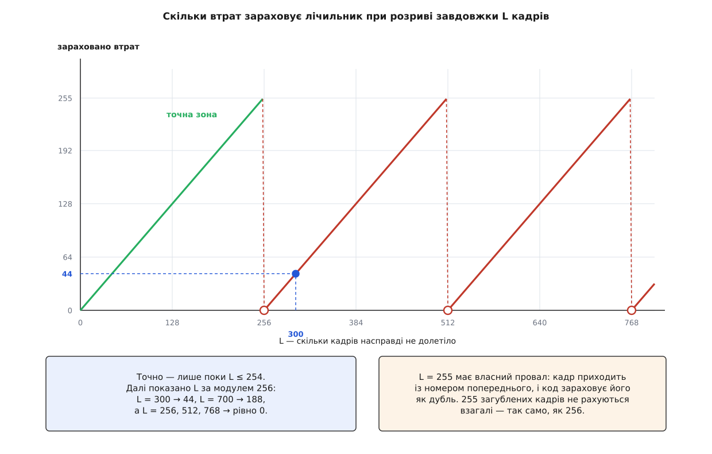
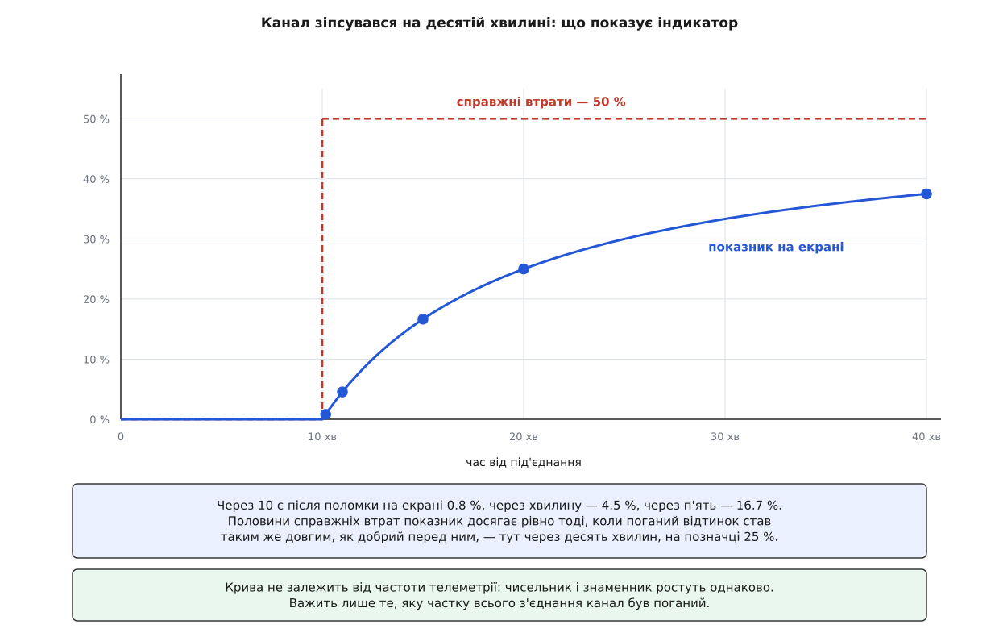
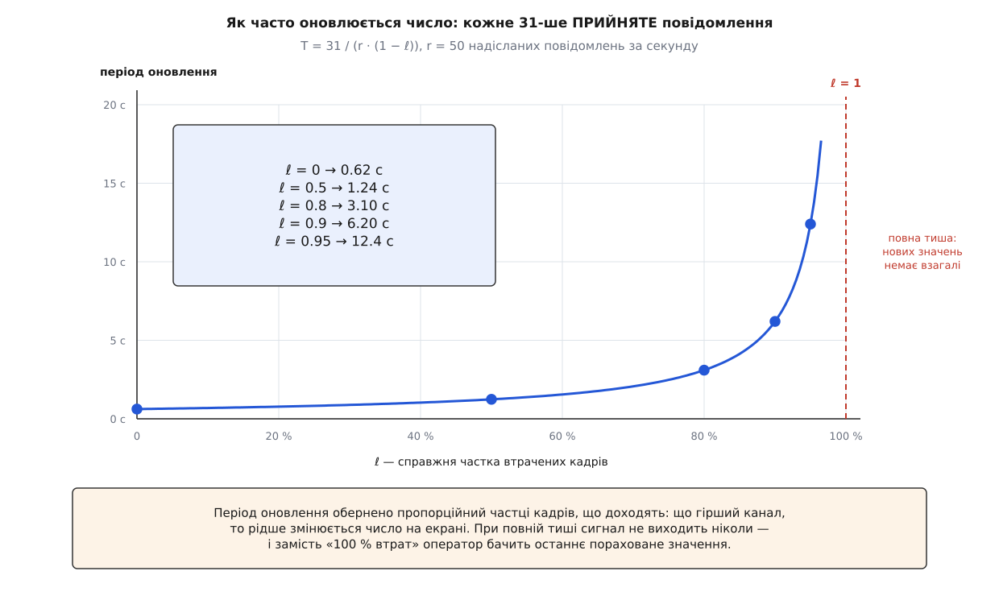

# 🧮 Арифметика лічильника втрат: модуль 256, коефіцієнт 0.5 і кожен 31-й

Індикатор якости зв'язку показує оператору одне число — відсоток втрачених повідомлень; тут пораховано, наскільки воно відповідає дійсності й наскільки від неї відстає. Три механізми, з яких воно складається — різниця номерів за модулем 256, згладжування з коефіцієнтом 0.5 і видача сигналу на кожному тридцять першому повідомленні, — дають похибки різного роду й дуже різного масштабу, і найбільша з них ховається зовсім не там, де на неї схоже.

## Розрив — це одне віднімання за модулем 256

Відправник нумерує свої кадри підряд, а номер займає один байт:

```
номер k-го надісланого кадру:   s(k) = (s₀ + k) mod 256
```

Отримувач тримає останній зарахований номер `a` і чекає наступного:

```
очікуваний номер:   e = (a + 1) mod 256
прийшов кадр:       b
```

Якщо між зарахованим кадром і цим загубилося рівно `L` кадрів, то відправник за цей час зробив `L + 1` крок, тобто

```
b = (e + L) mod 256
```

Це рівняння — усе, що отримувач має. З нього видно не `L`, а лише його [остачу за модулем 256](topic:math-number-theory/modular-arithmetic): різниця чисел, які рахуються по колу, визначена з точністю до кратного модулю, і жодна обробка цього не поправить.

```
L ≡ b − e   (mod 256)
```

Дві гілки в коді дають саме канонічного представника цієї остачі — найменше невід'ємне число, конгруентне різниці:

```c
if (message.seq >= expectedSeq) {
    lostMessages = message.seq - expectedSeq;
} else {
    lostMessages = static_cast<uint64_t>(message.seq) + 256ULL - expectedSeq;
}
```

Перевірити рівність легко. Обидва номери лежать у `[0, 255]`. Коли `b ≥ e`, різниця `b − e` лежить у `[0, 255]` і вже є представником. Коли `b < e`, різниця лежить у `[−255, −1]`, і додавання 256 переносить її в `[1, 255]`. Тобто весь оператор — це одне модульне віднімання, яке в один крок робить приведення до однобайтового типу: `(uint8_t)(b − e)`. Гілки з'явилися не заради математики, а заради типів: `message.seq` і `expectedSeq` мають тип `uint8_t`, їхня різниця обчислюється як `int` і може бути від'ємною, а присвоєння від'ємного `int` у `uint64_t` дає близько 1.8·10¹⁹ замість двійки — класичне [беззнакове переповнення](topic:sf-lang/unsigned-overflow), коли від'ємне значення перетворюється на величезне додатне.

Отже, множина розривів, сумісних із побаченим номером, нескінченна:

```
L ∈ { L̂, L̂ + 256, L̂ + 512, L̂ + 768, … },   де L̂ — те, що зарахував код
```

Код завжди бере найменший елемент. Звідси зразу дві формули:

```
L̂ = L − 256·⌊L / 256⌋ = L mod 256
Δ  = L − L̂ = 256·⌊L / 256⌋ ≥ 0
```

Похибка `Δ` невід'ємна завжди, тож **лічильник ніколи не завищує втрат** — він або точний, або занижує, і занижує рівно на ціле число сотень п'ятдесят шостих. Однозначність є тільки в межах одного оберту: відображення `L ↦ L mod 256` взаємно однозначне лише на будь-яких 256 послідовних цілих, і саме тому оцінка чесна тільки для `L < 256`.

Коли розрив перескочив за 256, показане число не просто «трохи менше» — воно втрачає порядок. Нехай `m = ⌊L / 256⌋ ≥ 1`. Тоді `L ≥ 256m` і `L < 256(m + 1)`, звідки

```
L̂ / L = 1 − 256m/L < 1 − m/(m + 1) = 1/(m + 1)
```

Тобто на розриві від 256 до 511 кадрів показано менше половини втраченого, від 512 до 767 — менше третини, і так далі. Числами:

```
L = 300   → L̂ = 44    (14.7 % від справжнього)
L = 700   → L̂ = 188   (26.9 %)
L = 5000  → L̂ = 136   (2.7 %)
```

Є ще один провал, окремий від згинів, і він не в арифметиці, а в перевірці на дубль. Візьмімо `L = 255`:

```
b = (e + 255) mod 256 = (a + 1 + 255) mod 256 = a
```

Кадр приходить із номером **попереднього зарахованого**, тобто рівно з тим, який код вважає ознакою повтору, — і виходить із підрахунку ще до віднімання, зарахувавши нуль втрат. Разом:

```
L̂(L) = 0,          якщо L mod 256 ∈ {0, 255}
       L mod 256,  в усіх інших випадках
```

Це не недогляд, а вичерпаний ресурс. Отримувач має вісім бітів чужого стану — 256 розрізненних спостережень; одне з них витрачено на «той самий кадр удруге», тож розрізнити можна лише 255 подій. Розрив рівно в 255 кадрів і повтор одного кадру ділять одну кодову точку, і жоден код їх не розділить: байт просто не несе цієї різниці.



*Точна зона — перший зуб; далі кожен наступний згин відкидає ще 256 кадрів, яких на екрані не буде ніколи.*

Переведімо це в час. Якщо один відправник видає `r` кадрів за секунду й канал замовкає на `T` секунд, то `L = r·T`, а сліпі провали стоять там, де `L` кратне 256:

```
r, кадрів/с    256 кадрів це     перші сліпі провали
    30            8.53 с          8.5 с · 17.1 с · 25.6 с
    50            5.12 с          5.1 с · 10.2 с · 15.4 с
   100            2.56 с          2.6 с ·  5.1 с ·  7.7 с
   250            1.02 с          1.0 с ·  2.0 с ·  3.1 с
```

Радіоканал на 57600 бод пропускає одиниці кілобайтів за секунду, а кадр MAVLink важить кілька десятків байтів, тож із одного відправника йде порядку кількох десятків повідомлень за секунду — і згин вимагає багатьох секунд суцільної тиші, яку оператор побачить і без лічильника. На USB, де автопілот віддає сотні повідомлень за секунду, згин починається вже на секундному зависанні, а це подія цілком буденна.

І ще одна властивість, важливіша за всі згини разом: **лічильник рухається лише в мить прибуття кадру**. Поки канал мовчить, не зараховується нічого; увесь розрив записується одним махом тоді, коли надійде перший кадр після нього. Якщо канал не оживе, розрив не буде зарахований узагалі — мертвий канал додає до суми втрат рівно нуль і додаватиме нуль скільки завгодно довго.

> 🔧 **Навіщо це.** Цифру втрат можна читати як точну лише доти, доки жоден **окремий** розрив не перевищив 254 кадрів. Щоб знати, чи ви в цій зоні, потрібна не сама цифра, а частота відправника: поділіть 254 на неї — це найдовший провал, який лічильник ще міряє чесно. Тридцять повідомлень за секунду дають вісім секунд запасу, двісті п'ятдесят — одну.

## Згладжування з коефіцієнтом 0.5 має пам'ять в одне повідомлення

Другий механізм — рекурентне співвідношення, яке виконується на кожному прийнятому повідомленні:

```
p(n) = 0.5·c(n) + 0.5·p(n−1),   p(0) = 0
```

Розгорнімо його до явної форми:

```
p(n) = ½·c(n) + ¼·c(n−1) + ⅛·c(n−2) + … + 2⁻ⁿ·c(1)
```

Ваги — [геометрична прогресія](topic:math-analysis/geometric-series) зі знаменником ½, тобто послідовність, де кожен наступний член удвічі менший за попередній, а сума перших `n` членів дорівнює `1 − 2⁻ⁿ`. Отже, фільтр нормований лише в границі: перше значення виходить удвічі меншим за вхід, після десяти повідомлень недобір ваги вже 0.1 %.

Це звичайне експоненційне [ковзне середнє](topic:com-signal/moving-average) з коефіцієнтом `α = 0.5`, і для нього є три стандартні числа.

**Середня затримка** — центр ваги ваг `α(1−α)ʲ`:

```
Σ j·α(1−α)ʲ = (1 − α)/α = 1 повідомлення
```

**Рівносильне вікно** — довжина простого ковзного середнього, яке так само придушує білий шум. Дисперсія експоненційного фільтра на вході з дисперсією σ²:

```
α²·σ²·Σ (1−α)²ʲ = α²σ²/(1 − (1−α)²) = ασ²/(2 − α)
```

Прирівнявши це до `σ²/N`, дістаємо

```
N = (2 − α)/α = 3 повідомлення
```

**Установлення після стрибка**: якщо вхід стрибнув, залишок похибки спадає як `(1−α)ⁿ`:

```
n:         1      2      3      4      5      7      10
залишок:  50 %   25 %  12.5 %  6.3 %  3.1 %  0.78 %  0.098 %
```

До одного відсотка залишку треба `n ≥ log₂100 = 6.64`, тобто сім повідомлень: на п'ятдесяти повідомленнях за секунду це 0.14 с, на тридцяти — 0.23 с. Жодної затримки, вартої назви, тут немає. Уся вага питання — у тому, **що** подають на вхід цього фільтра.

## Що саме згладжують

На вхід іде не поточна частка втрат, а накопичена від самого відкриття каналу:

```
R — усього прийнято повідомлень
Λ — усього зараховано втрат
S = R + Λ — оцінка надісланого
c = 100 · Λ / S
```

`c` — уже середнє за весь сеанс. Порахуймо, як швидко воно взагалі може змінюватися. Прийшов ще один кадр без втрат: `S → S + 1`, `Λ` те саме, отже

```
Δc = 100Λ/(S+1) − 100Λ/S = −100Λ/(S(S+1)) ≈ −c/S
```

Затримка фільтра — одне повідомлення, тож похибка, яку він додає, має порядок одного кроку вхідного сигналу:

```
година на 50 повідомленнях/с:  S ≈ 180 000
показник 10 %  →  |Δc| ≈ 10/180 000 ≈ 0.00006 відсоткового пункту
```

Шість стотисячних відсоткового пункту. Фільтр згладжує сигнал, який на чотири порядки гладший за сам фільтр; коефіцієнт 0.5 не додає до інерції показника нічого.

Інерція вся сидить у накопичувальному середньому, і її легко порахувати. Нехай канал працював чисто, поки відправник надіслав `N₁` кадрів, а потім зіпсувався до справжньої частки втрат `ℓ`, і за час поломки надіслано ще `N₂`:

```
Λ = ℓ·N₂
S = N₁ + N₂
c = 100 · ℓ · N₂ / (N₁ + N₂)
```

Запитаймо, коли `c` досягне половини справжніх `100ℓ`:

```
N₂ / (N₁ + N₂) = ½   →   N₂ = N₁
```

Відповідь не залежить від `ℓ` взагалі: **показник доходить до половини справжніх втрат рівно тоді, коли поганий відтинок став таким же довгим, як добрий перед ним.** Для довільної частки `f` від справжнього значення:

```
N₂ = N₁ · f/(1 − f)
f = 0.1 → N₂ = N₁/9     f = 0.5 → N₂ = N₁     f = 0.9 → N₂ = 9·N₁
```

Частота відправника з цих виразів скорочується — і чисельник, і знаменник ростуть разом із нею, — тож усе можна переписати в часі. Нехай `t₀` — мить поломки, `t` — час від під'єднання:

```
c(t) = 100 · ℓ · (t − t₀) / t
```

Числа для `t₀` = 10 хвилин і `ℓ` = 0.5, тобто коли зникає рівно половина телеметрії:

```
через 10 с:   c = 50 · 10/610    = 0.82 %
через 1 хв:   c = 50 · 60/660    = 4.5 %
через 5 хв:   c = 50 · 300/900   = 16.7 %
через 10 хв:  c = 50 · 600/1200  = 25.0 %
через 30 хв:  c = 50 · 1800/2400 = 37.5 %
```

Половина телеметрії лежить, а на екрані менше відсотка.



*Що довше з'єднання було добрим, то повільніше показник реагує на те, що воно перестало таким бути.*

Одужання симетричне й таке ж повільне. Коли канал полагодився, `Λ` перестає рости, а `S` росте далі:

```
c = 100·Λ/(S₂ + ΔS)   →   удвічі менше при ΔS = S₂
```

Щоб пляма від поганого відтинка стерлася вдвічі, після нього має пройти стільки ж кадрів, скільки їх було від початку з'єднання. Скидання історії нумерації, яке станція робить після підбору ключа підпису, тут не рятує: воно чистить пам'ять про останні номери й перелік уже бачених відправників — тобто прибирає майбутній фантомний розрив, — але `Λ`, `R` і сам згладжений показник лишає недоторканими.

## Кожен 31-й: період оновлення сам залежить від якости каналу

Сигнал в інтерфейс виходить із умови `R mod 31 = 0`, де `R` — лічильник прийнятих повідомлень каналу. Тридцять одне повідомлення між видачами — це в часі:

```
T = 31 / (r · (1 − ℓ))
```

бо кадри доходять із частотою `r(1 − ℓ)`, а не `r`. Для `r` = 50:

```
ℓ = 0     →  T = 0.62 с
ℓ = 0.5   →  T = 1.24 с
ℓ = 0.8   →  T = 3.10 с
ℓ = 0.9   →  T = 6.20 с
ℓ = 0.95  →  T = 12.4 с
ℓ → 1     →  T → ∞
```

Період оновлення обернено пропорційний частці кадрів, що доходять: що гірший канал, то рідше змінюється число, яке про цей канал розповідає. У границі повної тиші сигнал не виходить ніколи — і оператор бачить не «100 % втрат», а останнє пораховане значення, яке залишиться на екрані назавжди.



*Єдина точка, де індикатор мав би кричати найгучніше, — це точка, у якій він замовкає.*

Формально проріджування вчетверо довше за рівносильне вікно фільтра — це грубе недосемплювання: між двома видачами фільтр десять разів забуває свій вхід, і будь-яка складова, що змінюється в темпі самого фільтра, вийшла б назовні [аліасом](topic:com-signal/aliasing) — хибною повільною хвилею замість швидкої. Рятує тільки те, що `c` змінюється на `c/S` за повідомлення, тобто вхідний сигнал обмежений за швидкістю набагато нижче за частоту вибірки власною будовою. Проріджування безпечне не тому, що 31 мале, а тому, що згладжувати вже нема чого.

Те, що 31 — просте, дає ще один наслідок. Якщо потік на каналі має повторюваний розклад із періодом `d` повідомлень, то позиція вибраного повідомлення в розкладі — це `31j mod d`; при `gcd(31, d) = 1`, а це так для всякого `d`, не кратного 31, позиція обходить усі `d` можливих. Із кроком, кратним степеню двійки, і розкладом періодом 8 чи 16 вибірка щоразу падала б на те саме повідомлення — а на каналі з кількома апаратами це означало б завжди той самий `sysid` у виданому сигналі. Чи це було задумано, з коду не видно; властивість реальна.

Тут же варто зважити ще одне: `R` рахує повідомлення **каналу**, а розриви ведуться на трійку «канал, система, компонент». Із `k` відправниками на одному каналі `R` росте вдвічі-втричі швидше, тобто оновлення частішають, — але видане число лишається сумішшю всіх відправників, підписаною тим `sysid`, чиє повідомлення випадково виявилося тридцять першим.

## Три затримки поруч

Зведімо все до однієї таблиці для `r` = 50 повідомлень за секунду, на десятій хвилині сеансу:

```
джерело затримки                              повідомлень    секунд
згладжування 0.5 (до 1 % залишку)                    7        0.14
видача на кожному 31-му                        до   31     до 0.62
накопичувальне середнє (до половини)             30 000      600
```

Відношення останнього рядка до першого — близько 4300. Обидва механізми, які виглядають як згладжування, разом коштують менш ніж секунду; уся інерція, яку бачить оператор, походить із самого означення величини — це середнє за весь сеанс, і воно росте разом із тривалістю польоту.

## Скільки коштувало б число про «зараз»

Порахуймо альтернативу, щоб побачити ціну. Хай на вхід того самого фільтра подають не накопичену частку, а віконну: між двома видачами приходить рівно 31 повідомлення, `λ` — скільки втрат за це вікно зараховано.

```
q(k) = 100 · λ(k) / (31 + λ(k))
p(k) = 0.5·q(k) + 0.5·p(k−1)
```

Рівносильне вікно тепер — 3 видачі, тобто 93 прийнятих повідомлення: на чистому каналі 50 повідомлень за секунду це 1.9 с. Затримка з хвилин стає секундами. Плата — розкид.

Оцінімо його знизу, припустивши, що кожен надісланий кадр губиться незалежно з імовірністю `ℓ`, — це саме нижня межа, бо реальні втрати в радіоканалі йдуть чергами, і ціла черга падає в одне вікно. За такого припущення `λ` — це число невдач до 31-го успіху в серії незалежних спроб, найпростіша модель того ж роду, що й [біноміальний розподіл](topic:math-probability/binomial-distribution):

```
ℓ = 0.1:  надіслано у вікні ≈ 31/(1 − ℓ)  = 34.4
          E[λ]  = 31ℓ/(1 − ℓ)             = 3.44
          sd(λ) = √(31ℓ)/(1 − ℓ)          = 1.96
```

Переведімо розкид кількости в розкид відсотка через похідну:

```
q  = 100 · 3.44/34.4 = 10.0 %
dq/dλ = 100·31/(31 + λ)² = 2.61 відсоткового пункту на кадр
sd(q) = 1.96 · 2.61 = 5.1 відсоткового пункту
```

Фільтр із рівносильним вікном 3 ділить розкид на `√3`:

```
показане:  10.0 ± 2.9 відсоткового пункту, оновлення двічі на секунду
```

Хочете спокійніше — зменшуйте коефіцієнт. При `α = 0.25` рівносильне вікно стає `(2 − α)/α = 7` видач, розкид падає до `5.1/√7 = 1.9` пункту, а середня затримка росте до `(1 − α)/α = 3` видач, тобто близько двох секунд.

Ось і весь обмін: секунди затримки коштують кількох відсоткових пунктів дрижання, і навпаки. Чинна формула стоїть на самому краю цієї шкали — дрижання нуль, затримка завдовжки з політ.
