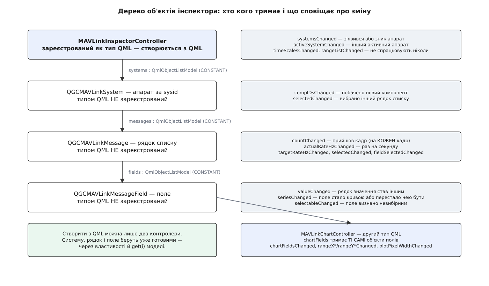

# 📋 Інтерфейс інспектора MAVLink: п'ять класів, їхні властивості й виклики

Тут зібрано все, що сторінка інспектора віддає назовні: контролер, систему, рядок повідомлення, поле й контролер графіка — з типом кожної властивості, з правом запису, з сигналом-сповіщенням і, найважливіше, з відповіддю на питання «коли ця величина взагалі змінюється». Довідка потрібна тому, хто будує власну панель у [вендорській збірці](root:sys-dron/custom-build) поверх готового обліку трафіку: половина помилок тут — це прив'язка до властивості, яку позначено `CONSTANT`, або очікування сигналу, якого код не надсилає ніколи.

Звірено з гілкою `master` репозиторію `mavlink/qgroundcontrol` 2 серпня 2026 року. Файли: `src/AnalyzeView/MAVLinkInspector/` — `MAVLinkInspectorController.{h,cc}`, `MAVLinkSystem.{h,cc}`, `MAVLinkMessage.{h,cc}`, `MAVLinkMessageField.{h,cc}`, `MAVLinkChartController.{h,cc}`, `MAVLinkInspectorPage.qml`, `MAVLinkChart.qml`; додатково `src/QmlControls/QmlObjectListModel.h` і `src/Vehicle/Vehicle.h`.

---

## Дерево об'єктів і що з нього видно з QML

П'ять класів стоять один під одним, але **зареєстровано як типи QML лише два** — обидва контролери. У решти трьох рядок `QML_ELEMENT` закоментовано просто в заголовку:

```cpp
class QGCMAVLinkSystem : public QObject
{
    Q_OBJECT
    // QML_ELEMENT
```

Наслідок буквальний: систему, рядок повідомлення й поле **не можна ні створити з QML, ні оголосити для них типовану властивість**. Їх беруть уже готовими — з властивостей контролера й з моделей — і тримають у `property var`. Спроба написати `property QGCMAVLinkSystem sys` не скомпілюється, `MAVLinkMessageField { }` теж.



*Три властивості-моделі (`systems`, `messages`, `fields`) позначені `CONSTANT`: сам вказівник на модель не міняється ніколи, змінюється лише її вміст.*

Другий контролер, `MAVLinkChartController`, у дереві не висить — він стоїть збоку й тримає у `chartFields` **ті самі** об'єкти полів, що й повідомлення в `fields`. Одне поле водночас належить своєму повідомленню й одному графіку.

Усі три моделі — `QmlObjectListModel`, а це `QAbstractListModel`. З QML з них беруть три речі:

| Що | Тип | Примітка |
|---|---|---|
| `count` | `int`, `NOTIFY countChanged(int)` | кількість елементів |
| `get(i)` | `Q_INVOKABLE QObject*` | елемент за індексом; **не** реактивний — виклик не перечитається сам |
| роль `object` у делегаті | `QObject*` | реактивний шлях: `Repeater { model: system.messages; delegate: … object.name … }` |

Різниця між останніми двома — практична. `system.messages.get(3).name` у прив'язці обчислиться один раз і застигне; `Repeater` по тій самій моделі перебудує делегат, коли рядок вставлять або приберуть.

---

## MAVLinkInspectorController

Єдиний клас, який ви створюєте самі. Обидва контролери позначено `QML_ELEMENT` у головній цілі збірки, а її модуль QML має URI `QGC` (корінний `CMakeLists.txt`). Прямо цей модуль не імпортують: модуль `QGroundControl` оголошено з `IMPORTS QGC`, тож звичайний рядок імпорту приводить обидва типи з собою — саме так робить стандартна сторінка.

```qml
import QGroundControl

MAVLinkInspectorController { id: inspector }
```

| Q_PROPERTY | Тип | Запис | Сповіщення | Коли змінюється |
|---|---|---|---|---|
| `systems` | `QmlObjectListModel*` | ні | `systemsChanged` | сам вказівник — ніколи; сигнал каже, що в моделі побільшало або поменшало систем |
| `activeSystem` | `QGCMAVLinkSystem*` | ні | `activeSystemChanged` | змінився активний апарат, або перша побачена система стала активною; **буває `null`** |
| `systemNames` | `QStringList` | ні | `systemsChanged` | збирається наново при кожному читанні: рядки виду `System 1` |
| `timeScales` | `QStringList` | ні | `timeScalesChanged` | **ніколи** — список заповнюється в конструкторі, сигнал не надсилається з жодного місця |
| `rangeList` | `QStringList` | ні | `rangeListChanged` | **ніколи** — те саме |

Два останні сигнали оголошено й не використано: обидва списки сталі від створення контролера. Прив'язуватися до них можна, чекати від них чогось — ні.

`systemNames` варта окремого слова. Це не збережений список, а обхід моделі при кожному читанні, і його порядок збігається з порядком у `systems` — саме тому стандартна сторінка перетворює вибір у випадному списку на систему через індекс моделі, а не через ім'я:

```qml
onActivated: (index) => { controller.setActiveSystem(controller.systems.get(index).id) }
```

### Виклики

```cpp
Q_INVOKABLE void setActiveSystem(int systemId);
Q_INVOKABLE void setMessageInterval(int32_t rate) const;
```

| Виклик | Параметр | Що робить | Тиха відмова |
|---|---|---|---|
| `setActiveSystem` | **`sysid`**, не індекс у моделі | шукає систему за ідентифікатором; не знайшовши — ставить `activeSystem` у `null`. Сигнал іде **лише коли значення справді змінилося** | невідомий `sysid` при вже порожньому `activeSystem` не дає ні зміни, ні сигналу |
| `setMessageInterval` | **частота в герцах**, попри назву | просить апарат змінити темп **вибраного зараз** повідомлення активної системи | немає активної системи · `sysid` не має об'єкта апарата · немає вибраного рядка · компонент нульовий |

Назва `setMessageInterval` збиває з пантелику: у ефір і справді йде проміжок у мікросекундах, але аргумент цього виклику — герци. Стандартний випадний список подає йому цілі значення `-1` (вимкнути), `0` (типова частота прошивки), далі `1`…`10`, `25`, `50`, `100`. Далі виклик доходить до апарата звичайним шляхом керування потоками:

```cpp
vehicle->setMessageRate(compId, msg->id(), rate);
```

Другу особливість пропустити ще легше: **адресата в аргументах немає взагалі**. Повідомлення береться з `_activeSystem->selectedMsg()`, компонент — із того самого повідомлення. Тому у власній панелі порядок обов'язковий: спершу вибрати рядок, аж потім просити частоту.

```qml
system.selected = rowIndex          // 1. вибір
inspector.setMessageInterval(10)    // 2. прохання, у герцах
```

Загальні правила такого керування потоками — у [частотах потоків](root:sys-dron/stream-rates); чому підтверджена апаратом частота відрізняється від запитаної, видно з властивості `targetRateHz` нижче.

### Контролер не одинак

Конструктор сам підписується на розбирач і сам заводить таблицю:

```cpp
MAVLinkProtocol *const mavlinkProtocol = MAVLinkProtocol::instance();
(void) connect(mavlinkProtocol, &MAVLinkProtocol::messageReceived,
               this, &MAVLinkInspectorController::_receiveMessage);
```

Ніякого `instance()` у самого контролера немає — **кожен створений примірник веде власний, повністю окремий облік**. Дві панелі з двома контролерами дадуть дві незалежні таблиці й подвоєну роботу на кожен кадр у [головній нитці](root:sys-dron/threading-model).

**Умова: 40 різних рядків у списку, 200 кадрів за секунду.**

```
на кожен кадр примірник робить:
  _findVehicle          — обхід списку систем
  extractInstanceValue  — пошук у таблиці розрізняльних полів
  findMessage           — лінійний обхід рядків, у середньому 40 / 2 = 20 порівнянь

порівнянь за секунду ≈ 200 × 20 = 4000
```

Плюс власний секундний таймер, який обходить усі рядки всіх систем. Числа невеликі, але сплачуються дарма: контролер варто створити один раз якнайвище й передати в панелі властивістю.

---

## QGCMAVLinkSystem

Один апарат у полі зору інспектора — не обов'язково [об'єкт апарата](root:sys-dron/vehicle-object) застосунку. Система заводиться з першого ж кадру з новим `sysid`.

| Q_PROPERTY | Тип | Запис | Сповіщення | Коли змінюється |
|---|---|---|---|---|
| `id` | `quint8` | ні | `CONSTANT` | ніколи: `sysid` задано в конструкторі |
| `messages` | `QmlObjectListModel*` | ні | `CONSTANT` | вказівник — ніколи; вміст росте при появі нового рядка |
| `compIDs` | `QList<int>` | ні | `compIDsChanged` | побачено кадр від компонента, якого ще не було |
| `compIDsStr` | `QStringList` | ні | `compIDsChanged` | тоді ж |
| `selected` | `int` | **так**, `setSelected` | `selectedChanged` | запис із QML, або перерахунок індексу після вставки нового рядка |

Пара `compIDs` / `compIDsStr` неспівмірна навмисно. Рядковий список отримує на початок службовий пункт «Comp All», числовий — ні:

```cpp
if (_compIDsStr.isEmpty()) {
    _compIDsStr << tr("Comp All");
}
if (!_compIDs.contains(static_cast<int>(message->compId()))) {
    ...
}
```

Тому `compIDsStr.length === compIDs.length + 1`, і перехід від вибраного пункту до номера компонента завжди зі зсувом на одиницю — саме так це робить стандартна сторінка:

```qml
if (index < 1) curCompID = 0
else           curCompID = curSystem.compIDs[index - 1]
```

`selected` — це **індекс у повній моделі `messages`**, а не в тому, що видно на екрані після фільтра за компонентом. Запис поза межами моделі мовчки ігнорується; допустимий запис скидає позначку з попереднього рядка й ставить її на новий, а той одразу розкладає свої поля з останнього збереженого кадру.

Індекси живі, бо список тримається за абеткою й нові рядки вставляються посередині. Сам об'єкт вибраного рядка при цьому не «тікає»: після вставки клас знаходить його заново й поправляє `_selected`. А от **запам'ятоване вами число застаріє**, тож зберігати треба сам об'єкт, не індекс.

### Методи, недоступні з QML

```cpp
QGCMAVLinkMessage *findMessage(uint32_t id, uint8_t compId, const QString &instanceValue = QString());
int                findMessage(const QGCMAVLinkMessage *message);
void               append(QGCMAVLinkMessage *message);
QGCMAVLinkMessage *selectedMsg();
```

Жоден не позначено `Q_INVOKABLE`. З QML пошук рядка робиться обходом моделі; трійка «номер повідомлення, компонент, примірник» у першому `findMessage` — це повний ключ рядка, і збіг лише за номером повідомлення нічого не означає.

---

## QGCMAVLinkMessage

Один рядок списку. Тотожність рядка зафіксована в момент створення й не міняється більше ніколи — тому шість властивостей із одинадцяти позначено `CONSTANT`.

| Q_PROPERTY | Тип | Запис | Сповіщення | Коли змінюється |
|---|---|---|---|---|
| `id` | `quint32` | ні | `CONSTANT` | ніколи: номер повідомлення з заголовка |
| `sysId` | `quint32` | ні | `CONSTANT` | ніколи |
| `compId` | `quint32` | ні | `CONSTANT` | ніколи |
| `name` | `QString` | ні | `CONSTANT` | ніколи: ім'я зі словника плюс примірник у квадратних дужках |
| `instanceValue` | `QString` | ні | `CONSTANT` | ніколи; порожній рядок, якщо повідомлення не має розрізняльного поля |
| `fields` | `QmlObjectListModel*` | ні | `CONSTANT` | ніколи: набір полів будується в конструкторі |
| `count` | `quint64` | ні | `countChanged` | **на кожен прийнятий кадр** |
| `actualRateHz` | `qreal` | ні | `actualRateHzChanged` | раз на секунду, і лише якщо значення справді змінилося |
| `targetRateHz` | `int32_t` | ні | `targetRateHzChanged` | апарат підтвердив нову частоту цього повідомлення |
| `selected` | `bool` | **ні** | `selectedChanged` | рядок став (чи перестав бути) вибраним — через `selected` своєї системи |
| `fieldSelected` | `bool` | ні | `fieldSelectedChanged` | хоч одне поле рядка додано на графік або знято з нього |

Три речі з цієї таблиці кусаються найчастіше.

**`selected` не має запису.** Властивість читається, але не пишеться: вибір робиться числом у системі (`system.selected = i`), а не прапорцем у повідомленні. Присвоєння `message.selected = true` з QML — помилка часу виконання, а не тиха відмова.

**`count` стартує з одиниці.** Рядок створюється тим самим кадром, який його породив, і лічильник ініціалізовано як `_count = 1`. Щойно народжений рядок уже показує один кадр, а не нуль.

**Прив'язка до `count` коштує дорого.** Сигнал вилітає на кожен кадр і в головній нитці. Для одного розгорнутого рядка це нормально; `Repeater` по всьому списку з текстом `object.count` перетворює кількасот кадрів за секунду на кількасот перерахунків прив'язок. Стандартна сторінка навмисно показує в списку `actualRateHz` (раз на секунду), а `count` — лише для вибраного рядка.

Дрібниця, помітна лише в оголошенні: `sysId` і `compId` оголошено як `quint32`, а читають їх функції, що повертають `quint8`. Для QML це байдуже, для підписки з C++ — теж; знати варто хіба тому, щоб не шукати в цьому змісту.

### Методи, недоступні з QML

```cpp
static QString extractInstanceValue(const mavlink_message_t &message);
void updateFieldSelection();
void update(const mavlink_message_t &message);
void updateFreq();
void setSelected(bool sel);
void setTargetRateHz(int32_t rate);
```

Статичний `extractInstanceValue` — єдиний, вартий уваги ззовні: він дістає з сирого кадру значення розрізняльного поля (того самого, що позначене `instance="true"` у [словнику](root:sys-dron/mavlink-message-dictionary)), а для налагоджувальних `NAMED_VALUE_FLOAT`, `NAMED_VALUE_INT`, `DEBUG_VECT` і `DEBUG` бере ім'я чи індекс усередині навантаження. Порожній рядок означає «примірників у цього повідомлення немає».

---

## QGCMAVLinkMessageField

Одне поле розгорнутого повідомлення. Числові масиви розгорнуто заздалегідь, тож поле `voltages[2]` — окремий об'єкт, а не елемент чогось.

| Q_PROPERTY | Тип | Запис | Сповіщення | Коли змінюється |
|---|---|---|---|---|
| `name` | `QString` | ні | `CONSTANT` | ніколи; для елемента масиву — `ім'я[індекс]` |
| `label` | `QString` | ні | `CONSTANT` | ніколи: `ІМ'Я_ПОВІДОМЛЕННЯ: ім'я_поля`, готовий підпис кривої |
| `type` | `QString` | ні | `CONSTANT` | ніколи; один із рядків нижче |
| `value` | `QString` | ні | `valueChanged` | нове розкладання дало **інший** рядок |
| `selectable` | `bool` | ні | `selectableChanged` | поле визнано невибірним — і лише при першому розкладанні |
| `chartIndex` | `int` | ні | `seriesChanged` | поле пристало до графіка або відстало від нього |
| `series` | `const QAbstractSeries*` | ні | `seriesChanged` | тоді ж; `null` означає «не на графіку» |

Рядки типів — рівно ті, що їх дає розбір опису повідомлення: `char`, `uint8_t`, `int8_t`, `uint16_t`, `int16_t`, `uint32_t`, `int32_t`, `float`, `double`, `uint64_t`, `int64_t`, а для невідомого — `?`.

**`chartIndex` бреше, коли поле не на графіку.** Getter повертає номер графіка з прив'язаного контролера, а без контролера — нуль, той самий, що й у першого графіка:

```cpp
int QGCMAVLinkMessageField::chartIndex() const
{
    if (_chartController) {
        return _chartController->chartIndex();
    }
    return 0;
}
```

Тому єдина чесна перевірка «чи це поле на графіку номер N» — двоскладова, і саме її робить стандартна сторінка: `object.series !== null && object.chartIndex === N`. Одного `chartIndex` замало.

**`selectable` спочатку завжди `true`.** Прапорець ставиться в `false` тільки всередині розкладання, коли поле виявляється рядковим, а розкладання не відбувається, поки рядок не вибрано. Отже, у повідомлення, якого ви жодного разу не розгортали, **всі** поля доповідають `selectable === true`, зокрема й рядкові. Правильна поведінка панелі — покластися на це лише після того, як рядок бодай раз побував вибраним.

Ще один C++-only метод пояснює, чому `selected` тут немає серед властивостей:

```cpp
bool selected() const { return !!_pSeries; }
```

Це та сама перевірка «чи є ряд», просто з C++. З QML її роблять напряму: `field.series !== null`.

Форматування значень варто знати наперед, бо воно не завжди очевидне:

| Тип поля | Що потрапляє у `value` |
|---|---|
| `float` | `QString::number(v, 'g', 10)` — до десяти значущих цифр |
| `double` | `QString::number(v, 'g', 15)` |
| цілі | десятковий запис без розділювачів |
| `char[]` | сам рядок; поле позначається невибірним |
| `SYSTEM_TIME`, `uint32_t` | час доби `HH:mm:ss` |
| `SYSTEM_TIME`, `uint64_t` | `yyyy MM dd HH:mm:ss` |

Дві останні гілки спрацьовують на **будь-яке** скалярне поле відповідного розміру в `SYSTEM_TIME` — тобто й на `time_boot_ms`, який часом доби не є. На графік у всіх випадках іде вихідне число, не рядок.

### Методи, недоступні з QML

```cpp
void updateValue(const QString &newValue, qreal v);   // рядок для ока, число для кривої
void setSelectable(bool sel);
void resetBucketing(int bucketCount, qreal bucketWidthMs);
void addSeries(MAVLinkChartController *chartController, QAbstractSeries *series);
void delSeries();
void updateSeries();
const QList<QPointF> *values() const;
qreal rangeMin() const;
qreal rangeMax() const;
```

Пара `addSeries` / `delSeries` тут — не те, що кличуть ззовні: з QML працюють через однойменні виклики контролера графіка, і вже вони смикають ці.

---

## MAVLinkChartController

Другий тип, який створюється з QML. Дві його властивості оголошено `REQUIRED` — без них об'єкт не збереться:

```qml
MAVLinkChartController {
    id: myChart
    inspectorController: inspector      // REQUIRED
    chartIndex: 2                       // REQUIRED
    plotPixelWidth: Math.max(1, Math.floor(graphs.plotArea.width))
    rangeXIndex: 2                      // «30 Sec»
}
```

| Q_PROPERTY | Тип | Запис | Сповіщення | Коли змінюється |
|---|---|---|---|---|
| `inspectorController` | `MAVLinkInspectorController*` | **так**, `REQUIRED` | — | лише запис; присвоєння одразу перераховує вісь часу |
| `chartIndex` | `int`, `MEMBER` | **так**, `REQUIRED` | — | лише запис; жодного сигналу |
| `chartFields` | `QVariantList` | ні | `chartFieldsChanged` | додано або прибрано криву |
| `rangeXMin` | `qreal` | ні | `rangeXMinChanged` | 15 разів на секунду, поки є хоч одна крива |
| `rangeXMax` | `qreal` | ні | `rangeXMaxChanged` | тоді ж |
| `rangeYMin` | `qreal` | ні | `rangeYMinChanged` | автомасштаб — коли розмах даних змінився; ручний — при зміні `rangeYIndex` |
| `rangeYMax` | `qreal` | ні | `rangeYMaxChanged` | тоді ж |
| `rangeXIndex` | `quint32` | **так** | `rangeXIndexChanged` | запис із QML; **скидає накопичені точки всіх кривих** |
| `rangeYIndex` | `quint32` | **так** | `rangeYIndexChanged` | запис із QML; поза межами списку — тиха відмова |
| `rangeXMs` | `qreal` | ні | `rangeXIndexChanged` | похідна від `rangeXIndex`: ширина вікна в мілісекундах |
| `plotPixelWidth` | `int` | **так** | `plotPixelWidthChanged` | запис із QML; **теж скидає накопичені точки** |

`chartIndex` — просте число без жодного сенсу всередині: нічого в C++ не обмежує його значеннями 0 і 1, воно лише повертається назовні через `field.chartIndex`. Два графіки стандартної сторінки — домовленість QML, не властивість класу.

Обидві осі варто читати буквально. `rangeXMin` і `rangeXMax` — це **мілісекунди від запуску застосунку**, а не час доби:

```cpp
uint64_t msecsSinceBoot() const { return _msecsElapsedTime.elapsed(); }
```

Лічильник стартує в конструкторі застосунку, попри слово «Boot» у назві. Стандартна сторінка малює підписи осі, зібравши з цього числа `Date` і взявши в нього хвилини й секунди, — тобто на екрані хвилини й секунди з моменту запуску, а не годинник.

Вертикальна шкала має два режими, і межа між ними — нуль:

```
rangeYIndex == 0   → автомасштаб: [найменше − 5%, найбільше + 5%] по всіх кривих графіка
rangeYIndex >  0   → ручний: симетрично, [−range, +range]
```

Тобто пункт «10» — це не «до десяти», а **від мінус десяти до плюс десяти**. Якщо всі значення збіглися в точку, автомасштаб розсуває межі на одиницю в кожен бік, щоб крива не лягла на край.

### Виклики

```cpp
Q_INVOKABLE void addSeries(QGCMAVLinkMessageField *field, QAbstractSeries *series);
Q_INVOKABLE void delSeries(QGCMAVLinkMessageField *field);
```

`addSeries` мовчки нічого не робить, якщо це поле вже є в цьому графіку, і **не перевіряє жодної верхньої межі**. Стеля в шість кривих живе в QML — рівно стільки кольорів у наборі:

```qml
property var _seriesColors: [qgcPal.colorGreen, qgcPal.colorOrange, qgcPal.colorRed,
                             qgcPal.colorGrey, qgcPal.colorBlue, qgcPal.colorYellow]
function roomForNewDimension() { return chartController.chartFields.length < _seriesColors.length }
```

Власна панель, що кличе `addSeries` напряму, цю стелю обходить: контролер прийме скільки завгодно кривих, а роздавати їм кольори й підписи доведеться самому.

`delSeries` небезпечніший, ніж здається: він **спершу відчіплює поле й лише потім шукає його у своєму списку**. Виклик `chart2.delSeries(fieldOnChart1)` зніме поле з першого графіка, а `chartFields` першого графіка так і лишиться з ним. Знімати поле треба тим самим контролером, яким його додавали.

Порядок дій при додаванні кривої фіксований, і причина в останньому кроці:

```qml
var serie = lineSeriesComponent.createObject(_graphsView, {color: color, width: 1,
                                             axisX: axisX, axisY: axisY})
_graphsView.addSeries(serie)          // 1. ряд у полотно
chartController.addSeries(field, serie)   // 2. полю — вказівник на ряд
```

При знятті — дзеркально: `removeSeries` у полотна, потім `delSeries` у контролера. Знищувати сам об'єкт ряду одразу після цього не можна: полотно тримає на нього вказівник до наступного проходу оновлення, і дострокове знищення валить застосунок. Ряд і так належить полотну, тож звільниться разом із ним.

---

## Числа, зашиті в код

| Що | Значення | Де |
|---|---|---|
| шкала часу (`timeScales`) | `5 Sec`, `10 Sec`, `30 Sec`, `60 Sec`, `2 Min`, `5 Min` → 5000, 10000, 30000, 60000, 120000, 300000 мс | конструктор контролера |
| типова шкала часу | індекс `0` — 5 секунд | `_rangeXIndex` |
| вертикальні межі (`rangeList`) | `Auto`, `10,000`, `1,000`, `100`, `10`, `1`, `0.1`, `0.01`, `0.001`, `0.0001` | конструктор контролера |
| типова вертикальна межа | індекс `0` — автомасштаб | `_rangeYIndex` |
| період оновлення частот | 1000 мс | таймер контролера |
| період перемальовування кривих | `1000 / 15` ≈ 66 мс | `kUpdateFrequency` |
| поріг «значення змінилося» | `1e-6` | `kMinDelta` |
| точок у пам'яті на криву | `2 × plotPixelWidth` | пара «найменше-найбільше» на відро |
| кривих на графік | 6 | довжина набору кольорів у QML |
| графіків на сторінці | 2 | розмітка QML |
| частоти у випадному списку | `-1`, `0`, `1`…`10`, `25`, `50`, `100` | модель `msgRateCombo` |

---

## Мінімальна робоча панель

Компактний «вартовий» для вендорської збірки: показує темп кількох названих повідомлень, помічає ті, що змовкли, і дозволяє попросити швидший потік. Місце для такої панелі в застосунку дає [ядрове розширення](root:sys-dron/core-plugin); контролер сюди передають ззовні — щоб не заводити другої таблиці.

```qml
import QtQuick
import QtQuick.Layouts

import QGroundControl
import QGroundControl.Controls

ColumnLayout {
    id: watch

    required property var inspector           // MAVLinkInspectorController згори
    property var _system: inspector.activeSystem
    property var _watched: ["HEARTBEAT", "ATTITUDE", "GPS_RAW_INT", "BATTERY_STATUS [0]"]

    QGCLabel {
        text: _system ? qsTr("Система %1").arg(_system.id) : qsTr("Немає трафіку")
    }

    Repeater {
        // модель реактивна: рядки вставляються посеред списку в міру появи в ефірі
        model: _system ? _system.messages : []

        delegate: RowLayout {
            // object — роль моделі; index — номер рядка в ПОВНОМУ списку
            visible: watch._watched.indexOf(object.name) >= 0
            spacing: ScreenTools.defaultFontPixelWidth

            QGCLabel {
                text: object.name
                Layout.minimumWidth: ScreenTools.defaultFontPixelWidth * 24
            }

            // actualRateHz оновлюється раз на секунду — прив'язка дешева
            QGCLabel {
                text: object.actualRateHz.toFixed(1) + " Гц"
                color: object.actualRateHz < 0.5 ? qgcPal.colorRed : qgcPal.text
            }

            // targetRateHz — те, що ПІДТВЕРДИВ апарат; 0 означає «типова частота прошивки»
            QGCLabel {
                text: object.targetRateHz > 0
                          ? qsTr("(борт: %1 Гц)").arg(object.targetRateHz) : ""
                color: qgcPal.colorGrey
            }

            QGCButton {
                text: qsTr("10 Гц")
                onClicked: {
                    watch._system.selected = index      // адресат задається вибором
                    inspector.setMessageInterval(10)    // і лише потім — прохання
                }
            }
        }
    }
}
```

Три речі в цьому коді випливають просто з таблиць вище. Ім'я в `_watched` містить примірник у квадратних дужках, бо `name` уже склеєне з ним, і `BATTERY_STATUS` без дужок не збіглося б із жодним рядком. Прив'язка взята до `actualRateHz`, а не до `count`, — саме щоб не будити QML на кожному кадрі. І `index` тут — номер у повній моделі, той самий, що його чекає `selected`, попри те що частину рядків приховано.

Власний графік поверх тих самих полів вимагає ще одного контролера й ручного зв'язування ряду з полем. Нижче — частина панелі, у якій уже є полотно `GraphsView` з іменем `graphs` та осями `axisX` і `axisY`:

```qml
import QtGraphs

Component {
    id: lineSeriesComponent
    LineSeries { }
}

MAVLinkChartController {
    id: myChart
    inspectorController: watch.inspector
    chartIndex: 2                                    // будь-яке своє число
    plotPixelWidth: Math.max(1, Math.floor(graphs.plotArea.width))
    rangeXIndex: 2                                   // 30 секунд
    rangeYIndex: 0                                   // автомасштаб
}

function plotField(field) {
    if (field.series !== null) return                // уже на якомусь графіку
    if (myChart.chartFields.length >= 6) return      // стелю тримаємо самі
    var serie = lineSeriesComponent.createObject(graphs,
                    { width: 1, axisX: axisX, axisY: axisY })
    graphs.addSeries(serie)                          // 1. ряд у полотно
    myChart.addSeries(field, serie)                  // 2. полю — вказівник на ряд
}
```

Саме поле беруть із моделі повідомлення: `message.fields.get(i)`. Ім'я для підпису кривої вже готове — `field.label`. Знімати криву треба тим самим `myChart`, а сам об'єкт ряду після `graphs.removeSeries(serie)` не знищувати.

---

## Пастки, помітні лише під час роботи

| Що зроблено | Що зламається | Чому |
|---|---|---|
| `property QGCMAVLinkSystem sys` у QML | не збереться | тип не зареєстровано; тільки `property var` |
| очікування `timeScalesChanged` або `rangeListChanged` | сигнал не прийде ніколи | обидва оголошено й не надсилаються; списки сталі |
| `message.selected = true` | помилка часу виконання | властивість без запису; вибір робиться через `system.selected` |
| `system.selected = i` за індексом видимого (відфільтрованого) списку | вибереться не той рядок | індекс — у повній моделі `messages` |
| збережений номер вибраного рядка | застаріє за хвилину роботи | список тримається за абеткою, вставки посередині зсувають індекси |
| `compIDs[index]` за пунктом випадного списку | зсув на один | у `compIDsStr` перший пункт службовий — «Comp All» |
| `field.chartIndex === 0` як перевірка «на першому графіку» | правда й для полів поза графіками | без контролера getter повертає нуль; треба ще `series !== null` |
| довіра до `selectable` до першого розгортання рядка | рядкові поля вважатимуться придатними для графіка | прапорець ставиться лише під час розкладання |
| прив'язка `object.count` у списку всіх рядків | інтерфейс відчутно гальмує | `countChanged` вилітає на кожен кадр, у головній нитці |
| `setMessageInterval` без попереднього вибору рядка | тиха відмова | адресат береться з `activeSystem->selectedMsg()` |
| `setMessageInterval` у мікросекундах | нісенітна частота або відмова | аргумент — герци, попри назву |
| `setMessageInterval` для системи, яка не є апаратом | тиха відмова | шукається об'єкт апарата через [менеджер апаратів](root:sys-dron/multi-vehicle) |
| другий `MAVLinkInspectorController` заради другої панелі | подвійна робота на кожен кадр | контролер не одинак, у кожного власна таблиця |
| збережений у `property var` об'єкт рядка через мить після під'єднання апарата | посилання стає порожнім | коли `sysid` нарешті визнають апаратом, усі накопичені до того рядки цієї системи видаляються й заводяться наново |
| `chart2.delSeries(field)` для поля з першого графіка | поле відчепиться, `chartFields` першого лишиться з ним | метод спершу відчіплює, потім шукає у своєму списку |
| `addSeries` напряму, більш ніж шість разів | криві без кольорів набору | стеля живе в QML, у контролері її немає |
| знищення `LineSeries` одразу після `removeSeries` | падіння застосунку | полотно тримає вказівник до наступного проходу оновлення |
| зміна `rangeXIndex` або `plotPixelWidth` заради «оновити вигляд» | графік очищається | обидві дії скидають розкладку по відрах |
| прив'язка до `activeSystem` без урахування `activeSystemChanged` | панель застигне на старому апараті або на `null` | властивість перепризначається при зміні активного апарата й при появі першої системи |
