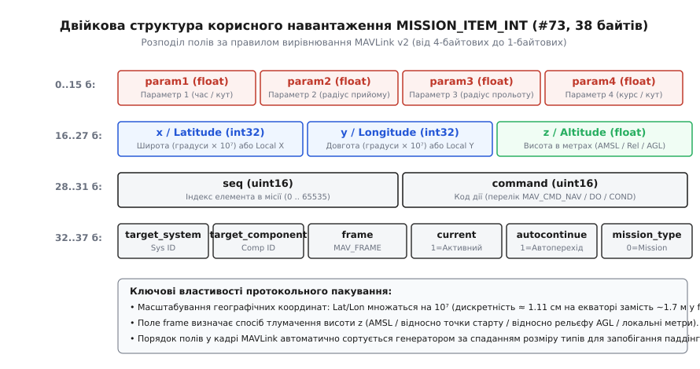
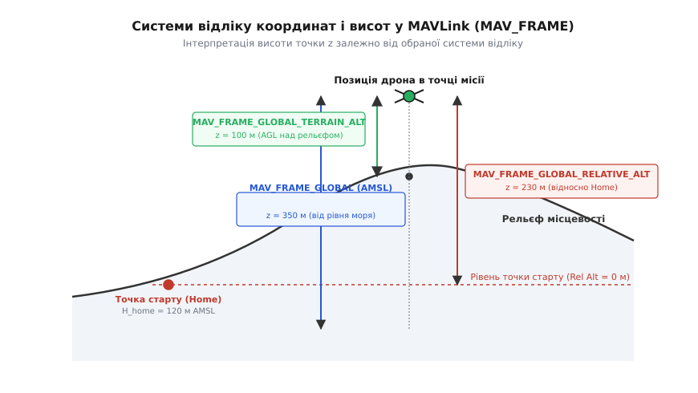
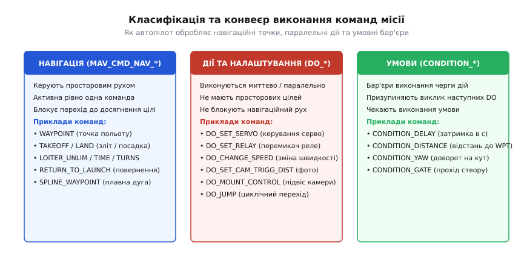
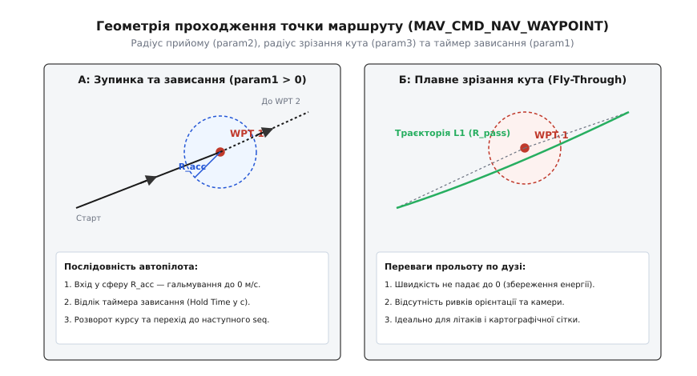

# MAVLink: місія й команди польоту

<preknowlist>
- [Протокол місій](root:sys-dron/mavlink-mission-protocol) — транзакційний кінцевий автомат завантаження та вивантаження місій по радіоканалу.
- [Пакет MAVLink](root:sys-dron/mavlink-packet) — структура заголовка кадру, вирівнювання полів та перевірка CRC.
- [Координатні системи та одиниці](root:com-protocol/coordinate-frames-units) — базові поняття глобальних WGS84 та локальних NED/ENU систем відліку.
- [Команди MAVLink](root:sys-dron/mavlink-commands) — інтерактивні накази реального часу через `COMMAND_LONG` та підтвердження `COMMAND_ACK`.
</preknowlist>

Автономний розвідувальний дрон готується до виконання місії картографування ділянки площею 180 гектарів над пересіченим гірським схилом із перепадом рельєфу від 120 до 540 метрів над рівнем моря. Польотне завдання налічує 95 пунктів: зліт, вихід на робочу висоту, увімкнення підвісу, проходження 12 паралельних галсів зі збереженням висоти 70 метрів над верхівками дерев, спрацьовування затвора камери через кожні 18 метрів шляху, аварійні точки збору та автоматична посадка. Якщо наземна станція збере це завдання з хибним типом координатної системи — наприклад, передасть висоту відносно точки старту замість висоти над поверхнею цифрової моделі рельєфу — апарат на шостому галсі вріжеться в гірський схил на повній швидкості. Якщо ж параметри радіуса прийому навігаційної точки будуть розраховані без урахування кінематики розвороту, дрон зупинятиметься на кожному повороті до повної втрати швидкості, витратить 35% заряду акумулятора на гальмування й розгони та зіпсує фотограмметричну сітку.

Польотне завдання в протоколі MAVLink — це не пасивний перелік просторових координат, а строго типізована двійкова програма для бортового навігатора автопілота. Кожен її елемент є машинною інструкцією, що поєднує систему координат, просторовий вектор руху, паралельні дії корисного навантаження та умовні бар'єри синхронізації.

## Чому місія — це програма, а не потік координат

У ручному або напівавтоматичному польоті наземна станція керування (GCS, від англ. *Ground Control Station*) надсилає літальному апарату інтерактивні команди реального часу повідомленнями `COMMAND_LONG` або потокові уставки цільового положення [setpoints](root:sys-dron/motion-control-setpoints). Якщо в цей момент зв'язок обривається, апарат втрачає джерело цілевказівки й змушений переходити в аварійний режим (Failsafe) — зависати на місці або негайно летіти до точки старту.

Повністю автономний політ вимагає протилежної моделі: польотний контролер повинен мати в енергонезалежній пам'яті (Flash, FRAM або EEPROM) самодостатній план дій, який виконується кінцевим автоматом навігатора (англ. *mission executor*) незалежно від наявності телеметрійного радіоканалу. Цей план повинен однозначно відповідати на запитання:
- куди саме летіти й за якою математичною моделлю інтерпретувати просторові координати (відносно рівня моря, точки старту чи цифрової карти висот);
- що вважати моментом успішного проходження точки: дотик до центру сфери радіуса допуску, перетин площини дотичної чи завершення відліку часу зависання;
- які допоміжні дії потрібно виконати під час польоту між точками: увімкнути живлення корисного навантаження через реле, повернути сервопривід скидання вантажу, скоригувати кут нахилу оптичного підвісу чи змінити швидкість польоту;
- за яких умов дозволено переходити до наступного етапу: після спливання часового інтервалу, після набору заданої висоти чи після стабілізації курсу (Yaw).

Для уніфікованого опису цих дій у протоколі MAVLink створено структуру елемента місії — повідомлення `MISSION_ITEM_INT` (ідентифікатор повідомлення `#73`).

## Анатомія кадру MISSION_ITEM_INT: подолання дискретності float32

У ранніх версіях MAVLink використовувалося повідомлення `MISSION_ITEM` (`#39`), де просторові координати широти й довготи кодувалися 32-бітними числами з рухомою комою одинарної точності за стандартом IEEE 754 (`float`). Проте на практиці виявилося, що одинарна точність `float32` містить фундаментальний математичний дефект при глобальному позиціонуванні.

Формат `float32` має 1 знаковий біт, 8 бітів експоненти та 23 біти мантиси, що дає 24 біти ефективної точності (близько 7.22 десяткових знаків). Географічна довгота змінюється в діапазоні від `-180.0°` до `+180.0°`. Коли абсолютне значення довготи перевищує 128.0° (що характерно для Східної Азії, Японії, Австралії, Тихого океану та західної частини Північної Америки), двійкова експонента дорівнює `2⁷ = 128`. При цьому крок молодшого розряду мантиси (англ. *Unit in the Last Place*, ULP) складає:

```
ULP = 2^(7 - 23) = 2⁻¹⁶ = 1 / 65 536 градуса ≈ 0.000015258789°
```

Один градус дуги на екваторі Землі відповідає довжині приблизно 111 319.5 м. Перемноживши ULP на довжину градуса, отримуємо просторову похибку дискретизації:

```
ΔL = (1 / 65 536) · 111 319.5 м ≈ 1.6985 м
```

Похибка у 1.7 метра означає, що при використанні `float32` неможливо задати точку маршруту з точністю, вищою за розмір самого дрона. Сучасні геодезичні безпілотники з RTK-приймачами (англ. *Real-Time Kinematic*) забезпечують сантиметрову точність навігації. Застосування `float32` призводило б до квантування траєкторії: координати зсувалися б дискретними стрибками по 1.7 м, спричиняючи ривки в контурі керування.

Для усунення цієї проблеми в повідомленні `MISSION_ITEM_INT` координати широти (`x`) та довготи (`y`) передаються 32-бітними цілими числами зі знаком (`int32_t`), масштабованими на коефіцієнт `10⁷` (`degE7`):

```
x = round(Latitude_deg · 10⁷)
y = round(Longitude_deg · 10⁷)
```

При такому підході крок сітки дискретизації на екваторі становить:

```
ΔL_int = 10⁻⁷ · 111 319.5 м ≈ 0.01113 м = 1.113 см
```

Сантиметрова дискретність повністю перекриває потреби високоточної навігації, а використання цілочисельного формату захищає координати від похибок двійкового округлення. Висота `z` передається 32-бітним числом `float` у метрах, оскільки діапазон висот польоту (від -500 м до +30 000 м) забезпечує міліметрову роздільну здатність навіть у форматі `float32`.


*Двійкова структура корисного навантаження MISSION_ITEM_INT (#73, 38 байтів). Поля впорядковані за спаданням розміру типів: спершу 4-байтові float та int32, далі 2-байтові uint16 і наприкінці 1-байтові прапорці для запобігання апаратному вирівнюванню.*

Корисне навантаження повідомлення `MISSION_ITEM_INT` займає рівно 38 байтів. За правилами протоколу MAVLink v2 генератор коду автоматично сортує поля всередині кадру за розміром їхніх типів даних (від найбільших до найменших). Це гарантує, що 32-бітні процесори ARM Cortex-M читають і записують змінні за адресами, кратними 4 байтам, без створення неявних проміжків (англ. *padding bytes*) і без апаратних винятків несумісного вирівнювання:

```
Поля повідомлення MISSION_ITEM_INT (38 байтів корисного навантаження):
├─ 0..15 б:  param1, param2, param3, param4 (float32 × 4) — контекстні параметри команди
├─ 16..19 б: x / Latitude (int32) — широта (градуси × 10⁷) або координата Local X
├─ 20..23 б: y / Longitude (int32) — довгота (градуси × 10⁷) або координата Local Y
├─ 24..27 б: z / Altitude (float32) — висота у метрах (AMSL / Relative / Terrain / Local Z)
├─ 28..29 б: seq (uint16) — порядковий номер елемента в масиві місії (від 0)
├─ 30..31 б: command (uint16) — ідентифікатор інструкції з переліку MAV_CMD
├─ 32 б:     target_system (uint8) — числовий ідентифікатор цільового апарата (sysid)
├─ 33 б:     target_component (uint8) — ідентифікатор підсистеми (compid, 1 = автопілот)
├─ 34 б:     frame (uint8) — код координатної рамки відліку (перелік MAV_FRAME)
├─ 35 б:     current (uint8) — прапорець: 1 = активний виконуваний пункт, 0 = неактивний
├─ 36 б:     autocontinue (uint8) — 1 = автоперехід до наступного пункту, 0 = зависання/пауза
└─ 37 б:     mission_type (uint8) — тип списку: 0 = Mission, 1 = GeoFence, 2 = Rally Points
```

Прапорець `autocontinue` є ключовим запобіжником: якщо він встановлений у `0`, автопілот після прибуття в точку не переходить до виконання пункту `seq + 1`, а переходить у режим зависання (Loiter/Hold) і чекає на явної команди від оператора з землі.

## Системи відліку координат і висот (MAV_FRAME)

Поняття координати в авіації позбавлене сенсу без визначення системи відліку (*frame of reference*, від лат. *structura* та англ. *frame* — «каркас, рамка»). Літальний апарат одночасно оперує супутниковими даними GPS/GNSS, показами барометричного датчика статичного тиску, лазерними далекомірами та оптичним потоком. Поле `frame` у структурі `MISSION_ITEM_INT` вказує бортовому навігатору, як саме перетворювати трійку чисел `(x, y, z)` у фізичні просторові уставки для контуру керування.


*Системи відліку координат і висот у MAVLink (MAV_FRAME). Висота z точки місії може відраховуватися від середнього рівня моря (AMSL, синій), від точки старту (Home, червоний) або від поточної поверхні цифрової моделі рельєфу (AGL, зелений).*

У протоколі MAVLink стандартизовано чотири головні сімейства координатних систем:

### 1. MAV_FRAME_GLOBAL / GLOBAL_INT (код 0 або 5)
Координати `x` та `y` визначають широту й довготу на еліпсоїді WGS84. Висота `z` відраховується як абсолютна висота над середнім рівнем моря (AMSL, від англ. *Above Mean Sea Level*) відносно гравітаційної моделі геоїда (наприклад, EGM96).
- **Сфера застосування:** магістральні польоти великих БПЛА літакового типу, інтеграція з системами цивільного повітряного руху (ADS-B, TCAS), взаємодія з диспетчерськими зонами аеропортів, де всі ешелони висот строго прив'язані до тиску QNH або рівня моря.
- **Інженерна пастка:** якщо оператор планує місію на аеродромі, розташованому в гірській місцевості на висоті 1400 м AMSL, і вказує для точки зльоту висоту `z = 100` у системі `MAV_FRAME_GLOBAL`, автопілот зафіксує цільову висоту на 1300 метрів нижче фактичної поверхні землі.

### 2. MAV_FRAME_GLOBAL_RELATIVE_ALT / GLOBAL_RELATIVE_ALT_INT (код 3 або 6)
Широта й довгота задаються на еліпсоїді WGS84, а висота `z` відраховується відносно точки старту (*Home position*) — місця, де дрон зафіксував своє положення та провів калібрування барометричного альтиметра в момент взяття двигунів на охорону (Arming).
- **Сфера застосування:** стандартний вибір для 90% місій мультироторних дронів над відносно пласким рельєфом (міські польоти, інспекція будівельних майданчиків, аерофотознімання рівнинних полів).
- **Інженерна пастка:** над горбистою місцевістю висота польоту відносно реальної землі постійно коливається. Якщо пагорб попереду має висоту +80 м, а місія задана на висоті +50 м відносно Home, дрон неминуче зіткнеться з перешкодою.

### 3. MAV_FRAME_GLOBAL_TERRAIN_ALT / GLOBAL_TERRAIN_ALT_INT (код 10 або 11)
Широта й довгота прив'язані до WGS84, а висота `z` означає висоту над поверхнею реального рельєфу (AGL, від англ. *Above Ground Level*).
- **Сфера застосування:** обстеження лісів, картографування гір, польоти сільськогосподарських дронів-обприскувачів, де потрібно підтримувати стабільну висоту 3 метри над посівами, що повторюють форму схилів.
- **Механізм роботи:** автопілот постійно зіставляє поточні GNSS-координати з бортовою базою даних цифрової моделі рельєфу (DEM, наприклад, растровими файлами SRTM із роздільною здатністю 30 метрів, збереженими на карті пам'яті microSD) або опитує лазерний далекомір (лідар/радар).

### 4. MAV_FRAME_LOCAL_NED (код 1) та LOCAL_ENU (код 4)
Декартова тривимірна система координат у метрах, де початок відліку (0, 0, 0) прив'язаний до локальної точки старту або оптичного орієнтира.
- `LOCAL_NED`: вісь `X` спрямована на північ (North), `Y` — на схід (East), `Z` — вертикально вниз (Down). У цій системі висота 50 м над землею позначається як `z = -50.0`.
- `LOCAL_ENU`: вісь `X` спрямована на схід (East), `Y` — на північ (North), `Z` — вертикально вгору (Up).
- **Сфера застосування:** навігація в закритих приміщеннях, ангарах, тунелях або при посадці на рухому морську платформу за відсутності сигналів GPS/GNSS, де орієнтація та зсув обчислюються за допомогою оптичного потоку (Optical Flow) або візуально-інерційної одометрії (VIO).

## Три класифікаційні групи команд: Навігація, Дії та Умови

Усі інструкції польотного завдання поділяються на три взаємодоповнюючі класи за способом обробки в планувальнику автопілота. Повний реєстр параметрів і бітових масок для кожної команди наведено в [довіднику команд польотних завдань MAVLink](root:sys-dron/mavlink-mission-items/api-mission-commands.md).


*Класифікація та конвеєр виконання команд місії. Навігаційні команди керують просторовим рухом, команди дій змінюють налаштування підсистем без зупинки польоту, а умовні команди виступають бар'єрами синхронізації черги.*

### 1. Навігаційні команди (MAV_CMD_NAV_*)
Навігаційні команди безпосередньо керують траєкторним рухом апарата в просторі. Контур наведення автопілота може одночасно виконувати **лише одну** навігаційну команду. Перехід до наступного елемента списку блокується доти, доки апарат не виконає просторово-кінематичний критерій завершення поточної навігаційної цілі.

Головні навігаційні команди:
- `MAV_CMD_NAV_TAKEOFF` (#22): вертикальний підйом або зліт по глісаді на задану висоту `z`.
- `MAV_CMD_NAV_WAYPOINT` (#16): переліт у цільову точку з контролем швидкості, курсу та радіуса прольоту.
- `MAV_CMD_NAV_LOITER_UNLIM` (#17), `MAV_CMD_NAV_LOITER_TIME` (#19), `MAV_CMD_NAV_LOITER_TURNS` (#18): утримання точки кружлянням (для літака) або зависанням (для коптера).
- `MAV_CMD_NAV_RETURN_TO_LAUNCH` (#20): автоматичне повернення до точки старту або призначеної зони аварійної посадки (*Rally Point*).
- `MAV_CMD_NAV_LAND` (#21): автоматичне зниження зі збереженням горизонтального положення до моменту спрацьовування детектора торкання землі (*Landed State Detector*).
- `MAV_CMD_NAV_SPLINE_WAYPOINT` (#82): проходження поворотних точок за гладкою кривою, що розраховується кубічними сплайнами Ерміта.

### 2. Команди дій (MAV_CMD_DO_*)
Команди дій виконуються миттєво й не змінюють просторового вектора руху літального апарата. Вони керують периферійним обладнанням, виконавчими механізмами, корисним навантаженням та логікою переходу між пунктами місії.

Головні команди дій:
- `MAV_CMD_DO_SET_SERVO` (#183): встановлення ширини керуючого ШІМ-імпульсу на вказаному виході мікроконтролера (наприклад, поворот сервоприводу скидання вантажу на кут 90° сигналом 2000 мкс).
- `MAV_CMD_DO_SET_RELAY` (#181): перемикання дискретного ключа навантаження (увімкнення/вимкнення живлення передавача чи підсвічування).
- `MAV_CMD_DO_CHANGE_SPEED` (#178): динамічна зміна цільової шляхової (Groundspeed) або повітряної (Airspeed) швидкості.
- `MAV_CMD_DO_SET_CAM_TRIGG_DIST` (#206): наказ автопілоту формувати імпульс спрацьовування затвора камери через кожні N метрів пройденого шляху.
- `MAV_CMD_DO_MOUNT_CONTROL` (#205): пряме керування кутами тангажу, крену та курсу 3-осьового гіростабілізованого оптичного підвісу.
- `MAV_CMD_DO_JUMP` (#177): організація циклічних переходів усередині місії (наприклад, повторити сканування ділянки від пункту 4 до пункту 12 рівно 3 рази).

### 3. Умовні команди (MAV_CMD_CONDITION_*)
Умовні команди функціонують як синхронізаційні бар'єри (англ. *synchronization barrier*). Вони зупиняють обробку наступних команд дій `DO_*` до моменту виконання заданої умови, не перериваючи при цьому навігаційний політ літального апарата:
- `MAV_CMD_CONDITION_DELAY` (#112): затримка виконання наступної дії на `param1` секунд.
- `MAV_CMD_CONDITION_DISTANCE` (#114): блокування виконання наступної дії доти, доки відстань до наступного навігаційного пункту не стане меншою за `param1` метрів.
- `MAV_CMD_CONDITION_YAW` (#115): доворот носа апарата на вказаний кут курсу із заданою кутовою швидкістю перед переходом до наступного етапу.

## Геометрія проходження навігаційної точки: радіус прийому проти плавного прольоту

Найчастіше використовуваною навігаційною командою є `MAV_CMD_NAV_WAYPOINT` (#16). Її параметри визначають просторову поведінку апарата в зоні повороту:

```
Параметри MAV_CMD_NAV_WAYPOINT у повідомленні MISSION_ITEM_INT:
├─ param1: Час зависання / вистоювання (Hold Time) у секундах.
├─ param2: Радіус прийому точки (Acceptance Radius) у метрах.
├─ param3: Радіус прольоту / зрізання кута (Pass Radius) у метрах.
├─ param4: Бажаний курс (Desired Yaw) у градусах (або NaN для збереження курсу за траєкторією).
├─ x (param5): Географічна широта цілі (int32, degE7).
├─ y (param6): Географічна довгота цілі (int32, degE7).
└─ z (param7): Висота цілі в метрах.
```


*Геометрія проходження точки маршруту (MAV_CMD_NAV_WAYPOINT). Зліва (А) — режим зупинки та зависання з повним гальмуванням; справа (Б) — режим плавного прольоту по дотичній без втрати швидкості за алгоритмом L1-наведення.*

Поведінка апарата принципово змінюється залежно від комбінації значень `param1` та `param3`:

### Режим повної фіксації з вистоюванням (Hold Time > 0)
Якщо вказано `param1 = 5.0` (вистоювання 5 секунд) та `param2 = 3.0` (радіус прийому 3 метри), навігатор працює за схемою повної зупинки:
1. Апарат наближається до точки й починає гальмування за `S = v² / (2 · a_max)` метрів до неї.
2. При перетині віртуальної сфери радіусом `R_acc = 3 м` швидкість знижується до `0 м/с`.
3. Автопілот запускає внутрішній таймер і утримує позицію протягом 5 секунд.
4. Після завершення відліку автопілот виконує розворот за курсом на наступний пункт і починає розгін.

Цей режим необхідний для взяття проб повітря, точного скидання вантажів або детального фотографування об'єктів із великою витримкою. Проте для картографування він є вкрай неефективним: постійні гальмування й розгони призводять до значних перевантажень, розхитування підвісу та перевитрати енергії акумулятора.

### Режим плавного зрізання кута (Pass-by / Fly-through, param3 > 0)
Якщо час вистоювання `param1 = 0`, а радіус прольоту `param3 = 15.0`, автопілот переходить у режим безперервного траєкторного польоту.

Для літаків та швидкісних коптерів застосовується алгоритм наведення **L1 / Vector Field**. Навігатор будує відрізок прямої між попередньою точкою `W[k-1]` та поточною `W[k]`. Коли апарат наближається до `W[k]` на відстань радіуса зрізання `R_pass`, контролер перемикає цільовий відрізок на пару `(W[k], W[k+1])`. Траєкторія руху перетворюється на плавну дугу кола з радіусом повороту:

```
R_turn = v² / (g · tan(φ_max))
```

де `v` — шляхова швидкість польоту, `g` — прискорення вільного падіння (9.81 м/с²), `φ_max` — максимальний дозволений кут крену (Bank Angle). Швидкість дрона не падає до нуля, прискорення залишається рівномірним, а оптичний підвіс камери не зазнає ривків орієнтації.

## Динамічні модифікації польоту та циклічні переходи (DO_JUMP)

Польотні місії не обмежуються статичним польотом по колу. Дві команди MAVLink забезпечують гнучке керування алгоритмічною структурою місії:

### Автоматичне аерофотознімання (MAV_CMD_DO_SET_CAM_TRIGG_DIST)
Під час картографування території наземна станція не передає сотні окремих команд на кожне фото. Замість цього на початку маршруту вставляється одна команда `MAV_CMD_DO_SET_CAM_TRIGG_DIST` з параметром `param1 = 20.0` (відстань 20 метрів).

Бортовий навігатор інтегрує вектор швидкості за даними розширеного фільтра Калмана (EKF). Як тільки сумарна відстань, пройдена літальним апаратом від попереднього знімка, досягає 20.0 м, автопілот генерує апаратний імпульс на оптоізольованому виході камери та транслює в телеметрійний потік повідомлення `CAMERA_IMAGE_CAPTURED` із точними географічними координатами й міткою часу для подальшого геоприв'язування знімків. Для завершення зйомки наприкінці сітки надсилається та сама команда з `param1 = 0`.

### Організація циклів та патрулювання (MAV_CMD_DO_JUMP)
Команда `MAV_CMD_DO_JUMP` (#177) є аналогом безумовного переходу з лічильником:
- `param1`: номер цільового пункту місії (`seq`), до якого потрібно повернутися;
- `param2`: кількість повторень циклу (від 1 до 65535; значення `-1` означає нескінченне повторення).

```
Приклад циклічного патрулювання периметра:
seq 0: NAV_TAKEOFF (зліт на 50 м)
seq 1: NAV_WAYPOINT (кутова вежа 1)  <──┐
seq 2: NAV_WAYPOINT (кутова вежа 2)     │
seq 3: NAV_WAYPOINT (кутова вежа 3)     │ перехід за DO_JUMP
seq 4: NAV_WAYPOINT (кутова вежа 4)     │
seq 5: DO_JUMP (target_seq = 1, repeat = 10) ──┘
seq 6: NAV_RETURN_TO_LAUNCH (повернення після 10 кіл)
```

При кожному проходженні пункту `seq 5` автопілот зменшує внутрішній лічильник на одиницю. Доки лічильник більший за 0, навігатор перемикає активний пункт на `seq 1`. Коли лічильник досягає 0, команда `DO_JUMP` завершується, і автопілот переходить до `seq 6` (повернення на базу). Практичну програмну реалізацію генератора таких завдань на мовах C та C++ наведено у проектній вставці [побудова та валідація польотних завдань MAVLink](root:sys-dron/mavlink-mission-items/proj-mission-builder.md).

## Архітектурні відмінності: виконання місій у ArduPilot та PX4

Хоча протокол MAVLink є єдиним відкритим стандартом обміну, дві провідні системи керування польотом — **ArduPilot** та **PX4 Autopilot** — мають принципові відмінності у внутрішній архітектурі планувальника місій. Нерозуміння цих відмінностей є типовою причиною аварій при перенесенні польотних завдань між платформами.

### 1. Тлумачення нульового елемента (`seq = 0`)
- **ArduPilot (`AP_Mission`):** Елемент з індексом `seq = 0` **жорстко зарезервований під точку старту (`Home Location`)**. Він автоматично перезаписується автопілотом у момент взяття під охорону (Arming) за поточними GNSS-координатами. Будь-яка навігаційна дія, записана в `seq = 0`, ігнорується. Першою виконуваною командою місії в ArduPilot завжди є пункт із `seq = 1`.
- **PX4 Autopilot (`Navigator`):** У протоколі обміну пункт `seq = 0` є звичайним першим елементом польотного плану (наприклад, точкою зльоту `NAV_TAKEOFF`). Програма QGroundControl при роботі з PX4 приховує цей нюанс, але при прямому програмному формуванні пакетів розробник зобов'язаний враховувати зміщення індексів.

### 2. Модель виконання черги команд: подвійний вказівник проти секвенсера
- **ArduPilot:** Використовує архітектуру **подвійного незалежного вказівника** в класі `AP_Mission`. Навігаційний рух відстежується вказівником `_nav_cmd`, а дії над периферією — паралельним вказівником `_do_cmd`. Коли дрон досягає чергової точки `NAV_WAYPOINT`, планувальник ArduPilot за **один цикл оновлення** (10 мс) послідовно виконує всі наступні команди типу `DO_*` (наприклад, змінити швидкість, перемкнути реле, повернути підвіс) доти, доки не зустріне наступну команду `NAV_*` або бар'єр `CONDITION_*`. Це забезпечує абсолютну синхронність перемикання корисного навантаження в момент проходження точки.
- **PX4 Autopilot:** Використовує кінцевий автомат `MissionBlock` поверх сховища `dataman` (Data Manager у файловій системі операційної системи реального часу NuttX). Кожен пункт обробляється як окремий крок секвенсера. Якщо між двома точками `WAYPOINT` вставлено команду `DO_CHANGE_SPEED`, PX4 активує її або як супутню дію на ділянці переходу, або як окремий мікрокрок перед початком руху до наступної точки.

### 3. Розрахунок допуску за висотою
- **ArduPilot:** Радіус прийому `param2` у команді `WAYPOINT` задає радіус циліндра. Якщо дрон увійшов у горизонтальне коло радіусом `R_acc`, точка вважається пройденою, навіть якщо вертикальна помилка становить кілька метрів (автопілот продовжує підйом на наступному галсі).
- **PX4 Autopilot:** Має роздільні параметри допуску: горизонтальний радіус `NAV_ACC_RAD` та вертикальний допуск `NAV_FW_ALTRAD` (для літаків) або `NAV_MC_ALT_RAD` (для коптерів). Пункт місії не вважатиметься досягнутим, доки апарат одночасно не увійде і в горизонтальний, і у вертикальний коридори допуску.

## Уніфікація місій, геозон та точок збору (MAV_MISSION_TYPE)

Архітектурна перевага MAVLink полягає в тому, що протокол місій обслуговує не лише навігаційні маршрути, а й усі просторові обмеження та аварійні сценарії за допомогою єдиної двійкової структури `MISSION_ITEM_INT`. Тип даних визначається байтовим полем `mission_type`:

```
Значення поля mission_type (MAV_MISSION_TYPE):
├─ MISSION_TYPE_MISSION (0): основна польотна програма дій та навігації
├─ MISSION_TYPE_FENCE   (1): полігони та кола геозон обмеження польоту
└─ MISSION_TYPE_RALLY   (2): перелік точок аварійної посадки та збору
```

### Геозони (MISSION_TYPE_FENCE)
Геозона (*Geofence*, від грец. *γεω-* — «земля» та англ. *fence* — «огорожа») захищає літальний апарат від вильоту за межі безпечного коридору (англ. *inclusion zone*) або запобігає проникненню в заборонений повітряний простір над об'єктами інфраструктури (англ. *exclusion zone*).

Кожна вершина полігональної геозони передається як окреме повідомлення `MISSION_ITEM_INT` із командою `MAV_CMD_NAV_FENCE_POLYGON_VERTEX_INCLUSION` (#5001) або `MAV_CMD_NAV_FENCE_POLYGON_VERTEX_EXCLUSION` (#5002). Поле `param1` вказує загальну кількість вершин у цьому багатокутнику, а поля `x` та `y` несуть координати вершини в `degE7`. Бортовий процесор у реальному часі розраховує алгоритм приналежності точки полігону (Ray Casting Algorithm). При наближенні до межі геозони на відстань гальмівного шляху автопілот примусово перериває виконання місії та активує аварійний режим повернення на базу або посадки.

### Точки збору (MISSION_TYPE_RALLY)
У разі виникнення аварійних ситуацій (втрата радіозв'язку, критична просадка напруги акумулятора, відмова одного з двигунів на гексакоптері) повернення до віддаленої точки старту (Home) може бути фізично неможливим через брак енергії.

Для цього в пам'ять автопілота завантажується список точок збору (*Rally Points*, від франц. *rallier* — «збирати докупи»). Кожна точка передається повідомленням `MISSION_ITEM_INT` із командою `MAV_CMD_NAV_RALLY_POINT` (#5100). При виникненні аварії автопілот обчислює евклідову відстань до всіх відомих точок збору та точки Home, обирає найближчу за енергетичними витратами точку з урахуванням висоти та напрямку вітру й спрямовує апарат туди для безпечної автоматичної посадки.

## Гібридні апарати: перехідні процеси VTOL у польотних місіях

Окремої уваги заслуговують комбіновані літальні апарати вертикального зльоту та посадки (VTOL, від англ. *Vertical Take-Off and Landing*), що поєднують тривалість польоту літака з можливістю зльоту без злітно-посадкової смуги. MAVLink містить спеціалізовані навігаційні команди для керування фазами польоту VTOL:

```
Послідовність виконання типової VTOL-місії:
1. NAV_VTOL_TAKEOFF (seq 0): вертикальний підйом у режимі мультиротора до висоти 50 м.
2. DO_VTOL_TRANSITION (seq 1): увімкнення тягового маршового двигуна, розгін до швидкості звалювання літака (Stall Speed, наприклад, 16 м/с) та вимкнення підйомних роторів.
3. NAV_WAYPOINT (seq 2..N-2): швидкісний транзитний політ по маршруту в енергоефективному літаковому режимі.
4. DO_VTOL_TRANSITION (seq N-1): перехід у вертолітний режим (запуск роторів вертикальної тяги) за 150 метрів до зони посадки.
5. NAV_VTOL_LAND (seq N): плавне вертикальне зниження та вимкнення двигунів.
```

На відміну від звичайних мультироторів, планувальник польотного контролера (ArduPilot або PX4) при виконанні команди `NAV_VTOL_TAKEOFF` самостійно розраховує вітровий сектор: розгін у літаковий режим здійснюється строго проти зустрічного вітру для мінімізації просідання висоти під час перехідного процесу.

## Поведінка автопілота при відмові датчиків під час місії

Автономний політ за списком `MISSION_ITEM_INT` спирається на коректну роботу сенсорних систем. У реальних польотних умовах можливі відмови джерел просторової інформації, для яких у MAVLink-сумісних прошивках реалізовано вбудовані захисні механізми:

1. **Втрата зв'язку з рельєфом (Terrain Failsafe):** Якщо в активному пункті вказано координати у системі `MAV_FRAME_GLOBAL_TERRAIN_ALT`, але дрон вилітає за межі завантаженої карти висот SRTM або лазерний альтиметр втрачає відбитий сигнал над водною гладдю, автопілот не продовжує рух наосліп. Спрацьовує переривання `TERRAIN_FAILSAFE`: апарат негайно припиняє рух по маршруту, переходить у режим кружляння/зависання та починає аварійний набір висоти до безпечного ешелону `TERRAIN_SPACING`.
2. **Деградація супутникової навігації (GPS Glitch):** Якщо розширений фільтр Калмана (EKF) фіксує аномальні стрибки координат або падіння точності HDOP > 2.0 під час виконання команди `NAV_WAYPOINT`, автопілот блокує перехід до наступних пунктів місії. Залежно від налаштувань, апарат або переходить в інерційний режим утримання висоти (Altitude Hold), або здійснює керовану аварійну посадку.
3. **Обмеження за часом виконання (Mission Timeout):** Якщо навігаційна точка через сильний зустрічний вітер (швидкість вітру перевищує максимальну повітряну швидкість літака) не може бути досягнута протягом розрахункового часу, автопілот фіксує зависання на відрізку та активує процедуру переривання місії з поверненням на базу.

## Надійність та валідація польотних завдань

Через те, що місія виконується мікроконтролером бортового автопілота в умовах жорсткого реального часу, завантаження некоректного польотного плану може призвести до відмови системи стабілізації. Сучасні автопілоти перед фіксацією місії здійснюють строгу валідацію:
1. **Перевірка зв'язності графа переходів:** жодна команда `DO_JUMP` не може посилатися на неіснуючий індекс `seq` або на саму себе (зациклення з нульовим часом виконання).
2. **Перевірка діапазонів висот:** висоти всіх навігаційних точок перевіряються на відповідність параметрам безпечного коридору (`MIS_ALTMIN` та `MIS_ALTMAX`).
3. **Географічна валідація:** широта повинна лежати в межах від -90.0° до +90.0°, довгота — в межах від -180.0° до +180.0°.

Розуміння формату `MISSION_ITEM_INT`, семантики параметрів `param1..param7` та механіки систем координат `MAV_FRAME` дозволяє будувати надійні автономні комплекси, здатні виконувати складні інженерні задачі в повітрі без втручання людини.
