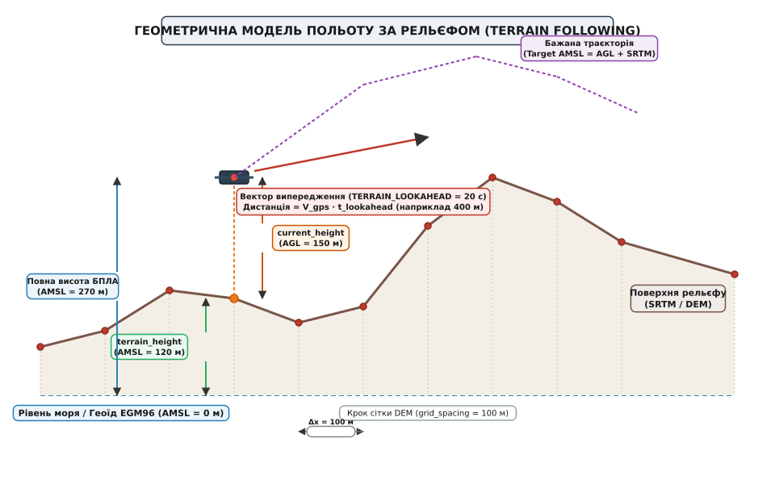
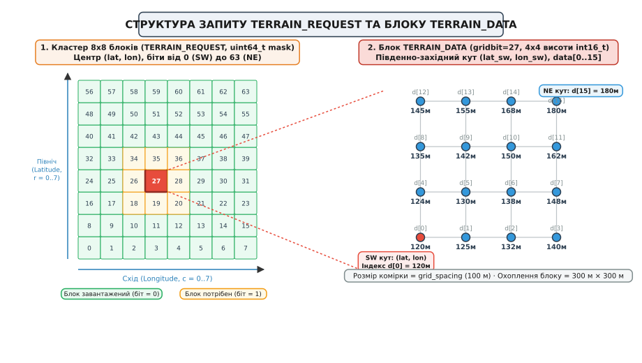
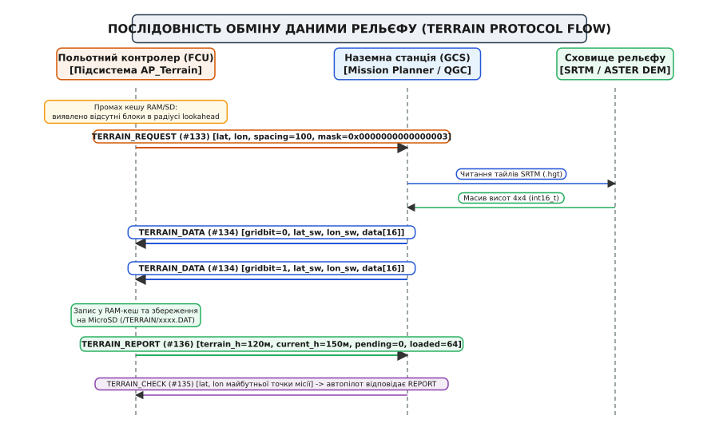
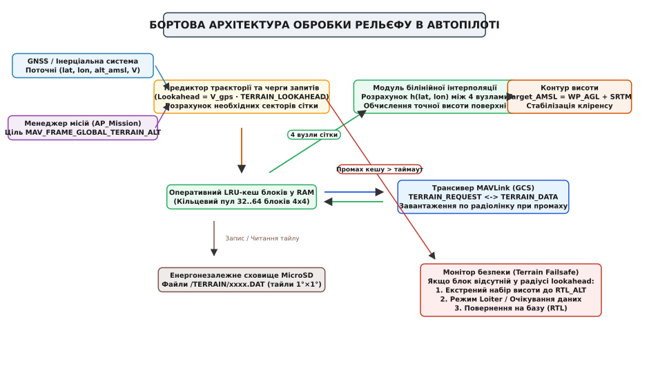

# Протокол рельєфу MAVLink: TERRAIN_REQUEST, TERRAIN_DATA, TERRAIN_REPORT

<preknowlist>
- [Пакет MAVLink](topic:sys-dron/mavlink-packet) — двійковий кадр повідомлення, службовий заголовок, ідентифікатори повідомлень та перевірка цілісності CRC-EXTRA.
- [Системи координат і одиниці вимірювання](topic:com-protocol/coordinate-frames-units) — просторові системи відліку `MAV_FRAME`, висоти AMSL, геоїд EGM96, еліпсоїд WGS84 та відносний кліренс AGL.
- [Протокол місій MAVLink](topic:sys-dron/mavlink-mission-protocol) — транзакційне завантаження пунктів польотного плану та система координат точок `MAV_FRAME_GLOBAL_TERRAIN_ALT`.
- [Аварійні протоколи зв'язку](topic:sys-dron/gcs-failsafe) — кінцеві автомати обробки втрати зв'язку, таймаути радіолінку та процедури аварійного повернення RTL.
</preknowlist>

Автономний розвідувальний безпілотний літак виконує політ у гірській ущелині на швидкості 22 м/с (близько 80 км/год), утримуючи фіксовану висоту 40 метрів над мінливою поверхнею землі для уникнення виявлення радіолокаційними станціями. Попереду за маршрутом рельєф стрімко підіймається: кам'янистий хребет виростає на 280 метрів уздовж 900-метрової ділянки схилу. Барометричний висотомір на борту показує лише тиск повітря відносно точки зльоту, супутниковий приймач GNSS видає геодезичну висоту відносно абстрактного еліпсоїда WGS84, а лазерний далекомір (лідар) спрямований вертикально вниз і має граничну дальність вимірювання 35 метрів.

Коли безпілотник наблизиться до скельного урвища на дистанцію роботи лідара, до зіткнення залишиться менше ніж 1.5 секунди. Щоб набрати 280 метрів висоти навіть з максимально допустимим для планера перевантаженням у 2g, апарату потрібна дистанція випереджувального маневру понад 350 метрів та щонайменше 16 секунд завчасного набору висоти. Покладатися лише на датчики прямої видимості вертикально вниз неможливо — літальний апарат неминуче зіткнеться зі схилом (катастрофа класу CFIT, *Controlled Flight Into Terrain*).

Для запобігання катастрофам та побудови безпечних низьковисотних траєкторій польотному контролеру необхідна цифрова матриця висот місцевості (*Digital Elevation Model*, DEM) як під апаратом, так і далеко попереду вектора його руху. Передачу цієї просторової сітки через вузькосмугові радіолінки телеметрії забезпечує **протокол рельєфу MAVLink** (*MAVLink Terrain Protocol*) — легковаговий клієнт-серверний протокол потокового завантаження та кешування блоків рельєфу на базі повідомлень `TERRAIN_REQUEST`, `TERRAIN_DATA`, `TERRAIN_CHECK` та `TERRAIN_REPORT`.


*Співвідношення абсолютної висоти польоту AMSL, висоти підстильної поверхні за моделлю DEM та відносного кліренсу AGL. Вектор випередження lookahead дозволяє автопілоту заздалегідь розпочати набір висоти до підльоту до стрімкого схилу.*

---

## Фізика та аеронавігаційні передумови польоту за рельєфом

Політ літального апарата з огинанням рельєфу (*Terrain Following*) суттєво відрізняється від класичного польоту за фіксованими висотними ешелонами. У стандартній авіаційній навігації літак підтримує барометричну висоту або висоту над рівнем моря AMSL. Проте над пересіченою місцевістю пагорби, гори, лісові масиви та урвища постійно змінюють істинний кліренс (*clearance*, висоту між найнижчою точкою апарата та землею).

Розглянемо динаміку руху літака під час наближення до гірського схилу з кутом нахилу `α`. Щоб уникнути зіткнення, автопілот повинен розвинути вертикальну швидкість набору висоти `V_z`, яка задовольняє геометричну нерівність:

```
V_z ≥ V_ground · tan(α)

де:
V_ground — горизонтальна шляхова швидкість безпілотника відносно землі;
α        — кут нахилу схилу місцевості;
V_z      — вертикальна швидкість набору висоти (швидкопідйомність).
```

Якщо літак рухається зі швидкістю `V_ground = 25 м/с` на схил із нахилом `α = 20°` (`tan(20°) ≈ 0.364`), мінімально необхідна стала швидкопідйомність становить:

```
V_z_min = 25 · 0.364 ≈ 9.1 м/с
```

Для більшості безпілотних літаків середнього класу з електричними або поршневими двигунами стала швидкопідйомність `9 м/с` є граничною або перевищує їхні енергетичні можливості. Ба більше, перехід від горизонтального польоту до набору висоти вимагає створення позитивного перевантаження `n_z = 1 + (V_ground · dθ/dt) / g`, збільшення кута атаки та переведення частини кінетичної швидкості в потенційну енергію висоти.

Якщо автопілот почне маневр запізно (наприклад, за показами спрямованого вниз оптичного або ультразвукового далекоміра на відстані 20 метрів від землі), літаку не вистачить кутової швидкості тангажу та запасу тяги. Збільшення кута атаки понад критичний призведе до зриву потоку з крила (аеродинамічного звалювання, *stall*), після чого некерований апарат вріжеться в гору.

Єдиним надійним інженерним рішенням є **предиктивне прогнозування профілю рельєфу**: автопілот повинен знати абсолютну висоту поверхні на кілька кілометрів уперед за курсом руху, щоб почати плавний, аеродинамічно оптимальний набір висоти задовго до наближення до небезпечної ділянки.

---

## Просторові моделі рельєфу: SRTM та ASTER GDEM

В основі цифрового опису поверхні Землі лежать глобальні масиви радарної та оптичної супутникової топографії:

1. **SRTM (*Shuttle Radar Topography Mission*)**: Масив даних радіолокаційного сканування Землі, отриманий у лютому 2000 року екіпажем шаттла Endeavour за допомогою інтерферометричного радара C-діапазону. Стандарт SRTM-1 забезпечує просторову дискретність в 1 кутову секунду (близько 30 метрів на екваторі), а цивільна версія SRTM-3 — 3 кутові секунди (близько 90 метрів).
2. **ASTER GDEM (*Advanced Spaceborne Thermal Emission and Reflection Radiometer Global Digital Elevation Model*)**: Спільна модель NASA та Міністерства економіки Японії (METI), отримана на основі стереопар оптичних супутникових знімків із роздільною здатністю 1 кутова секунда.

Висоти в цих моделях прив'язані до двох світових геодезичних стандартів:
- **Горизонтальний базис:** Еліпсоїд WGS84 (*World Geodetic System 1984*);
- **Вертикальний базис:** Гравітаційний геоїд EGM96 (*Earth Gravitational Model 1996*), що описує середній рівень Світового океану (висота AMSL, *Above Mean Sea Level*).

```
Співвідношення геодезичних та топографічних висот:
h_ellipsoid = H_amsl + N_geoid
H_amsl      = H_terrain + h_agl

де:
h_ellipsoid — висота над еліпсоїдом WGS84 (видається сирим GNSS-приймачем);
N_geoid     — хвилястість геоїда EGM96 (відхилення геоїда від еліпсоїда, від -106 м до +85 м);
H_amsl      — ортометрична висота над середнім рівнем моря (барометр / EKF);
H_terrain   — абсолютна позначка поверхні рельєфу за базою SRTM/ASTER (AMSL);
h_agl       — істинний кліренс апарата над землею (Above Ground Level).
```

### Геодезичні викривлення та крок довготи

У сферичній геодезії лінійна відстань між двома лініями довготи (меридіанами) залежить від географічної широти `lat`. Якщо відстань між паралелями широти є практично сталою (1 кутова секунда ≈ 30.87 м, 1 кутова мінута ≈ 1852 м), то крок по довготі зменшується від екватора до полюсів пропорційно косинусу широти:

```
Δx_lat = R_earth · Δlat_rad ≈ 6 371 000 · (Δlat_deg · π / 180)
Δy_lon = R_earth · cos(lat) · Δlon_rad ≈ 6 371 000 · cos(lat) · (Δlon_deg · π / 180)
```

Наприклад, на широті Києва або Харкова (`lat ≈ 50°`, `cos(50°) ≈ 0.6428`):
- Крок сітки 100 метрів по широті відповідає: `Δlat = 100 / 111 319.5 ≈ 0.0008983°` (або `8983` у масштабі 10⁷).
- Крок сітки 100 метрів по довготі вимагає кутового зміщення: `Δlon = 100 / (111 319.5 · 0.6428) ≈ 0.0013975°` (або `13975` у масштабі 10⁷).

Протокол рельєфу MAVLink враховує це викривлення: крок сітки задається у лінійних метрах (`grid_spacing`), а перерахунок у градусні координати виконується динамічно з урахуванням косинуса поточної широти.

### Проблема пам'яті вбудованого мікроконтролера

Один файл географічного квадрата 1°×1° моделі SRTM-3 (наприклад, `N48E024.hgt` для Карпатського регіону) містить матрицю 1201×1201 16-бітних цілих чисел зі знаковим порядком Big-Endian і займає 2.88 мегабайта. Аналогічний файл з високою роздільною здатністю SRTM-1 (3601×3601 точка) займає 25.92 мегабайта.

Польотні контролери на базі мікроконтролерів STM32F7 або STM32H7 мають усього 512 КБ – 1 МБ оперативної пам'яті (SRAM), яка майже повністю зайнята робочими буферами розширеного фільтра Калмана (EKF), таблицями навігаційних місій, логами польоту та чергами мережевих стеків RTOS. Завантажити навіть один повний файл квадрата 1°×1° в оперативну пам'ять неможливо.

Крім того, карта пам'яті MicroSD, підключена через шину SDIO/SPI, має непередбачувані затримки читання сектора (від 2 до 150 мілісекунд у разі деградації флеш-комірок або внутрішньої збірки сміття контролером картки). Звернення до накопичувача безпосередньо з високочастотного контуру стабілізації (400 Гц) призведе до зриву детермінізму керування.

Для вирішення цієї суперечності автопілоти ArduPilot (підсистема `AP_Terrain`) та PX4 реалізують розділену клієнт-серверну архітектуру, де наземна станція або бортовий комп'ютер постачають рельєф малими дискретними фрагментами в оперативний кільцевий кеш автопілота за вимогою.

> 🔧 **Навіщо це.** Польоти за рельєфом необхідні у сільськогосподарській авіації (внесення добрив на фіксованій висоті 2–3 метри над посівами), інспекції ліній електропередач у горбистій місцевості, геофізичній розвідці з магнітометрами та військових місіях маловисотного прориву ППО. Протокол рельєфу MAVLink дає змогу автопілоту знати висоту пагорбів навіть у разі повної відсутності бортового лідара чи радара.

---

## Архітектура сітки: кластери 8x8 та блоки 4x4

Протокол рельєфу MAVLink дискретизує земну поверхню за двома рівнями ієрархії: **блоками висот** та **кластерами запитів**.


*Кластер запиту TERRAIN_REQUEST охоплює 8х8 блоків за допомогою 64-бітного бітового поля. Кожен окремий блок передається пакетом TERRAIN_DATA і містить матрицю 4х4 висотних точок int16_t, упорядкованих від південно-західного кута.*

### 1. Блок висот (Terrain Block)
Елементарною неподільною одиницею даних у протоколі є блок розміром **4×4 вузли** (разом 16 висотних точок). Вузли розташовані на фіксованій відстані один від одного, яка визначається параметром `grid_spacing` (типово 100 метрів).

Координатною прив'язкою блоку є його **південно-західний кут** (*South-West corner*, координати `lat`, `lon` у форматі `int32_t` з масштабом 10⁷ градусів). 16 висот передаються у вигляді масиву 16-бітних знакових цілих чисел `int16_t data[16]`, де значення вказують висоту над рівнем моря (AMSL) у метрах:

```
Індексація елементів матриці 4×4 у повідомленні TERRAIN_DATA:
Північ (North) ↑
   Рядок 3:  data[12]   data[13]   data[14]   data[15]  (NE кут)
   Рядок 2:  data[8]    data[9]    data[10]   data[11]
   Рядок 1:  data[4]    data[5]    data[6]    data[7]
   Рядок 0:  data[0]    data[1]    data[2]    data[3]
             (SW кут)
             ----------------------------------------→ Схід (East)
             Стовпець 0 Стовпець 1 Стовпець 2 Стовпець 3
```

Один блок розміром 4×4 вузли містить 3 інтервали між точками, тобто покриває фізичний квадрат місцевості розміром:

```
Розмір блоку = (4 - 1) · grid_spacing = 3 · 100 м = 300 × 300 метрів
```

Діапазон значень `int16_t` (від -32768 до +32767 метрів) з надлишковим запасом покриває як найглибші океанічні западини (Маріанський жолоб, -10994 м), так і найвищі гірські піки планети (Еверест, +8848 м). Значення `-32768` (`0x8000`) у стандарті зарезервовано як спеціальний маркер відсутності даних (*void/no-data*).

### 2. Кластер запиту (Grid Cluster)
Коли автопілот виявляє, що в районі поточного місцезнаходження або вздовж запланованого маршруту бракує даних рельєфу, він формує запит на групу блоків — **кластер 8×8 блоків** (усього 64 блоки).

Центром кластера виступає точка `(lat, lon)` поточного положення безпілотника або цільової точки місії. Для передачі списку відсутніх блоків автопілот використовує 64-бітне беззнакове ціле число `uint64_t mask`. Кожен біт у цьому числі відповідає одному блоку в сітці 8×8:

```
Розрахунок індексу біта в масці mask (0..63):
bit_index = row · 8 + col

де:
row ∈ [0..7] — індекс рядка з півдня на північ (0 — найпівденніший);
col ∈ [0..7] — індекс стовпця із заходу на схід (0 — найзахідніший).
```

Значення біта в масці:
- `1` — блок відсутній у пам'яті автопілота і вимагає надсилання від GCS;
- `0` — блок уже завантажений або не потрібен.

Кластер 8×8 блоків покриває територію площею приблизно `(8 · 300 м) × (8 · 300 м) = 2.4 × 2.4 км`, що забезпечує запас даних для польоту протягом кількох хвилин навіть у разі тимчасової втрати радіозв'язку.

Повний двійковий склад полів, розміри структур та константи CRC-EXTRA наведено у вставці [📋 Довідник повідомлень та структур MAVLink Terrain Protocol](topic:sys-dron/mavlink-terrain-protocol/api-terrain-protocol.md).

---

## Послідовність обміну: тяглова модель передачі даних

Протокол рельєфу MAVLink працює за **тягловою моделлю** (*pull model*): ініціатором транзакції завжди виступає польотний контролер, який контролює темп надходження повідомлень відповідно до вільного обсягу свого оперативнішого кешу та завантаження радіоканалу.


*Цикл завантаження: промах кешу на борту генерує бітову маску TERRAIN_REQUEST. Наземна станція витягує дані з локального файлу SRTM і надсилає запитані блоки пакетами TERRAIN_DATA. Автопілот періодично квитує готовність через TERRAIN_REPORT.*

Обмін відбувається за такими кроками:

1. **Моніторинг кешу:** Фоновий потік підсистеми рельєфу автопілота опитує поточні координати та прогнозовані координати випередження (lookahead). Якщо в радіусі випередження виявлено сектори без завантажених висот, автопілот розраховує бітову маску відсутніх блоків.
2. **Запит `TERRAIN_REQUEST` (ID `#133`):** Автопілот транслює в радіоефір повідомлення з координатами центру кластера, кроком сітки `grid_spacing` та 64-бітною маскою `mask`. Якщо потрібні всі 64 блоки кластера, маска набуває значення `0xFFFFFFFFFFFFFFFF`.
3. **Обробка на наземній станції (GCS):** Програмне забезпечення GCS (Mission Planner, QGroundControl або автономний шлюз на companion computer) приймає `TERRAIN_REQUEST`, розбирає бітову маску та для кожного піднятого біта `k` обчислює координати південно-західного кута відповідного блоку 4×4.
4. **Вибірка із бази DEM:** GCS зчитує 16 значень висоти з локального кешу дисків SRTM/ASTER, виконує перевірку цілісності та упаковує їх у повідомлення `TERRAIN_DATA`.
5. **Завантаження `TERRAIN_DATA` (ID `#134`):** GCS надсилає запитані блоки на борт літального апарата. Повідомлення містить поле `gridbit = k`, що вказує номер блоку в кластері, та масив `data[16]`. Передача здійснюється порціями (bursts) з невеликим інтервалом (10–20 мс), щоб не переповнити черги UART польотного контролера.
6. **Кешування на борту:** Отримавши `TERRAIN_DATA`, автопілот поміщає 16 висот у кільцевий пул RAM і одночасно записує блок у файл енергонезалежної пам'яті на карті MicroSD (`/TERRAIN/*.DAT`), якщо вона встановлена. Відповідний біт у внутрішній масці скидається в `0`.
7. **Зворотний зв'язок `TERRAIN_REPORT` (ID `#136`):** Автопілот транслює регулярний звіт про стан підсистеми рельєфу (типова частота 1 Гц). Повідомлення містить поточну висоту рельєфу під дроном `terrain_height`, висоту дрона над землею `current_height` (кліренс), кількість блоків у черзі очікування `pending` та кількість завантажених валідних блоків `loaded`.
8. **Верифікація планувальником `TERRAIN_CHECK` (ID `#135`):** Під час підготовки польотного плану наземна станція може надіслати запит `TERRAIN_CHECK` для довільної географічної точки маршруту. Автопілот у відповідь надсилає `TERRAIN_REPORT`, що дозволяє оператору переконатися, що автопілот коректно бачить висоту всіх гірських ділянок місії до натискання кнопки старту.

### Аналіз навантаження на радіолінк телеметрії

Розрахуємо обсяг трафіку під час повного оновлення кластера 8×8 блоків через радіомодем зі швидкістю `57 600 біт/с` (ефективна пропускна здатність з урахуванням службових стоп-бітів UART та радіофреймінгу становить близько 4500 байт/с):

```
Розмір кадру TERRAIN_DATA у версії MAVLink v2:
Заголовок кадру: 10 байтів
Корисне навантаження: 43 байти
Контрольна сума CRC: 2 байти
Разом на один блок: 55 байтів

Загальний обсяг кластера (64 блоки):
V_total = 64 · 55 байтів = 3520 байтів (близько 3.44 КБ)

Час передачі повного кластера при виділенні 50% каналу (2250 байт/с):
T_trans = 3520 / 2250 ≈ 1.56 секунди
```

Час завантаження 1.56 с є повністю непомітним на тлі швидкості польоту літака (за 1.56 с на швидкості 20 м/с літак долає лише 31 метр, тоді як завантажений кластер покриває 2400 метрів). Це доводить високу ефективність дискретної 4×4 моделі MAVLink у порівнянні з прямою передачею сирих файлів SRTM.

---

## Бортова архітектура обробки: кеш, інтерполяція та безпека

Підсистема рельєфу польотного контролера являє собою конвеєр обробки даних, ізольований від критичних за часом контурів кутової стабілізації.


*Внутрішній конвеєр: координати та вектор швидкості надходять у предиктор випередження. Дворівневий кеш RAM/MicroSD живить модуль 2D білінійної інтерполяції, результат якого додається до висоти місії AGL для формування цільової висоти AMSL.*

### Дворівнева ієрархія пам'яті (RAM + MicroSD)

Для запобігання затримкам контуру керування автопілот використовує дворівневу пам'ять:

- **Оперативний кеш (RAM LRU Cache):** У швидкій пам'яті SRAM виділяється фіксований пул на 32 або 64 блоки `TERRAIN_DATA` (кожен блок займає 32 байти на висоти + 12 байтів службових дескрипторів). Коли пам'ять вичерпується, блок, до якого найдовше не зверталися (*Least Recently Used*, LRU), витісняється.
- **Енергонезалежний кеш (MicroSD Storage):** На картці MicroSD створюється каталог `/TERRAIN/`. Дані зберігаються у бінарних файлах, розбитих по глобальних квадратах 1°×1° (наприклад, файл `N48E024.DAT`). Кожен файл містить сітку блоків 4×4 з бітовими масками валідності. Якщо під час польоту дрон повертається у раніше відвідану зону, блоки миттєво підтягуються з карти пам'яті без залучення радіоканалу MAVLink.

### Планувальник завдань та потік `AP_Terrain::update()`

В архітектурі ArduPilot підсистема `AP_Terrain` виконується як фонове періодичне завдання у головному циклі планувальника AP_Scheduler з фіксованою частотою **10 Гц** (кожні 100 мс). 

У кожній ітерації функція `update()` виконує суворо лімітовану кількість операцій:
1. Опитує поточний стан навігаційного фільтра EKF (широту, довготу, швидкість);
2. Розраховує сектори сітки вздовж вектора випередження lookahead;
3. Перевіряє стан таймера останнього отриманого пакета `TERRAIN_DATA`;
4. Якщо виявлено відсутні блоки і минуло більше ніж 1.0 секунди з моменту останнього запиту, відправляє один пакет `TERRAIN_REQUEST`;
5. Виконує не більше ніж **одне читання сектора MicroSD** за такт (бюджет часу не більше 1.5 мс), щоб запобігти джитеру в роботі навігаційних контурів.

### Двовимірна білінійна інтерполяція

Дискретні вузли сітки розташовані з кроком 100 метрів. Безпілотник у будь-який момент часу перебуває між чотирма вузлами сітки. Просте ступінчасте округлення до найближчого вузла неприпустиме: на швидкості 20 м/с стрибкоподібна зміна розрахункової висоти поверхні на 15–30 метрів викличе різкі коливання висотного керма (руля висоти) та розгойдування літака за тангажем.

Автопілот обчислює гладку неперервну висоту рельєфу `h(lat, lon)` за допомогою **двовимірної білінійної інтерполяції** (*bilinear interpolation*, від лат. *bi-* — «двічі» та *interpolare* — «оновлювати, згладжувати»).

```
Алгоритм білінійної інтерполяції висоти поверхні:

1. Знаходження чотирьох найближчих вузлів сітки навколо точки (lat, lon):
   SW (lat₀, lon₀) -> h₀₀ = data[row · 4 + col]
   SE (lat₀, lon₁) -> h₁₀ = data[row · 4 + col + 1]
   NW (lat₁, lon₀) -> h₀₁ = data[(row + 1) · 4 + col]
   NE (lat₁, lon₁) -> h₁₁ = data[(row + 1) · 4 + col + 1]

2. Нормалізація локальних координат точки у діапазон [0.0 .. 1.0]:
   u = (lon - lon₀) / (lon₁ - lon₀)    [відносне зміщення по довготі]
   v = (lat - lat₀) / (lat₁ - lat₀)    [відносне зміщення по широті]

3. Розрахунок інтерпольованої висоти h(u, v):
   h(u, v) = (1 - u)·(1 - v)·h₀₀ + u·(1 - v)·h₁₀ + (1 - u)·v·h₀₁ + u·v·h₁₁
```

Геометрично формула обчислює зважене середнє чотирьох вершин комірки, де вага кожної вершини пропорційна площі протилежного прямокутника. Функція неперервна на межах сусідніх комірок сітки, що гарантує плавний рух виконавчих сервоприводів.

Робочу реалізацію білінійного інтерполятора, алгоритмів пошуку блоків у кеші та обробки бітових масок на мовах C та C++ наведено у вставці [⚙️ Реалізація інтерполятора рельєфу та менеджера кешу блоків](topic:sys-dron/mavlink-terrain-protocol/proj-terrain-interpolator.md).

---

## Предиктивне випередження та вектор `TERRAIN_LOOKAHEAD`

Польотний контролер не може чекати моменту, коли дрон фізично влетить у зону відсутності даних рельєфу: затримка запиту через радіолінк MAVLink, вибірка з бази на GCS та зворотне пересилання пакета займають від 100 до 800 мілісекунд (а у разі завад або перезапитів ARQ — до кількох секунд).

Для завчасного завантаження використовується параметр **`TERRAIN_LOOKAHEAD`** (час випередження, типове значення 20 секунд).

Автопілот проектує поточний вектор шляхової швидкості `V_ground` на заданий інтервал часу вперед:

```
Дистанція випередження:
D_lookahead = |V_ground| · TERRAIN_LOOKAHEAD

Координати точки прогнозу:
lat_look = lat_current + (V_north · TERRAIN_LOOKAHEAD) / R_earth_lat
lon_look = lon_current + (V_east · TERRAIN_LOOKAHEAD)  / R_earth_lon
```

Якщо швидкість польоту становить 25 м/с, а `TERRAIN_LOOKAHEAD` дорівнює 20 с, автопілот перевіряє наявність даних на 500 метрів попереду курсу. Якщо в цій точці виявлено промах кешу, автопілот надсилає `TERRAIN_REQUEST` за 20 секунд до того, як апарат досягне цього пагорба.

---

## Інтеграція з навігацією: система відліку `MAV_FRAME_GLOBAL_TERRAIN_ALT`

У протоколі місій MAVLink кожна навігаційна команда (`MISSION_ITEM_INT`) містить поле системи просторових координат `frame` (перелік `MAV_FRAME`).

Для польотів за рельєфом використовується спеціалізована система відліку:
- **`MAV_FRAME_GLOBAL_TERRAIN_ALT` (код `#10`):** Глобальні географічні координати WGS84 (`lat`, `lon`), де поле висоти `z` інтерпретується не як абсолютна позначка над рівнем моря, а як **висота над поверхнею рельєфу (AGL) у метрах**.

Коли навігаційний контролер автопілота веде апарат до точки місії, заданої у системі `MAV_FRAME_GLOBAL_TERRAIN_ALT` з висотою `Alt_AGL = 50 м`, контур висоти динамічно розраховує абсолютну цільову висоту для системи керування енергією (TECS, *Total Energy Control System*):

```
Target_AMSL(t) = Alt_AGL_target + Terrain_Height_AMSL(lat(t), lon(t))
```

Якщо під час руху вперед за прямою лінією рельєф під літаком підвищується на 50 метрів, автопілот плавно збільшує тягу двигунів, підіймає кут тангажу та підіймає абсолютну висоту польоту, зберігаючи кліренс до землі точно 50 метрів.

### Взаємодія з контуром TECS (Total Energy Control System)

В автопілотах літакового типу (ArduPilot Plane та PX4 Fixed Wing) керування висотою та швидкістю об'єднано в алгоритм повної енергії TECS. Повна механічна енергія літака складається з кінетичної та потенційної енергій:

```
E_total     = m·g·H + 0.5·m·V²    [повна питома енергія]
E_balance   = m·g·H - 0.5·m·V²    [енергетичний баланс]
```

Коли профіль рельєфу підіймається, цільова потенційна енергія зростає. Контур TECS збільшує дроселювання двигуна (Throttle) для нарощування сумарної енергії та відхиляє кермо висоти на кабрування (Pitch Up). Завдяки білінійній інтерполяції та lookahead-прогнозу зміна `Target_AMSL(t)` відбувається плавно, без ривків двигуна та перевантажень планера.

---

## Відмови та аварійні алгоритми: Terrain Failsafe

Політ на низькій висоті за відсутності достовірних даних рельєфу несе смертельний ризик зіткнення з горою. Якщо безпілотник летить в ущелині на висоті 30 метрів AGL, а зв'язок із GCS втрачено і потрібний блок рельєфу не завантажився, політ за застарілими чи нульовими даними призведе до катастрофи.

Автопілот реалізує багаторівневий автомат аварійного захисту **Terrain Failsafe**:

```
Події спрацьовування Terrain Failsafe:
┌───────────────────────────────────────────────┬────────────────────────────────────────────────────────┐
│ Стан підсистеми рельєфу                       │ Реакція польотного контролера (Failsafe Action)        │
├───────────────────────────────────────────────┼────────────────────────────────────────────────────────┤
│ Промах кешу в радіусі lookahead > 15 с        │ 1. Попередження оператору (MAVLink Statustext WARNING) │
│ (радіозв'язок відсутній, блок не отримано)    │ 2. Автоматичний набір висоти до безпечного рівня RTL   │
├───────────────────────────────────────────────┼────────────────────────────────────────────────────────┤
│ Вхід у сектор із повністю відсутніми даними   │ 1. Негайний перехід у режим аварійного набору висоти   │
│ під час виконання місії TERRAIN_ALT           │ 2. Перемикання в режим Loiter або повернення RTL       │
├───────────────────────────────────────────────┼────────────────────────────────────────────────────────┤
│ Спроба зведення двигунів (Pre-arm check)      │ Блокування старту: "Arm: Terrain data missing for WP"  │
│ за відсутності блоків для точок місії         │ Двигуни не запустяться до повного завантаження блоків  │
└───────────────────────────────────────────────┴────────────────────────────────────────────────────────┘
```

Параметри налаштування аварійних режимів:
- **`TERRAIN_ENABLE`**: Головний перемикач підсистеми (`0` — вимкнено, `1` — увімкнено).
- **`TERRAIN_FOLLOW`**: Дозвіл огинання рельєфу у польотних режимах AUTO, GUIDED, RTL, CRUISE.
- **`TERRAIN_SPACING`**: Базовий крок сітки дискретизації у метрах (типово 100 м, діапазон 30–500 м).
- **`TERRAIN_LOOKAHEAD`**: Час горизонту попередження у секундах (типово 20 с, діапазон 5–60 с).
- **`TERRAIN_OPTIONS`**: Бітова маска поведінки (наприклад, біт `0` — сувора заборона польоту без перевіреного рельєфу; біт `1` — використання даних рельєфу для розрахунку висоти повернення додому RTL).

### Особливості поведінки різних типів апаратів

Поведінка у разі спрацьовування Terrain Failsafe різниться залежно від аеродинамічної схеми транспортного засобу:

1. **Літаки (Fixed-Wing):** Літак не може зависнути на місці. При втраті даних рельєфу автопілот виводить апарат із режиму огинання землі, переводить двигун у режим максимального набору висоти (Max Climb Throttle) та підіймається на абсолютну висоту `RTL_ALT` над рівнем моря, виконуючи кругове баражування (Loiter) або повернення на аеродром старту.
2. **Мультикоптери (Multirotor):** Коптер має нульову мінімальну швидкість. При спрацьовуванні Failsafe автопілот негайно гальмує горизонтальний рух (режим Brake), зависає в точці, здійснює вертикальний набір висоти до безпечного ешелону і чекає відновлення радіозв'язку з GCS.
3. **Наземні роботи (Rover):** Наземні безпілотники використовують дані рельєфу для розрахунку максимальних кутів крену та тангажу, щоб запобігти перекиданню на стрімких схилах, а також для вибору енергетично оптимальних маршрутів в обхід крутих пагорбів.

---

## Підготовка до польоту: офлайн-кешування у польових умовах

У реальних польових умовах безпілотники часто застосовуються в районах, де відсутній мобільний інтернет, а радіолінк керування працює на граничній дистанції з високим рівнем втрат пакетів. Покладатися на завантаження рельєфу «на льоту» під час активної місії в таких умовах ризиковано.

Наземні станції Mission Planner та QGroundControl підтримують функцію **попереднього офлайн-кешування** (*pre-caching*):

1. Оператор створює польотне завдання на цифровій карті.
2. Програмне забезпечення GCS аналізує координати всіх навігаційних пунктів місії, точок аварійного збору (Rally Points) та геозон (Geofence).
3. GCS автоматично завантажує відповідні файли SRTM-1 або SRTM-3 з глобальних серверів NASA/USGS на локальний диск ноутбука.
4. Через пункт меню «Pre-load Terrain» GCS генерує структуру файлів `.DAT` і через кабель USB або слот картрідера записує їх безпосередньо у теку `/TERRAIN/` на карті MicroSD польотного контролера.

Під час передпольотної підготовки вбудований передстартовий тест автопілота (Pre-arm Check) перевіряє цілісність записаних на MicroSD файлів уздовж усього маршруту. Якщо всі сектори завантажені, статусний світлодіод автопілота дозволяє зведення двигунів, і безпілотник виконує місію в режимі повного радіомовчання без жодного пакета телеметрії `TERRAIN_REQUEST` в ефірі.

---

## Підсумки

Протокол рельєфу MAVLink перетворює обмежені обчислювальні ресурси мікроконтролера автопілота на повноцінну систему ситуаційної обізнаності та попередження зіткнень:
1. **Компактна сіткова модель:** Розбиття простору на кластери 8×8 та блоки 4×4 з дискретністю `int16_t` мінімізує обсяг корисного навантаження в радіоефірі (один блок займає лише 43 байти MAVLink).
2. **Тягловий Stop-and-Wait обмін:** Автопілот сам формує бітові маски `TERRAIN_REQUEST`, контролюючи темп прийому даних та завантаження каналу зв'язку.
3. **Гладка інтерполяція:** Двовимірна білінійна інтерполяція усуває ступінчастість дискретної сітки DEM, забезпечуючи плавне керування кермовими поверхнями.
4. **Випередження та захист:** Параметр `TERRAIN_LOOKAHEAD` компенсує мережеві затримки радіолінку, а автомат `Terrain Failsafe` гарантує безпечний набір висоти у разі обриву зв'язку чи втрати даних.
