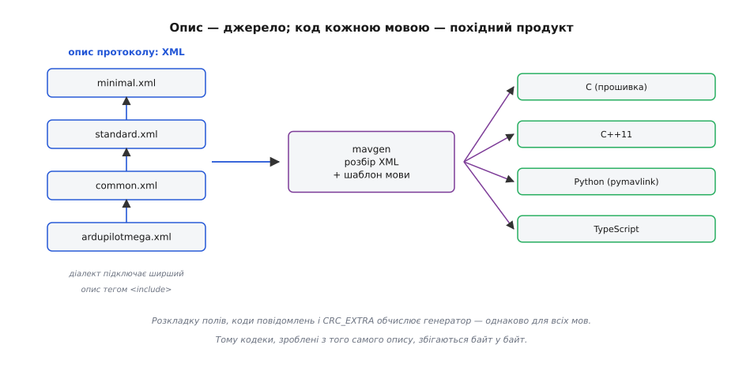
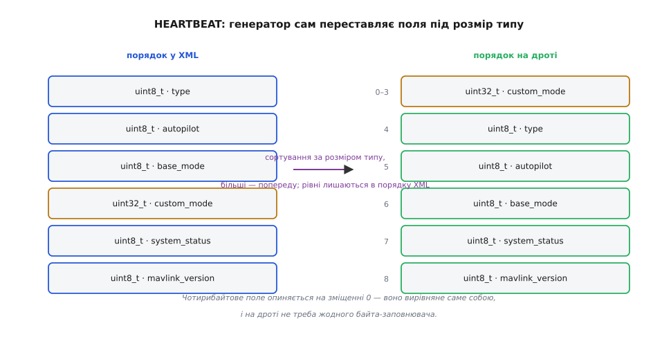
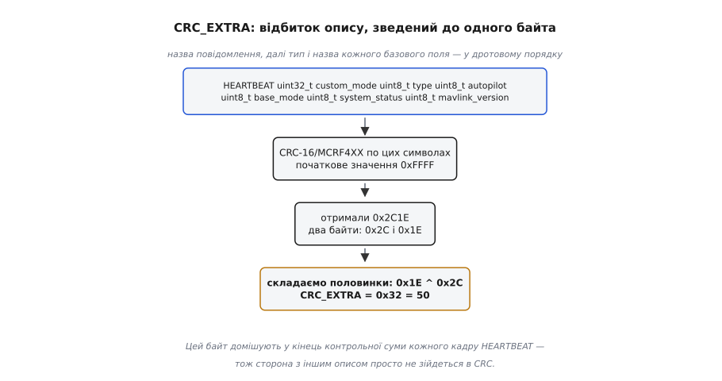
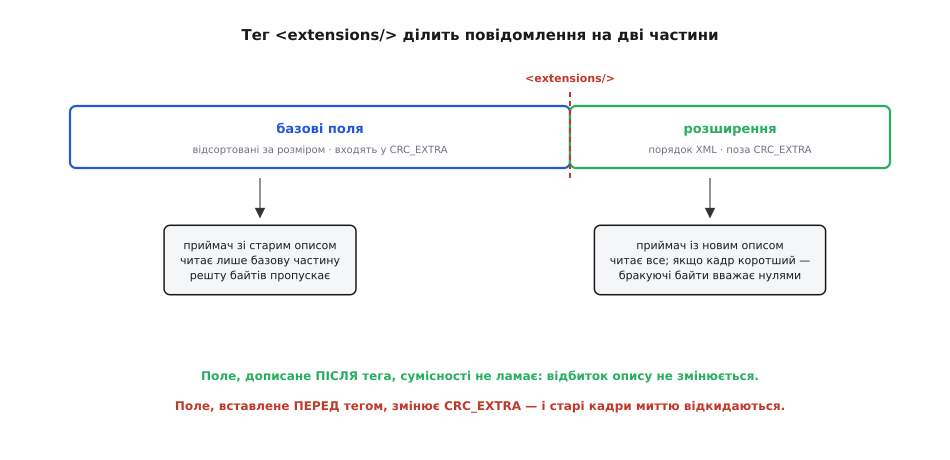

# Генерація коду з XML-опису MAVLink

<preknowlist>
- [Пакет MAVLink](topic:sys-dron/mavlink-packet) — будова кадру: стартовий байт, заголовок з визначником повідомлення, корисні дані, контрольна сума.
- [CRC](topic:com-modulation/crc) — контрольна сума як спосіб виявити спотворений блок байтів.
- [XML](topic:sf-data/xml-markup) — дерево елементів з атрибутами; найпростіший машиночитний спосіб щось описати.
- [Пакування бінарного протоколу](topic:com-protocol/wire-format-packing) — зміщення полів, вирівнювання, заповнювачі.
- [Порядок байтів](topic:hw-arch/endianness) — молодшим байтом уперед чи старшим, коли пишеш багатобайтове число в буфер.
</preknowlist>

На одній радіолінії живуть програми, писані різними людьми в різні роки різними мовами: прошивка автопілота, наземна станція, скрипт-аналізатор, прошивка камери від стороннього виробника, ретранслятор на бортовому комп'ютері. Усі вони мусять розуміти одні й ті самі повідомлення. І «розуміти однаково» тут означає річ дуже сувору: коли автопілот кладе кут крену в корисні дані повідомлення `ATTITUDE`, він має покласти його рівно в байти з четвертого по сьомий, молодшим байтом уперед, у форматі float одинарної точності. Ні п'ятого по восьмий, ні у зворотному порядку байтів. Жодної свободи тлумачення: домовленість тут вимірюється не в поняттях, а в зміщеннях.

Спробуймо уявити, що кожна команда пише свій пакувальник руками, читаючи людський опис протоколу. Хтось відкриває таблицю полів і робить структуру в тому самому порядку, у якому поля перелічені. Хтось інший підглядає в чужу реалізацію. Хтось додає до свого повідомлення ще одне поле, бо його апарат уміє більше. Розходження настане не «якщо», а «коли» — і найгірше в ньому те, що воно тихе. Кадр приходить, довжина сходиться, визначник повідомлення сходиться, приймач бере байти з тих зміщень, які знає, і дістає числа. Не сміття, а саме числа: правдоподібний кут, правдоподібну висоту. Просто не ті. Дрон летить за командою, якої ніхто не давав.

Отже, потрібне щось міцніше, ніж старанність людей. Вихід тут один: домовлятися не про код, а про **опис**. Один машиночитний файл каже, з чого складається кожне повідомлення; кожна реалізація не пише пакувальник, а **отримує його згенерованим** із цього файлу. Тоді збіг байтів перестає бути питанням уважності й стає питанням арифметики: та сама програма-генератор з того самого входу дає той самий результат. Саме так влаштований MAVLink, і саме це робить його протоколом, а не просто форматом байтів.

### Чому опис, а не заголовковий файл

Здається спокусливим оголосити джерелом правди звичайний C-заголовок зі структурами: він і так машиночитний, його вміє читати компілятор. Але цей шлях глухий одразу з трьох причин.

Перша — він замикає протокол на одній мові. Скрипт на Python і наземна станція на TypeScript не вміють читати `struct` із заголовка; їм довелося б переписувати те саме вручну, і ми повернулися б до розходжень.

Друга — заголовок мовчить про все, що не є кодом. Поле `lat` — це градуси чи сотні наносекунд дуги? Яких значень набуває поле `type`? Яке число в полі означає «даних немає»? Яке поле є адресою одержувача, а яке — просто числом? Усе це — частина протоколу, і десь воно має бути записане формально, інакше кожна сторона тлумачитиме по-своєму.

Третя, найтонша: розкладку структури в пам'яті вирішує **компілятор** під конкретну платформу, а не протокол. Той самий заголовок на двох архітектурах може дати різні зміщення полів. Джерелом правди про байти на дроті може бути тільки те, що від компілятора не залежить узагалі.

Тож опис має бути в нейтральному форматі даних, який однаково прочитає будь-яка мова. У 2009 році, коли Лоренц Маєр (Lorenz Meier) в ETH Zurich випустив перший MAVLink як частину проєкту PIXHAWK, природним вибором для такої схеми був **XML** — і він лишився ним донині. Сам підхід не унікальний для дронів: описувати контракт окремою мовою й генерувати з нього код — це [мова опису інтерфейсів](topic:com-protocol/interface-definition-language), той самий прийом, на якому стоять Protocol Buffers, Thrift і ASN.1. Сенс усюди один: [єдине джерело правди](topic:sf-apps/single-source-of-truth), з якого все інше виводиться механічно.

Ось як виглядає в описі найпростіше повідомлення MAVLink — `HEARTBEAT`, те саме «я живий», яке апарат шле приблизно раз на секунду:

```xml
<message id="0" name="HEARTBEAT">
  <description>Періодичне повідомлення про присутність і стан системи.</description>
  <field type="uint8_t"  name="type"        enum="MAV_TYPE">Тип апарата.</field>
  <field type="uint8_t"  name="autopilot"   enum="MAV_AUTOPILOT">Тип автопілота.</field>
  <field type="uint8_t"  name="base_mode"   enum="MAV_MODE_FLAG">Прапорці режиму.</field>
  <field type="uint32_t" name="custom_mode">Режим, специфічний для автопілота.</field>
  <field type="uint8_t"  name="system_status" enum="MAV_STATE">Стан системи.</field>
  <field type="uint8_t_mavlink_version" name="mavlink_version">Версія протоколу.</field>
</message>
```

Тут є все, чого бракувало заголовку: числовий визначник, ім'я, типи й імена полів, посилання на переліки допустимих значень, людський опис. Поруч, у тому самому файлі, живуть самі переліки — `MAV_TYPE`, `MAV_STATE` і решта, кожен зі своїми записами й числами. Опис описує протокол цілком.


*Опис підключає ширший опис тегом `<include>`; генератор читає зібране дерево й розкладає його по шаблонах мов. Розкладку полів рахує генератор — тому всі кодеки збігаються байт у байт.*

### Порядок полів на дроті вирішує генератор

Опис не каже, на якому зміщенні лежить яке поле. Він каже лише, які поля є і якого вони типу. Отже, правило перетворення опису на розкладку має бути частиною **генератора** — і однаковим для всіх мов.

Найочевидніше правило — «як у XML, так і на дроті» — виявляється поганим. Подивімося на `HEARTBEAT`: три однобайтові поля, потім чотирибайтове `custom_mode`. За наївним правилом `custom_mode` починається зі зміщення 3. А тепер згадаймо, ким і на чому цей кадр розбирають: прошивкою мікроконтролера, яка накладає структуру просто на буфер прийому. Щоб структура точно лягла на байти, її оголошують щільною, без заповнювачів. І тоді звертання до `custom_mode` за адресою, не кратною чотирьом, на процесорах зі суворим вирівнюванням (наприклад, ядрі Cortex-M0) дає апаратний виняток, а на решті — розсипається на чотири окремі читання байтів зі зсувами. Протокол, який змушує кожен приймач платити за це в кожному кадрі, спроєктовано погано.

Правило, яке обрали в MAVLink, звучить в один рядок: **поля впорядковують за спаданням розміру типу**. Спершу восьмибайтові (`int64_t`, `uint64_t`, `double`), потім чотирибайтові (`int32_t`, `uint32_t`, `float`), потім двобайтові, потім однобайтові. Масив рахують за розміром **елемента**, а не за повною довжиною: масив із десяти `uint16_t` стоїть серед двобайтових.

Чому цього достатньо, видно з простого міркування. Усі розміри типів MAVLink — степені двійки: 8, 4, 2, 1. Зміщення поля дорівнює сумі розмірів усіх полів перед ним. Якщо поля йдуть за незростанням розміру, то кожен доданок у цій сумі **не менший** за розмір нашого поля, а отже, кожен доданок на нього ділиться. Сума чисел, кожне з яких кратне *k*, теж кратна *k* — тож зміщення будь-якого поля ділиться на його власний розмір. Це і є природне вирівнювання, здобуте без жодного байта-заповнювача. Одне сортування замість таблиці вирівнювань.

Поля однакового розміру сортування не чіпає: воно **стійке**, тобто рівні за ключем лишаються в тому порядку, у якому стояли в XML. Без цієї властивості два генератори могли б розійтися на полях однакового розміру, і вся затія завалилася б.


*Ліворуч — як поля записані в XML, праворуч — як вони лягають у корисні дані. Чотирибайтове поле опиняється на зміщенні 0, решта — за ним; заповнювачі не потрібні.*

**Умова.** Порахуймо зміщення полів `HEARTBEAT` у корисних даних після сортування.

```
поле             тип         розмір   зміщення
custom_mode      uint32_t      4         0      (0 ділиться на 4 ✓)
type             uint8_t       1         4
autopilot        uint8_t       1         5
base_mode        uint8_t       1         6
system_status    uint8_t       1         7
mavlink_version  uint8_t       1         8
                                        ──
довжина корисних даних                   9 байтів
```

Дев'ять байтів — рівно стільки, скільки займають самі дані, без жодного зайвого. Багатобайтові поля записують молодшим байтом уперед, у [прямому порядку байтів](topic:hw-arch/endianness), незалежно від того, на якому процесорі працює відправник; згенерований код сам переставляє байти там, де архітектура інша.

> 🔧 **Навіщо це.** Найпоширеніша помилка того, хто пише розбирач MAVLink руками, — узяти порядок полів із документації. У таблицях на сайті протоколу поля перелічені так, як в описі, а на дроті вони лежать відсортовані. Результат — зсунуті поля й правдоподібне сміття замість телеметрії. Дротовий порядок можна побачити тільки в згенерованому коді: у ньому структура вже перевпорядкована.

### Однакова функція від різного входу

Генерація детермінована — це добре. Але детермінованість гарантує збіг **лише за однакового входу**. А вхід у двох сторін легко буває різним: наземна станція оновилася до свіжих описів, прошивка апарата зібрана торік. Обидві знають повідомлення №30, тільки в новішому описі до нього дописали поле. Кадр приходить, визначник сходиться — а поля читаються не з тих зміщень.

Отже, приймачеві потрібен спосіб **помітити, що відправник має інший опис**. Надсилати номер версії всього набору описів марно: діалекти змінюються щодня, а розходяться сторони зазвичай в одному-двох повідомленнях зі сотні. Надсилати сам опис — безглуздо на лінії в 57600 бод. Потрібен маленький **відбиток кожного окремого повідомлення**, який можна порахувати з опису наперед і возити в кожному кадрі.

Саме це і є `CRC_EXTRA` — один байт, який генератор обчислює зі структури повідомлення й зашиває в згенерований кодек. Рахують його так: беруть рядок з імені повідомлення, а далі — тип та ім'я кожного базового поля **в дротовому порядку**, через пробіл; проганяють цей рядок через ту саму [контрольну суму](topic:com-modulation/crc) CRC-16/MCRF4XX, що стереже і кадр; а двобайтовий результат згортають до одного байта, склавши половинки за модулем два.


*Відбиток рахують з тексту опису — імені повідомлення, типів і назв полів у дротовому порядку. Двобайтовий результат згортають до байта складанням половинок.*

**Умова.** Обчислімо `CRC_EXTRA` для `HEARTBEAT`.

```
рядок (126 символів, у дротовому порядку полів):
"HEARTBEAT uint32_t custom_mode uint8_t type uint8_t autopilot "
"uint8_t base_mode uint8_t system_status uint8_t mavlink_version "

CRC-16/MCRF4XX, початкове значення 0xFFFF   →  0x2C1E
згортання:  (0x2C1E & 0xFF) ^ (0x2C1E >> 8)
         =   0x1E          ^  0x2C
         =   0x32          =  50

CRC_EXTRA(HEARTBEAT) = 50
```

Це число справді стоїть у таблиці кожної згенерованої бібліотеки MAVLink; для `ATTITUDE` тим самим способом виходить 39, для `SYS_STATUS` — 124. Кодек домішує цей байт у кінець контрольної суми кожного кадру — після заголовка й корисних даних. Наслідок точний і красивий: **одна перевірка ловить дві різні біди**. Спотворення в ефірі — бо CRC на те й CRC. І неузгоджені описи — бо в сторони з іншим набором полів інший відбиток, тож сума не зійдеться, і кадр буде відкинуто як пошкоджений. Розходження, яке інакше було б тихим, стає гучним.

Варто помітити, що саме потрапляє у відбиток, а що ні. Туди йдуть ім'я повідомлення, типи й імена полів — тобто рівно те, від чого залежить розкладка байтів і тлумачення. Не йдуть описи, одиниці вимірювання, значення переліків, атрибути документації. Межу проведено точно там, де треба: виправлення друкарської помилки в описі поля не розриває зв'язок з усім флотом, а перейменування поля — розриває, бо це вже інший контракт.

Одна деталь опису тут особлива: псевдотип `uint8_t_mavlink_version`. На дроті це звичайний однобайтовий беззнаковий цілий, просто генератор заповнює таке поле сам, номером версії протоколу, не питаючи прикладний код. У відбиток воно входить під нормалізованим іменем типу `uint8_t` — інакше опубліковане значення 50 не зійшлося б.

І чесна межа: один байт — це один байт. Два несумісні описи з ймовірністю приблизно 1/256 дадуть однаковий відбиток і не помітять одне одного. `CRC_EXTRA` захищає від **випадковості**, а не від зловмисника: підробити кадр так, щоб він пройшов перевірку, тривіально, бо алгоритм відкритий і ключа в ньому немає. Захист від підробки — окремий механізм, [криптографічний підпис MAVLink 2](topic:sys-dron/mavlink-v2-signing).

Як власноруч порахувати `CRC_EXTRA` для довільного повідомлення й звірити результат зі згенерованою таблицею — розібрано в [окремому розборі з робочим кодом](topic:sys-dron/mavlink-xml-codegen/proj-crc-extra.md): там і сама функція CRC-16/MCRF4XX побітно, і збирання рядка з опису, і перевірка на відомих значеннях.

### Як тоді протоколу рости

Відбиток, що змінюється від будь-якої правки списку полів, має неприємний бік: щойно ти додаси до повідомлення нове поле, ти розірвеш зв'язок з усіма апаратами, прошитими раніше. Так протокол не росте — так він застигає. А рости йому треба: апарати вміють дедалі більше, і кожне нове вміння просить нового поля.

Розв'язок у MAVLink 2 — тег `<extensions/>` посеред списку полів. Він ділить повідомлення на дві частини з різними правилами.

```xml
<message id="30" name="ATTITUDE">
  <field type="uint32_t" name="time_boot_ms" units="ms">Час від старту.</field>
  <field type="float" name="roll"  units="rad">Крен.</field>
  <field type="float" name="pitch" units="rad">Тангаж.</field>
  <field type="float" name="yaw"   units="rad">Курс.</field>
  <field type="float" name="rollspeed"  units="rad/s">Кутова швидкість крену.</field>
  <field type="float" name="pitchspeed" units="rad/s">Кутова швидкість тангажа.</field>
  <field type="float" name="yawspeed"   units="rad/s">Кутова швидкість курсу.</field>
  <extensions/>
  <!-- усе, що нижче, дописано пізніше -->
</message>
```

Поля **до** тега — базові: їх сортують за розміром і включають у відбиток. Поля **після** тега не сортують зовсім (вони лягають у порядку XML, у хвіст) і у відбиток не беруть. Тому дописування поля в кінець описом сумісності не ламає: `CRC_EXTRA` лишається тим самим, старий приймач далі впізнає повідомлення, просто читає з нього менше.

**Умова.** Порівняймо три варіанти `ATTITUDE` за відбитком.

```
початковий опис (7 базових полів)              CRC_EXTRA = 39
+ float extra ДО  <extensions/>                CRC_EXTRA = 183   ← зв'язок розірвано
+ float extra ПІСЛЯ <extensions/>              CRC_EXTRA = 39    ← сумісно
```

Щоб цей механізм працював, потрібна ще одна домовленість — про **коротший кадр**. Старий відправник шле корисні дані без розширень, тобто коротші, ніж очікує новий приймач. Правило MAVLink 2 каже: приймач доповнює отримані дані нулями до тієї довжини, яку знає з власного опису. Звідси випливає вимога до проєктування: **нуль у полі-розширенні мусить означати «даних немає»**, бо саме нуль читатиметься там, де відправник про це поле не знав. З того самого правила виростає й економія трафіку: відправник має право обрізати нульовий хвіст корисних даних перед відправкою, бо приймач однаково доповнить його нулями. Одна домовленість, два наслідки.


*Ліворуч від тега — поля, які сортують і хешують; праворуч — дописані пізніше, у порядку XML і поза відбитком. Приймач зі старим описом читає лише ліву частину, з новим — доповнює короткий кадр нулями.*

Звідси випливають правила правки описів, і вони жорсткі. Не можна вставляти поле перед тегом розширень. Не можна перейменовувати поле й міняти йому тип. Не можна повторно використовувати визначник видаленого повідомлення. Усе це — звичайна [дисципліна версіонування контракту](topic:com-protocol/api-versioning), тільки з негайним і безжальним покаранням: не попередження в збірці, а мовчазна тиша в ефірі.

### Діалекти: як описи ділять простір

Одного файлу описів на всіх не досягти: виробник камери хоче своє повідомлення, дослідницька лабораторія — своє, і жоден із них не проситиме дозволу в спільноти на кожен експеримент. Тому описи розкладені в дерево, яке кожен файл будує тегом `<include>`: `minimal.xml` містить абсолютний мінімум (той самий `HEARTBEAT`), `standard.xml` підключає його й додає загальновживане, `common.xml` — ще ширший спільний набір, а вже діалект виробника, скажімо `ardupilotmega.xml`, підключає `common.xml` і дописує своє. Про самі діалекти й те, як вони уживаються на одній лінії, є [окрема стаття](topic:sys-dron/mavlink-dialect).

І тут вилазить проблема, якої в звичайних мовах опису немає. На дроті від повідомлення лишається **тільки число** — 24-бітний визначник. Жодного простору імен туди не запхати: на нього немає бітів, а якби й були, то кожен кадр платив би за них у ефірі. Отже, розділити простір визначників технічно неможливо — його ділять **домовленістю**. У проєкті MAVLink є реєстр діапазонів: спільні повідомлення живуть у 300–10000, uAvionix — у 10001–10999, ArduPilotMega — в 11000–11999, ICAROUS — у 42000–42999. Це не механізм, а обіцянка; ніщо в коді не завадить двом виробникам зайняти те саме число.

Якщо таке станеться, два різні повідомлення виглядатимуть для кодека однаково — і рятує знову `CRC_EXTRA`: набори полів у них майже напевно різні, тож відбитки не збігаються й чужий кадр буде відкинуто. «Майже напевно» тут не фігура мови, а та сама одна двісті п'ятдесят шоста ймовірність збігу.

Окремо в цьому дереві стоїть `development.xml` — майданчик для повідомлень, які ще обговорюють. Їхні визначники й поля можуть змінитися будь-коли, тому в прошивку, що піде до користувачів, їх не беруть.

### Генератор на практиці

Інструмент генерації називається `mavgen` і входить до складу `pymavlink`. Викликають його однією командою: чим генерувати, з якого опису, у якій версії протоколу, куди складати.

```sh
python -m pymavlink.tools.mavgen \
    --lang=C --wire-protocol=2.0 \
    --output=generated/include/mavlink/v2.0 \
    message_definitions/v1.0/ardupilotmega.xml
```

Для MAVLink 2 офіційні генератори покривають C, C++11, Python, TypeScript і WLua (розбирач для аналізатора трафіку); C#, JavaScript, Objective-C і Swift лишилися на рівні MAVLink 1. Решта мов живе окремими проєктами спільноти.

Що саме випадає на виході для C: на кожне повідомлення — заголовок зі щільною структурою вже в дротовому порядку, функціями пакування й розпакування та окремими читачами полів; плюс один спільний заголовок із таблицею `MAVLINK_MESSAGE_CRCS`, яка ставить у відповідність визначнику повідомлення його `CRC_EXTRA`. Ця таблиця й дозволяє розбирачеві кадрів перевірити суму, ще не знаючи, що всередині: він бере визначник із заголовка, дістає з таблиці байт і домішує його в підрахунок.

Одне й те саме повідомлення в кодеках двох мов виглядає по-різному на вигляд і однаково по суті:

:::tabs
```c
/* Згенеровано з common.xml — руками не правити. */
typedef struct __mavlink_attitude_t {
    uint32_t time_boot_ms;   /* зміщення 0 — 4-байтове поле попереду */
    float roll;              /* 4  */
    float pitch;             /* 8  */
    float yaw;               /* 12 */
    float rollspeed;         /* 16 */
    float pitchspeed;        /* 20 */
    float yawspeed;          /* 24 */
} mavlink_attitude_t;        /* усього 28 байтів */

#define MAVLINK_MSG_ID_ATTITUDE_CRC 39

/* Пакування у кадр: заповнює msg і рахує CRC разом із CRC_EXTRA. */
uint16_t mavlink_msg_attitude_pack(uint8_t sysid, uint8_t compid,
                                   mavlink_message_t *msg,
                                   uint32_t time_boot_ms,
                                   float roll, float pitch, float yaw,
                                   float rollspeed, float pitchspeed, float yawspeed);

/* Розпакування: розкладає корисні дані отриманого кадру по полях. */
void mavlink_msg_attitude_decode(const mavlink_message_t *msg,
                                 mavlink_attitude_t *attitude);
```
```python
# Згенеровано з common.xml — руками не правити.
class MAVLink_attitude_message(MAVLink_message):
    id = 30
    name = 'ATTITUDE'
    # порядок полів — дротовий, той самий, що в C-структурі
    fieldnames = ['time_boot_ms', 'roll', 'pitch', 'yaw',
                  'rollspeed', 'pitchspeed', 'yawspeed']
    format = '<Iffffff'          # рядок пакування: I = uint32, f = float, < = little-endian
    crc_extra = 39

    def __init__(self, time_boot_ms, roll, pitch, yaw,
                 rollspeed, pitchspeed, yawspeed): ...
```
:::

Обидва кодеки виводять з опису те саме: порядок полів, довжину корисних даних, число 30 і відбиток 39. У C це стало щільною структурою й набором функцій, у Python — класом із рядком формату для стандартного пакувальника; байти на дроті виходять однакові.

Спосіб, у який `mavgen` викликають, які в нього ключі й що конкретно він розкладає по теках, зібрано окремо — [контракт інструменту й форма згенерованого коду](topic:sys-dron/mavlink-xml-codegen/api-mavgen.md).

Практичний бік цього — те, як генерація живе у збірці. Згенеровані файли не є джерельним кодом: це похідний продукт, і тримати їх у сховищі поруч із рукописним кодом — запрошення до розсинхрону, коли хтось правитиме згенероване. Правильно робити генерацію [окремим кроком збірки](topic:sys-bsystem/custom-commands), а сховище з описами підключати як звичайну залежність — і [прив'язувати до конкретної ревізії](topic:sys-bsystem/version-pinning). Опис протоколу має версію, як будь-яка бібліотека, і ставитися до нього треба так само.

> 🔧 **Навіщо це.** Коли апарат раптом перестає показувати один-єдиний тип телеметрії, а решта живе, — з дуже великою ймовірністю хтось із двох боків перегенерував бібліотеку зі свіжих описів, а другий лишився на старих. Дивитися треба не в код, а в опис: чи не змінився набір полів того повідомлення, і чи не вставили нове поле перед тегом розширень. Звірка `CRC_EXTRA` з обох боків займає хвилину й одразу дає відповідь.

### Де це ламається

Механізм відбитка робить розходження гучним, але не робить його неможливим. Ось випадки, у яких він проявляється, і те, як їх упізнати за симптомом.

**Перегенерували один бік.** Найчастіше. Симптом дуже характерний: зв'язок загалом живий, `HEARTBEAT` іде, а конкретне повідомлення зникає з ефіру — його кадри тихо відкидаються за незбігом суми. Розходження завжди рівно в тих повідомленнях, чиї поля правили.

**Розбирач написали руками за таблицею з документації.** Симптом інший і підступніший: кадри проходять перевірку (адже сума порахована кодеком правильно, а руками писали лише читання полів), але значення полів безглузді або зсунуті. Причина — порядок полів у документації, а не на дроті.

**Поле дописали перед тегом розширень.** Виглядає точно як перший випадок, тільки винуватець — не той, хто збирав, а той, хто правив опис діалекту.

**Два діалекти зайняли той самий визначник.** Симптом схожий, але зникає лише при поєднанні конкретних пристроїв: апарат одного виробника поруч зі станцією, що знає діалект іншого.

**Дописали запис до переліку.** А ось це не ламається зовсім — і саме тому потребує уваги. Значення переліків у відбиток не входять, тож новий режим польоту чи новий тип апарата пройде крізь будь-який кодек безперешкодно. Розбиратися з незнайомим числом доведеться прикладному коду, і він мусить бути до цього готовий: невідомий запис — не привід падати. Кодек тут не допоможе, бо для нього нічого не змінилося.

Спільне в усіх п'яти — те, що жоден із них не є помилкою в коді. Це помилки в **описі** або в узгодженні описів, і шукати їх треба там.

---

Найцікавіше в цій конструкції — не сама генерація коду з опису: так роблять давно й багато де. Найцікавіше те, що MAVLink проніс домовленість **у рантайм**. У звичайній генерації опис живе лише під час збірки: зібрали — і далі дві програми покладаються на те, що їх зібрали з однакового входу, а перевірити це вже нічим. MAVLink узяв ту саму сутність, з якої генерує код, звів її до одного байта й поклав цей байт у кожен кадр. Тепер опис не просто оголошений — він перевіряється сотні разів на секунду, на кожному пакеті, і сторона з іншим уявленням про протокол виявляє себе за першу ж мілісекунду обміну.
