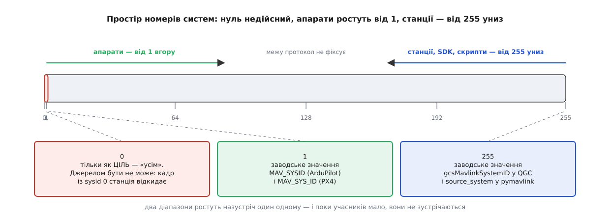
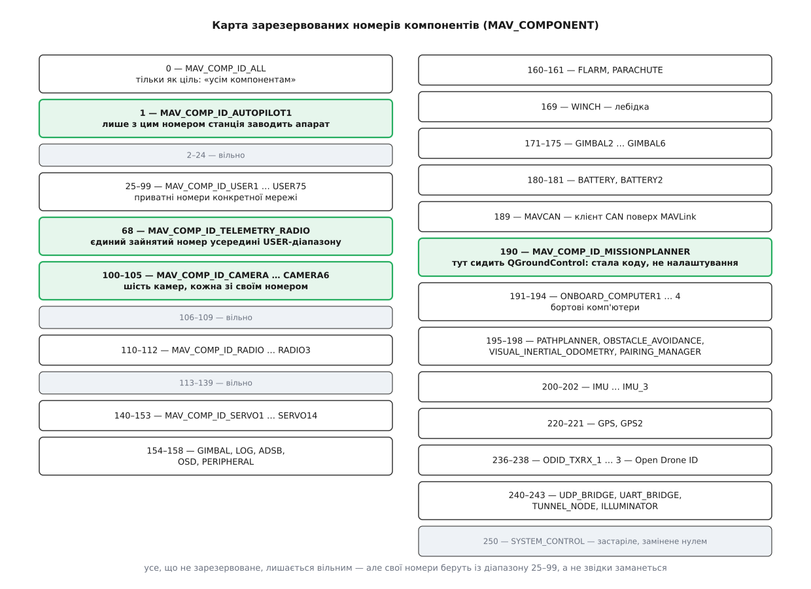

# 📋 Адреси MAVLink: діапазони sysid, зарезервовані compid і числа станції

Довідка з чотирьох байтів, якими MAVLink адресує геть усе: хто має право взяти який номер системи, що означає кожен зарезервований номер компонента і звідки QGroundControl бере власну пару чисел. Потрібна вона рівно тоді, коли в мережі більше ніж один апарат або більше ніж одна станція, — бо помилка в номері не дає ані повідомлення про помилку, ані розриву зв'язку, а лише команду, виконану не тим.

## Чотири байти

Адресація MAVLink уміщається в чотири однобайтові поля, і лежать вони в двох різних місцях кадру. Про будову самого кадру — [пакет MAVLink](root:sys-dron/mavlink-packet).

| Поле | Де лежить | Дійсні значення | Що означає 0 |
| --- | --- | --- | --- |
| `sysid` | заголовок: байт 5 у v2, байт 3 у v1 | 1…255 | нічого — недійсне джерело |
| `compid` | заголовок: байт 6 у v2, байт 4 у v1 | 1…255 | нічого — недійсне джерело |
| `target_system` | тіло, зсув свій у кожного повідомлення | 0…255 | усі системи мережі |
| `target_component` | тіло, зсув свій у кожного повідомлення | 0…255 | усі компоненти адресованої системи |

Перші два є в **кожному** кадрі без винятку і завжди на однаковому місці. Другі два є лише в тих повідомленнях, чий XML-опис їх містить, — це команди, робота з параметрами, протокол місій, керування камерою; телеметрія полів адресата не має взагалі.

Асиметрія нуля тут не випадкова, і її варто тримати в голові: **нуль у полях заголовка недійсний, нуль у полях адресата означає «всім»**. Одне й те саме число з двох боків кадру значить протилежні речі.

## Номери систем

Протокол не резервує жодного номера системи — він лише радить, з якого кінця відлічувати. Автопілотам номери роздають послідовно **вгору від 1**, наземним станціям і бібліотекам розробника — послідовно **вниз від 255**.



*Обидва діапазони ростуть назустріч, межі між ними протокол не фіксує.*

| Номер | Хто це зазвичай | Звідки береться значення |
| --- | --- | --- |
| **0** | ніхто | недійсне джерело; як ціль — широкомовлення на всю мережу |
| **1** | перший апарат | заводське `MAV_SYSID` (ArduPilot) і `MAV_SYS_ID` (PX4) |
| **2, 3, 4 …** | другий, третій, четвертий апарати | ставлять руками параметром борту |
| **2** | антенний трекер ArduPilot | у збірці AntennaTracker `MAV_SYSID_DEFAULT` дорівнює 2 |
| **… 253, 254** | другі станції, SDK, скрипти на pymavlink | ставлять руками при під'єднанні |
| **255** | перша наземна станція | заводське `gcsMavlinkSystemID` у QGC; `source_system` у pymavlink |

Дві дрібниці, що коштують годин налагодження. Перша: `pymavlink` за замовчуванням бере `source_system=255` — тобто **той самий номер, що й QGroundControl**, і скрипт, запущений поруч зі станцією, одразу стає її двійником. Друга: параметр `MAV_SYS_ID` у PX4 обмежений зверху числом **250**, тоді як ArduPilot дозволяє повні 1…255; номера 255 апаратові на PX4 просто не поставити.

> 🔧 **Навіщо це.** Перш ніж вести в поле другий апарат, номери роздають на столі й записують. Правило, яке працює: апарати від 1 угору, станції та скрипти від 255 униз — і жодного числа двічі. Роздача займає п'ять хвилин, а її відсутність виявляється вже в повітрі й виглядає як несправність зв'язку, хоча зв'язок бездоганний.

## Номери компонентів

Тут, навпаки, майже все розписано наперед: `MAV_COMPONENT` — це перелік із фіксованими значеннями, і брати число «просто так» не можна.



*Зайняті блоки, вільні проміжки і два числа, на яких тримається все спілкування станції з апаратом: 1 і 190.*

| Номери | Ім'я в `MAV_COMPONENT` | Що це |
| --- | --- | --- |
| **0** | `MAV_COMP_ID_ALL` | тільки як ціль: усі компоненти |
| **1** | `MAV_COMP_ID_AUTOPILOT1` | польотний контролер |
| 25–99 | `USER1` … `USER75` | приватні номери конкретної мережі |
| **68** | `MAV_COMP_ID_TELEMETRY_RADIO` | телеметрійний модем (наприклад, SiK) |
| **100–105** | `CAMERA` … `CAMERA6` | шість камер |
| 110–112 | `RADIO` … `RADIO3` | радіомодулі |
| 140–153 | `SERVO1` … `SERVO14` | сервоприводи з власним MAVLink |
| **154**, 171–175 | `GIMBAL`, `GIMBAL2` … `GIMBAL6` | підвіси |
| 155 | `MAV_COMP_ID_LOG` | логер |
| **156** | `MAV_COMP_ID_ADSB` | приймач-передавач ADS-B |
| 157 | `MAV_COMP_ID_OSD` | накладання даних на відео |
| 158 | `MAV_COMP_ID_PERIPHERAL` | загальна периферія автопілота |
| 160, 161, 169 | `FLARM`, `PARACHUTE`, `WINCH` | попередження про зіткнення, парашут, лебідка |
| 180–181 | `BATTERY`, `BATTERY2` | розумні батареї |
| 189 | `MAV_COMP_ID_MAVCAN` | клієнт CAN поверх MAVLink |
| **190** | `MAV_COMP_ID_MISSIONPLANNER` | наземна станція |
| **191–194** | `ONBOARD_COMPUTER` … `ONBOARD_COMPUTER4` | бортові комп'ютери |
| 195–198 | `PATHPLANNER`, `OBSTACLE_AVOIDANCE`, `VISUAL_INERTIAL_ODOMETRY`, `PAIRING_MANAGER` | планування шляху, обхід перешкод, візуальна одометрія, спарювання |
| 200–202 | `IMU`, `IMU_2`, `IMU_3` | інерційні блоки |
| **220–221** | `GPS`, `GPS2` | приймачі супутникової навігації |
| 236–238 | `ODID_TXRX_1` … `ODID_TXRX_3` | Open Drone ID — віддалена ідентифікація |
| **240–241** | `UDP_BRIDGE`, `UART_BRIDGE` | мости MAVLink у мережу й у послідовний порт |
| 242–243 | `TUNNEL_NODE`, `ILLUMINATOR` | тунельні повідомлення, освітлювач |
| 250 | `MAV_COMP_ID_SYSTEM_CONTROL` | **застаріле** з 2018 року, замінене нулем |

Жирним позначені ті номери, що трапляються в трафіку звичайного дрона щодня. Кілька з них варті окремого слова.

**68 — телеметрійний модем.** Єдине зайняте число посеред приватного діапазону `USER1…USER75` — виняток, який доводиться пам'ятати, роздаючи власні номери. Модем при цьому лишається самостійним учасником із власним `sysid`, а його `RADIO_STATUS` доповідає не про апарат, а про сам канал.

**100–105 — камери.** Шість номерів поспіль, а не один: кожна камера на борту — окремий компонент зі своїм набором параметрів і своїм станом. Станція заводить окремий об'єкт камери на кожен номер із цього діапазону. Самі протоколи камери й підвісу описані [окремо](root:sys-dron/mavlink-camera-gimbal).

**190 — наземна станція.** Ім'я `MISSIONPLANNER` дісталося переліку від іншої станції, але число давно стало спільним: усі станції говорять із цього номера.

**191 — бортовий комп'ютер.** Найчастіше джерело фантомних апаратів на карті: комп'ютер, який шле `HEARTBEAT` не з цим номером, а з номером автопілота, виглядає для станції як ще один літальний апарат.

**220 — GPS.** Номер належить приймачеві, що говорить MAVLink сам (наприклад, у складі DroneCAN-шлюзу), а не звичайному модулю на UART автопілота: той узагалі не є компонентом MAVLink.

## Що з цього бере QGroundControl

Своїх чисел у станції два, і беруться вони з різних місць: номер системи — з налаштувань, номер компонента — зі сталої в коді.

### Налаштування

Група налаштувань лежить у `Mavlink.SettingsGroup.json`, на екрані — сторінка «MAVLink» у налаштуваннях застосунку.

| Ключ | Тип | Замовчування | Діапазон | Що робить |
| --- | --- | --- | --- | --- |
| `gcsMavlinkSystemID` | `uint32` | **255** | 1…255 | номер системи самої станції |
| `sendGCSHeartbeat` | `bool` | **true** | — | періодично слати власний `HEARTBEAT`, щоб апарат знав про станцію |
| `forwardMavlink` | `bool` | **false** | — | копіювати весь трафік на зовнішню адресу |
| `forwardMavlinkHostName` | `string` | **`localhost:14445`** | — | куди саме копіювати |

Вимикати `sendGCSHeartbeat` без потреби не варто: частина прошивок за наявністю heartbeat станції вирішує, чи взагалі виконувати команди, а бортовий контроль по відмові зв'язку тримається саме на ньому. Канал пересилання застосунок створює сам — динамічний UDP-канал на вказаний вузол, в один бік; те, що прилетить назад, ігнорується.

### Стала компонента

Номер компонента станції не налаштовується ніде — це один рядок у заголовку:

```cpp
// MAVLinkProtocol.h — номер компонента вшитий у заголовок
static int getComponentId() { return MAV_COMP_ID_MISSIONPLANNER; }   // 190

// MAVLinkProtocol.cc — номер системи щоразу читається з налаштувань
int MAVLinkProtocol::getSystemId() const
{
    return SettingsManager::instance()->mavlinkSettings()->gcsMavlinkSystemID()->rawValue().toInt();
}
```

Поруч живе межа простору компонентів, потрібна тим підсистемам, що перебирають номери:

```cpp
static constexpr uint8_t kMaxCompId = MAV_COMPONENT_ENUM_END - 1;
```

### Де номери працюють фільтром

Три місця, де конкретне число вирішує долю кадру:

- **Народження апарата.** Новий об'єкт [`Vehicle`](root:sys-dron/vehicle-object) з'являється лише тоді, коли `HEARTBEAT` прийшов від `MAV_COMP_ID_AUTOPILOT1`, номер системи ненульовий і ще не зайнятий, а тип апарата не є наземною станцією, бортовим контролером, підвісом чи приймачем ADS-B.
- **Збіг із власним номером.** Якщо `sysid` апарата дорівнює номеру станції, застосунок показує окреме попередження — інакше цю поломку не впізнати з симптомів.
- **Діапазон камер.** Кадри з `compid` від `MAV_COMP_ID_CAMERA` до `MAV_COMP_ID_CAMERA6` менеджер камер розбирає окремо, заводячи об'єкт на кожен номер. Так само влаштований [менеджер параметрів](root:sys-dron/parameter-manager): у нього `compid` — ключ верхнього рівня, бо набір параметрів у кожного компонента свій.

## Параметри борту, якими міняють номер апарата

Змінити `sysid` апарата можна тільки на самому апараті — станція чужих номерів не призначає. Про механізм параметрів як такий — [параметри MAVLink](root:sys-dron/mavlink-param-protocol-model).

| Прошивка | Параметр | Замовчування | Діапазон | Перезавантаження |
| --- | --- | --- | --- | --- |
| ArduPilot | `MAV_SYSID` | 1 (2 в антенному трекері) | 1…255 | ні |
| ArduPilot | `MAV_GCS_SYSID` | 255 | 1…255 | ні |
| ArduPilot | `MAV_GCS_SYSID_HI` | 0 | 0…255 | ні |
| PX4 | `MAV_SYS_ID` | 1 | 1…250 | **так** |
| PX4 | `MAV_COMP_ID` | 1 | 1…250 | **так** |

Тут ховається пастка версій. В ArduPilot 4.7 (перейменування внесене в березні 2025-го) параметри переїхали в простір імен `MAV_`: **`SYSID_THISMAV` став `MAV_SYSID`, а `SYSID_MYGCS` — `MAV_GCS_SYSID`**. Старі значення переносяться автоматично при першому запуску нової прошивки, але статті, інструкції й скрипти зі старими іменами лишилися, і на свіжому борту такий скрипт просто не знайде параметра.

Другий параметр із цієї трійці робить не те, що здається з назви. `MAV_GCS_SYSID` — це не номер станції, а **номер, який борт вважає за станцію**: із цього `sysid` приймаються перехоплення керування, ручне керування й відлік відмови зв'язку із землею. `MAV_GCS_SYSID_HI` при значенні, не меншому за `MAV_GCS_SYSID`, розширює одне число до діапазону — так дозволяють кільком станціям керувати одним апаратом; нуль (заводське значення) лишає рівно одну.

## Мінімальний виклик: поставити чотири числа руками

Команда «зброїтись», у якій усі чотири адреси видно явно. Вихідні дані ті самі: станція 255/190 наказує автопілотові апарата 1.

:::tabs
```c
/* Бік прошивки: пакування кадру бібліотекою MAVLink C.
   Перші два аргументи — ХТО шле, наступні два — КОМУ. */
mavlink_message_t msg;

mavlink_msg_command_long_pack(
    255,                                /* sysid            — наш номер системи   */
    MAV_COMP_ID_MISSIONPLANNER,         /* compid           — наш номер компонента = 190 */
    &msg,
    1,                                  /* target_system    — апарат номер 1      */
    MAV_COMP_ID_AUTOPILOT1,             /* target_component — його автопілот = 1  */
    MAV_CMD_COMPONENT_ARM_DISARM,       /* команда 400                            */
    0,                                  /* confirmation                           */
    1.0f,                               /* param1: 1 — зброїти, 0 — розброїти     */
    0, 0, 0, 0, 0, 0);

uint8_t buf[MAVLINK_MAX_PACKET_LEN];
const uint16_t len = mavlink_msg_to_send_buffer(buf, &msg);
port_write(buf, len);
```
```python
# Бік землі: pymavlink. Номери ставимо явно — на замовчування покладатися не можна:
# source_system=255 збігається з номером QGroundControl, а source_component=0 узагалі недійсний.
from pymavlink import mavutil

link = mavutil.mavlink_connection(
    'udpin:0.0.0.0:14550',
    source_system=254,                       # друга станція: 255 уже зайнято
    source_component=mavutil.mavlink.MAV_COMP_ID_MISSIONPLANNER)   # 190

link.wait_heartbeat()                        # звідси беруться адреси апарата
print(link.target_system, link.target_component)

link.mav.command_long_send(
    link.target_system,                      # target_system
    mavutil.mavlink.MAV_COMP_ID_AUTOPILOT1,  # target_component = 1
    mavutil.mavlink.MAV_CMD_COMPONENT_ARM_DISARM,
    0,                                       # confirmation
    1, 0, 0, 0, 0, 0, 0)                     # param1 = 1 — зброїти
```
:::

`wait_heartbeat()` у другому прикладі робить те саме, що станція при першому знайомстві: чекає на перший `HEARTBEAT` і запам'ятовує пару чисел із його заголовка як адресу співрозмовника. Тому цей рядок і є найкоротшою перевіркою всієї роздачі номерів — якщо надрукована пара не та, на яку ви розраховували, шукати причину треба до того, як полетить перша команда.
