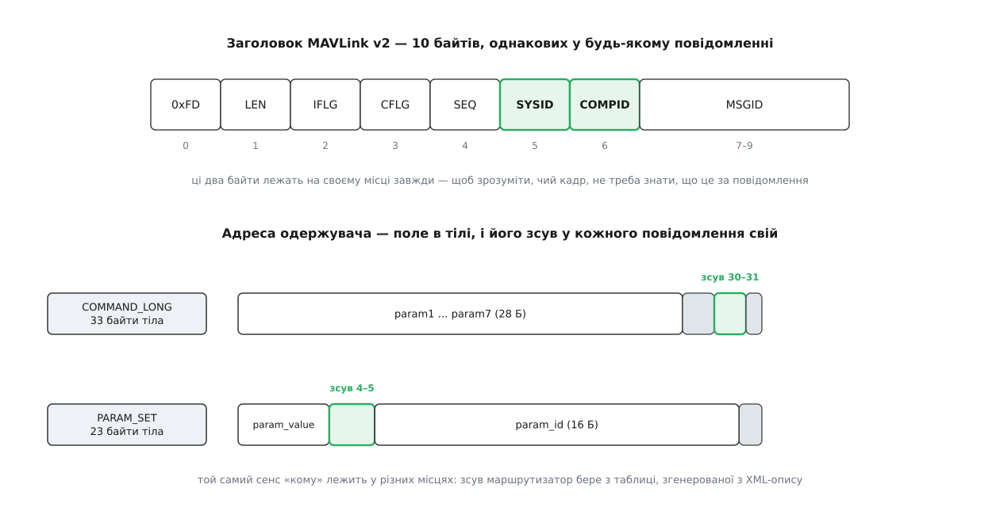
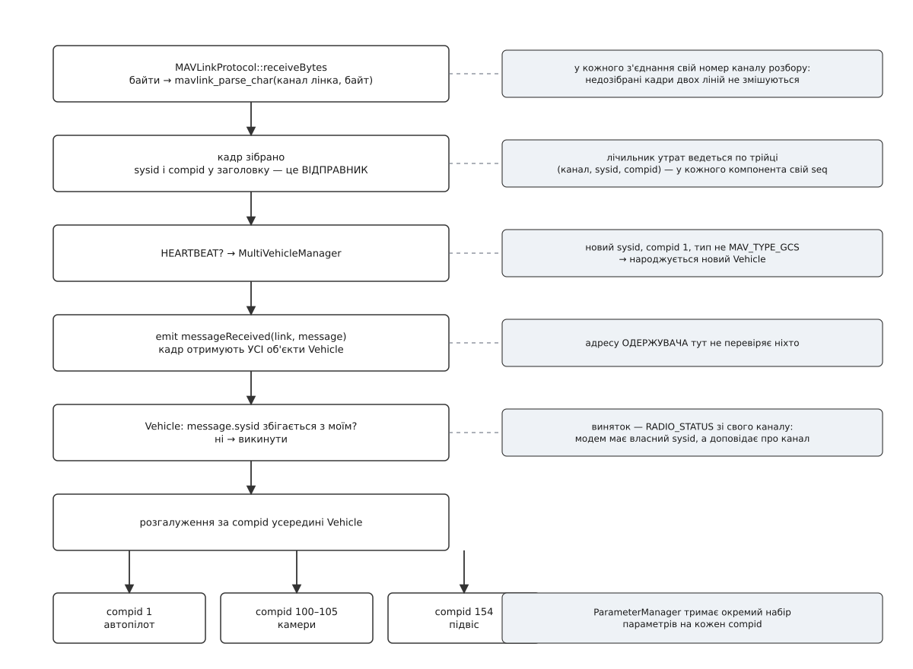
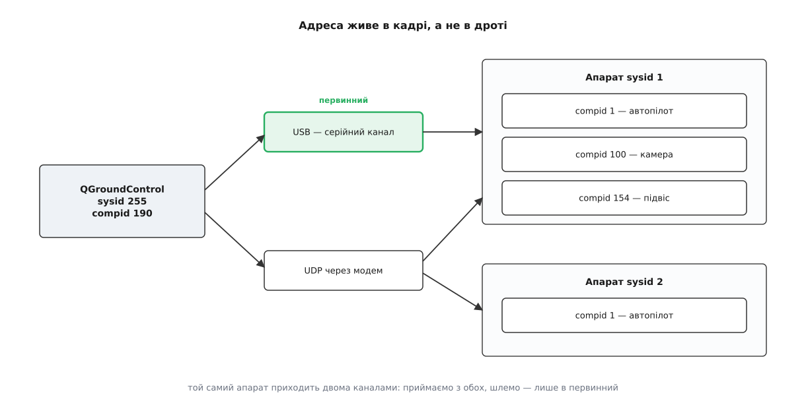

# Маршрутизація за sysid і compid

<preknowlist>
- [Пакет MAVLink](root:sys-dron/mavlink-packet) — з чого складається кадр: стартовий байт, довжина, порядковий номер, ідентифікатори, номер повідомлення, контрольна сума.
- [Керування й телеметрія](root:sys-dron/control-telemetry) — що таке heartbeat і який безперервний потік значень апарат шле на землю.
- [Обробка MAVLink у станції](root:sys-dron/mavlink-handling) — як із байтового потоку виходять цілі кадри й навіщо кожному з'єднанню окремий номер каналу розбору.
- [Vehicle](root:sys-dron/vehicle-object) — об'єкт застосунку, що відповідає одному апаратові й накопичує його стан.
- [Менеджер каналів](root:sys-dron/link-manager) — що таке канал (лінк) усередині застосунку і як він живе від під'єднання до розриву.
</preknowlist>

Стенд найпростіший з можливих: USB-кабель від польотного контролера до ноутбука. Один порт, один потік байтів, на тому кінці одна плата. Питання «від кого це прийшло» тут наче й не має сенсу.

Подивімося, що насправді тече цим кабелем. Автопілот раз на секунду шле `HEARTBEAT` і десятки разів на секунду — телеметрію. Камера, підвішена під апаратом і з'єднана з автопілотом власною шиною, шле свій окремий `HEARTBEAT` і свої звіти — автопілот просто перекладає їх у кабель, не змінюючи. Так само робить підвіс. Якщо замість кабелю стоїть телеметрійний модем, у той самий потік вставляє свої кадри ще й модем — доповідає рівень сигналу й завантаження ефіру. А коли з'єднання йде мережею, у порт може прилетіти геть чужий трафік: друга наземна станція, симулятор, бортовий комп'ютер сусіда по столу.

Дріт, отже, не є адресою. Навіть один-єдиний фізичний канал несе кадри від кількох незалежних відправників, і станція мусить їх розрізняти.

Дзеркальна потреба виникає в другий бік. Станція хоче наказати: «зброїтись». MAVLink не має ані з'єднання, ані сесії, ані рукостискання — кадр просто вилітає в середовище. Якщо в тому середовищі два апарати, обидва його почують. Отже, і адреса одержувача теж мусить бути в самому кадрі.

Дві потреби — «від кого» і «кому» — у MAVLink розв'язані принципово по-різному. Ця асиметрія й визначає все влаштування маршрутизації в станції: чому одні перевірки в коді є, а інших немає, чому станція бачить чужі кадри й ігнорує їх, чому два дрони з однаковим номером зливаються в одного, і чому пересилання трафіку в QGroundControl зроблене саме дзеркалом, а не роутером.

## Два байти в заголовку

Відправника описують два числа, і обидва лежать у заголовку кожного кадру без винятку.

**Система** (`sysid`, від гр. *sýstēma* — складене докупи ціле) — це один самостійний учасник мережі: дрон, наземна станція, симулятор. Усе, що має власний обчислювач і власну волю, — окрема система.

**Компонент** (`compid`, від лат. *componens* — складова) — частина всередині системи: автопілот, камера, підвіс, бортовий комп'ютер, приймач ADS-B. Компоненти однієї системи ділять її номер і різняться лише другим числом.

У MAVLink v2 заголовок займає десять байтів, і `sysid` із `compid` стоять шостим і сьомим — одразу за порядковим номером і перед тризначним номером повідомлення. У v1 заголовок коротший — шість байтів, — але порядок той самий: після `seq` ідуть `sysid` і `compid`.



*Адреса відправника лежить на фіксованому місці заголовка, адреса одержувача — на різних місцях у тілі різних повідомлень.*

Фіксоване місце в заголовку — не дрібниця зручності, а те, що робить маршрутизацію взагалі можливою. Розбирач може натрапити на повідомлення з номером, якого він не знає: чужий діалект, свіжа версія протоколу, [власне повідомлення](root:sys-dron/custom-mavlink-messages) виробника. Тіло такого кадру для нього — набір байтів без сенсу. Але `sysid` і `compid` він прочитає однаково, бо вони не в тілі. Отже, рішення «чиє це» ухвалюється **до** і **незалежно від** розуміння змісту.

## У заголовку немає одержувача

У переліку полів заголовка найлегше не помітити того, чого в ньому немає. Стартовий байт, довжина, два байти прапорців, порядковий номер, `sysid`, `compid`, номер повідомлення — і все. Поля «кому» серед них немає.

Це означає, що MAVLink за замовчуванням **широкомовний**: кадр летить у середовище до всіх, хто його почує, і кожен слухач сам вирішує, чи це його справа. Ніхто нікому нічого не адресує — усі просто говорять уголос.

Рішення виглядає марнотратним, доки не подивитися, з чого складається трафік. Дев'ять із десяти кадрів — це телеметрія: положення, кути, напруга, супутники, режим польоту. У такого кадру **немає адресата за самою його природою**. Апарат не доповідає про свій крен комусь конкретному — він просто повідомляє про себе. Якби протокол вимагав указати одержувача, апаратові довелося б або вигадувати його, або писати «всім», тобто те саме широкомовлення, тільки за два зайві байти.

Звідси й перший практичний наслідок: телеметрія одна на всіх. Дві станції, під'єднані до одного апарата, бачать однаковий потік і не заважають одна одній. Апаратові не треба знати, скільки в нього слухачів, і не треба нічого дублювати — це властивість протоколу, а не хитрість станції.

## Адресат з'являється там, де він потрібен

Команда «зброїтись» без адресата безглузда. Тому в тих повідомленнях, де адресат є, він оформлений як звичайні поля тіла: `target_system` і `target_component` — по одному байту.

Таких повідомлень приблизно третина словника: команди `COMMAND_LONG` і `COMMAND_INT`, робота з параметрами `PARAM_SET` і `PARAM_REQUEST_READ`, увесь протокол місій, запити на потоки даних, керування камерою. Тобто рівно те, що робить наземна станція, коли не просто дивиться.

Може здатися, що два байти адресата варто було винести в заголовок разом із рештою — хай будуть завжди, аби простіше. Порахуймо ціну:

**Скільки коштували б два зайві байти в кожному кадрі на телеметрійному каналі 57600 бод.**

```
темп потоку телеметрії        ≈ 30 кадрів/с
два зайві байти на кадр       30 × 2      = 60 Б/с
пропускна здатність 8N1       57600 / 10  = 5760 Б/с
частка                        60 / 5760   ≈ 1.0 %
```

Один відсоток — це мало. Отже, справжня причина не в економії смуги.

Причина в тому, що заголовок MAVLink **однаковий для всіх повідомлень**, а тіло — те, що генератор кодує з XML-опису кожного повідомлення окремо. Поля `target_system` і `target_component` — це поля конкретних повідомлень, як `param_value` чи `command`: вони описані в XML разом з усіма іншими й обробляються генератором без жодного винятку. Винести їх у заголовок означало б завести в протоколі особливий різновид поля — таке, що описується в тілі, а лежить у заголовку, та ще й лише в частини повідомлень. Заголовок перестав би бути сталим, а сталість заголовка — це саме те, на чому тримається розбір незнайомих повідомлень.

Ціна цього рішення реальна й лягає на того, хто маршрутизує.

## Ціна: щоб прочитати адресата, треба знати зсув

Поля тіла в MAVLink переставляються при кодуванні — спершу найбільші, потім дрібніші, — тож `target_system` опиняється в кожного повідомлення на своєму місці. У `COMMAND_LONG`, де попереду сім чотирибайтових параметрів і двобайтова команда, він стоїть на зсуві 30. У `PARAM_SET`, де попереду лише одне чотирибайтове значення, — на зсуві 4.

Маршрутизатор, який має переслати кадр далі, мусить дізнатися адресата, не розбираючи повідомлення (розібрати він і не може — повідомлень тисячі, і чужі діалекти серед них). Розв'язок — таблиця, яку генератор коду складає з того самого XML-опису: для кожного номера повідомлення в ній лежать контрольні дані й **зсуви полів адресата**.

```c
typedef struct __mavlink_msg_entry {
    uint32_t msgid;
    uint8_t  crc_extra;
    uint8_t  min_msg_len;
    uint8_t  max_msg_len;
    uint8_t  flags;                 // 1 — є target_system, 2 — є target_component
    uint8_t  target_system_ofs;     // зсув у тілі, а не в кадрі
    uint8_t  target_component_ofs;
} mavlink_msg_entry_t;
```

Читання адресата з довільного кадру виглядає так:

```c
uint8_t target_sys = 0, target_comp = 0;   // 0 — «широкомовно»
const mavlink_msg_entry_t *e = mavlink_get_msg_entry(msg->msgid);

if (e) {
    if (e->flags & MAV_MSG_ENTRY_FLAG_HAVE_TARGET_SYSTEM) {
        target_sys = _MAV_PAYLOAD(msg)[e->target_system_ofs];
    }
    if (e->flags & MAV_MSG_ENTRY_FLAG_HAVE_TARGET_COMPONENT) {
        target_comp = _MAV_PAYLOAD(msg)[e->target_component_ofs];
    }
}
```

Незнайомий номер повідомлення дає `e == NULL` — і кадр лишається з адресою «нулі», тобто широкомовним. Це свідомо безпечна відмова: невідоме розсилається всім, а не губиться. Як на цій основі будується справжній маршрутизатор — з таблицею «кого й на якому каналі я вже чув» і захистом від петель — розібрано [окремо, з робочим кодом](root:sys-dron/message-routing/proj-router-dispatch.md).

## Нуль означає «всі»

Обидва байти адресата мають особливе значення нуля, і воно різне для кожного:

- `target_system = 0` — кадр призначено **всій мережі**: кожен, хто його почув, має його обробити.
- `target_system = N`, `target_component = 0` — кадр призначено **всім компонентам системи N**.
- обидва ненульові — кадр призначено рівно одному компонентові.

Правило споживання випливає звідси прямо: компонент бере кадр собі, якщо `target_system` нульовий, або якщо він збігається з власним номером системи, а `target_component` при цьому нульовий або теж збігається.

Зверніть увагу на асиметрію з полями заголовка. Нуль як **ціль** означає «всі». Нуль як **джерело** не означає нічого: система з номером 0 не існує, бо адресувати їй кадр було б неможливо. Тому кадр із `sysid = 0` у заголовку — це або несправність, або сміття на лінії, і станція відкидає такого відправника, не намагаючись завести для нього апарат.

> 🔧 **Навіщо це.** Найпідступніша поломка в MAVLink-мережі — це саме нуль, поставлений замість номера. Команда з `target_system = 0` виконається **всіма** апаратами в ефірі; при налагодженні з одним дроном це непомітно, а на груповому польоті обертається одночасним «повернутись додому» у всіх. Тому в інспекторі трафіку варто дивитися не лише на номер повідомлення, а й на пару полів адресата: половина «незрозумілої поведінки» пояснюється тим, що кадр адресовано ширше, ніж автор гадав.

## Ретрансляція: правило, що гасить лавину

Вузол із кількома каналами — бортовий комп'ютер, роутер, станція з увімкненим пересиланням — має вирішувати не тільки «чи це моє», а й «чи слати це далі». Офіційне правило протоколу переслати кадр дозволяє в трьох випадках: коли він широкомовний; коли адресовану систему **вже чули** саме на цьому каналі; коли адресовано конкретний компонент, якого на цьому каналі теж уже чули.

Ключова умова — «вже чули». Без неї маршрутизатор розсилав би кожен адресний кадр у всі канали навмання, а два таких маршрутизатори поруч утворили б петлю: кадр ходив би між ними, доки не переповнив би канал. Вимога попереднього знайомства перетворює наївну розсилку на таблицю досяжності, яка будується сама зі спостереження за трафіком — жодного протоколу маршрутизації, жодних оголошень, лише пам'ять про те, хто звідки говорив.

## Станція розбирає за відправником, а не за адресатом

Тепер видно, чим QGroundControl **не є**. Він не маршрутизатор: у нього немає таблиці досяжності, і жодне рішення «переслати чи ні» він за адресатом не ухвалює. Він кінцевий вузол — і поводиться відповідно.

Наслідок, який спершу дивує: у вхідному тракті станції поля `target_system` і `target_component` не перевіряються практично ніде. Фільтр, який відділяє своє від чужого, дивиться на `sysid` **відправника**.

Це не недогляд, а точний висновок із того, як станція влаштована. У станції один-єдиний «жилець» на всю власну адресу — вона сама. Кадр, який до неї фізично дійшов, або надіслав відомий їй апарат — і тоді він потрібен, — або надіслав хтось інший — і тоді він станцію не стосується, хоч би кому був адресований. Перевірка адресата нічого до цього не додала б: вона відсіяла б рівно ті самі кадри, тільки повільніше й через таблицю зсувів.

Другий наслідок помітний за поведінкою. Коли в мережі працює друга наземна станція, її команди фізично долітають до QGroundControl. Джерело в них чуже — не той `sysid`, що в апарата, — тож жоден `Vehicle` їх не візьме, і на екрані вони ніяк не проявляться. Побачити їх можна лише в інспекторі MAVLink, який показує сирий потік до всякої фільтрації. Станція не «пропускає» чужі команди — вона їх бачить і свідомо не вважає своїми.

## Ланцюг диспетчеризації

Шлях кадру від байта до потрібного об'єкта складається з кількох послідовних звужень, і на кожному працює своя частина адреси.



*На вході станція звужує потік трьома ситами поспіль: канал розбору, номер системи, номер компонента.*

**Розбір — окремо для кожного з'єднання.** `MAVLinkProtocol::receiveBytes` згодовує байти розбирачеві разом із номером каналу, який належить саме цьому лінку:

```cpp
for (uint8_t byte : data) {
    const uint8_t mavlinkChannel = link->mavlinkChannel();
    mavlink_message_t message{};
    mavlink_status_t  status{};
    const uint8_t framing = mavlink_parse_char(mavlinkChannel, byte, &message, &status);
    // …
}
```

Номер каналу — не адреса, а комірка пам'яті: розбирач тримає в ній недозібраний кадр. Змішайте два з'єднання в одному каналі — і половина кадру з USB зіллється з половиною кадру з радіо, давши на виході сміття з правильною контрольною сумою рівно ніколи. Канали видає менеджер каналів, і їх скінченна кількість: `MAVLINK_COMM_NUM_BUFFERS`, за замовчуванням 16 на настільних платформах.

**Облік утрат — по трійці.** Порядковий номер `seq` у заголовку зростає на одиницю з кожним кадром, і за розривами в ньому рахують загублені пакети. Але лічильник у станції ведеться не на канал і не на систему, а на трійку:

```cpp
uint8_t& lastSeq = _lastIndex[mavlinkChannel][message.sysid][message.compid];
```

Причина проста: `seq` веде **кожен компонент окремо**. Автопілот і камера в одному потоці мають дві незалежні послідовності, і спільний лічильник бачив би на їхньому чергуванні суцільні стрибки — доповідав би десятки відсотків утрат на бездоганному кабелі. Про самі властивості наскрізної нумерації є [окрема тема](root:com-transport/sequence-numbering).

**Heartbeat — окремою дорогою.** Кадр `HEARTBEAT` крім загального шляху йде ще й до реєстру апаратів разом з адресою відправника:

```cpp
emit vehicleHeartbeatInfo(link, message.sysid, message.compid, heartbeat.autopilot, heartbeat.type);
```

Саме тут із адреси народжується об'єкт: невідомий `sysid` плюс `compid`, що дорівнює номеру першого автопілота, плюс тип апарата, який не є наземною станцією, — і застосунок заводить новий `Vehicle`. Повний набір фільтрів і те, чому їх стільки, розібрано в темі про [об'єкт апарата](root:sys-dron/vehicle-object).

**Розсилка й фільтр за системою.** Далі кадр іде сигналом `messageReceived(link, message)` до всіх об'єктів `Vehicle` одразу, і кожен відсіює чуже сам:

```cpp
if (message.sysid != _systemID && message.sysid != 0) {
    // виняток: RADIO_STATUS зі свого каналу
    if (!(message.msgid == MAVLINK_MSG_ID_RADIO_STATUS && _vehicleLinkManager->containsLink(link))) {
        return;
    }
}
```

Фільтр тривіальний, і саме в цьому його сила: [кілька апаратів у застосунку](root:sys-dron/multi-vehicle) не потребують ані таблиці, ані диспетчера — кожен бачить увесь потік і бере з нього своє. Виняток для `RADIO_STATUS` показує межу правила: телеметрійний модем — самостійна система з власним номером, а рівень сигналу, який він доповідає, стосується не його, а каналу й апарата на тому кінці. Тому кадр приймають за ознакою каналу, а не адреси.

**Розгалуження за компонентом.** Усередині `Vehicle` в діло вступає другий байт. Найпростіший його вжиток — відсікання: більшість обробників телеметрії починаються з перевірки `message.compid != _defaultComponentId`, бо режим польоту й положення апарата має доповідати автопілот, а не камера. Складніший — розмноження: менеджер камер бере кадри з діапазону номерів, відведеного камерам, і **на кожен номер заводить окремий об'єкт камери**:

```cpp
const bool fromCamera = (message.compid >= MAV_COMP_ID_CAMERA) && (message.compid <= MAV_COMP_ID_CAMERA6);
```

Так само влаштований [менеджер параметрів](root:sys-dron/parameter-manager): у кожного компонента власний набір параметрів із власними іменами й власною лічбою, тож `compid` там — ключ верхнього рівня, а не фільтр.

## Адреса не збігається з каналом

Адреса й канал — різні речі, і різниця стає відчутною, щойно апарат приходить двома дорогами одночасно: USB-кабелем на столі й телеметрійним модемом.



*Один апарат може приходити кількома каналами, один канал може нести кілька апаратів — адреса й дріт не пов'язані.*

На вході це нічого не міняє: обидва канали віддають кадри тому самому `Vehicle`, бо `sysid` у них однаковий. Дублювання нешкідливе — телеметрія перезаписує факти новішим значенням, а лічильники втрат ведуться на канал і тому не плутаються.

На виході — міняє все. `Vehicle` тримає список своїх каналів (кожен зі своїм таймером heartbeat, щоб помітити зникнення саме цього каналу) і вибирає з них **первинний** за сталим порядком переваги: пряме USB-з'єднання краще за звичайний радіоканал, звичайний — за високолатентний супутниковий. Команди йдуть у первинний, і тільки в нього.

Причина, чому не в усі: команда, послана двома каналами, буде **виконана двічі**. Для «зроби фото» це зайвий кадр, для «злети на 10 метрів» — уже неприємно, а для команд із лічильником підтверджень плутанина ще й зіпсує звірку відповідей: станція чекає одне `COMMAND_ACK`, а отримує два, і друге виглядає як відповідь на наступну команду. Прийом із усіх каналів дає надлишковість, передача в один — однозначність; ці дві вимоги суперечать одна одній, і розведені вони саме так.

> 🔧 **Навіщо це.** Класична скарга «телеметрія йде, а команди не доходять» майже завжди означає, що первинним обрано не той канал. Апарат видно обома дорогами, індикатори живі — але команди летять, скажімо, у супутниковий канал із затримкою в кілька секунд, і підтвердження не встигає прийти до того, як станція здасться. Тому при діагностиці варто дивитися не на факт з'єднання, а на те, який канал зараз первинний і чи не з'явився поруч кращий.

## Куди станція ставить адресу, коли шле

Власна адреса застосунку складається з тих самих двох чисел, але з різних джерел.

Номер системи береться з налаштувань і за замовчуванням дорівнює **255**. Це не вимога протоколу, а домовленість: апарати нумерують від 1 угору, наземні станції — від 255 униз, і два діапазони довго не зустрічаються. Змінювати його доводиться лише тоді, коли в мережі працює друга станція.

Номер компонента ніде не налаштовується — це стала:

```cpp
static int getComponentId() { return MAV_COMP_ID_MISSIONPLANNER; }
```

Число за цим іменем — 190, і назва в ньому історична: колись його завела інша наземна станція, а тепер це фактичний номер «той, хто планує місії» для будь-якої станції. Разом із рештою зарезервованих номерів систем і компонентів, які трапляються в трафіку дрона, він зібраний в [окремій довідці](root:sys-dron/message-routing/api-mavlink-ids.md).

Адресу одержувача станція проставляє за простим правилом: `target_system` — це `sysid` апарата, а `target_component` залежить від того, з ким саме йде розмова. Команди польоту, місії й параметри автопілота адресуються номеру автопілота, який `Vehicle` зберігає як компонент за замовчуванням; команди камери — номеру тієї камери, з якою працює екран; окремі запити йдуть на нуль, тобто всім компонентам системи. Помилка в цьому місці дає найтихішу з можливих поломок: кадр іде в ефір, апарат його чує, але жоден компонент не вважає його своїм — і у відповідь не приходить нічого. Ані помилки, ані відмови, просто мовчання.

І ще одне: станція шле в ефір власний `HEARTBEAT` — з тією самою парою чисел і з типом «наземна станція». Це не ввічливість. Автопілот вимикає бортовий контроль по відмові зв'язку, доки чує землю, а деякі прошивки за heartbeat станції вирішують, чи можна виконувати команди. Вимкнути емісію в налаштуваннях можна, і документація радить цього не робити.

## Пересилання — дзеркало, а не роутер

Іноді трафік потрібен ще комусь: другій станції, скрипту на pymavlink, симулятору. У QGroundControl для цього є перемикач «Enable MAVLink forwarding» (вимкнений за замовчуванням) і поле з адресою вузла. Ось увесь механізм:

```cpp
void MAVLinkProtocol::_forward(const mavlink_message_t& message)
{
    if (message.msgid == MAVLINK_MSG_ID_SETUP_SIGNING) {
        return;
    }
    if (!SettingsManager::instance()->mavlinkSettings()->forwardMavlink()->rawValue().toBool()) {
        return;
    }
    SharedLinkInterfacePtr forwardingLink = LinkManager::instance()->mavlinkForwardingLink();
    if (!forwardingLink) {
        return;
    }
    const QByteArray bytes = MAVLinkSigning::serializeUnsignedCopy(message);
    (void)forwardingLink->writeBytesThreadSafe(bytes.constData(), bytes.size());
}
```

Прочитаймо, чого тут **немає**. Немає звернення до таблиці зсувів — адресат кадру не цікавить нікого. Немає таблиці «кого я чув на якому каналі». Немає вибору каналу: канал рівно один. Немає зворотного шляху — те, що прилетить від вузла-одержувача, станція ігнорує.

Отже, це не маршрутизація за правилами протоколу, а копія потоку в один бік: дзеркало. Назвати це роутером було б перебільшенням, і саме тому воно поводиться передбачувано — обійти правило «пересилати лише в канали, звідки чули потрібну систему» неможливо там, де каналів пересилання один і напрямок один. Петля з двох станцій, що дзеркалять одна одній, усе-таки можлива, але вимагає, щоб її свідомо налаштували з обох боків.

Два винятки в цьому коді варті окремого погляду, бо обидва — про підпис. `SETUP_SIGNING` не пересилається взагалі: цей кадр несе секретний ключ, і копіювати його стороннім вузлам не можна за жодних обставин. А решта кадрів іде **копією без підпису**, бо [підпис MAVLink v2](root:sys-dron/mavlink-v2-signing) рахується разом з ідентифікатором лінка й міткою часу відправника: переслана в інший канал, вона однаково не пройшла б перевірку, тож її прибирають чесно, а не лишають зіпсованою.

Коли ж потрібна саме маршрутизація — двонапрямна, з кількома станціями, бортовим комп'ютером і правилами досяжності, — її кладуть на окрему програму-роутер поруч зі станцією, а не на станцію. [Загальний устрій такого роутера](root:sys-dron/mavlink-routing) від застосунку не залежить.

## Що ламається на практиці

Майже всі поломки маршрутизації зводяться до одного: два учасники взяли собі однакове число.

**Два апарати з номером 1.** Заводський стандарт більшості прошивок — `sysid` 1, і два свіжих дрони в одному ефірі мають однакову адресу. Станція побачить **один** `Vehicle`: обидва потоки телеметрії ллються в один об'єкт, координати смикаються між двома точками, заряд стрибає. Гірше з командами — кадр із `target_system = 1` виконають обидва. Лікується єдиним способом: перед першим спільним польотом кожному апарату міняють параметр номера системи (`SYSID_THISMAV` в ArduPilot, `MAV_SYS_ID` у PX4) і перезавантажують борт.

**Дві станції з номером 255.** Симптоми тонші. Телеметрію обидві бачать нормально — вона широкомовна. А от відповіді на команди адресовані `target_system = 255`, тобто обом одразу; кожна станція вважає чужий `COMMAND_ACK` своїм і звіряє його зі своєю чергою команд. Наслідок — «команда не підтвердилась» на тій станції, що не посилала, і хибне підтвердження на іншій. Лікується зміною номера в налаштуваннях однієї зі станцій.

**Апарат із номером станції.** Якщо комусь дістався `sysid` 255, застосунок помітить збіг зі своїм і попередить окремо — саме тому, що з симптомів цю поломку впізнати майже неможливо.

**Компонент, що видає себе за автопілот.** Бортовий комп'ютер, який шле `HEARTBEAT` із номером компонента 1 і типом, схожим на апарат, породить на карті фантомний дрон. Фільтри при народженні `Vehicle` ловлять типові випадки, але не всі: остаточне слово тут за тим, хто налаштовував борт.

Спільна риса всіх чотирьох — жодна не проявляється як помилка. Немає ані повідомлення, ані розриву зв'язку: числа збіглися, протокол відпрацював бездоганно, просто зміст вийшов не той. Тому першою дією при дивній поведінці мережі варто перевіряти не якість каналу, а таблицю адрес — хто який номер у ній посідає.

## Два байти, з яких усе виростає

Уся маршрутизація в наземній станції — це надбудова над одним рішенням протоколу: в заголовку є відправник і немає одержувача. Звідси широкомовна телеметрія, яку не треба нікому адресувати. Звідси фільтр за джерелом замість перевірки адресата на вході. Звідси таблиця зсувів, потрібна лише тим, хто пересилає. Звідси ж і те, що станція, попри всю свою вагу в системі, лишається кінцевим вузлом, а не вузлом мережі — вона слухає ефір і говорить у нього, але не носить чужих слів.
